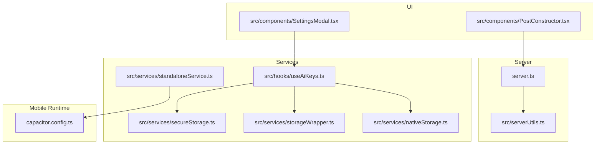
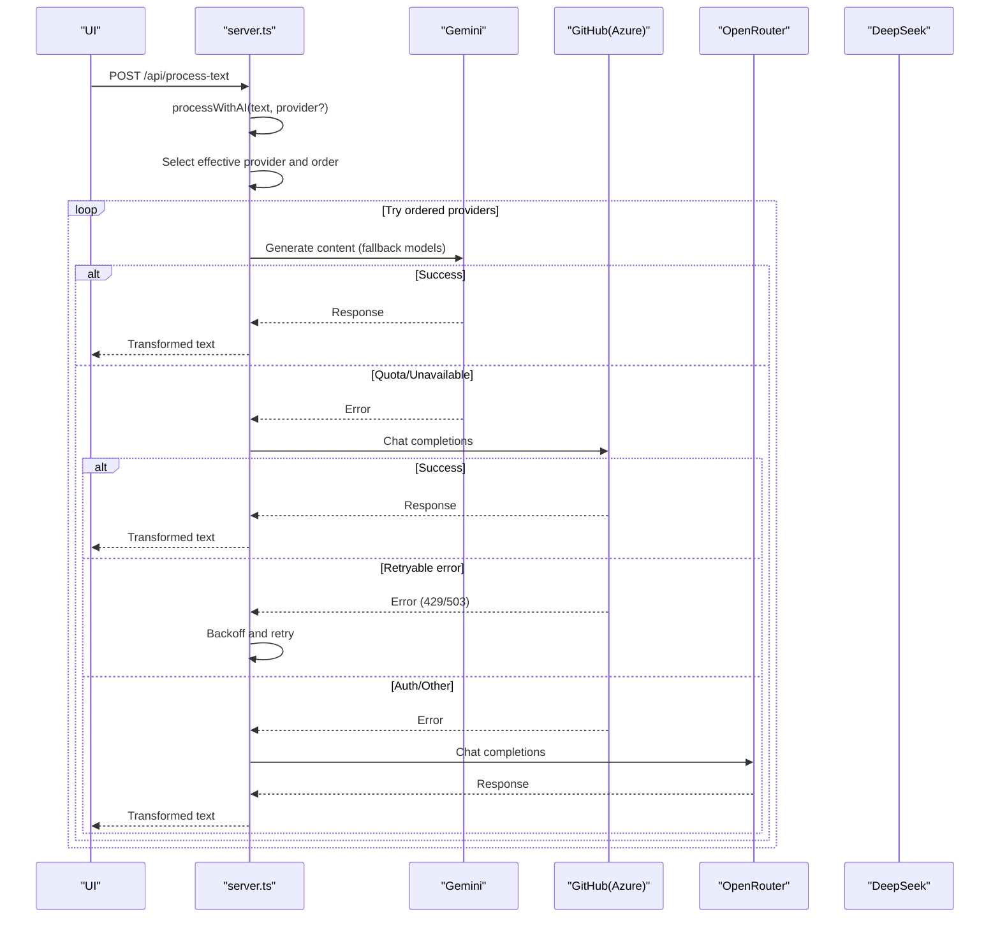
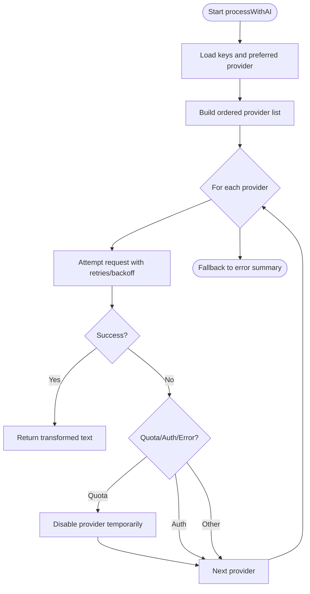
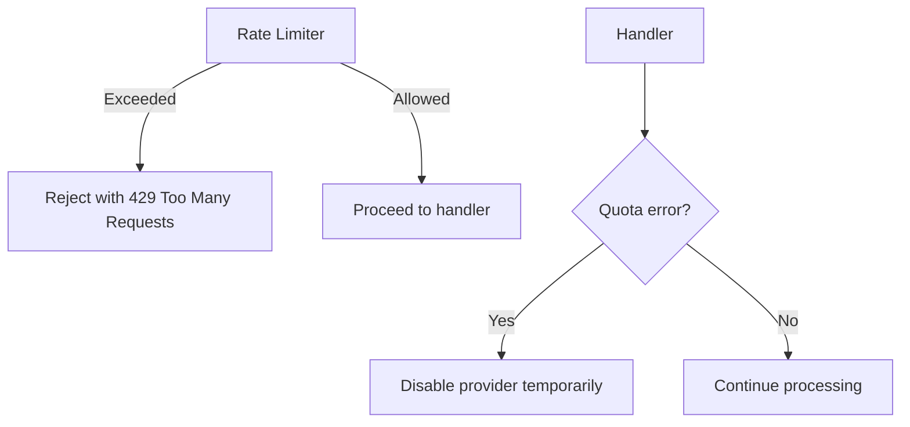
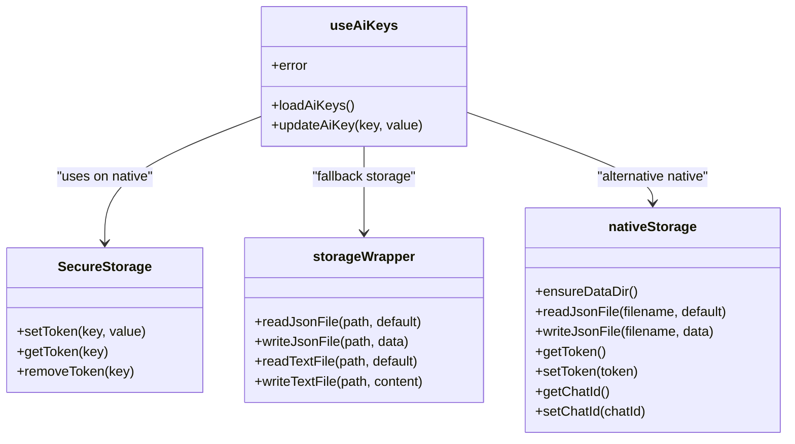
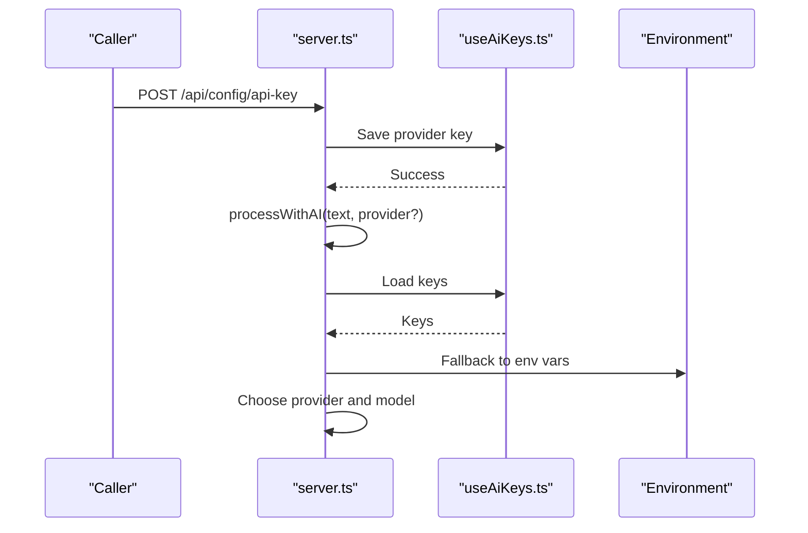
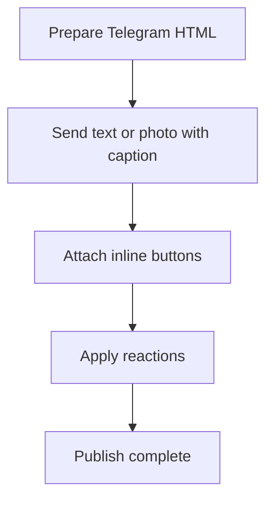
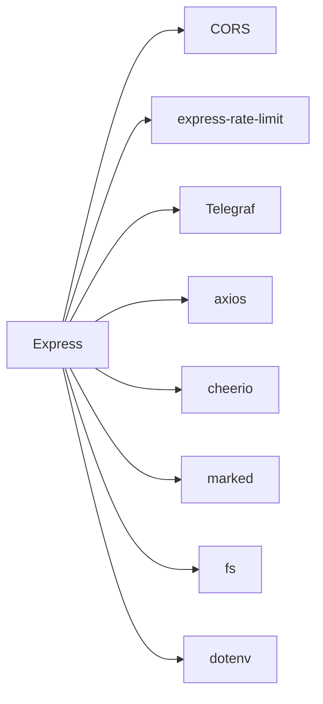

# AI Provider Integration

<cite>
**Referenced Files in This Document**
- [README.md](file://README.md)
- [package.json](file://package.json)
- [server.ts](file://server.ts)
- [src/hooks/useAiKeys.ts](file://src/hooks/useAiKeys.ts)
- [src/services/secureStorage.ts](file://src/services/secureStorage.ts)
- [src/services/storageWrapper.ts](file://src/services/storageWrapper.ts)
- [src/services/nativeStorage.ts](file://src/services/nativeStorage.ts)
- [src/services/standaloneService.ts](file://src/services/standaloneService.ts)
- [src/components/SettingsModal.tsx](file://src/components/SettingsModal.tsx)
- [src/components/PostConstructor.tsx](file://src/components/PostConstructor.tsx)
- [src/serverUtils.ts](file://src/serverUtils.ts)
- [src/types.ts](file://src/types.ts)
- [capacitor.config.ts](file://capacitor.config.ts)
</cite>

## Table of Contents
1. [Introduction](#introduction)
2. [Project Structure](#project-structure)
3. [Core Components](#core-components)
4. [Architecture Overview](#architecture-overview)
5. [Detailed Component Analysis](#detailed-component-analysis)
6. [Dependency Analysis](#dependency-analysis)
7. [Performance Considerations](#performance-considerations)
8. [Troubleshooting Guide](#troubleshooting-guide)
9. [Conclusion](#conclusion)
10. [Appendices](#appendices)

## Introduction
This document describes the multi-provider AI integration system that supports Gemini, GitHub (Azure OpenAI-compatible), OpenRouter, and DeepSeek. It explains the AI content processing pipeline, API configuration and authentication, content transformation, rate limiting and quota handling, fallback mechanisms, secure key management, provider selection logic, and operational guidance for performance and troubleshooting.

## Project Structure
The system comprises:
- A Node.js/Express server that orchestrates AI processing, Telegram bot operations, and persistence
- React-based UI components for configuration and content authoring
- Capacitor-based mobile runtime for native storage and HTTP
- Hook and service modules for secure key management and cross-platform storage

**Diagram sources**
- [server.ts:1-1454](file://server.ts#L1-L1454)
- [src/serverUtils.ts:1-23](file://src/serverUtils.ts#L1-L23)
- [src/components/SettingsModal.tsx:1-107](file://src/components/SettingsModal.tsx#L1-L107)
- [src/components/PostConstructor.tsx:1-294](file://src/components/PostConstructor.tsx#L1-L294)
- [src/hooks/useAiKeys.ts:1-57](file://src/hooks/useAiKeys.ts#L1-L57)
- [src/services/secureStorage.ts:1-40](file://src/services/secureStorage.ts#L1-L40)
- [src/services/storageWrapper.ts:1-100](file://src/services/storageWrapper.ts#L1-L100)
- [src/services/nativeStorage.ts:1-63](file://src/services/nativeStorage.ts#L1-L63)
- [src/services/standaloneService.ts:1-175](file://src/services/standaloneService.ts#L1-L175)
- [capacitor.config.ts:1-26](file://capacitor.config.ts#L1-L26)

**Section sources**
- [README.md:1-25](file://README.md#L1-L25)
- [package.json:1-70](file://package.json#L1-L70)
- [server.ts:1-1454](file://server.ts#L1-L1454)
- [capacitor.config.ts:1-26](file://capacitor.config.ts#L1-L26)

## Core Components
- AI processing engine: Orchestrates provider selection, authentication, content transformation, and fallback
- Rate limiters: Enforce global, AI-specific, and mutation limits
- Storage wrappers: Cross-platform persistence for API keys, posts, and settings
- Secure storage: Encrypted preferences on native platforms
- Telegram bot integration: Initialization, health monitoring, and publishing
- UI hooks and components: Manage API keys and content authoring

**Section sources**
- [server.ts:411-645](file://server.ts#L411-L645)
- [server.ts:51-72](file://server.ts#L51-L72)
- [src/hooks/useAiKeys.ts:1-57](file://src/hooks/useAiKeys.ts#L1-L57)
- [src/services/secureStorage.ts:1-40](file://src/services/secureStorage.ts#L1-L40)
- [src/services/storageWrapper.ts:1-100](file://src/services/storageWrapper.ts#L1-L100)
- [src/services/nativeStorage.ts:1-63](file://src/services/nativeStorage.ts#L1-L63)
- [src/services/standaloneService.ts:1-175](file://src/services/standaloneService.ts#L1-L175)

## Architecture Overview
The AI pipeline selects a preferred provider, attempts requests with retries, and falls back across providers and models. Rate limiting protects the server, while logging tracks outcomes. On mobile, Capacitor enables native HTTP and secure preferences.

**Diagram sources**
- [server.ts:411-645](file://server.ts#L411-L645)
- [server.ts:1150-1155](file://server.ts#L1150-L1155)

**Section sources**
- [server.ts:411-645](file://server.ts#L411-L645)
- [server.ts:1150-1155](file://server.ts#L1150-L1155)

## Detailed Component Analysis

### AI Content Processing Pipeline
- Provider selection: Uses a preferred provider from persistent storage or environment, then tries alternatives in order
- Authentication: Keys are merged from persistent storage and environment variables; provider-specific keys take precedence
- Content transformation: A fixed prompt guides translation and structuring for Telegram Markdown
- Fallback logic: Attempts multiple models for Gemini, retries with backoff for GitHub/OpenRouter, and continues to next provider on quota or auth failures
- Quota handling: Detects quota exhaustion and disables the provider temporarily; extracts retry hints from error messages
- Output sanitation: Ensures Telegram-safe HTML and Markdown conversion

**Diagram sources**
- [server.ts:411-645](file://server.ts#L411-L645)

**Section sources**
- [server.ts:411-645](file://server.ts#L411-L645)
- [server.ts:425-439](file://server.ts#L425-L439)

### Rate Limiting and Quota Management
- Global API limiter: 1000 requests per 15 minutes
- AI limiter: 50 requests per minute
- Mutation limiter: 100 requests per minute
- Quota detection: Parses provider error messages for quota exhaustion and retry hints; disables failing provider until next cycle
- Backoff strategy: Exponential backoff for retryable errors (429/503)

**Diagram sources**
- [server.ts:51-72](file://server.ts#L51-L72)
- [server.ts:548-562](file://server.ts#L548-L562)

**Section sources**
- [server.ts:51-72](file://server.ts#L51-L72)
- [server.ts:548-562](file://server.ts#L548-L562)

### Secure API Key Management
- Persistent storage: Keys are saved to platform-specific storage (native encrypted preferences or browser localStorage)
- UI hook: Loads and updates keys for Gemini, GitHub, OpenRouter, and DeepSeek
- Environment fallback: Keys can also be supplied via environment variables
- Native security: Capacitor Preferences encrypts on modern devices; warns in browser

**Diagram sources**
- [src/services/secureStorage.ts:1-40](file://src/services/secureStorage.ts#L1-L40)
- [src/services/storageWrapper.ts:1-100](file://src/services/storageWrapper.ts#L1-L100)
- [src/services/nativeStorage.ts:1-63](file://src/services/nativeStorage.ts#L1-L63)
- [src/hooks/useAiKeys.ts:1-57](file://src/hooks/useAiKeys.ts#L1-L57)

**Section sources**
- [src/hooks/useAiKeys.ts:1-57](file://src/hooks/useAiKeys.ts#L1-L57)
- [src/services/secureStorage.ts:1-40](file://src/services/secureStorage.ts#L1-L40)
- [src/services/storageWrapper.ts:1-100](file://src/services/storageWrapper.ts#L1-L100)
- [src/services/nativeStorage.ts:1-63](file://src/services/nativeStorage.ts#L1-L63)

### Provider Selection and Authentication
- Preferred provider: Stored persistently; defaults to Gemini if unspecified
- Authentication: Provider-specific keys are prioritized; environment variables serve as fallback
- Provider-specific endpoints and models:
  - Gemini: Models with safety settings; fallback across multiple models
  - GitHub (Azure): Fixed model gpt-4o-mini
  - OpenRouter: Fixed model gpt-4o-mini
  - DeepSeek: Model deepseek-chat

**Diagram sources**
- [server.ts:1038-1048](file://server.ts#L1038-L1048)
- [src/hooks/useAiKeys.ts:1-57](file://src/hooks/useAiKeys.ts#L1-L57)
- [server.ts:411-645](file://server.ts#L411-L645)

**Section sources**
- [server.ts:1038-1048](file://server.ts#L1038-L1048)
- [src/hooks/useAiKeys.ts:1-57](file://src/hooks/useAiKeys.ts#L1-L57)
- [server.ts:411-645](file://server.ts#L411-L645)

### Content Transformation and Publishing
- Transformation: Uses a fixed prompt to translate and structure content for Telegram
- Publishing: Sends text and images to Telegram chat with optional inline buttons and reactions
- Media handling: Supports base64 and server-side image paths; enforces safe paths and sizes
- Logging: Comprehensive logs for debugging and monitoring

**Diagram sources**
- [server.ts:806-934](file://server.ts#L806-L934)

**Section sources**
- [server.ts:806-934](file://server.ts#L806-L934)
- [src/serverUtils.ts:1-23](file://src/serverUtils.ts#L1-L23)

### Mobile Runtime and Capacitor Integration
- Capacitor configuration enables HTTP plugin and allows navigation for development
- Standalone service uses Capacitor HTTP to bypass CORS and access Telegram APIs directly on device
- Native storage uses encrypted preferences on Android; warns in browser

**Section sources**
- [capacitor.config.ts:1-26](file://capacitor.config.ts#L1-L26)
- [src/services/standaloneService.ts:74-146](file://src/services/standaloneService.ts#L74-L146)
- [src/services/secureStorage.ts:1-40](file://src/services/secureStorage.ts#L1-L40)

## Dependency Analysis
External libraries and integrations:
- Express and middleware for HTTP routing and CORS
- Rate limiting for protection
- Telegram SDK for bot operations
- Axios for HTTP requests to providers
- Cheerio and Marked for HTML sanitization and Markdown rendering
- Capacitor plugins for filesystem, preferences, and HTTP

**Diagram sources**
- [package.json:19-55](file://package.json#L19-L55)
- [server.ts:1-17](file://server.ts#L1-L17)

**Section sources**
- [package.json:19-55](file://package.json#L19-L55)
- [server.ts:1-17](file://server.ts#L1-L17)

## Performance Considerations
- Prefer the preferred provider to reduce latency and avoid repeated fallbacks
- Monitor quota exhaustion and adjust usage patterns; the system automatically disables providers under quota pressure
- Use smaller images and avoid oversized media to reduce transfer time
- Batch image sends in groups of ten to minimize API calls
- Enable caching of frequently accessed content and avoid unnecessary reprocessing

## Troubleshooting Guide
Common issues and resolutions:
- Missing API keys: Ensure keys are set via UI or environment variables; check provider availability
- Quota exceeded: The system detects quota and suggests retry timing; reduce usage or switch providers
- Authentication errors: Verify token permissions and scopes; GitHub requires Azure-compatible permissions
- Network timeouts: Increase timeouts or retry; the system applies backoff for retryable errors
- Telegram connectivity: Health checks restart the bot on persistent failures; confirm token validity and network stability
- Path traversal and uploads: The server validates upload destinations and filenames; ensure safe paths and sizes

**Section sources**
- [server.ts:24-33](file://server.ts#L24-L33)
- [server.ts:548-562](file://server.ts#L548-L562)
- [server.ts:484-498](file://server.ts#L484-L498)
- [server.ts:377-409](file://server.ts#L377-L409)
- [server.ts:940-973](file://server.ts#L940-L973)

## Conclusion
The multi-provider AI integration system provides robust, fault-tolerant content processing with strong security and operational controls. By combining provider fallback, quota-aware behavior, and secure key management, it delivers reliable AI transformations suitable for production environments.

## Appendices

### Configuration Examples
- Environment variables:
  - GEMINI_API_KEY
  - GITHUB_TOKEN
  - OPENROUTER_API_KEY
  - DEEPSEEK_API_KEY
  - TELEGRAM_BOT_TOKEN
- UI configuration:
  - Set API keys per provider in the UI
  - Choose preferred provider
  - Configure Telegram bot token and default chat ID

**Section sources**
- [README.md:16-24](file://README.md#L16-L24)
- [server.ts:1038-1048](file://server.ts#L1038-L1048)