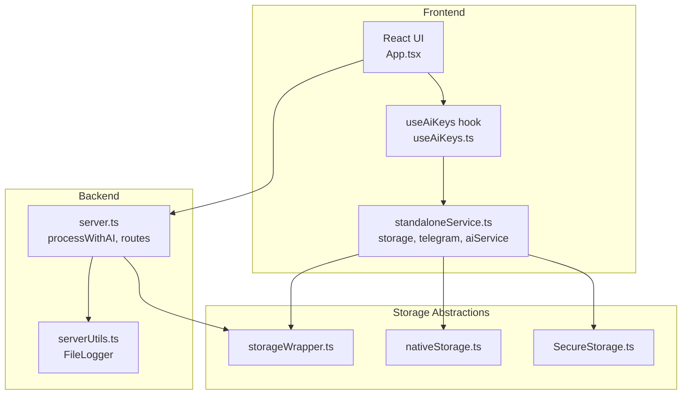
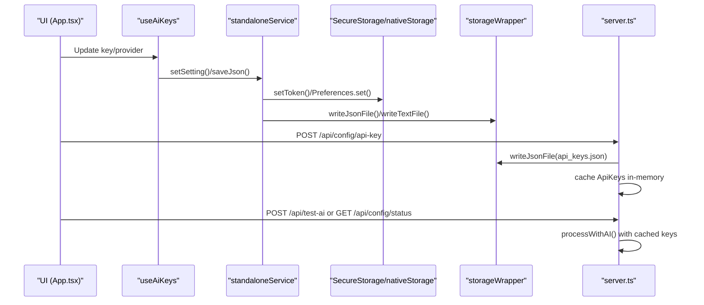
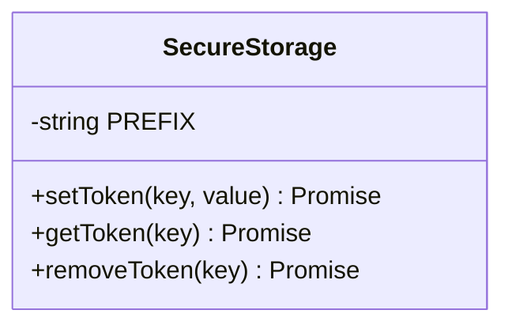
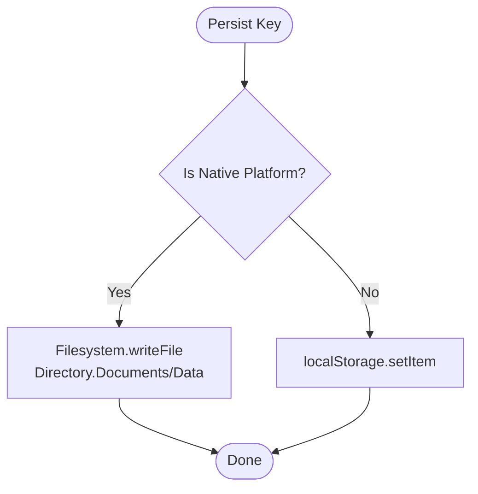
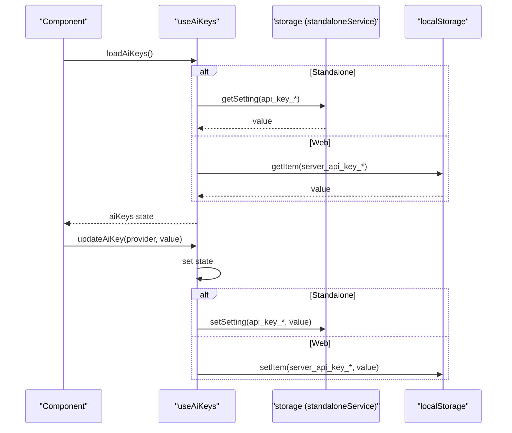
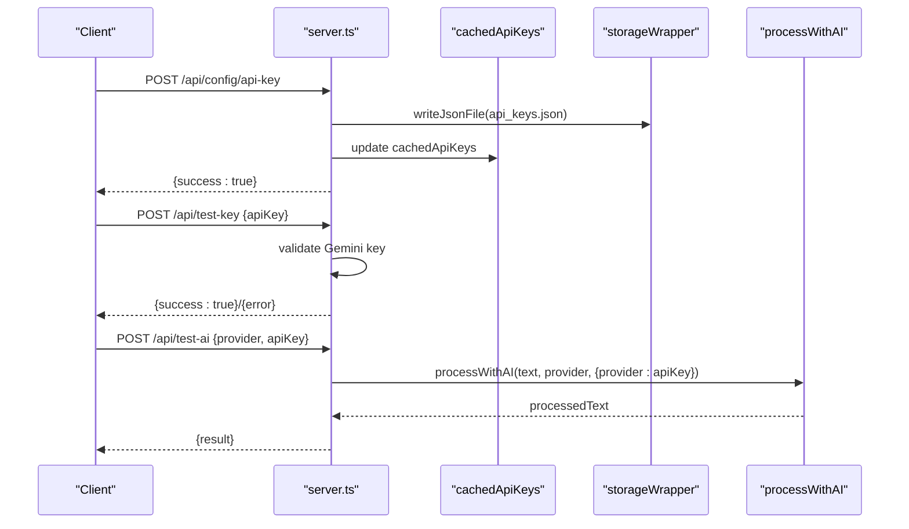
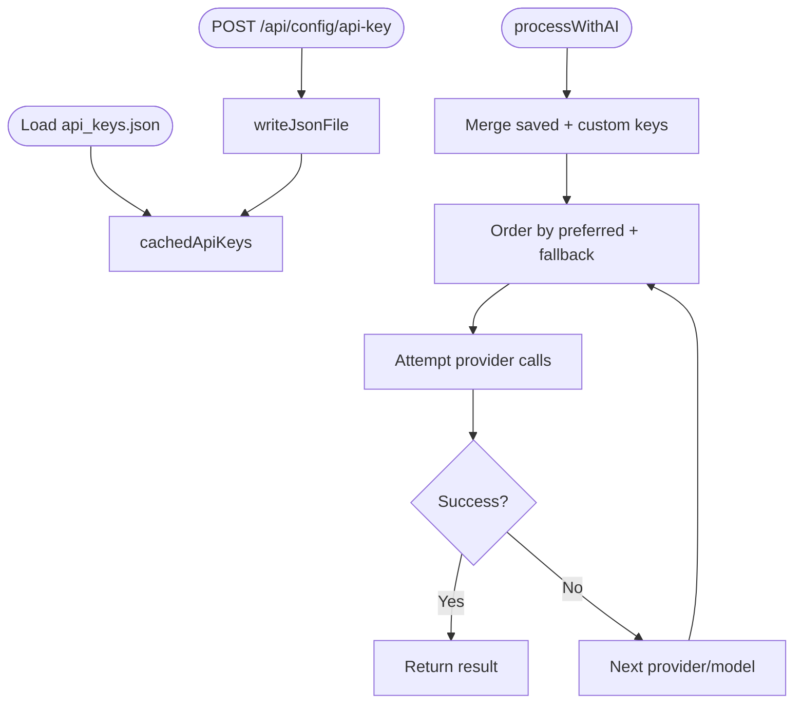
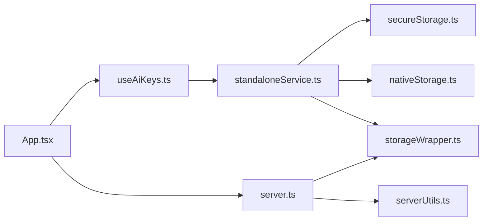

# API Key Management System

<cite>
**Referenced Files in This Document**
- [server.ts](file://server.ts)
- [secureStorage.ts](file://src/services/secureStorage.ts)
- [nativeStorage.ts](file://src/services/nativeStorage.ts)
- [standaloneService.ts](file://src/services/standaloneService.ts)
- [storageWrapper.ts](file://src/services/storageWrapper.ts)
- [useAiKeys.ts](file://src/hooks/useAiKeys.ts)
- [App.tsx](file://src/App.tsx)
- [README.md](file://README.md)
- [serverUtils.ts](file://src/serverUtils.ts)
</cite>

## Table of Contents
1. [Introduction](#introduction)
2. [Project Structure](#project-structure)
3. [Core Components](#core-components)
4. [Architecture Overview](#architecture-overview)
5. [Detailed Component Analysis](#detailed-component-analysis)
6. [Dependency Analysis](#dependency-analysis)
7. [Performance Considerations](#performance-considerations)
8. [Security Best Practices](#security-best-practices)
9. [Troubleshooting Guide](#troubleshooting-guide)
10. [Conclusion](#conclusion)

## Introduction
This document describes the API key management system for securely storing, validating, and using AI provider credentials across both native and web environments. It explains how keys are persisted, cached, validated, and integrated between frontend hooks and backend services. It also covers encryption characteristics, access control, and operational guidance for reliable authentication.

## Project Structure
The API key management spans three layers:
- Frontend React hooks and UI for capturing and updating keys
- Native/web storage abstractions for secure persistence
- Backend service for validation, caching, and provider orchestration

**Diagram sources**
- [App.tsx:1680-1720](file://src/App.tsx#L1680-L1720)
- [useAiKeys.ts:1-57](file://src/hooks/useAiKeys.ts#L1-L57)
- [standaloneService.ts:1-175](file://src/services/standaloneService.ts#L1-L175)
- [secureStorage.ts:1-40](file://src/services/secureStorage.ts#L1-L40)
- [nativeStorage.ts:1-63](file://src/services/nativeStorage.ts#L1-L63)
- [storageWrapper.ts:1-100](file://src/services/storageWrapper.ts#L1-L100)
- [server.ts:1038-1048](file://server.ts#L1038-L1048)
- [serverUtils.ts:1-23](file://src/serverUtils.ts#L1-L23)

**Section sources**
- [README.md:16-25](file://README.md#L16-L25)
- [server.ts:74-91](file://server.ts#L74-L91)

## Core Components
- SecureStorage: Provides encrypted preference-backed storage on native platforms and falls back to browser storage with a warning on web.
- nativeStorage: Manages filesystem and preferences for bot token and chat ID persistence.
- storageWrapper: Cross-platform abstraction for reading/writing JSON/text files to Capacitor Filesystem or Node.js filesystem.
- standaloneService: Exposes storage, Telegram API calls, and AI processing utilities for standalone mode.
- useAiKeys: React hook to load/update AI provider keys from persistent storage and manage UI state.
- server.ts: Central backend orchestrating AI processing, API key caching, and HTTP endpoints for key management and testing.

**Section sources**
- [secureStorage.ts:4-39](file://src/services/secureStorage.ts#L4-L39)
- [nativeStorage.ts:8-62](file://src/services/nativeStorage.ts#L8-L62)
- [storageWrapper.ts:9-98](file://src/services/storageWrapper.ts#L9-L98)
- [standaloneService.ts:11-72](file://src/services/standaloneService.ts#L11-L72)
- [useAiKeys.ts:4-56](file://src/hooks/useAiKeys.ts#L4-L56)
- [server.ts:84-95](file://server.ts#L84-L95)

## Architecture Overview
The system supports two modes:
- Standalone (native): Keys are stored via Capacitor Preferences and Filesystem APIs.
- Web/Server-managed: Keys are stored in JSON files and cached in memory for fast retrieval.

**Diagram sources**
- [App.tsx:1688-1715](file://src/App.tsx#L1688-L1715)
- [useAiKeys.ts:37-44](file://src/hooks/useAiKeys.ts#L37-L44)
- [standaloneService.ts:56-71](file://src/services/standaloneService.ts#L56-L71)
- [secureStorage.ts:7-19](file://src/services/secureStorage.ts#L7-L19)
- [nativeStorage.ts:34-54](file://src/services/nativeStorage.ts#L34-L54)
- [storageWrapper.ts:35-54](file://src/services/storageWrapper.ts#L35-L54)
- [server.ts:1038-1048](file://server.ts#L1038-L1048)
- [server.ts:412-645](file://server.ts#L412-L645)

## Detailed Component Analysis

### Secure Storage Implementation
SecureStorage abstracts platform-specific storage:
- On native platforms, keys are written to Capacitor Preferences, which offers device-level encryption on modern OS versions.
- On web, values are stored in localStorage with a warning that it is less secure than native storage.

**Diagram sources**
- [secureStorage.ts:4-39](file://src/services/secureStorage.ts#L4-L39)

**Section sources**
- [secureStorage.ts:7-38](file://src/services/secureStorage.ts#L7-L38)

### Native and Filesystem Persistence
nativeStorage provides:
- Ensuring a dedicated data directory on native devices
- Reading/writing JSON and text files via Capacitor Filesystem
- Persisting bot token and chat ID using Preferences

storageWrapper provides cross-platform file operations:
- Read/write JSON and text files
- Create directories as needed
- Fallback to Node.js filesystem on web

**Diagram sources**
- [nativeStorage.ts:16-46](file://src/services/nativeStorage.ts#L16-L46)
- [storageWrapper.ts:35-54](file://src/services/storageWrapper.ts#L35-L54)

**Section sources**
- [nativeStorage.ts:8-62](file://src/services/nativeStorage.ts#L8-L62)
- [storageWrapper.ts:9-98](file://src/services/storageWrapper.ts#L9-L98)

### Frontend Hook for API Keys
useAiKeys manages:
- Loading keys from either persistent storage or localStorage depending on standalone mode
- Updating keys and persisting them immediately
- Error handling for load/update operations

**Diagram sources**
- [useAiKeys.ts:8-44](file://src/hooks/useAiKeys.ts#L8-L44)
- [standaloneService.ts:56-71](file://src/services/standaloneService.ts#L56-L71)
- [App.tsx:1688-1715](file://src/App.tsx#L1688-L1715)

**Section sources**
- [useAiKeys.ts:4-56](file://src/hooks/useAiKeys.ts#L4-L56)
- [standaloneService.ts:11-72](file://src/services/standaloneService.ts#L11-L72)

### Backend API Key Validation and Provider Authentication
server.ts implements:
- Persistent storage of API keys in api_keys.json with in-memory cache
- Endpoint to save keys per provider or set preferred provider
- Endpoint to test a single key against Gemini
- Endpoint to test a provider/key combination
- Orchestrated AI processing with fallback across providers and models

**Diagram sources**
- [server.ts:1038-1048](file://server.ts#L1038-L1048)
- [server.ts:127-148](file://server.ts#L127-L148)
- [server.ts:1289-1326](file://server.ts#L1289-L1326)
- [server.ts:1328-1339](file://server.ts#L1328-L1339)
- [server.ts:412-645](file://server.ts#L412-L645)

**Section sources**
- [server.ts:84-95](file://server.ts#L84-L95)
- [server.ts:1038-1048](file://server.ts#L1038-L1048)
- [server.ts:127-148](file://server.ts#L127-L148)
- [server.ts:1289-1326](file://server.ts#L1289-L1326)
- [server.ts:1328-1339](file://server.ts#L1328-L1339)
- [server.ts:412-645](file://server.ts#L412-L645)

### Key Loading and Caching Strategies
- Backend loads api_keys.json into memory on startup and updates cache on writes.
- processWithAI merges saved keys with optional custom overrides, then attempts providers in priority order.
- Preferred provider is honored and providers are retried with fallback models and strategies.

**Diagram sources**
- [server.ts:127-148](file://server.ts#L127-L148)
- [server.ts:412-645](file://server.ts#L412-L645)

**Section sources**
- [server.ts:127-148](file://server.ts#L127-L148)
- [server.ts:412-645](file://server.ts#L412-L645)

### Custom API Key Overrides
- The test endpoint accepts a temporary override for a single call.
- processWithAI accepts a customApiKeys object that augments saved keys for that invocation.

**Section sources**
- [server.ts:1328-1339](file://server.ts#L1328-L1339)
- [server.ts:417-418](file://server.ts#L417-L418)

### Encryption, Persistence, and Access Control
- Encryption:
  - Native Preferences provides device-level encryption on modern devices.
  - Web fallback stores values in localStorage without encryption.
- Persistence:
  - Native: Capacitor Filesystem and Preferences.
  - Web: localStorage and Node.js filesystem.
- Access control:
  - Environment variables are supported for server-side keys.
  - Rate limits protect sensitive endpoints.
  - Path traversal protections in image endpoints.

**Section sources**
- [secureStorage.ts:8-18](file://src/services/secureStorage.ts#L8-L18)
- [nativeStorage.ts:34-54](file://src/services/nativeStorage.ts#L34-L54)
- [server.ts:44-72](file://server.ts#L44-L72)
- [server.ts:940-973](file://server.ts#L940-L973)
- [server.ts:1125-1144](file://server.ts#L1125-L1144)

### Configuration Examples and Setup
- Environment variables for server keys:
  - GEMINI_API_KEY
  - GITHUB_TOKEN
  - OPENROUTER_API_KEY
  - DEEPSEEK_API_KEY
- UI setup:
  - Manage API keys in the UI under the “Manage API Keys” section.
  - Choose preferred provider and save keys per provider.

**Section sources**
- [README.md:18-22](file://README.md#L18-L22)
- [App.tsx:1688-1715](file://src/App.tsx#L1688-L1715)

## Dependency Analysis
The following diagram shows key dependencies among components involved in API key management.

**Diagram sources**
- [App.tsx:1680-1720](file://src/App.tsx#L1680-L1720)
- [useAiKeys.ts:1-57](file://src/hooks/useAiKeys.ts#L1-L57)
- [standaloneService.ts:1-175](file://src/services/standaloneService.ts#L1-L175)
- [secureStorage.ts:1-40](file://src/services/secureStorage.ts#L1-L40)
- [nativeStorage.ts:1-63](file://src/services/nativeStorage.ts#L1-L63)
- [storageWrapper.ts:1-100](file://src/services/storageWrapper.ts#L1-L100)
- [server.ts:1-100](file://server.ts#L1-L100)
- [serverUtils.ts:1-23](file://src/serverUtils.ts#L1-L23)

**Section sources**
- [server.ts:1-100](file://server.ts#L1-L100)

## Performance Considerations
- Prefer in-memory cache for frequently accessed keys to minimize disk reads.
- Use batched updates when saving multiple keys to reduce IO operations.
- Limit retries and implement exponential backoff for provider calls to avoid throttling.
- Avoid large payloads in API key endpoints; keep request bodies minimal.

## Security Best Practices
- Use native mode for production to leverage device encryption for keys.
- Avoid exposing keys in logs or UI; mask tokens in status endpoints.
- Enforce rate limits on sensitive endpoints to mitigate abuse.
- Validate and sanitize all inputs, especially file paths and URLs.
- Rotate keys periodically and disable unused providers.

## Troubleshooting Guide
Common issues and resolutions:
- Authentication failures:
  - Verify the key is saved via UI or environment variable.
  - Use the test endpoints to validate a key or provider/key pair.
  - Check logs for detailed error messages and quota hints.
- Provider unavailability:
  - Confirm preferred provider and fallback models.
  - Inspect rate limit responses and retry delays.
- Persistence problems:
  - On web, confirm localStorage availability.
  - On native, ensure Capacitor plugins are properly installed and initialized.

**Section sources**
- [server.ts:1289-1326](file://server.ts#L1289-L1326)
- [server.ts:1328-1339](file://server.ts#L1328-L1339)
- [server.ts:368-375](file://server.ts#L368-L375)
- [server.ts:548-562](file://server.ts#L548-L562)

## Conclusion
The API key management system combines secure native storage, cross-platform file operations, and robust backend validation to provide a reliable mechanism for managing AI provider credentials. By leveraging in-memory caching, rate limiting, and clear test endpoints, it ensures both usability and security across environments.