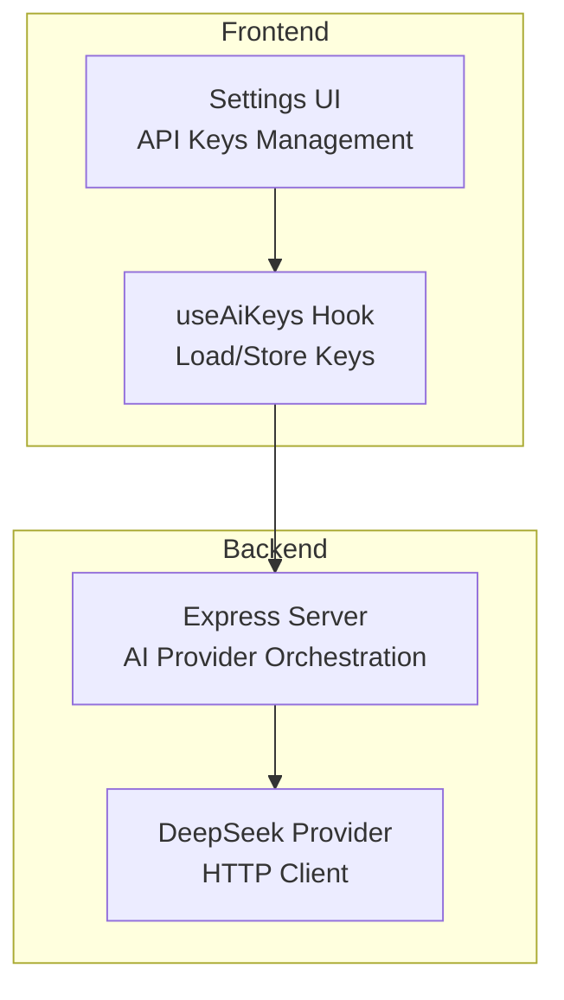
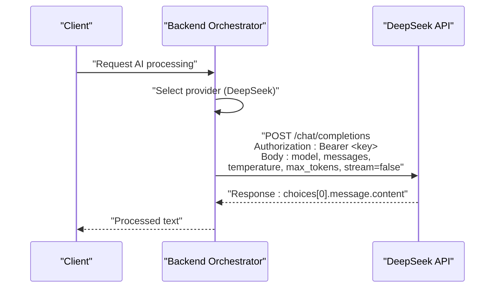
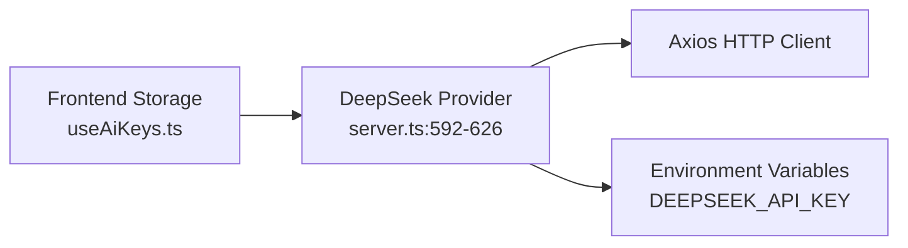

# DeepSeek Integration

<cite>
**Referenced Files in This Document**
- [server.ts](file://server.ts)
- [useAiKeys.ts](file://src/hooks/useAiKeys.ts)
- [App.tsx](file://src/App.tsx)
- [SettingsModal.tsx](file://src/components/SettingsModal.tsx)
- [README.md](file://README.md)
- [package.json](file://package.json)
</cite>

## Table of Contents
1. [Introduction](#introduction)
2. [Project Structure](#project-structure)
3. [Core Components](#core-components)
4. [Architecture Overview](#architecture-overview)
5. [Detailed Component Analysis](#detailed-component-analysis)
6. [Dependency Analysis](#dependency-analysis)
7. [Performance Considerations](#performance-considerations)
8. [Troubleshooting Guide](#troubleshooting-guide)
9. [Conclusion](#conclusion)

## Introduction
This document describes the DeepSeek integration component used for chat completions via the deepseek-chat model. It covers API key configuration, authentication headers, request structure (including temperature, token limits, and message formatting), error handling strategies, timeout configuration, and response processing. It also provides setup instructions for obtaining DeepSeek API keys, configuring the model, and troubleshooting common authentication and API errors.

## Project Structure
The DeepSeek integration spans both backend and frontend components:
- Backend service handles AI provider orchestration and DeepSeek API calls
- Frontend provides UI for managing API keys and testing connectivity
- Environment configuration supports multiple providers including DeepSeek

**Diagram sources**
- [server.ts:592-626](file://server.ts#L592-L626)
- [useAiKeys.ts:1-57](file://src/hooks/useAiKeys.ts#L1-L57)
- [App.tsx:1670-1720](file://src/App.tsx#L1670-L1720)

**Section sources**
- [server.ts:592-626](file://server.ts#L592-L626)
- [useAiKeys.ts:1-57](file://src/hooks/useAiKeys.ts#L1-L57)
- [App.tsx:1670-1720](file://src/App.tsx#L1670-L1720)

## Core Components
- DeepSeek provider implementation in the backend orchestrator
- Frontend hook for loading/storing DeepSeek API keys
- Settings UI for configuring and testing the DeepSeek key
- Environment variable support for API keys

Key implementation references:
- DeepSeek provider block and request construction
- Frontend key management and persistence
- Settings UI for selecting provider and saving keys

**Section sources**
- [server.ts:592-626](file://server.ts#L592-L626)
- [useAiKeys.ts:1-57](file://src/hooks/useAiKeys.ts#L1-L57)
- [App.tsx:1670-1720](file://src/App.tsx#L1670-L1720)

## Architecture Overview
The DeepSeek integration follows a provider-agnostic flow:
- The backend maintains a list of AI providers and attempts them in order
- For DeepSeek, the backend constructs a request to the chat completions endpoint
- Authentication uses an Authorization header with a Bearer token
- Response is validated and returned to the caller

**Diagram sources**
- [server.ts:592-626](file://server.ts#L592-L626)

## Detailed Component Analysis

### DeepSeek Provider Implementation
The backend implements the DeepSeek provider within the AI orchestration loop. It:
- Validates the presence of a DeepSeek API key (from persistent storage or environment)
- Constructs a request to the DeepSeek chat completions endpoint
- Sets authentication headers and request body parameters
- Applies a timeout and processes the response

Request structure highlights:
- Endpoint: chat completions
- Model: deepseek-chat
- Headers: Authorization Bearer, Content-Type JSON
- Body parameters: model, messages, temperature, max_tokens, stream
- Timeout: 60 seconds

Response processing:
- Extracts the assistant's message content from the first choice
- Returns the content if present; otherwise logs an error and continues to next provider

Error handling:
- Catches exceptions and logs meaningful messages
- Records errors for user feedback

**Section sources**
- [server.ts:592-626](file://server.ts#L592-L626)

### Frontend API Key Management
The frontend provides:
- A hook to load and persist API keys for multiple providers, including DeepSeek
- UI controls to update, save, and test keys
- Support for both standalone and server modes

Key management behavior:
- Loads keys from persistent storage or local storage depending on mode
- Updates keys in storage upon user action
- Supports testing the key against the backend

**Section sources**
- [useAiKeys.ts:1-57](file://src/hooks/useAiKeys.ts#L1-L57)
- [App.tsx:1670-1720](file://src/App.tsx#L1670-L1720)

### Settings UI and Provider Selection
The settings modal enables:
- Provider selection among supported providers
- Key input and save actions
- Test button to validate the key against the backend

Integration points:
- Saving keys persists them for the backend to use
- Testing triggers a backend validation call

**Section sources**
- [App.tsx:1670-1720](file://src/App.tsx#L1670-L1720)
- [SettingsModal.tsx:1-107](file://src/components/SettingsModal.tsx#L1-L107)

### Request Construction and Validation
DeepSeek request construction includes:
- Endpoint URL for chat completions
- Authorization header with Bearer token
- JSON body with model, messages, temperature, max_tokens, and stream flag
- Timeout configuration

Response validation:
- Checks for presence of choices and message content
- Returns content if available; otherwise records an error

**Section sources**
- [server.ts:592-626](file://server.ts#L592-L626)

## Dependency Analysis
The DeepSeek integration relies on:
- Axios for HTTP requests
- Environment variables for optional fallback keys
- Frontend storage mechanisms for key persistence

**Diagram sources**
- [server.ts:592-626](file://server.ts#L592-L626)
- [useAiKeys.ts:1-57](file://src/hooks/useAiKeys.ts#L1-L57)
- [package.json:35](file://package.json#L35)

**Section sources**
- [server.ts:592-626](file://server.ts#L592-L626)
- [useAiKeys.ts:1-57](file://src/hooks/useAiKeys.ts#L1-L57)
- [package.json:35](file://package.json#L35)

## Performance Considerations
- Timeout: The request includes a 60-second timeout to prevent hanging
- Retry strategy: The orchestrator retries across providers and includes delays between attempts
- Payload size: The prompt is truncated to a reasonable length to avoid excessive payload sizes

[No sources needed since this section provides general guidance]

## Troubleshooting Guide

### Authentication Failures
Common symptoms:
- 401 or 403 responses when calling the DeepSeek endpoint
- Error messages indicating invalid or missing credentials

Resolution steps:
- Verify the API key is correctly entered in the UI and persisted
- Confirm the Authorization header uses the Bearer scheme with the correct key
- Check that the key has not expired or been revoked

**Section sources**
- [server.ts:621-625](file://server.ts#L621-L625)

### API Errors and Timeouts
Symptoms:
- Requests timing out after 60 seconds
- Non-200 responses with error details

Resolution steps:
- Ensure network connectivity and firewall settings allow outbound HTTPS to the DeepSeek endpoint
- Review backend logs for detailed error messages
- Adjust client-side timeout if necessary and retest

**Section sources**
- [server.ts:613](file://server.ts#L613)
- [server.ts:621-625](file://server.ts#L621-L625)

### Key Configuration and Setup
Steps to configure:
- Obtain a DeepSeek API key from the provider
- Enter the key in the UI under the API Keys section
- Select DeepSeek as the preferred provider if desired
- Save the key and test connectivity using the test button

Environment variables:
- Alternatively, set the DEEPSEEK_API_KEY environment variable for server-side usage

**Section sources**
- [README.md:18-22](file://README.md#L18-L22)
- [App.tsx:1670-1720](file://src/App.tsx#L1670-L1720)

### Response Validation Issues
Symptoms:
- Empty or unexpected response content
- Missing message content in the first choice

Resolution steps:
- Confirm the request body includes model, messages, temperature, max_tokens, and stream
- Validate that the response contains choices and message content
- Inspect backend logs for detailed error messages

**Section sources**
- [server.ts:616-620](file://server.ts#L616-L620)
- [server.ts:621-625](file://server.ts#L621-L625)

## Conclusion
The DeepSeek integration is implemented as part of a multi-provider AI orchestration system. It uses a straightforward request pattern with explicit authentication headers, configurable parameters, and robust error handling. The frontend provides a user-friendly interface for key management and testing, while the backend ensures reliable communication with the DeepSeek API and graceful fallback to other providers when needed.