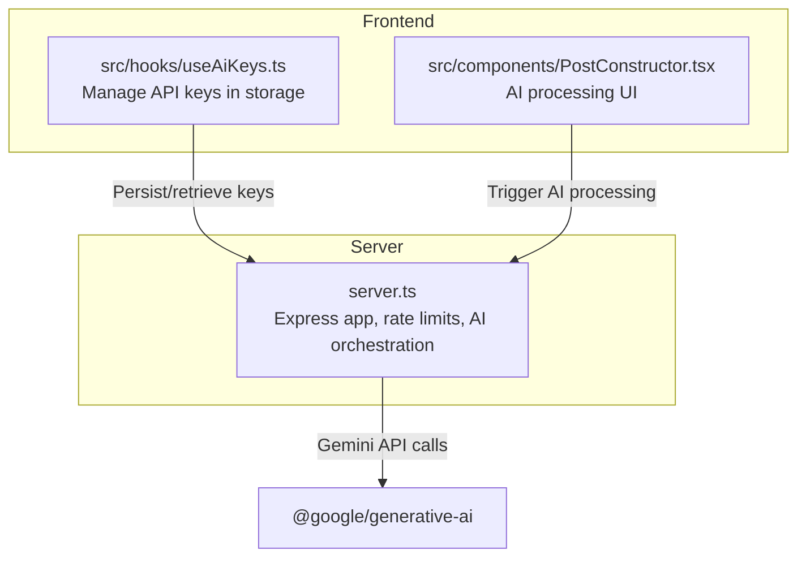
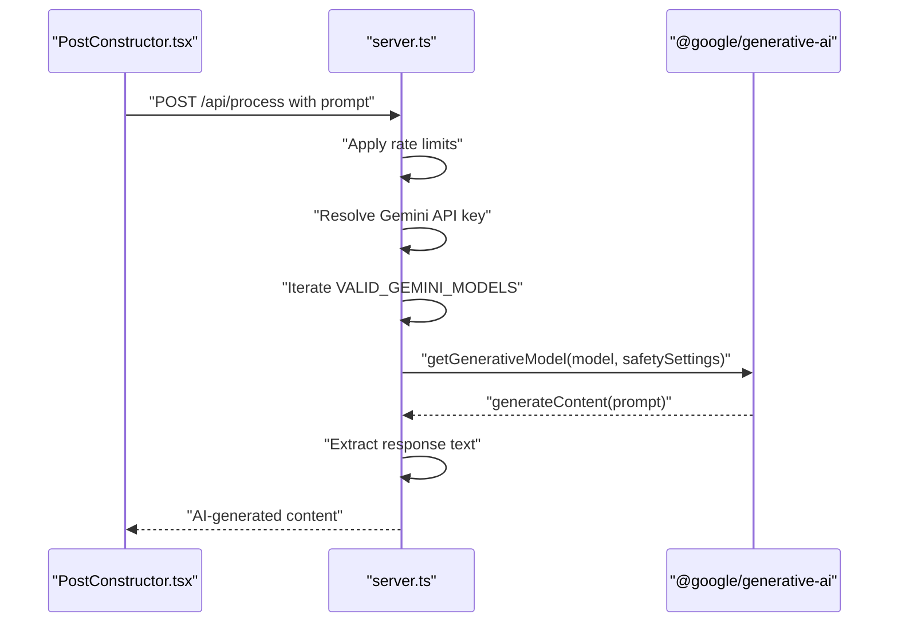
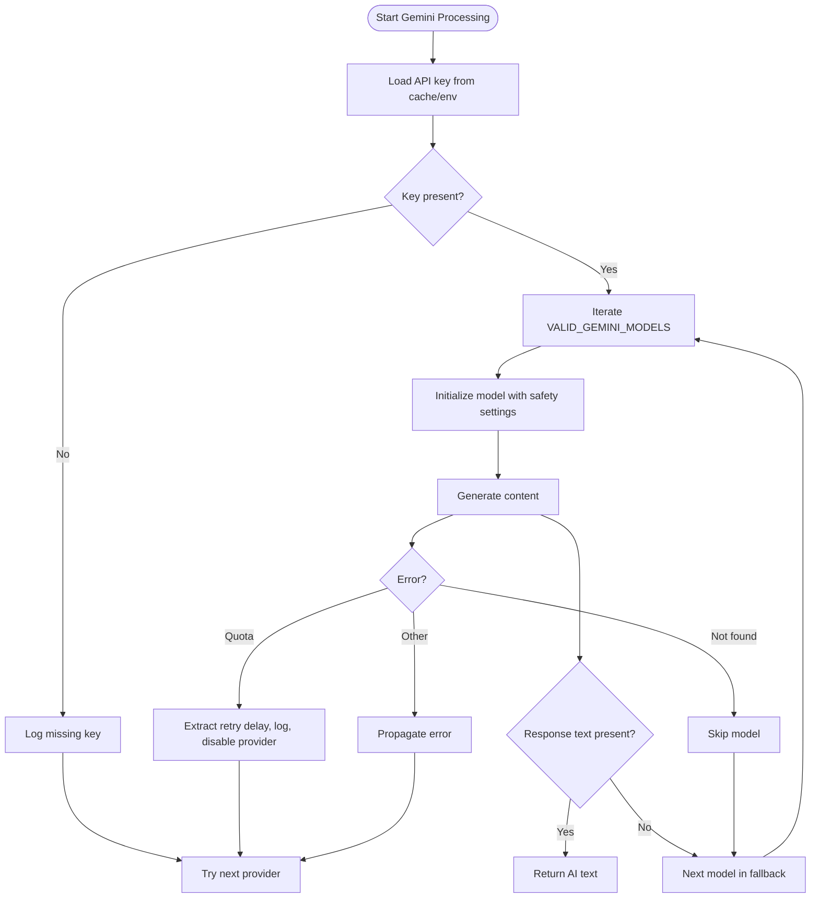
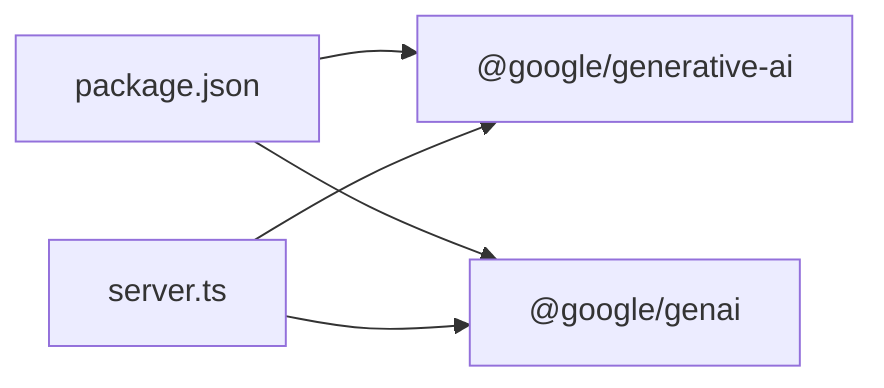

# Gemini AI Integration

<cite>
**Referenced Files in This Document**
- [README.md](file://README.md)
- [package.json](file://package.json)
- [server.ts](file://server.ts)
- [src/hooks/useAiKeys.ts](file://src/hooks/useAiKeys.ts)
- [src/components/PostConstructor.tsx](file://src/components/PostConstructor.tsx)
</cite>

## Table of Contents
1. [Introduction](#introduction)
2. [Project Structure](#project-structure)
3. [Core Components](#core-components)
4. [Architecture Overview](#architecture-overview)
5. [Detailed Component Analysis](#detailed-component-analysis)
6. [Dependency Analysis](#dependency-analysis)
7. [Performance Considerations](#performance-considerations)
8. [Troubleshooting Guide](#troubleshooting-guide)
9. [Conclusion](#conclusion)

## Introduction
This document describes the Gemini AI integration in the project, focusing on the Google Generative AI implementation. It covers API key configuration, model selection and fallback behavior, content processing workflow, safety settings, quota and rate limiting, error handling for quota exhaustion, model availability detection, prompt engineering for Chinese-to-Russian translation and Telegram post formatting, and practical configuration and troubleshooting guidance.

## Project Structure
The Gemini integration is implemented in the backend server module and surfaced via UI hooks and components. Key areas:
- Backend server initializes rate limits, loads environment variables, and orchestrates AI providers.
- Gemini-specific logic handles API key resolution, model fallback, safety settings, timeouts, and quota detection.
- Frontend hooks manage API key persistence and retrieval for UI-driven operations.
- The post constructor component integrates AI processing into the content creation workflow.

**Diagram sources**
- [server.ts:1-200](file://server.ts#L1-L200)
- [src/hooks/useAiKeys.ts:1-57](file://src/hooks/useAiKeys.ts#L1-L57)
- [src/components/PostConstructor.tsx:1-294](file://src/components/PostConstructor.tsx#L1-L294)

**Section sources**
- [README.md:1-25](file://README.md#L1-L25)
- [package.json:1-70](file://package.json#L1-L70)
- [server.ts:1-200](file://server.ts#L1-L200)
- [src/hooks/useAiKeys.ts:1-57](file://src/hooks/useAiKeys.ts#L1-L57)
- [src/components/PostConstructor.tsx:1-294](file://src/components/PostConstructor.tsx#L1-L294)

## Core Components
- Rate limiting: Global API limiter and dedicated AI limiter are configured to protect backend resources.
- Environment validation: Checks for required environment variables and warns when the Gemini key is missing.
- Gemini provider: Resolves API key from in-memory cache or environment variable, iterates through a predefined model fallback list, applies safety settings, and handles quota and model availability errors.
- Frontend key management: Provides hooks to persist and retrieve API keys for Gemini and other providers.

Key implementation references:
- Rate limiters and environment validation: [server.ts:51-73](file://server.ts#L51-L73), [server.ts:24-33](file://server.ts#L24-L33)
- Gemini provider loop and safety settings: [server.ts:502-563](file://server.ts#L502-L563)
- Model fallback list definition: [server.ts:354-360](file://server.ts#L354-L360)
- Frontend key management hook: [src/hooks/useAiKeys.ts:1-57](file://src/hooks/useAiKeys.ts#L1-L57)

**Section sources**
- [server.ts:51-73](file://server.ts#L51-L73)
- [server.ts:24-33](file://server.ts#L24-L33)
- [server.ts:502-563](file://server.ts#L502-L563)
- [server.ts:354-360](file://server.ts#L354-L360)
- [src/hooks/useAiKeys.ts:1-57](file://src/hooks/useAiKeys.ts#L1-L57)

## Architecture Overview
The Gemini integration runs within the Express server. The frontend triggers AI processing, which routes through the server. The server selects a Gemini model, applies safety settings, and returns the generated text. The system includes:
- Global rate limiting for all API endpoints.
- Dedicated AI rate limiting to constrain AI requests.
- Model fallback loop to select a working model.
- Quota detection and temporary provider disabling.
- Safety settings configured to low thresholds for unrestricted content generation.

**Diagram sources**
- [server.ts:502-563](file://server.ts#L502-L563)
- [server.ts:354-360](file://server.ts#L354-L360)
- [src/components/PostConstructor.tsx:1-294](file://src/components/PostConstructor.tsx#L1-L294)

## Detailed Component Analysis

### Gemini Provider Orchestration
The server implements a robust Gemini provider loop:
- API key resolution from memory cache or environment variable.
- Iteration over a deduplicated model fallback list.
- Model initialization with explicit safety settings.
- Content generation and response extraction.
- Error classification for quota exhaustion and model unavailability.
- Temporary provider disabling and logging.

**Diagram sources**
- [server.ts:502-563](file://server.ts#L502-L563)
- [server.ts:354-360](file://server.ts#L354-L360)

**Section sources**
- [server.ts:502-563](file://server.ts#L502-L563)
- [server.ts:354-360](file://server.ts#L354-L360)

### Model Selection and Fallback
- The server defines a list of valid Gemini models and deduplicates it before iteration.
- The fallback order determines precedence for model selection.
- Availability detection occurs during model initialization; 404/not found errors skip the model.

Implementation references:
- Model list definition: [server.ts:354-360](file://server.ts#L354-L360)
- Fallback loop and availability handling: [server.ts:502-563](file://server.ts#L502-L563)

**Section sources**
- [server.ts:354-360](file://server.ts#L354-L360)
- [server.ts:502-563](file://server.ts#L502-L563)

### Safety Settings Configuration
- Safety settings are applied consistently across all model initializations.
- Categories include harassment, hate speech, sexually explicit, and dangerous content.
- Thresholds are set to BLOCK_NONE to allow unrestricted content generation.

Reference:
- Safety settings application: [server.ts:512-520](file://server.ts#L512-L520)

**Section sources**
- [server.ts:512-520](file://server.ts#L512-L520)

### Quota Management and Rate Limiting
- Global rate limiter restricts total API requests per window.
- AI-specific rate limiter constrains AI request volume.
- Quota exhaustion detection recognizes multiple error indicators (codes and messages).
- On quota hit, the server logs a warning, records a retry hint, disables the provider temporarily, and continues to next provider.

References:
- Global and AI rate limiters: [server.ts:51-73](file://server.ts#L51-L73)
- Quota detection and provider disabling: [server.ts:548-562](file://server.ts#L548-L562)

**Section sources**
- [server.ts:51-73](file://server.ts#L51-L73)
- [server.ts:548-562](file://server.ts#L548-L562)

### Error Handling Strategies
- Model-level errors: 404/not found skips the model; other errors bubble up.
- Provider-level errors: Quota exhaustion disables the provider; other errors are logged and retried against remaining providers.
- Generalized error parsing extracts meaningful messages from structured error objects.

References:
- Model-level handling: [server.ts:527-536](file://server.ts#L527-L536)
- Provider-level handling: [server.ts:537-563](file://server.ts#L537-L563)

**Section sources**
- [server.ts:527-536](file://server.ts#L527-L536)
- [server.ts:537-563](file://server.ts#L537-L563)

### Prompt Engineering Approach
- Translation: The prompt is designed to translate Chinese content into Russian while preserving meaning and tone.
- Formatting: The prompt instructs the model to format the output as a Telegram post, ensuring appropriate markup and readability.

Note: The prompt construction and injection occur upstream of the Gemini provider loop and are not shown here. The Gemini provider consumes a prepared prompt and returns processed text.

[No sources needed since this section does not analyze specific source files]

### Frontend Integration
- The post constructor component exposes an action to process content via AI.
- The AI keys hook persists and retrieves keys for Gemini and other providers, supporting both standalone and browser environments.

References:
- Post constructor integration surface: [src/components/PostConstructor.tsx:140-160](file://src/components/PostConstructor.tsx#L140-L160)
- Key management hook: [src/hooks/useAiKeys.ts:1-57](file://src/hooks/useAiKeys.ts#L1-L57)

**Section sources**
- [src/components/PostConstructor.tsx:140-160](file://src/components/PostConstructor.tsx#L140-L160)
- [src/hooks/useAiKeys.ts:1-57](file://src/hooks/useAiKeys.ts#L1-L57)

## Dependency Analysis
External dependencies relevant to Gemini:
- @google/generative-ai: Official client for Google Generative AI.
- @google/genai: Alternative SDK with additional features and engine requirements.

References:
- Package dependencies: [package.json:30-31](file://package.json#L30-L31), [package.json:1230-1261](file://package.json#L1230-L1261)

**Diagram sources**
- [package.json:30-31](file://package.json#L30-L31)
- [package.json:1230-1261](file://package.json#L1230-L1261)
- [server.ts:13-13](file://server.ts#L13-L13)

**Section sources**
- [package.json:30-31](file://package.json#L30-L31)
- [package.json:1230-1261](file://package.json#L1230-L1261)
- [server.ts:13-13](file://server.ts#L13-L13)

## Performance Considerations
- Model fallback reduces downtime by trying multiple models in sequence.
- Safety settings are applied per model initialization; keep thresholds minimal to avoid unnecessary filtering.
- Timeout protection is implemented during model availability checks to prevent hanging requests.
- Rate limiting prevents overload and improves fairness across users.

References:
- Availability check with timeout: [server.ts:1307-1310](file://server.ts#L1307-L1310)

**Section sources**
- [server.ts:1307-1310](file://server.ts#L1307-L1310)

## Troubleshooting Guide
Common issues and resolutions:
- Missing API key
  - Symptom: Provider skipped with a “no key” message.
  - Action: Set the GEMINI_API_KEY environment variable or configure the key in the UI under “Управление API Ключами”.
  - Reference: [README.md:18-22](file://README.md#L18-L22), [server.ts:504-505](file://server.ts#L504-L505)

- Quota exceeded (429/RESOURCE_EXHAUSTED/quota)
  - Symptom: Immediate 429 response with retry hint or provider disabled with quota warning.
  - Action: Wait for the suggested retry interval; reduce request frequency; upgrade quota if needed.
  - References: [server.ts:552-559](file://server.ts#L552-L559), [server.ts:1315-1319](file://server.ts#L1315-L1319)

- Model not found (404/not found)
  - Symptom: Specific model skipped; fallback proceeds to next model.
  - Action: Verify model availability; adjust model list if necessary.
  - References: [server.ts:529-532](file://server.ts#L529-L532), [server.ts:1320-1321](file://server.ts#L1320-L1321)

- General Gemini errors
  - Symptom: Error messages parsed from structured error objects.
  - Action: Inspect logs for detailed messages; ensure correct model and safety settings.
  - Reference: [server.ts:541-547](file://server.ts#L541-L547)

- Environment validation warnings
  - Symptom: Warning logged if GEMINI_API_KEY is missing.
  - Action: Provide the key to enable AI features.
  - Reference: [server.ts:30-32](file://server.ts#L30-L32)

**Section sources**
- [README.md:18-22](file://README.md#L18-L22)
- [server.ts:504-505](file://server.ts#L504-L505)
- [server.ts:552-559](file://server.ts#L552-L559)
- [server.ts:1315-1319](file://server.ts#L1315-L1319)
- [server.ts:529-532](file://server.ts#L529-L532)
- [server.ts:1320-1321](file://server.ts#L1320-L1321)
- [server.ts:541-547](file://server.ts#L541-L547)
- [server.ts:30-32](file://server.ts#L30-L32)

## Conclusion
The Gemini AI integration provides a resilient pipeline for content processing with configurable safety, robust fallback behavior, and comprehensive error handling. By combining environment-based configuration, frontend key management, and server-side rate limiting, the system balances reliability and usability. For optimal operation, ensure the API key is configured, monitor quota usage, and leverage the fallback mechanism to maintain service continuity.