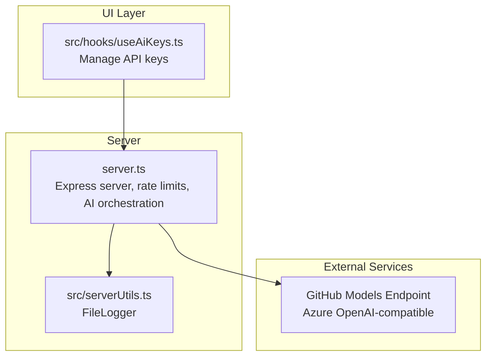
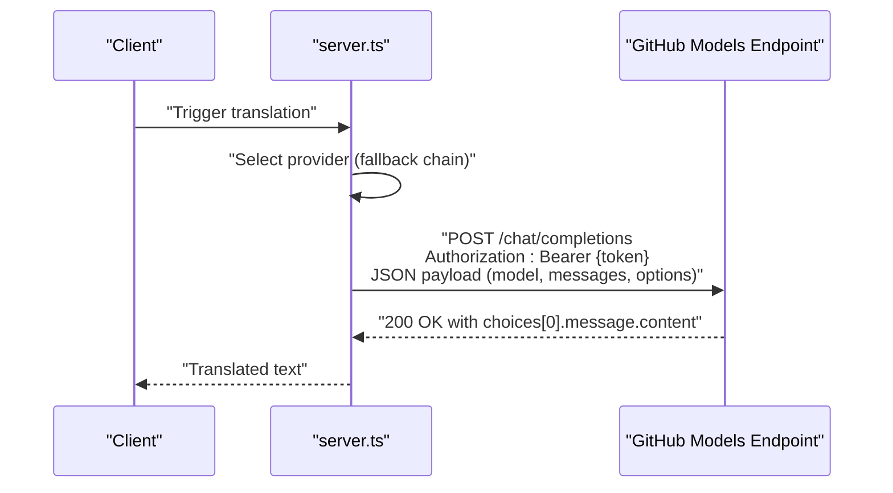
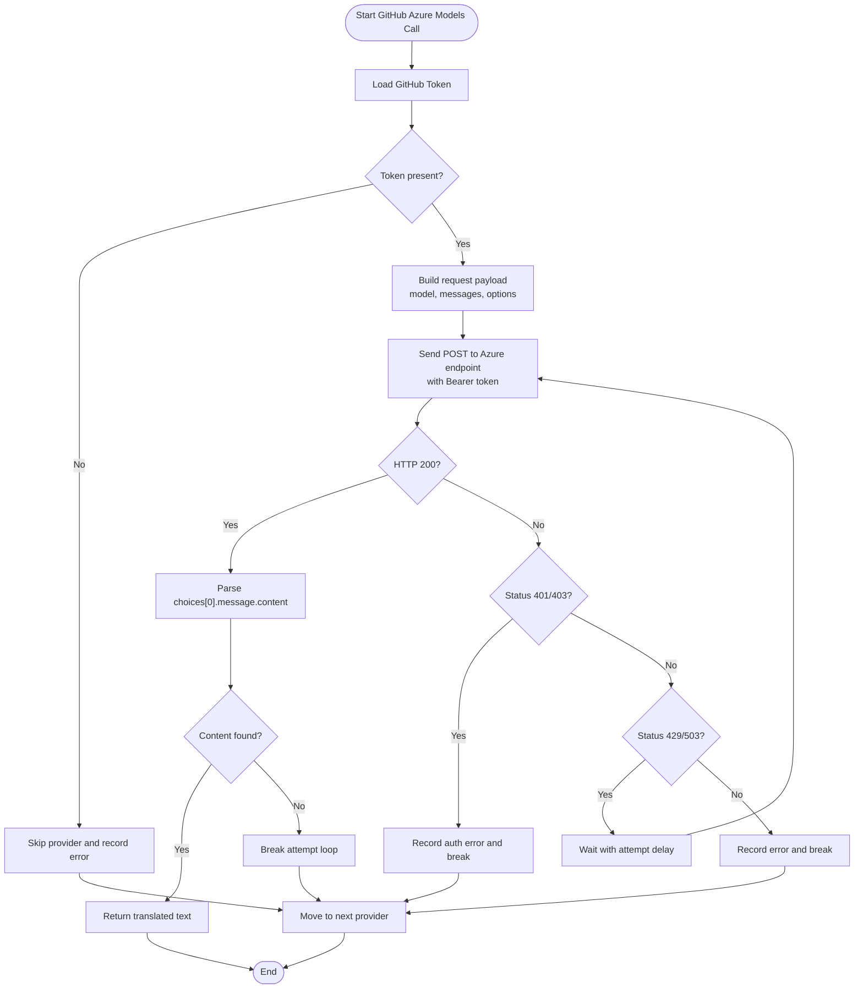
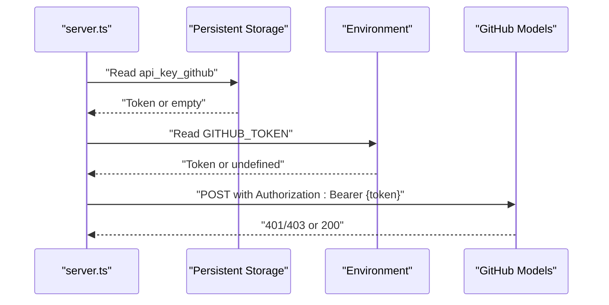
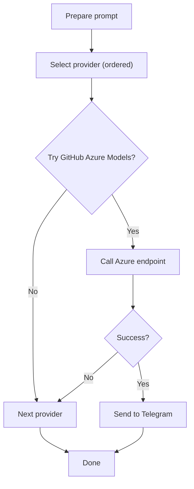
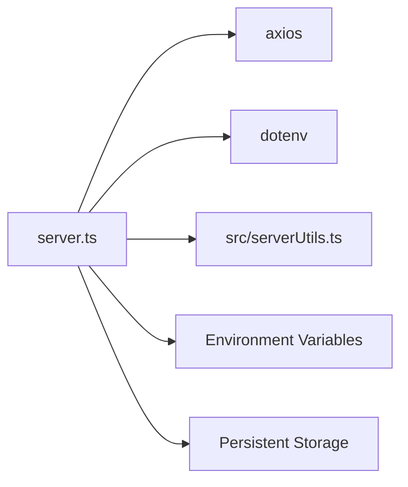

# GitHub Azure Models Integration

<cite>
**Referenced Files in This Document**
- [README.md](file://README.md)
- [package.json](file://package.json)
- [server.ts](file://server.ts)
- [src/serverUtils.ts](file://src/serverUtils.ts)
- [src/hooks/useAiKeys.ts](file://src/hooks/useAiKeys.ts)
- [src/services/standaloneService.ts](file://src/services/standaloneService.ts)
</cite>

## Table of Contents
1. [Introduction](#introduction)
2. [Project Structure](#project-structure)
3. [Core Components](#core-components)
4. [Architecture Overview](#architecture-overview)
5. [Detailed Component Analysis](#detailed-component-analysis)
6. [Dependency Analysis](#dependency-analysis)
7. [Performance Considerations](#performance-considerations)
8. [Troubleshooting Guide](#troubleshooting-guide)
9. [Conclusion](#conclusion)

## Introduction
This document explains the GitHub Azure Models integration within the project. It focuses on the Azure OpenAI-compatible API implementation using the gpt-4o-mini model via the GitHub Models endpoint. The documentation covers authentication using Bearer tokens, endpoint configuration, request/response handling, retry logic for rate limiting and service unavailability, timeout configuration, error handling strategies, setup instructions for obtaining GitHub tokens, model configuration, and troubleshooting guidance for authentication failures and network issues.

## Project Structure
The integration is implemented in the server-side application. Key areas include:
- Environment configuration and dependencies
- Server initialization and logging
- AI provider selection and fallback logic
- GitHub Azure Models API call with authentication and retry handling
- UI hook for managing API keys

**Diagram sources**
- [server.ts:1-120](file://server.ts#L1-L120)
- [src/serverUtils.ts:1-23](file://src/serverUtils.ts#L1-L23)
- [src/hooks/useAiKeys.ts:1-57](file://src/hooks/useAiKeys.ts#L1-L57)

**Section sources**
- [README.md:16-25](file://README.md#L16-L25)
- [package.json:19-56](file://package.json#L19-L56)
- [server.ts:1-120](file://server.ts#L1-L120)

## Core Components
- GitHub Azure Models API client: Implements the Azure OpenAI-compatible chat completions endpoint with Bearer token authentication, request payload construction, and response parsing.
- Authentication and configuration: Loads the GitHub token from persistent storage or environment variables and applies it to outbound requests.
- Retry and error handling: Implements retry logic for rate limiting (429) and service unavailability (503), with exponential backoff-like delays between attempts.
- Timeout configuration: Sets a 60-second timeout for outbound requests to prevent hanging connections.
- Logging and diagnostics: Uses a file logger to record operational events and errors for troubleshooting.

**Section sources**
- [server.ts:446-500](file://server.ts#L446-L500)
- [server.ts:458-473](file://server.ts#L458-L473)
- [src/serverUtils.ts:1-23](file://src/serverUtils.ts#L1-L23)
- [src/hooks/useAiKeys.ts:1-57](file://src/hooks/useAiKeys.ts#L1-L57)

## Architecture Overview
The integration follows a provider-agnostic AI processing pipeline. When translating content, the system attempts multiple providers in order, with GitHub Azure Models as one option. The GitHub Azure Models call targets the Azure OpenAI-compatible endpoint, authenticates with a Bearer token, and retries on transient failures.

**Diagram sources**
- [server.ts:446-500](file://server.ts#L446-L500)
- [server.ts:458-473](file://server.ts#L458-L473)

## Detailed Component Analysis

### GitHub Azure Models Integration
The GitHub Azure Models integration is implemented within the AI processing function. It targets the Azure OpenAI-compatible endpoint, constructs a standardized chat completion request, and handles responses and errors.

- Endpoint: Azure OpenAI-compatible chat completions endpoint
- Model: gpt-4o-mini
- Authentication: Bearer token via Authorization header
- Request payload: Includes model, messages array, temperature, and max_tokens
- Timeout: 60 seconds
- Response handling: Extracts the assistant's message content from choices[0].message.content

**Diagram sources**
- [server.ts:446-500](file://server.ts#L446-L500)
- [server.ts:458-473](file://server.ts#L458-L473)

**Section sources**
- [server.ts:446-500](file://server.ts#L446-L500)
- [server.ts:458-473](file://server.ts#L458-L473)

### Authentication Mechanism
- Token source: The integration reads the GitHub token from either persistent storage or environment variables.
- Header: The Authorization header is set to Bearer {token}.
- Validation: On 401/403 responses, the system records an authentication error and moves to the next provider.

**Diagram sources**
- [server.ts:450-453](file://server.ts#L450-L453)
- [server.ts:467-469](file://server.ts#L467-L469)

**Section sources**
- [server.ts:450-453](file://server.ts#L450-L453)
- [server.ts:467-469](file://server.ts#L467-L469)

### API Endpoint Configuration
- Base URL: Azure OpenAI-compatible endpoint for chat completions
- Path: /chat/completions
- Headers: Content-Type application/json and Authorization Bearer
- Payload fields: model, messages, temperature, max_tokens
- Timeout: 60000 milliseconds

**Section sources**
- [server.ts:458-473](file://server.ts#L458-L473)

### Request/Response Handling
- Request: JSON payload sent via POST
- Response: Expects a JSON object containing choices with message content
- Success: Returns the assistant's message content
- Failure: Records errors and continues provider fallback

**Section sources**
- [server.ts:458-473](file://server.ts#L458-L473)
- [server.ts:474-478](file://server.ts#L474-L478)

### Retry Logic and Timeouts
- Retries: Up to 3 attempts for transient failures (429/503)
- Backoff: Delays increase per attempt (attempt-specific multiplier)
- Timeouts: 60-second timeout for outbound requests
- Authentication failures: Immediate break to avoid retry loops

**Section sources**
- [server.ts:490-498](file://server.ts#L490-L498)
- [server.ts:471](file://server.ts#L471)

### Error Handling Strategies
- Authentication errors (401/403): Logged and provider skipped
- Rate limiting (429) and service unavailability (503): Retried with delays
- Other errors: Logged and provider skipped
- Fallback chain: Continues to next provider if current fails

**Section sources**
- [server.ts:484-498](file://server.ts#L484-L498)

### Setup Instructions
- Obtain a GitHub token with appropriate permissions for GitHub Models.
- Configure the token in the UI under the API Keys management area or set the environment variable GITHUB_TOKEN.
- Ensure the server has access to the token at runtime.

**Section sources**
- [README.md:18-22](file://README.md#L18-L22)
- [src/hooks/useAiKeys.ts:1-57](file://src/hooks/useAiKeys.ts#L1-L57)

### Model Configuration
- Model: gpt-4o-mini
- Additional parameters: temperature and max_tokens included in the request payload

**Section sources**
- [server.ts:453](file://server.ts#L453)
- [server.ts:460-465](file://server.ts#L460-L465)

### Content Processing Workflow
- Prompt preparation: A structured prompt is constructed for translation and formatting.
- Provider selection: The system selects a provider and attempts fallbacks if needed.
- Translation: Calls the Azure Models endpoint and returns the translated content.
- Delivery: Sends the result to the Telegram chat.

**Diagram sources**
- [server.ts:412-645](file://server.ts#L412-L645)

**Section sources**
- [server.ts:412-645](file://server.ts#L412-L645)

## Dependency Analysis
The integration depends on:
- Express for the HTTP server and middleware
- Axios for outbound HTTP requests
- Environment variables for configuration
- Local storage for API key persistence

**Diagram sources**
- [server.ts:1-17](file://server.ts#L1-L17)
- [src/serverUtils.ts:1-23](file://src/serverUtils.ts#L1-L23)

**Section sources**
- [server.ts:1-17](file://server.ts#L1-L17)
- [package.json:35-55](file://package.json#L35-L55)

## Performance Considerations
- Timeout tuning: The 60-second timeout balances responsiveness with model latency expectations.
- Retry strategy: Limited attempts with increasing delays reduce load on failing endpoints while preventing long stalls.
- Provider fallback: Ensures continuity if one provider is unavailable.

## Troubleshooting Guide
- Authentication failures (401/403):
  - Verify the GitHub token is set and has the required permissions.
  - Confirm the Authorization header is correctly formatted as Bearer {token}.
- Rate limiting (429) and service unavailability (503):
  - The system retries automatically with delays; check logs for retry messages.
  - Consider reducing request frequency or adding throttling at the client level.
- Network issues:
  - Inspect timeouts and connectivity to the Azure endpoint.
  - Review logs for network-related errors.
- Logging:
  - Use the file logger to capture detailed operational events and errors.

**Section sources**
- [server.ts:484-498](file://server.ts#L484-L498)
- [src/serverUtils.ts:1-23](file://src/serverUtils.ts#L1-L23)

## Conclusion
The GitHub Azure Models integration provides a robust, resilient pathway for translating and formatting content using the gpt-4o-mini model via the GitHub Models endpoint. It incorporates Bearer token authentication, structured request/response handling, intelligent retry logic for transient failures, and comprehensive logging for diagnostics. Proper configuration of the GitHub token and awareness of retry and timeout behaviors ensure reliable operation within the broader AI processing pipeline.