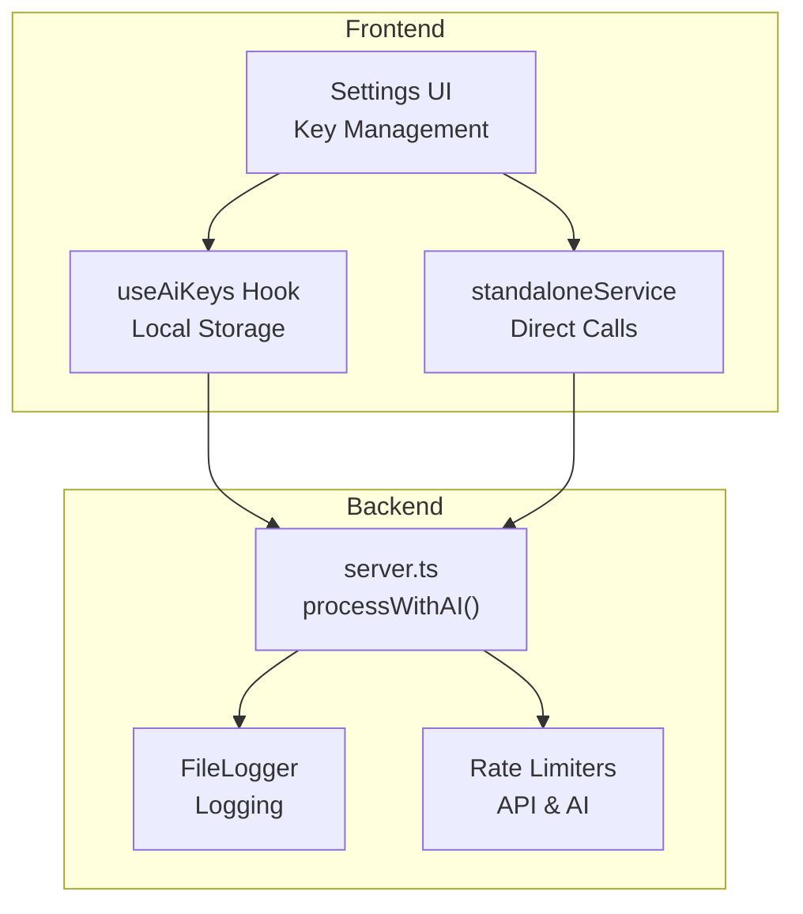
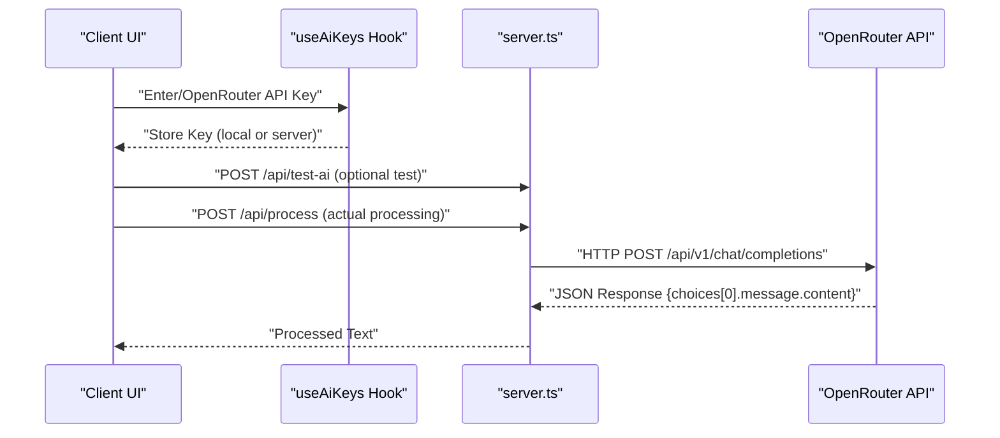
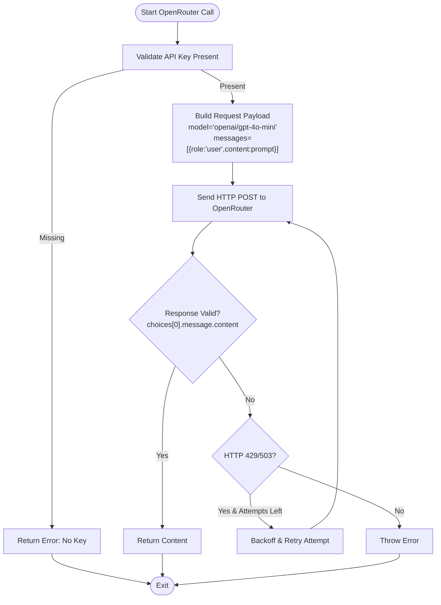
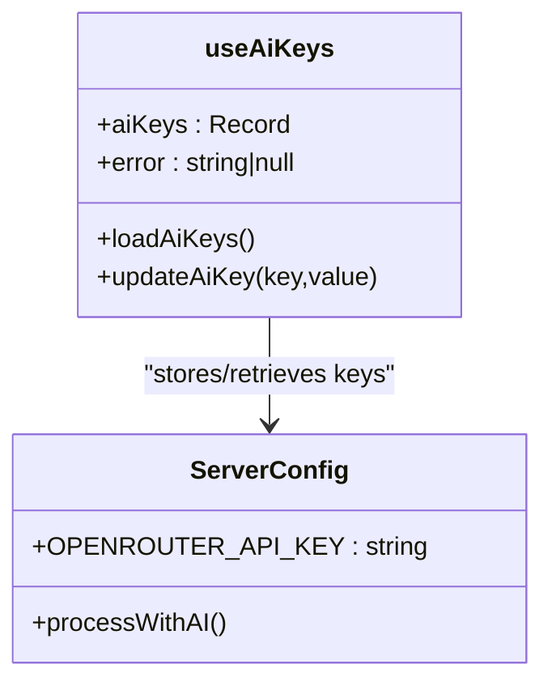
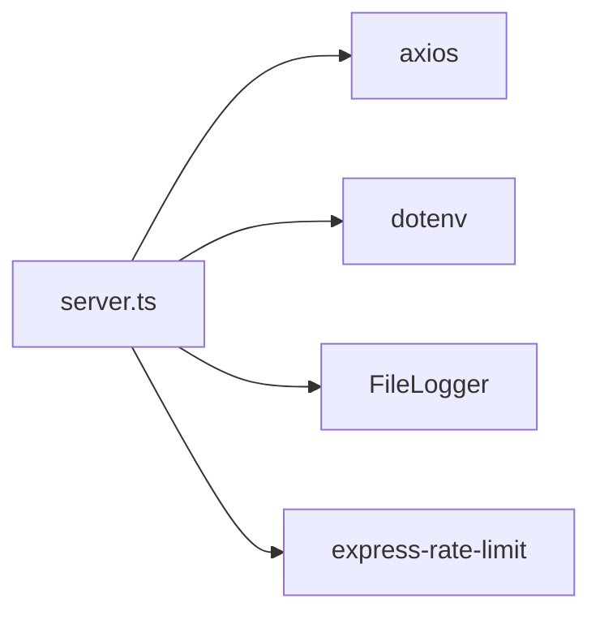

# OpenRouter Integration

<cite>
**Referenced Files in This Document**
- [server.ts](file://server.ts)
- [useAiKeys.ts](file://src/hooks/useAiKeys.ts)
- [App.tsx](file://src/App.tsx)
- [standaloneService.ts](file://src/services/standaloneService.ts)
- [README.md](file://README.md)
- [package.json](file://package.json)
</cite>

## Table of Contents
1. [Introduction](#introduction)
2. [Project Structure](#project-structure)
3. [Core Components](#core-components)
4. [Architecture Overview](#architecture-overview)
5. [Detailed Component Analysis](#detailed-component-analysis)
6. [Dependency Analysis](#dependency-analysis)
7. [Performance Considerations](#performance-considerations)
8. [Troubleshooting Guide](#troubleshooting-guide)
9. [Conclusion](#conclusion)

## Introduction
This document provides comprehensive technical and practical guidance for integrating OpenRouter's chat completions API using the gpt-4o-mini model within the project. It covers API key configuration, authentication headers, request structure, message formatting, response processing, retry mechanisms for rate limiting and service unavailability, timeout configuration, error handling strategies, setup instructions for obtaining OpenRouter API keys, model selection, and troubleshooting common integration issues. The content is derived from the repository's server-side implementation and related frontend components.

## Project Structure
The OpenRouter integration spans both server-side and client-side components:
- Server-side implementation handles AI processing workflows, including OpenRouter integration, request/response handling, retries, timeouts, and logging.
- Frontend components manage API key storage, user interface for key management, and testing connectivity to the backend.

**Diagram sources**
- [server.ts:1-800](file://server.ts#L1-L800)
- [useAiKeys.ts:1-57](file://src/hooks/useAiKeys.ts#L1-L57)
- [standaloneService.ts:1-175](file://src/services/standaloneService.ts#L1-L175)

**Section sources**
- [server.ts:1-800](file://server.ts#L1-L800)
- [useAiKeys.ts:1-57](file://src/hooks/useAiKeys.ts#L1-L57)
- [standaloneService.ts:1-175](file://src/services/standaloneService.ts#L1-L175)

## Core Components
- OpenRouter Provider Logic: Implemented in the server's AI processing function, selecting the OpenRouter provider, validating the API key, constructing the request payload, setting authentication headers, applying retry logic for rate limits and service unavailability, and extracting the response content.
- API Key Management: Frontend hook and UI enable users to store, retrieve, and test OpenRouter API keys locally or via the backend.
- Request/Response Processing: The server posts to OpenRouter's chat completions endpoint, validates the response structure, and returns the processed text to the client.

**Section sources**
- [server.ts:565-590](file://server.ts#L565-L590)
- [useAiKeys.ts:4-44](file://src/hooks/useAiKeys.ts#L4-L44)
- [App.tsx:1670-1720](file://src/App.tsx#L1670-L1720)

## Architecture Overview
The OpenRouter integration follows a layered approach:
- Frontend UI captures and stores API keys.
- Backend processes AI requests, including OpenRouter calls.
- OpenRouter receives a structured request with authentication and returns a standardized response.

**Diagram sources**
- [server.ts:565-590](file://server.ts#L565-L590)
- [server.ts:1328-1339](file://server.ts#L1328-L1339)
- [useAiKeys.ts:37-44](file://src/hooks/useAiKeys.ts#L37-L44)
- [App.tsx:1670-1720](file://src/App.tsx#L1670-L1720)

## Detailed Component Analysis

### OpenRouter Provider Implementation
The server implements the OpenRouter provider within the AI processing pipeline:
- Model Selection: Uses the gpt-4o-mini model via the "openai/gpt-4o-mini" identifier.
- Authentication: Sets the Authorization header with the Bearer scheme using the stored or environment-provided API key.
- Request Payload: Sends a messages array containing a single user message with the prompt text.
- Timeout: Applies a 60-second timeout for the HTTP request.
- Retry Logic: Retries on HTTP 429 (rate limit) and 503 (service unavailable) with exponential backoff per attempt.
- Response Validation: Extracts the assistant's message content from choices[0].message.content.

**Diagram sources**
- [server.ts:565-590](file://server.ts#L565-L590)

**Section sources**
- [server.ts:565-590](file://server.ts#L565-L590)

### API Key Configuration and Authentication Headers
- Key Storage: The frontend hook supports storing keys locally (standalone mode) or in server-side storage (web mode). Keys are stored under provider-specific identifiers.
- Environment Variables: The project README documents OPENROUTER_API_KEY as a supported environment variable for server operation.
- Authentication Header: The server sets Authorization: Bearer <API_KEY> for OpenRouter requests.

**Diagram sources**
- [useAiKeys.ts:4-44](file://src/hooks/useAiKeys.ts#L4-L44)
- [README.md:18-22](file://README.md#L18-L22)
- [server.ts:567](file://server.ts#L567)

**Section sources**
- [useAiKeys.ts:4-44](file://src/hooks/useAiKeys.ts#L4-L44)
- [README.md:18-22](file://README.md#L18-L22)
- [server.ts:567](file://server.ts#L567)

### Request Structure and Message Formatting
- Endpoint: https://openrouter.ai/api/v1/chat/completions
- Method: POST
- Headers:
  - Authorization: Bearer <OPENROUTER_API_KEY>
  - Content-Type: application/json
- Body:
  - model: "openai/gpt-4o-mini"
  - messages: [{ role: "user", content: "<prompt>" }]
- Timeout: 60000 ms

**Section sources**
- [server.ts:572-576](file://server.ts#L572-L576)

### Response Processing and Validation
- Response Shape: Expects a JSON object containing choices[]. Each choice includes message with role and content.
- Validation: Checks for choices[0].message.content existence; returns the content if present, otherwise retries or throws an error.
- Error Handling: Catches HTTP errors (429/503) and retries with backoff; rethrows other exceptions.

**Section sources**
- [server.ts:577-589](file://server.ts#L577-L589)

### Retry Mechanism and Timeouts
- Retry Conditions: HTTP 429 (rate limit) and 503 (service unavailable).
- Retry Strategy: Up to 3 attempts with incremental backoff (5000 * attempt milliseconds).
- Global Timeout: 60 seconds per request to prevent hanging connections.

**Section sources**
- [server.ts:584-587](file://server.ts#L584-L587)
- [server.ts:576](file://server.ts#L576)

### Error Handling Strategies
- Key Absent: Skips provider and records an error message.
- Authentication Errors: Distinguishes unauthorized scenarios and stops attempting the provider.
- Quota/Rate Limits: Detects quota exhaustion and disables the provider temporarily in broader logic.
- Generic Failures: Captures response data errors and throws meaningful messages.

**Section sources**
- [server.ts:567-568](file://server.ts#L567-L568)
- [server.ts:582-588](file://server.ts#L582-L588)

### Setup Instructions for OpenRouter API Keys
- Obtain Key: Create an account and generate an API key in the OpenRouter dashboard.
- Environment Setup:
  - Local development: Set OPENROUTER_API_KEY in your environment.
  - UI-based: Enter the key in the "API Keys" section of the Settings UI.
- Verification:
  - Use the "Test" button in the UI to validate connectivity to the backend and provider.
  - The backend exposes a test endpoint for provider verification.

**Section sources**
- [README.md:18-22](file://README.md#L18-L22)
- [App.tsx:1670-1720](file://src/App.tsx#L1670-L1720)
- [server.ts:1328-1339](file://server.ts#L1328-L1339)

### Model Selection
- Selected Model: gpt-4o-mini via the "openai/gpt-4o-mini" identifier.
- Flexibility: The server supports multiple providers and models; OpenRouter is configured to use the specified model for this integration.

**Section sources**
- [server.ts:574](file://server.ts#L574)

### Content Processing Workflow
- Prompt Construction: The server builds a prompt string incorporating the incoming text and formatting guidelines.
- Provider Selection: Iterates through configured providers, prioritizing the user's preferred provider.
- Execution: Executes provider-specific logic, including OpenRouter, and returns the first successful result.

**Section sources**
- [server.ts:412-645](file://server.ts#L412-L645)

## Dependency Analysis
- External Dependencies:
  - axios: HTTP client for making OpenRouter requests.
  - dotenv: Loads environment variables for API keys.
- Internal Dependencies:
  - FileLogger: Centralized logging for diagnostics.
  - Rate Limiters: Enforce usage quotas at the API and AI layers.

**Diagram sources**
- [server.ts:1-17](file://server.ts#L1-L17)
- [package.json:35-55](file://package.json#L35-L55)

**Section sources**
- [package.json:35-55](file://package.json#L35-L55)
- [server.ts:1-17](file://server.ts#L1-L17)

## Performance Considerations
- Timeout Tuning: The 60-second timeout balances responsiveness with model generation time. Adjust based on network conditions and latency.
- Retry Backoff: Incremental backoff reduces contention and improves success rates under rate limits.
- Provider Fallback: The multi-provider strategy ensures resilience by switching among alternatives when one fails.

## Troubleshooting Guide
Common issues and resolutions:
- Authentication Failure (401/403):
  - Verify the OPENROUTER_API_KEY is correct and has appropriate permissions.
  - Confirm the Authorization header is set properly.
- Rate Limiting (429) and Service Unavailable (503):
  - The integration retries automatically with backoff. Monitor logs for retry attempts.
  - Consider reducing request frequency or upgrading the API key plan.
- Empty or Malformed Responses:
  - Ensure the response contains choices[0].message.content.
  - Validate the prompt construction and message formatting.
- Key Storage Issues:
  - In standalone mode, keys are stored locally; in web mode, they are stored via server endpoints.
  - Use the UI's "Test" functionality to validate key connectivity.

**Section sources**
- [server.ts:582-589](file://server.ts#L582-L589)
- [useAiKeys.ts:32-34](file://src/hooks/useAiKeys.ts#L32-L34)
- [App.tsx:1701-1715](file://src/App.tsx#L1701-L1715)

## Conclusion
The OpenRouter integration leverages a robust, retry-aware implementation with clear authentication, request formatting, and response validation. By configuring the API key correctly, understanding the request/response contract, and utilizing the built-in retry and timeout mechanisms, the system provides reliable chat completions using the gpt-4o-mini model. The frontend and backend components work together to streamline key management, testing, and operational visibility.