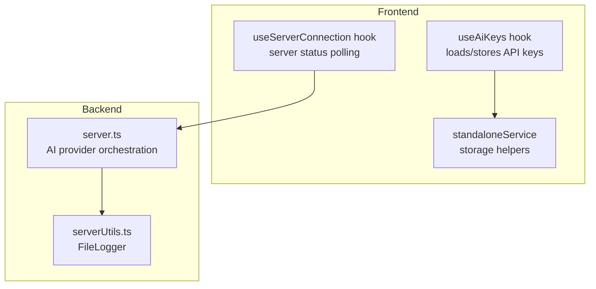
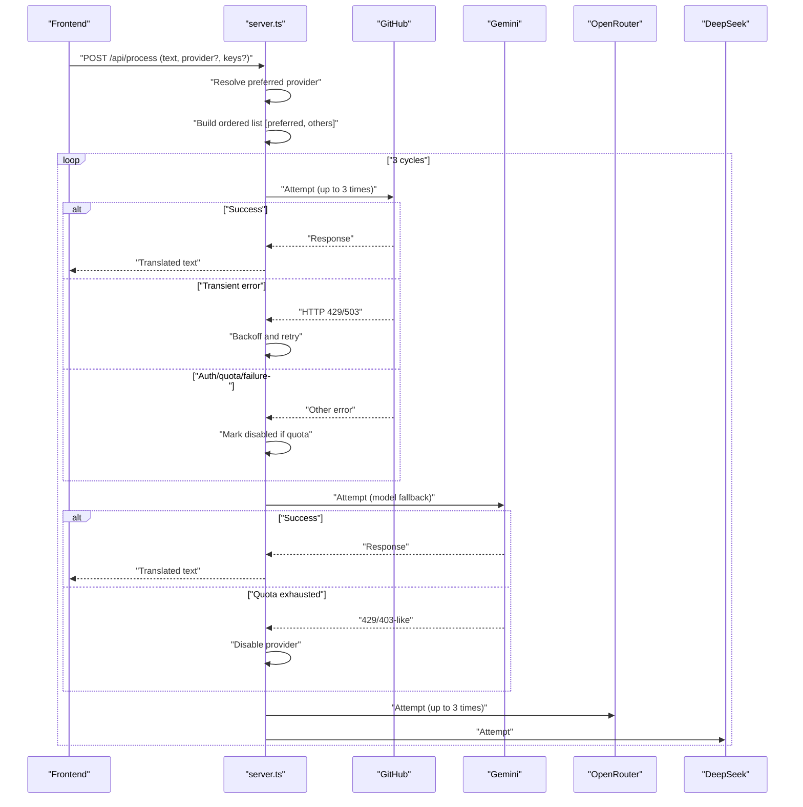
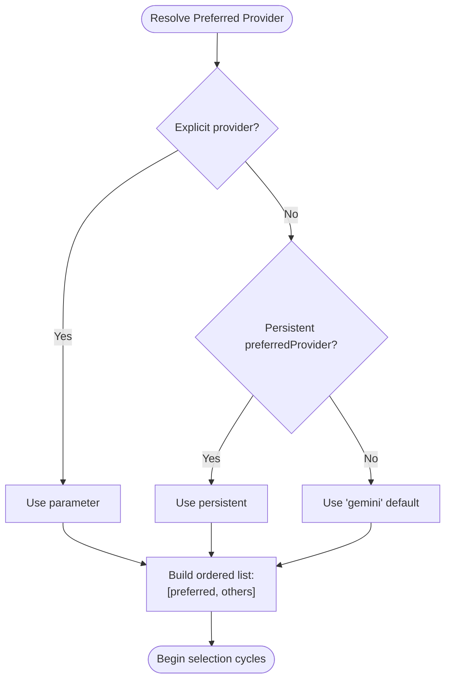
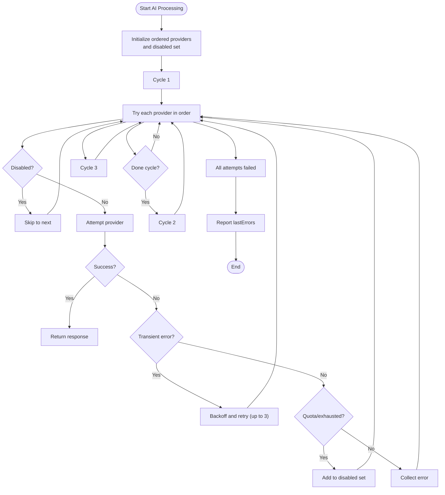
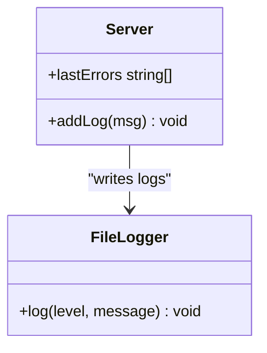
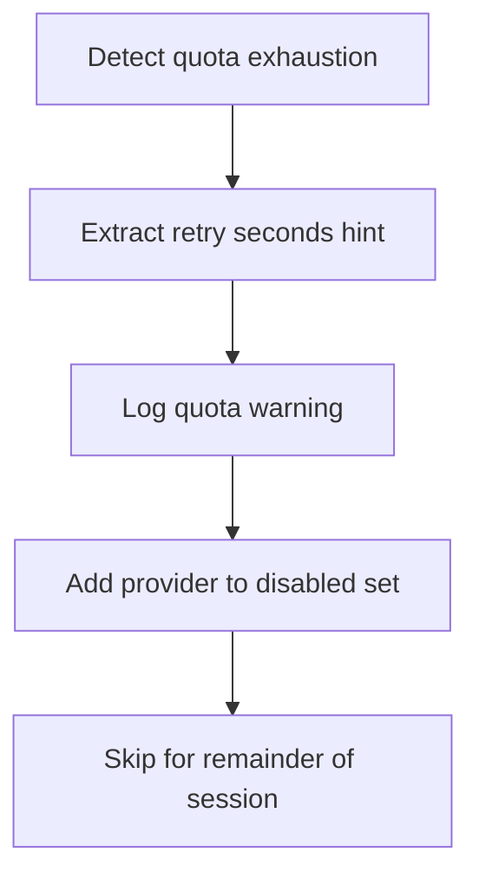
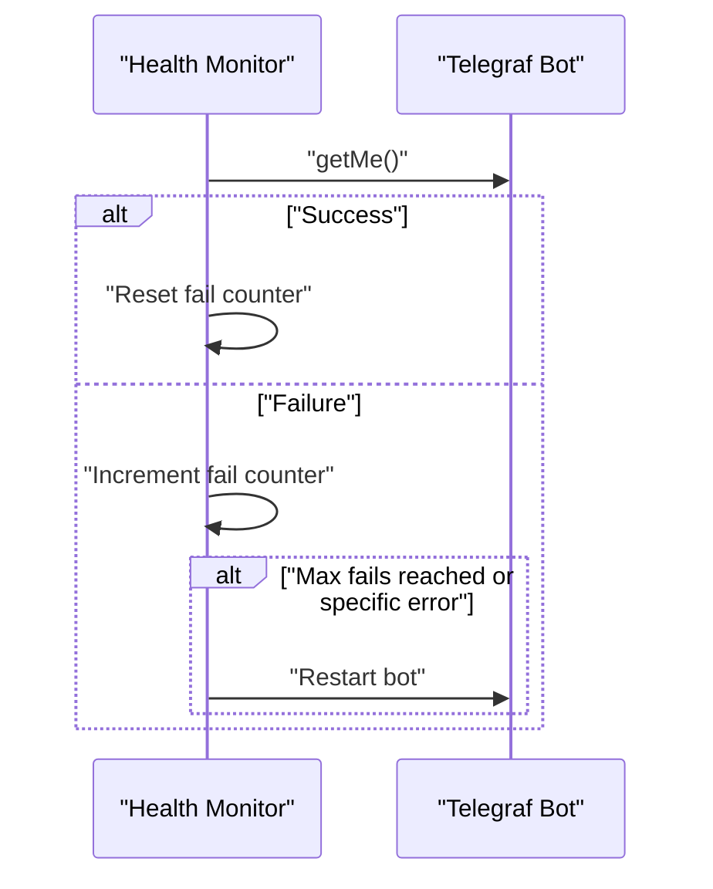
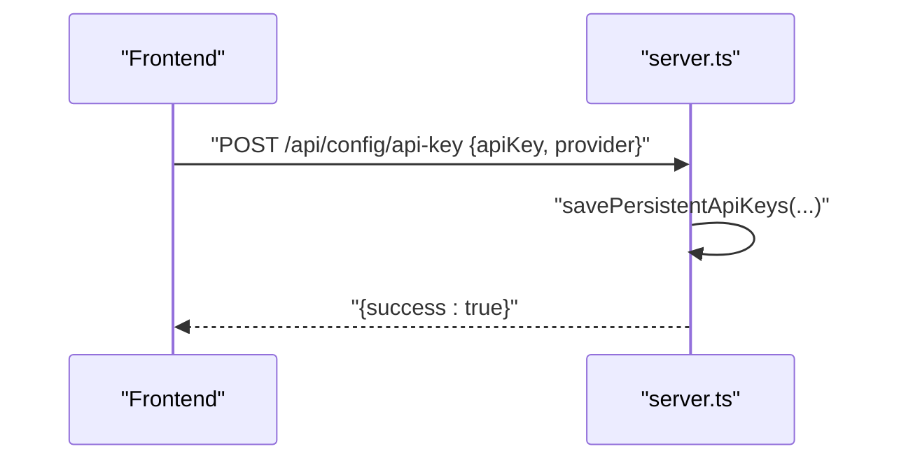
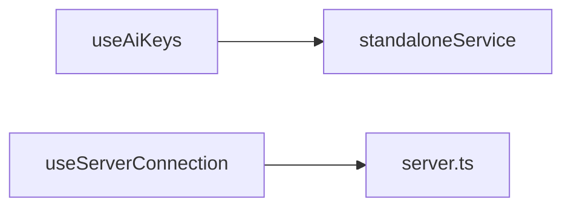
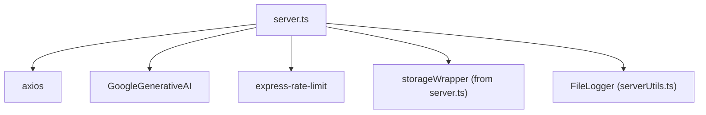

# Provider Selection and Fallback System

<cite>
**Referenced Files in This Document**
- [server.ts](file://server.ts)
- [useAiKeys.ts](file://src/hooks/useAiKeys.ts)
- [standaloneService.ts](file://src/services/standaloneService.ts)
- [useServerConnection.ts](file://src/hooks/useServerConnection.ts)
- [serverUtils.ts](file://src/serverUtils.ts)
- [README.md](file://README.md)
- [package.json](file://package.json)
</cite>

## Table of Contents
1. [Introduction](#introduction)
2. [Project Structure](#project-structure)
3. [Core Components](#core-components)
4. [Architecture Overview](#architecture-overview)
5. [Detailed Component Analysis](#detailed-component-analysis)
6. [Dependency Analysis](#dependency-analysis)
7. [Performance Considerations](#performance-considerations)
8. [Troubleshooting Guide](#troubleshooting-guide)
9. [Conclusion](#conclusion)

## Introduction
This document explains the AI provider selection and fallback system used by the backend service. It covers provider ordering logic, preferred provider configuration, automatic fallback mechanisms, retry strategies, error collection/reporting, provider disabling for quota exhaustion, health monitoring, rate limiting impacts, and the 3-cycle retry process. It also includes configuration examples, troubleshooting steps, and performance optimization techniques for multi-provider AI processing.

## Project Structure
The AI provider system is implemented in the backend server module and integrates with frontend hooks and services for key management and connectivity checks. The primary runtime logic resides in the server module, while the frontend manages API key persistence and server connectivity.

**Diagram sources**
- [server.ts:412-449](file://server.ts#L412-L449)
- [useAiKeys.ts:1-57](file://src/hooks/useAiKeys.ts#L1-L57)
- [standaloneService.ts:11-72](file://src/services/standaloneService.ts#L11-L72)
- [useServerConnection.ts:15-51](file://src/hooks/useServerConnection.ts#L15-L51)
- [serverUtils.ts:7-22](file://src/serverUtils.ts#L7-L22)

**Section sources**
- [server.ts:412-449](file://server.ts#L412-L449)
- [useAiKeys.ts:1-57](file://src/hooks/useAiKeys.ts#L1-L57)
- [standaloneService.ts:11-72](file://src/services/standaloneService.ts#L11-L72)
- [useServerConnection.ts:15-51](file://src/hooks/useServerConnection.ts#L15-L51)
- [serverUtils.ts:7-22](file://src/serverUtils.ts#L7-L22)

## Core Components
- Provider ordering and selection:
  - Providers are ordered as [preferred, others in fixed order].
  - Preferred provider is resolved from explicit parameter, persistent settings, or default.
- Retry strategy:
  - Up to three cycles through the ordered providers.
  - Per-provider retries with exponential backoff-like delays on specific HTTP statuses.
- Error collection and reporting:
  - Errors are logged and collected per provider attempt.
  - File logging is available via a dedicated logger.
- Provider disabling:
  - On quota exhaustion indicators, a provider is temporarily disabled for the current selection session.
- Health monitoring:
  - Periodic bot health checks detect transient failures and trigger restarts when needed.
- Rate limiting:
  - Separate rate limiters protect general API endpoints and AI-specific endpoints.

**Section sources**
- [server.ts:412-449](file://server.ts#L412-L449)
- [server.ts:446-626](file://server.ts#L446-L626)
- [server.ts:368-375](file://server.ts#L368-L375)
- [server.ts:377-409](file://server.ts#L377-L409)
- [serverUtils.ts:7-22](file://src/serverUtils.ts#L7-L22)

## Architecture Overview
The AI processing pipeline selects a provider, attempts up to three cycles, retries on transient errors, and disables providers under quota exhaustion. Frontend components manage keys and server connectivity.

**Diagram sources**
- [server.ts:412-449](file://server.ts#L412-L449)
- [server.ts:446-626](file://server.ts#L446-L626)

## Detailed Component Analysis

### Provider Ordering and Preferred Provider Configuration
- Provider list: ["gemini", "github", "deepseek", "openrouter"]
- Preferred provider resolution:
  - Explicit parameter overrides all else.
  - Otherwise, persistent setting "preferredProvider" is used.
  - Default fallback is "gemini".
- Ordered attempt list:
  - First element is the preferred provider.
  - Remaining elements follow the fixed order.

**Diagram sources**
- [server.ts:412-416](file://server.ts#L412-L416)

**Section sources**
- [server.ts:412-416](file://server.ts#L412-L416)

### Retry Strategy and 3-Cycle Process
- Three selection cycles:
  - Cycle 1: Attempt ordered providers (skipping disabled ones).
  - Cycle 2: Re-attempt with same order.
  - Cycle 3: Final attempt with same order.
- Per-provider retry:
  - GitHub, OpenRouter: Up to 3 attempts with incremental delay on 429/503.
  - Gemini: Model fallback within a single attempt across VALID_GEMINI_MODELS.
- Disabled providers:
  - Temporarily skipped during the current selection session.

**Diagram sources**
- [server.ts:443-449](file://server.ts#L443-L449)
- [server.ts:446-626](file://server.ts#L446-L626)

**Section sources**
- [server.ts:443-449](file://server.ts#L443-L449)
- [server.ts:446-626](file://server.ts#L446-L626)

### Error Collection and Reporting
- Per-attempt errors are appended to a lastErrors array.
- Logging:
  - Console logs are emitted for each provider attempt and outcome.
  - File logging is available via FileLogger for persistent error tracking.

**Diagram sources**
- [serverUtils.ts:7-22](file://src/serverUtils.ts#L7-L22)
- [server.ts:280-280](file://server.ts#L280-L280)

**Section sources**
- [server.ts:441-441](file://server.ts#L441-L441)
- [serverUtils.ts:7-22](file://src/serverUtils.ts#L7-L22)

### Provider Disabling for Quota Exhaustion
- Detection:
  - Quota exhaustion detected by specific HTTP status codes and error messages.
  - Retry delay hints extracted from error messages.
- Action:
  - Provider is added to a disabled set for the current selection session.
  - Subsequent cycles skip disabled providers until the next session.

**Diagram sources**
- [server.ts:548-558](file://server.ts#L548-L558)
- [server.ts:368-375](file://server.ts#L368-L375)

**Section sources**
- [server.ts:548-558](file://server.ts#L548-L558)
- [server.ts:368-375](file://server.ts#L368-L375)

### Provider Health Monitoring and Rate Limiting Impact
- Bot health monitoring:
  - Periodic health checks call Telegram getMe.
  - On repeated failures or specific errors, the bot is restarted.
- Rate limiting:
  - General API limiter protects endpoints.
  - AI-specific limiter restricts AI request bursts.
  - Mutation limiter protects configuration endpoints.

**Diagram sources**
- [server.ts:377-409](file://server.ts#L377-L409)

**Section sources**
- [server.ts:377-409](file://server.ts#L377-L409)
- [server.ts:52-72](file://server.ts#L52-L72)

### API Endpoints for Provider Configuration
- Save API key or preferred provider:
  - POST /api/config/api-key
  - Accepts apiKey, provider, and preferredProvider fields.
  - Saves to persistent storage and logs the action.

**Diagram sources**
- [server.ts:1038-1048](file://server.ts#L1038-L1048)

**Section sources**
- [server.ts:1038-1048](file://server.ts#L1038-L1048)

### Frontend Integration for Keys and Connectivity
- useAiKeys:
  - Loads and updates API keys from persistent storage (native or web).
  - Supports standalone mode with Capacitor preferences/filesystem.
- useServerConnection:
  - Polls server status endpoint to monitor connectivity and bot state.

**Diagram sources**
- [useAiKeys.ts:1-57](file://src/hooks/useAiKeys.ts#L1-L57)
- [standaloneService.ts:11-72](file://src/services/standaloneService.ts#L11-L72)
- [useServerConnection.ts:15-51](file://src/hooks/useServerConnection.ts#L15-L51)

**Section sources**
- [useAiKeys.ts:1-57](file://src/hooks/useAiKeys.ts#L1-L57)
- [standaloneService.ts:11-72](file://src/services/standaloneService.ts#L11-L72)
- [useServerConnection.ts:15-51](file://src/hooks/useServerConnection.ts#L15-L51)

## Dependency Analysis
- External dependencies relevant to provider selection:
  - HTTP client for external providers.
  - Gemini SDK for model generation.
  - Rate limiting middleware for protection.
- Internal dependencies:
  - Storage wrappers for persistent settings.
  - File logger for diagnostics.

**Diagram sources**
- [server.ts:1-17](file://server.ts#L1-L17)
- [package.json:35-55](file://package.json#L35-L55)

**Section sources**
- [server.ts:1-17](file://server.ts#L1-L17)
- [package.json:35-55](file://package.json#L35-L55)

## Performance Considerations
- Prefer the preferred provider to reduce cold-starts and leverage known working configurations.
- Use model fallback for Gemini to avoid single-model failure points.
- Apply per-provider retries judiciously; backoff reduces contention on throttled endpoints.
- Monitor logs and lastErrors to identify recurring quota or auth issues.
- Keep rate limiters tuned to workload patterns to minimize retries due to throttling.

## Troubleshooting Guide
- Missing API keys:
  - Verify keys are present in persistent storage or environment variables.
  - Use the API endpoint to save keys and preferred provider.
- Quota exhaustion:
  - Look for quota-related warnings and disabled provider entries.
  - Wait for the indicated retry delay or switch providers.
- Authentication errors:
  - Check for 401/403 responses and validate token permissions.
- Transient failures:
  - Inspect logs for 429/503 retries and adjust workload pacing.
- Server connectivity:
  - Use the frontend connection hook to poll status and confirm reachability.

**Section sources**
- [server.ts:446-626](file://server.ts#L446-L626)
- [server.ts:1038-1048](file://server.ts#L1038-L1048)
- [useServerConnection.ts:15-51](file://src/hooks/useServerConnection.ts#L15-L51)

## Conclusion
The AI provider selection and fallback system implements a robust, configurable, and resilient multi-provider strategy. By combining preferred provider configuration, ordered selection, per-provider retries, quota-aware disabling, and health monitoring, it maximizes throughput and reliability. Proper configuration and observability enable efficient troubleshooting and optimization for production workloads.