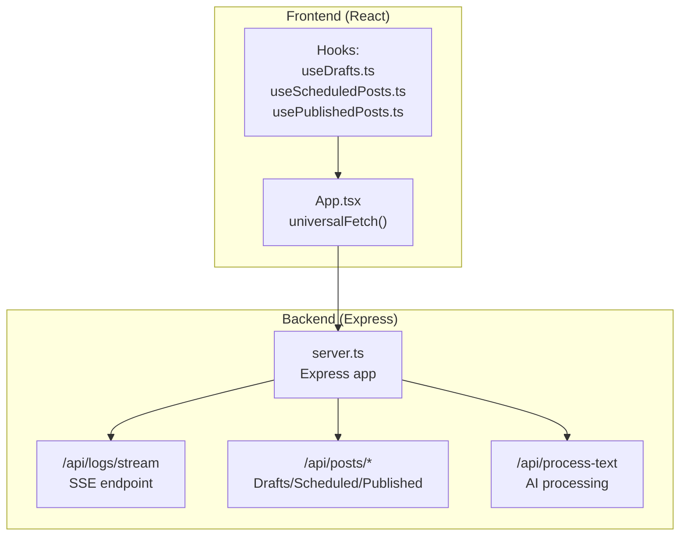
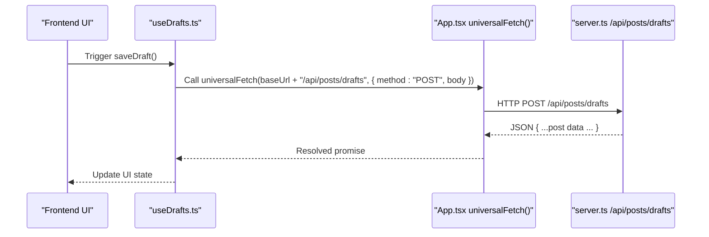
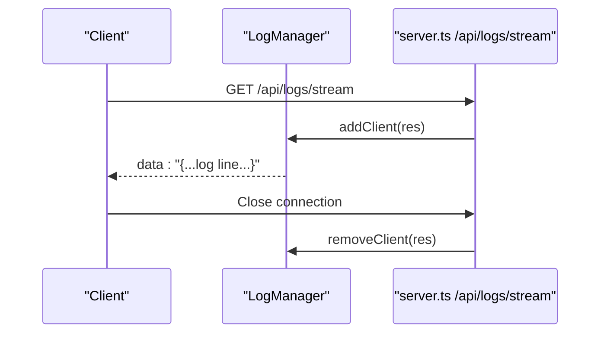
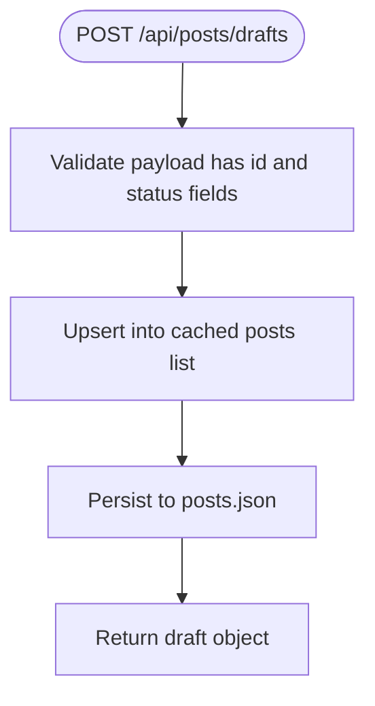
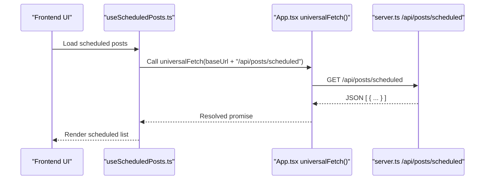
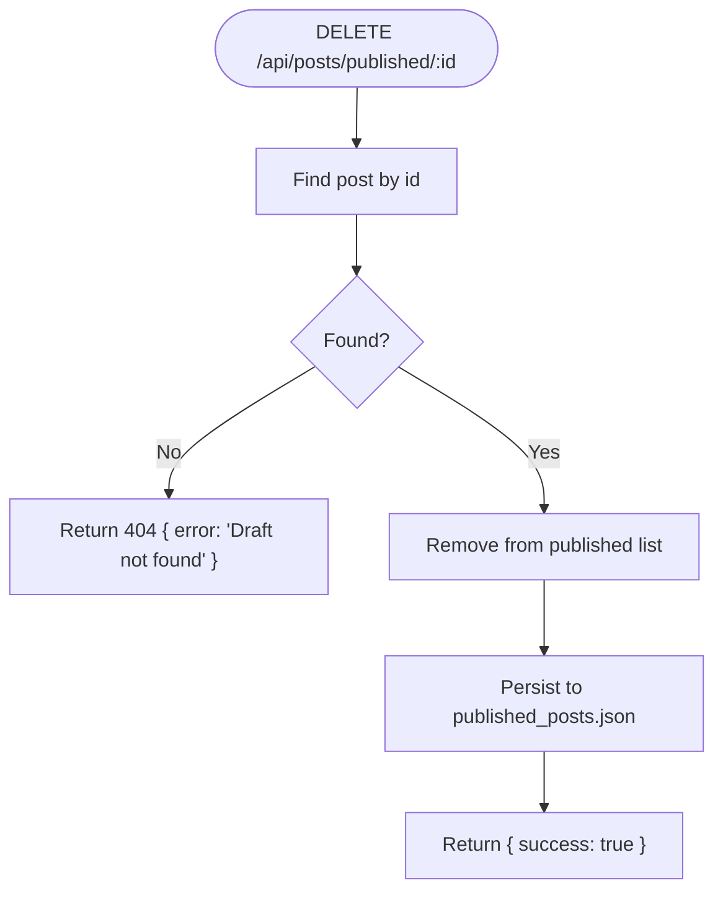
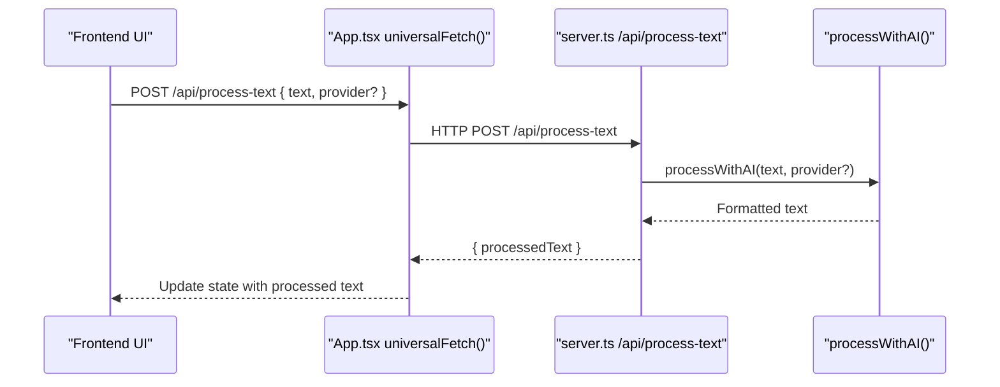
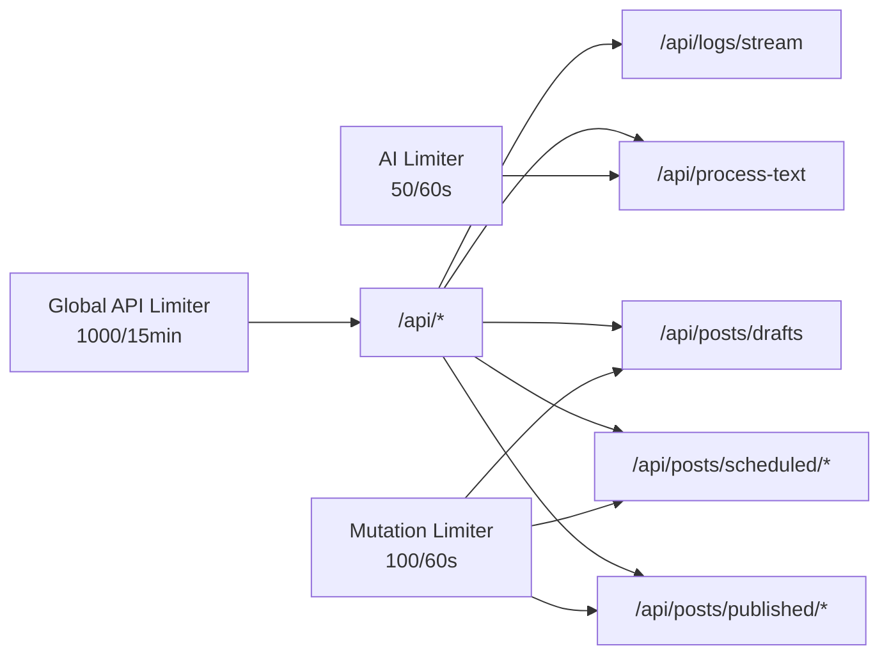

# API Reference

<cite>
**Referenced Files in This Document**
- [server.ts](file://server.ts)
- [App.tsx](file://src/App.tsx)
- [useDrafts.ts](file://src/hooks/useDrafts.ts)
- [useScheduledPosts.ts](file://src/hooks/useScheduledPosts.ts)
- [usePublishedPosts.ts](file://src/hooks/usePublishedPosts.ts)
- [types.ts](file://src/types.ts)
- [serverUtils.ts](file://src/serverUtils.ts)
</cite>

## Table of Contents
1. [Introduction](#introduction)
2. [Project Structure](#project-structure)
3. [Core Components](#core-components)
4. [Architecture Overview](#architecture-overview)
5. [Detailed Component Analysis](#detailed-component-analysis)
6. [Dependency Analysis](#dependency-analysis)
7. [Performance Considerations](#performance-considerations)
8. [Troubleshooting Guide](#troubleshooting-guide)
9. [Conclusion](#conclusion)
10. [Appendices](#appendices)

## Introduction
This document provides comprehensive API documentation for the AI News Bot backend. It covers the REST endpoints used by the frontend to manage posts and AI processing, along with streaming logs, rate limiting policies, and client-side integration patterns. The documented endpoints include:
- Real-time logging via Server-Sent Events
- Draft management for posts
- Scheduled posts management
- Published posts tracking
- AI content processing

## Project Structure
The backend is implemented as a Node.js/Express server with TypeScript. The frontend is a React application that communicates with the backend via HTTP requests and SSE. The server exposes multiple endpoints under the /api/ base path and applies rate limiting per endpoint group.



**Diagram sources**
- [server.ts:342-352](file://server.ts#L342-L352)
- [server.ts:1146-1231](file://server.ts#L1146-L1231)
- [server.ts:1150-1155](file://server.ts#L1150-L1155)
- [App.tsx:194-251](file://src/App.tsx#L194-L251)

**Section sources**
- [server.ts:342-352](file://server.ts#L342-L352)
- [server.ts:1146-1231](file://server.ts#L1146-L1231)
- [server.ts:1150-1155](file://server.ts#L1150-L1155)
- [App.tsx:194-251](file://src/App.tsx#L194-L251)

## Core Components
- Express server with CORS enabled and rate limiters applied to /api/.
- SSE endpoint for real-time logs (/api/logs/stream).
- Post lifecycle endpoints for drafts, scheduling, publishing, and published tracking.
- AI processing endpoint for translating and formatting content.
- Frontend integration via a universal fetch wrapper supporting both web and native environments.

**Section sources**
- [server.ts:44-72](file://server.ts#L44-L72)
- [server.ts:342-352](file://server.ts#L342-L352)
- [server.ts:1146-1231](file://server.ts#L1146-L1231)
- [server.ts:1150-1155](file://server.ts#L1150-L1155)
- [App.tsx:194-251](file://src/App.tsx#L194-L251)

## Architecture Overview
The frontend uses a unified fetch wrapper to communicate with the backend. The wrapper supports native HTTP requests (via Capacitor Http) and browser fetch, with timeouts and error normalization. The backend enforces rate limits per endpoint group and serves SSE for live logs.



**Diagram sources**
- [useDrafts.ts:31-54](file://src/hooks/useDrafts.ts#L31-L54)
- [App.tsx:194-251](file://src/App.tsx#L194-L251)
- [server.ts:1185-1195](file://server.ts#L1185-L1195)

## Detailed Component Analysis

### Real-time Logging Endpoint
- Path: /api/logs/stream
- Method: GET
- Description: Server-Sent Events endpoint that streams recent log entries to connected clients.
- Headers:
  - Content-Type: text/event-stream
  - Cache-Control: no-cache
  - Connection: keep-alive
- Response: Streamed events containing log lines as JSON strings.
- Client behavior:
  - Establishes a persistent connection.
  - Receives data: lines until the client disconnects or the server closes the connection.
- Notes:
  - The server maintains a fixed-size ring buffer of recent logs and broadcasts to all connected clients.



**Diagram sources**
- [server.ts:218-277](file://server.ts#L218-L277)
- [server.ts:342-352](file://server.ts#L342-L352)

**Section sources**
- [server.ts:342-352](file://server.ts#L342-L352)
- [server.ts:218-277](file://server.ts#L218-L277)

### Draft Management
- Base path: /api/posts/drafts
- Methods:
  - GET: Retrieve all drafts.
  - POST: Save or update a draft. Ensures presence of id, status, timestamps.
  - DELETE /:id: Remove a draft by id.
- Request body (POST):
  - Accepts a post object with fields such as id, text, buttons, status, timestamps, and optional parsedContent.
- Response:
  - GET returns an array of draft objects.
  - POST/DELETE returns the affected resource or success indicator.
- Rate limiter: mutationRateLimiter.



**Diagram sources**
- [server.ts:1185-1195](file://server.ts#L1185-L1195)

**Section sources**
- [server.ts:1185-1202](file://server.ts#L1185-L1202)
- [types.ts:13-26](file://src/types.ts#L13-L26)

### Scheduled Posts
- Base path: /api/posts/scheduled
- Methods:
  - GET: List all posts with status scheduled.
  - POST /schedule: Schedule an existing draft or create a new one with status scheduled.
- Request body (POST /schedule):
  - Accepts a post object with id and optional updates; ensures status and timestamps.
- Response:
  - GET returns an array of scheduled posts.
  - POST returns the updated or newly created scheduled post.
- Rate limiter: mutationRateLimiter.



**Diagram sources**
- [useScheduledPosts.ts:9-29](file://src/hooks/useScheduledPosts.ts#L9-L29)
- [server.ts:1205-1207](file://server.ts#L1205-L1207)

**Section sources**
- [server.ts:1205-1231](file://server.ts#L1205-L1231)
- [types.ts:34-37](file://src/types.ts#L34-L37)

### Published Posts Tracking
- Base path: /api/posts/published
- Methods:
  - GET: List all published posts.
  - DELETE /:id: Remove a published post by id.
- Response:
  - GET returns an array of published posts.
  - DELETE returns success indicator.
- Rate limiter: mutationRateLimiter.



**Diagram sources**
- [server.ts:1212-1217](file://server.ts#L1212-L1217)

**Section sources**
- [server.ts:1209-1217](file://server.ts#L1209-L1217)
- [types.ts:13-26](file://src/types.ts#L13-L26)

### AI Content Processing
- Base path: /api/process-text
- Method: POST
- Purpose: Translate and format content using AI providers (fallback chain).
- Request body:
  - text: Required. The source text to process.
  - provider: Optional. Override preferred provider for this request.
- Response:
  - processedText: The AI-generated formatted text.
- Rate limiter: aiRateLimiter + mutationRateLimiter.



**Diagram sources**
- [server.ts:1150-1155](file://server.ts#L1150-L1155)
- [server.ts:412-645](file://server.ts#L412-L645)

**Section sources**
- [server.ts:1150-1155](file://server.ts#L1150-L1155)
- [server.ts:412-645](file://server.ts#L412-L645)

### Frontend API Integration Patterns
- Universal fetch wrapper:
  - Validates URLs and normalizes headers.
  - Supports native HTTP (Capacitor) and browser fetch with timeouts.
  - Returns a normalized response object with ok, status, json(), text(), and headers.
- Client-side hooks:
  - useDrafts: Loads, saves, and deletes drafts via /api/posts/drafts.
  - useScheduledPosts: Loads scheduled posts via /api/posts/scheduled.
  - usePublishedPosts: Loads published posts via /api/posts/published.
- Error handling:
  - Frontend maps common AI errors (quota, auth) to user-friendly messages.
  - universalFetch throws standardized error codes for malformed URLs, timeouts, and native failures.

```mermaid
classDiagram
class App_tsx_universalFetch {
+call(url, options)
+returns : { ok, status, json(), text(), headers }
}
class useDrafts_ts {
+loadDrafts()
+saveDraft(draft)
+deleteDraft(id)
}
class server_ts_PostsAPI {
+GET /api/posts/drafts
+POST /api/posts/drafts
+DELETE /api/posts/drafts/ : id
}
useDrafts_ts --> App_tsx_universalFetch : "uses"
App_tsx_universalFetch --> server_ts_PostsAPI : "HTTP calls"
```

**Diagram sources**
- [App.tsx:194-251](file://src/App.tsx#L194-L251)
- [useDrafts.ts:9-29](file://src/hooks/useDrafts.ts#L9-L29)
- [server.ts:1185-1202](file://server.ts#L1185-L1202)

**Section sources**
- [App.tsx:194-251](file://src/App.tsx#L194-L251)
- [useDrafts.ts:9-29](file://src/hooks/useDrafts.ts#L9-L29)
- [useScheduledPosts.ts:9-29](file://src/hooks/useScheduledPosts.ts#L9-L29)
- [usePublishedPosts.ts:9-29](file://src/hooks/usePublishedPosts.ts#L9-L29)

## Dependency Analysis
- Rate limiting:
  - Global API limiter (/api/): 1000 requests per 15 minutes.
  - AI limiter (/api/process-text and related): 50 requests per 60 seconds.
  - Mutation limiter (drafts/schedules/publish): 100 requests per 60 seconds.
- Environment and persistence:
  - Uses local files for storing posts, published posts, templates, and keys.
  - Sanitized HTML helper for Telegram-safe formatting.
- Logging:
  - FileLogger writes structured logs to ./logs/app.log.
  - LogManager maintains a rolling buffer and SSE broadcasting.



**Diagram sources**
- [server.ts:51-72](file://server.ts#L51-L72)
- [server.ts:1146-1231](file://server.ts#L1146-L1231)
- [server.ts:1150-1155](file://server.ts#L1150-L1155)

**Section sources**
- [server.ts:51-72](file://server.ts#L51-L72)
- [server.ts:1146-1231](file://server.ts#L1146-L1231)
- [server.ts:1150-1155](file://server.ts#L1150-L1155)

## Performance Considerations
- SSE scalability: Each client connection holds a reference; avoid excessive concurrent clients for long periods.
- Rate limits: Respect per-endpoint limits to prevent 429 responses.
- Payload sizes: The server accepts large JSON payloads; keep request bodies reasonable to avoid timeouts.
- AI retries: The AI processor attempts multiple providers and models; expect delays under quota constraints.

## Troubleshooting Guide
- 400 Bad Request:
  - Missing required fields (e.g., text in /api/process-text, invalid presets in /api/config/chat-id-presets).
- 401/403:
  - AI provider authentication failures; verify API keys and permissions.
- 429 Too Many Requests:
  - Exceeded rate limits; reduce request frequency or wait for reset windows.
- 500 Internal Server Error:
  - Unexpected server-side exceptions; check logs and retry.
- Frontend errors:
  - INVALID_URL, MALFORMED_URL, TIMEOUT_ERROR, Native Request Failed are thrown by universalFetch and should be handled gracefully.

**Section sources**
- [server.ts:1030-1036](file://server.ts#L1030-L1036)
- [server.ts:1150-1155](file://server.ts#L1150-L1155)
- [App.tsx:194-251](file://src/App.tsx#L194-L251)

## Conclusion
The AI News Bot backend provides a cohesive set of REST endpoints for managing posts and AI processing, complemented by real-time logging via SSE. The frontend integrates seamlessly through a universal fetch abstraction, while robust rate limiting and error handling ensure reliable operation.

## Appendices

### Endpoint Summary

- Real-time Logs
  - GET /api/logs/stream
  - Response: Server-Sent Events stream of log lines

- Drafts
  - GET /api/posts/drafts
  - POST /api/posts/drafts
  - DELETE /api/posts/drafts/:id

- Scheduled Posts
  - GET /api/posts/scheduled
  - POST /api/posts/schedule

- Published Posts
  - GET /api/posts/published
  - DELETE /api/posts/published/:id

- AI Processing
  - POST /api/process-text

- Rate Limits
  - Global API limiter: 1000 per 15 minutes
  - AI limiter: 50 per 60 seconds
  - Mutation limiter: 100 per 60 seconds

**Section sources**
- [server.ts:342-352](file://server.ts#L342-L352)
- [server.ts:1146-1231](file://server.ts#L1146-L1231)
- [server.ts:1150-1155](file://server.ts#L1150-L1155)
- [server.ts:51-72](file://server.ts#L51-L72)