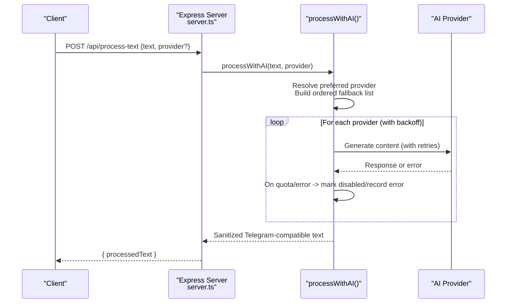
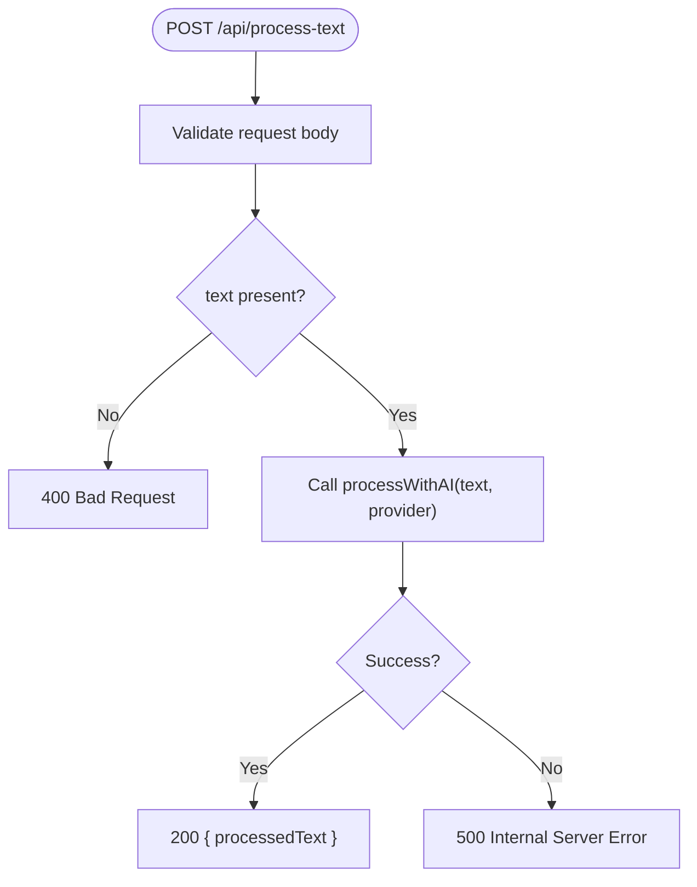
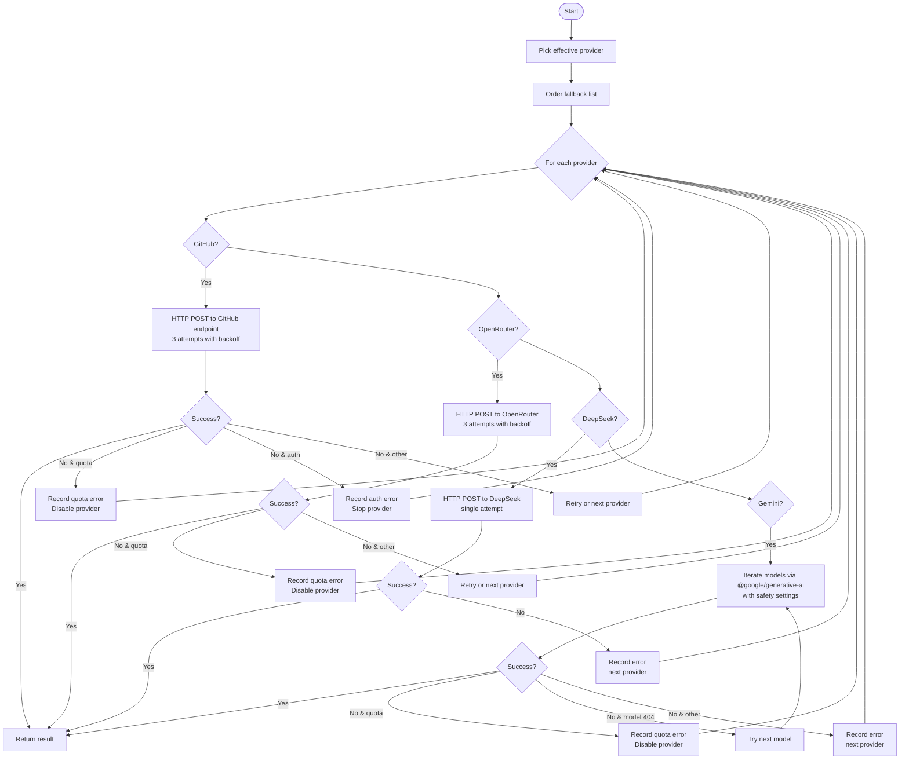
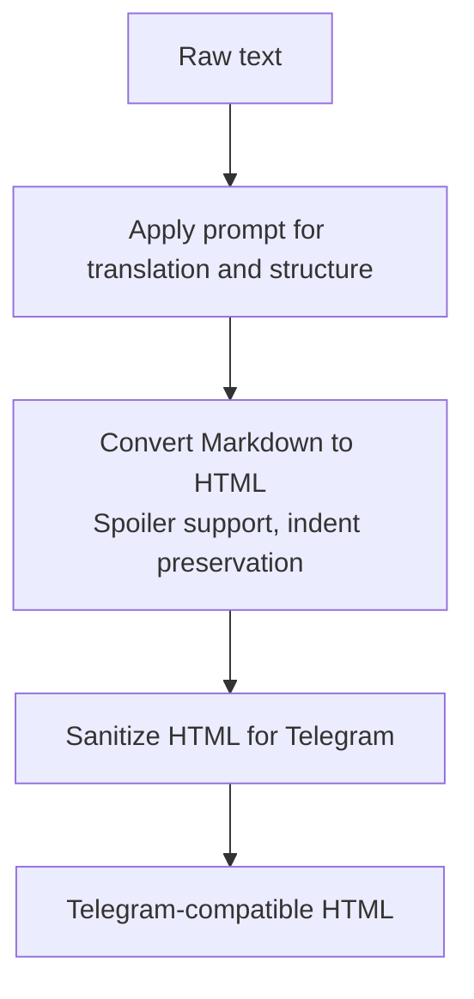
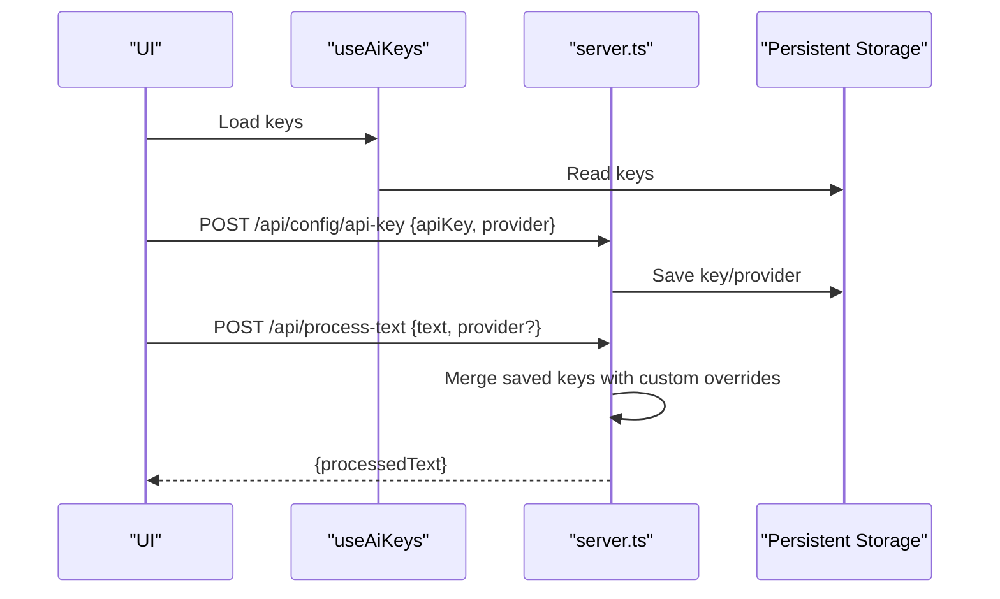
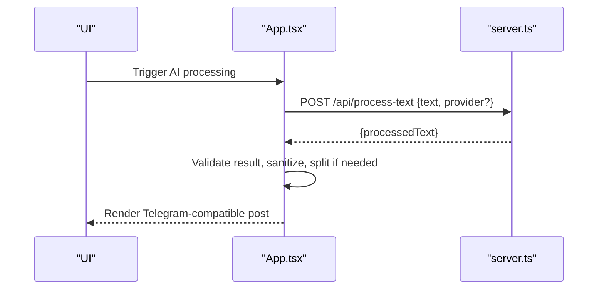
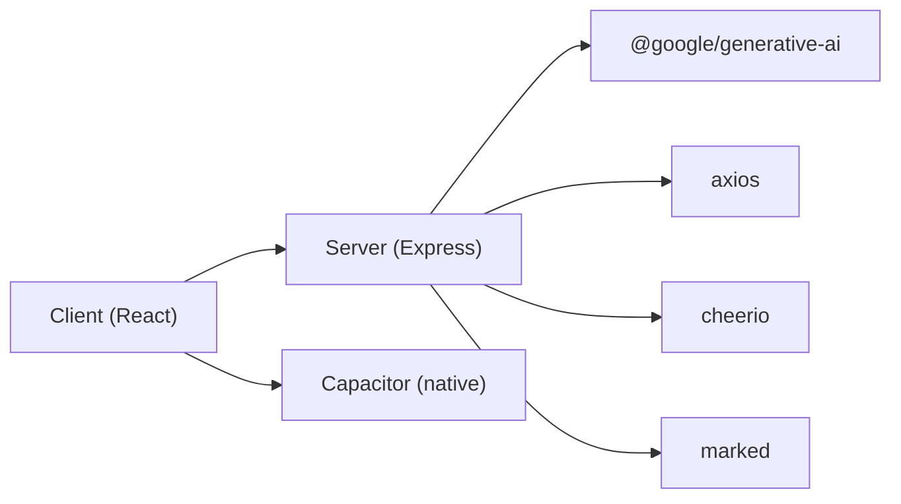

# AI Processing Endpoint

<cite>
**Referenced Files in This Document**
- [server.ts](file://server.ts)
- [App.tsx](file://src/App.tsx)
- [useAiKeys.ts](file://src/hooks/useAiKeys.ts)
- [standaloneService.ts](file://src/services/standaloneService.ts)
- [types.ts](file://src/types.ts)
- [README.md](file://README.md)
- [package.json](file://package.json)
</cite>

## Table of Contents
1. [Introduction](#introduction)
2. [Project Structure](#project-structure)
3. [Core Components](#core-components)
4. [Architecture Overview](#architecture-overview)
5. [Detailed Component Analysis](#detailed-component-analysis)
6. [Dependency Analysis](#dependency-analysis)
7. [Performance Considerations](#performance-considerations)
8. [Troubleshooting Guide](#troubleshooting-guide)
9. [Conclusion](#conclusion)
10. [Appendices](#appendices)

## Introduction
This document provides comprehensive API documentation for the AI content processing endpoint, focusing on the HTTP POST endpoint that transforms raw text into Telegram-ready posts via multiple AI providers. It covers request/response schemas, provider selection, custom API key overrides, multi-provider fallback mechanics, content transformation pipeline (sanitization, markdown formatting, translation), and client-side integration guidelines for async processing, progress monitoring, and robust error handling.

## Project Structure
The AI processing pipeline spans both server and client layers:
- Server exposes endpoints for text processing, URL processing, and configuration of API keys and preferred providers.
- Client integrates with the server to submit text, monitor processing, and render sanitized Telegram-compatible output.

```mermaid
graph TB
subgraph "Client"
UI["React UI<br/>App.tsx"]
Hooks["useAiKeys.ts"]
Services["standaloneService.ts"]
end
subgraph "Server"
Express["Express Server<br/>server.ts"]
Endpoints["Endpoints<br/>/api/process-text<br/>/api/config/api-key<br/>/api/test-ai"]
Providers["AI Providers<br/>Gemini/GitHub/OpenRouter/DeepSeek"]
Sanitizer["HTML Sanitizer<br/>sanitizeHtml()"]
end
UI --> Express
Hooks --> UI
Services --> UI
UI --> Endpoints
Endpoints --> Providers
Endpoints --> Sanitizer
```

**Diagram sources**
- [server.ts:1150-1183](file://server.ts#L1150-L1183)
- [server.ts:1038-1048](file://server.ts#L1038-L1048)
- [server.ts:1328-1339](file://server.ts#L1328-L1339)
- [server.ts:282-340](file://server.ts#L282-L340)
- [App.tsx:811-864](file://src/App.tsx#L811-L864)
- [useAiKeys.ts:1-57](file://src/hooks/useAiKeys.ts#L1-L57)
- [standaloneService.ts:148-159](file://src/services/standaloneService.ts#L148-L159)

**Section sources**
- [server.ts:1150-1183](file://server.ts#L1150-L1183)
- [server.ts:1038-1048](file://server.ts#L1038-L1048)
- [server.ts:1328-1339](file://server.ts#L1328-L1339)
- [server.ts:282-340](file://server.ts#L282-L340)
- [App.tsx:811-864](file://src/App.tsx#L811-L864)
- [useAiKeys.ts:1-57](file://src/hooks/useAiKeys.ts#L1-L57)
- [standaloneService.ts:148-159](file://src/services/standaloneService.ts#L148-L159)

## Core Components
- AI Provider Selection and Fallback
  - Providers: Gemini, GitHub, OpenRouter, DeepSeek
  - Preferred provider resolution from persisted settings or request parameter
  - Ordered fallback loop with per-provider retry/backoff and quota-aware disabling
- Content Transformation Pipeline
  - Prompt engineering for translation and structuring
  - Markdown-to-HTML conversion with spoiler support
  - HTML sanitization tailored for Telegram’s HTML subset
- Endpoint Exposure
  - POST /api/process-text: Processes raw text with optional provider override
  - POST /api/config/api-key: Persists provider API keys and preferred provider
  - POST /api/test-ai: Validates a provider/key combination

**Section sources**
- [server.ts:412-645](file://server.ts#L412-L645)
- [server.ts:1150-1155](file://server.ts#L1150-L1155)
- [server.ts:1038-1048](file://server.ts#L1038-L1048)
- [server.ts:1328-1339](file://server.ts#L1328-L1339)

## Architecture Overview
The AI processing flow is orchestrated by the server’s processor, which selects a provider, attempts generation with retries, and returns sanitized Telegram-compatible text.

**Diagram sources**
- [server.ts:1150-1155](file://server.ts#L1150-L1155)
- [server.ts:412-645](file://server.ts#L412-L645)

## Detailed Component Analysis

### Endpoint Definition: POST /api/process-text
- Method: POST
- Path: /api/process-text
- Rate limiter: Dedicated AI rate limiter plus mutation limiter
- Request Body
  - text: string (required)
  - provider: string (optional; overrides persisted preferred provider)
- Response
  - processedText: string (Telegram-compatible HTML)
- Error Responses
  - 400: Validation errors (missing text)
  - 500: Internal processing errors

**Diagram sources**
- [server.ts:1150-1155](file://server.ts#L1150-L1155)

**Section sources**
- [server.ts:1150-1155](file://server.ts#L1150-L1155)

### Provider Selection and Multi-Provider Fallback
- Provider Resolution
  - Effective provider: request parameter > persisted preferred provider > default
  - Ordered fallback list: [effective, others in fixed order]
- Per-Provider Logic
  - GitHub: Azure OpenAI-compatible endpoint with bearer token; 3 attempts with backoff
  - Gemini: Multiple model fallback; quota detection disables provider temporarily
  - OpenRouter: OpenAI-compatible endpoint; 3 attempts with backoff
  - DeepSeek: DeepSeek-compatible endpoint; single attempt
- Quota and Error Handling
  - Quota exhaustion (429/RESOURCE_EXHAUSTED) disables provider for current run
  - Auth failures (401/403) halt attempts for that provider
  - Non-recoverable errors recorded and surfaced to client

**Diagram sources**
- [server.ts:412-645](file://server.ts#L412-L645)

**Section sources**
- [server.ts:412-645](file://server.ts#L412-L645)

### Content Transformation Pipeline
- Prompt Engineering
  - Translation to Russian, structuring for Telegram posts, preserving technical terms, enforcing HTML-only formatting
- Markdown Formatting
  - Client-side: MarkdownIt with spoiler extension and indentation preservation
  - Server-side: Marked rendering followed by sanitizer
- HTML Sanitization for Telegram
  - Allowed tags: b, strong, i, em, u, ins, s, strike, del, code, pre, a, tg-spoiler
  - URL sanitization and tag placeholder handling
  - Removal of disallowed tags and normalization of whitespace
- Telegram-Compatible Output
  - parse_mode: HTML
  - Message splitting for long posts (≤4096 characters per chunk)

**Diagram sources**
- [server.ts:425-439](file://server.ts#L425-L439)
- [server.ts:852-861](file://server.ts#L852-L861)
- [server.ts:282-340](file://server.ts#L282-L340)
- [App.tsx:375-399](file://src/App.tsx#L375-L399)

**Section sources**
- [server.ts:425-439](file://server.ts#L425-L439)
- [server.ts:852-861](file://server.ts#L852-L861)
- [server.ts:282-340](file://server.ts#L282-L340)
- [App.tsx:375-399](file://src/App.tsx#L375-L399)

### API Key Management and Provider Selection Strategies
- Persisting Keys and Preferred Provider
  - POST /api/config/api-key supports saving provider-specific keys and setting preferred provider
  - Keys are stored in persistent storage and merged with custom overrides during processing
- Client-Side Key Management
  - useAiKeys hook loads/stores keys locally (browser or Capacitor preferences)
  - UI allows selecting preferred provider and testing keys against server
- Provider Selection Strategies
  - Prefer stable providers with higher quotas for production
  - Use custom API keys per request to isolate failures and enable per-provider tuning
  - Monitor quota warnings and adjust provider selection dynamically

**Diagram sources**
- [server.ts:1038-1048](file://server.ts#L1038-L1048)
- [server.ts:1150-1155](file://server.ts#L1150-L1155)
- [useAiKeys.ts:1-57](file://src/hooks/useAiKeys.ts#L1-L57)

**Section sources**
- [server.ts:1038-1048](file://server.ts#L1038-L1048)
- [server.ts:1150-1155](file://server.ts#L1150-L1155)
- [useAiKeys.ts:1-57](file://src/hooks/useAiKeys.ts#L1-L57)

### Supported AI Providers, Requirements, and Error Patterns
- Gemini
  - SDK: @google/generative-ai
  - Models: Multiple fallback models
  - Safety settings: Explicitly configured
  - Quota handling: Detects quota exhaustion and disables provider for the run
- GitHub (Azure OpenAI-compatible)
  - Endpoint: models.inference.ai.azure.com
  - Authentication: Bearer token
  - Retries: Up to 3 with exponential-like backoff
  - Auth errors: Immediate stop for provider
- OpenRouter
  - Endpoint: openrouter.ai/api/v1/chat/completions
  - Authentication: Bearer token
  - Retries: Up to 3 with backoff
- DeepSeek
  - Endpoint: api.deepseek.com/chat/completions
  - Authentication: Bearer token
  - Single attempt per provider pass

**Section sources**
- [server.ts:458-473](file://server.ts#L458-L473)
- [server.ts:509-536](file://server.ts#L509-L536)
- [server.ts:572-589](file://server.ts#L572-L589)
- [server.ts:599-625](file://server.ts#L599-L625)

### Client-Side Implementation Guidelines
- Async Processing and Progress Monitoring
  - Use a dedicated async function to call /api/process-text
  - Show loading indicators while awaiting response
  - For long-running operations, consider streaming logs via /api/logs/stream
- Result Handling and Error Management
  - Parse processedText and validate it is non-empty and not an error marker
  - Map common errors (quota exceeded, invalid key) to user-friendly messages
  - Respect Telegram character limits and split messages if needed
- Timeout Handling
  - Server enforces timeouts for external provider calls; client should surface timeout errors gracefully
  - Consider implementing client-side timeouts and retry policies for transient failures
- Environment Setup
  - Configure environment variables or UI-managed keys as per project README
  - Ensure CORS and base URL are correctly configured for cross-platform builds

**Diagram sources**
- [App.tsx:811-864](file://src/App.tsx#L811-L864)
- [server.ts:1150-1155](file://server.ts#L1150-L1155)

**Section sources**
- [App.tsx:811-864](file://src/App.tsx#L811-L864)
- [README.md:16-24](file://README.md#L16-L24)

## Dependency Analysis
- Server Dependencies
  - Express, rate-limit, cors, telegraf, axios, dotenv, cheerio, marked, @google/generative-ai
- Client Dependencies
  - React, markdown-it, axios, telegraf (client-side service), Capacitor plugins (native)
- Inter-Process Communication
  - Client communicates with server endpoints; server persists keys and orchestrates AI providers

**Diagram sources**
- [package.json:19-55](file://package.json#L19-L55)
- [server.ts:1-17](file://server.ts#L1-L17)

**Section sources**
- [package.json:19-55](file://package.json#L19-L55)
- [server.ts:1-17](file://server.ts#L1-L17)

## Performance Considerations
- Rate Limiting
  - Dedicated AI and mutation rate limiters protect server resources and providers
- Provider Backoff
  - Exponential-like backoff reduces load on failing endpoints
- Model Fallback
  - Gemini attempts multiple models to improve success probability
- Payload Size
  - JSON payload size limits are configured on the server; keep input concise

[No sources needed since this section provides general guidance]

## Troubleshooting Guide
- Common Errors
  - Missing text: 400 Bad Request
  - Quota exceeded: Provider disabled for run; switch provider or retry later
  - Invalid API key: 401/403; verify key and permissions
  - Network timeouts: Increase client-side timeout or reduce payload size
- Diagnostics
  - Use /api/logs/stream to inspect server-side logs
  - Use /api/test-ai to validate a provider/key combination
  - Verify environment variables and UI-configured keys
- Recovery Mechanisms
  - Retry with different provider or custom API key override
  - Reduce input length or simplify content
  - Monitor quota windows and stagger requests

**Section sources**
- [server.ts:1150-1155](file://server.ts#L1150-L1155)
- [server.ts:1328-1339](file://server.ts#L1328-L1339)
- [server.ts:342-352](file://server.ts#L342-L352)

## Conclusion
The /api/process-text endpoint provides a robust, provider-agnostic AI content processing pipeline with multi-tier fallback, strict sanitization for Telegram, and comprehensive error handling. By combining persisted keys, custom overrides, and client-side resilience, applications can reliably transform raw text into polished Telegram posts.

[No sources needed since this section summarizes without analyzing specific files]

## Appendices

### Endpoint Reference: POST /api/process-text
- Path: /api/process-text
- Method: POST
- Rate limiter: aiRateLimiter + mutationRateLimiter
- Request Body
  - text: string (required)
  - provider: string (optional)
- Response
  - processedText: string
- Errors
  - 400: Missing text
  - 500: Processing error

**Section sources**
- [server.ts:1150-1155](file://server.ts#L1150-L1155)

### Endpoint Reference: POST /api/config/api-key
- Path: /api/config/api-key
- Method: POST
- Rate limiter: mutationRateLimiter
- Request Body
  - apiKey: string (required for provider-specific key)
  - provider: string (required for provider-specific key)
  - preferredProvider: string (optional; sets preferred provider)
- Response
  - success: boolean
- Errors
  - 400: Missing required fields

**Section sources**
- [server.ts:1038-1048](file://server.ts#L1038-L1048)

### Endpoint Reference: POST /api/test-ai
- Path: /api/test-ai
- Method: POST
- Rate limiter: aiRateLimiter
- Request Body
  - provider: string (required)
  - apiKey: string (required)
  - text: string (optional; defaults to a test phrase)
- Response
  - success: boolean
  - result: string
- Errors
  - 400: Missing provider or apiKey

**Section sources**
- [server.ts:1328-1339](file://server.ts#L1328-L1339)

### Client-Side Integration Notes
- Use universalFetch for reliable cross-platform HTTP calls
- Implement graceful error mapping for quota and auth failures
- Respect Telegram character limits and split messages when needed

**Section sources**
- [App.tsx:194-201](file://src/App.tsx#L194-L201)
- [App.tsx:851-864](file://src/App.tsx#L851-L864)