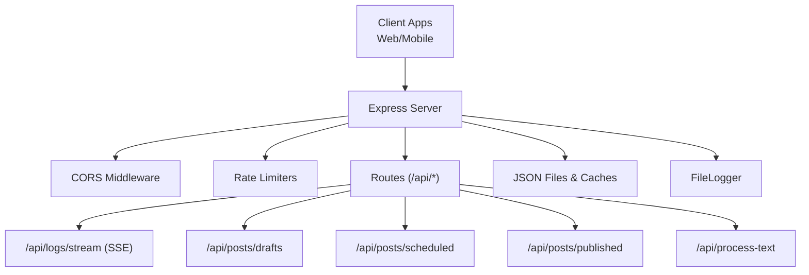
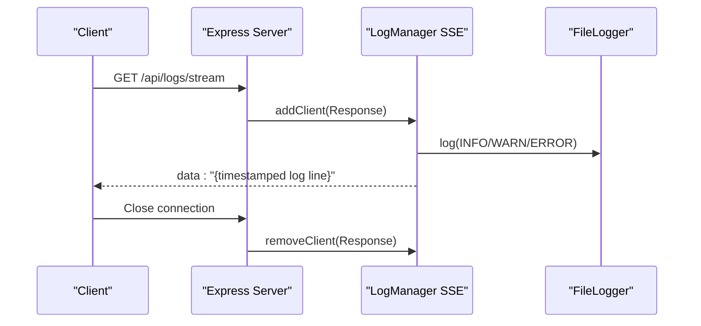
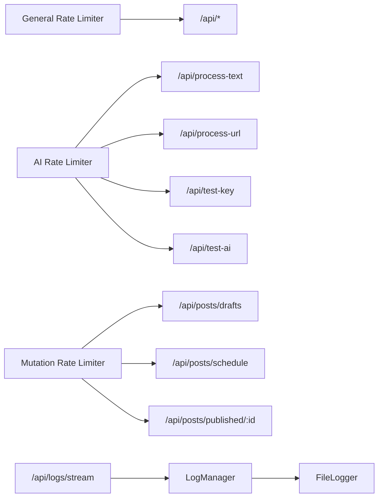

# Backend API Endpoints

<cite>
**Referenced Files in This Document**
- [server.ts](file://server.ts)
- [types.ts](file://src/types.ts)
- [useDrafts.ts](file://src/hooks/useDrafts.ts)
- [useScheduledPosts.ts](file://src/hooks/useScheduledPosts.ts)
- [usePublishedPosts.ts](file://src/hooks/usePublishedPosts.ts)
- [serverUtils.ts](file://src/serverUtils.ts)
</cite>

## Table of Contents
1. [Introduction](#introduction)
2. [Project Structure](#project-structure)
3. [Core Components](#core-components)
4. [Architecture Overview](#architecture-overview)
5. [Detailed Component Analysis](#detailed-component-analysis)
6. [Dependency Analysis](#dependency-analysis)
7. [Performance Considerations](#performance-considerations)
8. [Troubleshooting Guide](#troubleshooting-guide)
9. [Conclusion](#conroduction)
10. [Appendices](#appendices)

## Introduction
This document provides comprehensive API documentation for the AI News Bot server REST endpoints. It covers:
- Real-time logging via Server-Sent Events
- Draft post management
- Scheduled post operations
- Published content tracking
- AI content processing

For each endpoint, you will find HTTP methods, URL patterns, request/response schemas, authentication requirements, error codes, parameter descriptions, example requests/responses, usage scenarios, rate limiting policies, CORS configuration, error handling strategies, and client implementation guidelines.

## Project Structure
The server is implemented as a single Express application with TypeScript. Key areas:
- API routes under /api/*
- Rate limiters for general, AI, and mutation endpoints
- CORS configuration allowing GET, POST, PUT, DELETE, OPTIONS
- SSE logging endpoint for real-time updates
- Data persistence via JSON files and in-memory caches
- Client-side hooks demonstrate usage of draft/scheduled/published endpoints

**Diagram sources**
- [server.ts:44-60](file://server.ts#L44-L60)
- [server.ts:342-352](file://server.ts#L342-L352)
- [server.ts:1157-1241](file://server.ts#L1157-L1241)
- [server.ts:1146-1155](file://server.ts#L1146-L1155)
- [serverUtils.ts:7-22](file://src/serverUtils.ts#L7-L22)

**Section sources**
- [server.ts:44-60](file://server.ts#L44-L60)
- [server.ts:342-352](file://server.ts#L342-L352)
- [server.ts:1146-1241](file://server.ts#L1146-L1241)
- [serverUtils.ts:7-22](file://src/serverUtils.ts#L7-L22)

## Core Components
- Rate Limiters
  - General API limiter: 1000 requests per 15 minutes
  - AI limiter: 50 requests per 1 minute
  - Mutation limiter: 100 requests per 1 minute
- CORS: Enabled for GET, POST, PUT, DELETE, OPTIONS with Content-Type, Accept, Origin allowed headers
- Logging: FileLogger writes to ./logs/app.log; SSE endpoint streams recent logs
- Data Persistence: Posts, published posts, templates, and settings stored in JSON files with in-memory caches

**Section sources**
- [server.ts:51-72](file://server.ts#L51-L72)
- [server.ts:44-49](file://server.ts#L44-L49)
- [serverUtils.ts:7-22](file://src/serverUtils.ts#L7-L22)

## Architecture Overview
The server exposes REST endpoints grouped by functionality. SSE is used for real-time logging. AI processing is handled by a dedicated function that tries multiple providers with fallbacks. Drafts, scheduled, and published posts are managed via simple CRUD-like endpoints backed by JSON storage.

**Diagram sources**
- [server.ts:342-352](file://server.ts#L342-L352)
- [server.ts:218-277](file://server.ts#L218-L277)
- [serverUtils.ts:17-21](file://src/serverUtils.ts#L17-L21)

## Detailed Component Analysis

### Real-Time Logging Endpoint
- Method: GET
- URL: /api/logs/stream
- Purpose: Server-Sent Events stream of recent log entries
- Headers:
  - Content-Type: text/event-stream
  - Cache-Control: no-cache
  - Connection: keep-alive
- Behavior:
  - Establishes long-lived connection
  - Streams log lines as they are written
  - Automatically removes disconnected clients
- Client usage:
  - Use EventSource to consume events
  - Handle reconnects and connection loss gracefully
- Error handling:
  - On close, client is removed from active clients
  - Server does not send explicit error frames; clients should monitor connection state

Example request:
- curl -N http://localhost:3000/api/logs/stream

Example response (streamed):
- data: "[14:30:22] INFO Starting bot..."
- data: "[14:30:23] WARN Token not set"

**Section sources**
- [server.ts:342-352](file://server.ts#L342-L352)
- [server.ts:218-277](file://server.ts#L218-L277)
- [serverUtils.ts:17-21](file://src/serverUtils.ts#L17-L21)

### Draft Post Management
- Methods:
  - GET /api/posts/drafts
  - POST /api/posts/drafts
  - DELETE /api/posts/drafts/:id
- Request/Response Schemas:
  - DraftPost fields include identifiers, timestamps, status, content, images, buttons, and scheduling info
  - Response returns the saved or filtered drafts
- Parameters:
  - GET: none
  - POST: DraftPost object (id optional; auto-generated if missing)
  - DELETE: Path parameter :id
- Behavior:
  - POST creates or updates a draft; sets status to draft and timestamps
  - DELETE removes a draft by id; returns success if found and removed
- Error codes:
  - 404 Not Found when deleting a non-existent draft
  - 500 Internal Server Error on storage failures

Example request (POST):
- POST /api/posts/drafts
- Body: { "text": "...", "selectedImages": [...], "buttons": [...] }

Example response (POST):
- { "id": "...", "status": "draft", "createdAt": 1700000000000, "updatedAt": 1700000000000, ... }

Usage scenario:
- Client loads drafts via GET, edits locally, saves via POST, deletes via DELETE

**Section sources**
- [server.ts:1157-1202](file://server.ts#L1157-L1202)
- [types.ts:13-26](file://src/types.ts#L13-L26)
- [useDrafts.ts:9-29](file://src/hooks/useDrafts.ts#L9-L29)
- [useDrafts.ts:31-54](file://src/hooks/useDrafts.ts#L31-L54)
- [useDrafts.ts:56-73](file://src/hooks/useDrafts.ts#L56-L73)

### Scheduled Post Operations
- Methods:
  - GET /api/posts/scheduled
  - POST /api/posts/schedule
- Request/Response Schemas:
  - GET returns array of posts with status "scheduled"
  - POST accepts a post object; if existing, updates fields and sets status to scheduled; otherwise creates with scheduled status
- Parameters:
  - GET: none
  - POST: DraftPost object (id required for update)
- Behavior:
  - POST ensures createdAt/updatedAt are set; assigns status "scheduled"
- Error codes:
  - 500 Internal Server Error on storage failures

Example request (POST):
- POST /api/posts/schedule
- Body: { "id": "...", "text": "...", "scheduledAt": 1700000000000 }

Example response (POST):
- { "id": "...", "status": "scheduled", "scheduledAt": 1700000000000, "updatedAt": 1700000000000 }

Usage scenario:
- Client schedules a draft by posting to /api/posts/schedule; server periodically publishes scheduled posts

**Section sources**
- [server.ts:1204-1231](file://server.ts#L1204-L1231)
- [types.ts:34-37](file://src/types.ts#L34-L37)
- [useScheduledPosts.ts:9-29](file://src/hooks/useScheduledPosts.ts#L9-L29)

### Published Content Tracking
- Methods:
  - GET /api/posts/published
  - DELETE /api/posts/published/:id
- Request/Response Schemas:
  - GET returns array of recently published posts
  - DELETE removes a published post by id
- Parameters:
  - GET: none
  - DELETE: Path parameter :id
- Behavior:
  - GET returns latest published items (server maintains a small history)
  - DELETE removes a published item by id
- Error codes:
  - 404 Not Found when deleting a non-existent published post
  - 500 Internal Server Error on storage failures

Example request (DELETE):
- DELETE /api/posts/published/:id

Example response (DELETE):
- { "success": true }

Usage scenario:
- Client lists published posts via GET, removes outdated entries via DELETE

**Section sources**
- [server.ts:1209-1217](file://server.ts#L1209-L1217)
- [usePublishedPosts.ts:9-29](file://src/hooks/usePublishedPosts.ts#L9-L29)

### AI Content Processing
- Methods:
  - POST /api/process-text
  - POST /api/process-url
  - POST /api/test-key
  - POST /api/test-ai
- Request/Response Schemas:
  - /api/process-text: requires text; returns processedText
  - /api/process-url: requires url; returns processedText and originalTitle
  - /api/test-key: validates a Gemini API key; returns success/model or 429 quota exceeded
  - /api/test-ai: tests AI processing with a given provider and key
- Parameters:
  - /api/process-text: { text: string, provider?: string }
  - /api/process-url: { url: string, provider?: string }
  - /api/test-key: { apiKey: string }
  - /api/test-ai: { provider: string, apiKey: string, text?: string }
- Rate limits:
  - AI limiter applies to /api/process-text, /api/process-url, /api/test-key, /api/test-ai
- Behavior:
  - AI processing attempts multiple providers with fallbacks and handles quotas/retries
  - /api/test-key checks availability of Gemini models for a key
- Error codes:
  - 400 Bad Request for missing parameters
  - 429 Too Many Requests when quotas are exceeded
  - 500 Internal Server Error on processing failures

Example request (POST /api/process-text):
- POST /api/process-text
- Body: { "text": "Original Chinese text...", "provider": "gemini" }

Example response (POST /api/process-text):
- { "processedText": "Translated Russian text..." }

Usage scenario:
- Client sends text to be translated/structured; optionally pass provider preference

**Section sources**
- [server.ts:1146-1155](file://server.ts#L1146-L1155)
- [server.ts:1161-1183](file://server.ts#L1161-L1183)
- [server.ts:1289-1339](file://server.ts#L1289-L1339)

## Dependency Analysis
- Rate limiters are applied to all /api/* routes globally and selectively to AI/mutation endpoints
- SSE depends on LogManager and FileLogger
- Draft/Scheduled/Published endpoints depend on in-memory caches and JSON persistence
- AI endpoints depend on provider-specific integrations and environment configuration

**Diagram sources**
- [server.ts:51-72](file://server.ts#L51-L72)
- [server.ts:342-352](file://server.ts#L342-L352)
- [server.ts:218-277](file://server.ts#L218-L277)
- [serverUtils.ts:7-22](file://src/serverUtils.ts#L7-L22)

**Section sources**
- [server.ts:51-72](file://server.ts#L51-L72)
- [server.ts:342-352](file://server.ts#L342-L352)
- [server.ts:218-277](file://server.ts#L218-L277)
- [serverUtils.ts:7-22](file://src/serverUtils.ts#L7-L22)

## Performance Considerations
- SSE streaming: Efficient for low-latency log delivery; ensure clients handle reconnection and backpressure
- Rate limiting: Tune thresholds based on deployment scale; consider per-user tokens for stricter enforcement
- AI processing: Provider fallback reduces downtime; cache successful translations where appropriate
- File I/O: JSON persistence is simple but can be a bottleneck under heavy load; consider database migration for production

## Troubleshooting Guide
- SSE not receiving events:
  - Verify client uses EventSource and handles connection lifecycle
  - Check server logs for errors and confirm /api/logs/stream is reachable
- 429 Too Many Requests:
  - Reduce request frequency or adjust rate limiter configuration
  - For AI endpoints, respect quota exhaustion and retry after suggested delay
- 500 Internal Server Error:
  - Inspect server logs and ensure required environment variables are set
  - Validate JSON file paths and permissions
- CORS issues:
  - Confirm browser requests include proper origin and credentials if needed
  - Review allowed methods and headers configuration

**Section sources**
- [server.ts:44-49](file://server.ts#L44-L49)
- [server.ts:51-72](file://server.ts#L51-L72)
- [serverUtils.ts:17-21](file://src/serverUtils.ts#L17-L21)

## Conclusion
The AI News Bot server provides a focused set of REST endpoints for managing posts and real-time logging, with built-in rate limiting, CORS, and robust AI processing. Clients should implement SSE consumers for logs, handle rate limits, and follow the documented schemas for reliable operation.

## Appendices

### Authentication and Security
- No authentication middleware is present on /api/* routes in the provided code
- Recommendations:
  - Add JWT or API key middleware
  - Enforce HTTPS in production
  - Validate and sanitize all inputs rigorously

### CORS Configuration
- Allowed methods: GET, POST, PUT, DELETE, OPTIONS
- Allowed headers: Content-Type, Accept, Origin
- Credentials: enabled

**Section sources**
- [server.ts:44-49](file://server.ts#L44-L49)

### Rate Limiting Policies
- General API limiter: 1000 per 15 minutes
- AI limiter: 50 per 1 minute
- Mutation limiter: 100 per 1 minute

**Section sources**
- [server.ts:51-72](file://server.ts#L51-L72)

### Error Handling Strategies
- Centralized logging via FileLogger
- SSE clients should monitor connection state and reconnect
- AI processing returns structured error messages; clients should surface user-friendly messages

**Section sources**
- [serverUtils.ts:17-21](file://src/serverUtils.ts#L17-L21)
- [server.ts:218-277](file://server.ts#L218-L277)

### Client Implementation Guidelines
- Use EventSource for /api/logs/stream
- Implement exponential backoff for retries on 429/500
- Validate post schemas against DraftPost interface
- For AI endpoints, pass provider preference only if needed; server falls back intelligently

**Section sources**
- [types.ts:13-26](file://src/types.ts#L13-L26)
- [useDrafts.ts:9-29](file://src/hooks/useDrafts.ts#L9-L29)
- [useScheduledPosts.ts:9-29](file://src/hooks/useScheduledPosts.ts#L9-L29)
- [usePublishedPosts.ts:9-29](file://src/hooks/usePublishedPosts.ts#L9-L29)