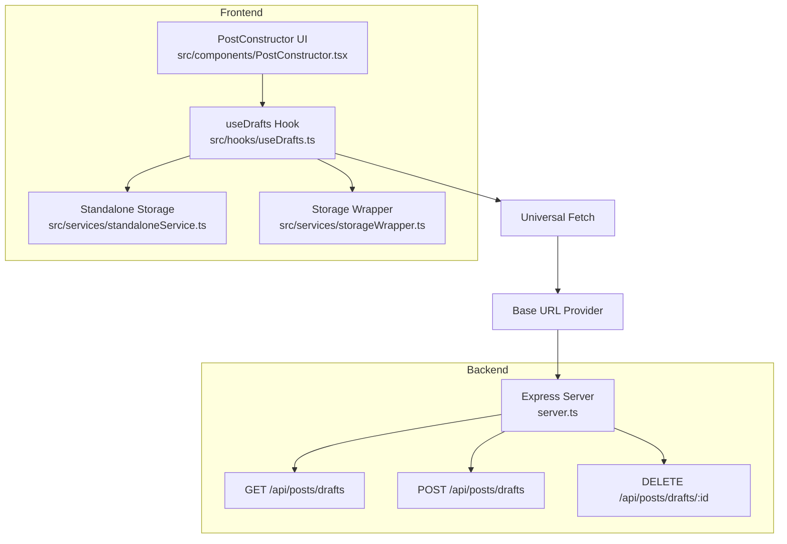
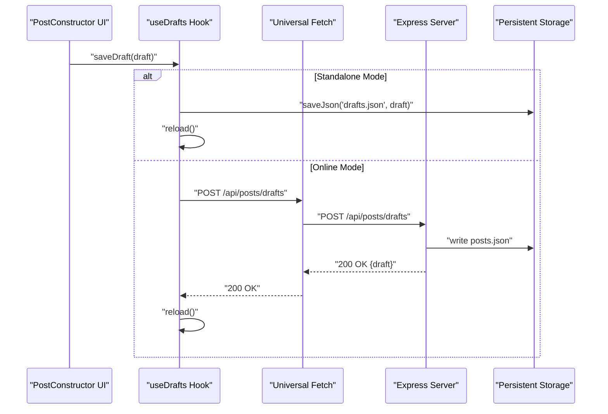
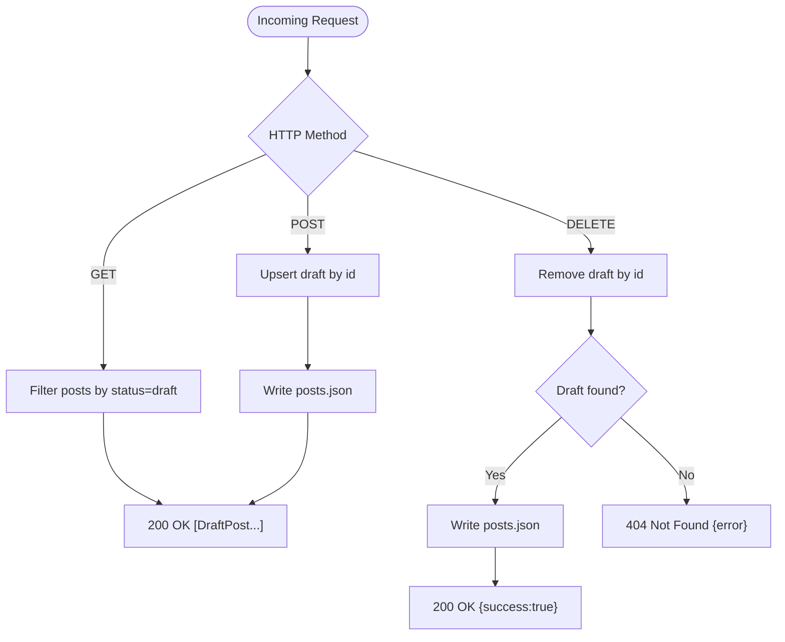
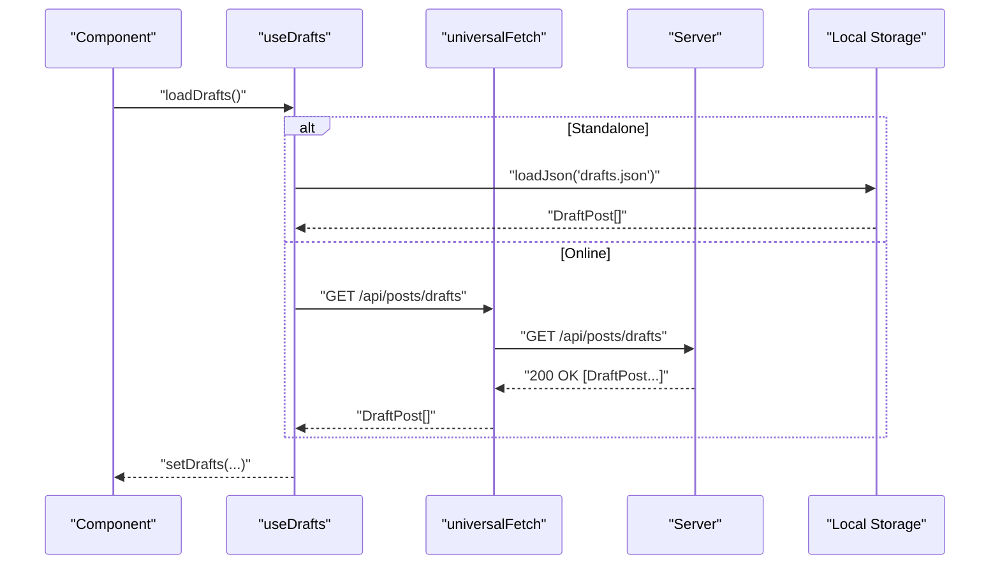
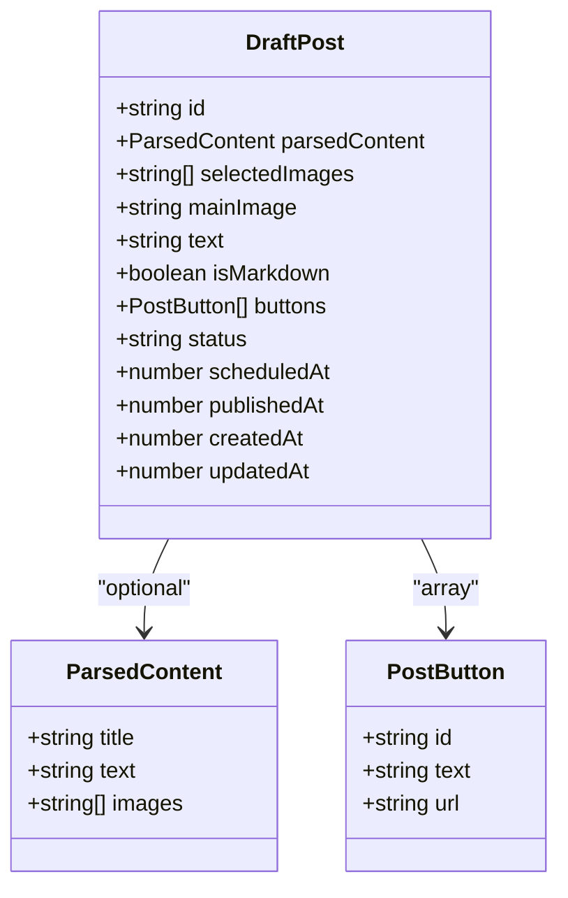
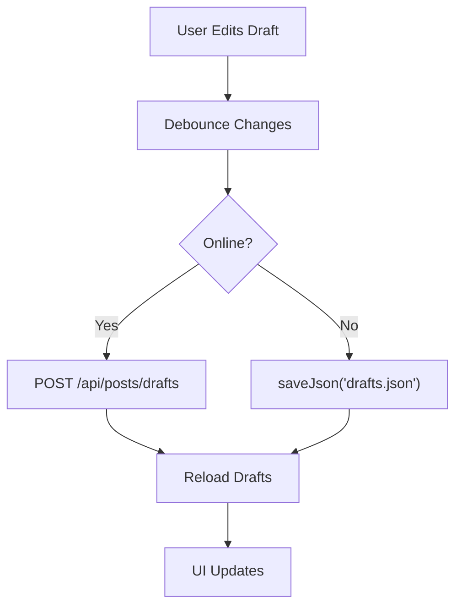
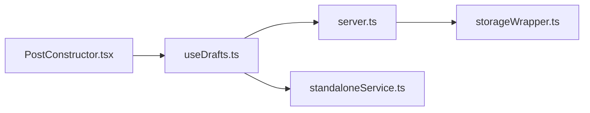

# Draft Post Endpoints

<cite>
**Referenced Files in This Document**
- [server.ts](file://server.ts)
- [useDrafts.ts](file://src/hooks/useDrafts.ts)
- [types.ts](file://src/types.ts)
- [PostConstructor.tsx](file://src/components/PostConstructor.tsx)
- [standaloneService.ts](file://src/services/standaloneService.ts)
- [storageWrapper.ts](file://src/services/storageWrapper.ts)
</cite>

## Table of Contents
1. [Introduction](#introduction)
2. [Project Structure](#project-structure)
3. [Core Components](#core-components)
4. [Architecture Overview](#architecture-overview)
5. [Detailed Component Analysis](#detailed-component-analysis)
6. [Dependency Analysis](#dependency-analysis)
7. [Performance Considerations](#performance-considerations)
8. [Troubleshooting Guide](#troubleshooting-guide)
9. [Conclusion](#conclusion)

## Introduction
This document describes the /api/posts/drafts endpoint group responsible for managing draft posts. It covers HTTP methods, request/response schemas, client-side integration, and operational patterns such as auto-save and offline management. The backend persists drafts to a JSON file and exposes endpoints for listing, creating/updating, and deleting drafts. The frontend integrates with these endpoints via a dedicated hook and supports both online and offline modes.

## Project Structure
The draft post feature spans backend and frontend modules:
- Backend: Express server with rate-limited endpoints under /api/posts/drafts
- Frontend: React hook for draft CRUD, UI component for constructing posts, and storage abstractions for offline scenarios

**Diagram sources**
- [server.ts:1157-1202](file://server.ts#L1157-L1202)
- [useDrafts.ts:1-88](file://src/hooks/useDrafts.ts#L1-L88)
- [PostConstructor.tsx:1-294](file://src/components/PostConstructor.tsx#L1-L294)
- [standaloneService.ts:1-175](file://src/services/standaloneService.ts#L1-L175)
- [storageWrapper.ts:1-100](file://src/services/storageWrapper.ts#L1-L100)

**Section sources**
- [server.ts:1157-1202](file://server.ts#L1157-L1202)
- [useDrafts.ts:1-88](file://src/hooks/useDrafts.ts#L1-L88)
- [PostConstructor.tsx:1-294](file://src/components/PostConstructor.tsx#L1-L294)
- [standaloneService.ts:1-175](file://src/services/standaloneService.ts#L1-L175)
- [storageWrapper.ts:1-100](file://src/services/storageWrapper.ts#L1-L100)

## Core Components
- DraftPost interface defines the shape of persisted drafts, including identifiers, content, images, timestamps, and metadata.
- Backend endpoints:
  - GET /api/posts/drafts: returns all drafts
  - POST /api/posts/drafts: creates or updates a draft
  - DELETE /api/posts/drafts/:id: removes a draft by ID
- Frontend hook useDrafts coordinates loading, saving, and deleting drafts, with support for standalone/offline mode.

**Section sources**
- [types.ts:13-26](file://src/types.ts#L13-L26)
- [server.ts:1157-1202](file://server.ts#L1157-L1202)
- [useDrafts.ts:1-88](file://src/hooks/useDrafts.ts#L1-L88)

## Architecture Overview
The draft lifecycle flows from the UI to the backend or local storage depending on runtime mode. The UI composes a DraftPost and either saves it to the server or to local storage. Subsequent loads retrieve the list of drafts.

**Diagram sources**
- [PostConstructor.tsx:89-89](file://src/components/PostConstructor.tsx#L89-L89)
- [useDrafts.ts:31-54](file://src/hooks/useDrafts.ts#L31-L54)
- [server.ts:1185-1195](file://server.ts#L1185-L1195)
- [standaloneService.ts:25-54](file://src/services/standaloneService.ts#L25-L54)

## Detailed Component Analysis

### Backend: /api/posts/drafts Endpoints
- GET /api/posts/drafts
  - Returns all posts filtered to status=draft
  - No request body; response is an array of DraftPost
- POST /api/posts/drafts
  - Creates a new draft or updates an existing draft by ID
  - Ensures id, status, createdAt, and updatedAt are set
  - Persists to posts.json
- DELETE /api/posts/drafts/:id
  - Removes the draft with the given ID
  - Returns success on removal; 404 if not found

**Diagram sources**
- [server.ts:1157-1202](file://server.ts#L1157-L1202)

**Section sources**
- [server.ts:1157-1202](file://server.ts#L1157-L1202)

### Frontend: useDrafts Hook
- Responsibilities
  - Load drafts from server or local storage
  - Save drafts (create/update) via POST /api/posts/drafts
  - Delete drafts by ID via DELETE /api/posts/drafts/:id
  - Reload after mutations
- Offline behavior
  - When standalone=true, reads/writes to local storage files
  - When online, uses universalFetch against the base URL

**Diagram sources**
- [useDrafts.ts:9-29](file://src/hooks/useDrafts.ts#L9-L29)

**Section sources**
- [useDrafts.ts:1-88](file://src/hooks/useDrafts.ts#L1-L88)
- [standaloneService.ts:25-54](file://src/services/standaloneService.ts#L25-L54)

### DraftPost Interface Schema
The DraftPost structure used by both frontend and backend:

- id: string
- parsedContent?: ParsedContent
  - title: string
  - text: string
  - images: string[]
- selectedImages: string[] (selected images from parsed content)
- mainImage?: string (single main image)
- text: string (editable AI-processed text)
- isMarkdown?: boolean
- buttons: PostButton[]
  - id: string
  - text: string
  - url: string
- status: "draft" | "scheduled" | "published"
- scheduledAt?: number (timestamp)
- publishedAt?: number
- createdAt: number (timestamp)
- updatedAt: number (timestamp)

**Diagram sources**
- [types.ts:7-26](file://src/types.ts#L7-L26)

**Section sources**
- [types.ts:7-26](file://src/types.ts#L7-L26)

### Client-Side Implementation Patterns
- Creating a draft
  - Compose a DraftPost in the UI
  - Call saveDraft; the hook will POST to /api/posts/drafts or persist locally
- Editing a draft
  - Modify fields (text, images, buttons)
  - Save again; POST will upsert by id
- Auto-save
  - Periodically call saveDraft while the user edits
  - Debounce to reduce network/storage writes
- Offline management
  - When standalone=true, drafts are stored in local storage
  - On reconnect, synchronize with server by re-enabling online mode

**Diagram sources**
- [useDrafts.ts:31-54](file://src/hooks/useDrafts.ts#L31-L54)
- [PostConstructor.tsx:89-89](file://src/components/PostConstructor.tsx#L89-L89)
- [standaloneService.ts:25-54](file://src/services/standaloneService.ts#L25-L54)

**Section sources**
- [useDrafts.ts:31-54](file://src/hooks/useDrafts.ts#L31-L54)
- [PostConstructor.tsx:89-89](file://src/components/PostConstructor.tsx#L89-L89)
- [standaloneService.ts:25-54](file://src/services/standaloneService.ts#L25-L54)

### Real-Time Draft Synchronization
- The current implementation does not expose a server-sent events endpoint for draft synchronization.
- Recommended approach:
  - Add a GET /api/posts/drafts/stream endpoint that streams draft updates
  - Frontend subscribes to the stream and updates local state reactively
  - Alternatively, poll GET /api/posts/drafts at intervals for offline-friendly UX

[No sources needed since this section provides general guidance]

### Practical Examples

- Creating a draft with markdown content and image attachments
  - Build DraftPost with text, selectedImages, and optional mainImage
  - Call saveDraft; backend assigns id/status/createdAt/updatedAt if missing
  - Images are stored as base64 strings; the UI supports drag-and-drop ordering

- Editing a draft
  - Retrieve drafts via loadDrafts
  - Modify fields and call saveDraft again; backend upserts by id

- Auto-save workflow
  - Debounced periodic saveDraft calls while the user edits
  - Ensure id is present to enable upsert behavior

- Draft organization patterns
  - Use status to distinguish drafts vs scheduled vs published
  - Filter by status on the server for lists

**Section sources**
- [server.ts:1185-1195](file://server.ts#L1185-L1195)
- [useDrafts.ts:9-29](file://src/hooks/useDrafts.ts#L9-L29)

## Dependency Analysis
- Backend depends on:
  - storageWrapper for reading/writing posts.json
  - Rate limiters for API protection
- Frontend depends on:
  - useDrafts for CRUD operations
  - standaloneService for offline storage
  - PostConstructor for composing DraftPost

**Diagram sources**
- [server.ts:127-153](file://server.ts#L127-L153)
- [useDrafts.ts:1-88](file://src/hooks/useDrafts.ts#L1-L88)
- [standaloneService.ts:1-175](file://src/services/standaloneService.ts#L1-L175)
- [PostConstructor.tsx:1-294](file://src/components/PostConstructor.tsx#L1-L294)

**Section sources**
- [server.ts:127-153](file://server.ts#L127-L153)
- [useDrafts.ts:1-88](file://src/hooks/useDrafts.ts#L1-L88)
- [standaloneService.ts:1-175](file://src/services/standaloneService.ts#L1-L175)
- [PostConstructor.tsx:1-294](file://src/components/PostConstructor.tsx#L1-L294)

## Performance Considerations
- Rate limiting: POST and DELETE to /api/posts/drafts are protected by mutationRateLimiter
- Payload size: express.json({ limit: "50mb" }) allows large image payloads
- Persistence: JSON file I/O; consider batching frequent writes in auto-save scenarios

[No sources needed since this section provides general guidance]

## Troubleshooting Guide
- 404 Not Found on DELETE
  - Occurs when the draft ID does not exist
  - Verify the draft exists before deletion
- Storage failures
  - Backend write failures are logged; ensure disk space and permissions
  - Frontend standalone mode falls back to local storage; confirm files exist
- Duplicate IDs
  - POST /api/posts/drafts upserts by id; ensure consistent IDs across sessions
- Validation
  - The backend does not enforce strict field validation; ensure clients supply required fields

**Section sources**
- [server.ts:1196-1202](file://server.ts#L1196-L1202)
- [storageWrapper.ts:35-54](file://src/services/storageWrapper.ts#L35-L54)
- [standaloneService.ts:25-54](file://src/services/standaloneService.ts#L25-L54)

## Conclusion
The /api/posts/drafts endpoint group provides a straightforward CRUD surface for draft post management. The backend persists drafts to a JSON file and the frontend integrates seamlessly via useDrafts, supporting both online and offline modes. Extending the system with streaming updates or stricter validation would improve real-time collaboration and robustness.