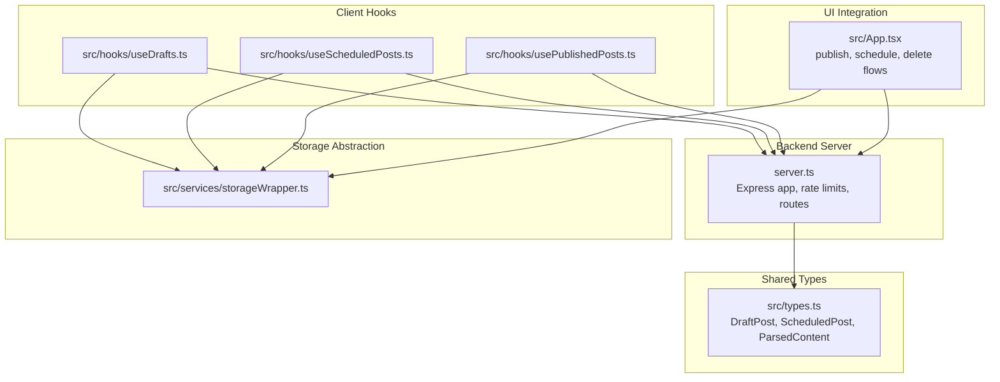
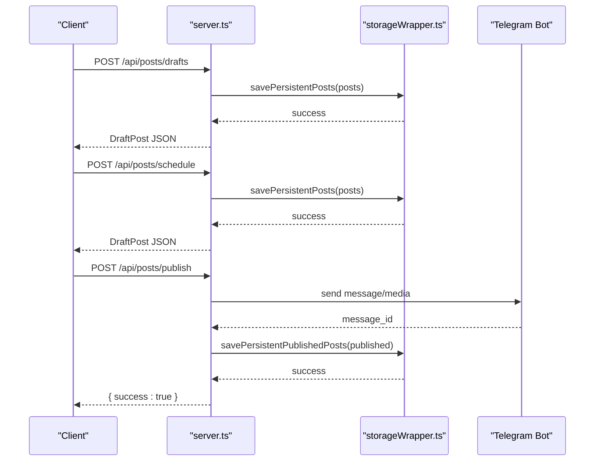
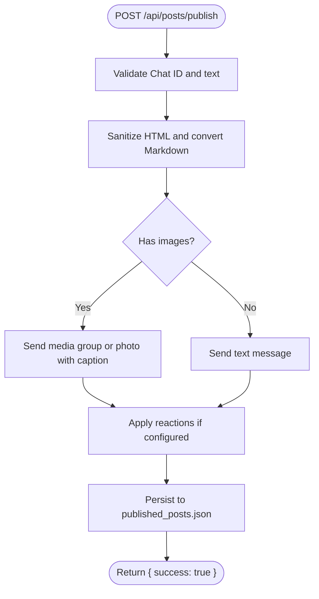
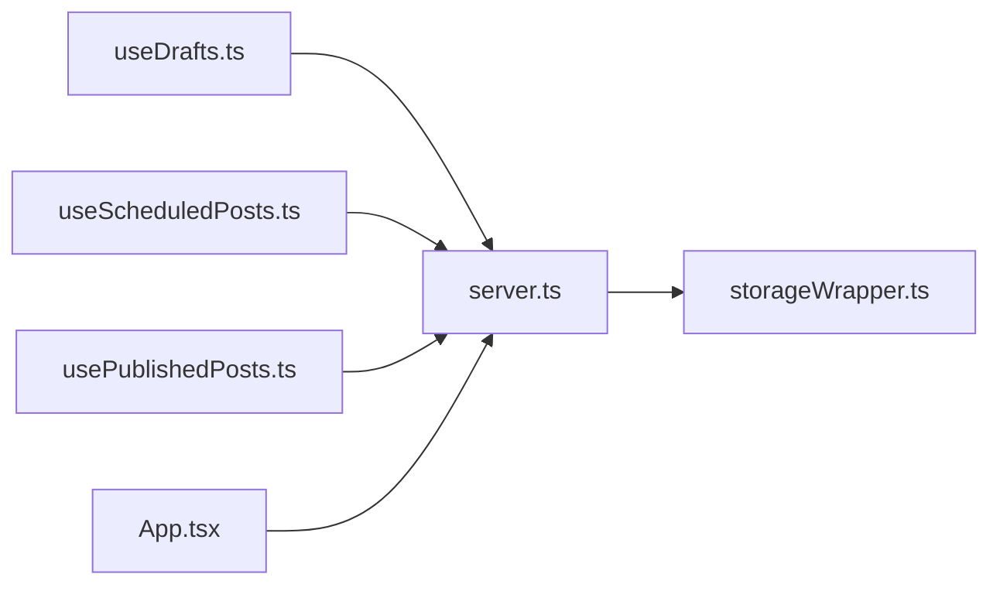

# Post Management Endpoints

<cite>
**Referenced Files in This Document**
- [server.ts](file://server.ts)
- [src\types.ts](file://src\types.ts)
- [src\hooks\useDrafts.ts](file://src\hooks\useDrafts.ts)
- [src\hooks\useScheduledPosts.ts](file://src\hooks\useScheduledPosts.ts)
- [src\hooks\usePublishedPosts.ts](file://src\hooks\usePublishedPosts.ts)
- [src\services\storageWrapper.ts](file://src\services\storageWrapper.ts)
- [src\App.tsx](file://src\App.tsx)
</cite>

## Table of Contents
1. [Introduction](#introduction)
2. [Project Structure](#project-structure)
3. [Core Components](#core-components)
4. [Architecture Overview](#architecture-overview)
5. [Detailed Component Analysis](#detailed-component-analysis)
6. [Dependency Analysis](#dependency-analysis)
7. [Performance Considerations](#performance-considerations)
8. [Troubleshooting Guide](#troubleshooting-guide)
9. [Conclusion](#conclusion)
10. [Appendices](#appendices)

## Introduction
This document provides comprehensive API documentation for post-related endpoints that manage drafts, scheduled posts, and published posts. It covers HTTP methods, request/response schemas, error handling, and the underlying data models. It also explains how these endpoints integrate with the file-based storage system, caching mechanisms, and data persistence patterns, and offers client implementation guidelines for CRUD operations, batch processing, and state synchronization.

## Project Structure
The post management functionality spans the backend server, shared TypeScript types, React hooks for client-side state, and a storage abstraction layer for cross-platform persistence.

**Diagram sources**
- [server.ts:1157-1241](file://server.ts#L1157-L1241)
- [src\types.ts:13-37](file://src\types.ts#L13-L37)
- [src\hooks\useDrafts.ts:1-88](file://src\hooks\useDrafts.ts#L1-L88)
- [src\hooks\useScheduledPosts.ts:1-38](file://src\hooks\useScheduledPosts.ts#L1-L38)
- [src\hooks\usePublishedPosts.ts:1-38](file://src\hooks\usePublishedPosts.ts#L1-L38)
- [src\services\storageWrapper.ts:1-100](file://src\services\storageWrapper.ts#L1-L100)
- [src\App.tsx:890-1042](file://src\App.tsx#L890-L1042)

**Section sources**
- [server.ts:1157-1241](file://server.ts#L1157-L1241)
- [src\types.ts:13-37](file://src\types.ts#L13-L37)
- [src\hooks\useDrafts.ts:1-88](file://src\hooks\useDrafts.ts#L1-L88)
- [src\hooks\useScheduledPosts.ts:1-38](file://src\hooks\useScheduledPosts.ts#L1-L38)
- [src\hooks\usePublishedPosts.ts:1-38](file://src\hooks\usePublishedPosts.ts#L1-L38)
- [src\services\storageWrapper.ts:1-100](file://src\services\storageWrapper.ts#L1-L100)
- [src\App.tsx:890-1042](file://src\App.tsx#L890-L1042)

## Core Components
- Drafts endpoint group: GET /api/posts/drafts, POST /api/posts/drafts, DELETE /api/posts/drafts/:id
- Scheduled endpoint group: GET /api/posts/scheduled
- Published endpoint group: GET /api/posts/published, DELETE /api/posts/published/:id
- Scheduling and publishing: POST /api/posts/schedule, POST /api/posts/publish
- Supporting templates: GET/POST/DELETE /api/posts/templates/buttons and /api/posts/templates/reactions

These endpoints operate on a unified in-memory cache and persist data to JSON files for drafts, published posts, and templates. Rate limiting is applied to mutation endpoints.

**Section sources**
- [server.ts:1157-1241](file://server.ts#L1157-L1241)

## Architecture Overview
The server exposes REST endpoints for post lifecycle management. Drafts and scheduled posts share the same data model with different status values. Published posts are persisted separately. Publishing to Telegram is handled by a dedicated function that sanitizes content, applies formatting, and sends media groups when applicable.

**Diagram sources**
- [server.ts:1185-1241](file://server.ts#L1185-L1241)
- [src\services\storageWrapper.ts:35-54](file://src\services\storageWrapper.ts#L35-L54)

## Detailed Component Analysis

### Draft Management Endpoints
- GET /api/posts/drafts
  - Purpose: Retrieve all drafts.
  - Response: Array of DraftPost items filtered by status "draft".
  - Notes: Uses in-memory cache of posts.

- POST /api/posts/drafts
  - Purpose: Create or update a draft.
  - Request body: DraftPost (id optional; if omitted, generated; status set to "draft"; timestamps managed).
  - Response: DraftPost.
  - Behavior: Upserts by id; persists to posts.json.

- DELETE /api/posts/drafts/:id
  - Purpose: Remove a draft by id.
  - Response: { success: true } or 404 if not found.
  - Behavior: Removes from posts.json.

Client usage patterns:
- Create a new draft with content, images, and metadata; update existing drafts; delete drafts.
- Client hooks coordinate with server endpoints and local storage for offline scenarios.

**Section sources**
- [server.ts:1157-1202](file://server.ts#L1157-L1202)
- [src\hooks\useDrafts.ts:9-73](file://src\hooks\useDrafts.ts#L9-L73)

### Scheduled Posts Endpoints
- GET /api/posts/scheduled
  - Purpose: Retrieve all scheduled posts.
  - Response: Array of DraftPost items filtered by status "scheduled".

Scheduling flow:
- Client sends a draft to POST /api/posts/schedule.
- Server updates the post’s status to "scheduled" and persists it.
- Publishing flow converts scheduled posts to published posts via POST /api/posts/publish.

**Section sources**
- [server.ts:1204-1231](file://server.ts#L1204-L1231)
- [src\hooks\useScheduledPosts.ts:9-29](file://src\hooks\useScheduledPosts.ts#L9-L29)

### Published Posts Endpoints
- GET /api/posts/published
  - Purpose: Retrieve published posts.
  - Response: Array of published posts.

- DELETE /api/posts/published/:id
  - Purpose: Remove a published post by id.
  - Response: { success: true }.

Publishing flow:
- POST /api/posts/publish validates presence of Chat ID and post text, then publishes to Telegram and saves to published_posts.json.

**Section sources**
- [server.ts:1208-1217](file://server.ts#L1208-L1217)
- [src\hooks\usePublishedPosts.ts:9-29](file://src\hooks\usePublishedPosts.ts#L9-L29)

### Data Models and Schemas

#### DraftPost
- Fields:
  - id: string
  - parsedContent?: ParsedContent
  - selectedImages: string[]
  - mainImage?: string
  - text: string
  - isMarkdown?: boolean
  - buttons: PostButton[]
  - status: "draft" | "scheduled" | "published"
  - scheduledAt?: number
  - publishedAt?: number
  - createdAt: number
  - updatedAt: number

- Notes:
  - Status transitions occur via scheduling and publishing endpoints.
  - Timestamps are managed automatically.

#### ScheduledPost
- Extends DraftPost with:
  - scheduledAt: number
  - status: "scheduled"

#### ParsedContent
- Fields:
  - title: string
  - text: string
  - images: string[]

#### PostButton
- Fields:
  - id: string
  - text: string
  - url: string

#### ButtonTemplate
- Fields:
  - id: string
  - name: string
  - buttons: PostButton[]

**Section sources**
- [src\types.ts:13-37](file://src\types.ts#L13-L37)

### Publishing Pipeline
- POST /api/posts/publish
  - Validates Chat ID and post text.
  - Sanitizes HTML and converts Markdown to Telegram-compatible HTML.
  - Sends message(s) to Telegram chat, including media groups and inline buttons.
  - Saves published post to published_posts.json (limited to recent entries).

**Diagram sources**
- [server.ts:1233-1241](file://server.ts#L1233-L1241)
- [server.ts:806-934](file://server.ts#L806-L934)

**Section sources**
- [server.ts:1233-1241](file://server.ts#L1233-L1241)
- [server.ts:806-934](file://server.ts#L806-L934)

### File-Based Storage and Caching
- Persistence:
  - Drafts and scheduled posts are stored in posts.json.
  - Published posts are stored in published_posts.json.
  - Templates are stored in templates.json.
  - Image path is stored in image_path.txt.
  - Token and chat id are stored in bot_token.txt and chat_id.txt respectively.

- Caching:
  - In-memory caches are initialized on startup and updated on writes.
  - Reads are served from memory; writes update both disk and memory.

- Cross-platform storage:
  - storageWrapper abstracts filesystem access for native and web environments.

**Section sources**
- [server.ts:74-173](file://server.ts#L74-L173)
- [src\services\storageWrapper.ts:1-100](file://src\services\storageWrapper.ts#L1-L100)

### Client Implementation Guidelines
- CRUD Operations:
  - Use GET /api/posts/drafts to load drafts.
  - Use POST /api/posts/drafts to create/update a draft.
  - Use DELETE /api/posts/drafts/:id to remove a draft.
  - Use GET /api/posts/scheduled to load scheduled posts.
  - Use POST /api/posts/schedule to move a draft to scheduled.
  - Use GET /api/posts/published to load published posts.
  - Use DELETE /api/posts/published/:id to remove a published post.
  - Use POST /api/posts/publish to publish a post.

- Batch Processing:
  - Schedule multiple drafts by posting each to /api/posts/schedule.
  - Publish multiple posts by posting each to /api/posts/publish.

- State Synchronization:
  - After mutations, refresh lists by reloading drafts, scheduled, and published endpoints.
  - In standalone mode, client hooks coordinate with local storage files.

- Error Handling:
  - Expect 400 for invalid payloads and missing Chat ID.
  - Expect 404 when deleting non-existent drafts or published posts.
  - Expect 500 for internal errors during publishing.

**Section sources**
- [src\hooks\useDrafts.ts:9-73](file://src\hooks\useDrafts.ts#L9-L73)
- [src\hooks\useScheduledPosts.ts:9-29](file://src\hooks\useScheduledPosts.ts#L9-L29)
- [src\hooks\usePublishedPosts.ts:9-29](file://src\hooks\usePublishedPosts.ts#L9-L29)
- [src\App.tsx:890-1042](file://src\App.tsx#L890-L1042)

## Dependency Analysis
- server.ts defines all post-related routes and integrates with storageWrapper for persistence.
- React hooks encapsulate client-side state and network calls for drafts, scheduled, and published posts.
- App.tsx orchestrates UI actions and coordinates with server endpoints for scheduling and publishing.

**Diagram sources**
- [server.ts:1157-1241](file://server.ts#L1157-L1241)
- [src\hooks\useDrafts.ts:1-88](file://src\hooks\useDrafts.ts#L1-L88)
- [src\hooks\useScheduledPosts.ts:1-38](file://src\hooks\useScheduledPosts.ts#L1-L38)
- [src\hooks\usePublishedPosts.ts:1-38](file://src\hooks\usePublishedPosts.ts#L1-L38)
- [src\App.tsx:890-1042](file://src\App.tsx#L890-L1042)

**Section sources**
- [server.ts:1157-1241](file://server.ts#L1157-L1241)
- [src\hooks\useDrafts.ts:1-88](file://src\hooks\useDrafts.ts#L1-L88)
- [src\hooks\useScheduledPosts.ts:1-38](file://src\hooks\useScheduledPosts.ts#L1-L38)
- [src\hooks\usePublishedPosts.ts:1-38](file://src\hooks\usePublishedPosts.ts#L1-L38)
- [src\App.tsx:890-1042](file://src\App.tsx#L890-L1042)

## Performance Considerations
- Rate limiting: Mutation endpoints are protected by rate limiters to prevent abuse.
- Payload size: JSON payloads can be large; ensure clients respect reasonable sizes.
- Media uploads: Image upload endpoint validates paths and prevents path traversal.
- Caching: In-memory caches reduce disk I/O; ensure consistent updates on writes.

[No sources needed since this section provides general guidance]

## Troubleshooting Guide
Common issues and resolutions:
- Missing Chat ID: Publishing fails with 400 if Chat ID is not set.
- Draft not found: Deleting a draft returns 404 if id does not exist.
- Invalid post data: Publishing requires a valid post object with text.
- Path restrictions: Image upload rejects sensitive system paths.
- Quota errors: AI processing may return quota exceeded errors; handle retries accordingly.

**Section sources**
- [server.ts:1233-1241](file://server.ts#L1233-L1241)
- [server.ts:1196-1202](file://server.ts#L1196-L1202)
- [server.ts:940-973](file://server.ts#L940-L973)

## Conclusion
The post management endpoints provide a cohesive API for managing drafts, scheduling, and publishing posts. They integrate with a file-based storage system and in-memory caching for efficient operation. Clients should follow the documented CRUD flows, handle errors appropriately, and synchronize state after mutations.

[No sources needed since this section summarizes without analyzing specific files]

## Appendices

### Endpoint Reference Summary
- Drafts
  - GET /api/posts/drafts
  - POST /api/posts/drafts
  - DELETE /api/posts/drafts/:id

- Scheduled
  - GET /api/posts/scheduled
  - POST /api/posts/schedule

- Published
  - GET /api/posts/published
  - DELETE /api/posts/published/:id
  - POST /api/posts/publish

- Templates
  - GET/POST/DELETE /api/posts/templates/buttons
  - GET/POST/DELETE /api/posts/templates/reactions

**Section sources**
- [server.ts:1157-1241](file://server.ts#L1157-L1241)