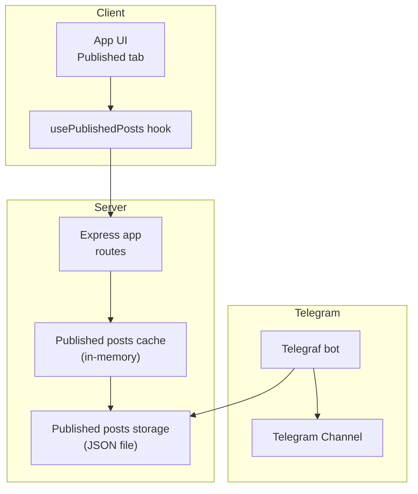
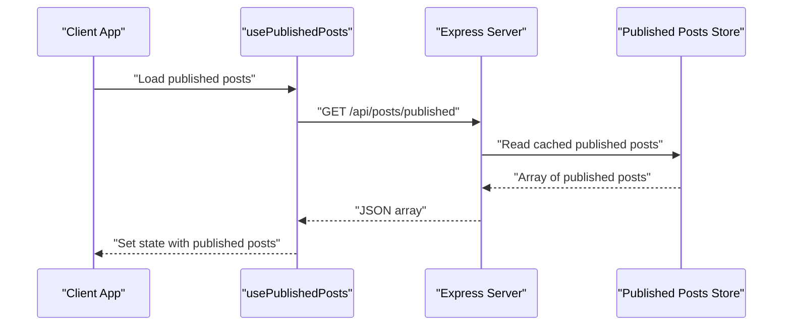
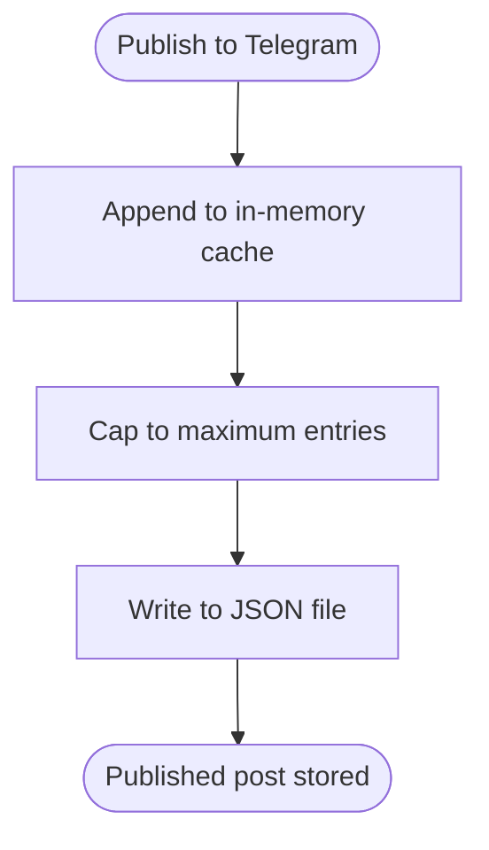
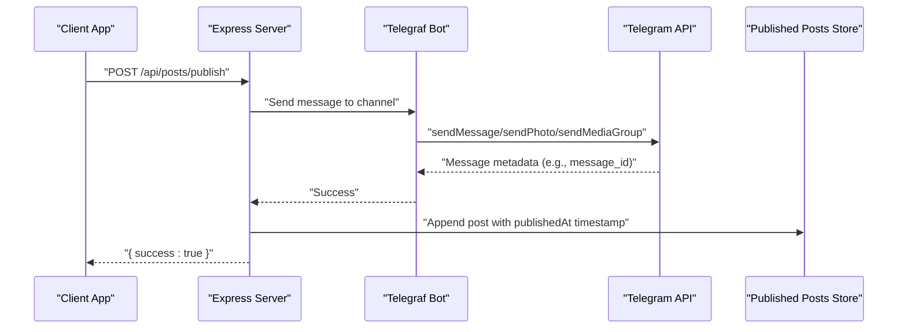
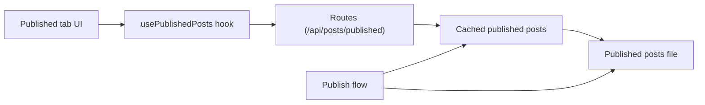

# Published Post Endpoints

<cite>
**Referenced Files in This Document**
- [server.ts](file://server.ts)
- [types.ts](file://src/types.ts)
- [usePublishedPosts.ts](file://src/hooks/usePublishedPosts.ts)
- [App.tsx](file://src/App.tsx)
- [standaloneService.ts](file://src/services/standaloneService.ts)
</cite>

## Table of Contents
1. [Introduction](#introduction)
2. [Project Structure](#project-structure)
3. [Core Components](#core-components)
4. [Architecture Overview](#architecture-overview)
5. [Detailed Component Analysis](#detailed-component-analysis)
6. [Dependency Analysis](#dependency-analysis)
7. [Performance Considerations](#performance-considerations)
8. [Troubleshooting Guide](#troubleshooting-guide)
9. [Conclusion](#conclusion)

## Introduction
This document describes the published post tracking and management functionality exposed by the /api/posts/published endpoint group. It covers:
- Retrieving published post history via GET
- Removing individual published records via DELETE
- The PublishedPost interface structure and how it is persisted
- Integration with Telegram’s message system for publication confirmation
- Practical examples for client-side implementations including post history viewing, status checking, and analytics reporting

## Project Structure
The published post endpoints are implemented on the server and consumed by the client application. Key elements:
- Server routes for published posts retrieval and deletion
- In-memory cache and persistent storage for published posts
- Client hook to fetch published posts and UI integration
- Telegram publishing pipeline that writes to the published posts store

**Diagram sources**
- [server.ts:1209-1217](file://server.ts#L1209-L1217)
- [server.ts:129-158](file://server.ts#L129-L158)
- [server.ts:806-934](file://server.ts#L806-L934)
- [usePublishedPosts.ts:1-37](file://src/hooks/usePublishedPosts.ts#L1-L37)
- [App.tsx:1509-1524](file://src/App.tsx#L1509-L1524)

**Section sources**
- [server.ts:1209-1217](file://server.ts#L1209-L1217)
- [server.ts:129-158](file://server.ts#L129-L158)
- [server.ts:806-934](file://server.ts#L806-L934)
- [usePublishedPosts.ts:1-37](file://src/hooks/usePublishedPosts.ts#L1-L37)
- [App.tsx:1509-1524](file://src/App.tsx#L1509-L1524)

## Core Components
- Published posts route group:
  - GET /api/posts/published returns the latest published posts
  - DELETE /api/posts/published/:id removes a specific published record by ID
- Published posts persistence:
  - In-memory cache initialized from a JSON file
  - Maximum retained entries capped at a small number for recent history
- Telegram integration:
  - On successful Telegram publication, the post is appended to the published list with a timestamp
- Client consumption:
  - React hook loads published posts from the server
  - UI displays published posts and supports removal actions

**Section sources**
- [server.ts:1209-1217](file://server.ts#L1209-L1217)
- [server.ts:129-158](file://server.ts#L129-L158)
- [server.ts:806-934](file://server.ts#L806-L934)
- [usePublishedPosts.ts:1-37](file://src/hooks/usePublishedPosts.ts#L1-L37)
- [App.tsx:1509-1524](file://src/App.tsx#L1509-L1524)

## Architecture Overview
The published post workflow spans server-side storage and Telegram publishing, with client-side consumption.

**Diagram sources**
- [usePublishedPosts.ts:9-29](file://src/hooks/usePublishedPosts.ts#L9-L29)
- [server.ts:1209-1211](file://server.ts#L1209-L1211)

**Section sources**
- [usePublishedPosts.ts:1-37](file://src/hooks/usePublishedPosts.ts#L1-L37)
- [server.ts:1209-1211](file://server.ts#L1209-L1211)

## Detailed Component Analysis

### Published Post Interface and Persistence
Published posts are stored as arrays of objects with a consistent structure. The server maintains:
- An in-memory cache loaded from a JSON file
- A capped list of recent published posts appended on successful Telegram publication

Key characteristics:
- Each published post includes a unique identifier and a publication timestamp
- The list is limited to a small fixed number to keep only recent entries
- Deletion removes a single entry by ID

**Diagram sources**
- [server.ts:923-928](file://server.ts#L923-L928)

**Section sources**
- [server.ts:129-158](file://server.ts#L129-L158)
- [server.ts:923-928](file://server.ts#L923-L928)

### GET /api/posts/published
Behavior:
- Returns the current in-memory list of published posts
- No filtering or pagination is applied; clients should render the returned array

Response shape:
- Array of published post objects

Notes:
- The array may be empty if no posts were published yet or if the cache has not been populated

**Section sources**
- [server.ts:1209-1211](file://server.ts#L1209-L1211)

### DELETE /api/posts/published/:id
Behavior:
- Removes the published post matching the given ID
- Returns a success indicator upon completion

Request:
- Path parameter: id (string or number)

Response:
- Object with a success flag

Constraints:
- If the ID does not match any existing published post, the list remains unchanged (no error is returned)

**Section sources**
- [server.ts:1212-1217](file://server.ts#L1212-L1217)

### Telegram Publication and Published Post Recording
When a post is successfully published to Telegram, the server:
- Sends the message to the configured Telegram chat/channel
- Records the post in the published list with a timestamp
- Ensures the recorded post includes a unique identifier if absent

**Diagram sources**
- [server.ts:1233-1241](file://server.ts#L1233-L1241)
- [server.ts:806-934](file://server.ts#L806-L934)
- [server.ts:923-928](file://server.ts#L923-L928)

**Section sources**
- [server.ts:1233-1241](file://server.ts#L1233-L1241)
- [server.ts:806-934](file://server.ts#L806-L934)
- [server.ts:923-928](file://server.ts#L923-L928)

### Client-Side Implementation Examples

#### Loading Published Post History
- Use the provided hook to fetch and manage published posts
- The hook supports both standalone and server modes

References:
- Hook definition and usage
- UI rendering of published posts

**Section sources**
- [usePublishedPosts.ts:1-37](file://src/hooks/usePublishedPosts.ts#L1-L37)
- [App.tsx:1509-1524](file://src/App.tsx#L1509-L1524)

#### Status Checking and Analytics Reporting
- Display the publication timestamp for each published post
- Use the timestamp to compute metrics such as daily counts or trending topics

References:
- Published timestamp field in the UI

**Section sources**
- [App.tsx](file://src/App.tsx#L1515)

#### Post-Verification Workflows
- After publishing, verify the presence of the post in the published list
- If verification fails, inspect server logs and Telegram API responses

References:
- Publishing flow and error logging

**Section sources**
- [server.ts:1233-1241](file://server.ts#L1233-L1241)
- [server.ts:806-934](file://server.ts#L806-L934)

## Dependency Analysis
Published post endpoints depend on:
- Express routing for HTTP handlers
- In-memory caching and file-based persistence for data durability
- Telegram bot integration for publication confirmation

**Diagram sources**
- [server.ts:1209-1217](file://server.ts#L1209-L1217)
- [server.ts:129-158](file://server.ts#L129-L158)
- [server.ts:806-934](file://server.ts#L806-L934)
- [usePublishedPosts.ts:1-37](file://src/hooks/usePublishedPosts.ts#L1-L37)
- [App.tsx:1509-1524](file://src/App.tsx#L1509-L1524)

**Section sources**
- [server.ts:1209-1217](file://server.ts#L1209-L1217)
- [server.ts:129-158](file://server.ts#L129-L158)
- [server.ts:806-934](file://server.ts#L806-L934)
- [usePublishedPosts.ts:1-37](file://src/hooks/usePublishedPosts.ts#L1-L37)
- [App.tsx:1509-1524](file://src/App.tsx#L1509-L1524)

## Performance Considerations
- The published posts list is small and cached in memory, minimizing I/O overhead
- Rate limiting is applied to mutation endpoints to prevent abuse
- Consider client-side pagination or virtualization if the list grows significantly

## Troubleshooting Guide
Common issues and remedies:
- Empty published list
  - Cause: No posts have been published yet or the cache is not populated
  - Action: Publish a post and refresh the UI
- DELETE returns success but list unchanged
  - Cause: Provided ID does not match any published post
  - Action: Verify the ID and retry
- Publishing succeeds but post not visible in published list
  - Cause: Publishing completed but recording failed
  - Action: Inspect server logs around the publish operation

**Section sources**
- [server.ts:1212-1217](file://server.ts#L1212-L1217)
- [server.ts:1233-1241](file://server.ts#L1233-L1241)
- [server.ts:806-934](file://server.ts#L806-L934)

## Conclusion
The /api/posts/published endpoint group provides a straightforward mechanism to track and manage recent Telegram publications. The server maintains a capped list of published posts, integrates tightly with Telegram publishing, and exposes simple HTTP endpoints for retrieval and deletion. Clients can consume these endpoints to build post-history views, status dashboards, and analytics reports.