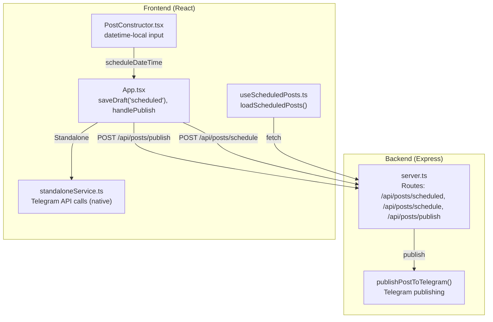
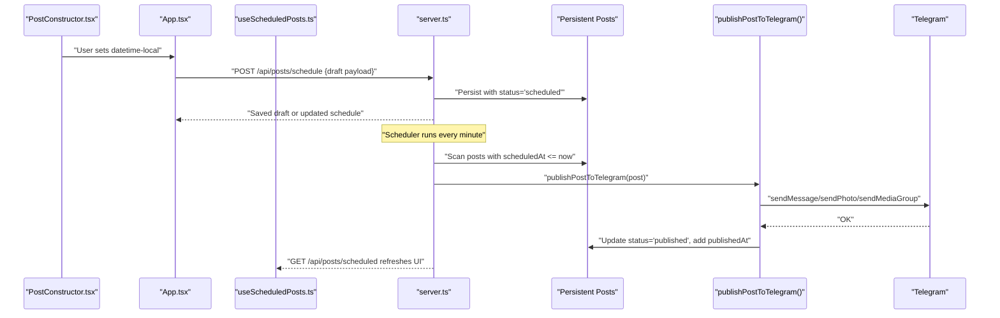
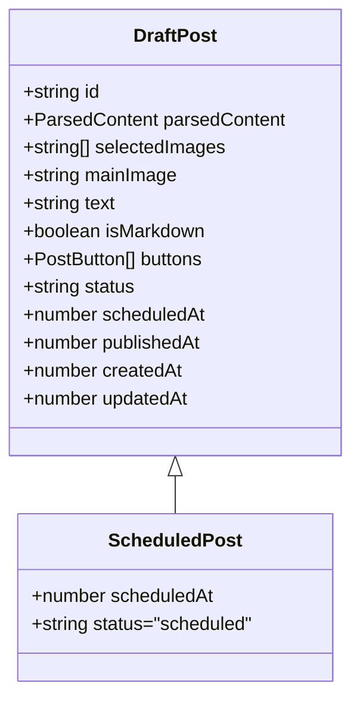
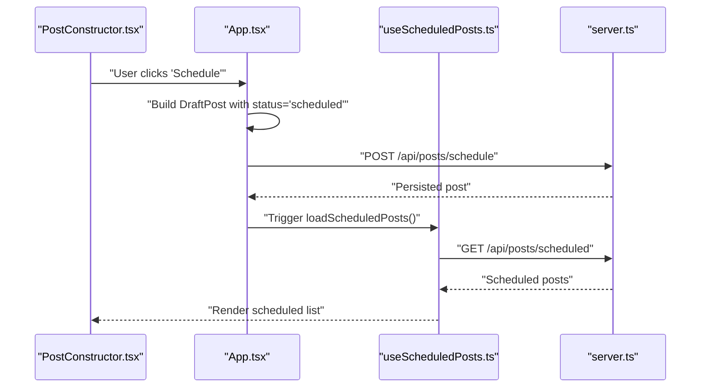
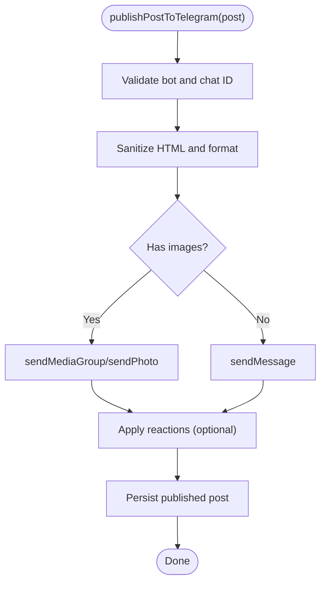
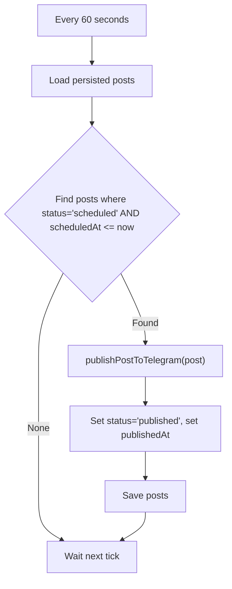
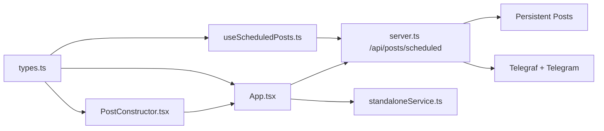

# Scheduled Post Endpoints

<cite>
**Referenced Files in This Document**
- [server.ts](file://server.ts)
- [types.ts](file://src/types.ts)
- [useScheduledPosts.ts](file://src/hooks/useScheduledPosts.ts)
- [PostConstructor.tsx](file://src/components/PostConstructor.tsx)
- [App.tsx](file://src/App.tsx)
- [standaloneService.ts](file://src/services/standaloneService.ts)
</cite>

## Table of Contents
1. [Introduction](#introduction)
2. [Project Structure](#project-structure)
3. [Core Components](#core-components)
4. [Architecture Overview](#architecture-overview)
5. [Detailed Component Analysis](#detailed-component-analysis)
6. [Dependency Analysis](#dependency-analysis)
7. [Performance Considerations](#performance-considerations)
8. [Troubleshooting Guide](#troubleshooting-guide)
9. [Conclusion](#conclusion)

## Introduction
This document describes the scheduled post management functionality centered around the /api/posts/scheduled endpoint group. It covers:
- HTTP methods: GET to retrieve scheduled posts, POST to create/update schedules, PUT semantics via POST, and DELETE to cancel scheduled posts
- The ScheduledPost interface and its relationship to DraftPost
- Practical examples for scheduling posts, timezone handling, and post-processing workflows
- Integration with the Telegram publishing system, including status updates, delivery confirmation, and retry mechanisms
- Client-side implementation patterns for schedule management, real-time status updates, and conflict resolution

## Project Structure
The scheduled post feature spans backend Express routes, TypeScript interfaces, and frontend hooks and components:
- Backend: Express routes under /api/posts/scheduled and related endpoints
- Interfaces: DraftPost and ScheduledPost definitions
- Frontend: Hook to load scheduled posts and UI component to capture scheduling inputs

**Diagram sources**
- [server.ts:1204-1241](file://server.ts#L1204-L1241)
- [useScheduledPosts.ts:1-37](file://src/hooks/useScheduledPosts.ts#L1-L37)
- [PostConstructor.tsx:268-281](file://src/components/PostConstructor.tsx#L268-L281)
- [App.tsx:880-903](file://src/App.tsx#L880-L903)
- [standaloneService.ts:74-146](file://src/services/standaloneService.ts#L74-L146)

**Section sources**
- [server.ts:1204-1241](file://server.ts#L1204-L1241)
- [types.ts:13-37](file://src/types.ts#L13-L37)
- [useScheduledPosts.ts:1-37](file://src/hooks/useScheduledPosts.ts#L1-L37)
- [PostConstructor.tsx:268-281](file://src/components/PostConstructor.tsx#L268-L281)
- [App.tsx:880-903](file://src/App.tsx#L880-L903)
- [standaloneService.ts:74-146](file://src/services/standaloneService.ts#L74-L146)

## Core Components
- ScheduledPost interface: Extends DraftPost with required scheduledAt timestamp and enforced status
- Scheduled post persistence: Stored in-memory arrays backed by JSON files
- Scheduled post scheduler: Periodic checker that publishes posts when scheduled time arrives
- Telegram publishing pipeline: Converts content to Telegram-safe HTML and sends via Telegraf or native HTTP

Key implementation references:
- ScheduledPost definition and conversion helpers
- GET /api/posts/scheduled
- POST /api/posts/schedule
- POST /api/posts/publish
- Scheduled post scheduler loop

**Section sources**
- [types.ts:34-41](file://src/types.ts#L34-L41)
- [server.ts:1204-1241](file://server.ts#L1204-L1241)
- [server.ts:1420-1446](file://server.ts#L1420-L1446)

## Architecture Overview
The scheduled post flow integrates client-side scheduling with server-side persistence and publishing.

**Diagram sources**
- [PostConstructor.tsx:268-281](file://src/components/PostConstructor.tsx#L268-L281)
- [App.tsx:880-903](file://src/App.tsx#L880-L903)
- [useScheduledPosts.ts:9-29](file://src/hooks/useScheduledPosts.ts#L9-L29)
- [server.ts:1204-1241](file://server.ts#L1204-L1241)
- [server.ts:1420-1446](file://server.ts#L1420-L1446)

## Detailed Component Analysis

### ScheduledPost Interface and Data Model
ScheduledPost extends DraftPost with:
- scheduledAt: Required timestamp (milliseconds since epoch)
- status: Enforced to 'scheduled'

Related types and helpers:
- DraftPost includes optional timestamps and status
- convertToTimestamp helper converts ISO date-time string to milliseconds

**Diagram sources**
- [types.ts:13-37](file://src/types.ts#L13-L37)

**Section sources**
- [types.ts:13-41](file://src/types.ts#L13-L41)

### Endpoint Group: /api/posts/scheduled
- GET /api/posts/scheduled
  - Returns all posts with status='scheduled'
  - Used by the frontend hook to populate the scheduled list
- POST /api/posts/schedule
  - Upserts a post and sets status='scheduled'
  - Accepts a payload derived from a DraftPost (including scheduledAt)
  - Returns the persisted post
- POST /api/posts/publish
  - Immediate publish to Telegram (not part of scheduling)
  - Used for on-demand publishing

Notes:
- There is no dedicated PUT endpoint for modifying schedule times. The recommended pattern is to re-submit the draft with updated scheduledAt via POST /api/posts/schedule.
- DELETE /api/posts/scheduled is not defined in the server code; cancellation is performed by deleting the specific scheduled post resource via DELETE /api/posts/published/:id after it is published, or by removing it from the persisted store externally.

**Section sources**
- [server.ts:1204-1241](file://server.ts#L1204-L1241)

### Client-Side Schedule Management
- PostConstructor.tsx
  - Provides a datetime-local input bound to scheduleDateTime
  - saveDraft('scheduled') triggers saving to drafts and scheduling via POST /api/posts/schedule
- App.tsx
  - Constructs a DraftPost with status='scheduled' and scheduledAt computed from scheduleDateTime
  - Calls universalFetch to POST /api/posts/schedule
- useScheduledPosts.ts
  - Loads scheduled posts from /api/posts/scheduled
  - Handles standalone vs server modes

**Diagram sources**
- [PostConstructor.tsx:268-281](file://src/components/PostConstructor.tsx#L268-L281)
- [App.tsx:880-903](file://src/App.tsx#L880-L903)
- [useScheduledPosts.ts:9-29](file://src/hooks/useScheduledPosts.ts#L9-L29)
- [server.ts:1204-1241](file://server.ts#L1204-L1241)

**Section sources**
- [PostConstructor.tsx:268-281](file://src/components/PostConstructor.tsx#L268-L281)
- [App.tsx:880-903](file://src/App.tsx#L880-L903)
- [useScheduledPosts.ts:1-37](file://src/hooks/useScheduledPosts.ts#L1-L37)

### Telegram Publishing Pipeline
- publishPostToTelegram
  - Validates bot and chat ID
  - Sanitizes HTML and applies Telegram-specific formatting
  - Sends media groups and reactions
  - Persists published posts to a separate collection
- Standalone mode
  - Uses standaloneService.telegram methods to call Telegram API directly

**Diagram sources**
- [server.ts:806-934](file://server.ts#L806-L934)
- [standaloneService.ts:74-146](file://src/services/standaloneService.ts#L74-L146)

**Section sources**
- [server.ts:806-934](file://server.ts#L806-L934)
- [standaloneService.ts:74-146](file://src/services/standaloneService.ts#L74-L146)

### Scheduled Post Scheduler
- Every minute, the server scans persisted posts
- Any post with status='scheduled' and scheduledAt <= now is published
- After successful publish, status is updated to 'published' and publishedAt is recorded

**Diagram sources**
- [server.ts:1420-1446](file://server.ts#L1420-L1446)

**Section sources**
- [server.ts:1420-1446](file://server.ts#L1420-L1446)

### Request/Response Schemas
- GET /api/posts/scheduled
  - Response: Array of ScheduledPost objects
- POST /api/posts/schedule
  - Request: DraftPost-like object (must include id and scheduledAt)
  - Response: The persisted ScheduledPost

ScheduledPost fields:
- id: string
- text: string
- selectedImages: string[]
- mainImage: string
- buttons: PostButton[]
- status: "scheduled"
- scheduledAt: number (epoch millis)
- createdAt: number
- updatedAt: number
- publishedAt: number (optional, populated after publish)

DraftPost fields (extended by ScheduledPost):
- parsedContent: title/text/images
- isMarkdown: boolean
- scheduledAt: number (optional in DraftPost)
- publishedAt: number (optional)
- createdAt: number
- updatedAt: number

**Section sources**
- [server.ts:1204-1241](file://server.ts#L1204-L1241)
- [types.ts:13-37](file://src/types.ts#L13-L37)

### Practical Examples

#### Scheduling a Post with Timezone Handling
- Use a datetime-local input bound to scheduleDateTime
- Convert to milliseconds using convertToTimestamp
- Submit via POST /api/posts/schedule
- The server stores scheduledAt as epoch millis; publication occurs relative to server time

References:
- [PostConstructor.tsx:271-275](file://src/components/PostConstructor.tsx#L271-L275)
- [App.tsx:884-885](file://src/App.tsx#L884-L885)
- [types.ts:39-41](file://src/types.ts#L39-L41)

#### Recurring Schedules
- The server does not implement recurring schedules
- Recommended approach: On successful publish, re-submit the same content with a new scheduledAt to create the next occurrence

References:
- [server.ts:1426-1443](file://server.ts#L1426-L1443)

#### Post-Processing Workflows
- Content sanitization and HTML generation occur before publishing
- Media handling supports single image, multiple images, and captions
- Reactions and inline buttons are applied conditionally

References:
- [server.ts:806-934](file://server.ts#L806-L934)

#### Relationship Between Scheduled Posts and Telegram
- Scheduled posts are published automatically when their scheduled time arrives
- Delivery confirmation is implicit via successful Telegram API responses
- Retry mechanisms are handled by the Telegram client library and network layer

References:
- [server.ts:806-934](file://server.ts#L806-L934)

### Client-Side Implementation Examples

#### Real-Time Status Updates
- useScheduledPosts loads scheduled posts from /api/posts/scheduled
- After scheduling, trigger loadScheduledPosts to refresh the UI

References:
- [useScheduledPosts.ts:9-29](file://src/hooks/useScheduledPosts.ts#L9-L29)

#### Conflict Resolution for Overlapping Schedules
- The server does not enforce uniqueness or overlap checks
- Clients should validate user intent and avoid submitting conflicting schedules
- If a post is already published, clients can remove it from scheduled lists

References:
- [server.ts:1204-1241](file://server.ts#L1204-L1241)

#### Standalone Mode Publishing
- For standalone operation, App.tsx uses standaloneService.telegram methods
- Supports sending text, photos, and media groups

References:
- [App.tsx:928-956](file://src/App.tsx#L928-L956)
- [standaloneService.ts:74-146](file://src/services/standaloneService.ts#L74-L146)

## Dependency Analysis
- server.ts depends on:
  - storageWrapper for file-backed persistence
  - Telegraf for Telegram integration
  - Cheerio and marked for content processing
- Frontend depends on:
  - useScheduledPosts hook for scheduled list retrieval
  - PostConstructor.tsx for capturing schedule inputs
  - App.tsx orchestrating saveDraft and handlePublish
  - standaloneService.ts for native Telegram API calls

**Diagram sources**
- [types.ts:13-37](file://src/types.ts#L13-L37)
- [useScheduledPosts.ts:1-37](file://src/hooks/useScheduledPosts.ts#L1-L37)
- [PostConstructor.tsx:268-281](file://src/components/PostConstructor.tsx#L268-L281)
- [App.tsx:880-903](file://src/App.tsx#L880-L903)
- [server.ts:1204-1241](file://server.ts#L1204-L1241)
- [standaloneService.ts:74-146](file://src/services/standaloneService.ts#L74-L146)

**Section sources**
- [server.ts:1204-1241](file://server.ts#L1204-L1241)
- [types.ts:13-37](file://src/types.ts#L13-L37)
- [useScheduledPosts.ts:1-37](file://src/hooks/useScheduledPosts.ts#L1-L37)
- [PostConstructor.tsx:268-281](file://src/components/PostConstructor.tsx#L268-L281)
- [App.tsx:880-903](file://src/App.tsx#L880-L903)
- [standaloneService.ts:74-146](file://src/services/standaloneService.ts#L74-L146)

## Performance Considerations
- Rate limiting: The server applies rate limits to API endpoints
- Scheduler frequency: The minute-long scan interval balances responsiveness with minimal overhead
- Content processing: HTML sanitization and Markdown-to-HTML conversion occur before publishing
- Media upload: Image uploads are validated and sanitized to prevent path traversal

[No sources needed since this section provides general guidance]

## Troubleshooting Guide
Common issues and remedies:
- Missing bot token or chat ID prevents publishing
  - Ensure token and chat ID are configured via UI or environment
- Telegram API errors
  - Inspect server logs and handle transient network errors
- Scheduled post not publishing
  - Verify scheduledAt is in the past or present
  - Confirm server time zone alignment
- Duplicate or conflicting schedules
  - Implement client-side validation to prevent overlapping schedules

**Section sources**
- [server.ts:975-989](file://server.ts#L975-L989)
- [server.ts:1420-1446](file://server.ts#L1420-L1446)

## Conclusion
The scheduled post endpoint group provides a straightforward mechanism to persist, schedule, and publish posts to Telegram. While the server does not implement recurring schedules or explicit PUT for schedule modification, clients can manage these scenarios by re-submitting updated drafts. The integration with Telegram is robust, with automatic publishing on schedule and built-in logging for monitoring.