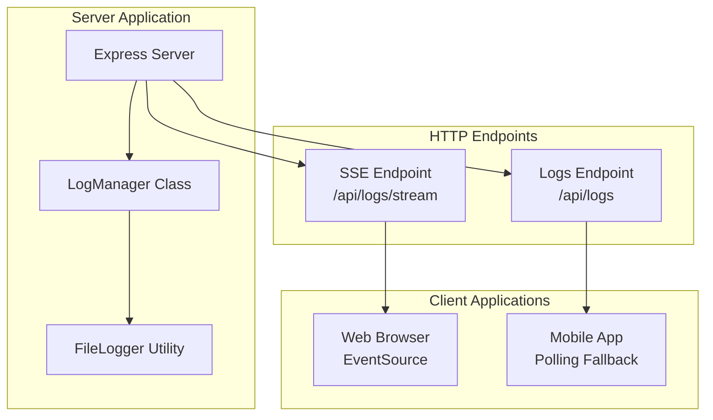
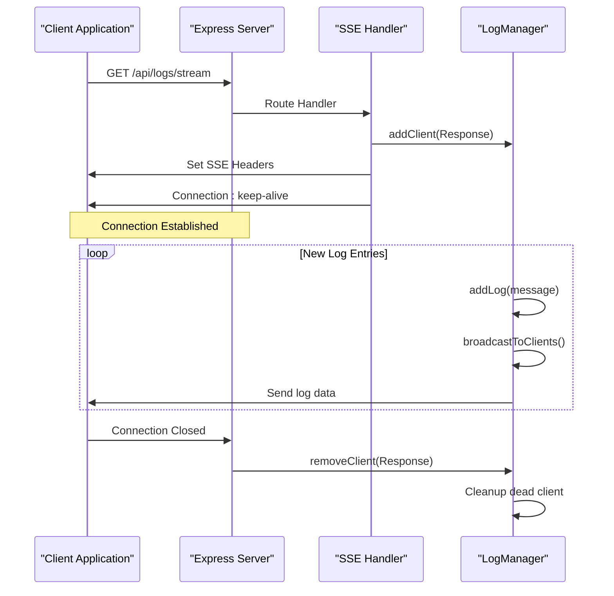
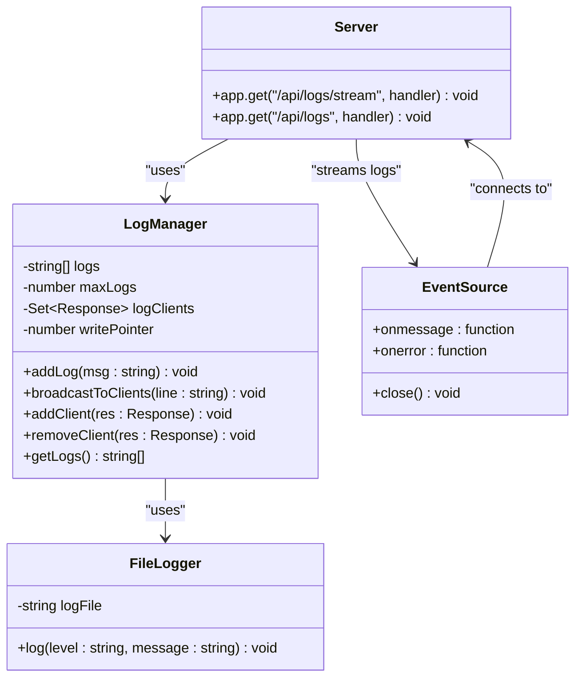
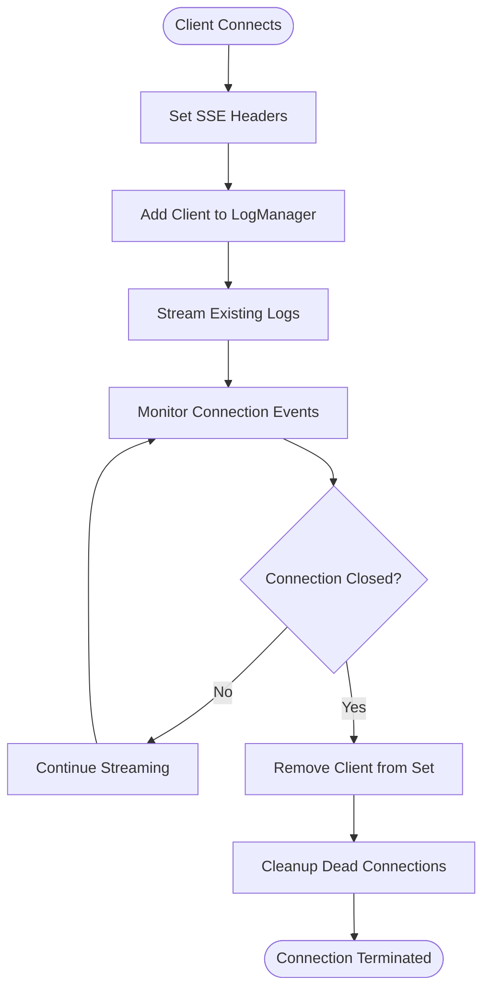
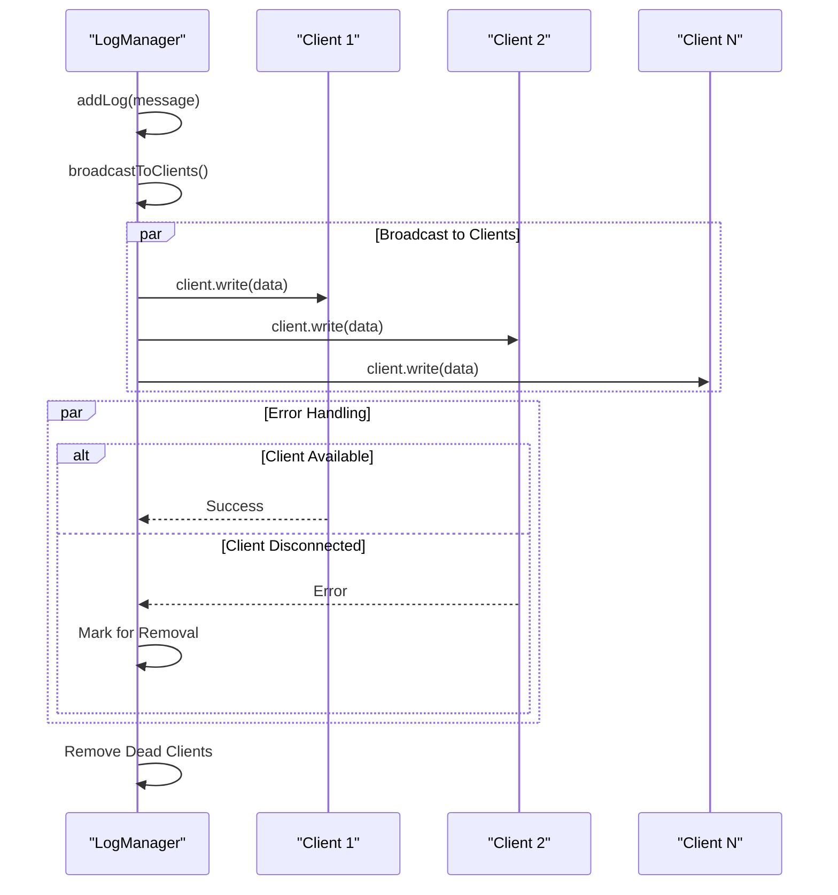
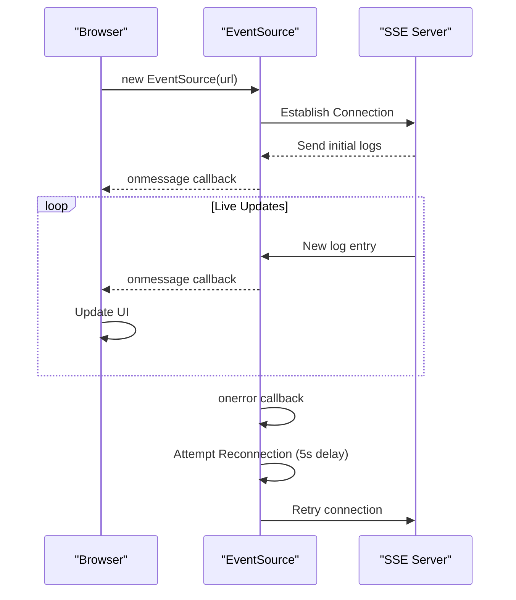
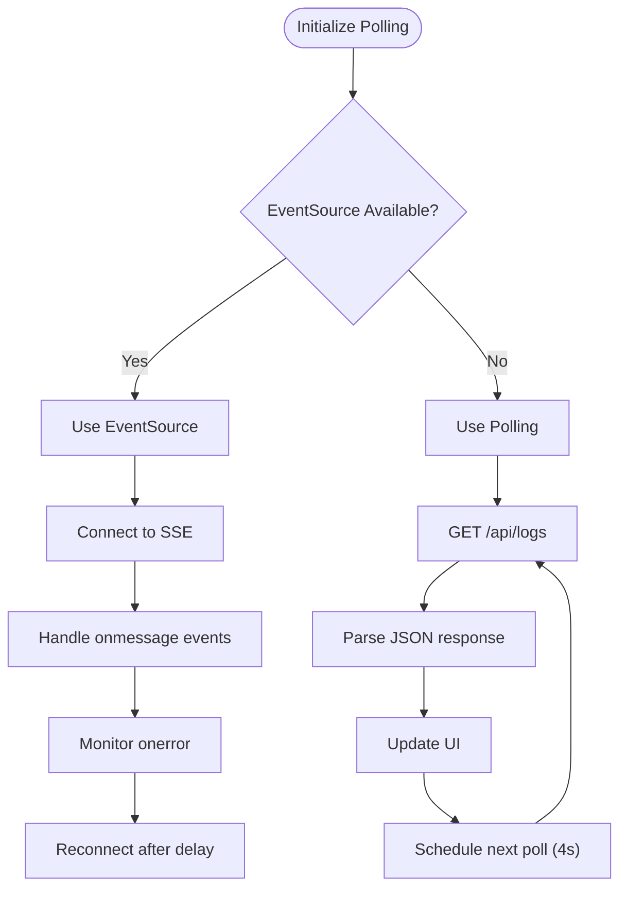
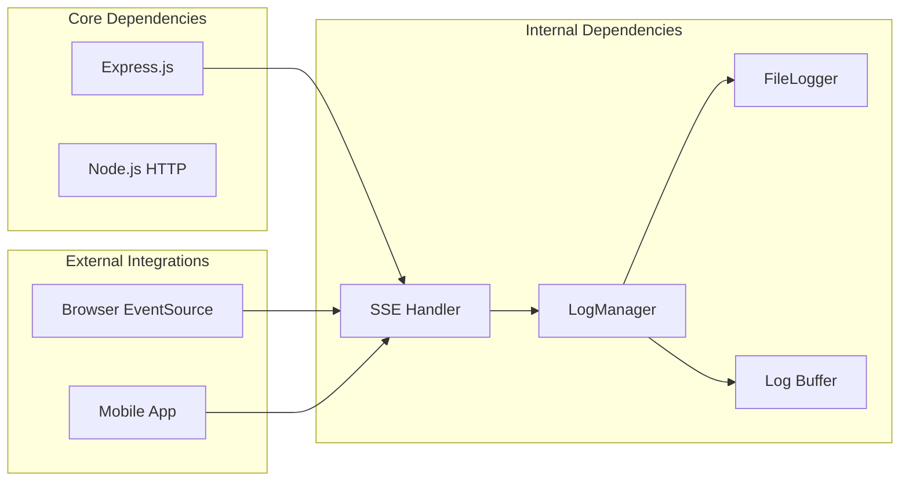

# Real-time Logging Endpoint

<cite>
**Referenced Files in This Document**
- [server.ts](file://server.ts)
- [App.tsx](file://src/App.tsx)
- [serverUtils.ts](file://src/serverUtils.ts)
</cite>

## Table of Contents
1. [Introduction](#introduction)
2. [Project Structure](#project-structure)
3. [Core Components](#core-components)
4. [Architecture Overview](#architecture-overview)
5. [Detailed Component Analysis](#detailed-component-analysis)
6. [Dependency Analysis](#dependency-analysis)
7. [Performance Considerations](#performance-considerations)
8. [Troubleshooting Guide](#troubleshooting-guide)
9. [Conclusion](#conclusion)

## Introduction

The `/api/logs/stream` endpoint provides real-time logging functionality using the Server-Sent Events (SSE) protocol. This endpoint enables clients to receive live log updates from the server without requiring manual polling, making it ideal for monitoring applications, debugging, and real-time status reporting.

The implementation features a sophisticated log management system that maintains a circular buffer of recent log entries and automatically streams new logs to connected clients. The system handles client connection lifecycle management, automatic cleanup of disconnected clients, and efficient broadcasting mechanisms.

## Project Structure

The real-time logging functionality is implemented within the main server application with the following key components:



**Diagram sources**
- [server.ts:342-352](file://server.ts#L342-L352)
- [server.ts:1145-1148](file://server.ts#L1145-L1148)

**Section sources**
- [server.ts:1-1454](file://server.ts#L1-L1454)

## Core Components

### Server-Sent Events Implementation

The SSE endpoint is implemented as a dedicated Express route that establishes a persistent connection with clients:



**Diagram sources**
- [server.ts:342-352](file://server.ts#L342-L352)
- [server.ts:247-257](file://server.ts#L247-L257)

### Log Management System

The `LogManager` class provides centralized log handling with the following capabilities:

- Circular buffer storage of recent log entries (default: 200 entries)
- Automatic timestamp formatting for log entries
- Efficient client broadcasting mechanism
- Automatic cleanup of disconnected clients
- Thread-safe log entry management

**Section sources**
- [server.ts:218-277](file://server.ts#L218-L277)

## Architecture Overview

The real-time logging architecture follows a publish-subscribe pattern with automatic client lifecycle management:



**Diagram sources**
- [server.ts:218-277](file://server.ts#L218-L277)
- [server.ts:7-22](file://server.ts#L7-L22)
- [src/App.tsx:659-679](file://src/App.tsx#L659-L679)

## Detailed Component Analysis

### SSE Endpoint Implementation

The `/api/logs/stream` endpoint implements the complete SSE specification with proper HTTP headers and connection management:

#### HTTP Response Headers
- **Content-Type**: `text/event-stream` - Identifies the response as Server-Sent Events
- **Cache-Control**: `no-cache` - Prevents caching of log streams
- **Connection**: `keep-alive` - Maintains persistent connection

#### Connection Lifecycle Management



**Diagram sources**
- [server.ts:342-352](file://server.ts#L342-L352)
- [server.ts:259-265](file://server.ts#L259-L265)

#### Log Broadcasting Mechanism

The `broadcastToClients` method efficiently distributes log entries to all connected clients:



**Diagram sources**
- [server.ts:247-257](file://server.ts#L247-L257)

**Section sources**
- [server.ts:342-352](file://server.ts#L342-L352)
- [server.ts:247-257](file://server.ts#L247-L257)

### Client-Side Implementation Patterns

#### Web Browser Implementation

The web client uses the native `EventSource` API for automatic reconnection and error handling:



**Diagram sources**
- [src/App.tsx:659-679](file://src/App.tsx#L659-L679)

#### Mobile/Fallback Implementation

For environments where `EventSource` is not available (Android WebView), the mobile client implements polling with exponential backoff:



**Diagram sources**
- [src/App.tsx:681-698](file://src/App.tsx#L681-L698)

**Section sources**
- [src/App.tsx:659-698](file://src/App.tsx#L659-L698)

### Log Format Specification

#### Timestamp Format
- **Format**: Local time in Russian locale (`ru-RU`)
- **Pattern**: Hours:Minutes:Seconds (24-hour format)
- **Example**: `[14:30:25]`

#### Message Structure
Each log entry consists of:
1. **Timestamp Prefix**: Enclosed in square brackets
2. **Message Content**: Free-form text describing the event
3. **Automatic Formatting**: Timestamps are automatically added to all log entries

#### Example Log Entries
- `[14:30:25] Bot initialized successfully`
- `[14:30:26] Processing URL: https://example.com`
- `[14:30:27] AI translation completed`

**Section sources**
- [server.ts:232-244](file://server.ts#L232-L244)

## Dependency Analysis

The real-time logging system has minimal external dependencies and integrates seamlessly with the existing server infrastructure:



**Diagram sources**
- [server.ts:1-1454](file://server.ts#L1-L1454)

### External Dependencies

The implementation relies on standard Node.js HTTP functionality and Express routing:

- **Express.js**: HTTP server framework
- **Node.js HTTP**: Built-in HTTP response handling
- **EventSource API**: Browser-native SSE client

### Internal Dependencies

- **LogManager**: Centralized log management
- **FileLogger**: Persistent file logging
- **Circular Buffer**: Efficient memory management

**Section sources**
- [server.ts:1-1454](file://server.ts#L1-L1454)

## Performance Considerations

### Memory Management
- **Circular Buffer**: Fixed-size array prevents unbounded memory growth
- **Default Capacity**: 200 log entries (configurable)
- **Automatic Wrapping**: Write pointer ensures efficient reuse of memory

### Connection Scalability
- **Set-Based Client Tracking**: O(1) client addition/removal
- **Efficient Broadcasting**: Single iteration over connected clients
- **Automatic Cleanup**: Periodic removal of disconnected clients

### Network Efficiency
- **Minimal Payload**: Only log messages without headers or metadata
- **Compression**: No compression overhead (small log messages)
- **Connection Reuse**: Persistent connections eliminate handshake overhead

### Client-Side Optimizations
- **EventSource Benefits**: Automatic reconnection, binary efficiency
- **Polling Fallback**: 4-second intervals for mobile compatibility
- **Memory Limits**: Client-side log buffering (50 entries maximum)

## Troubleshooting Guide

### Common Issues and Solutions

#### Connection Problems
- **Symptom**: Clients cannot connect to SSE endpoint
- **Cause**: Network restrictions or firewall blocking
- **Solution**: Verify server accessibility and port availability

#### Disconnection Handling
- **Symptom**: Frequent disconnections
- **Cause**: Network instability or client-side errors
- **Solution**: Implement exponential backoff in client applications

#### Memory Leaks
- **Symptom**: Gradual memory increase over time
- **Cause**: Unintentional client retention
- **Solution**: Verify automatic cleanup in `broadcastToClients`

#### Performance Degradation
- **Symptom**: Slow log delivery or increased latency
- **Cause**: Too many concurrent clients
- **Solution**: Monitor client count and implement connection limits

### Client-Side Error Handling Patterns

#### EventSource Error Handling
```javascript
// Basic error handling pattern
eventSource.onerror = function() {
    console.log('Connection lost, attempting to reconnect...');
    // Automatic reconnection handled by browser
};
```

#### Mobile Polling Error Handling
```javascript
// Polling with error recovery
const poll = async () => {
    try {
        const response = await fetch('/api/logs');
        if (response.ok) {
            const data = await response.json();
            // Process logs
        }
    } catch (error) {
        console.error('Polling failed:', error);
        // Schedule retry with exponential backoff
    }
};
```

**Section sources**
- [src/App.tsx:669-674](file://src/App.tsx#L669-L674)
- [src/App.tsx:686-694](file://src/App.tsx#L686-L694)

## Conclusion

The `/api/logs/stream` Server-Sent Events endpoint provides a robust, scalable solution for real-time logging with minimal complexity. The implementation demonstrates excellent separation of concerns through the `LogManager` class, efficient memory management via circular buffers, and comprehensive client lifecycle management.

Key strengths of the implementation include:
- **Automatic Client Management**: Seamless connection handling with automatic cleanup
- **Efficient Broadcasting**: Optimized log distribution to multiple clients
- **Cross-Platform Compatibility**: EventSource for modern browsers, polling fallback for mobile
- **Performance Optimization**: Minimal memory footprint and network overhead
- **Reliability**: Built-in error handling and reconnection strategies

The endpoint serves as an excellent foundation for monitoring systems, debugging tools, and real-time status dashboards, with clear extension points for additional features like log filtering, client authentication, and advanced broadcasting patterns.