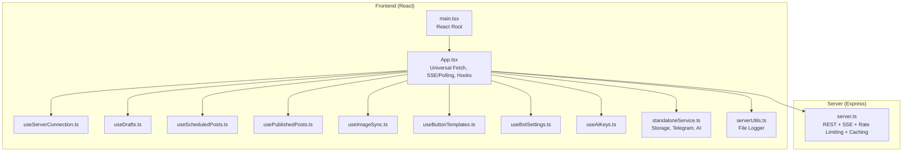
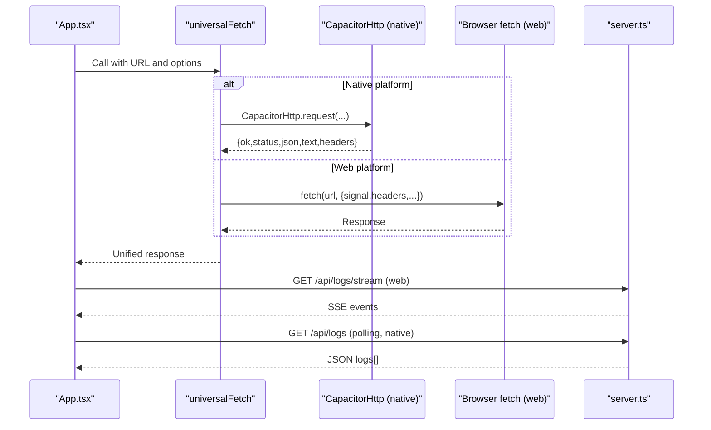
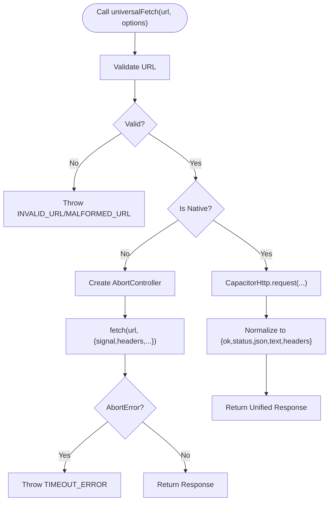
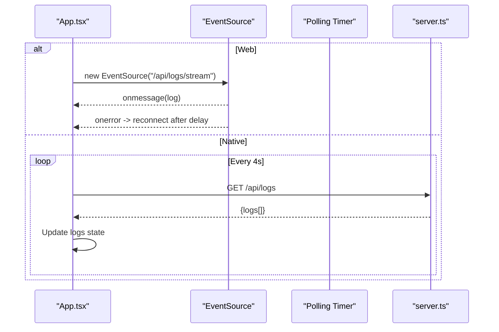
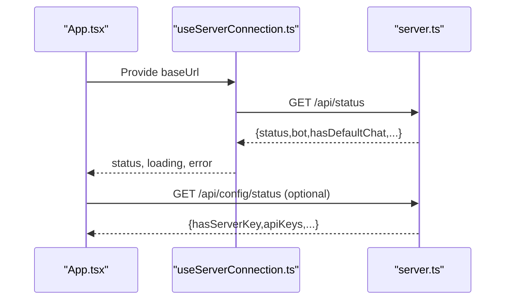
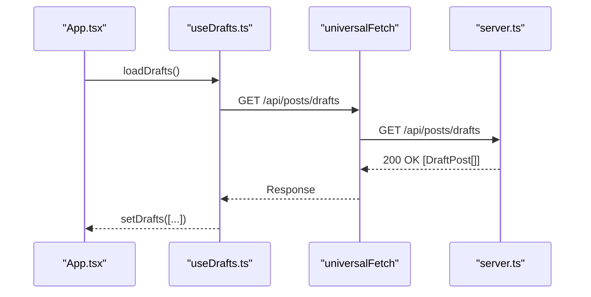
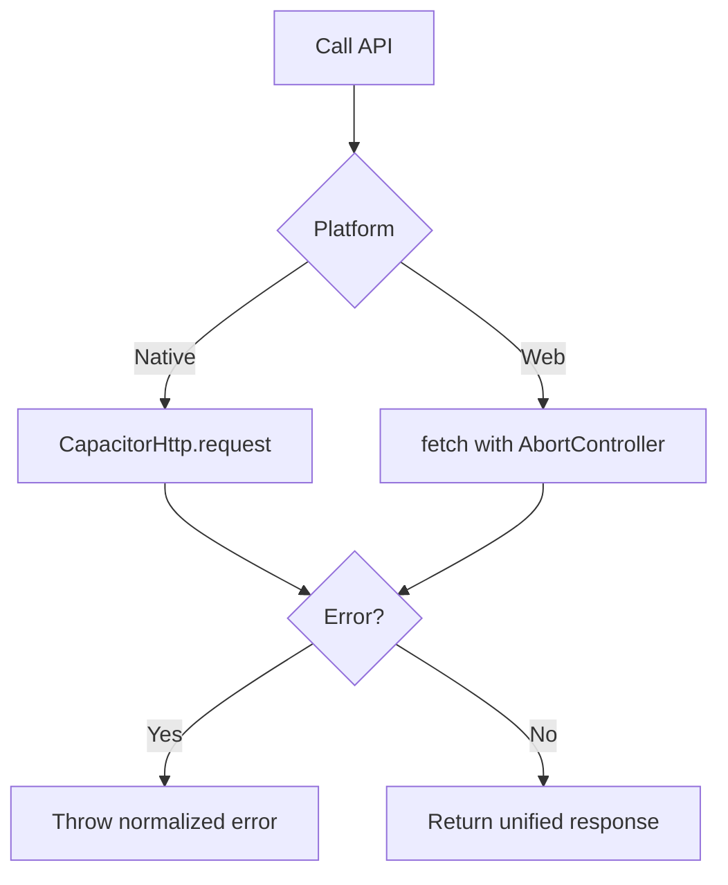
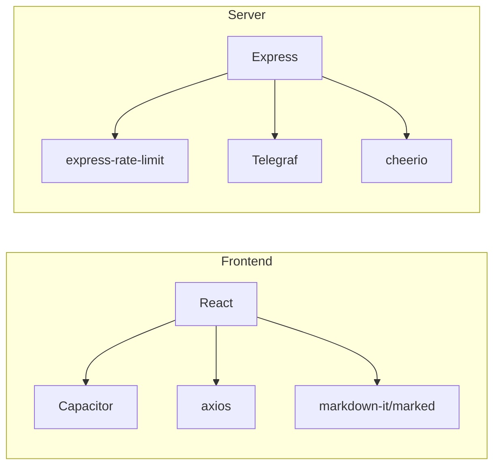

# Frontend API Integration

<cite>
**Referenced Files in This Document**
- [serverUtils.ts](file://src/serverUtils.ts)
- [main.tsx](file://src/main.tsx)
- [App.tsx](file://src/App.tsx)
- [useServerConnection.ts](file://src/hooks/useServerConnection.ts)
- [useDrafts.ts](file://src/hooks/useDrafts.ts)
- [useScheduledPosts.ts](file://src/hooks/useScheduledPosts.ts)
- [usePublishedPosts.ts](file://src/hooks/usePublishedPosts.ts)
- [useImageSync.ts](file://src/hooks/useImageSync.ts)
- [useButtonTemplates.ts](file://src/hooks/useButtonTemplates.ts)
- [useBotSettings.ts](file://src/hooks/useBotSettings.ts)
- [useAiKeys.ts](file://src/hooks/useAiKeys.ts)
- [standaloneService.ts](file://src/services/standaloneService.ts)
- [types.ts](file://src/types.ts)
- [server.ts](file://server.ts)
- [package.json](file://package.json)
</cite>

## Table of Contents
1. [Introduction](#introduction)
2. [Project Structure](#project-structure)
3. [Core Components](#core-components)
4. [Architecture Overview](#architecture-overview)
5. [Detailed Component Analysis](#detailed-component-analysis)
6. [Dependency Analysis](#dependency-analysis)
7. [Performance Considerations](#performance-considerations)
8. [Troubleshooting Guide](#troubleshooting-guide)
9. [Conclusion](#conclusion)
10. [Appendices](#appendices)

## Introduction
This document explains the frontend API integration patterns used in the React application. It covers client-side API call implementations, error handling strategies, loading states management, and caching mechanisms. It also documents the integration with server-side endpoints, including authentication flows, request/response transformations, and real-time data synchronization. Practical examples of API consumption in React components, error boundary implementations, and performance optimization techniques are included. The serverUtils.ts utility functions and their role in API communication are documented, along with guidelines for handling network failures, implementing retry logic, and managing API state in the frontend application.

## Project Structure
The frontend is a React application built with Vite and Capacitor. The main entry point initializes the React root and mounts the App component. The App component orchestrates API calls via a universal fetch abstraction, manages real-time logs via Server-Sent Events (SSE) on web and polling on native, and coordinates multiple domain-specific hooks for drafts, scheduled posts, published posts, image sync, button templates, bot settings, and AI keys. The server exposes REST endpoints and SSE streams for logs, and the backend server code defines the API surface and caching strategies.

**Diagram sources**
- [main.tsx:1-11](file://src/main.tsx#L1-L11)
- [App.tsx:168-170](file://src/App.tsx#L168-L170)
- [useServerConnection.ts:15-51](file://src/hooks/useServerConnection.ts#L15-L51)
- [useDrafts.ts:5-87](file://src/hooks/useDrafts.ts#L5-L87)
- [useScheduledPosts.ts:5-37](file://src/hooks/useScheduledPosts.ts#L5-L37)
- [usePublishedPosts.ts:5-37](file://src/hooks/usePublishedPosts.ts#L5-L37)
- [useImageSync.ts:5-41](file://src/hooks/useImageSync.ts#L5-L41)
- [useButtonTemplates.ts:5-37](file://src/hooks/useButtonTemplates.ts#L5-L37)
- [useBotSettings.ts:5-55](file://src/hooks/useBotSettings.ts#L5-L55)
- [useAiKeys.ts:4-56](file://src/hooks/useAiKeys.ts#L4-L56)
- [standaloneService.ts:11-175](file://src/services/standaloneService.ts#L11-L175)
- [serverUtils.ts:7-22](file://src/serverUtils.ts#L7-L22)
- [server.ts:37-800](file://server.ts#L37-L800)

**Section sources**
- [main.tsx:1-11](file://src/main.tsx#L1-L11)
- [App.tsx:168-170](file://src/App.tsx#L168-L170)
- [server.ts:37-800](file://server.ts#L37-L800)

## Core Components
- Universal Fetch: A cross-platform fetch wrapper that uses CapacitorHttp on native and browser fetch on web, with timeouts and standardized response shape.
- Real-time Logs: SSE on web and polling on native to stream logs from the server.
- Domain Hooks: Specialized hooks for drafts, scheduled posts, published posts, image sync, button templates, bot settings, and AI keys.
- Server Connection: Hook to poll server status via CapacitorHttp.
- Error Boundary: Top-level error boundary to gracefully handle runtime errors.
- Storage Abstraction: Local storage and filesystem abstraction for standalone mode.

**Section sources**
- [App.tsx:194-251](file://src/App.tsx#L194-L251)
- [App.tsx:622-641](file://src/App.tsx#L622-L641)
- [App.tsx:146-166](file://src/App.tsx#L146-L166)
- [standaloneService.ts:11-72](file://src/services/standaloneService.ts#L11-L72)

## Architecture Overview
The frontend integrates with the server through a unified fetch abstraction and domain-specific hooks. On web, SSE is used for real-time logs; on native, polling is used. The server implements rate limiting, caching, and SSE streaming for logs. The standalone service provides storage and Telegram/AI utilities for native environments.

**Diagram sources**
- [App.tsx:194-251](file://src/App.tsx#L194-L251)
- [App.tsx:652-698](file://src/App.tsx#L652-L698)
- [server.ts:342-352](file://server.ts#L342-L352)

## Detailed Component Analysis

### Universal Fetch Implementation
The universalFetch function provides a single API surface for HTTP requests across platforms:
- Validates URLs and throws explicit errors for invalid or malformed URLs.
- On native, uses CapacitorHttp with connect/read timeouts and returns a response object with ok, status, json, text, and headers.
- On web, wraps fetch with an AbortController to enforce a 120-second timeout and normalizes errors (e.g., AbortError to a specific error code).
- Returns a unified response object for downstream consumers.

**Diagram sources**
- [App.tsx:194-251](file://src/App.tsx#L194-L251)

**Section sources**
- [App.tsx:194-251](file://src/App.tsx#L194-L251)

### Real-time Logs: SSE vs Polling
- Web: Uses EventSource to connect to /api/logs/stream and listens for onmessage events. Implements exponential backoff on error.
- Native: Polls /api/logs every 4 seconds and updates the UI logs array.

**Diagram sources**
- [App.tsx:652-698](file://src/App.tsx#L652-L698)
- [server.ts:342-352](file://server.ts#L342-L352)

**Section sources**
- [App.tsx:652-698](file://src/App.tsx#L652-L698)
- [server.ts:342-352](file://server.ts#L342-L352)

### Server Status and Authentication Flow
- The useServerConnection hook polls /api/status using CapacitorHttp and updates status, loading, and error states.
- The App component reads the base URL from local preferences and environment, normalizes it, and passes it to hooks.
- Authentication tokens are stored in secure storage (standalone) or localStorage (server mode) and passed via headers or query parameters depending on endpoint design.

**Diagram sources**
- [useServerConnection.ts:15-51](file://src/hooks/useServerConnection.ts#L15-L51)
- [App.tsx:622-641](file://src/App.tsx#L622-L641)
- [server.ts:37-800](file://server.ts#L37-L800)

**Section sources**
- [useServerConnection.ts:15-51](file://src/hooks/useServerConnection.ts#L15-L51)
- [App.tsx:622-641](file://src/App.tsx#L622-L641)
- [types.ts:43-48](file://src/types.ts#L43-L48)

### API Consumption in Domain Hooks
Each domain hook encapsulates CRUD operations against server endpoints:
- Drafts: GET /api/posts/drafts, POST /api/posts/drafts, DELETE /api/posts/drafts/{id}
- Scheduled Posts: GET /api/posts/scheduled
- Published Posts: GET /api/posts/published
- Button Templates: GET /api/posts/templates/buttons
- Config: GET /api/config/chat-id-presets, GET/POST /api/config/image-path

**Diagram sources**
- [useDrafts.ts:9-29](file://src/hooks/useDrafts.ts#L9-L29)
- [App.tsx:325-329](file://src/App.tsx#L325-L329)
- [server.ts:37-800](file://server.ts#L37-L800)

**Section sources**
- [useDrafts.ts:9-29](file://src/hooks/useDrafts.ts#L9-L29)
- [useScheduledPosts.ts:9-29](file://src/hooks/useScheduledPosts.ts#L9-L29)
- [usePublishedPosts.ts:9-29](file://src/hooks/usePublishedPosts.ts#L9-L29)
- [useButtonTemplates.ts:9-29](file://src/hooks/useButtonTemplates.ts#L9-L29)
- [App.tsx:325-329](file://src/App.tsx#L325-L329)

### Error Handling Strategies
- URL Validation: Throws INVALID_URL or MALFORMED_URL for malformed inputs.
- Native vs Web: CapacitorHttp errors are normalized; fetch throws AbortError which is mapped to TIMEOUT_ERROR.
- Domain Hooks: Wrap fetch calls in try/catch and log errors; set loading=false in finally.
- Error Boundary: Catches rendering errors and displays a user-friendly message with recovery actions.

**Diagram sources**
- [App.tsx:194-251](file://src/App.tsx#L194-L251)
- [App.tsx:146-166](file://src/App.tsx#L146-L166)

**Section sources**
- [App.tsx:194-251](file://src/App.tsx#L194-L251)
- [App.tsx:146-166](file://src/App.tsx#L146-L166)

### Loading States Management
- Loading flags are maintained per domain hook (e.g., drafts.loading, scheduledPosts.loading).
- App-level loading is controlled via a timeout to avoid indefinite spinner.
- SSE/polling loops update logs without blocking UI rendering.

**Section sources**
- [useDrafts.ts:6-8](file://src/hooks/useDrafts.ts#L6-L8)
- [useScheduledPosts.ts:6-8](file://src/hooks/useScheduledPosts.ts#L6-L8)
- [usePublishedPosts.ts:6-8](file://src/hooks/usePublishedPosts.ts#L6-L8)
- [App.tsx:645-649](file://src/App.tsx#L645-L649)

### Caching Mechanisms
- Server-side caching: In-memory caches for API keys, posts, templates, image path, and chat ID presets to reduce disk I/O.
- Client-side caching: Local storage for standalone mode; Capacitor Preferences for persistent settings; localStorage for server mode.
- Image sync: Combines server-provided images with local images and deduplicates.

**Section sources**
- [server.ts:84-91](file://server.ts#L84-L91)
- [standaloneService.ts:11-72](file://src/services/standaloneService.ts#L11-L72)
- [App.tsx:475-522](file://src/App.tsx#L475-L522)

### Request/Response Transformations
- URL normalization: Ensures http/https scheme and removes trailing slashes.
- Response normalization: Both native and web paths return a unified response with ok, status, json, text, headers.
- Log parsing: SSE messages are parsed as JSON; polling returns arrays of log strings.

**Section sources**
- [App.tsx:254-265](file://src/App.tsx#L254-L265)
- [App.tsx:194-251](file://src/App.tsx#L194-L251)
- [App.tsx:662-674](file://src/App.tsx#L662-L674)

### Real-time Data Synchronization
- SSE: Web clients subscribe to /api/logs/stream for live updates.
- Polling: Native clients poll /api/logs every 4 seconds.
- Server-side SSE manager maintains connected clients and broadcasts logs.

**Section sources**
- [App.tsx:652-698](file://src/App.tsx#L652-L698)
- [server.ts:219-277](file://server.ts#L219-L277)

### Practical Examples of API Consumption
- Loading drafts: useDrafts.loadDrafts() calls universalFetch with proper URL and handles errors.
- Saving drafts: useDrafts.saveDraft() posts JSON payload to /api/posts/drafts.
- Deleting drafts: useDrafts.deleteDraft() invokes DELETE on /api/posts/drafts/{id}.
- Syncing images: App.syncLocalImages() calls /api/images/sync and merges results.

**Section sources**
- [useDrafts.ts:31-54](file://src/hooks/useDrafts.ts#L31-L54)
- [useDrafts.ts:56-73](file://src/hooks/useDrafts.ts#L56-L73)
- [App.tsx:401-522](file://src/App.tsx#L401-L522)

### Error Boundary Implementation
- A class-based error boundary catches rendering errors, logs them, and renders a recovery UI with actions to reset settings and reload.

**Section sources**
- [App.tsx:146-166](file://src/App.tsx#L146-L166)

### Performance Optimization Techniques
- Platform-aware fetch: CapacitorHttp on native reduces overhead and improves reliability.
- Timeouts: 120-second fetch timeout prevents hanging requests.
- Debounced auto-save: Image path auto-save is debounced to avoid excessive writes.
- SSE/polling: Efficient real-time logs with reconnection logic.

**Section sources**
- [App.tsx:213-250](file://src/App.tsx#L213-L250)
- [App.tsx:718-725](file://src/App.tsx#L718-L725)

### serverUtils.ts Utility Functions
- FileLogger: Provides file-based logging with timestamps and level prefixes, ensuring logs are written to a dedicated directory.

**Section sources**
- [serverUtils.ts:7-22](file://src/serverUtils.ts#L7-L22)

## Dependency Analysis
The frontend depends on React, Capacitor, and various UI libraries. The server depends on Express, Telegraf, rate limiting, and Cheerio. The frontend communicates with the server via REST and SSE.

**Diagram sources**
- [package.json:19-56](file://package.json#L19-L56)
- [server.ts:1-16](file://server.ts#L1-L16)

**Section sources**
- [package.json:19-56](file://package.json#L19-L56)
- [server.ts:1-16](file://server.ts#L1-L16)

## Performance Considerations
- Prefer CapacitorHttp on native for lower latency and better error handling.
- Use AbortController to cancel long-running requests and avoid memory leaks.
- Debounce frequent writes (e.g., image path) to reduce network and disk I/O.
- Implement exponential backoff for SSE reconnection to avoid thundering herd.
- Cache server responses where appropriate and invalidate on mutations.

## Troubleshooting Guide
- Invalid URL errors: Ensure base URL is sanitized and normalized before use.
- Timeout errors: Verify network connectivity and adjust timeouts if needed.
- SSE not working on native: Expect polling fallback; confirm server SSE endpoint availability.
- 409 conflicts: The server may restart the bot; monitor health checks and retry logic.
- Storage permission errors: On native, request and check filesystem permissions before accessing files.

**Section sources**
- [App.tsx:194-251](file://src/App.tsx#L194-L251)
- [App.tsx:652-698](file://src/App.tsx#L652-L698)
- [server.ts:377-409](file://server.ts#L377-L409)

## Conclusion
The frontend employs a robust, platform-aware API integration strategy with unified fetch abstractions, real-time logs via SSE/polling, and domain-specific hooks for data management. The server provides caching, rate limiting, and SSE streaming to support responsive UIs. Error boundaries and structured logging improve resilience and observability. Following the guidelines herein ensures reliable API consumption, efficient state management, and smooth user experiences across web and native environments.

## Appendices
- Endpoint Reference: /api/status, /api/logs/stream, /api/logs, /api/config/*, /api/posts/*, /api/images/*
- Data Models: DraftPost, ParsedContent, PostButton, ButtonTemplate, ServerConfigStatus