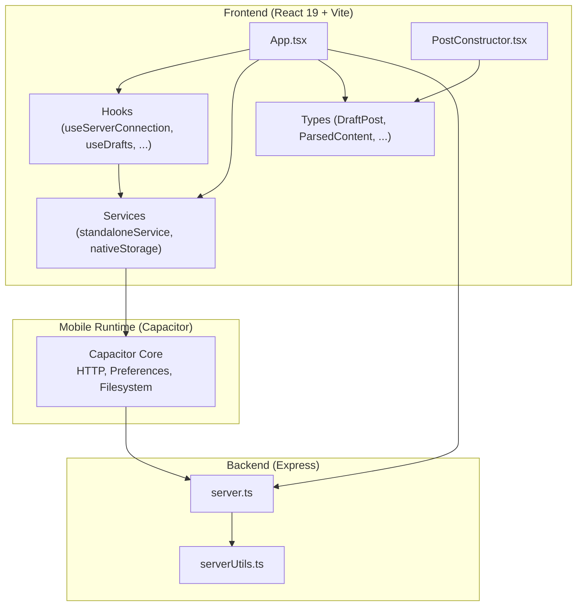
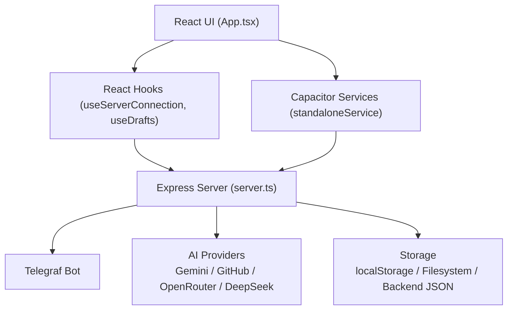
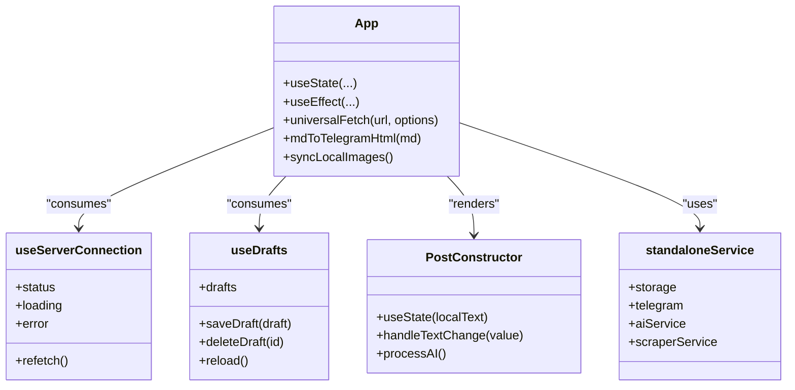
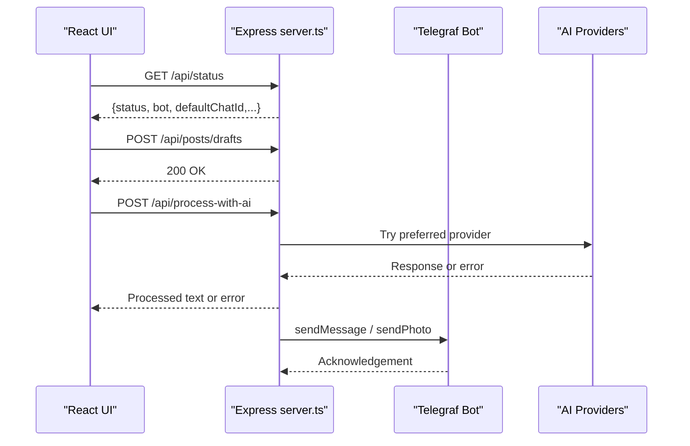
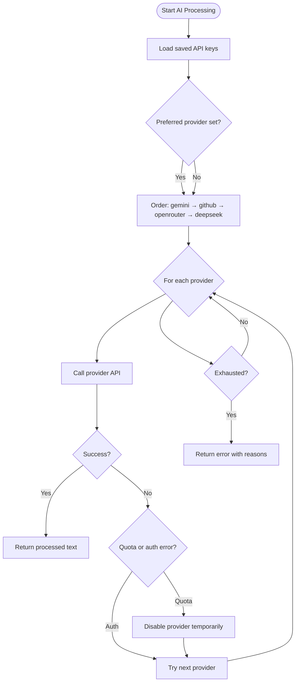
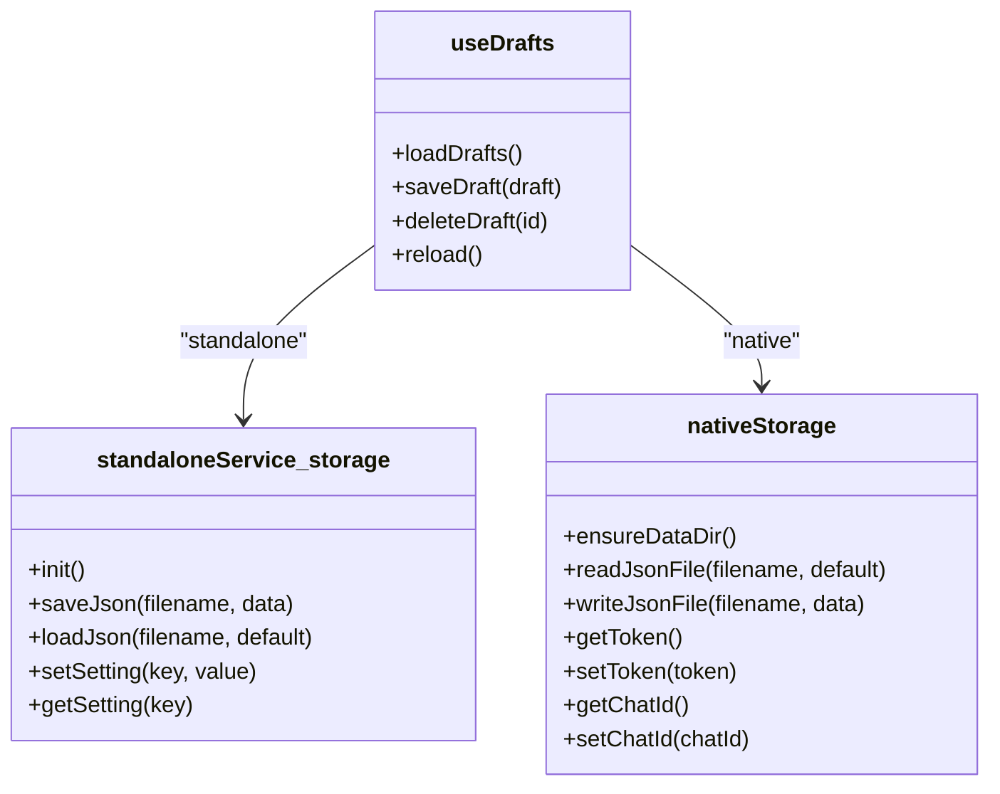
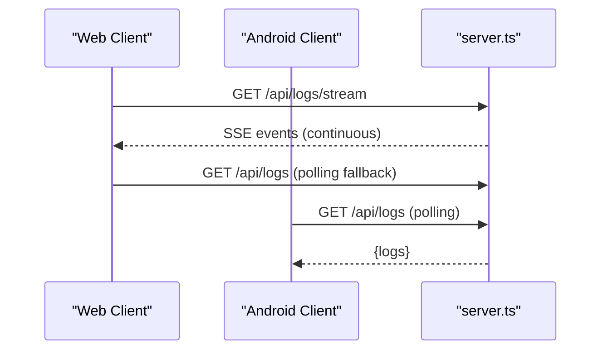
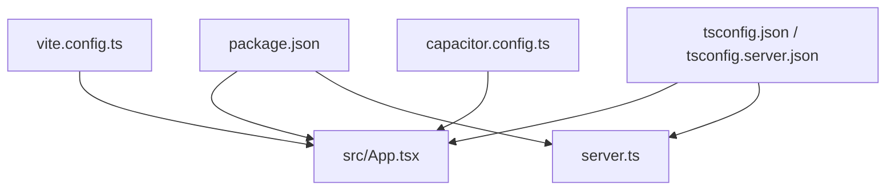

# Architecture and Design

<cite>
**Referenced Files in This Document**
- [package.json](file://package.json)
- [capacitor.config.ts](file://capacitor.config.ts)
- [vite.config.ts](file://vite.config.ts)
- [tsconfig.json](file://tsconfig.json)
- [tsconfig.server.json](file://tsconfig.server.json)
- [server.ts](file://server.ts)
- [src/main.tsx](file://src/main.tsx)
- [src/App.tsx](file://src/App.tsx)
- [src/components/PostConstructor.tsx](file://src/components/PostConstructor.tsx)
- [src/services/standaloneService.ts](file://src/services/standaloneService.ts)
- [src/services/nativeStorage.ts](file://src/services/nativeStorage.ts)
- [src/hooks/useServerConnection.ts](file://src/hooks/useServerConnection.ts)
- [src/hooks/useDrafts.ts](file://src/hooks/useDrafts.ts)
- [src/types.ts](file://src/types.ts)
- [src/serverUtils.ts](file://src/serverUtils.ts)
- [README.md](file://README.md)
</cite>

## Table of Contents
1. [Introduction](#introduction)
2. [Project Structure](#project-structure)
3. [Core Components](#core-components)
4. [Architecture Overview](#architecture-overview)
5. [Detailed Component Analysis](#detailed-component-analysis)
6. [Dependency Analysis](#dependency-analysis)
7. [Performance Considerations](#performance-considerations)
8. [Troubleshooting Guide](#troubleshooting-guide)
9. [Conclusion](#conclusion)
10. [Appendices](#appendices)

## Introduction
This document describes the AI News Bot system architecture, a hybrid full-stack solution integrating a React 19.0.0 frontend built with Vite 6.2.0, an Express 4.21.2 backend, and a Capacitor 6.0.0 mobile runtime. The system supports AI-powered content processing via Telegraf 4.16.3 for Telegram integration and multiple AI providers (Gemini, GitHub, OpenRouter, DeepSeek). It implements MVVM-like component architecture, repository-style data access abstractions, observer-style real-time updates, and a strategy-like selection mechanism for AI providers. Cross-cutting concerns include security, logging, and platform-specific networking.

## Project Structure
The repository follows a layered structure:
- Frontend: React 19 with Vite, organized under src/, with components, hooks, services, and types.
- Backend: Express server (server.ts) hosting APIs, rate limiting, and Telegram bot logic.
- Mobile Runtime: Capacitor configuration and native platform integrations.
- Build and Tooling: Vite config, TypeScript configs, and package scripts.

**Diagram sources**
- [src/App.tsx:168-800](file://src/App.tsx#L168-L800)
- [src/components/PostConstructor.tsx:96-294](file://src/components/PostConstructor.tsx#L96-L294)
- [src/hooks/useServerConnection.ts:15-52](file://src/hooks/useServerConnection.ts#L15-L52)
- [src/hooks/useDrafts.ts:5-88](file://src/hooks/useDrafts.ts#L5-L88)
- [src/services/standaloneService.ts:11-175](file://src/services/standaloneService.ts#L11-L175)
- [src/services/nativeStorage.ts:8-63](file://src/services/nativeStorage.ts#L8-L63)
- [src/types.ts:1-48](file://src/types.ts#L1-L48)
- [server.ts:1-1454](file://server.ts#L1-L1454)
- [src/serverUtils.ts:1-23](file://src/serverUtils.ts#L1-L23)

**Section sources**
- [package.json:1-70](file://package.json#L1-L70)
- [vite.config.ts:1-28](file://vite.config.ts#L1-L28)
- [tsconfig.json:1-27](file://tsconfig.json#L1-L27)
- [tsconfig.server.json:1-15](file://tsconfig.server.json#L1-L15)
- [capacitor.config.ts:1-26](file://capacitor.config.ts#L1-L26)

## Core Components
- React 19 + Vite frontend:
  - Root rendering and application shell.
  - Component composition with MVVM-like separation of view-model concerns (hooks and services).
- Capacitor runtime:
  - Native platform access for HTTP, preferences, filesystem, and browser.
- Express backend:
  - REST endpoints for configuration, posts, images, logs, and bot controls.
  - Rate limiting, CORS, and structured logging.
  - Telegram bot integration via Telegraf with health monitoring and retries.
- AI processing:
  - Strategy-like provider selection and fallback across Gemini, GitHub, OpenRouter, and DeepSeek.
- Data access:
  - Repository-style wrappers for persistent storage (localStorage, Capacitor Filesystem, and backend JSON files).

**Section sources**
- [src/main.tsx:1-11](file://src/main.tsx#L1-L11)
- [src/App.tsx:168-800](file://src/App.tsx#L168-L800)
- [server.ts:1-1454](file://server.ts#L1-L1454)
- [src/services/standaloneService.ts:11-175](file://src/services/standaloneService.ts#L11-L175)
- [src/services/nativeStorage.ts:8-63](file://src/services/nativeStorage.ts#L8-L63)

## Architecture Overview
The system employs a hybrid architecture:
- Web-based React SPA served by Vite, packaged for Capacitor distribution.
- Capacitor bridges web APIs to native capabilities (HTTP, preferences, filesystem).
- Express backend exposes REST APIs consumed by the frontend and hosts a Telegram bot.
- AI provider strategy enables resilient content processing with fallbacks.
- Real-time updates via Server-Sent Events (SSE) on web and polling on native.

**Diagram sources**
- [src/App.tsx:168-800](file://src/App.tsx#L168-L800)
- [src/hooks/useServerConnection.ts:15-52](file://src/hooks/useServerConnection.ts#L15-L52)
- [src/hooks/useDrafts.ts:5-88](file://src/hooks/useDrafts.ts#L5-L88)
- [src/services/standaloneService.ts:11-175](file://src/services/standaloneService.ts#L11-L175)
- [server.ts:1-1454](file://server.ts#L1-1454)

## Detailed Component Analysis

### Frontend Application (MVVM-like)
- MVVM-like separation:
  - View: React components (App.tsx, PostConstructor.tsx).
  - ViewModel: Hooks encapsulate state and side effects (useServerConnection, useDrafts).
  - Model: Types and services for data contracts and persistence.
- Component relationships:
  - App orchestrates navigation, settings, logs, and lists.
  - PostConstructor composes editing, image selection, and button templates.
  - Hooks abstract server connectivity and data persistence.
- Data flow:
  - Universal fetch abstraction handles native vs web HTTP.
  - SSE polling for logs on web; native polling on Android.
  - Drag-and-drop reordering of images via @dnd-kit.

**Diagram sources**
- [src/App.tsx:168-800](file://src/App.tsx#L168-L800)
- [src/components/PostConstructor.tsx:96-294](file://src/components/PostConstructor.tsx#L96-L294)
- [src/hooks/useServerConnection.ts:15-52](file://src/hooks/useServerConnection.ts#L15-L52)
- [src/hooks/useDrafts.ts:5-88](file://src/hooks/useDrafts.ts#L5-L88)
- [src/services/standaloneService.ts:11-175](file://src/services/standaloneService.ts#L11-L175)

**Section sources**
- [src/App.tsx:168-800](file://src/App.tsx#L168-L800)
- [src/components/PostConstructor.tsx:96-294](file://src/components/PostConstructor.tsx#L96-L294)
- [src/hooks/useServerConnection.ts:15-52](file://src/hooks/useServerConnection.ts#L15-L52)
- [src/hooks/useDrafts.ts:5-88](file://src/hooks/useDrafts.ts#L5-L88)
- [src/services/standaloneService.ts:11-175](file://src/services/standaloneService.ts#L11-L175)

### Backend Server (Express)
- Responsibilities:
  - Expose REST endpoints for configuration, posts, images, logs, and bot controls.
  - Rate limiting and CORS for security.
  - Telegram bot lifecycle management with health checks and restarts.
  - AI provider orchestration with fallbacks and error handling.
  - Structured logging to file.
- Data access:
  - Repository-style wrappers around JSON files and Capacitor storage.
- Security:
  - Environment validation and rate limiting.
  - Sanitized HTML for Telegram output.

**Diagram sources**
- [server.ts:1-1454](file://server.ts#L1-L1454)
- [src/hooks/useServerConnection.ts:15-52](file://src/hooks/useServerConnection.ts#L15-L52)
- [src/hooks/useDrafts.ts:5-88](file://src/hooks/useDrafts.ts#L5-L88)

**Section sources**
- [server.ts:1-1454](file://server.ts#L1-L1454)
- [src/serverUtils.ts:1-23](file://src/serverUtils.ts#L1-L23)

### AI Provider Strategy
- Strategy-like selection:
  - Preferred provider from saved keys or environment.
  - Fallback chain across Gemini, GitHub, OpenRouter, DeepSeek.
  - Per-provider retry logic and quota-aware disabling.
- Safety and sanitization:
  - Prompt engineering tailored for Russian translation and Telegram formatting.
  - HTML sanitization for Telegram-safe output.

**Diagram sources**
- [server.ts:412-645](file://server.ts#L412-L645)

**Section sources**
- [server.ts:412-645](file://server.ts#L412-L645)

### Data Access Patterns (Repository-like)
- Frontend:
  - localStorage fallback for web; Capacitor Preferences/Filesystem for native.
- Backend:
  - JSON files for drafts, published posts, templates, image path, and chat presets.
- Hooks:
  - useDrafts abstracts CRUD operations across standalone and server modes.

**Diagram sources**
- [src/services/nativeStorage.ts:8-63](file://src/services/nativeStorage.ts#L8-L63)
- [src/services/standaloneService.ts:11-72](file://src/services/standaloneService.ts#L11-L72)
- [src/hooks/useDrafts.ts:5-88](file://src/hooks/useDrafts.ts#L5-L88)

**Section sources**
- [src/services/nativeStorage.ts:8-63](file://src/services/nativeStorage.ts#L8-L63)
- [src/services/standaloneService.ts:11-72](file://src/services/standaloneService.ts#L11-L72)
- [src/hooks/useDrafts.ts:5-88](file://src/hooks/useDrafts.ts#L5-L88)

### Real-Time Updates (Observer Pattern)
- SSE on web:
  - Server streams logs via /api/logs/stream.
  - Client reconnects automatically on disconnect.
- Polling on native:
  - Client polls /api/logs on Android due to WebView limitations.
- Bot status:
  - Periodic health checks and status updates.

**Diagram sources**
- [src/App.tsx:651-698](file://src/App.tsx#L651-L698)
- [server.ts:342-352](file://server.ts#L342-L352)

**Section sources**
- [src/App.tsx:651-698](file://src/App.tsx#L651-L698)
- [server.ts:342-352](file://server.ts#L342-L352)

## Dependency Analysis
- Technology stack:
  - Frontend: React 19.0.0, Vite 6.2.0, TailwindCSS, Motion, Telegraf, Axios, Cheerio, UUID.
  - Backend: Express 4.21.2, Telegraf 4.16.3, rate-limit, dotenv, cheerio, marked, sharp, uuid.
  - Mobile: Capacitor 6.0.0 (Android), including Browser, FileSystem, Preferences, Keyboard.
- Build and tooling:
  - Vite config defines aliases, plugins, and environment injection.
  - TypeScript configs for client and server.

**Diagram sources**
- [package.json:1-70](file://package.json#L1-L70)
- [vite.config.ts:1-28](file://vite.config.ts#L1-L28)
- [tsconfig.json:1-27](file://tsconfig.json#L1-L27)
- [tsconfig.server.json:1-15](file://tsconfig.server.json#L1-L15)
- [capacitor.config.ts:1-26](file://capacitor.config.ts#L1-L26)

**Section sources**
- [package.json:1-70](file://package.json#L1-L70)
- [vite.config.ts:1-28](file://vite.config.ts#L1-L28)
- [tsconfig.json:1-27](file://tsconfig.json#L1-L27)
- [tsconfig.server.json:1-15](file://tsconfig.server.json#L1-L15)
- [capacitor.config.ts:1-26](file://capacitor.config.ts#L1-L26)

## Performance Considerations
- Frontend:
  - Use of lightweight Markdown parsing and controlled state updates to minimize re-renders.
  - Debounced auto-save for drafts and image path persistence.
- Backend:
  - Rate limiting to protect resources and manage AI provider quotas.
  - Streaming logs via SSE reduces polling overhead on web.
- Mobile:
  - CapacitorHttp avoids CORS issues and provides timeouts.
  - Polling-based logs on Android as a fallback when SSE is unsupported.

## Troubleshooting Guide
- Missing environment variables:
  - TELEGRAM_BOT_TOKEN and GEMINI_API_KEY are validated early; missing keys disable certain features.
- Bot initialization failures:
  - Health monitor detects 409 conflicts and restarts the bot; logs capture detailed errors.
- Logging:
  - FileLogger writes structured logs to ./logs/app.log for server-side diagnostics.
- Network and timeouts:
  - Frontend universalFetch sets explicit timeouts and distinguishes AbortError from network errors.
- Platform-specific issues:
  - Android WebView lacks EventSource; the app falls back to polling logs.

**Section sources**
- [server.ts:24-33](file://server.ts#L24-L33)
- [server.ts:377-409](file://server.ts#L377-L409)
- [src/serverUtils.ts:1-23](file://src/serverUtils.ts#L1-L23)
- [src/App.tsx:195-251](file://src/App.tsx#L195-L251)
- [src/App.tsx:651-698](file://src/App.tsx#L651-L698)

## Conclusion
The AI News Bot system integrates a modern React 19 + Vite frontend with a robust Express backend and Capacitor mobile runtime. Its architecture emphasizes clear separation of concerns, resilient AI provider selection, and platform-aware networking. The MVVM-like component design, repository-style data access, observer-style real-time updates, and strategy-like AI provider selection collectively deliver a maintainable and extensible system suitable for both development and production deployments.

## Appendices
- Deployment topology:
  - Frontend built with Vite and served statically; packaged via Capacitor for Android.
  - Backend runs as a Node.js service exposing REST APIs and hosting a Telegram bot.
- Security and logging:
  - Environment validation, rate limiting, and sanitized Telegram output.
  - File-based logging for server-side diagnostics.

**Section sources**
- [README.md:1-25](file://README.md#L1-L25)
- [capacitor.config.ts:1-26](file://capacitor.config.ts#L1-L26)
- [server.ts:1-1454](file://server.ts#L1-L1454)