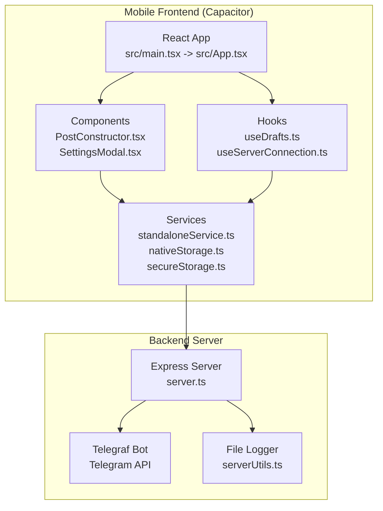
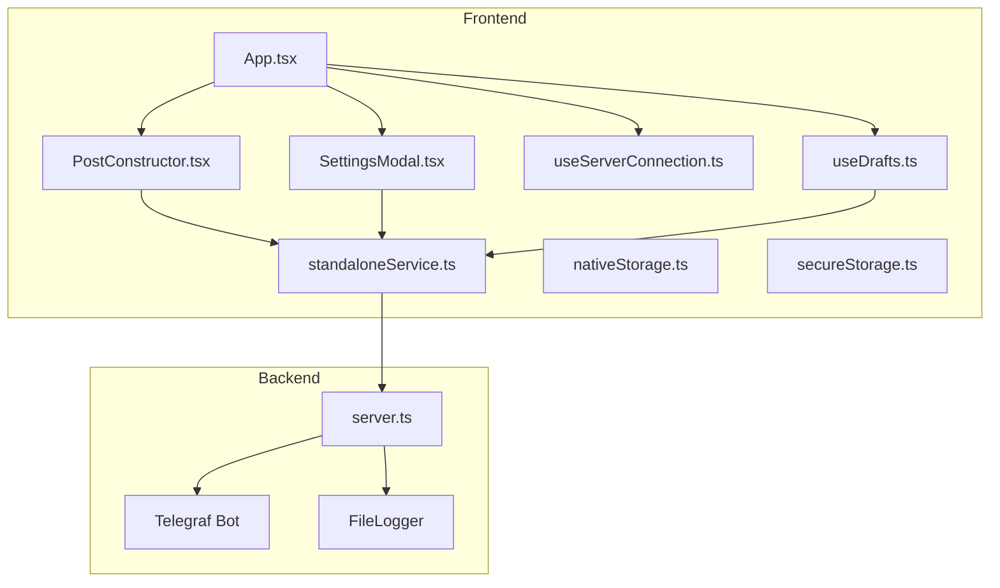
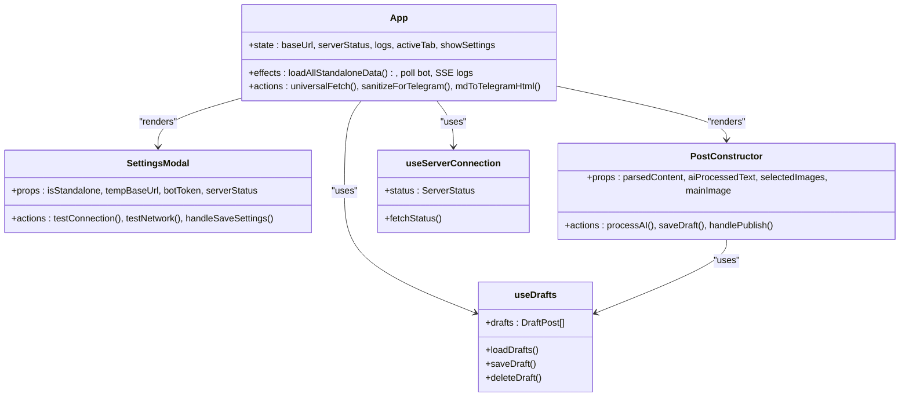
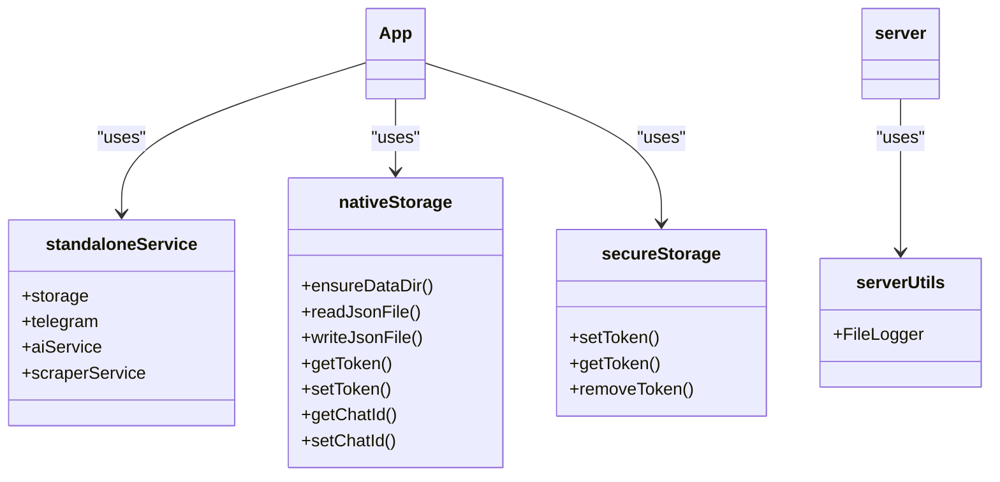
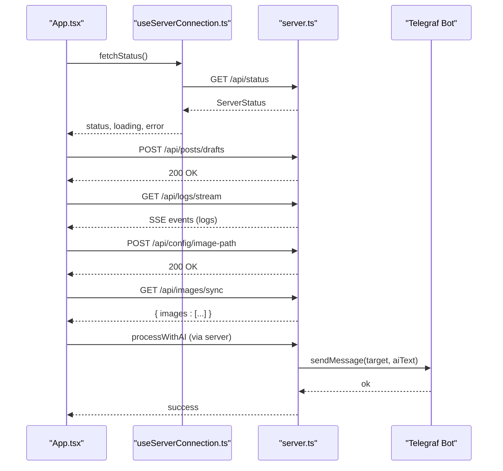
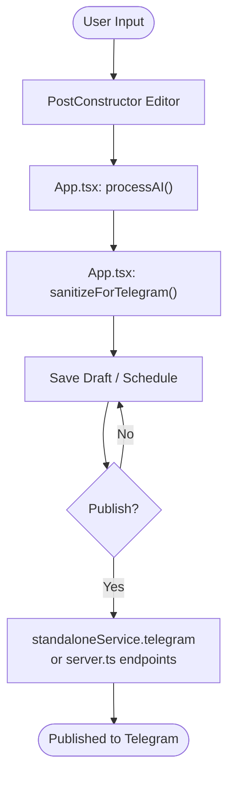
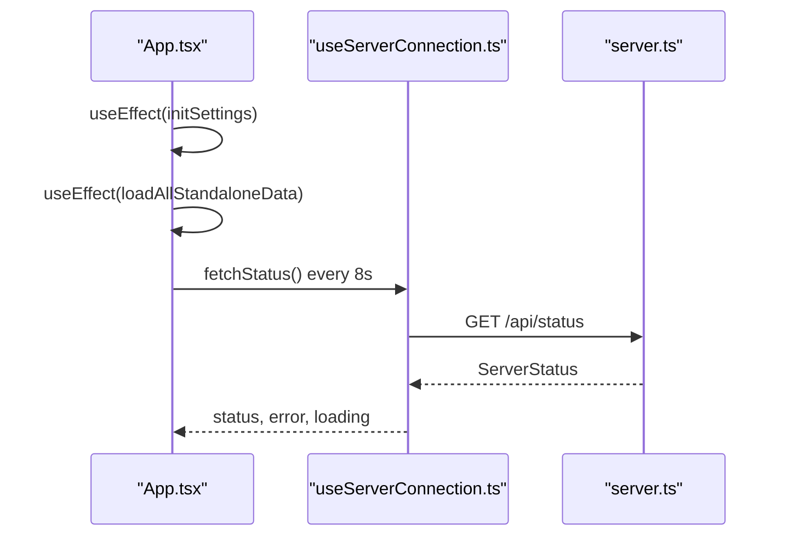
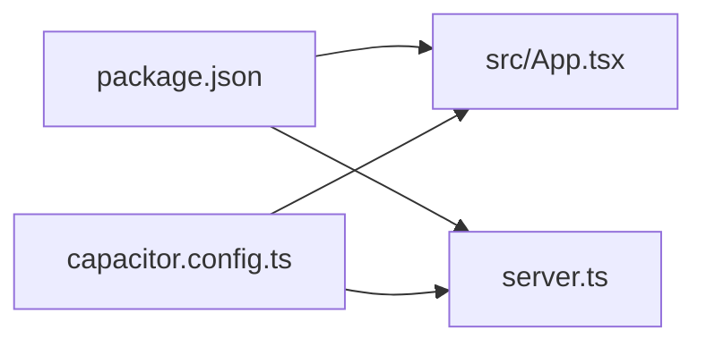

# Component Relationships and Data Flow

<cite>
**Referenced Files in This Document**
- [README.md](file://README.md)
- [capacitor.config.ts](file://capacitor.config.ts)
- [package.json](file://package.json)
- [src/main.tsx](file://src/main.tsx)
- [src/App.tsx](file://src/App.tsx)
- [src/components/PostConstructor.tsx](file://src/components/PostConstructor.tsx)
- [src/components/SettingsModal.tsx](file://src/components/SettingsModal.tsx)
- [src/hooks/useDrafts.ts](file://src/hooks/useDrafts.ts)
- [src/hooks/useServerConnection.ts](file://src/hooks/useServerConnection.ts)
- [src/services/standaloneService.ts](file://src/services/standaloneService.ts)
- [src/services/nativeStorage.ts](file://src/services/nativeStorage.ts)
- [src/services/secureStorage.ts](file://src/services/secureStorage.ts)
- [src/serverUtils.ts](file://src/serverUtils.ts)
- [src/types.ts](file://src/types.ts)
- [server.ts](file://server.ts)
</cite>

## Table of Contents
1. [Introduction](#introduction)
2. [Project Structure](#project-structure)
3. [Core Components](#core-components)
4. [Architecture Overview](#architecture-overview)
5. [Detailed Component Analysis](#detailed-component-analysis)
6. [Dependency Analysis](#dependency-analysis)
7. [Performance Considerations](#performance-considerations)
8. [Troubleshooting Guide](#troubleshooting-guide)
9. [Conclusion](#conclusion)

## Introduction
This document explains the component relationships and data flow patterns in the AI News Bot system. It covers how React components interact with service layers and backend APIs, how user input is transformed through AI processing, and how content is published to Telegram. It also documents state management, event handling, asynchronous operations, and integration points across the frontend, backend, and mobile layers.

## Project Structure
The project combines a React-based frontend packaged as a Capacitor app with a Node.js/Express backend. The frontend runs in a web container on mobile via Capacitor and communicates with either:
- A local/remote server endpoint (when not in standalone mode)
- Native-capable services on the device (when in standalone mode)

**Diagram sources**
- [src/main.tsx:1-11](file://src/main.tsx#L1-L11)
- [src/App.tsx:168-171](file://src/App.tsx#L168-L171)
- [src/components/PostConstructor.tsx:96-294](file://src/components/PostConstructor.tsx#L96-L294)
- [src/components/SettingsModal.tsx:28-107](file://src/components/SettingsModal.tsx#L28-L107)
- [src/hooks/useDrafts.ts:5-88](file://src/hooks/useDrafts.ts#L5-L88)
- [src/hooks/useServerConnection.ts:15-52](file://src/hooks/useServerConnection.ts#L15-L52)
- [src/services/standaloneService.ts:11-175](file://src/services/standaloneService.ts#L11-L175)
- [src/services/nativeStorage.ts:8-63](file://src/services/nativeStorage.ts#L8-L63)
- [src/services/secureStorage.ts:4-40](file://src/services/secureStorage.ts#L4-L40)
- [src/serverUtils.ts:7-23](file://src/serverUtils.ts#L7-L23)
- [server.ts:37-800](file://server.ts#L37-L800)

**Section sources**
- [README.md:1-25](file://README.md#L1-L25)
- [capacitor.config.ts:3-26](file://capacitor.config.ts#L3-L26)
- [package.json:19-56](file://package.json#L19-L56)

## Core Components
- React Application Root: Initializes the React app and mounts the main App component.
- App Container: Orchestrates state, platform detection, universal HTTP transport, and integrations with hooks and services.
- PostConstructor: Manages post composition, AI processing trigger, image selection, and publish actions.
- SettingsModal: Controls standalone/server mode, base URL, bot token, and connection testing.
- Hooks: Encapsulate data fetching and persistence for drafts, server status, and image sync.
- Services: Provide native storage, secure token storage, Telegram API calls, and AI processing helpers.
- Backend Server: Exposes REST endpoints, manages Telegraf bot lifecycle, and handles AI translation.

**Section sources**
- [src/main.tsx:6-10](file://src/main.tsx#L6-L10)
- [src/App.tsx:168-171](file://src/App.tsx#L168-L171)
- [src/components/PostConstructor.tsx:96-294](file://src/components/PostConstructor.tsx#L96-L294)
- [src/components/SettingsModal.tsx:28-107](file://src/components/SettingsModal.tsx#L28-L107)
- [src/hooks/useDrafts.ts:5-88](file://src/hooks/useDrafts.ts#L5-L88)
- [src/hooks/useServerConnection.ts:15-52](file://src/hooks/useServerConnection.ts#L15-L52)
- [src/services/standaloneService.ts:11-175](file://src/services/standaloneService.ts#L11-L175)
- [src/services/nativeStorage.ts:8-63](file://src/services/nativeStorage.ts#L8-L63)
- [src/services/secureStorage.ts:4-40](file://src/services/secureStorage.ts#L4-L40)
- [server.ts:37-800](file://server.ts#L37-L800)

## Architecture Overview
The system supports two operational modes:
- Standalone Mode (mobile): Uses native Capacitor APIs for filesystem and preferences, direct Telegram API calls, and local storage for drafts and settings.
- Server Mode (web/test): Routes requests through a backend Express server, which acts as a proxy and orchestrates Telegraf bot operations.

**Diagram sources**
- [src/App.tsx:168-171](file://src/App.tsx#L168-L171)
- [src/components/PostConstructor.tsx:96-294](file://src/components/PostConstructor.tsx#L96-L294)
- [src/components/SettingsModal.tsx:28-107](file://src/components/SettingsModal.tsx#L28-L107)
- [src/hooks/useServerConnection.ts:15-52](file://src/hooks/useServerConnection.ts#L15-L52)
- [src/hooks/useDrafts.ts:5-88](file://src/hooks/useDrafts.ts#L5-L88)
- [src/services/standaloneService.ts:11-175](file://src/services/standaloneService.ts#L11-L175)
- [src/services/nativeStorage.ts:8-63](file://src/services/nativeStorage.ts#L8-L63)
- [src/services/secureStorage.ts:4-40](file://src/services/secureStorage.ts#L4-L40)
- [server.ts:37-800](file://server.ts#L37-L800)

## Detailed Component Analysis

### React Component Hierarchy and Cross-Component Communication
- App.tsx composes SettingsModal and PostConstructor, manages shared state, and delegates data loading to hooks.
- PostConstructor coordinates AI processing, image selection, and publishing actions.
- SettingsModal toggles standalone/server mode and validates connectivity.
- Hooks encapsulate data access patterns and expose CRUD-like operations for drafts and server status.

**Diagram sources**
- [src/App.tsx:168-171](file://src/App.tsx#L168-L171)
- [src/components/SettingsModal.tsx:28-107](file://src/components/SettingsModal.tsx#L28-L107)
- [src/components/PostConstructor.tsx:96-294](file://src/components/PostConstructor.tsx#L96-L294)
- [src/hooks/useServerConnection.ts:15-52](file://src/hooks/useServerConnection.ts#L15-L52)
- [src/hooks/useDrafts.ts:5-88](file://src/hooks/useDrafts.ts#L5-L88)

**Section sources**
- [src/App.tsx:168-171](file://src/App.tsx#L168-L171)
- [src/components/PostConstructor.tsx:96-294](file://src/components/PostConstructor.tsx#L96-L294)
- [src/components/SettingsModal.tsx:28-107](file://src/components/SettingsModal.tsx#L28-L107)
- [src/hooks/useServerConnection.ts:15-52](file://src/hooks/useServerConnection.ts#L15-L52)
- [src/hooks/useDrafts.ts:5-88](file://src/hooks/useDrafts.ts#L5-L88)

### Service Layer Interactions
- standaloneService.ts provides:
  - storage: file-based persistence for drafts/templates/published posts and settings.
  - telegram: unified Telegram API calls (getMe, sendMessage, sendPhoto, sendMediaGroup, getUpdates).
  - aiService: Gemini-based AI processing wrapper.
  - scraperService: URL fetching and basic content extraction.
- nativeStorage.ts and secureStorage.ts abstract Capacitor Preferences and filesystem for persistent settings and tokens.
- serverUtils.ts offers a simple file logger for backend diagnostics.

**Diagram sources**
- [src/services/standaloneService.ts:11-175](file://src/services/standaloneService.ts#L11-L175)
- [src/services/nativeStorage.ts:8-63](file://src/services/nativeStorage.ts#L8-L63)
- [src/services/secureStorage.ts:4-40](file://src/services/secureStorage.ts#L4-L40)
- [src/serverUtils.ts:7-23](file://src/serverUtils.ts#L7-L23)
- [server.ts:19-23](file://server.ts#L19-L23)

**Section sources**
- [src/services/standaloneService.ts:11-175](file://src/services/standaloneService.ts#L11-L175)
- [src/services/nativeStorage.ts:8-63](file://src/services/nativeStorage.ts#L8-L63)
- [src/services/secureStorage.ts:4-40](file://src/services/secureStorage.ts#L4-L40)
- [src/serverUtils.ts:7-23](file://src/serverUtils.ts#L7-L23)

### Backend API Communications
- server.ts exposes endpoints for:
  - Status and configuration queries.
  - Image synchronization and path management.
  - Drafts CRUD operations.
  - Logs streaming via Server-Sent Events (SSE) and polling fallback.
  - AI processing pipeline integrating multiple providers with fallbacks.
  - Telegraf bot lifecycle management (init, stop, health checks, polling).
- It persists data to local files and logs via FileLogger.

**Diagram sources**
- [src/hooks/useServerConnection.ts:20-42](file://src/hooks/useServerConnection.ts#L20-L42)
- [server.ts:342-352](file://server.ts#L342-L352)
- [server.ts:412-645](file://server.ts#L412-L645)
- [server.ts:648-671](file://server.ts#L648-L671)

**Section sources**
- [server.ts:342-352](file://server.ts#L342-L352)
- [server.ts:412-645](file://server.ts#L412-L645)
- [server.ts:648-671](file://server.ts#L648-L671)

### Data Flow: From User Input to Telegram Publication
- User input enters via PostConstructor’s editor and AI processing trigger.
- App.tsx orchestrates:
  - Sanitization and conversion of Markdown to Telegram-compatible HTML.
  - Draft saving and scheduling.
  - Publishing to Telegram via standaloneService.telegram or server.ts endpoints.
- In standalone mode, App.tsx polls Telegram updates and routes messages to handlers.

**Diagram sources**
- [src/components/PostConstructor.tsx:144-154](file://src/components/PostConstructor.tsx#L144-L154)
- [src/App.tsx:348-373](file://src/App.tsx#L348-L373)
- [src/App.tsx:528-529](file://src/App.tsx#L528-L529)
- [src/services/standaloneService.ts:75-146](file://src/services/standaloneService.ts#L75-L146)
- [server.ts:648-671](file://server.ts#L648-L671)

**Section sources**
- [src/components/PostConstructor.tsx:144-154](file://src/components/PostConstructor.tsx#L144-L154)
- [src/App.tsx:348-373](file://src/App.tsx#L348-L373)
- [src/App.tsx:528-529](file://src/App.tsx#L528-L529)
- [src/services/standaloneService.ts:75-146](file://src/services/standaloneService.ts#L75-L146)
- [server.ts:648-671](file://server.ts#L648-L671)

### State Management and Asynchronous Operations
- App.tsx maintains global state for:
  - Base URL, server status, logs, and UI tabs.
  - Constructor state (parsed content, AI processed text, images, buttons).
  - Lists (drafts, scheduled posts, published posts).
  - Standalone vs server mode and bot token.
- Asynchronous operations include:
  - Universal fetch with platform-aware HTTP transport.
  - SSE logs streaming and polling fallback on native.
  - Periodic server status checks and bot polling in standalone mode.

**Diagram sources**
- [src/App.tsx:176-182](file://src/App.tsx#L176-L182)
- [src/App.tsx:548-571](file://src/App.tsx#L548-L571)
- [src/hooks/useServerConnection.ts:44-48](file://src/hooks/useServerConnection.ts#L44-L48)

**Section sources**
- [src/App.tsx:176-182](file://src/App.tsx#L176-L182)
- [src/App.tsx:548-571](file://src/App.tsx#L548-L571)
- [src/hooks/useServerConnection.ts:44-48](file://src/hooks/useServerConnection.ts#L44-L48)

## Dependency Analysis
- Frontend dependencies include React, Capacitor plugins, Telegraf (for server-side bot), and AI SDKs.
- Backend depends on Express, Telegraf, Cheerio, Axios, and rate limiting middleware.
- Capacitor configuration enables HTTP plugin and Android-specific settings.

**Diagram sources**
- [package.json:19-56](file://package.json#L19-L56)
- [capacitor.config.ts:3-26](file://capacitor.config.ts#L3-L26)
- [server.ts:1-17](file://server.ts#L1-L17)
- [src/App.tsx:1-10](file://src/App.tsx#L1-L10)

**Section sources**
- [package.json:19-56](file://package.json#L19-L56)
- [capacitor.config.ts:3-26](file://capacitor.config.ts#L3-L26)
- [server.ts:1-17](file://server.ts#L1-L17)
- [src/App.tsx:1-10](file://src/App.tsx#L1-L10)

## Performance Considerations
- Rate limiting is applied to API endpoints and AI requests to prevent abuse and manage quotas.
- SSE streaming is used for real-time logs on web; native platforms fall back to polling to avoid unsupported features.
- Image synchronization caps selections and deduplicates entries to keep memory and network usage reasonable.
- Bot polling intervals and health checks balance responsiveness with resource consumption.

[No sources needed since this section provides general guidance]

## Troubleshooting Guide
- Logs:
  - Frontend: App.tsx maintains a rolling log buffer and supports SSE/polling for live logs.
  - Backend: serverUtils.ts writes structured logs to a file for diagnostics.
- Error boundaries:
  - App.tsx includes an ErrorBoundary to gracefully handle runtime errors and offer recovery actions.
- Server connectivity:
  - useServerConnection.ts periodically checks /api/status and surfaces errors to the UI.
- Standalone bot:
  - App.tsx polls Telegram updates and displays online/offline status; conflicts are handled with retries and user feedback.

**Section sources**
- [src/App.tsx:146-166](file://src/App.tsx#L146-L166)
- [src/App.tsx:652-698](file://src/App.tsx#L652-L698)
- [src/serverUtils.ts:7-23](file://src/serverUtils.ts#L7-L23)
- [src/hooks/useServerConnection.ts:20-42](file://src/hooks/useServerConnection.ts#L20-L42)
- [server.ts:377-409](file://server.ts#L377-L409)

## Conclusion
The AI News Bot employs a modular architecture where React components encapsulate UI concerns, hooks manage data access patterns, and services abstract platform-specific capabilities. The backend provides robust REST endpoints, AI processing, and Telegraf bot orchestration. The system supports seamless transitions between standalone and server modes, ensuring reliable data flow from user input to Telegram publication across mobile and web environments.