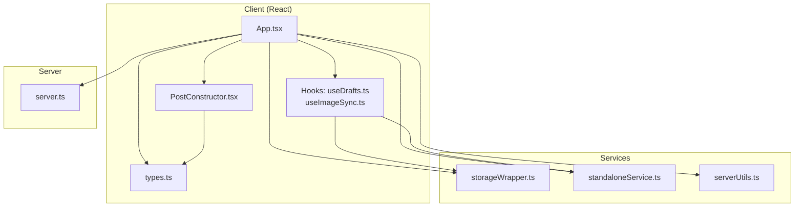
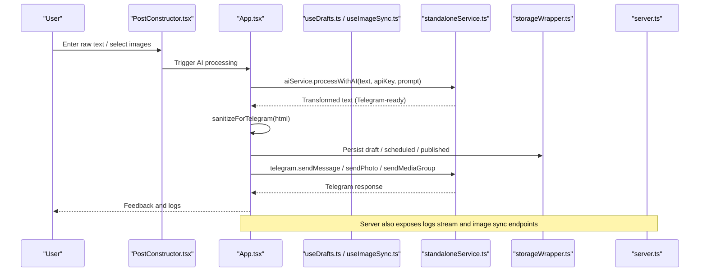
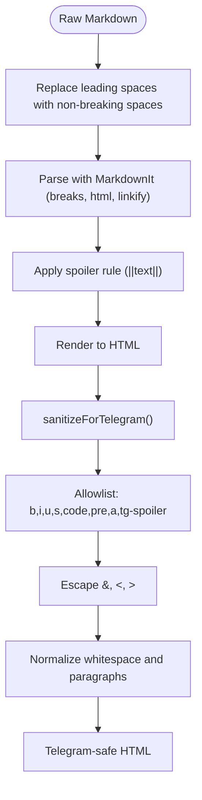
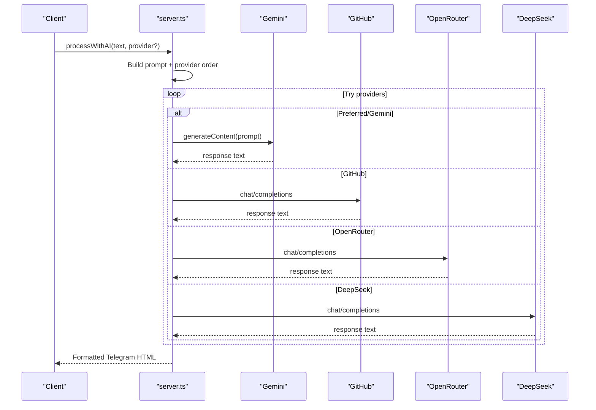
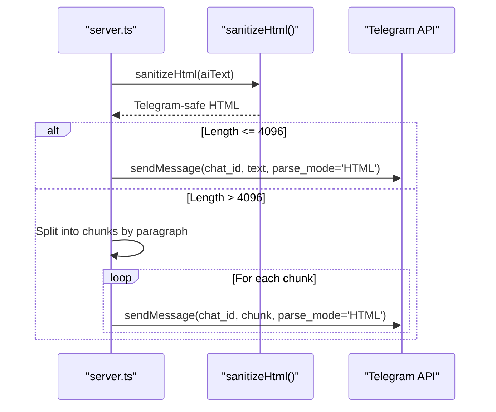
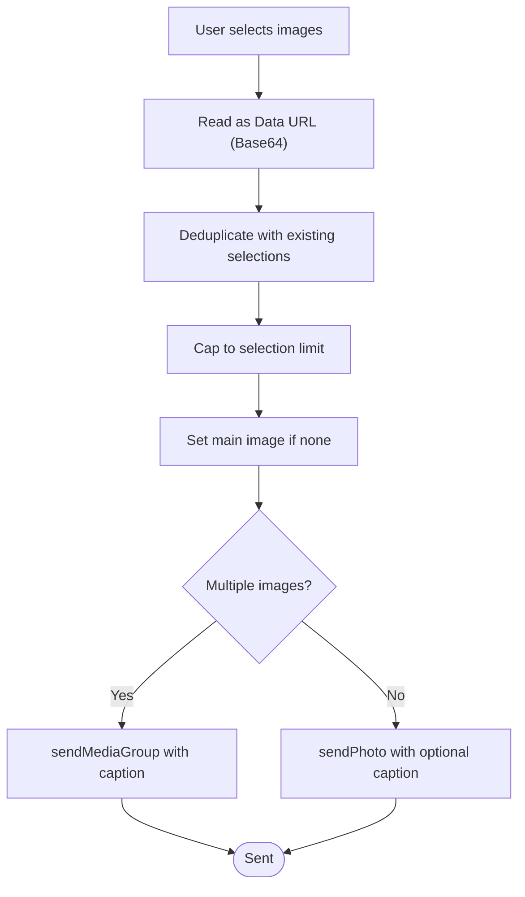
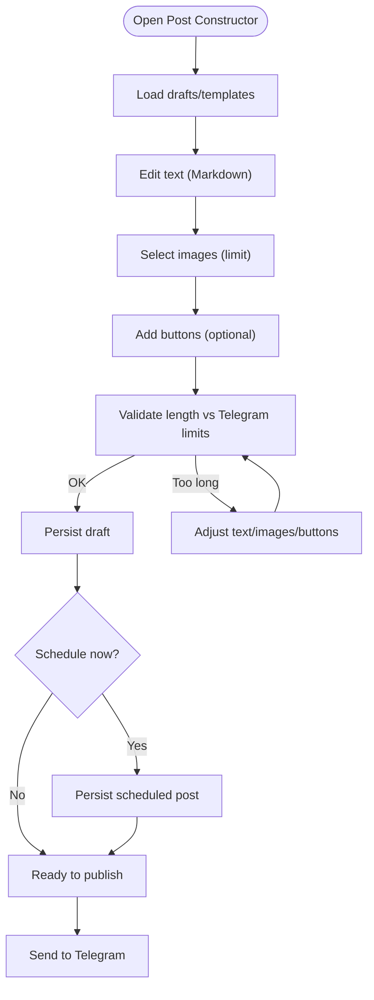
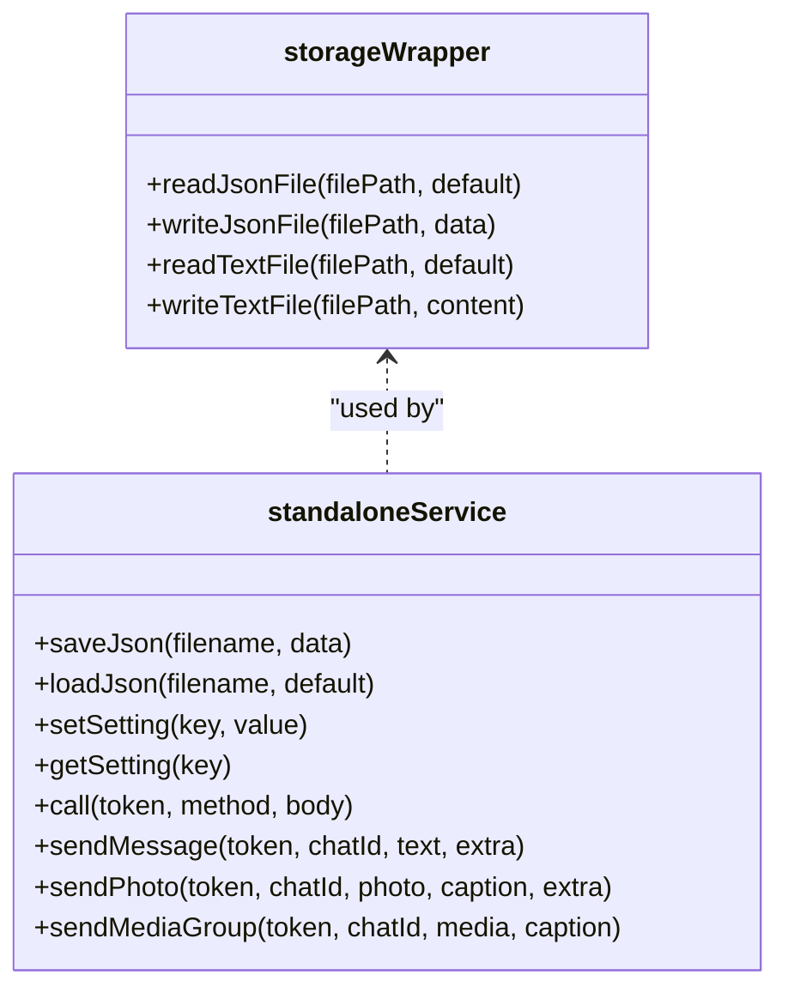
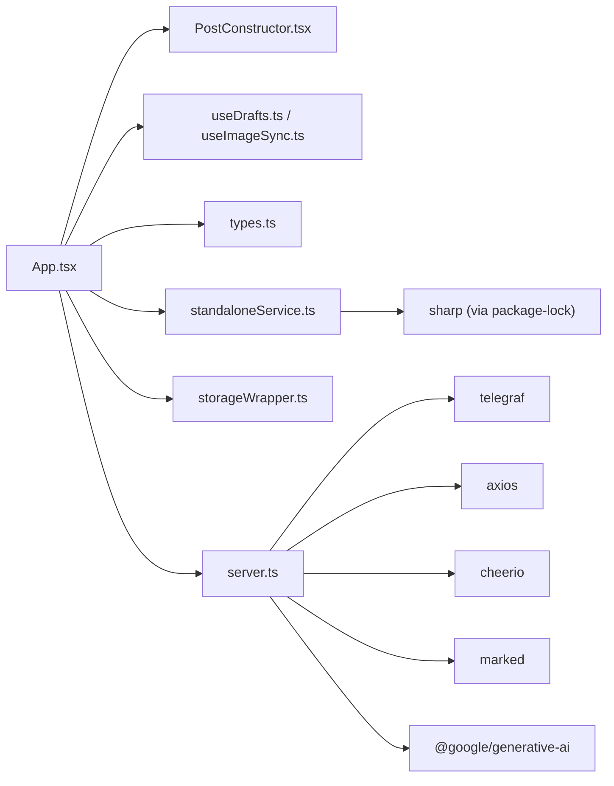

# Data Transformation and Processing Flow

<cite>
**Referenced Files in This Document**
- [README.md](file://README.md)
- [package.json](file://package.json)
- [server.ts](file://server.ts)
- [src/App.tsx](file://src/App.tsx)
- [src/components/PostConstructor.tsx](file://src/components/PostConstructor.tsx)
- [src/hooks/useDrafts.ts](file://src/hooks/useDrafts.ts)
- [src/hooks/useImageSync.ts](file://src/hooks/useImageSync.ts)
- [src/services/storageWrapper.ts](file://src/services/storageWrapper.ts)
- [src/services/standaloneService.ts](file://src/services/standaloneService.ts)
- [src/serverUtils.ts](file://src/serverUtils.ts)
- [src/types.ts](file://src/types.ts)
</cite>

## Table of Contents
1. [Introduction](#introduction)
2. [Project Structure](#project-structure)
3. [Core Components](#core-components)
4. [Architecture Overview](#architecture-overview)
5. [Detailed Component Analysis](#detailed-component-analysis)
6. [Dependency Analysis](#dependency-analysis)
7. [Performance Considerations](#performance-considerations)
8. [Troubleshooting Guide](#troubleshooting-guide)
9. [Conclusion](#conclusion)

## Introduction
This document explains the end-to-end data transformation and processing flows across the system, focusing on:
- Content processing pipelines: markdown parsing, HTML sanitization, and text transformation
- AI content processing: raw input through Gemini/OpenRouter providers to formatted Telegram messages
- Image processing workflows: Base64 encoding, size optimization, and cross-platform compatibility
- Examples of draft creation, content validation, media attachment processing, and publishing preparation
- Serialization, format conversions, error handling, and performance optimization for large content

## Project Structure
The system comprises:
- A backend server exposing REST endpoints and streaming logs
- A React client with a post constructor and hooks for drafts, images, and scheduling
- Services for storage, Telegram API calls, and AI processing
- Utilities for logging and platform-specific filesystem access

**Diagram sources**
- [src/App.tsx:168-170](file://src/App.tsx#L168-L170)
- [src/components/PostConstructor.tsx:1-294](file://src/components/PostConstructor.tsx#L1-L294)
- [src/hooks/useDrafts.ts:1-88](file://src/hooks/useDrafts.ts#L1-L88)
- [src/hooks/useImageSync.ts:1-42](file://src/hooks/useImageSync.ts#L1-L42)
- [src/services/storageWrapper.ts:1-100](file://src/services/storageWrapper.ts#L1-L100)
- [src/services/standaloneService.ts:1-175](file://src/services/standaloneService.ts#L1-L175)
- [src/serverUtils.ts:1-23](file://src/serverUtils.ts#L1-L23)
- [server.ts:1-800](file://server.ts#L1-L800)
- [src/types.ts:1-48](file://src/types.ts#L1-L48)

**Section sources**
- [README.md:1-25](file://README.md#L1-L25)
- [package.json:1-70](file://package.json#L1-L70)

## Core Components
- Backend server orchestrates AI processing, Telegram messaging, HTML sanitization, and persistent storage via wrapper utilities.
- Frontend provides a post constructor with markdown editing, spoiler syntax, image selection, and button templates.
- Hooks manage drafts, scheduled posts, published posts, and image synchronization.
- Services encapsulate Telegram API calls, AI processing, and filesystem access for both web and native platforms.

Key responsibilities:
- AI content processing: raw text -> provider selection -> structured Telegram-ready text
- HTML sanitization: allowlist-based cleaning for Telegram-safe markup
- Image handling: Base64 uploads, filesystem scanning, deduplication, and selection limits
- Draft and publishing lifecycle: creation, validation, scheduling, and persistence

**Section sources**
- [server.ts:411-645](file://server.ts#L411-L645)
- [server.ts:282-340](file://server.ts#L282-L340)
- [src/App.tsx:348-399](file://src/App.tsx#L348-L399)
- [src/App.tsx:401-522](file://src/App.tsx#L401-L522)
- [src/components/PostConstructor.tsx:1-294](file://src/components/PostConstructor.tsx#L1-L294)
- [src/hooks/useDrafts.ts:1-88](file://src/hooks/useDrafts.ts#L1-L88)
- [src/hooks/useImageSync.ts:1-42](file://src/hooks/useImageSync.ts#L1-L42)
- [src/services/standaloneService.ts:75-146](file://src/services/standaloneService.ts#L75-L146)
- [src/services/standaloneService.ts:148-159](file://src/services/standaloneService.ts#L148-L159)

## Architecture Overview
The system supports two modes:
- Standalone mode: client runs locally with Capacitor filesystem and preferences
- Server-backed mode: client communicates with a remote server exposing endpoints for logs, images, and configuration

**Diagram sources**
- [src/components/PostConstructor.tsx:1-294](file://src/components/PostConstructor.tsx#L1-L294)
- [src/App.tsx:348-399](file://src/App.tsx#L348-L399)
- [src/App.tsx:401-522](file://src/App.tsx#L401-L522)
- [src/services/standaloneService.ts:75-146](file://src/services/standaloneService.ts#L75-L146)
- [src/services/standaloneService.ts:148-159](file://src/services/standaloneService.ts#L148-L159)
- [src/services/storageWrapper.ts:1-100](file://src/services/storageWrapper.ts#L1-L100)
- [server.ts:342-352](file://server.ts#L342-L352)

## Detailed Component Analysis

### Markdown Processing and HTML Sanitization
- Markdown parsing: The frontend uses a Markdown parser configured with line breaks, HTML inline, and linkification. A custom spoiler rule wraps text between double pipes into a Telegram-compatible spoiler tag.
- HTML sanitization for Telegram: The sanitizer removes disallowed tags, escapes unsafe characters, preserves allowed tags, and normalizes whitespace. It ensures Telegram’s HTML subset is respected.

**Diagram sources**
- [src/App.tsx:375-399](file://src/App.tsx#L375-L399)
- [src/App.tsx:348-373](file://src/App.tsx#L348-L373)

**Section sources**
- [src/App.tsx:348-399](file://src/App.tsx#L348-L399)

### AI Content Processing Pipeline
- Provider selection: The backend attempts providers in order, falling back across Gemini, GitHub, OpenRouter, and DeepSeek. It respects quotas and retries with backoff.
- Prompt engineering: A localized prompt instructs translation and structuring for Telegram posts.
- Output formatting: Returns a Telegram-ready HTML-formatted string; long outputs are chunked to fit Telegram message size limits.

**Diagram sources**
- [server.ts:411-645](file://server.ts#L411-L645)

**Section sources**
- [server.ts:411-645](file://server.ts#L411-L645)

### Telegram Message Formatting and Delivery
- HTML sanitization: The backend applies a Telegram-safe sanitizer to incoming HTML, removing disallowed tags and normalizing structure.
- Message delivery: Messages are sent with parse_mode=HTML. Long content is split into chunks respecting Telegram’s message size limits.

**Diagram sources**
- [server.ts:282-340](file://server.ts#L282-L340)
- [server.ts:647-671](file://server.ts#L647-L671)

**Section sources**
- [server.ts:282-340](file://server.ts#L282-L340)
- [server.ts:647-671](file://server.ts#L647-L671)

### Image Processing Workflows
- Base64 encoding: Images uploaded via the post constructor are read as Data URLs and stored as Base64 strings.
- Cross-platform compatibility: On native platforms, images are accessed via Capacitor Filesystem; on web, they are handled via FileReader.
- Selection and deduplication: Selected images are deduplicated and capped to a reasonable number. The main image is tracked separately.
- Media groups: When multiple images are present, they are sent as a media group with the first item’s caption.

**Diagram sources**
- [src/components/PostConstructor.tsx:214-226](file://src/components/PostConstructor.tsx#L214-L226)
- [src/App.tsx:401-522](file://src/App.tsx#L401-L522)
- [src/services/standaloneService.ts:131-141](file://src/services/standaloneService.ts#L131-L141)

**Section sources**
- [src/components/PostConstructor.tsx:206-244](file://src/components/PostConstructor.tsx#L206-L244)
- [src/App.tsx:401-522](file://src/App.tsx#L401-L522)
- [src/services/standaloneService.ts:131-141](file://src/services/standaloneService.ts#L131-L141)

### Draft Creation, Validation, and Publishing Preparation
- Draft model: Includes parsed content, selected images, main image, AI-processed text, buttons, status, timestamps, and markdown flag.
- Validation: The UI enforces length constraints against Telegram limits and warns when approaching thresholds.
- Persistence: Drafts are saved to local storage or server endpoints depending on mode; scheduled posts are persisted similarly.
- Publishing: The constructor prepares a final message combining sanitized text and media, then triggers Telegram sending.

**Diagram sources**
- [src/types.ts:13-26](file://src/types.ts#L13-L26)
- [src/hooks/useDrafts.ts:31-54](file://src/hooks/useDrafts.ts#L31-L54)
- [src/App.tsx:348-399](file://src/App.tsx#L348-L399)
- [src/App.tsx:268-281](file://src/App.tsx#L268-L281)

**Section sources**
- [src/types.ts:13-26](file://src/types.ts#L13-L26)
- [src/hooks/useDrafts.ts:1-88](file://src/hooks/useDrafts.ts#L1-L88)
- [src/App.tsx:268-281](file://src/App.tsx#L268-L281)

### Data Serialization and Format Conversions
- JSON serialization: Persistent data (drafts, published, scheduled, templates) is serialized to/from JSON using platform-aware storage wrappers.
- Text conversion: Markdown to HTML conversion and HTML sanitization produce Telegram-ready strings.
- Filesystem abstraction: Capacitor Filesystem is used on native platforms; Node.js filesystem is used on web.

**Diagram sources**
- [src/services/storageWrapper.ts:1-100](file://src/services/storageWrapper.ts#L1-L100)
- [src/services/standaloneService.ts:11-72](file://src/services/standaloneService.ts#L11-L72)
- [src/services/standaloneService.ts:75-146](file://src/services/standaloneService.ts#L75-L146)

**Section sources**
- [src/services/storageWrapper.ts:1-100](file://src/services/storageWrapper.ts#L1-L100)
- [src/services/standaloneService.ts:11-72](file://src/services/standaloneService.ts#L11-L72)
- [src/services/standaloneService.ts:75-146](file://src/services/standaloneService.ts#L75-L146)

## Dependency Analysis
- External libraries:
  - Telegram client: telegraf
  - HTTP: axios, CapacitorHttp
  - Markdown: marked, markdown-it
  - HTML parsing: cheerio
  - AI: @google/generative-ai
  - Image processing: sharp (via package-lock)
- Internal dependencies:
  - Frontend depends on hooks, services, and types
  - Backend depends on storage wrappers, logging, and rate limiting

**Diagram sources**
- [package.json:19-55](file://package.json#L19-L55)
- [src/App.tsx:1-800](file://src/App.tsx#L1-L800)
- [src/components/PostConstructor.tsx:1-294](file://src/components/PostConstructor.tsx#L1-L294)
- [src/hooks/useDrafts.ts:1-88](file://src/hooks/useDrafts.ts#L1-L88)
- [src/hooks/useImageSync.ts:1-42](file://src/hooks/useImageSync.ts#L1-L42)
- [src/services/standaloneService.ts:1-175](file://src/services/standaloneService.ts#L1-L175)
- [src/services/storageWrapper.ts:1-100](file://src/services/storageWrapper.ts#L1-L100)
- [server.ts:1-800](file://server.ts#L1-L800)

**Section sources**
- [package.json:19-55](file://package.json#L19-L55)

## Performance Considerations
- Large content handling:
  - Chunk long AI outputs to respect Telegram message size limits
  - Limit image selection count and deduplicate to reduce payload size
- Rate limiting:
  - Server-side rate limits for API and AI endpoints
- Streaming logs:
  - Server-Sent Events for real-time logs on web; polling fallback on native
- Image optimization:
  - Prefer efficient formats and consider resizing before upload
- Memory:
  - Avoid retaining large Base64 strings unnecessarily; clear references after sending

[No sources needed since this section provides general guidance]

## Troubleshooting Guide
- Missing environment variables:
  - Ensure TELEGRAM_BOT_TOKEN and AI provider keys are configured
- AI provider failures:
  - The backend logs provider errors and falls back across providers; check quotas and retry delays
- HTML sanitization issues:
  - Disallowed tags are stripped; verify allowed tags and escape sequences
- Telegram delivery errors:
  - Inspect returned error messages and adjust content length or media attachments
- Logging:
  - Use server logs and client logs; server exposes a stream endpoint and a polling endpoint

**Section sources**
- [server.ts:24-33](file://server.ts#L24-L33)
- [server.ts:411-645](file://server.ts#L411-L645)
- [server.ts:282-340](file://server.ts#L282-L340)
- [src/serverUtils.ts:1-23](file://src/serverUtils.ts#L1-L23)
- [server.ts:342-352](file://server.ts#L342-L352)
- [src/App.tsx:651-698](file://src/App.tsx#L651-L698)

## Conclusion
The system integrates robust data transformation pipelines spanning markdown processing, AI-driven content generation, and Telegram-safe HTML formatting. It provides flexible image handling across platforms, reliable persistence, and clear pathways for validation and publishing. By leveraging provider fallbacks, sanitization, and chunking strategies, it maintains reliability and performance for large content processing.