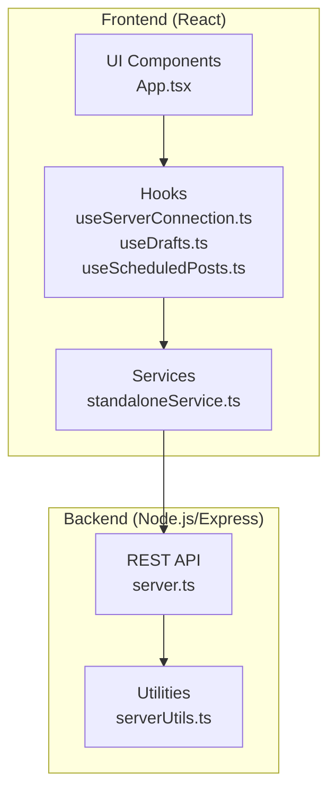
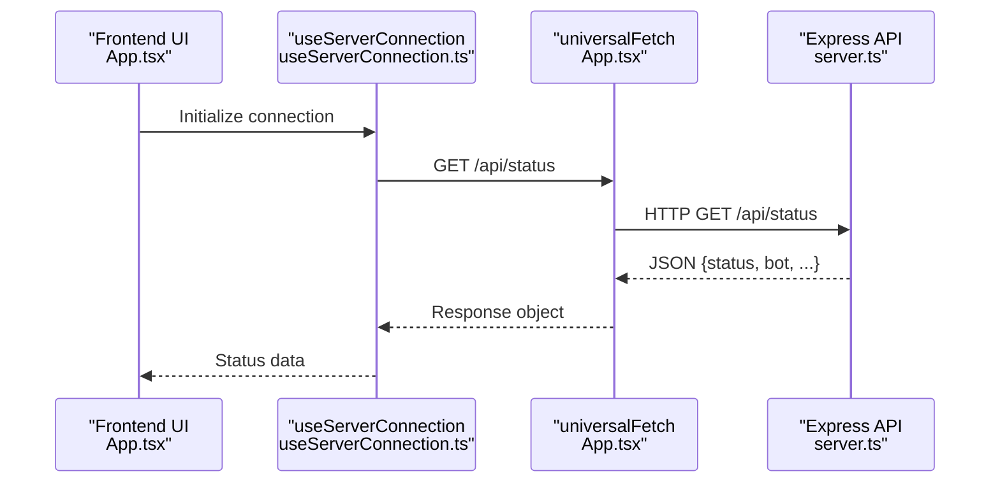
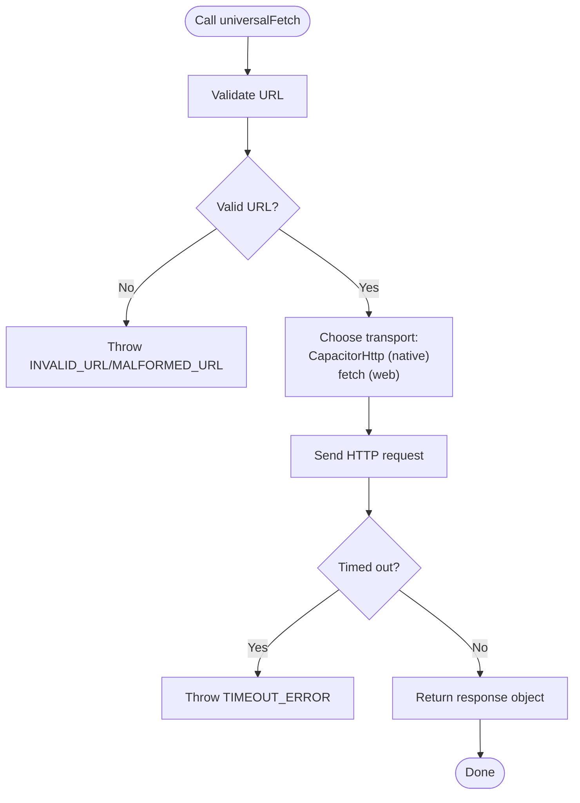
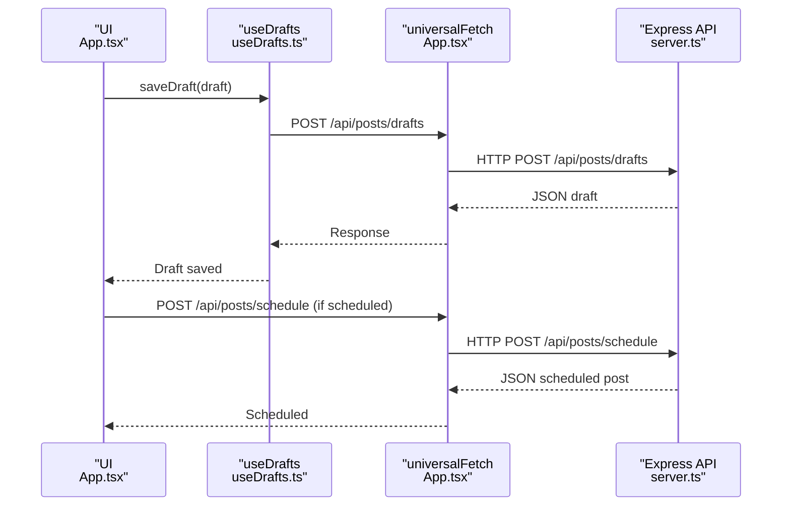
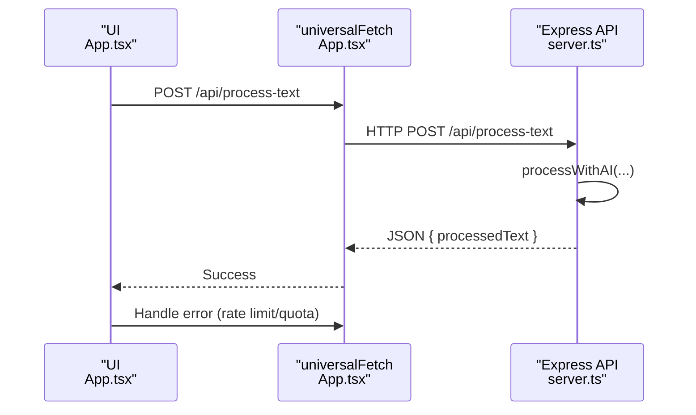
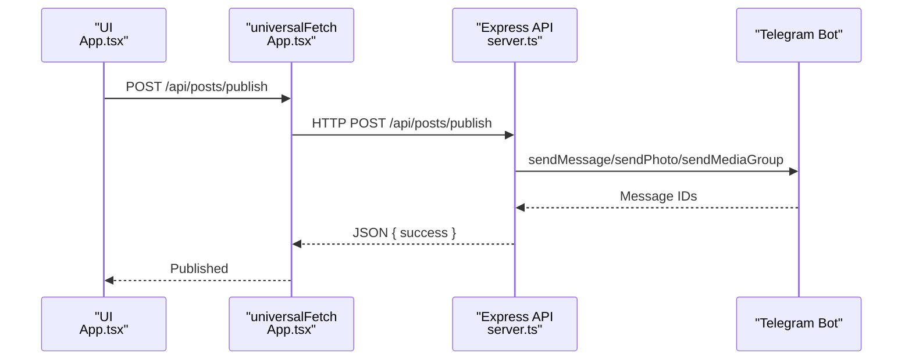
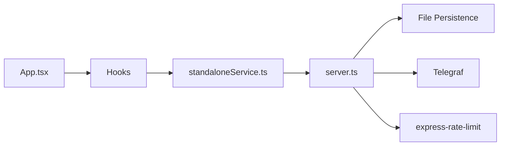

# Frontend-Backend Communication

<cite>
**Referenced Files in This Document**
- [server.ts](file://server.ts)
- [App.tsx](file://src/App.tsx)
- [useServerConnection.ts](file://src/hooks/useServerConnection.ts)
- [useDrafts.ts](file://src/hooks/useDrafts.ts)
- [useScheduledPosts.ts](file://src/hooks/useScheduledPosts.ts)
- [standaloneService.ts](file://src/services/standaloneService.ts)
- [serverUtils.ts](file://src/serverUtils.ts)
- [README.md](file://README.md)
</cite>

## Table of Contents
1. [Introduction](#introduction)
2. [Project Structure](#project-structure)
3. [Core Components](#core-components)
4. [Architecture Overview](#architecture-overview)
5. [Detailed Component Analysis](#detailed-component-analysis)
6. [Dependency Analysis](#dependency-analysis)
7. [Performance Considerations](#performance-considerations)
8. [Troubleshooting Guide](#troubleshooting-guide)
9. [Conclusion](#conclusion)

## Introduction
This document explains frontend-backend communication patterns and API integration for the Telegram bot management application. It covers RESTful API endpoints, request-response cycles, authentication mechanisms, error handling strategies, and real-time communication options. It also documents draft management APIs, AI processing endpoints, log streaming, and scheduled post operations, along with HTTP status codes, error responses, data serialization formats, CORS configuration, and security considerations such as API key validation, rate limiting, and input sanitization.

## Project Structure
The application consists of:
- A Node.js/Express backend exposing REST APIs and managing Telegram bot operations
- A React-based frontend using Capacitor for cross-platform HTTP requests
- Client-side hooks and services for API integration and real-time logging

**Diagram sources**
- [App.tsx:168-1311](file://src/App.tsx#L168-L1311)
- [useServerConnection.ts:15-52](file://src/hooks/useServerConnection.ts#L15-L52)
- [useDrafts.ts:5-88](file://src/hooks/useDrafts.ts#L5-L88)
- [useScheduledPosts.ts:5-38](file://src/hooks/useScheduledPosts.ts#L5-L38)
- [standaloneService.ts:1-175](file://src/services/standaloneService.ts#L1-L175)
- [server.ts:37-1454](file://server.ts#L37-L1454)
- [serverUtils.ts:1-23](file://src/serverUtils.ts#L1-L23)

**Section sources**
- [README.md:1-25](file://README.md#L1-L25)
- [server.ts:37-1454](file://server.ts#L37-L1454)
- [App.tsx:168-1311](file://src/App.tsx#L168-L1311)

## Core Components
- Backend API server with Express, CORS, rate limiting, and file-based persistence
- Frontend HTTP client abstraction supporting native and web environments
- Real-time logging via Server-Sent Events (SSE) and polling fallback
- Drafts, scheduled posts, and published posts management
- AI processing endpoints with provider selection and quotas
- Telegram bot integration for publishing and testing

**Section sources**
- [server.ts:44-72](file://server.ts#L44-L72)
- [server.ts:937-1241](file://server.ts#L937-L1241)
- [App.tsx:194-251](file://src/App.tsx#L194-L251)
- [useServerConnection.ts:15-52](file://src/hooks/useServerConnection.ts#L15-L52)

## Architecture Overview
The frontend communicates with the backend through a unified fetch wrapper that supports both native (CapacitorHttp) and web (fetch) environments. The backend exposes REST endpoints for configuration, content management, AI processing, and Telegram operations. Real-time logging is achieved via SSE on web and polling on native platforms.

**Diagram sources**
- [useServerConnection.ts:20-42](file://src/hooks/useServerConnection.ts#L20-L42)
- [App.tsx:194-251](file://src/App.tsx#L194-L251)
- [server.ts:975-989](file://server.ts#L975-L989)

## Detailed Component Analysis

### REST API Endpoints

#### Authentication and Configuration
- GET /api/status: Returns server status and bot state
- POST /api/config/token: Sets Telegram bot token and initializes bot
- POST /api/config/clear-token: Clears saved token and stops bot
- POST /api/config/chat-id: Sets default chat ID
- GET /api/config/chat-id: Retrieves default chat ID
- GET /api/config/chat-id-presets: Retrieves chat ID presets
- POST /api/config/chat-id-presets: Updates chat ID presets
- POST /api/config/api-key: Saves API key for a provider
- GET /api/config/server-key: Checks availability of server-side API keys
- GET /api/config/status: Returns API key configuration status

HTTP status codes:
- 200 OK: Successful operation
- 400 Bad Request: Missing or invalid parameters
- 500 Internal Server Error: Server-side failure

Error responses:
- JSON object with error field containing error message

Security considerations:
- Rate-limited endpoints protect against abuse
- Input validation for chat ID format and API keys

**Section sources**
- [server.ts:975-1064](file://server.ts#L975-L1064)

#### Draft Management APIs
- GET /api/posts/drafts: Retrieve all drafts
- POST /api/posts/drafts: Create or update a draft
- DELETE /api/posts/drafts/:id: Delete a draft

Frontend integration:
- useDrafts hook manages drafts lifecycle and delegates to universalFetch
- Standalone mode persists drafts locally; server mode uses remote endpoints

**Section sources**
- [server.ts:1157-1202](file://server.ts#L1157-L1202)
- [useDrafts.ts:9-73](file://src/hooks/useDrafts.ts#L9-L73)

#### Scheduled Posts
- GET /api/posts/scheduled: Retrieve scheduled posts
- POST /api/posts/schedule: Schedule a post
- DELETE /api/posts/published/:id: Remove a published post

Frontend integration:
- useScheduledPosts hook loads scheduled posts
- saveDraft triggers scheduling for scheduled posts

**Section sources**
- [server.ts:1204-1231](file://server.ts#L1204-L1231)
- [useScheduledPosts.ts:9-29](file://src/hooks/useScheduledPosts.ts#L9-L29)

#### Published Posts
- GET /api/posts/published: Retrieve published posts
- DELETE /api/posts/published/:id: Remove a published post

Frontend integration:
- Published posts are managed alongside drafts and scheduled posts

**Section sources**
- [server.ts:1209-1217](file://server.ts#L1209-L1217)

#### AI Processing Endpoints
- POST /api/process-text: Process text with AI using preferred provider
- POST /api/process-url: Extract and process text from a URL
- POST /api/test-key: Validate a Gemini API key
- POST /api/test-ai: Test AI processing with a specific provider/key

Frontend integration:
- App.tsx calls /api/process-text and handles errors
- AI processing respects rate limits and provider quotas

**Section sources**
- [server.ts:1150-1183](file://server.ts#L1150-L1183)
- [server.ts:1288-1339](file://server.ts#L1288-L1339)
- [App.tsx:811-864](file://src/App.tsx#L811-L864)

#### Telegram Operations
- POST /api/bot/test-message: Sends a test message to the configured chat
- POST /api/bot/stop: Stops the Telegram bot
- POST /api/bot/restart: Restarts the Telegram bot
- POST /api/test-telegram: Tests Telegram API connectivity

Frontend integration:
- App.tsx uses universalFetch to call these endpoints
- Standalone mode uses standaloneService.telegram for direct API calls

**Section sources**
- [server.ts:1066-1085](file://server.ts#L1066-L1085)
- [server.ts:1369-1377](file://server.ts#L1369-L1377)
- [standaloneService.ts:75-146](file://src/services/standaloneService.ts#L75-L146)

#### Media and Image Management
- POST /api/upload-images: Upload base64-encoded images to a target path
- GET /api/images/sync: Synchronize images from a configured path
- GET /api/images/file/:filename: Serve image files
- POST /api/config/image-path: Set image directory path
- GET /api/config/image-path: Get image directory path
- GET /api/utils/list-dirs: List directories (security-restricted)

Frontend integration:
- App.tsx uploads images and synchronizes galleries
- Standalone mode reads from device storage

**Section sources**
- [server.ts:940-1144](file://server.ts#L940-L1144)
- [App.tsx:401-522](file://src/App.tsx#L401-L522)

#### Logging
- GET /api/logs: Retrieve recent logs
- GET /api/logs/stream: Server-Sent Events endpoint for live logs
- GET /api/ping: Health check endpoint

Frontend integration:
- Web: Uses EventSource for SSE
- Native: Polls /api/logs every 4 seconds
- App.tsx maintains a client-side log buffer

**Section sources**
- [server.ts:342-352](file://server.ts#L342-L352)
- [server.ts:1146-1148](file://server.ts#L1146-L1148)
- [server.ts:938](file://server.ts#L938)
- [App.tsx:651-698](file://src/App.tsx#L651-L698)

### Frontend HTTP Client and Real-Time Communication

#### Universal Fetch Wrapper
The universalFetch function provides a unified HTTP client:
- Validates URLs and rejects malformed or invalid URLs
- Uses CapacitorHttp on native platforms and fetch on web
- Applies timeouts and returns standardized response objects
- Handles JSON parsing and error propagation

**Diagram sources**
- [App.tsx:194-251](file://src/App.tsx#L194-L251)

**Section sources**
- [App.tsx:194-251](file://src/App.tsx#L194-L251)

#### Real-Time Logging (SSE and Polling)
- Web: EventSource connects to /api/logs/stream for live updates
- Native: Polls /api/logs every 4 seconds
- Client maintains a capped log buffer and supports pause/resume

**Section sources**
- [App.tsx:651-698](file://src/App.tsx#L651-L698)
- [server.ts:342-352](file://server.ts#L342-L352)

### API Workflows

#### Draft Creation and Scheduling

**Diagram sources**
- [useDrafts.ts:31-54](file://src/hooks/useDrafts.ts#L31-L54)
- [server.ts:1185-1231](file://server.ts#L1185-L1231)
- [App.tsx:874-903](file://src/App.tsx#L874-L903)

#### AI Text Processing

**Diagram sources**
- [App.tsx:811-864](file://src/App.tsx#L811-L864)
- [server.ts:1150-1155](file://server.ts#L1150-L1155)
- [server.ts:412-645](file://server.ts#L412-L645)

#### Publishing to Telegram

**Diagram sources**
- [App.tsx:905-975](file://src/App.tsx#L905-L975)
- [server.ts:1233-1241](file://server.ts#L1233-L1241)
- [server.ts:806-934](file://server.ts#L806-L934)

## Dependency Analysis
- Frontend depends on:
  - useServerConnection for status polling
  - useDrafts and useScheduledPosts for data management
  - standaloneService for native Telegram operations
  - server.ts for API endpoints
- Backend depends on:
  - storageWrapper for file persistence
  - Telegraf for Telegram integration
  - rateLimit for protection
  - cheerio/marked for content processing

**Diagram sources**
- [App.tsx:168-1311](file://src/App.tsx#L168-L1311)
- [standaloneService.ts:1-175](file://src/services/standaloneService.ts#L1-L175)
- [server.ts:37-1454](file://server.ts#L37-L1454)

**Section sources**
- [server.ts:37-1454](file://server.ts#L37-L1454)
- [App.tsx:168-1311](file://src/App.tsx#L168-L1311)

## Performance Considerations
- Rate limiting:
  - General API limiter (1000 per 15 minutes)
  - AI limiter (50 per minute)
  - Mutation limiter (100 per minute)
- Payload sizes:
  - express.json/express.urlencoded with 50MB limits
- Image handling:
  - Base64 upload with size checks and path traversal prevention
- Real-time logging:
  - SSE on web; polling on native to avoid WebView limitations

[No sources needed since this section provides general guidance]

## Troubleshooting Guide
Common issues and resolutions:
- Invalid or malformed URLs: universalFetch validates URLs and throws descriptive errors
- Timeout errors: native requests use 60s connect/read timeouts; web requests use AbortController
- Rate limit exceeded: API responds with structured error messages; clients should throttle
- Path traversal attempts: backend validates and normalizes file paths
- Telegram connectivity: use /api/test-telegram and /api/bot/test-message for diagnostics
- CORS issues: backend allows dynamic origins with credentials and standard methods

**Section sources**
- [App.tsx:194-251](file://src/App.tsx#L194-L251)
- [server.ts:44-49](file://server.ts#L44-L49)
- [server.ts:1125-1144](file://server.ts#L1125-L1144)
- [server.ts:1369-1377](file://server.ts#L1369-L1377)

## Conclusion
The application implements robust frontend-backend communication with a unified HTTP client, comprehensive REST APIs, and real-time logging. Security is addressed through CORS, rate limiting, input validation, and path traversal protections. The design supports both native and web environments, enabling flexible deployment and operation.