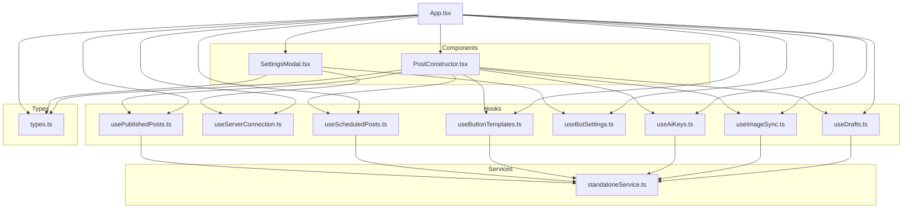
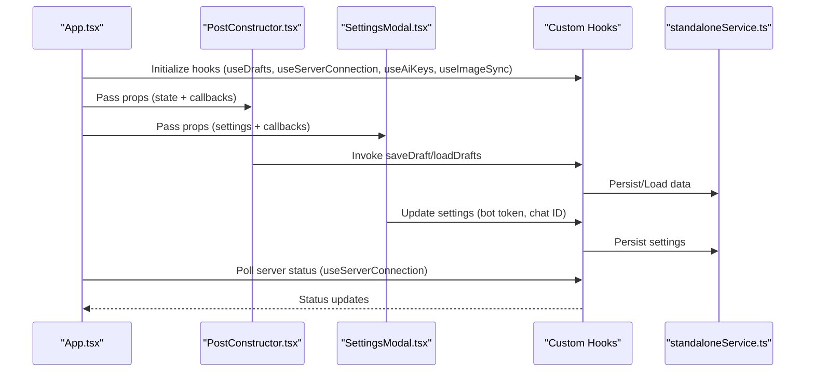
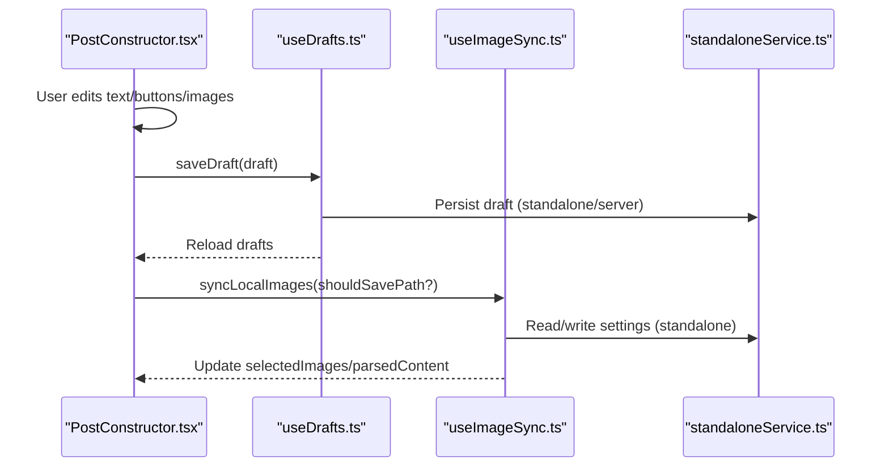
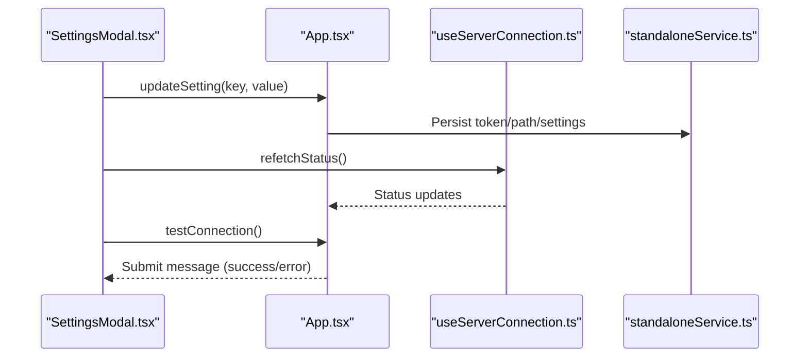
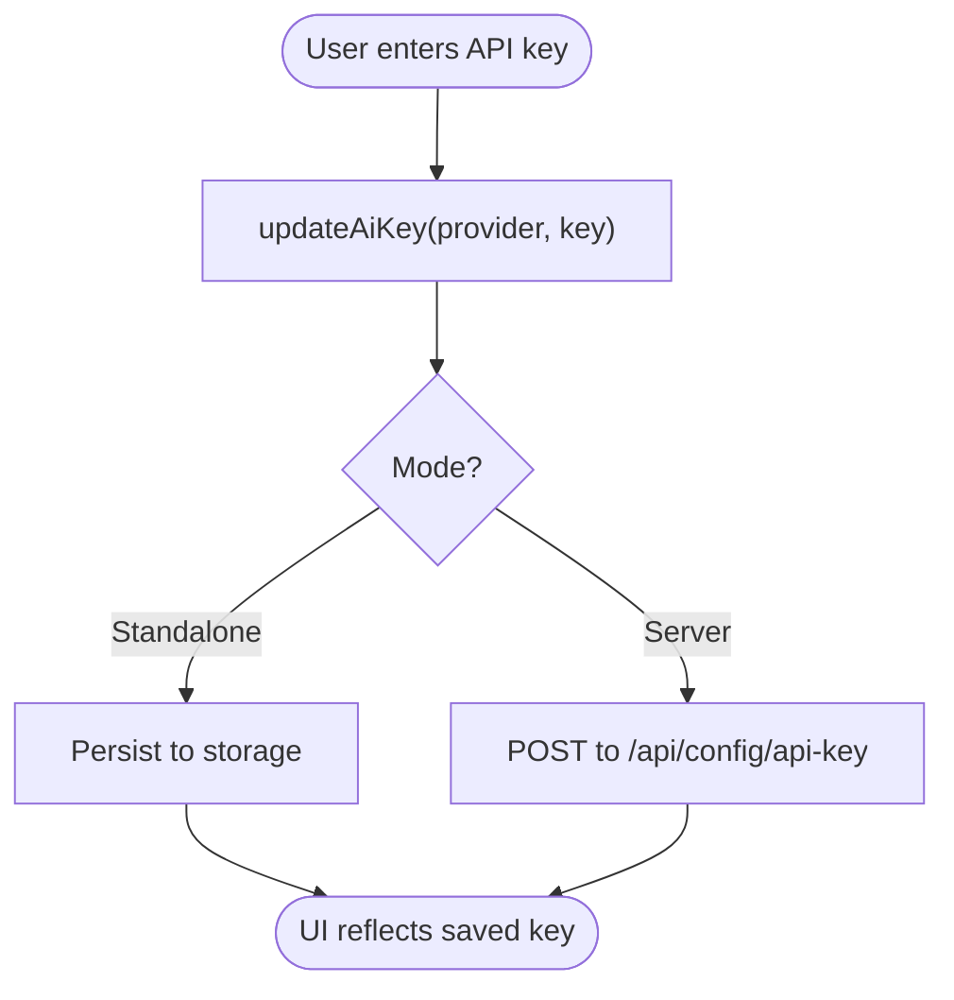
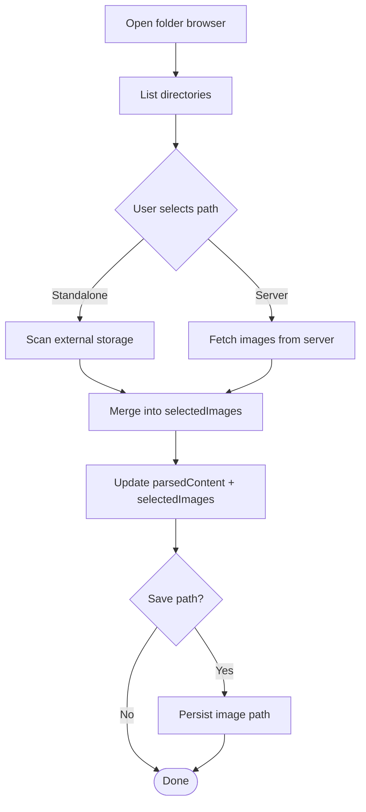
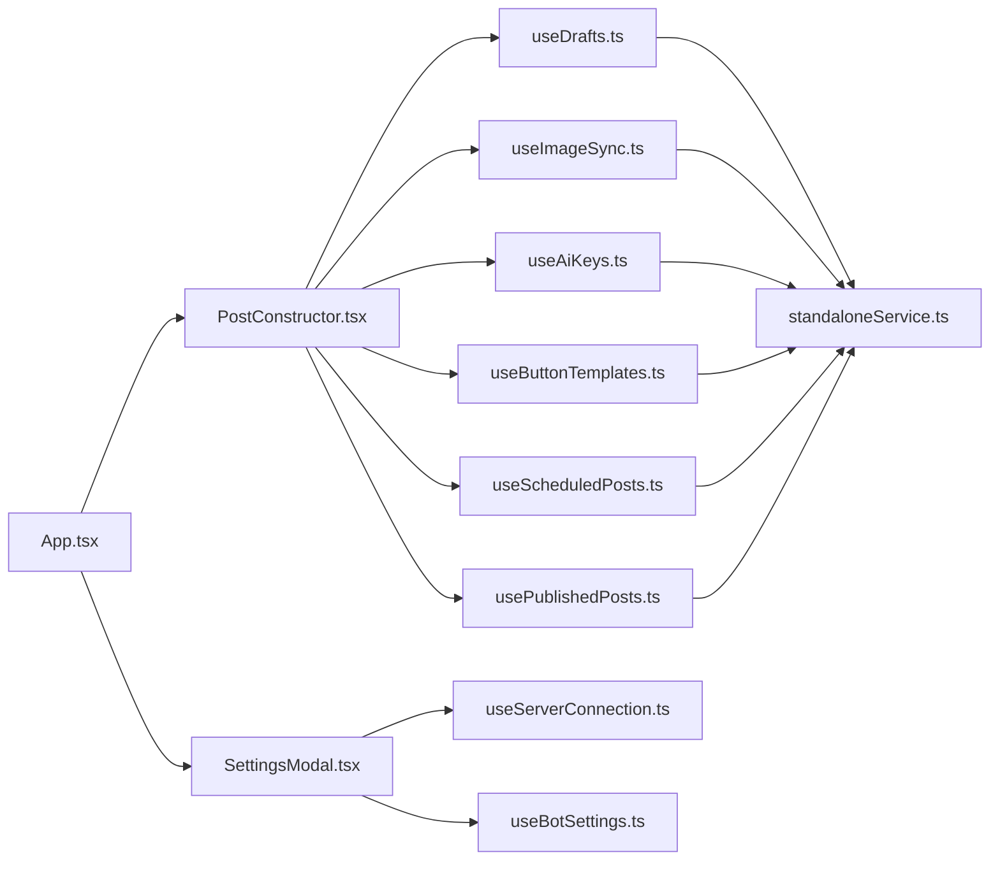

# Internal Component Interaction

<cite>
**Referenced Files in This Document**
- [useDrafts.ts](file://src/hooks/useDrafts.ts)
- [useServerConnection.ts](file://src/hooks/useServerConnection.ts)
- [useAiKeys.ts](file://src/hooks/useAiKeys.ts)
- [useImageSync.ts](file://src/hooks/useImageSync.ts)
- [useBotSettings.ts](file://src/hooks/useBotSettings.ts)
- [useButtonTemplates.ts](file://src/hooks/useButtonTemplates.ts)
- [useScheduledPosts.ts](file://src/hooks/useScheduledPosts.ts)
- [usePublishedPosts.ts](file://src/hooks/usePublishedPosts.ts)
- [PostConstructor.tsx](file://src/components/PostConstructor.tsx)
- [SettingsModal.tsx](file://src/components/SettingsModal.tsx)
- [standaloneService.ts](file://src/services/standaloneService.ts)
- [types.ts](file://src/types.ts)
- [App.tsx](file://src/App.tsx)
</cite>

## Table of Contents
1. [Introduction](#introduction)
2. [Project Structure](#project-structure)
3. [Core Components](#core-components)
4. [Architecture Overview](#architecture-overview)
5. [Detailed Component Analysis](#detailed-component-analysis)
6. [Dependency Analysis](#dependency-analysis)
7. [Performance Considerations](#performance-considerations)
8. [Troubleshooting Guide](#troubleshooting-guide)
9. [Conclusion](#conclusion)

## Introduction
This document explains internal component interaction patterns and state management across the application. It focuses on how React hooks encapsulate cross-cutting concerns (drafts, server connectivity, AI keys, image synchronization), how components pass props and communicate via events, and how data flows between PostConstructor, SettingsModal, and supporting services. It also covers lifecycle management, cleanup, and memory leak prevention strategies.

## Project Structure
The application follows a feature-based structure with clear separation of concerns:
- Hooks: Encapsulate stateful logic and side effects for drafts, server connection, AI keys, and image sync.
- Components: Presentational and composite components (PostConstructor, SettingsModal) that orchestrate UI and user actions.
- Services: Abstractions for storage, Telegram API, AI processing, and scraping.
- Types: Shared TypeScript interfaces for posts, buttons, and configuration.

**Diagram sources**
- [App.tsx:168-1888](file://src/App.tsx#L168-L1888)
- [PostConstructor.tsx:1-294](file://src/components/PostConstructor.tsx#L1-L294)
- [SettingsModal.tsx:1-107](file://src/components/SettingsModal.tsx#L1-L107)
- [useDrafts.ts:1-88](file://src/hooks/useDrafts.ts#L1-L88)
- [useServerConnection.ts:1-52](file://src/hooks/useServerConnection.ts#L1-L52)
- [useAiKeys.ts:1-57](file://src/hooks/useAiKeys.ts#L1-L57)
- [useImageSync.ts:1-42](file://src/hooks/useImageSync.ts#L1-L42)
- [useBotSettings.ts:1-56](file://src/hooks/useBotSettings.ts#L1-L56)
- [useButtonTemplates.ts:1-38](file://src/hooks/useButtonTemplates.ts#L1-L38)
- [useScheduledPosts.ts:1-38](file://src/hooks/useScheduledPosts.ts#L1-L38)
- [usePublishedPosts.ts:1-38](file://src/hooks/usePublishedPosts.ts#L1-L38)
- [standaloneService.ts:1-175](file://src/services/standaloneService.ts#L1-L175)
- [types.ts:1-48](file://src/types.ts#L1-L48)

**Section sources**
- [App.tsx:168-1888](file://src/App.tsx#L168-L1888)
- [PostConstructor.tsx:1-294](file://src/components/PostConstructor.tsx#L1-L294)
- [SettingsModal.tsx:1-107](file://src/components/SettingsModal.tsx#L1-L107)
- [useDrafts.ts:1-88](file://src/hooks/useDrafts.ts#L1-L88)
- [useServerConnection.ts:1-52](file://src/hooks/useServerConnection.ts#L1-L52)
- [useAiKeys.ts:1-57](file://src/hooks/useAiKeys.ts#L1-L57)
- [useImageSync.ts:1-42](file://src/hooks/useImageSync.ts#L1-L42)
- [standaloneService.ts:1-175](file://src/services/standaloneService.ts#L1-L175)
- [types.ts:1-48](file://src/types.ts#L1-L48)

## Core Components
This section documents the primary hooks and their roles in state management and synchronization.

- useDrafts
  - Responsibilities: Load, save, and delete drafts; manage loading state; support both standalone and server modes.
  - Key behaviors: Uses storage abstraction for standalone; uses universalFetch for server mode; maintains drafts array and exposes reload.
  - Synchronization: Triggers reload on mount and after save/delete operations.

- useServerConnection
  - Responsibilities: Monitor server availability and bot status; poll periodically; surface loading/error states.
  - Key behaviors: Uses CapacitorHttp; polls every 8 seconds; clears intervals on unmount.

- useAiKeys
  - Responsibilities: Manage provider-specific AI keys; persist per platform; expose update and load helpers.
  - Key behaviors: Loads keys from storage/localStorage depending on mode; updates synchronously and persists.

- useImageSync
  - Responsibilities: Track image path; manage browser state; persist path for standalone.
  - Key behaviors: Reads/writes setting for standalone; returns state for UI controls.

- Supporting hooks
  - useBotSettings: Centralizes bot token and chat ID persistence/loading.
  - useButtonTemplates, useScheduledPosts, usePublishedPosts: Mirror useDrafts pattern for templates and lists.

**Section sources**
- [useDrafts.ts:1-88](file://src/hooks/useDrafts.ts#L1-L88)
- [useServerConnection.ts:1-52](file://src/hooks/useServerConnection.ts#L1-L52)
- [useAiKeys.ts:1-57](file://src/hooks/useAiKeys.ts#L1-L57)
- [useImageSync.ts:1-42](file://src/hooks/useImageSync.ts#L1-L42)
- [useBotSettings.ts:1-56](file://src/hooks/useBotSettings.ts#L1-L56)
- [useButtonTemplates.ts:1-38](file://src/hooks/useButtonTemplates.ts#L1-L38)
- [useScheduledPosts.ts:1-38](file://src/hooks/useScheduledPosts.ts#L1-L38)
- [usePublishedPosts.ts:1-38](file://src/hooks/usePublishedPosts.ts#L1-L38)

## Architecture Overview
The application uses a central orchestrator (App.tsx) that composes hooks and passes state and callbacks to components. Components remain declarative and rely on props/events for interaction.

**Diagram sources**
- [App.tsx:267-341](file://src/App.tsx#L267-L341)
- [PostConstructor.tsx:96-294](file://src/components/PostConstructor.tsx#L96-L294)
- [SettingsModal.tsx:28-107](file://src/components/SettingsModal.tsx#L28-L107)
- [useDrafts.ts:9-77](file://src/hooks/useDrafts.ts#L9-L77)
- [useServerConnection.ts:20-48](file://src/hooks/useServerConnection.ts#L20-L48)
- [useAiKeys.ts:8-48](file://src/hooks/useAiKeys.ts#L8-L48)
- [useImageSync.ts:12-27](file://src/hooks/useImageSync.ts#L12-L27)
- [standaloneService.ts:11-72](file://src/services/standaloneService.ts#L11-L72)

## Detailed Component Analysis

### PostConstructor: Draft State Management and Image Sync
PostConstructor coordinates authoring state and delegates persistence to hooks. It manages:
- Authoring state: aiProcessedText, originalText, selectedImages, mainImage, postButtons, parsedContent, scheduleDateTime.
- UI state: activeTab, isProcessingAI, isActionInProgress, showTemplates.
- Event handlers: processAI, saveDraft, handlePublish, toggleImageSelection, handleDragEnd, openFolderBrowser, handleFolderSelect, syncLocalImages.

State synchronization patterns:
- Controlled inputs: Local state mirrors props to avoid editor lag; changes propagate back via setters.
- Draft persistence: saveDraft constructs a DraftPost and calls saveDraftHook; reloads drafts afterward.
- Image sync: syncLocalImages handles both standalone and server modes; updates selectedImages and parsedContent.

**Diagram sources**
- [PostConstructor.tsx:96-294](file://src/components/PostConstructor.tsx#L96-L294)
- [useDrafts.ts:31-54](file://src/hooks/useDrafts.ts#L31-L54)
- [useImageSync.ts:12-27](file://src/hooks/useImageSync.ts#L12-L27)
- [standaloneService.ts:25-71](file://src/services/standaloneService.ts#L25-L71)

**Section sources**
- [PostConstructor.tsx:96-294](file://src/components/PostConstructor.tsx#L96-L294)
- [useDrafts.ts:31-86](file://src/hooks/useDrafts.ts#L31-L86)
- [useImageSync.ts:12-41](file://src/hooks/useImageSync.ts#L12-L41)

### SettingsModal: Server Connection Monitoring and Validation
SettingsModal coordinates server configuration and connection testing:
- Mode switching: isStandalone toggles between standalone and server modes.
- URL validation: getCleanBaseUrl ensures a normalized base URL.
- Connection testing: testConnection validates server accessibility and warns about AI Studio previews.
- Network testing: testNetwork checks internet connectivity.
- Save settings: handleSaveSettings persists tokens and URLs, triggers refetchStatus.

**Diagram sources**
- [SettingsModal.tsx:28-107](file://src/components/SettingsModal.tsx#L28-L107)
- [App.tsx:1261-1335](file://src/App.tsx#L1261-L1335)
- [useServerConnection.ts:20-50](file://src/hooks/useServerConnection.ts#L20-L50)
- [standaloneService.ts:56-71](file://src/services/standaloneService.ts#L56-L71)

**Section sources**
- [SettingsModal.tsx:28-107](file://src/components/SettingsModal.tsx#L28-L107)
- [App.tsx:1261-1335](file://src/App.tsx#L1261-L1335)
- [useServerConnection.ts:20-50](file://src/hooks/useServerConnection.ts#L20-L50)

### AI Key Validation and Provider Selection
AI key management is handled by useAiKeys:
- Loads keys from storage/localStorage depending on mode.
- updateAiKey updates state and persists immediately.
- Preferred provider selection is coordinated in App.tsx and persisted via standaloneService or server endpoint.

**Diagram sources**
- [useAiKeys.ts:37-44](file://src/hooks/useAiKeys.ts#L37-L44)
- [App.tsx:1672-1720](file://src/App.tsx#L1672-L1720)
- [standaloneService.ts:56-71](file://src/services/standaloneService.ts#L56-L71)

**Section sources**
- [useAiKeys.ts:8-55](file://src/hooks/useAiKeys.ts#L8-L55)
- [App.tsx:1672-1720](file://src/App.tsx#L1672-L1720)

### Image Synchronization Best Practices
useImageSync provides:
- Local state for image path and browser navigation.
- saveImagePath persists path for standalone.
- syncLocalImages orchestrates both standalone and server flows, updating selectedImages and parsedContent.

Best practices:
- Debounce auto-save of image path.
- Validate and normalize paths before scanning.
- Respect platform permissions (native vs web).
- Merge new images without duplicates.

**Diagram sources**
- [useImageSync.ts:12-41](file://src/hooks/useImageSync.ts#L12-L41)
- [App.tsx:401-527](file://src/App.tsx#L401-L527)
- [standaloneService.ts:25-71](file://src/services/standaloneService.ts#L25-L71)

**Section sources**
- [useImageSync.ts:12-41](file://src/hooks/useImageSync.ts#L12-L41)
- [App.tsx:401-527](file://src/App.tsx#L401-L527)

### Component Composition Strategies
- Props-first design: PostConstructor and SettingsModal receive all required state and callbacks via props.
- Event-driven updates: Handlers mutate shared state in App.tsx; hooks encapsulate persistence.
- Conditional rendering: AnimatePresence manages modal transitions; tabs control visibility.
- Drag-and-drop: DndKit integrates with PostConstructor’s image list; handleDragEnd updates order.

**Section sources**
- [PostConstructor.tsx:96-294](file://src/components/PostConstructor.tsx#L96-L294)
- [SettingsModal.tsx:28-107](file://src/components/SettingsModal.tsx#L28-L107)
- [App.tsx:1792-1865](file://src/App.tsx#L1792-L1865)

## Dependency Analysis
The dependency graph highlights how components depend on hooks and services.

**Diagram sources**
- [App.tsx:168-1888](file://src/App.tsx#L168-L1888)
- [PostConstructor.tsx:1-294](file://src/components/PostConstructor.tsx#L1-L294)
- [SettingsModal.tsx:1-107](file://src/components/SettingsModal.tsx#L1-L107)
- [useDrafts.ts:1-88](file://src/hooks/useDrafts.ts#L1-L88)
- [useServerConnection.ts:1-52](file://src/hooks/useServerConnection.ts#L1-L52)
- [useAiKeys.ts:1-57](file://src/hooks/useAiKeys.ts#L1-L57)
- [useImageSync.ts:1-42](file://src/hooks/useImageSync.ts#L1-L42)
- [useBotSettings.ts:1-56](file://src/hooks/useBotSettings.ts#L1-L56)
- [useButtonTemplates.ts:1-38](file://src/hooks/useButtonTemplates.ts#L1-L38)
- [useScheduledPosts.ts:1-38](file://src/hooks/useScheduledPosts.ts#L1-L38)
- [usePublishedPosts.ts:1-38](file://src/hooks/usePublishedPosts.ts#L1-L38)
- [standaloneService.ts:1-175](file://src/services/standaloneService.ts#L1-L175)

**Section sources**
- [App.tsx:168-1888](file://src/App.tsx#L168-L1888)
- [PostConstructor.tsx:1-294](file://src/components/PostConstructor.tsx#L1-L294)
- [SettingsModal.tsx:1-107](file://src/components/SettingsModal.tsx#L1-L107)
- [useDrafts.ts:1-88](file://src/hooks/useDrafts.ts#L1-L88)
- [useServerConnection.ts:1-52](file://src/hooks/useServerConnection.ts#L1-L52)
- [useAiKeys.ts:1-57](file://src/hooks/useAiKeys.ts#L1-L57)
- [useImageSync.ts:1-42](file://src/hooks/useImageSync.ts#L1-L42)
- [useBotSettings.ts:1-56](file://src/hooks/useBotSettings.ts#L1-L56)
- [useButtonTemplates.ts:1-38](file://src/hooks/useButtonTemplates.ts#L1-L38)
- [useScheduledPosts.ts:1-38](file://src/hooks/useScheduledPosts.ts#L1-L38)
- [usePublishedPosts.ts:1-38](file://src/hooks/usePublishedPosts.ts#L1-L38)
- [standaloneService.ts:1-175](file://src/services/standaloneService.ts#L1-L175)

## Performance Considerations
- Minimize re-renders: Use memoized callbacks (useCallback) and stable references (useRef) for handlers and timers.
- Debounced writes: Auto-save image path with a short debounce to reduce network/storage churn.
- Efficient polling: useServerConnection interval is bounded; cleanup prevents leaks.
- Virtualization: Large lists (drafts/scheduled/published) are rendered efficiently with minimal overhead.
- Avoid blocking UI: Long-running tasks (AI processing, image scans) run asynchronously with loading indicators.

[No sources needed since this section provides general guidance]

## Troubleshooting Guide
Common issues and resolutions:
- Draft save failures: Inspect saveDraft error handling and confirm URL normalization and credentials.
- Server connectivity errors: useServerConnection surfaces errors; testConnection distinguishes AI Studio preview URLs.
- AI key errors: Validate keys via test endpoints; handle quota and unauthorized responses gracefully.
- Image sync failures: Verify path correctness, permissions (native), and server reachability.
- Memory leaks: Ensure intervals and EventSource are cleared in useEffect cleanup; avoid stale closures by keeping dependencies current.

**Section sources**
- [useServerConnection.ts:20-50](file://src/hooks/useServerConnection.ts#L20-L50)
- [App.tsx:1313-1335](file://src/App.tsx#L1313-L1335)
- [App.tsx:811-864](file://src/App.tsx#L811-L864)
- [App.tsx:401-527](file://src/App.tsx#L401-L527)

## Conclusion
The application achieves robust internal component interaction through:
- Clear separation of concerns via custom hooks.
- Predictable prop-driven communication between components.
- Platform-aware persistence and network abstractions.
- Lifecycle-aware cleanup and performance-conscious patterns.

These patterns enable maintainable state synchronization across PostConstructor, SettingsModal, and supporting services while preventing memory leaks and ensuring responsive UX.