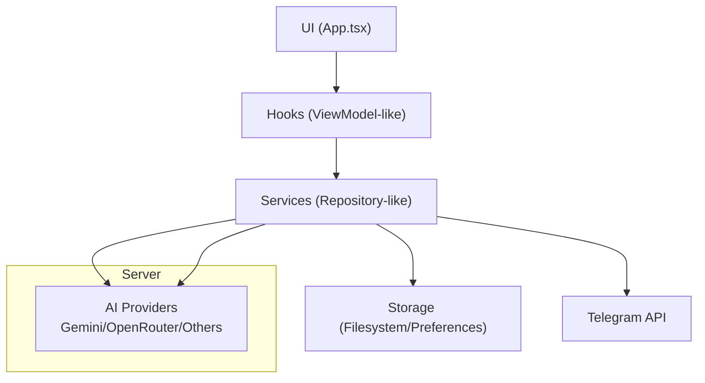
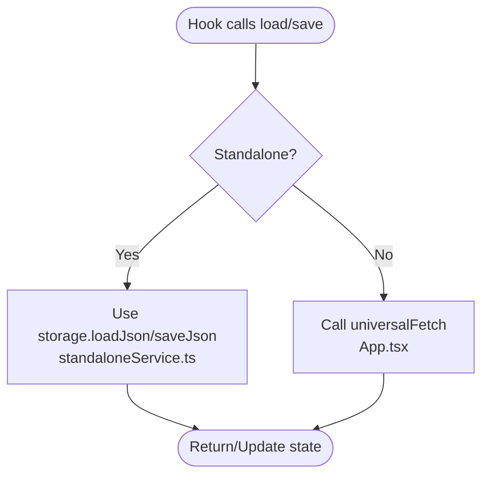
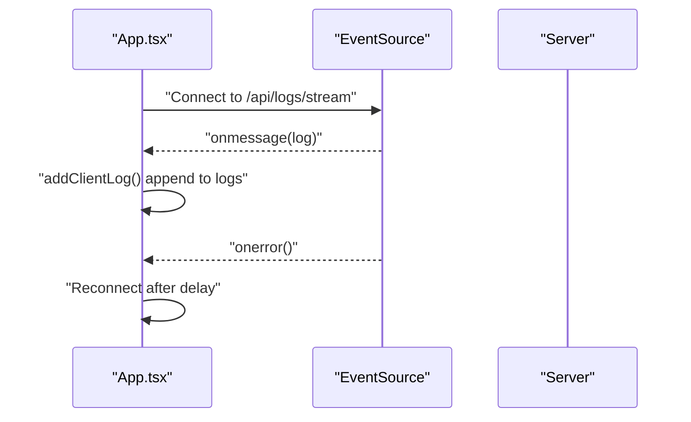
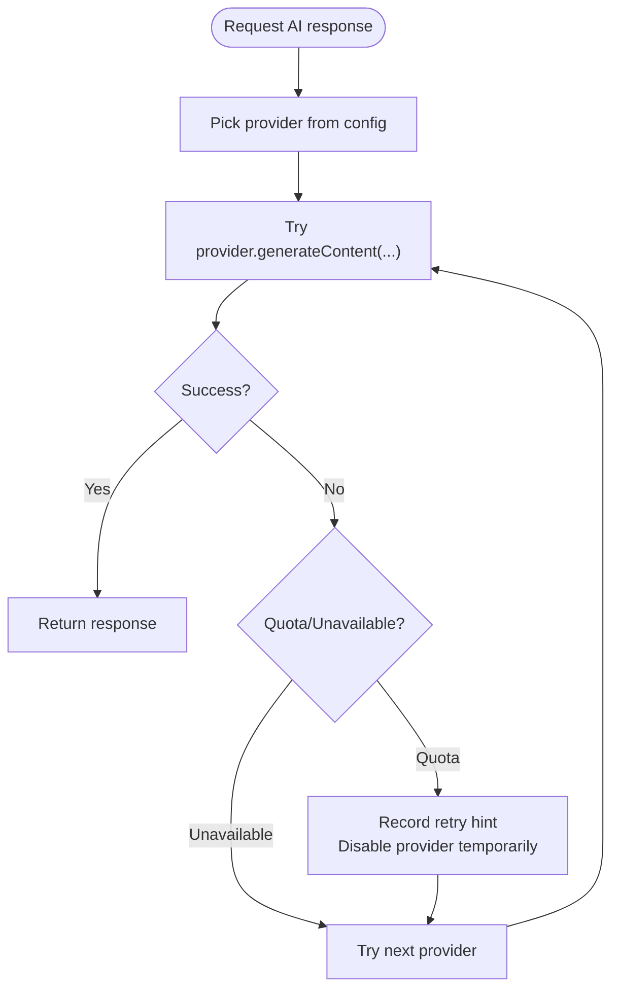
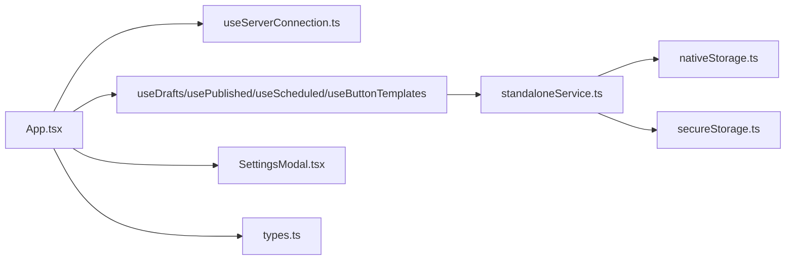

# Design Patterns and Architectural Principles

<cite>
**Referenced Files in This Document**
- [App.tsx](file://src/App.tsx)
- [main.tsx](file://src/main.tsx)
- [types.ts](file://src/types.ts)
- [useServerConnection.ts](file://src/hooks/useServerConnection.ts)
- [standaloneService.ts](file://src/services/standaloneService.ts)
- [useAiKeys.ts](file://src/hooks/useAiKeys.ts)
- [useBotSettings.ts](file://src/hooks/useBotSettings.ts)
- [nativeStorage.ts](file://src/services/nativeStorage.ts)
- [secureStorage.ts](file://src/services/secureStorage.ts)
- [SettingsModal.tsx](file://src/components/SettingsModal.tsx)
- [useDrafts.ts](file://src/hooks/useDrafts.ts)
- [usePublishedPosts.ts](file://src/hooks/usePublishedPosts.ts)
- [useScheduledPosts.ts](file://src/hooks/useScheduledPosts.ts)
- [useButtonTemplates.ts](file://src/hooks/useButtonTemplates.ts)
- [server.ts](file://server.ts)
</cite>

## Table of Contents
1. [Introduction](#introduction)
2. [Project Structure](#project-structure)
3. [Core Components](#core-components)
4. [Architecture Overview](#architecture-overview)
5. [Detailed Component Analysis](#detailed-component-analysis)
6. [Dependency Analysis](#dependency-analysis)
7. [Performance Considerations](#performance-considerations)
8. [Troubleshooting Guide](#troubleshooting-guide)
9. [Conclusion](#conclusion)

## Introduction
This document explains the design patterns and architectural principles implemented in the AI News Bot system. It focuses on:
- MVVM-like separation of concerns in React (ViewModel-like hooks and Services)
- Repository pattern for data access abstraction across standalone and server modes
- Observer pattern for real-time updates via Server-Sent Events (SSE) and polling
- Strategy pattern for AI provider selection and fallback
- Factory patterns for dynamic AI provider instantiation
- Singleton pattern for centralized logging
- Service layer abstractions for storage, Telegram API, and AI processing

These patterns collectively improve maintainability, scalability, and testability by decoupling UI, data access, and external integrations.

## Project Structure
The project is a React client with TypeScript and Capacitor for native capabilities. Key areas:
- UI and orchestration: [App.tsx](file://src/App.tsx)
- Entry point: [main.tsx](file://src/main.tsx)
- Types: [types.ts](file://src/types.ts)
- Hooks (ViewModel-like): [useServerConnection.ts](file://src/hooks/useServerConnection.ts), [useDrafts.ts](file://src/hooks/useDrafts.ts), [usePublishedPosts.ts](file://src/hooks/usePublishedPosts.ts), [useScheduledPosts.ts](file://src/hooks/useScheduledPosts.ts), [useButtonTemplates.ts](file://src/hooks/useButtonTemplates.ts), [useAiKeys.ts](file://src/hooks/useAiKeys.ts), [useBotSettings.ts](file://src/hooks/useBotSettings.ts)
- Services (Repository-like): [standaloneService.ts](file://src/services/standaloneService.ts), [nativeStorage.ts](file://src/services/nativeStorage.ts), [secureStorage.ts](file://src/services/secureStorage.ts)
- Components: [SettingsModal.tsx](file://src/components/SettingsModal.tsx)
- Server-side AI provider orchestration: [server.ts](file://server.ts)

```mermaid
graph TB
subgraph "React UI Layer"
App["App.tsx"]
Settings["SettingsModal.tsx"]
end
subgraph "Hooks (ViewModel-like)"
HookConn["useServerConnection.ts"]
HookDrafts["useDrafts.ts"]
HookPub["usePublishedPosts.ts"]
HookSch["useScheduledPosts.ts"]
HookBtn["useButtonTemplates.ts"]
HookKeys["useAiKeys.ts"]
HookBot["useBotSettings.ts"]
end
subgraph "Services (Repository-like)"
SvcStand["standaloneService.ts"]
SvcNative["nativeStorage.ts"]
SvcSecure["secureStorage.ts"]
end
subgraph "Types"
Types["types.ts"]
end
App --> HookConn
App --> HookDrafts
App --> HookPub
App --> HookSch
App --> HookBtn
App --> HookKeys
App --> HookBot
App --> Settings
App --> Types
HookDrafts --> SvcStand
HookPub --> SvcStand
HookSch --> SvcStand
HookBtn --> SvcStand
HookKeys --> SvcStand
HookBot --> SvcStand
HookBot --> SvcSecure
SvcStand --> SvcNative
```

**Diagram sources**
- [App.tsx:168-750](file://src/App.tsx#L168-L750)
- [SettingsModal.tsx:28-106](file://src/components/SettingsModal.tsx#L28-L106)
- [useServerConnection.ts:15-51](file://src/hooks/useServerConnection.ts#L15-L51)
- [useDrafts.ts:5-87](file://src/hooks/useDrafts.ts#L5-L87)
- [usePublishedPosts.ts:5-37](file://src/hooks/usePublishedPosts.ts#L5-L37)
- [useScheduledPosts.ts:5-37](file://src/hooks/useScheduledPosts.ts#L5-L37)
- [useButtonTemplates.ts:5-37](file://src/hooks/useButtonTemplates.ts#L5-L37)
- [useAiKeys.ts:4-56](file://src/hooks/useAiKeys.ts#L4-L56)
- [useBotSettings.ts:5-55](file://src/hooks/useBotSettings.ts#L5-L55)
- [standaloneService.ts:11-175](file://src/services/standaloneService.ts#L11-L175)
- [nativeStorage.ts:8-62](file://src/services/nativeStorage.ts#L8-L62)
- [secureStorage.ts:4-39](file://src/services/secureStorage.ts#L4-L39)
- [types.ts:1-48](file://src/types.ts#L1-L48)

**Section sources**
- [main.tsx:1-11](file://src/main.tsx#L1-L11)
- [App.tsx:168-750](file://src/App.tsx#L168-L750)
- [types.ts:1-48](file://src/types.ts#L1-L48)

## Core Components
- MVVM-like separation:
  - ViewModel-like hooks encapsulate state and side effects for domain lists and settings.
  - Services abstract platform-specific storage and external APIs.
- Repository pattern:
  - Hooks delegate persistence to services, switching between standalone file/Preferences and server endpoints.
- Observer pattern:
  - SSE stream for logs on web; polling fallback on native; periodic status polling.
- Strategy pattern:
  - AI provider selection and fallback logic on the server orchestrates multiple providers.
- Factory patterns:
  - Dynamic provider instantiation per provider type on the server.
- Singleton pattern:
  - Centralized logging via a shared log buffer/state in the UI.
- Service layer abstractions:
  - Storage, Telegram API, AI processing, and scraping services.

**Section sources**
- [App.tsx:168-750](file://src/App.tsx#L168-L750)
- [standaloneService.ts:11-175](file://src/services/standaloneService.ts#L11-L175)
- [useServerConnection.ts:15-51](file://src/hooks/useServerConnection.ts#L15-L51)
- [server.ts:502-590](file://server.ts#L502-L590)

## Architecture Overview
The system follows a layered architecture:
- UI layer (React) orchestrates state and renders components.
- Hooks layer (ViewModel-like) manages domain-specific state and side effects.
- Services layer abstracts data access and external integrations.
- Server orchestrates AI providers and exposes REST/SSE endpoints.



**Diagram sources**
- [App.tsx:168-750](file://src/App.tsx#L168-L750)
- [standaloneService.ts:11-175](file://src/services/standaloneService.ts#L11-L175)
- [server.ts:502-590](file://server.ts#L502-L590)

## Detailed Component Analysis

### MVVM-like Component Architecture (React)
- ViewModel-like hooks:
  - [useServerConnection.ts:15-51](file://src/hooks/useServerConnection.ts#L15-L51) manages server status with polling.
  - [useDrafts.ts:5-87](file://src/hooks/useDrafts.ts#L5-L87), [usePublishedPosts.ts:5-37](file://src/hooks/usePublishedPosts.ts#L5-L37), [useScheduledPosts.ts:5-37](file://src/hooks/useScheduledPosts.ts#L5-L37), [useButtonTemplates.ts:5-37](file://src/hooks/useButtonTemplates.ts#L5-L37) manage lists with unified persistence logic.
  - [useAiKeys.ts:4-56](file://src/hooks/useAiKeys.ts#L4-L56) and [useBotSettings.ts:5-55](file://src/hooks/useBotSettings.ts#L5-L55) centralize key/settings management.
- Services:
  - [standaloneService.ts:11-175](file://src/services/standaloneService.ts#L11-L175) provides storage, Telegram API, and AI processing.
  - [nativeStorage.ts:8-62](file://src/services/nativeStorage.ts#L8-L62) and [secureStorage.ts:4-39](file://src/services/secureStorage.ts#L4-L39) abstract persistent storage.

Benefits:
- Clear separation of concerns: UI handles rendering, hooks handle state and effects, services handle persistence/APIs.
- Testability: Hooks can be tested independently; services can be mocked.

Trade-offs:
- Complexity increases with cross-hook dependencies; careful dependency injection or composition is needed.

**Section sources**
- [App.tsx:168-750](file://src/App.tsx#L168-L750)
- [useServerConnection.ts:15-51](file://src/hooks/useServerConnection.ts#L15-L51)
- [useDrafts.ts:5-87](file://src/hooks/useDrafts.ts#L5-L87)
- [usePublishedPosts.ts:5-37](file://src/hooks/usePublishedPosts.ts#L5-L37)
- [useScheduledPosts.ts:5-37](file://src/hooks/useScheduledPosts.ts#L5-L37)
- [useButtonTemplates.ts:5-37](file://src/hooks/useButtonTemplates.ts#L5-L37)
- [useAiKeys.ts:4-56](file://src/hooks/useAiKeys.ts#L4-L56)
- [useBotSettings.ts:5-55](file://src/hooks/useBotSettings.ts#L5-L55)
- [standaloneService.ts:11-175](file://src/services/standaloneService.ts#L11-L175)
- [nativeStorage.ts:8-62](file://src/services/nativeStorage.ts#L8-L62)
- [secureStorage.ts:4-39](file://src/services/secureStorage.ts#L4-L39)

### Repository Pattern for Data Access Abstraction
- Hook-to-service delegation:
  - [useDrafts.ts:9-54](file://src/hooks/useDrafts.ts#L9-L54) switches between local JSON storage and server endpoint based on mode.
  - Similar patterns in [usePublishedPosts.ts:9-29](file://src/hooks/usePublishedPosts.ts#L9-L29), [useScheduledPosts.ts:9-29](file://src/hooks/useScheduledPosts.ts#L9-L29), [useButtonTemplates.ts:9-29](file://src/hooks/useButtonTemplates.ts#L9-L29).
- Service implementation:
  - [standaloneService.ts:25-72](file://src/services/standaloneService.ts#L25-L72) abstracts file/Preferences reads/writes.
  - [nativeStorage.ts:16-46](file://src/services/nativeStorage.ts#L16-L46) provides a generic JSON file wrapper.
- Benefits:
  - Uniform API for persistence regardless of runtime (native vs web).
  - Easy to swap implementations or add caching layers.



**Diagram sources**
- [useDrafts.ts:9-54](file://src/hooks/useDrafts.ts#L9-L54)
- [standaloneService.ts:25-72](file://src/services/standaloneService.ts#L25-L72)
- [App.tsx:194-251](file://src/App.tsx#L194-L251)

**Section sources**
- [useDrafts.ts:5-87](file://src/hooks/useDrafts.ts#L5-L87)
- [usePublishedPosts.ts:5-37](file://src/hooks/usePublishedPosts.ts#L5-L37)
- [useScheduledPosts.ts:5-37](file://src/hooks/useScheduledPosts.ts#L5-L37)
- [useButtonTemplates.ts:5-37](file://src/hooks/useButtonTemplates.ts#L5-L37)
- [standaloneService.ts:11-175](file://src/services/standaloneService.ts#L11-L175)
- [nativeStorage.ts:8-62](file://src/services/nativeStorage.ts#L8-L62)
- [App.tsx:194-251](file://src/App.tsx#L194-L251)

### Observer Pattern for Real-Time Updates (SSE and Polling)
- SSE on web:
  - [App.tsx:651-679](file://src/App.tsx#L651-L679) establishes an EventSource connection to `/api/logs/stream` and appends incoming log entries.
- Polling on native:
  - [App.tsx:681-698](file://src/App.tsx#L681-L698) polls `/api/logs` every 4 seconds and updates the log list.
- Periodic server status:
  - [useServerConnection.ts:44-48](file://src/hooks/useServerConnection.ts#L44-L48) polls `/api/status` every 8 seconds.

Benefits:
- Near real-time updates with minimal overhead on web via SSE.
- Robust fallback on native environments.

Trade-offs:
- SSE requires server support; polling adds network overhead.



**Diagram sources**
- [App.tsx:651-679](file://src/App.tsx#L651-L679)

**Section sources**
- [App.tsx:651-698](file://src/App.tsx#L651-L698)
- [useServerConnection.ts:15-51](file://src/hooks/useServerConnection.ts#L15-L51)

### Strategy Pattern for AI Provider Selection
- Server-side provider orchestration:
  - [server.ts:502-590](file://server.ts#L502-L590) iterates through configured providers (e.g., Gemini, OpenRouter), attempting fallbacks and handling quotas/timeouts.
  - Includes timeout and retry logic for resilience.
- Client-side AI processing:
  - [standaloneService.ts:148-159](file://src/services/standaloneService.ts#L148-L159) demonstrates a single-provider strategy for standalone mode.

Benefits:
- Flexibility to switch providers and add new ones without changing client code.
- Resilience via fallback strategies and error categorization.

Trade-offs:
- Increased complexity in error handling and provider-specific configurations.



**Diagram sources**
- [server.ts:502-590](file://server.ts#L502-L590)

**Section sources**
- [server.ts:502-590](file://server.ts#L502-L590)
- [standaloneService.ts:148-159](file://src/services/standaloneService.ts#L148-L159)

### Factory Patterns for Dynamic AI Provider Instantiation
- Provider factories:
  - [server.ts:502-590](file://server.ts#L502-L590) constructs provider clients (e.g., GoogleGenerativeAI) dynamically based on selected provider and model.
  - Uses arrays/models lists and retries to instantiate and validate models.
- Benefits:
  - Encapsulates provider creation and configuration in one place.
  - Simplifies adding new providers by extending the provider loop.

**Section sources**
- [server.ts:502-590](file://server.ts#L502-L590)

### Singleton Pattern for Centralized Logging
- Central log buffer:
  - [App.tsx:531-535](file://src/App.tsx#L531-L535) maintains a capped log list and appends formatted entries.
- Benefits:
  - Unified visibility of client-side events for debugging.
- Trade-offs:
  - Memory footprint grows with logs; consider rotating or exporting logs for long sessions.

**Section sources**
- [App.tsx:531-535](file://src/App.tsx#L531-L535)

### Service Layer Abstractions
- Storage:
  - [standaloneService.ts:11-72](file://src/services/standaloneService.ts#L11-L72) and [nativeStorage.ts:8-62](file://src/services/nativeStorage.ts#L8-L62) abstract file/Preferences operations.
- Security:
  - [secureStorage.ts:4-39](file://src/services/secureStorage.ts#L4-L39) wraps token storage with platform-aware encryption hints.
- Telegram API:
  - [standaloneService.ts:75-146](file://src/services/standaloneService.ts#L75-L146) provides unified methods for getMe, sendMessage, sendPhoto, sendMediaGroup, and getUpdates.
- AI Processing:
  - [standaloneService.ts:148-159](file://src/services/standaloneService.ts#L148-L159) encapsulates AI generation for standalone mode.

Benefits:
- Consistent API across platforms and modes.
- Easier testing and mocking.

**Section sources**
- [standaloneService.ts:11-175](file://src/services/standaloneService.ts#L11-L175)
- [nativeStorage.ts:8-62](file://src/services/nativeStorage.ts#L8-L62)
- [secureStorage.ts:4-39](file://src/services/secureStorage.ts#L4-L39)

## Dependency Analysis
- UI depends on hooks for state and effects.
- Hooks depend on services for persistence and external calls.
- Services depend on platform APIs (Capacitor) and third-party libraries.
- Server orchestrates AI providers and exposes endpoints consumed by the client.



**Diagram sources**
- [App.tsx:168-750](file://src/App.tsx#L168-L750)
- [useServerConnection.ts:15-51](file://src/hooks/useServerConnection.ts#L15-L51)
- [useDrafts.ts:5-87](file://src/hooks/useDrafts.ts#L5-L87)
- [usePublishedPosts.ts:5-37](file://src/hooks/usePublishedPosts.ts#L5-L37)
- [useScheduledPosts.ts:5-37](file://src/hooks/useScheduledPosts.ts#L5-L37)
- [useButtonTemplates.ts:5-37](file://src/hooks/useButtonTemplates.ts#L5-L37)
- [standaloneService.ts:11-175](file://src/services/standaloneService.ts#L11-L175)
- [nativeStorage.ts:8-62](file://src/services/nativeStorage.ts#L8-L62)
- [secureStorage.ts:4-39](file://src/services/secureStorage.ts#L4-L39)
- [SettingsModal.tsx:28-106](file://src/components/SettingsModal.tsx#L28-L106)
- [types.ts:1-48](file://src/types.ts#L1-L48)

**Section sources**
- [App.tsx:168-750](file://src/App.tsx#L168-L750)
- [standaloneService.ts:11-175](file://src/services/standaloneService.ts#L11-L175)

## Performance Considerations
- SSE vs polling:
  - Prefer SSE on web for lower overhead; polling is a robust fallback on native.
- Debounced autosave:
  - [App.tsx:717-725](file://src/App.tsx#L717-L725) demonstrates debounced autosave for settings to reduce network calls.
- Polling intervals:
  - [useServerConnection.ts:44-48](file://src/hooks/useServerConnection.ts#L44-L48) uses 8s intervals; adjust based on latency and importance.
- Model fallback and timeouts:
  - [server.ts:502-590](file://server.ts#L502-L590) includes retries and timeouts to avoid blocking and improve resilience.

[No sources needed since this section provides general guidance]

## Troubleshooting Guide
- SSE connection failures:
  - [App.tsx:669-674](file://src/App.tsx#L669-L674) closes and retries SSE connections on errors.
- Native fetch errors:
  - [App.tsx:235-250](file://src/App.tsx#L235-L250) surfaces meaningful errors for native HTTP requests.
- Server status polling:
  - [useServerConnection.ts:36-39](file://src/hooks/useServerConnection.ts#L36-L39) captures and displays server errors.
- Logs:
  - [App.tsx:531-535](file://src/App.tsx#L531-L535) centralizes client logs for quick inspection.

**Section sources**
- [App.tsx:669-674](file://src/App.tsx#L669-L674)
- [App.tsx:235-250](file://src/App.tsx#L235-L250)
- [useServerConnection.ts:36-39](file://src/hooks/useServerConnection.ts#L36-L39)
- [App.tsx:531-535](file://src/App.tsx#L531-L535)

## Conclusion
The AI News Bot applies well-established design patterns to achieve a clean, maintainable, scalable, and testable architecture:
- MVVM-like hooks separate UI from logic.
- Repository pattern abstracts data access across modes.
- Observer pattern enables real-time updates with robust fallbacks.
- Strategy and factory patterns enable flexible, extensible AI provider orchestration.
- Centralized logging and service abstractions improve observability and portability.

These patterns collectively support future enhancements, such as adding new AI providers, integrating additional storage backends, and expanding UI features.