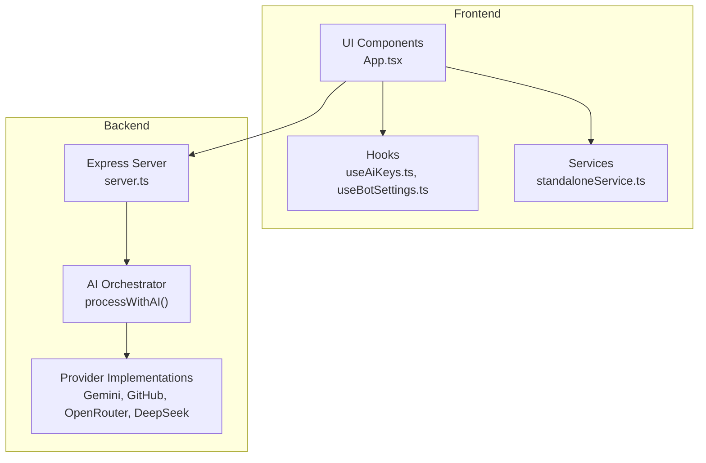
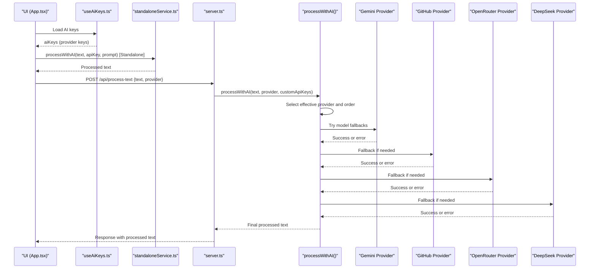
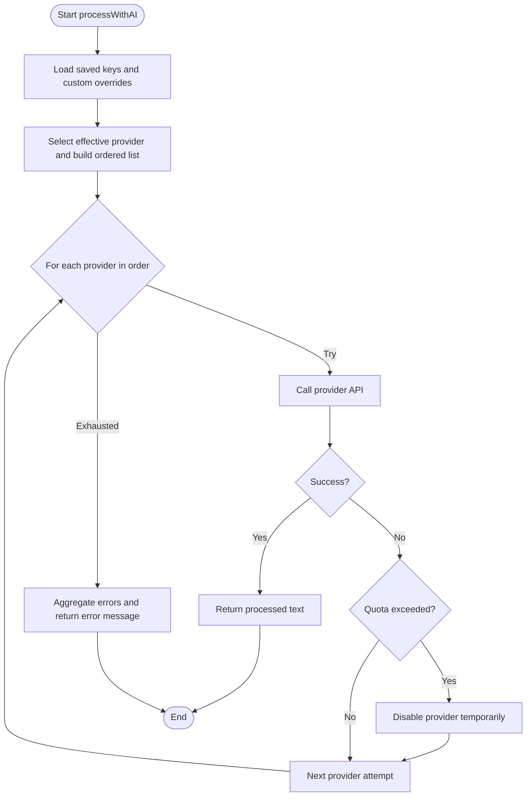
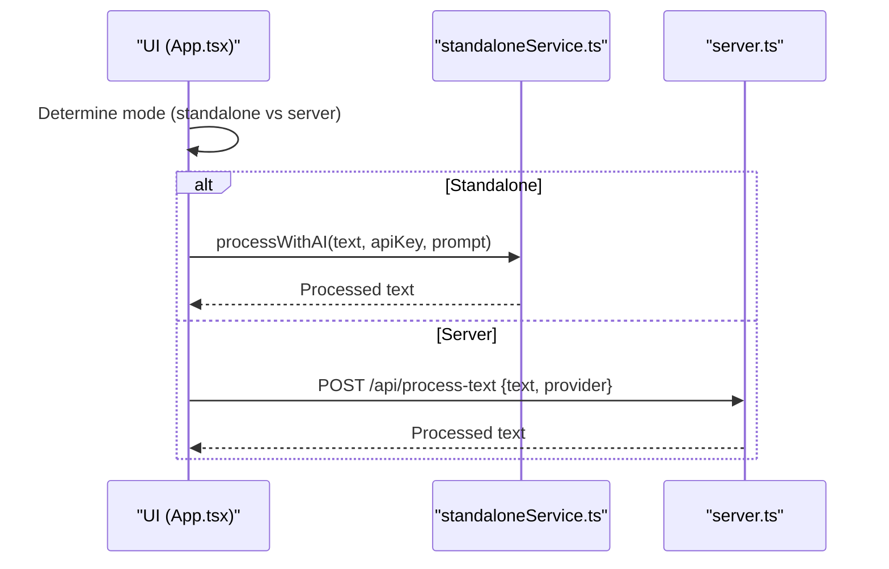
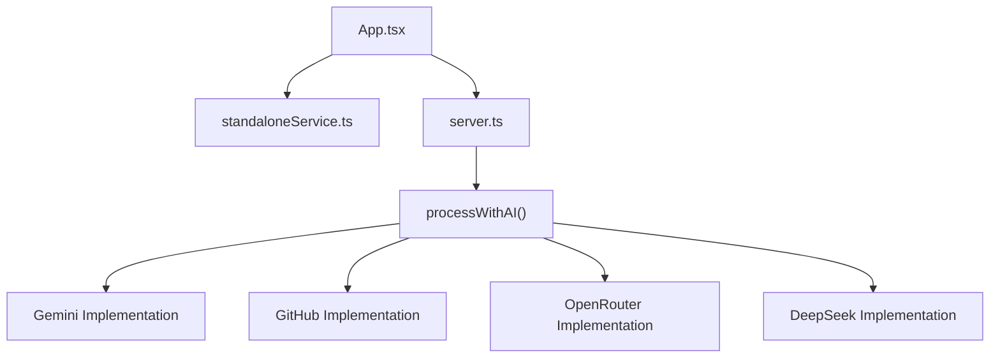

# Factory Pattern for Dynamic Instantiation

<cite>
**Referenced Files in This Document**
- [App.tsx](file://src/App.tsx)
- [server.ts](file://server.ts)
- [standaloneService.ts](file://src/services/standaloneService.ts)
- [useAiKeys.ts](file://src/hooks/useAiKeys.ts)
- [SettingsModal.tsx](file://src/components/SettingsModal.tsx)
- [useBotSettings.ts](file://src/hooks/useBotSettings.ts)
</cite>

## Table of Contents
1. [Introduction](#introduction)
2. [Project Structure](#project-structure)
3. [Core Components](#core-components)
4. [Architecture Overview](#architecture-overview)
5. [Detailed Component Analysis](#detailed-component-analysis)
6. [Dependency Analysis](#dependency-analysis)
7. [Performance Considerations](#performance-considerations)
8. [Troubleshooting Guide](#troubleshooting-guide)
9. [Conclusion](#conclusion)

## Introduction
This document explains the factory pattern implementation used for dynamic AI provider instantiation and service creation in the project. It demonstrates how runtime object creation is enabled through a centralized provider selection mechanism, configuration-based object creation, and dependency injection patterns. The goal is to show how the system supports extensible and maintainable AI service integration across multiple providers (Gemini, GitHub, OpenRouter, DeepSeek) with robust fallback and error handling.

## Project Structure
The factory pattern spans both frontend and backend components:
- Frontend orchestrates AI processing via a unified interface and delegates to either a standalone AI service or a server endpoint.
- Backend encapsulates provider-specific logic in a single orchestrator function that manages retries, quotas, and fallback ordering.

**Diagram sources**
- [App.tsx:811-864](file://src/App.tsx#L811-L864)
- [standaloneService.ts:148-159](file://src/services/standaloneService.ts#L148-L159)
- [server.ts:412-645](file://server.ts#L412-L645)

**Section sources**
- [App.tsx:811-864](file://src/App.tsx#L811-L864)
- [server.ts:412-645](file://server.ts#L412-L645)

## Core Components
- Provider orchestration: Centralized function that selects a provider, applies fallback logic, and handles quota and error conditions.
- Configuration-driven instantiation: Provider selection and key resolution are driven by persisted preferences and environment variables.
- Dependency injection: The orchestrator accepts optional custom keys to override defaults, enabling flexible service creation per request.
- Frontend delegation: The UI chooses between standalone AI processing and server-side processing based on runtime mode.

Key implementation references:
- Provider orchestration and fallback logic: [server.ts:412-645](file://server.ts#L412-L645)
- Frontend AI processing flow: [App.tsx:811-864](file://src/App.tsx#L811-L864)
- Standalone AI service: [standaloneService.ts:148-159](file://src/services/standaloneService.ts#L148-L159)
- AI key management: [useAiKeys.ts:1-56](file://src/hooks/useAiKeys.ts#L1-L56)

**Section sources**
- [server.ts:412-645](file://server.ts#L412-L645)
- [App.tsx:811-864](file://src/App.tsx#L811-L864)
- [standaloneService.ts:148-159](file://src/services/standaloneService.ts#L148-L159)
- [useAiKeys.ts:1-56](file://src/hooks/useAiKeys.ts#L1-L56)

## Architecture Overview
The factory pattern is implemented implicitly through a provider selection and orchestration layer. The system dynamically instantiates and invokes provider-specific services based on configuration and runtime conditions.

**Diagram sources**
- [App.tsx:811-864](file://src/App.tsx#L811-L864)
- [standaloneService.ts:148-159](file://src/services/standaloneService.ts#L148-L159)
- [server.ts:412-645](file://server.ts#L412-L645)

## Detailed Component Analysis

### Provider Orchestration and Fallback Logic
The backend orchestrator encapsulates the factory-like behavior by:
- Determining the effective provider from configuration or explicit parameter.
- Iterating through a prioritized list of providers with fallback attempts.
- Handling quota exhaustion and disabling affected providers temporarily.
- Aggregating and reporting errors across providers.

**Diagram sources**
- [server.ts:412-645](file://server.ts#L412-L645)

**Section sources**
- [server.ts:412-645](file://server.ts#L412-L645)

### Frontend AI Processing Delegation
The frontend decides whether to use standalone AI processing or delegate to the server:
- Standalone mode: Uses a dedicated AI service to process text locally.
- Server mode: Sends text to the backend for provider orchestration.

**Diagram sources**
- [App.tsx:811-864](file://src/App.tsx#L811-L864)
- [standaloneService.ts:148-159](file://src/services/standaloneService.ts#L148-L159)
- [server.ts:1157-1183](file://server.ts#L1157-L1183)

**Section sources**
- [App.tsx:811-864](file://src/App.tsx#L811-L864)
- [standaloneService.ts:148-159](file://src/services/standaloneService.ts#L148-L159)
- [server.ts:1157-1183](file://server.ts#L1157-L1183)

### Configuration-Based Object Creation and Dependency Injection
- Provider selection is driven by persisted preferences and optional overrides passed to the orchestrator.
- Keys are resolved from environment variables or saved settings, enabling flexible configuration per deployment.
- The orchestrator accepts custom keys to override defaults, acting as a form of dependency injection for runtime customization.

References:
- Provider selection and ordering: [server.ts:412-418](file://server.ts#L412-L418)
- Key resolution and environment fallback: [server.ts:450-452](file://server.ts#L450-L452), [server.ts:504-505](file://server.ts#L504-L505), [server.ts:567-568](file://server.ts#L567-L568), [server.ts:594-595](file://server.ts#L594-L595)
- Custom key injection: [server.ts:417-418](file://server.ts#L417-L418), [server.ts:1335-1336](file://server.ts#L1335-L1336)

**Section sources**
- [server.ts:412-418](file://server.ts#L412-L418)
- [server.ts:450-452](file://server.ts#L450-L452)
- [server.ts:504-505](file://server.ts#L504-L505)
- [server.ts:567-568](file://server.ts#L567-L568)
- [server.ts:594-595](file://server.ts#L594-L595)
- [server.ts:1335-1336](file://server.ts#L1335-L1336)

### Service Registration and Key Management
- AI keys are managed via a hook that loads and updates keys for multiple providers.
- Keys are persisted differently depending on standalone vs server mode, ensuring flexibility across environments.

References:
- AI key management hook: [useAiKeys.ts:1-56](file://src/hooks/useAiKeys.ts#L1-L56)
- Key persistence and retrieval: [standaloneService.ts:56-71](file://src/services/standaloneService.ts#L56-L71)

**Section sources**
- [useAiKeys.ts:1-56](file://src/hooks/useAiKeys.ts#L1-L56)
- [standaloneService.ts:56-71](file://src/services/standaloneService.ts#L56-L71)

### Settings Modal and Provider Selection UX
The settings modal allows users to configure providers and keys, demonstrating how the factory pattern integrates with the UI for dynamic selection and testing.

References:
- Settings modal component: [SettingsModal.tsx:1-107](file://src/components/SettingsModal.tsx#L1-L107)
- Provider key input and test actions: [App.tsx:1685-1720](file://src/App.tsx#L1685-L1720)

**Section sources**
- [SettingsModal.tsx:1-107](file://src/components/SettingsModal.tsx#L1-L107)
- [App.tsx:1685-1720](file://src/App.tsx#L1685-L1720)

## Dependency Analysis
The system exhibits low coupling and high cohesion around the provider orchestration layer:
- Frontend depends on a stable interface for AI processing (either standalone or server).
- Backend encapsulates provider specifics, exposing a single entry point for orchestration.
- Configuration and environment variables decouple provider selection from code changes.

**Diagram sources**
- [App.tsx:811-864](file://src/App.tsx#L811-L864)
- [standaloneService.ts:148-159](file://src/services/standaloneService.ts#L148-L159)
- [server.ts:412-645](file://server.ts#L412-L645)

**Section sources**
- [App.tsx:811-864](file://src/App.tsx#L811-L864)
- [standaloneService.ts:148-159](file://src/services/standaloneService.ts#L148-L159)
- [server.ts:412-645](file://server.ts#L412-L645)

## Performance Considerations
- Provider fallback reduces single-point-of-failure risk and improves availability.
- Quota-aware logic disables providers temporarily to avoid repeated failures.
- Rate limiting and timeouts protect both clients and external APIs.
- Environment-based configuration minimizes runtime branching overhead.

[No sources needed since this section provides general guidance]

## Troubleshooting Guide
Common issues and resolutions:
- Quota exceeded: The orchestrator detects quota limits and disables the affected provider temporarily. Users should switch providers or wait for the quota to reset.
- Authentication errors: Missing or invalid API keys lead to explicit errors. Verify keys in settings and test connectivity.
- Network timeouts: Timeouts are handled with retries; persistent failures indicate network or provider issues.

References:
- Quota detection and provider disabling: [server.ts:548-562](file://server.ts#L548-L562)
- Authentication checks and error logging: [server.ts:484-488](file://server.ts#L484-L488), [server.ts:621-625](file://server.ts#L621-L625)
- Error handling and user-friendly messages: [App.tsx:851-863](file://src/App.tsx#L851-L863)

**Section sources**
- [server.ts:548-562](file://server.ts#L548-L562)
- [server.ts:484-488](file://server.ts#L484-L488)
- [server.ts:621-625](file://server.ts#L621-L625)
- [App.tsx:851-863](file://src/App.tsx#L851-L863)

## Conclusion
The project implements a factory-like pattern through a centralized provider orchestrator that dynamically selects and instantiates AI services at runtime. By combining configuration-driven selection, dependency injection for custom keys, and robust fallback logic, the system achieves extensibility and maintainability. This design enables easy addition of new providers and resilient operation under varying conditions.