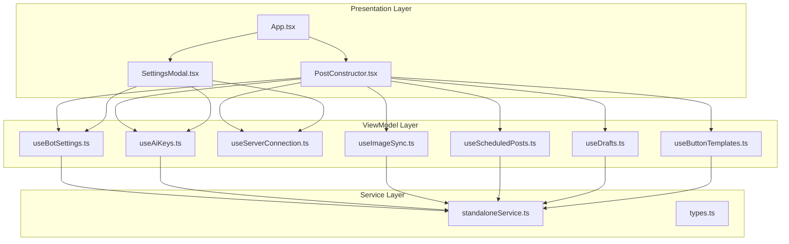
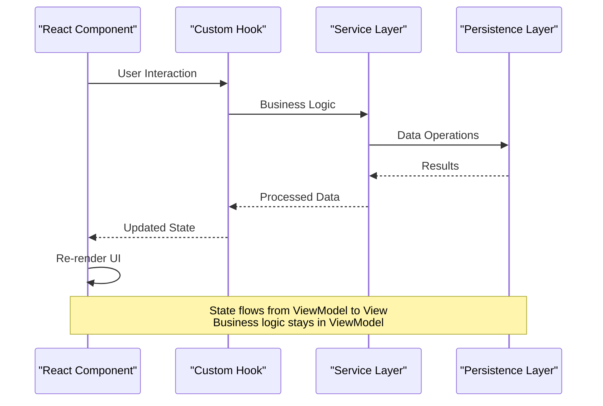
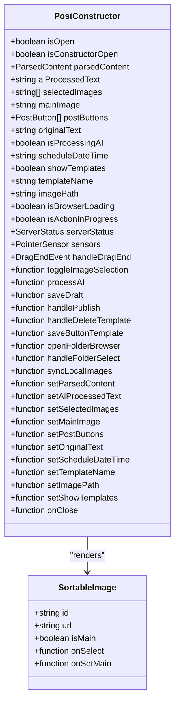
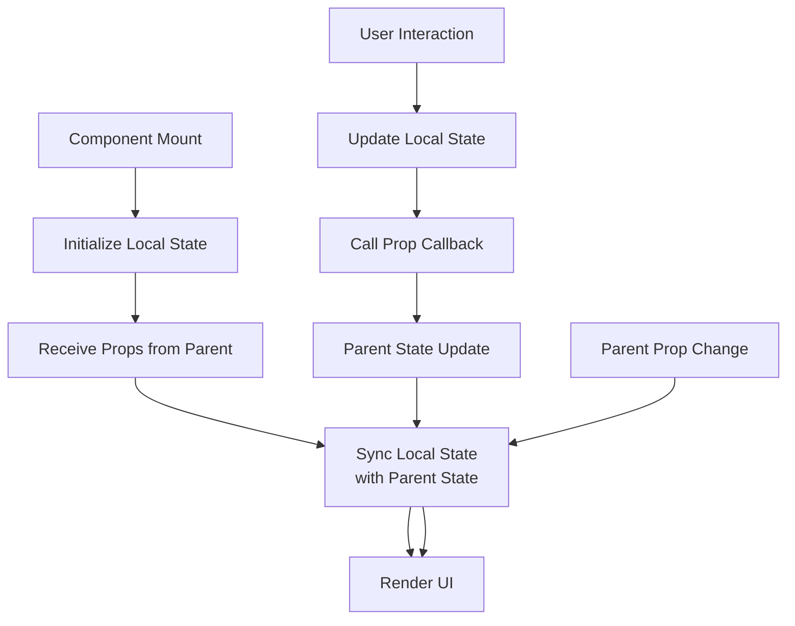
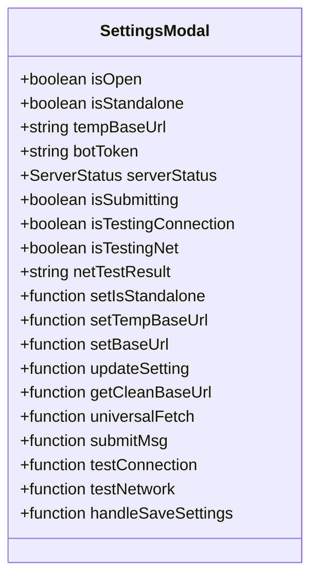
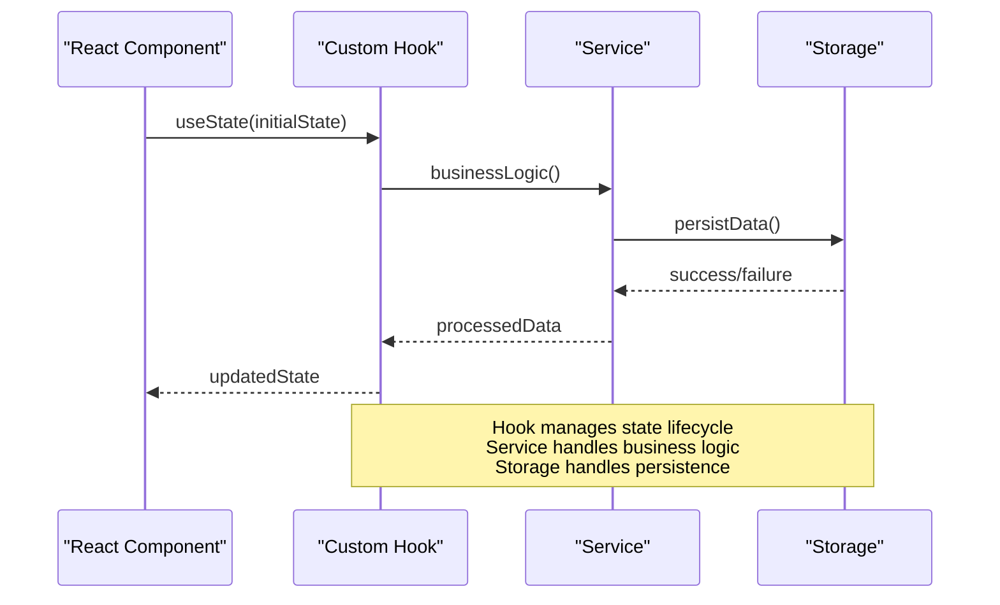
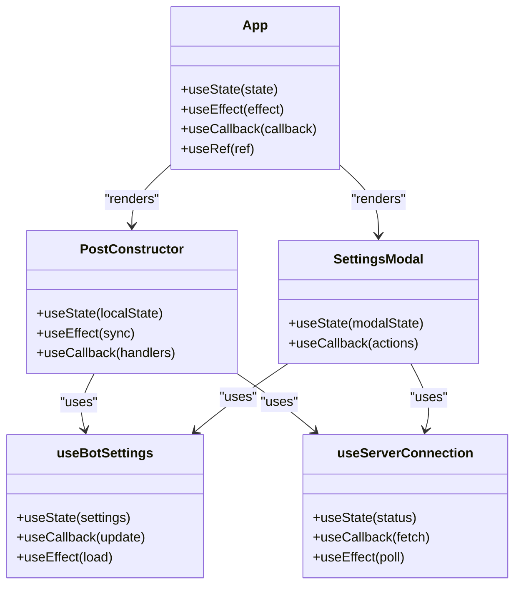

# MVVM Component Architecture

<cite>
**Referenced Files in This Document**
- [PostConstructor.tsx](file://src/components/PostConstructor.tsx)
- [SettingsModal.tsx](file://src/components/SettingsModal.tsx)
- [App.tsx](file://src/App.tsx)
- [useBotSettings.ts](file://src/hooks/useBotSettings.ts)
- [useAiKeys.ts](file://src/hooks/useAiKeys.ts)
- [useServerConnection.ts](file://src/hooks/useServerConnection.ts)
- [useImageSync.ts](file://src/hooks/useImageSync.ts)
- [useScheduledPosts.ts](file://src/hooks/useScheduledPosts.ts)
- [useDrafts.ts](file://src/hooks/useDrafts.ts)
- [useButtonTemplates.ts](file://src/hooks/useButtonTemplates.ts)
- [standaloneService.ts](file://src/services/standaloneService.ts)
- [types.ts](file://src/types.ts)
</cite>

## Table of Contents
1. [Introduction](#introduction)
2. [Project Structure](#project-structure)
3. [Core Components](#core-components)
4. [Architecture Overview](#architecture-overview)
5. [Detailed Component Analysis](#detailed-component-analysis)
6. [Dependency Analysis](#dependency-analysis)
7. [Performance Considerations](#performance-considerations)
8. [Troubleshooting Guide](#troubleshooting-guide)
9. [Conclusion](#conclusion)

## Introduction

This document explains the MVVM-like component architecture pattern implemented in this React project. The architecture separates UI concerns from business logic through a clear division between Views (React components), ViewModel-like hooks, and Services. The implementation demonstrates how React components manage UI state, how the ViewModel layer abstracts business logic, and how state synchronization works across the application.

The project implements two primary MVVM-style components:
- PostConstructor: A complex view that manages post creation state and user interactions
- SettingsModal: A focused view for configuration management

Both components demonstrate proper separation of concerns, with state management handled by ViewModel-like hooks and business logic encapsulated in service layers.

## Project Structure

The project follows a modular structure that supports MVVM-like separation:



**Diagram sources**
- [App.tsx:168-1888](file://src/App.tsx#L168-L1888)
- [PostConstructor.tsx:1-294](file://src/components/PostConstructor.tsx#L1-L294)
- [SettingsModal.tsx:1-107](file://src/components/SettingsModal.tsx#L1-L107)

**Section sources**
- [App.tsx:168-1888](file://src/App.tsx#L168-L1888)
- [PostConstructor.tsx:1-294](file://src/components/PostConstructor.tsx#L1-L294)
- [SettingsModal.tsx:1-107](file://src/components/SettingsModal.tsx#L1-L107)

## Core Components

The architecture centers around three key layers:

### View Layer (Components)
- **PostConstructor**: Manages post creation workflow with tabs, drag-and-drop image sorting, AI processing, and publishing controls
- **SettingsModal**: Handles application configuration including server settings, bot tokens, and AI key management
- **App**: Orchestrates the entire application state and coordinates between components

### ViewModel Layer (Hooks)
- **useBotSettings**: Manages bot configuration state with platform-aware persistence
- **useAiKeys**: Handles AI API key management with provider selection
- **useServerConnection**: Monitors server connectivity and status
- **useImageSync**: Manages image synchronization state and folder browsing
- **useScheduledPosts**: Handles scheduled post management
- **useDrafts**: Manages draft post CRUD operations
- **useButtonTemplates**: Handles button template management

### Service Layer (Utilities)
- **standaloneService**: Provides platform-aware storage and Telegram API integration
- **Types**: Defines data structures for posts, buttons, and configuration

**Section sources**
- [PostConstructor.tsx:50-94](file://src/components/PostConstructor.tsx#L50-L94)
- [SettingsModal.tsx:5-26](file://src/components/SettingsModal.tsx#L5-L26)
- [useBotSettings.ts:5-55](file://src/hooks/useBotSettings.ts#L5-L55)
- [standaloneService.ts:11-72](file://src/services/standaloneService.ts#L11-L72)

## Architecture Overview

The MVVM implementation follows these principles:



**Diagram sources**
- [App.tsx:267-283](file://src/App.tsx#L267-L283)
- [useBotSettings.ts:25-43](file://src/hooks/useBotSettings.ts#L25-L43)
- [standaloneService.ts:25-71](file://src/services/standaloneService.ts#L25-L71)

The architecture ensures:
- **Separation of Concerns**: Views handle UI presentation, ViewModels handle state management, Services handle business logic
- **State Management**: Centralized state in hooks with controlled updates
- **Platform Abstraction**: Services adapt to native vs web environments
- **Data Persistence**: Consistent storage APIs across platforms

## Detailed Component Analysis

### PostConstructor Component Analysis

The PostConstructor component exemplifies MVVM implementation with comprehensive state management:



**Diagram sources**
- [PostConstructor.tsx:50-94](file://src/components/PostConstructor.tsx#L50-L94)
- [PostConstructor.tsx:103-118](file://src/components/PostConstructor.tsx#L103-L118)

#### State Management Patterns

The component implements several MVVM patterns:

1. **Local State for UI Responsiveness**: Uses local state for immediate UI feedback while maintaining parent state for persistence
2. **Prop-Driven Updates**: All state changes flow through callback props to the parent
3. **Controlled Components**: Text areas and inputs are controlled by component state
4. **Event-Driven Updates**: User interactions trigger state updates through handler functions

#### Lifecycle Patterns



**Diagram sources**
- [PostConstructor.tsx:96-108](file://src/components/PostConstructor.tsx#L96-L108)
- [PostConstructor.tsx:101-103](file://src/components/PostConstructor.tsx#L101-L103)

**Section sources**
- [PostConstructor.tsx:96-108](file://src/components/PostConstructor.tsx#L96-L108)
- [PostConstructor.tsx:101-103](file://src/components/PostConstructor.tsx#L101-L103)

### SettingsModal Component Analysis

The SettingsModal demonstrates focused MVVM implementation for configuration management:



**Diagram sources**
- [SettingsModal.tsx:5-26](file://src/components/SettingsModal.tsx#L5-L26)

#### Configuration State Management

The component manages multiple configuration aspects:
- **Mode Selection**: Toggle between standalone and server modes
- **URL Management**: Handle base URL validation and cleaning
- **Token Management**: Store and validate bot tokens
- **Connection Testing**: Verify server connectivity and network status

**Section sources**
- [SettingsModal.tsx:28-33](file://src/components/SettingsModal.tsx#L28-L33)
- [SettingsModal.tsx:1313-1344](file://src/App.tsx#L1313-L1344)

### ViewModel Hook Implementation

The ViewModel hooks demonstrate MVVM patterns through encapsulated state management:



**Diagram sources**
- [useBotSettings.ts:9-23](file://src/hooks/useBotSettings.ts#L9-L23)
- [useBotSettings.ts:25-43](file://src/hooks/useBotSettings.ts#L25-L43)

#### Hook State Patterns

Each hook follows consistent patterns:
- **State Initialization**: Initialize state with default values
- **Data Loading**: Load persisted data on mount
- **State Updates**: Provide update functions with validation
- **Side Effects**: Handle asynchronous operations with loading states
- **Cleanup**: Properly clean up resources and subscriptions

**Section sources**
- [useBotSettings.ts:9-23](file://src/hooks/useBotSettings.ts#L9-L23)
- [useBotSettings.ts:25-43](file://src/hooks/useBotSettings.ts#L25-L43)
- [useAiKeys.ts:8-35](file://src/hooks/useAiKeys.ts#L8-L35)

## Dependency Analysis

The architecture maintains clear dependency boundaries:

```mermaid
graph TB
subgraph "External Dependencies"
React[React Core]
Capacitor[Capacitor APIs]
DnDKit[@dnd-kit]
Motion[motion/react]
end
subgraph "Internal Dependencies"
App[App.tsx]
Hooks[Custom Hooks]
Services[Service Layer]
Types[Type Definitions]
end
App --> Hooks
Hooks --> Services
Hooks --> Types
Services --> Capacitor
App --> React
App --> DnDKit
App --> Motion
```

**Diagram sources**
- [App.tsx:15-46](file://src/App.tsx#L15-L46)
- [PostConstructor.tsx:1-10](file://src/components/PostConstructor.tsx#L1-L10)

### Component Dependencies



**Diagram sources**
- [App.tsx:168-1888](file://src/App.tsx#L168-L1888)
- [PostConstructor.tsx:96-294](file://src/components/PostConstructor.tsx#L96-L294)
- [SettingsModal.tsx:28-107](file://src/components/SettingsModal.tsx#L28-L107)

**Section sources**
- [App.tsx:168-1888](file://src/App.tsx#L168-L1888)
- [PostConstructor.tsx:96-294](file://src/components/PostConstructor.tsx#L96-L294)
- [SettingsModal.tsx:28-107](file://src/components/SettingsModal.tsx#L28-L107)

## Performance Considerations

The architecture implements several performance optimization patterns:

### State Optimization
- **Selective Updates**: Hooks use `useCallback` to prevent unnecessary re-renders
- **Memoization**: `useMemo` patterns prevent expensive calculations
- **Debounced Operations**: Network requests are debounced to reduce API calls

### Platform-Specific Optimizations
- **Native vs Web**: Services adapt to platform capabilities
- **Filesystem Access**: Native filesystem APIs for better performance
- **HTTP Requests**: Capacitor HTTP for improved reliability

### Memory Management
- **Cleanup Functions**: Proper cleanup of intervals and subscriptions
- **Resource Limits**: Image selection limits to prevent memory issues
- **Lazy Loading**: Content loaded only when needed

## Troubleshooting Guide

### Common Issues and Solutions

#### State Synchronization Problems
- **Issue**: UI state not updating after data changes
- **Solution**: Ensure prop callbacks are properly passed down and state updates are triggered
- **Prevention**: Use controlled components and explicit state synchronization

#### Platform-Specific Issues
- **Issue**: Storage operations failing on web
- **Solution**: Check platform detection and use appropriate fallbacks
- **Prevention**: Always validate platform capabilities before operations

#### Network Connectivity
- **Issue**: Server connection timeouts
- **Solution**: Implement retry logic and connection testing
- **Prevention**: Use exponential backoff and proper error handling

**Section sources**
- [App.tsx:572-610](file://src/App.tsx#L572-L610)
- [useServerConnection.ts:20-42](file://src/hooks/useServerConnection.ts#L20-L42)

## Conclusion

This MVVM-like architecture successfully separates concerns across three distinct layers:

**Views** (React components) handle UI presentation and user interactions
**ViewModels** (custom hooks) manage state and business logic
**Services** (utility modules) provide platform abstraction and data persistence

The implementation demonstrates robust patterns for:
- State management through hooks
- Platform abstraction with service layers
- Component lifecycle management
- Error handling and recovery
- Performance optimization

The PostConstructor and SettingsModal components serve as excellent examples of how to implement MVVM patterns in React, with clear separation of concerns and maintainable code structure. The architecture supports both standalone and server modes while maintaining consistent behavior across different deployment targets.