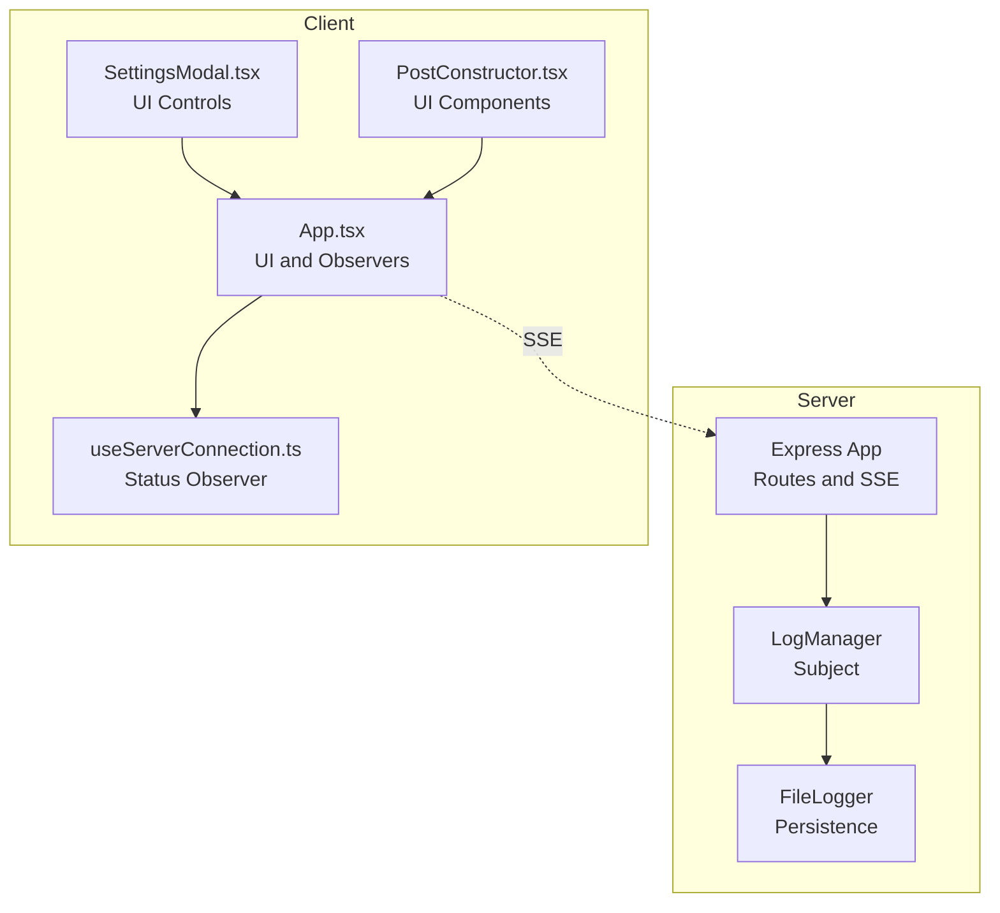
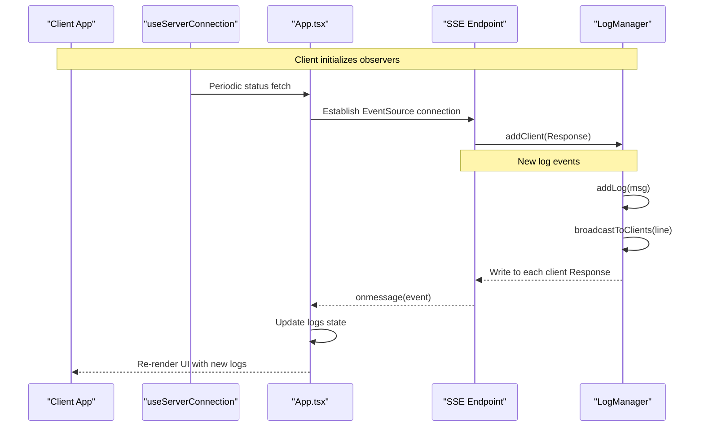
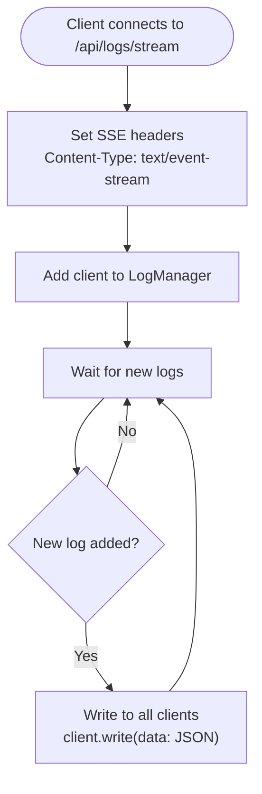
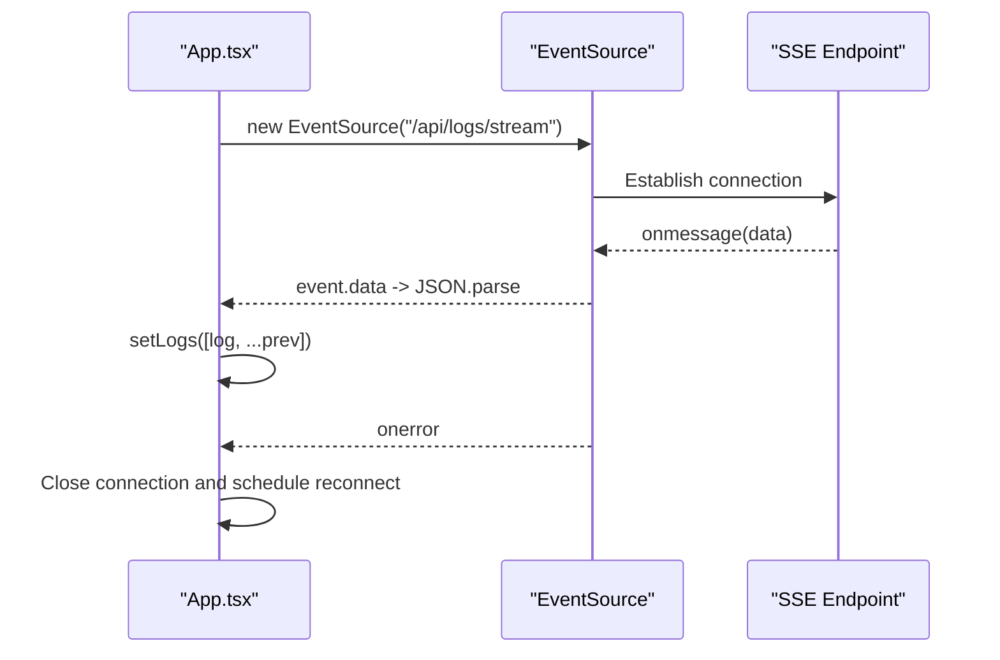
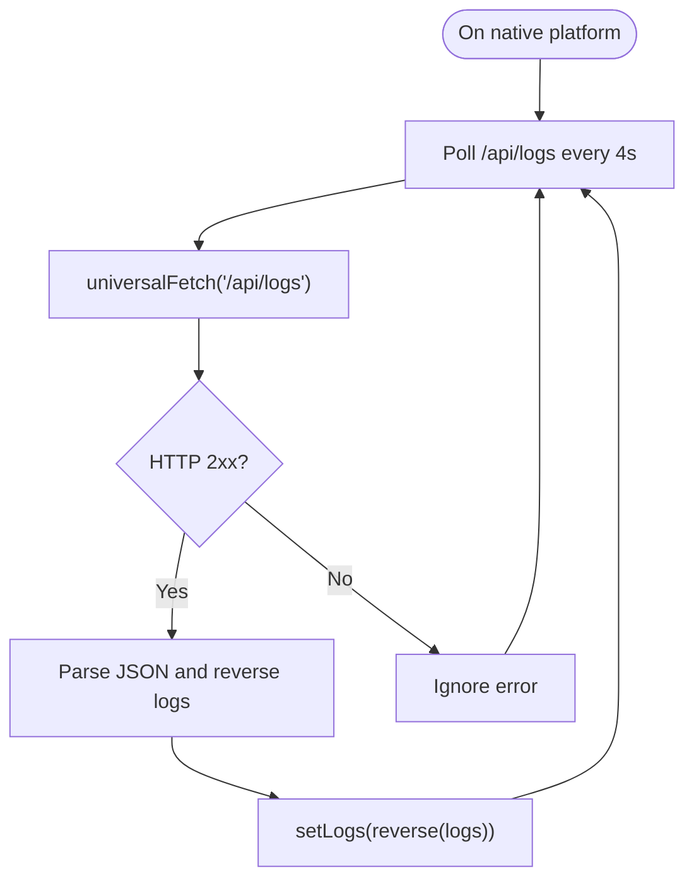
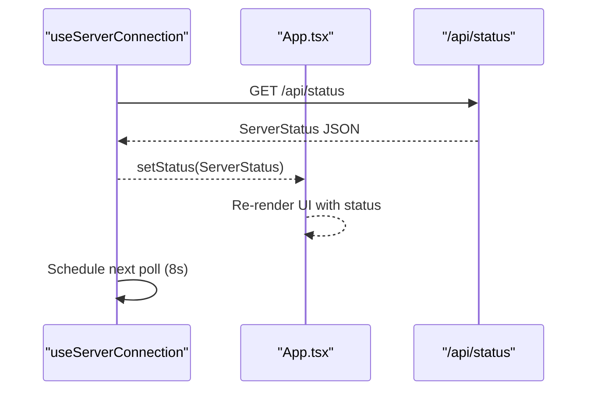
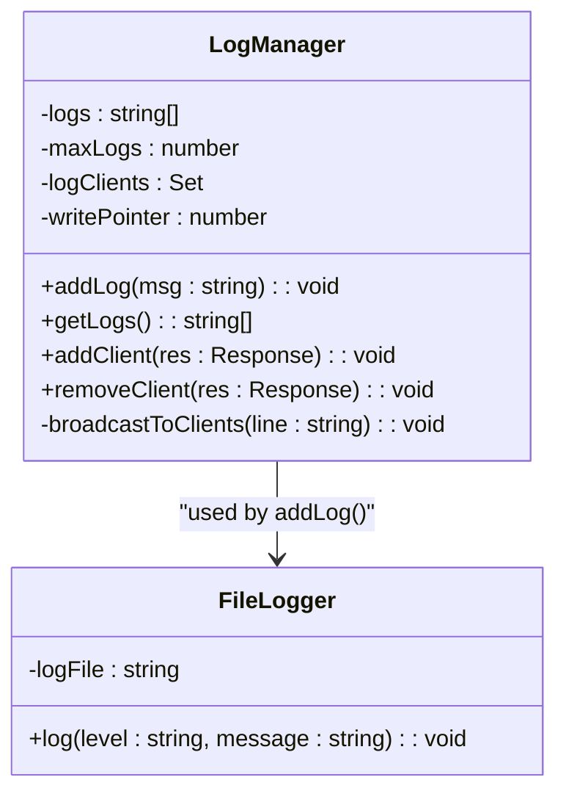
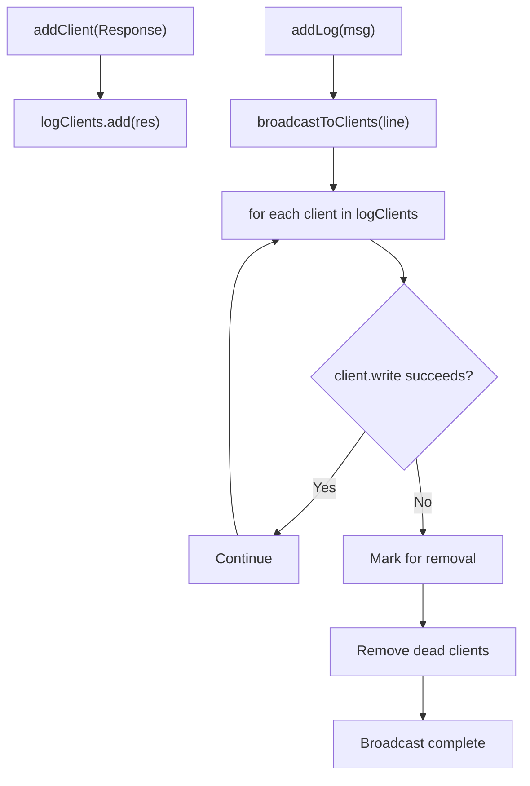
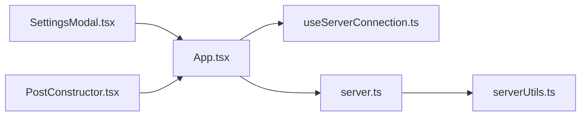

# Observer Pattern for Real-time Updates

<cite>
**Referenced Files in This Document**
- [server.ts](file://server.ts)
- [App.tsx](file://src/App.tsx)
- [useServerConnection.ts](file://src/hooks/useServerConnection.ts)
- [serverUtils.ts](file://src/serverUtils.ts)
- [SettingsModal.tsx](file://src/components/SettingsModal.tsx)
- [PostConstructor.tsx](file://src/components/PostConstructor.tsx)
- [README.md](file://README.md)
</cite>

## Table of Contents
1. [Introduction](#introduction)
2. [Project Structure](#project-structure)
3. [Core Components](#core-components)
4. [Architecture Overview](#architecture-overview)
5. [Detailed Component Analysis](#detailed-component-analysis)
6. [Dependency Analysis](#dependency-analysis)
7. [Performance Considerations](#performance-considerations)
8. [Troubleshooting Guide](#troubleshooting-guide)
9. [Conclusion](#conclusion)

## Introduction
This document explains how the project implements the observer pattern to enable real-time log streaming and status updates using Server-Sent Events (SSE). It covers the server-side log manager, client-side observers, automatic update mechanisms, and practical examples of reactive UI updates. The pattern ensures loose coupling between the logging subject and multiple observers, delivering efficient real-time communication without constant polling overhead.

## Project Structure
The project consists of:
- A Node.js/Express server that manages logs, exposes SSE endpoints, and serves API routes
- A React client that observes server status and real-time log streams
- Hooks and components that subscribe to updates and render reactive UI changes

**Diagram sources**
- [server.ts:218-280](file://server.ts#L218-L280)
- [server.ts:342-352](file://server.ts#L342-L352)
- [App.tsx:651-698](file://src/App.tsx#L651-L698)
- [useServerConnection.ts:15-51](file://src/hooks/useServerConnection.ts#L15-L51)

**Section sources**
- [README.md:1-25](file://README.md#L1-L25)
- [server.ts:342-352](file://server.ts#L342-L352)
- [App.tsx:651-698](file://src/App.tsx#L651-L698)

## Core Components
- Server-side Log Manager (subject): Maintains a circular buffer of recent logs, tracks connected clients, and broadcasts new log entries to all observers.
- SSE Endpoint: Provides a long-lived connection for real-time log delivery to browsers.
- Client-side Observers:
  - Status observer: Polls server status periodically to keep UI synchronized.
  - Log observer: Subscribes to SSE for real-time log updates in web environments.
  - Native fallback: Polls logs endpoint in Android WebView where SSE is not supported.

Key responsibilities:
- Subject: LogManager handles addLog, broadcastToClients, and client lifecycle
- Observers: App.tsx sets up SSE subscription and periodic status polling
- Loose coupling: Observers subscribe/unsubscribe without knowing each other

**Section sources**
- [server.ts:218-280](file://server.ts#L218-L280)
- [server.ts:342-352](file://server.ts#L342-L352)
- [App.tsx:651-698](file://src/App.tsx#L651-L698)
- [useServerConnection.ts:15-51](file://src/hooks/useServerConnection.ts#L15-L51)

## Architecture Overview
The observer pattern is implemented as follows:
- Subject: LogManager stores logs and maintains a set of connected clients
- Observer: Client establishes SSE connection to /api/logs/stream
- Automatic updates: Each new log triggers broadcastToClients, which writes to each client’s response stream
- Reactive UI: Client updates state and re-renders UI without polling

**Diagram sources**
- [server.ts:218-280](file://server.ts#L218-L280)
- [server.ts:342-352](file://server.ts#L342-L352)
- [App.tsx:651-698](file://src/App.tsx#L651-L698)
- [useServerConnection.ts:15-51](file://src/hooks/useServerConnection.ts#L15-L51)

## Detailed Component Analysis

### Server-Sent Events (SSE) Implementation
- SSE endpoint: GET /api/logs/stream sets appropriate headers and registers the client with the log manager
- Client lifecycle: On close, the server removes the client from the set to prevent writes to closed connections
- Broadcast mechanism: Each new log is written to all connected clients using the underlying response stream

**Diagram sources**
- [server.ts:342-352](file://server.ts#L342-L352)
- [server.ts:247-257](file://server.ts#L247-L257)

**Section sources**
- [server.ts:342-352](file://server.ts#L342-L352)
- [server.ts:247-257](file://server.ts#L247-L257)

### Client-Side Log Observer (Web)
- SSE subscription: App.tsx creates an EventSource to /api/logs/stream when not on native platform
- Real-time updates: onmessage parses incoming log data and prepends to the logs state
- Error handling: onerror closes the connection and schedules a reconnect after a delay

**Diagram sources**
- [App.tsx:651-679](file://src/App.tsx#L651-L679)

**Section sources**
- [App.tsx:651-679](file://src/App.tsx#L651-L679)

### Client-Side Log Observer (Android WebView)
- Native fallback: When on native platform, App.tsx polls /api/logs every 4 seconds
- Polling behavior: Fetches logs, reverses order, and updates state

**Diagram sources**
- [App.tsx:681-698](file://src/App.tsx#L681-L698)

**Section sources**
- [App.tsx:681-698](file://src/App.tsx#L681-L698)

### Server Status Observer
- Periodic polling: useServerConnection.ts fetches /api/status every 8 seconds
- UI synchronization: Updates status state used by SettingsModal and other components

**Diagram sources**
- [useServerConnection.ts:15-51](file://src/hooks/useServerConnection.ts#L15-L51)
- [server.ts:975-989](file://server.ts#L975-L989)

**Section sources**
- [useServerConnection.ts:15-51](file://src/hooks/useServerConnection.ts#L15-L51)
- [server.ts:975-989](file://server.ts#L975-L989)

### Log Management System
- Circular buffer: LogManager stores up to N recent logs using a write pointer
- Client registry: Tracks connected clients in a Set for broadcasting
- Persistence: FileLogger writes formatted log lines to disk for audit trails

**Diagram sources**
- [server.ts:218-280](file://server.ts#L218-L280)
- [serverUtils.ts:7-22](file://src/serverUtils.ts#L7-L22)

**Section sources**
- [server.ts:218-280](file://server.ts#L218-L280)
- [serverUtils.ts:7-22](file://src/serverUtils.ts#L7-L22)

### Client Connection Handling and Broadcast Mechanisms
- SSE registration: addClient adds the response to the client set
- Broadcast loop: broadcastToClients iterates over clients and writes data lines
- Dead client cleanup: Removes clients that throw during write to avoid future errors

**Diagram sources**
- [server.ts:259-257](file://server.ts#L259-L257)
- [server.ts:247-257](file://server.ts#L247-L257)

**Section sources**
- [server.ts:259-257](file://server.ts#L259-L257)
- [server.ts:247-257](file://server.ts#L247-L257)

### Examples of Log Streaming Implementation and Real-time UI Updates
- Web real-time logs: App.tsx receives SSE events and prepends new logs to the UI list
- Native polling logs: App.tsx polls /api/logs and updates the UI with reversed logs
- Status-driven UI: useServerConnection.ts keeps server status fresh; SettingsModal displays current bot and token state

Benefits demonstrated:
- Reactive UI updates without polling overhead in browsers
- Graceful fallback to polling on Android
- Loose coupling: observers subscribe independently and do not depend on each other

**Section sources**
- [App.tsx:651-698](file://src/App.tsx#L651-L698)
- [useServerConnection.ts:15-51](file://src/hooks/useServerConnection.ts#L15-L51)
- [SettingsModal.tsx:28-106](file://src/components/SettingsModal.tsx#L28-L106)

## Dependency Analysis
- Server depends on:
  - Express for routing and SSE headers
  - Cheerio and marked for content processing
  - Telegraf for Telegram bot operations
  - Rate limiters for API protection
- Client depends on:
  - CapacitorHttp for native HTTP requests
  - React hooks for state and effects
  - Lucide icons and motion for UI

**Diagram sources**
- [App.tsx:651-698](file://src/App.tsx#L651-L698)
- [useServerConnection.ts:15-51](file://src/hooks/useServerConnection.ts#L15-L51)
- [server.ts:218-280](file://server.ts#L218-L280)
- [serverUtils.ts:7-22](file://src/serverUtils.ts#L7-L22)
- [SettingsModal.tsx:28-106](file://src/components/SettingsModal.tsx#L28-L106)
- [PostConstructor.tsx:96-294](file://src/components/PostConstructor.tsx#L96-L294)

**Section sources**
- [server.ts:1-17](file://server.ts#L1-L17)
- [App.tsx:168-170](file://src/App.tsx#L168-L170)

## Performance Considerations
- SSE efficiency: Reduces CPU and bandwidth compared to frequent polling by keeping a single persistent connection
- Client cleanup: Dead client removal prevents memory leaks and avoids unnecessary writes
- Circular buffer: Fixed-size log storage limits memory usage and simplifies retrieval
- Native fallback: Polling interval tuned to balance responsiveness and resource usage

## Troubleshooting Guide
Common issues and resolutions:
- SSE not supported in Android WebView:
  - Behavior: App.tsx detects native platform and falls back to polling logs endpoint
  - Resolution: Ensure /api/logs is reachable and returns 2xx responses
- SSE connection failures:
  - Behavior: onerror closes connection and schedules reconnect
  - Resolution: Verify server SSE route and network connectivity
- Status polling errors:
  - Behavior: useServerConnection.ts catches errors and clears status
  - Resolution: Confirm /api/status availability and CORS configuration
- Dead clients causing errors:
  - Behavior: broadcastToClients removes clients that throw during write
  - Resolution: Monitor server logs and client count to detect connection issues

**Section sources**
- [App.tsx:651-698](file://src/App.tsx#L651-L698)
- [useServerConnection.ts:15-51](file://src/hooks/useServerConnection.ts#L15-L51)
- [server.ts:247-257](file://server.ts#L247-L257)

## Conclusion
The observer pattern implementation leverages SSE for efficient, real-time log streaming and integrates seamlessly with React’s declarative UI updates. The server-side LogManager acts as a subject, while the client establishes observers that reactively update the UI. The design maintains loose coupling, supports graceful fallbacks, and delivers responsive user experiences across platforms.