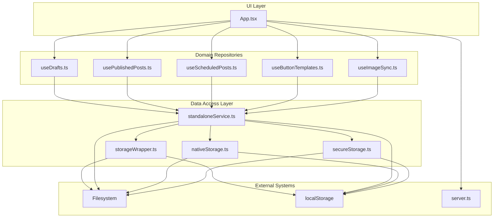
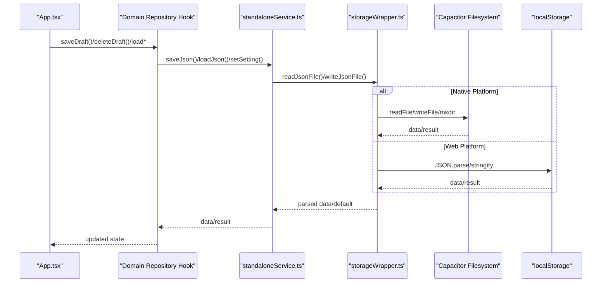
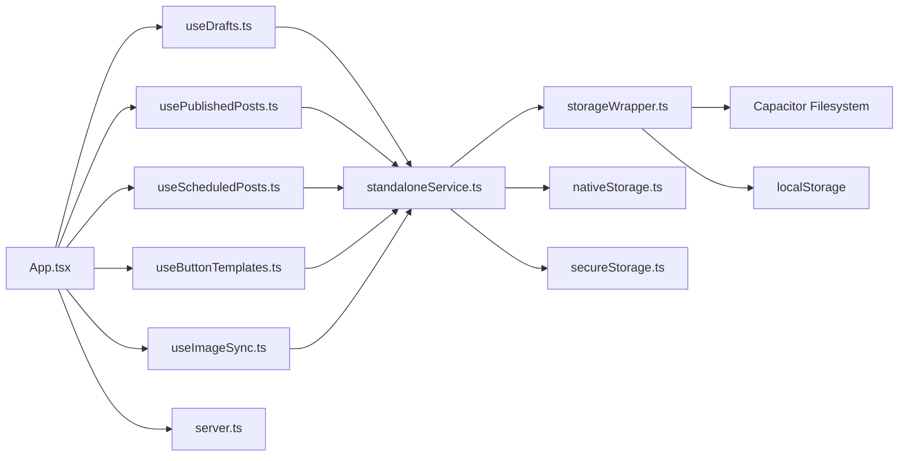

# Repository Pattern for Data Access

<cite>
**Referenced Files in This Document**
- [storageWrapper.ts](file://src/services/storageWrapper.ts)
- [standaloneService.ts](file://src/services/standaloneService.ts)
- [nativeStorage.ts](file://src/services/nativeStorage.ts)
- [secureStorage.ts](file://src/services/secureStorage.ts)
- [useDrafts.ts](file://src/hooks/useDrafts.ts)
- [usePublishedPosts.ts](file://src/hooks/usePublishedPosts.ts)
- [useScheduledPosts.ts](file://src/hooks/useScheduledPosts.ts)
- [useButtonTemplates.ts](file://src/hooks/useButtonTemplates.ts)
- [useImageSync.ts](file://src/hooks/useImageSync.ts)
- [types.ts](file://src/types.ts)
- [App.tsx](file://src/App.tsx)
- [server.ts](file://server.ts)
</cite>

## Table of Contents
1. [Introduction](#introduction)
2. [Project Structure](#project-structure)
3. [Core Components](#core-components)
4. [Architecture Overview](#architecture-overview)
5. [Detailed Component Analysis](#detailed-component-analysis)
6. [Dependency Analysis](#dependency-analysis)
7. [Performance Considerations](#performance-considerations)
8. [Troubleshooting Guide](#troubleshooting-guide)
9. [Conclusion](#conclusion)

## Introduction
This document explains how the repository pattern is implemented in the project to abstract data access across multiple storage backends (filesystem, Capacitor filesystem, browser localStorage, and server APIs). It focuses on how storageWrapper provides a unified interface for file operations, how standaloneService encapsulates local storage operations, and how hooks act as repositories for domain-specific collections (drafts, published posts, scheduled posts, button templates). The pattern cleanly separates business logic from persistence, supports testability via interface abstraction, and enables flexible backend switching without changing application logic.

## Project Structure
The repository pattern spans three layers:
- Data Access Layer: storage abstractions (storageWrapper, standaloneService, nativeStorage, secureStorage)
- Domain Repositories: React hooks that expose domain-specific collections and operations
- Business Logic Layer: App.tsx orchestrates UI actions, calls repository methods, and manages state transitions

**Diagram sources**
- [App.tsx:168-1888](file://src/App.tsx#L168-L1888)
- [useDrafts.ts:1-88](file://src/hooks/useDrafts.ts#L1-L88)
- [usePublishedPosts.ts:1-38](file://src/hooks/usePublishedPosts.ts#L1-L38)
- [useScheduledPosts.ts:1-38](file://src/hooks/useScheduledPosts.ts#L1-L38)
- [useButtonTemplates.ts:1-38](file://src/hooks/useButtonTemplates.ts#L1-L38)
- [useImageSync.ts:1-42](file://src/hooks/useImageSync.ts#L1-L42)
- [storageWrapper.ts:1-100](file://src/services/storageWrapper.ts#L1-L100)
- [standaloneService.ts:1-175](file://src/services/standaloneService.ts#L1-L175)
- [nativeStorage.ts:1-63](file://src/services/nativeStorage.ts#L1-L63)
- [secureStorage.ts:1-40](file://src/services/secureStorage.ts#L1-L40)
- [server.ts:1-800](file://server.ts#L1-L800)

**Section sources**
- [App.tsx:168-1888](file://src/App.tsx#L168-L1888)
- [storageWrapper.ts:1-100](file://src/services/storageWrapper.ts#L1-L100)
- [standaloneService.ts:1-175](file://src/services/standaloneService.ts#L1-L175)

## Core Components
This section documents the core repository abstractions and their roles.

- storageWrapper.ts
  - Provides unified JSON/text read/write operations for both native and web environments
  - Handles platform detection and delegates to Capacitor Filesystem or Node.js fs for native, and localStorage for web
  - Offers consistent defaults and error handling for missing files

- standaloneService.ts
  - Encapsulates local storage operations for standalone mode
  - Exposes save/load for JSON files and settings
  - Initializes platform-specific directories and provides a single storage facade

- nativeStorage.ts
  - Platform-aware storage for JSON files and preferences
  - Uses Capacitor Filesystem on native and localStorage on web
  - Includes token and chat ID helpers

- secureStorage.ts
  - Encrypted token storage abstraction
  - Uses Capacitor Preferences on native and localStorage fallback on web
  - Provides set/get/remove operations with a prefixed key scheme

- Domain Hooks (Repositories)
  - useDrafts.ts: Loads/saves drafts, deletes drafts, and synchronizes with server or local storage
  - usePublishedPosts.ts: Loads published posts from server or local storage
  - useScheduledPosts.ts: Loads scheduled posts from server or local storage
  - useButtonTemplates.ts: Loads button templates from server or local storage
  - useImageSync.ts: Manages image path settings and related UI state

These components collectively implement the repository pattern by:
- Hiding persistence details behind simple interfaces
- Supporting multiple backends transparently
- Returning consistent data structures and defaults
- Enabling testability through interface abstraction

**Section sources**
- [storageWrapper.ts:1-100](file://src/services/storageWrapper.ts#L1-L100)
- [standaloneService.ts:11-72](file://src/services/standaloneService.ts#L11-L72)
- [nativeStorage.ts:8-62](file://src/services/nativeStorage.ts#L8-L62)
- [secureStorage.ts:4-39](file://src/services/secureStorage.ts#L4-L39)
- [useDrafts.ts:5-88](file://src/hooks/useDrafts.ts#L5-L88)
- [usePublishedPosts.ts:5-38](file://src/hooks/usePublishedPosts.ts#L5-L38)
- [useScheduledPosts.ts:5-38](file://src/hooks/useScheduledPosts.ts#L5-L38)
- [useButtonTemplates.ts:5-38](file://src/hooks/useButtonTemplates.ts#L5-L38)
- [useImageSync.ts:5-42](file://src/hooks/useImageSync.ts#L5-L42)

## Architecture Overview
The repository pattern ensures that business logic remains agnostic of storage mechanisms. The flow below illustrates how UI actions interact with repositories and storage abstractions.

**Diagram sources**
- [App.tsx:874-903](file://src/App.tsx#L874-L903)
- [useDrafts.ts:31-54](file://src/hooks/useDrafts.ts#L31-L54)
- [standaloneService.ts:25-54](file://src/services/standaloneService.ts#L25-L54)
- [storageWrapper.ts:10-54](file://src/services/storageWrapper.ts#L10-L54)

## Detailed Component Analysis

### storageWrapper.ts: Unified File Operations
- Purpose: Abstract file system operations across platforms
- Key capabilities:
  - readJsonFile<T>(filePath, defaultValue): reads JSON with platform-specific path handling and returns default on error
  - writeJsonFile(filePath, data): writes JSON with mkdir and encoding
  - readTextFile(filePath, defaultValue): reads text with trimming and default fallback
  - writeTextFile(filePath, content): writes text with platform-specific handling
- Platform logic:
  - Detects native vs web via Capacitor
  - Uses Capacitor Filesystem for native, Node.js fs for SSR, and localStorage for web
- Error handling:
  - Returns defaults on read failures
  - Logs and swallows write errors to avoid blocking UI

Benefits:
- Enables seamless switching between native filesystem and web storage
- Centralizes path normalization and encoding logic
- Provides consistent return types for consumers

**Section sources**
- [storageWrapper.ts:1-100](file://src/services/storageWrapper.ts#L1-L100)

### standaloneService.ts: Local Storage Repository
- Purpose: Provide a single storage facade for standalone mode
- Key capabilities:
  - init(): creates platform-specific directories
  - saveJson(filename, data), loadJson(filename, default): JSON persistence
  - setSetting(key, value), getSetting(key): settings persistence
- Integration:
  - Delegates to storageWrapper for file operations
  - Uses Capacitor Preferences for settings on native
  - Uses localStorage on web

Benefits:
- Encapsulates platform differences behind a simple API
- Centralizes initialization and directory creation
- Supports both JSON and key-value settings

**Section sources**
- [standaloneService.ts:11-72](file://src/services/standaloneService.ts#L11-L72)

### nativeStorage.ts: Platform-Aware Storage
- Purpose: JSON and preference storage with platform awareness
- Key capabilities:
  - ensureDataDir(): ensures data directory exists on native
  - readJsonFile(filename, default), writeJsonFile(filename, data)
  - getToken/setToken/getChatId/setChatId: preference management
- Integration:
  - Uses Capacitor Filesystem on native, localStorage on web
  - Falls back to localStorage for preferences on web

Benefits:
- Separates concerns between file storage and preferences
- Provides robust defaults and error resilience

**Section sources**
- [nativeStorage.ts:8-62](file://src/services/nativeStorage.ts#L8-L62)

### secureStorage.ts: Encrypted Token Storage
- Purpose: Secure token storage abstraction
- Key capabilities:
  - setToken(key, value), getToken(key), removeToken(key)
  - Prefixes keys to avoid collisions
- Integration:
  - Uses Capacitor Preferences on native
  - Uses localStorage on web with a warning

Benefits:
- Protects sensitive tokens across platforms
- Maintains consistent API regardless of backend

**Section sources**
- [secureStorage.ts:4-39](file://src/services/secureStorage.ts#L4-L39)

### Domain Repositories (Hooks): Draft Management
- useDrafts.ts
  - Loads drafts from server or local storage depending on mode
  - Saves drafts locally or posts to server endpoint
  - Deletes drafts and keeps scheduled posts in sync
- Data model:
  - DraftPost type defines structure for drafts, including status, timestamps, and media
- Integration:
  - Uses standaloneService for local storage
  - Uses universalFetch for server communication
  - Synchronizes with scheduled posts to prevent duplicates

Benefits:
- Clean separation between UI state and persistence
- Testable through mocking of storage and fetch
- Supports both standalone and server modes transparently

**Section sources**
- [useDrafts.ts:5-88](file://src/hooks/useDrafts.ts#L5-L88)
- [types.ts:13-26](file://src/types.ts#L13-L26)
- [App.tsx:874-903](file://src/App.tsx#L874-L903)

### Domain Repositories (Hooks): Published/Scheduled Posts
- usePublishedPosts.ts and useScheduledPosts.ts
  - Mirror draft repository pattern for their respective collections
  - Load from server or local storage based on mode
  - Provide loading state and error handling

Benefits:
- Consistent API across collections
- Easy to extend for additional collections

**Section sources**
- [usePublishedPosts.ts:5-38](file://src/hooks/usePublishedPosts.ts#L5-L38)
- [useScheduledPosts.ts:5-38](file://src/hooks/useScheduledPosts.ts#L5-L38)

### Domain Repositories (Hooks): Templates and Settings
- useButtonTemplates.ts
  - Loads button templates from server or local storage
  - Supports saving and deleting templates
- useImageSync.ts
  - Manages image path settings and related UI state
  - Persists path to storage for reuse

Benefits:
- Encapsulate domain-specific persistence logic
- Enable offline-first behavior with local storage fallback

**Section sources**
- [useButtonTemplates.ts:5-38](file://src/hooks/useButtonTemplates.ts#L5-L38)
- [useImageSync.ts:5-42](file://src/hooks/useImageSync.ts#L5-L42)

### Server Integration: Repository Pattern in Backend
- server.ts demonstrates repository-like persistence using storageWrapper
- Functions delegate to storageWrapper for:
  - readJsonFile/readTextFile/writeJsonFile/writeTextFile
  - Caching and file-based persistence for posts, templates, and settings
- Benefits:
  - Clear separation between business logic and persistence
  - Easy to swap storage mechanisms without changing handlers

**Section sources**
- [server.ts:127-173](file://server.ts#L127-L173)
- [server.ts:74-82](file://server.ts#L74-L82)

## Dependency Analysis
The following diagram shows how components depend on each other and the direction of data flow.

**Diagram sources**
- [App.tsx:168-1888](file://src/App.tsx#L168-L1888)
- [useDrafts.ts:1-88](file://src/hooks/useDrafts.ts#L1-L88)
- [usePublishedPosts.ts:1-38](file://src/hooks/usePublishedPosts.ts#L1-L38)
- [useScheduledPosts.ts:1-38](file://src/hooks/useScheduledPosts.ts#L1-L38)
- [useButtonTemplates.ts:1-38](file://src/hooks/useButtonTemplates.ts#L1-L38)
- [useImageSync.ts:1-42](file://src/hooks/useImageSync.ts#L1-L42)
- [standaloneService.ts:1-175](file://src/services/standaloneService.ts#L1-L175)
- [storageWrapper.ts:1-100](file://src/services/storageWrapper.ts#L1-L100)
- [nativeStorage.ts:1-63](file://src/services/nativeStorage.ts#L1-L63)
- [secureStorage.ts:1-40](file://src/services/secureStorage.ts#L1-L40)
- [server.ts:1-800](file://server.ts#L1-L800)

**Section sources**
- [App.tsx:168-1888](file://src/App.tsx#L168-L1888)
- [standaloneService.ts:1-175](file://src/services/standaloneService.ts#L1-L175)

## Performance Considerations
- Platform detection overhead is minimal and cached via Capacitor.isNativePlatform()
- JSON serialization/deserialization is optimized for small-to-medium payloads typical for drafts and settings
- File operations are synchronous in nature; consider batching writes or debouncing UI-triggered saves for frequent updates
- On web, localStorage operations are fast but limited by storage quotas; monitor usage and provide user feedback on capacity warnings
- Server-side caching in storageWrapper reduces repeated disk I/O for frequently accessed resources

## Troubleshooting Guide
Common issues and resolutions:
- Read failures return defaults: If data appears missing, confirm default values and file existence
- Write failures: On web, write errors are logged; verify permissions and storage availability
- Platform mismatches: Ensure isNative detection matches actual runtime environment
- Server connectivity: When using server mode, verify URLs and network access; handle timeouts gracefully
- Token and settings persistence: Use secureStorage and nativeStorage for sensitive data; fallback to localStorage on web

**Section sources**
- [storageWrapper.ts:10-98](file://src/services/storageWrapper.ts#L10-L98)
- [standaloneService.ts:25-72](file://src/services/standaloneService.ts#L25-L72)
- [secureStorage.ts:7-38](file://src/services/secureStorage.ts#L7-L38)

## Conclusion
The repository pattern implementation in this project successfully abstracts data access across multiple backends while keeping business logic decoupled from persistence details. The combination of storageWrapper, standaloneService, and domain hooks provides:
- Clean separation of concerns
- Testability through interface abstraction
- Seamless support for native, web, and server environments
- Consistent data access patterns for drafts, posts, templates, and settings

This foundation enables easy extension to additional repositories and storage backends without impacting application logic.