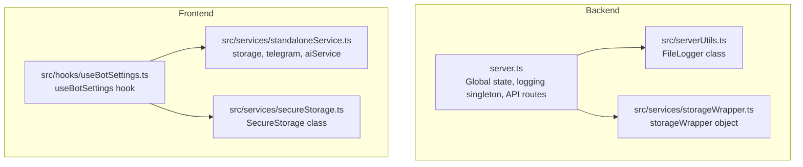
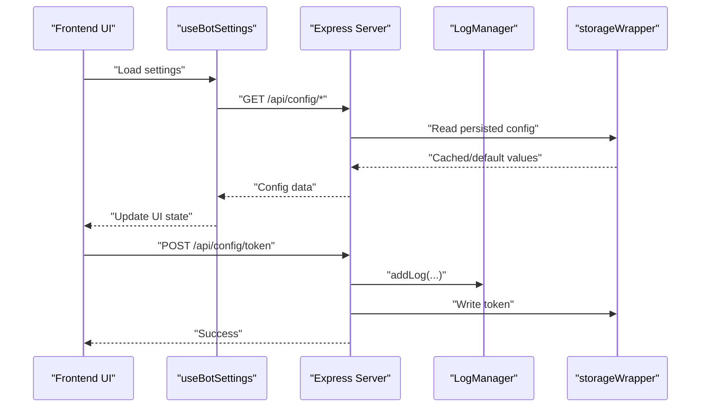
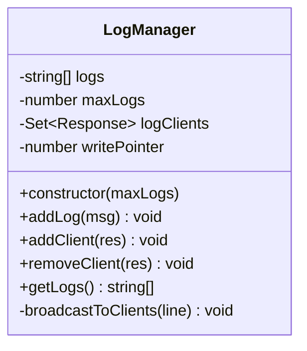
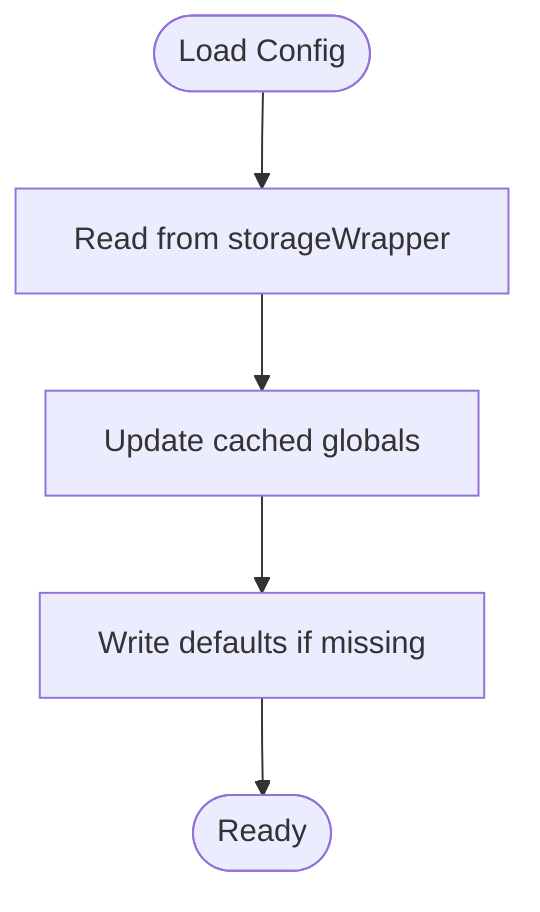
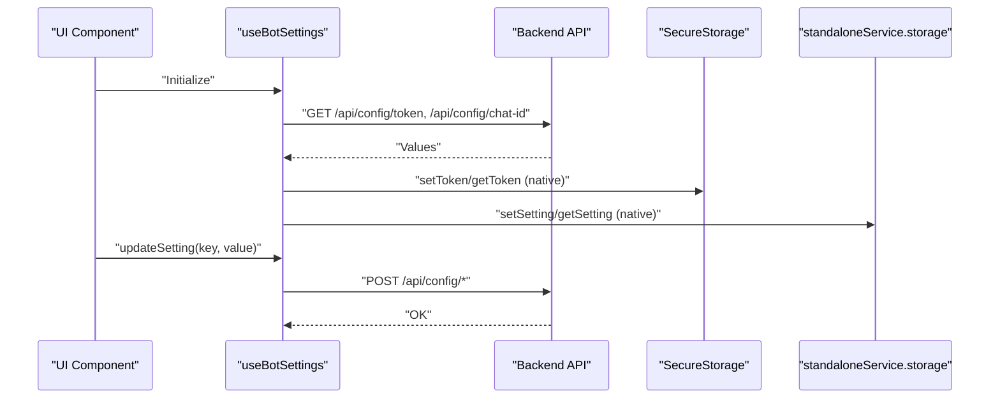
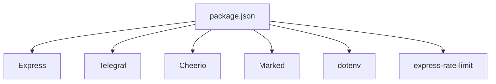

# Singleton Pattern for Centralized Services

<cite>
**Referenced Files in This Document**
- [server.ts](file://server.ts)
- [src/serverUtils.ts](file://src/serverUtils.ts)
- [src/services/storageWrapper.ts](file://src/services/storageWrapper.ts)
- [src/services/standaloneService.ts](file://src/services/standaloneService.ts)
- [src/services/secureStorage.ts](file://src/services/secureStorage.ts)
- [src/hooks/useBotSettings.ts](file://src/hooks/useBotSettings.ts)
- [package.json](file://package.json)
</cite>

## Table of Contents
1. [Introduction](#introduction)
2. [Project Structure](#project-structure)
3. [Core Components](#core-components)
4. [Architecture Overview](#architecture-overview)
5. [Detailed Component Analysis](#detailed-component-analysis)
6. [Dependency Analysis](#dependency-analysis)
7. [Performance Considerations](#performance-considerations)
8. [Troubleshooting Guide](#troubleshooting-guide)
9. [Conclusion](#conclusion)

## Introduction
This document explains how the project implements centralized logging and configuration services using singleton-like patterns. It focuses on:
- Singleton initialization and global state management
- Thread-safe access patterns
- Centralized logging system and configuration management
- Service lifecycle control
- Examples of logger singleton usage and configuration singleton patterns
- Benefits of singletons for resource efficiency and centralized control

## Project Structure
The project organizes central services and utilities across backend and frontend modules:
- Backend server initializes and manages a global logging manager singleton and persistent configuration caches
- Frontend hooks coordinate settings and integrate with backend APIs
- Storage wrappers abstract platform-specific persistence (native vs web)

**Diagram sources**
- [server.ts:19-280](file://server.ts#L19-L280)
- [src/serverUtils.ts:1-23](file://src/serverUtils.ts#L1-L23)
- [src/services/storageWrapper.ts:1-100](file://src/services/storageWrapper.ts#L1-L100)
- [src/hooks/useBotSettings.ts:1-55](file://src/hooks/useBotSettings.ts#L1-L55)
- [src/services/standaloneService.ts:1-175](file://src/services/standaloneService.ts#L1-L175)
- [src/services/secureStorage.ts:1-39](file://src/services/secureStorage.ts#L1-L39)

**Section sources**
- [server.ts:19-280](file://server.ts#L19-L280)
- [src/serverUtils.ts:1-23](file://src/serverUtils.ts#L1-L23)
- [src/services/storageWrapper.ts:1-100](file://src/services/storageWrapper.ts#L1-L100)
- [src/hooks/useBotSettings.ts:1-55](file://src/hooks/useBotSettings.ts#L1-L55)
- [src/services/standaloneService.ts:1-175](file://src/services/standaloneService.ts#L1-L175)
- [src/services/secureStorage.ts:1-39](file://src/services/secureStorage.ts#L1-L39)

## Core Components
- Logging singleton: A LogManager instance provides centralized log buffering, broadcasting, and retrieval. It acts as a singleton because it is instantiated once and exported as a module-level constant.
- File logging utility: A FileLogger class encapsulates file-based logging for error tracking.
- Configuration and caching: Global variables cache configuration and state, while storageWrapper abstracts persistence across platforms.
- Frontend settings coordination: A React hook coordinates settings and integrates with backend configuration endpoints.

Benefits demonstrated:
- Resource efficiency: Single LogManager and FileLogger instances reduce overhead
- Centralized control: All logs and configuration updates funnel through defined APIs
- Consistent behavior: Shared state and logging across modules

**Section sources**
- [server.ts:219-280](file://server.ts#L219-L280)
- [src/serverUtils.ts:7-22](file://src/serverUtils.ts#L7-L22)
- [server.ts:204-217](file://server.ts#L204-L217)
- [src/services/storageWrapper.ts:9-99](file://src/services/storageWrapper.ts#L9-L99)

## Architecture Overview
The backend exposes configuration and logging endpoints. The frontend interacts with these endpoints and coordinates settings via hooks and services.

**Diagram sources**
- [server.ts:991-1000](file://server.ts#L991-L1000)
- [server.ts:219-280](file://server.ts#L219-L280)
- [src/services/storageWrapper.ts:9-99](file://src/services/storageWrapper.ts#L9-L99)
- [src/hooks/useBotSettings.ts:9-43](file://src/hooks/useBotSettings.ts#L9-L43)

## Detailed Component Analysis

### Centralized Logging Manager (Singleton)
The LogManager class maintains a fixed-size rotating log buffer and broadcasts live updates to connected clients. It is instantiated once and exported as a module-level singleton.

Key characteristics:
- Fixed-size ring buffer for efficient memory usage
- Broadcasts logs to SSE clients
- Provides retrieval of recent logs

**Diagram sources**
- [server.ts:219-280](file://server.ts#L219-L280)

Thread-safe access patterns:
- Writes use an atomic pointer increment modulo capacity
- Client set operations are guarded against dead connections
- No external synchronization is required because writes are append-only and pointer updates are single-threaded

Initialization and lifecycle:
- Instantiated once at module scope
- Exposed via a module-level constant for global access
- Clients connect/disconnect through explicit add/remove methods

**Section sources**
- [server.ts:219-280](file://server.ts#L219-L280)
- [server.ts:342-352](file://server.ts#L342-L352)

### File Logger Utility (Singleton-like)
The FileLogger class encapsulates file-based logging for error tracking. It ensures the log directory exists and appends formatted entries.

Usage pattern:
- Constructed once per subsystem requiring file logging
- Provides a simple log(level, message) method

Thread-safety:
- Uses synchronous file operations; ensure single writer or external serialization if accessed concurrently

**Section sources**
- [src/serverUtils.ts:7-22](file://src/serverUtils.ts#L7-L22)
- [server.ts:19-22](file://server.ts#L19-L22)

### Configuration and Caching (Singleton-like Global State)
The server maintains global variables for cached configuration and runtime state. These act as single sources of truth for the application’s configuration.

Key globals:
- Persistent token and chat ID
- Runtime bot state and health monitoring controls
- Cached data for posts, templates, images, and presets

Access patterns:
- Getters return cached values
- Async setters persist to storage and update caches
- storageWrapper abstracts platform differences

**Diagram sources**
- [server.ts:127-142](file://server.ts#L127-L142)
- [server.ts:144-173](file://server.ts#L144-L173)
- [src/services/storageWrapper.ts:9-99](file://src/services/storageWrapper.ts#L9-L99)

**Section sources**
- [server.ts:204-217](file://server.ts#L204-L217)
- [server.ts:127-142](file://server.ts#L127-L142)
- [server.ts:144-173](file://server.ts#L144-L173)
- [src/services/storageWrapper.ts:9-99](file://src/services/storageWrapper.ts#L9-L99)

### Frontend Settings Coordination (Hooks and Services)
The frontend uses a hook to load and update settings, coordinating with backend configuration endpoints. On native platforms, SecureStorage persists sensitive tokens securely.

**Diagram sources**
- [src/hooks/useBotSettings.ts:9-43](file://src/hooks/useBotSettings.ts#L9-L43)
- [src/services/secureStorage.ts:7-30](file://src/services/secureStorage.ts#L7-L30)
- [src/services/standaloneService.ts:56-72](file://src/services/standaloneService.ts#L56-L72)
- [server.ts:991-1021](file://server.ts#L991-L1021)

**Section sources**
- [src/hooks/useBotSettings.ts:1-55](file://src/hooks/useBotSettings.ts#L1-L55)
- [src/services/secureStorage.ts:1-39](file://src/services/secureStorage.ts#L1-L39)
- [src/services/standaloneService.ts:1-175](file://src/services/standaloneService.ts#L1-L175)
- [server.ts:991-1021](file://server.ts#L991-L1021)

### Example: Logger Singleton Implementation
- Construct a FileLogger instance for file-based logs
- Use convenience functions to log at different levels
- Ensure the log directory exists automatically

Reference path:
- [src/serverUtils.ts:7-22](file://src/serverUtils.ts#L7-L22)
- [server.ts:19-22](file://server.ts#L19-L22)

### Example: Configuration Singleton Usage
- Initialize configuration by loading from storageWrapper
- Update configuration via API endpoints
- Persist changes to disk or platform storage

Reference paths:
- [server.ts:127-142](file://server.ts#L127-L142)
- [server.ts:144-173](file://server.ts#L144-L173)
- [src/services/storageWrapper.ts:9-99](file://src/services/storageWrapper.ts#L9-L99)

### Example: Global State Coordination
- Maintain runtime state in global variables
- Expose getters/setters for centralized access
- Integrate with logging for auditability

Reference paths:
- [server.ts:204-217](file://server.ts#L204-L217)
- [server.ts:991-1021](file://server.ts#L991-L1021)

## Dependency Analysis
The backend depends on:
- Express for routing and SSE streaming
- Telegraf for Telegram bot lifecycle management
- Cheerio and Marked for content processing
- dotenv for environment configuration
- Rate limiter for API protection

Frontend dependencies:
- Capacitor plugins for native capabilities
- React hooks for state management
- Axios for HTTP requests

**Diagram sources**
- [package.json:19-55](file://package.json#L19-L55)

**Section sources**
- [package.json:19-55](file://package.json#L19-L55)

## Performance Considerations
- LogManager uses a fixed-size ring buffer to bound memory usage and avoid growth over time
- Client broadcasting handles dead connections gracefully to prevent leaks
- storageWrapper abstracts platform-specific IO to minimize overhead and unify behavior
- Frontend settings are cached and debounced to reduce network chatter

## Troubleshooting Guide
Common issues and resolutions:
- Missing environment variables: The server validates required variables at startup and throws if missing
- File logging failures: Ensure the log directory exists and is writable
- Configuration persistence: Verify storageWrapper operations succeed and defaults are written when missing
- Bot initialization conflicts: The server enforces a single initialization flag and health checks to recover from transient failures

**Section sources**
- [server.ts:24-33](file://server.ts#L24-L33)
- [src/serverUtils.ts:10-15](file://src/serverUtils.ts#L10-L15)
- [server.ts:127-142](file://server.ts#L127-L142)
- [server.ts:688-799](file://server.ts#L688-L799)

## Conclusion
The project demonstrates robust singleton-like patterns for centralized logging and configuration:
- A LogManager singleton provides efficient, thread-safe log aggregation and distribution
- Global configuration caches and storage abstractions enable consistent, cross-platform persistence
- Frontend hooks coordinate settings with backend APIs and secure storage
These patterns deliver resource efficiency, centralized control, and maintainable architecture across both backend and frontend modules.