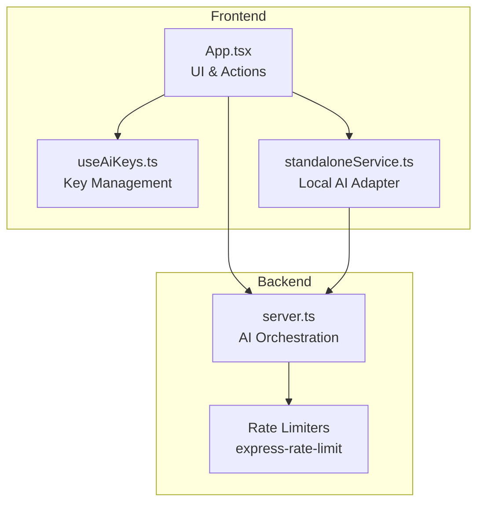
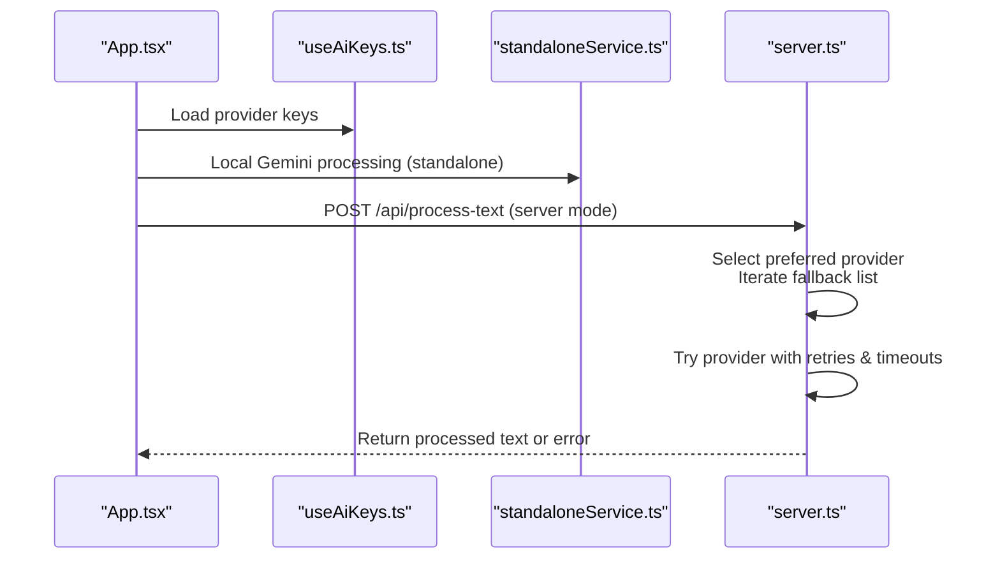
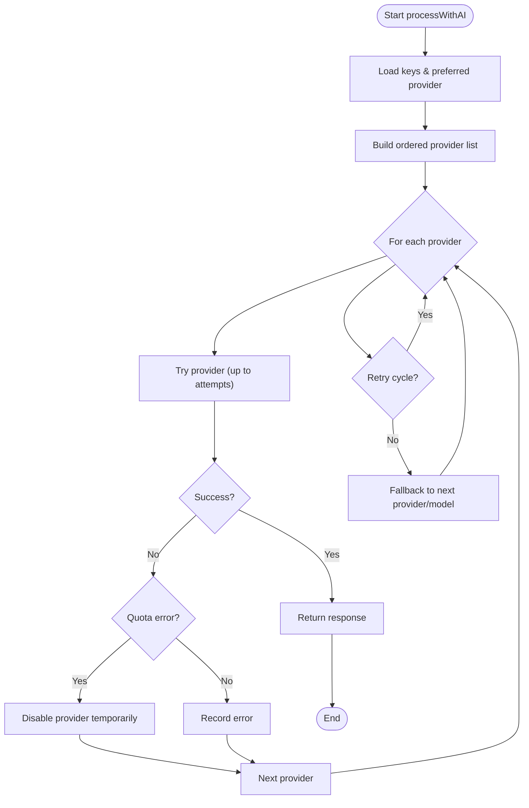
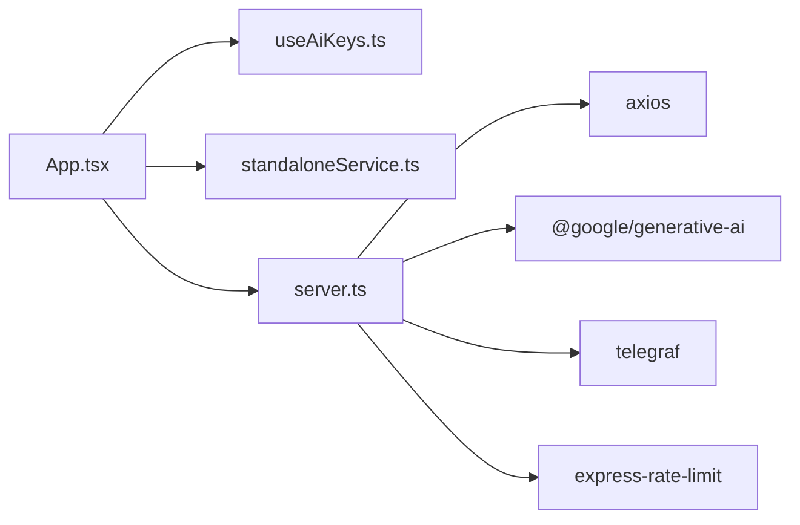

# Strategy Pattern for AI Providers

<cite>
**Referenced Files in This Document**
- [server.ts](file://server.ts)
- [App.tsx](file://src/App.tsx)
- [useAiKeys.ts](file://src/hooks/useAiKeys.ts)
- [standaloneService.ts](file://src/services/standaloneService.ts)
- [package.json](file://package.json)
- [README.md](file://README.md)
</cite>

## Table of Contents
1. [Introduction](#introduction)
2. [Project Structure](#project-structure)
3. [Core Components](#core-components)
4. [Architecture Overview](#architecture-overview)
5. [Detailed Component Analysis](#detailed-component-analysis)
6. [Dependency Analysis](#dependency-analysis)
7. [Performance Considerations](#performance-considerations)
8. [Troubleshooting Guide](#troubleshooting-guide)
9. [Conclusion](#conclusion)

## Introduction
This document explains how the project implements a strategy pattern for AI provider integration, enabling pluggable AI services (Gemini, GitHub, OpenRouter, DeepSeek). It covers dynamic provider selection, fallback mechanisms, provider abstraction layers, the AI processing pipeline, rate limiting strategies, and error handling. The pattern allows runtime provider switching, consistent interfaces across different AI services, and straightforward addition of new providers without modifying existing code.

## Project Structure
The AI strategy spans three layers:
- Frontend (React): UI for provider configuration, key management, and initiating AI processing.
- Services: Provider-specific adapters and utilities for standalone and server-side processing.
- Backend (Node/Express): Centralized AI orchestration with fallback logic, rate limiting, and error handling.

**Diagram sources**
- [App.tsx:811-864](file://src/App.tsx#L811-L864)
- [useAiKeys.ts:1-57](file://src/hooks/useAiKeys.ts#L1-L57)
- [standaloneService.ts:148-159](file://src/services/standaloneService.ts#L148-L159)
- [server.ts:51-72](file://server.ts#L51-L72)

**Section sources**
- [README.md:16-24](file://README.md#L16-L24)
- [package.json:19-56](file://package.json#L19-L56)

## Core Components
- AI Orchestration Engine: Central function orchestrating provider selection, retries, and fallbacks.
- Provider Adapters: Abstractions for Gemini, GitHub, OpenRouter, and DeepSeek.
- Key Management: Unified hook for loading and updating API keys per provider.
- Rate Limiters: Express middleware enforcing limits on API, AI, and mutations.
- Frontend Integration: UI actions trigger processing via local adapter or backend endpoint.

Key implementation references:
- AI orchestration and fallback: [server.ts:412-645](file://server.ts#L412-L645)
- Provider-specific integrations: [server.ts:449-626](file://server.ts#L449-L626)
- Frontend AI processing flow: [App.tsx:811-864](file://src/App.tsx#L811-L864)
- Local AI adapter (Gemini): [standaloneService.ts:148-159](file://src/services/standaloneService.ts#L148-L159)
- Key management hook: [useAiKeys.ts:1-57](file://src/hooks/useAiKeys.ts#L1-L57)
- Rate limiters: [server.ts:51-72](file://server.ts#L51-L72)

**Section sources**
- [server.ts:412-645](file://server.ts#L412-L645)
- [App.tsx:811-864](file://src/App.tsx#L811-L864)
- [standaloneService.ts:148-159](file://src/services/standaloneService.ts#L148-L159)
- [useAiKeys.ts:1-57](file://src/hooks/useAiKeys.ts#L1-L57)
- [server.ts:51-72](file://server.ts#L51-L72)

## Architecture Overview
The strategy pattern is implemented by:
- Defining a uniform processing interface across providers.
- Dynamically selecting the preferred provider and iterating through a fallback list.
- Encapsulating provider-specific logic behind a single orchestrator.
- Applying retries, timeouts, and quota detection to maintain resilience.

**Diagram sources**
- [App.tsx:811-864](file://src/App.tsx#L811-L864)
- [useAiKeys.ts:1-57](file://src/hooks/useAiKeys.ts#L1-L57)
- [standaloneService.ts:148-159](file://src/services/standaloneService.ts#L148-L159)
- [server.ts:412-645](file://server.ts#L412-L645)

## Detailed Component Analysis

### AI Orchestration Engine (Strategy Implementation)
The engine encapsulates the strategy pattern:
- Provider order: preferred provider first, followed by fallback providers.
- Per-provider attempts with retries and timeouts.
- Quota detection disables failing providers temporarily.
- Comprehensive error logging and user-friendly messaging.

**Diagram sources**
- [server.ts:412-645](file://server.ts#L412-L645)

**Section sources**
- [server.ts:412-645](file://server.ts#L412-L645)

### Provider Integrations

#### Gemini Strategy
- Uses Google Generative AI SDK.
- Iterates through a predefined model fallback list.
- Applies safety settings and timeout protection.
- Detects quota exhaustion and disables provider temporarily.

Implementation highlights:
- Model fallback loop and safety settings: [server.ts:502-563](file://server.ts#L502-L563)
- Quota detection and provider disabling: [server.ts:537-562](file://server.ts#L537-L562)

**Section sources**
- [server.ts:502-563](file://server.ts#L502-L563)
- [server.ts:537-562](file://server.ts#L537-L562)

#### GitHub (Azure AI Inferencing) Strategy
- Calls Azure-hosted OpenAI-compatible endpoint.
- Includes authentication and request configuration.
- Handles 401/403 auth errors distinctly from rate limits.

Implementation highlights:
- Endpoint and request construction: [server.ts:449-500](file://server.ts#L449-L500)
- Retry logic for 429/503 and auth error handling: [server.ts:480-498](file://server.ts#L480-L498)

**Section sources**
- [server.ts:449-500](file://server.ts#L449-L500)
- [server.ts:480-498](file://server.ts#L480-L498)

#### OpenRouter Strategy
- Uses OpenRouter public API with gpt-4o-mini.
- Implements exponential backoff-like retries for 429/503.

Implementation highlights:
- Request and retry handling: [server.ts:565-590](file://server.ts#L565-L590)

**Section sources**
- [server.ts:565-590](file://server.ts#L565-L590)

#### DeepSeek Strategy
- Calls DeepSeek chat completions endpoint.
- Configures model, temperature, and token limits.

Implementation highlights:
- Endpoint and payload: [server.ts:592-626](file://server.ts#L592-L626)

**Section sources**
- [server.ts:592-626](file://server.ts#L592-L626)

### Frontend Integration and Dynamic Provider Selection
- UI loads provider keys via a dedicated hook.
- Processes text either locally (standalone Gemini) or via backend.
- Supports runtime provider switching by updating preferred provider.

Key references:
- Key loading and updates: [useAiKeys.ts:1-57](file://src/hooks/useAiKeys.ts#L1-L57)
- Standalone vs server processing: [App.tsx:811-864](file://src/App.tsx#L811-L864)
- Preferred provider persistence: [server.ts:1038-1048](file://server.ts#L1038-L1048)

**Section sources**
- [useAiKeys.ts:1-57](file://src/hooks/useAiKeys.ts#L1-L57)
- [App.tsx:811-864](file://src/App.tsx#L811-L864)
- [server.ts:1038-1048](file://server.ts#L1038-L1048)

### Local AI Adapter (Standalone Mode)
- Provides a simplified Gemini adapter for standalone operation.
- Used when the app runs outside the server context.

References:
- Local adapter implementation: [standaloneService.ts:148-159](file://src/services/standaloneService.ts#L148-L159)

**Section sources**
- [standaloneService.ts:148-159](file://src/services/standaloneService.ts#L148-L159)

## Dependency Analysis
External dependencies supporting the strategy pattern:
- Express and rate-limit middleware for API governance.
- Telegraf for Telegram bot integration.
- Axios for HTTP requests to external AI providers.
- Google Generative AI SDK for Gemini.
- Dotenv for environment configuration.

**Diagram sources**
- [package.json:19-56](file://package.json#L19-L56)
- [server.ts:1-15](file://server.ts#L1-L15)

**Section sources**
- [package.json:19-56](file://package.json#L19-L56)
- [server.ts:1-15](file://server.ts#L1-L15)

## Performance Considerations
- Rate limiting: Separate limits for general API, AI requests, and mutations to prevent overload.
- Retries and timeouts: Provider-specific retry loops and timeouts reduce transient failures.
- Quota-aware fallback: Disables providers hitting quotas to avoid cascading failures.
- Model fallback: Gemini tries multiple models to improve success rates.

Recommendations:
- Monitor quota thresholds and adjust retry delays dynamically.
- Consider caching successful responses for identical prompts.
- Tune timeouts per provider based on observed latency.

**Section sources**
- [server.ts:51-72](file://server.ts#L51-L72)
- [server.ts:480-498](file://server.ts#L480-L498)
- [server.ts:537-562](file://server.ts#L537-L562)

## Troubleshooting Guide
Common issues and resolutions:
- Missing API keys: Ensure keys are configured for the selected provider.
- Quota exceeded: The system detects quota errors and disables the provider temporarily; wait for cooldown or switch providers.
- Authentication errors (401/403): Verify token validity and permissions.
- Network timeouts: Adjust retry logic or switch to a different provider.
- UI error messages: The frontend maps quota and auth errors to user-friendly messages.

References:
- Error handling and user messaging: [App.tsx:851-864](file://src/App.tsx#L851-L864)
- Quota detection and disabling: [server.ts:548-562](file://server.ts#L548-L562)
- Auth error handling: [server.ts:484-488](file://server.ts#L484-L488)

**Section sources**
- [App.tsx:851-864](file://src/App.tsx#L851-L864)
- [server.ts:548-562](file://server.ts#L548-L562)
- [server.ts:484-488](file://server.ts#L484-L488)

## Conclusion
The project’s strategy pattern for AI providers delivers:
- Pluggable integrations for Gemini, GitHub, OpenRouter, and DeepSeek.
- Dynamic provider selection with robust fallback and quota-aware behavior.
- Consistent interfaces across providers, simplifying UI and service logic.
- Strong error handling, rate limiting, and user feedback.
This design makes adding new providers straightforward: implement a new provider branch in the orchestrator, define its request configuration, and integrate it into the fallback list.