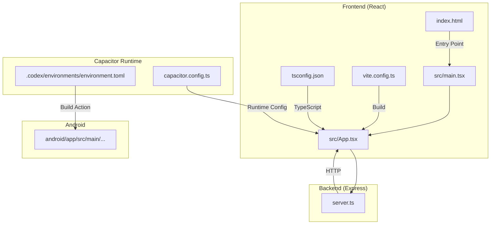
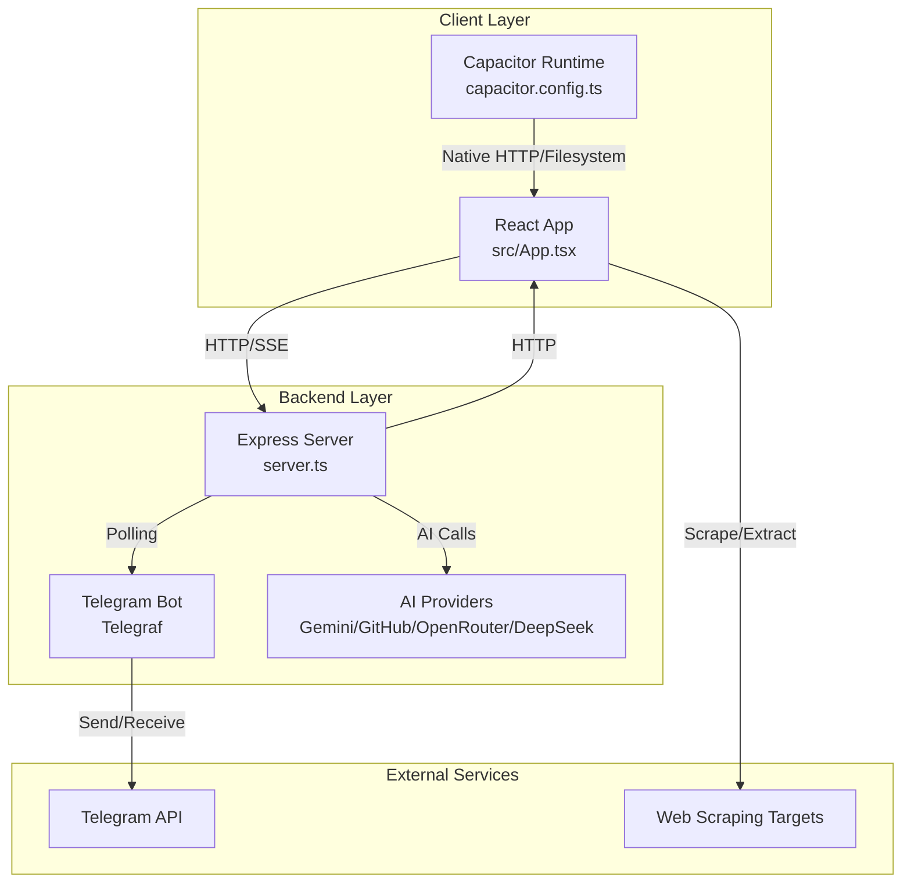
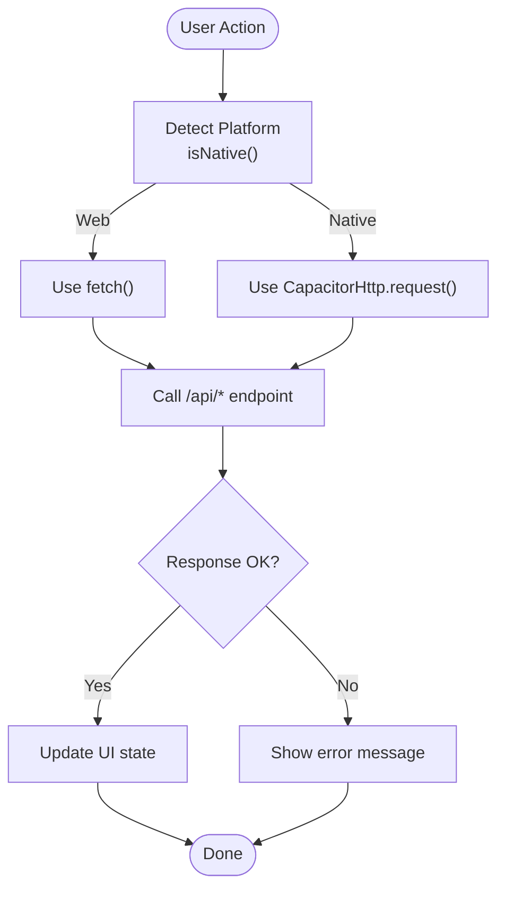
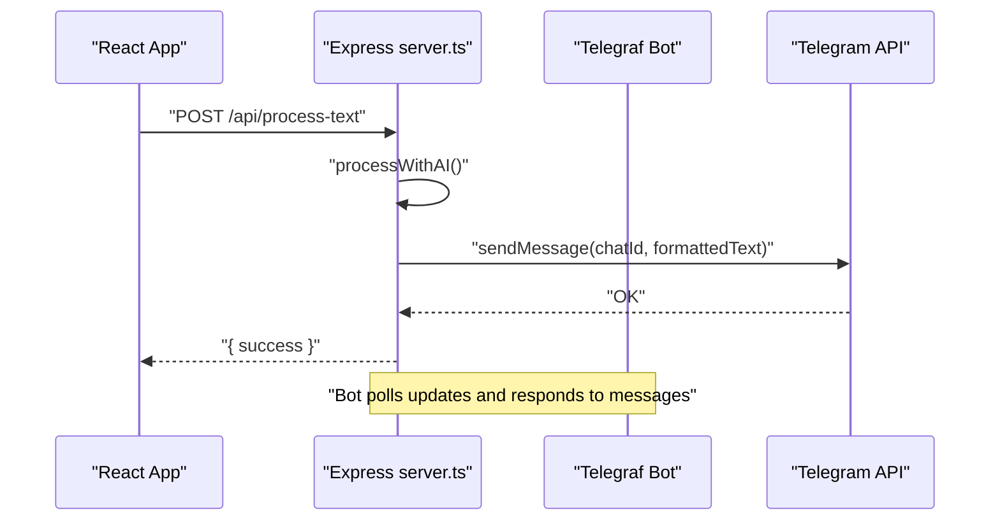
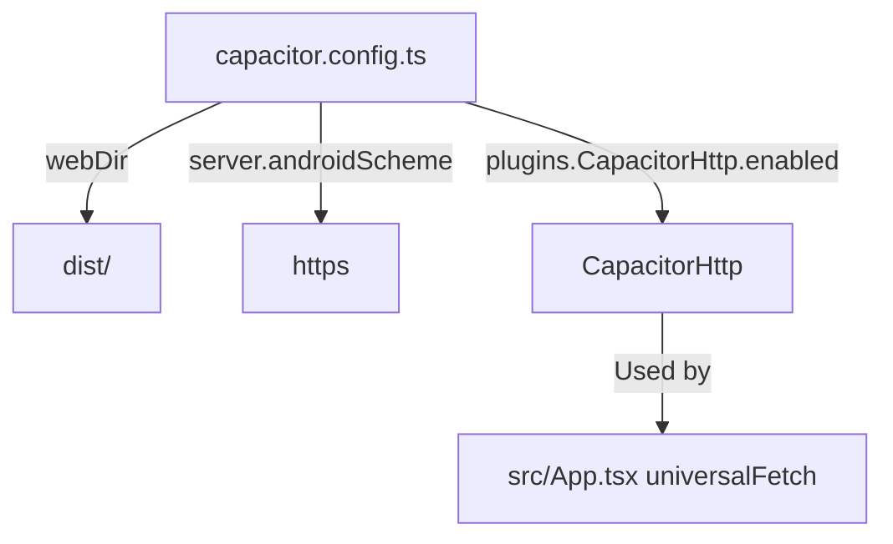
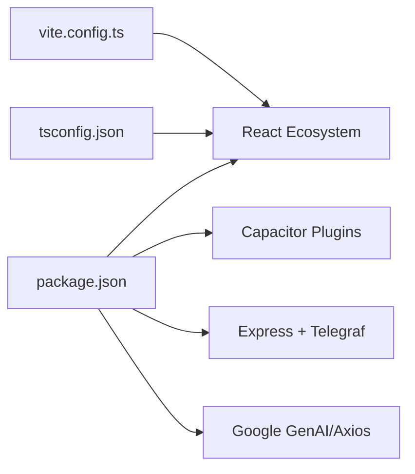

# System Overview

<cite>
**Referenced Files in This Document**
- [package.json](file://package.json)
- [server.ts](file://server.ts)
- [README.md](file://README.md)
- [capacitor.config.ts](file://capacitor.config.ts)
- [vite.config.ts](file://vite.config.ts)
- [tsconfig.json](file://tsconfig.json)
- [src/App.tsx](file://src/App.tsx)
- [src/main.tsx](file://src/main.tsx)
- [index.html](file://index.html)
- [src/services/standaloneService.ts](file://src/services/standaloneService.ts)
- [src/hooks/useServerConnection.ts](file://src/hooks/useServerConnection.ts)
- [src/types.ts](file://src/types.ts)
- [.codex/environments/environment.toml](file://.codex/environments/environment.toml)
</cite>

## Table of Contents
1. [Introduction](#introduction)
2. [Project Structure](#project-structure)
3. [Core Components](#core-components)
4. [Architecture Overview](#architecture-overview)
5. [Detailed Component Analysis](#detailed-component-analysis)
6. [Dependency Analysis](#dependency-analysis)
7. [Performance Considerations](#performance-considerations)
8. [Troubleshooting Guide](#troubleshooting-guide)
9. [Conclusion](#conclusion)
10. [Appendices](#appendices)

## Introduction
This document presents a comprehensive system overview of the AI News Bot, a hybrid full-stack application that integrates a React-based web/mobile frontend, an Express backend, and the Capacitor runtime for native capabilities. The system enables content creation, AI-assisted translation and formatting, and publishing to Telegram via a long-running bot. It supports both a traditional web deployment and a native-capable hybrid app built with Capacitor, allowing the same UI to run on the web and Android devices.

The architecture emphasizes:
- Separation of concerns: React/TypeScript frontend handles UI and user workflows; Express backend manages Telegram bot lifecycle, AI orchestration, and persistence.
- Hybrid runtime: Capacitor bridges web technologies to native device capabilities (filesystem, preferences, HTTP) for Android.
- Resilient AI processing: Multi-provider fallback and rate limiting to maintain reliability.
- Operational observability: Real-time logging via Server-Sent Events (web) and polling (native), plus health monitoring for the Telegram bot.

## Project Structure
The repository is organized around a single Vite/React application with a sibling Express server and Capacitor configuration for Android builds. Key directories and files:
- Frontend: React app under src/, compiled to dist/ via Vite.
- Backend: Express server in server.ts, exposing REST endpoints and managing the Telegram bot.
- Capacitor: Native runtime configuration and Android assets under android/.
- Build and tooling: package.json scripts, Vite/Tailwind/Vite config, TypeScript configs.

**Diagram sources**
- [src/main.tsx:1-11](file://src/main.tsx#L1-L11)
- [src/App.tsx:1-100](file://src/App.tsx#L1-L100)
- [vite.config.ts:1-28](file://vite.config.ts#L1-L28)
- [tsconfig.json:1-27](file://tsconfig.json#L1-L27)
- [index.html:1-16](file://index.html#L1-L16)
- [server.ts:1-120](file://server.ts#L1-L120)
- [capacitor.config.ts:1-26](file://capacitor.config.ts#L1-L26)
- [.codex/environments/environment.toml:1-15](file://.codex/environments/environment.toml#L1-L15)

**Section sources**
- [README.md:1-25](file://README.md#L1-L25)
- [package.json:1-70](file://package.json#L1-L70)
- [vite.config.ts:1-28](file://vite.config.ts#L1-L28)
- [tsconfig.json:1-27](file://tsconfig.json#L1-L27)
- [index.html:1-16](file://index.html#L1-L16)
- [capacitor.config.ts:1-26](file://capacitor.config.ts#L1-L26)
- [.codex/environments/environment.toml:1-15](file://.codex/environments/environment.toml#L1-L15)

## Core Components
- React/TypeScript Frontend
  - Entry point renders the root React application.
  - App orchestrates UI workflows, state, and integrations with the backend and native runtime.
  - Uses Vite for build and Tailwind for styling.
- Express Backend
  - Provides REST endpoints for configuration, logs, image sync, and bot controls.
  - Manages a Telegram bot using Telegraf, including initialization, polling, and health checks.
  - Implements AI processing with multi-provider fallback and rate limiting.
- Capacitor Runtime
  - Bridges web APIs to native Android capabilities (HTTP, filesystem, preferences).
  - Enables the same UI to run as a hybrid app on Android with native performance characteristics.

**Section sources**
- [src/main.tsx:1-11](file://src/main.tsx#L1-L11)
- [src/App.tsx:168-200](file://src/App.tsx#L168-L200)
- [server.ts:37-120](file://server.ts#L37-L120)
- [capacitor.config.ts:1-26](file://capacitor.config.ts#L1-L26)

## Architecture Overview
The system follows a hybrid full-stack pattern:
- Web/Desktop: React app served by Vite, communicating with the Express backend over HTTP.
- Mobile/Android: Capacitor wraps the web app, enabling native HTTP, filesystem, and preferences access.
- Telegram Integration: The backend runs a long-lived Telegram bot (polling) and forwards user messages to AI processing, then posts formatted content to Telegram chats.
- AI Orchestration: The backend selects an AI provider (Gemini, GitHub, OpenRouter, DeepSeek) with fallback and quota-aware retries.

**Diagram sources**
- [src/App.tsx:194-252](file://src/App.tsx#L194-L252)
- [server.ts:37-120](file://server.ts#L37-L120)
- [server.ts:688-800](file://server.ts#L688-L800)
- [capacitor.config.ts:1-26](file://capacitor.config.ts#L1-L26)

## Detailed Component Analysis

### React Frontend (src/App.tsx)
- Responsibilities
  - Hosts UI components for content authoring, image gallery, logs, and settings.
  - Implements platform detection (web vs native) and adapts networking (CapacitorHttp vs fetch).
  - Integrates with server endpoints for configuration, logs, image sync, and bot status.
  - Provides a markdown-to-Telegram sanitizer and HTML conversion pipeline.
- Key Patterns
  - Universal fetch abstraction: chooses CapacitorHttp on native and fetch on web.
  - SSE polling for logs on web; polling on native.
  - Drag-and-drop reordering of images using @dnd-kit.
  - Standalone mode: initializes local storage and simulates bot polling when configured.

**Diagram sources**
- [src/App.tsx:194-252](file://src/App.tsx#L194-L252)
- [src/App.tsx:651-698](file://src/App.tsx#L651-L698)

**Section sources**
- [src/App.tsx:168-200](file://src/App.tsx#L168-L200)
- [src/App.tsx:348-400](file://src/App.tsx#L348-L400)
- [src/App.tsx:401-522](file://src/App.tsx#L401-L522)
- [src/App.tsx:572-621](file://src/App.tsx#L572-L621)
- [src/App.tsx:651-698](file://src/App.tsx#L651-L698)

### Express Backend (server.ts)
- Responsibilities
  - Exposes REST endpoints for configuration, logs, image sync, and bot controls.
  - Initializes and supervises a Telegram bot using Telegraf with polling and health checks.
  - Implements AI processing with multi-provider fallback and quota-aware retries.
  - Manages persistent configuration and data files via a storage wrapper.
- Key Patterns
  - Rate limiting for API, AI, and mutations.
  - Sanitized HTML generation for Telegram with strict tag allowance.
  - Health monitoring with periodic getMe checks and restart on failures.
  - Streaming logs via Server-Sent Events for web clients.

**Diagram sources**
- [server.ts:412-645](file://server.ts#L412-L645)
- [server.ts:648-671](file://server.ts#L648-L671)
- [server.ts:688-800](file://server.ts#L688-L800)

**Section sources**
- [server.ts:37-120](file://server.ts#L37-L120)
- [server.ts:127-174](file://server.ts#L127-L174)
- [server.ts:282-340](file://server.ts#L282-L340)
- [server.ts:412-645](file://server.ts#L412-L645)
- [server.ts:648-671](file://server.ts#L648-L671)
- [server.ts:688-800](file://server.ts#L688-L800)

### Capacitor Runtime (capacitor.config.ts)
- Responsibilities
  - Defines the app’s native identifiers, webDir, and server scheme.
  - Enables Capacitor HTTP plugin and keyboard resizing behavior.
  - Allows navigation and mixed content policies suitable for accessing local servers.
- Integration
  - The frontend uses CapacitorHttp for reliable network calls on Android.

**Diagram sources**
- [capacitor.config.ts:1-26](file://capacitor.config.ts#L1-L26)
- [src/App.tsx:194-252](file://src/App.tsx#L194-L252)

**Section sources**
- [capacitor.config.ts:1-26](file://capacitor.config.ts#L1-L26)

### Data Types and Contracts (src/types.ts)
- Defines shared TypeScript interfaces for posts, drafts, button templates, and server configuration status.
- Ensures type-safe communication between frontend and backend.

**Section sources**
- [src/types.ts:1-48](file://src/types.ts#L1-L48)

### Server Connection Hook (src/hooks/useServerConnection.ts)
- Provides a React hook to poll backend status and surface connectivity, bot status, and configuration.
- Uses CapacitorHttp for native environments.

**Section sources**
- [src/hooks/useServerConnection.ts:1-52](file://src/hooks/useServerConnection.ts#L1-L52)

### Standalone Service (src/services/standaloneService.ts)
- Provides native-capable storage (filesystem/docs) and preferences, Telegram API wrappers, AI processing, and scraping helpers.
- Enables a “standalone” mode where the app can run without a remote backend.

**Section sources**
- [src/services/standaloneService.ts:1-175](file://src/services/standaloneService.ts#L1-L175)

## Dependency Analysis
- Frontend dependencies
  - React, React DOM, Vite, TailwindCSS, @capacitor/* plugins, DnD kit, markdown parsers.
- Backend dependencies
  - Express, Telegraf, rate limiting, Cheerio, Marked, Google Generative AI SDK, dotenv, sharp, cors, axios.
- Tooling
  - Vite config defines aliases and environment injection; TypeScript config targets modern JS and JSX.

**Diagram sources**
- [package.json:19-68](file://package.json#L19-L68)
- [vite.config.ts:1-28](file://vite.config.ts#L1-L28)
- [tsconfig.json:1-27](file://tsconfig.json#L1-L27)

**Section sources**
- [package.json:19-68](file://package.json#L19-L68)
- [vite.config.ts:1-28](file://vite.config.ts#L1-L28)
- [tsconfig.json:1-27](file://tsconfig.json#L1-L27)

## Performance Considerations
- Network efficiency
  - Prefer CapacitorHttp on Android for reduced overhead and CORS bypass.
  - Use streaming logs (SSE) on web; polling on native to avoid unsupported APIs.
- AI processing
  - Multi-provider fallback reduces downtime; quota-aware retries minimize wasted attempts.
  - Rate limits protect both the backend and external AI providers.
- Rendering and UX
  - Debounced auto-save for drafts and image path persistence to reduce unnecessary writes.
  - Lazy loading of heavy components and images to keep UI responsive.

[No sources needed since this section provides general guidance]

## Troubleshooting Guide
- Telegram bot initialization
  - Health monitor periodically calls getMe; failures trigger restarts or manual intervention if conflicts arise.
- Logging
  - Web: SSE endpoint streams logs; native: polling endpoint retrieves recent logs.
- Environment and keys
  - Ensure required environment variables are present; missing AI keys produce warnings and degrade functionality.
- Connectivity
  - Use the server connection hook to detect backend availability and bot status; adjust base URL and network settings accordingly.

**Section sources**
- [server.ts:377-409](file://server.ts#L377-L409)
- [server.ts:342-352](file://server.ts#L342-L352)
- [server.ts:24-33](file://server.ts#L24-L33)
- [src/hooks/useServerConnection.ts:15-52](file://src/hooks/useServerConnection.ts#L15-L52)

## Conclusion
The AI News Bot employs a pragmatic hybrid architecture: a React frontend powered by Capacitor for native capabilities, an Express backend orchestrating Telegram and AI services, and a cohesive data flow that supports both web and Android deployments. The design balances developer productivity (Vite/Tailwind/TypeScript), operational resilience (health checks, rate limiting, multi-provider AI), and user experience (drag-and-drop, real-time logs, and seamless transitions between modes).

[No sources needed since this section summarizes without analyzing specific files]

## Appendices

### Deployment Topology
- Local development
  - Run the backend server and serve the frontend via Vite; configure base URL in the app to point to the backend.
- Android packaging
  - Build the frontend, sync Capacitor, and compile the Android app; the app loads the web bundle from dist/ and uses Capacitor plugins.

**Section sources**
- [README.md:11-25](file://README.md#L11-L25)
- [.codex/environments/environment.toml:8-14](file://.codex/environments/environment.toml#L8-L14)