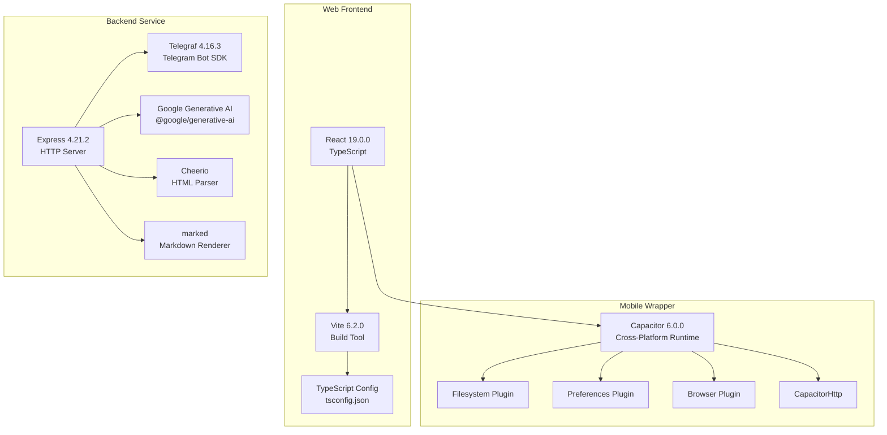
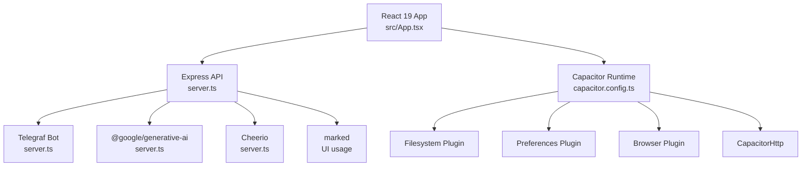
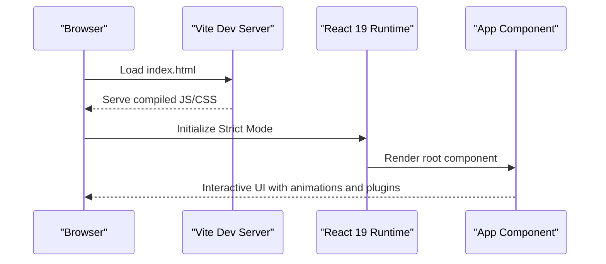
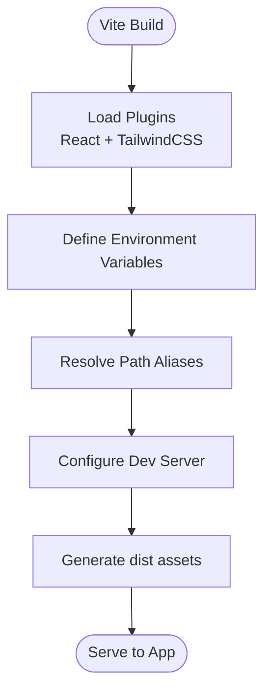
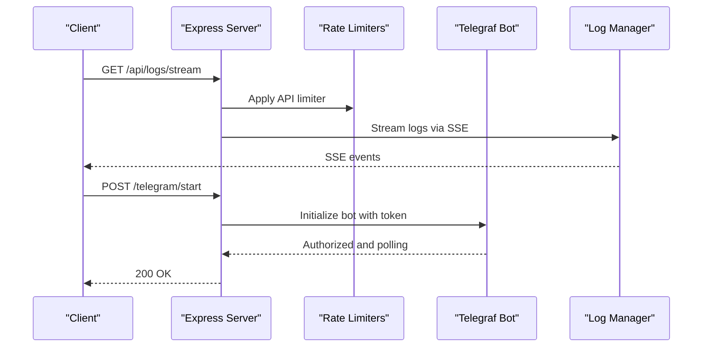
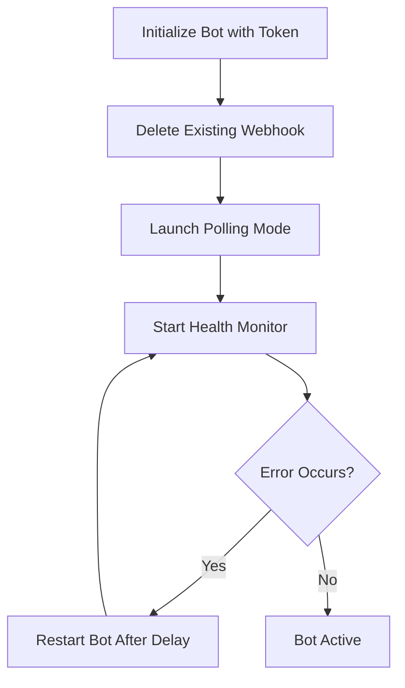
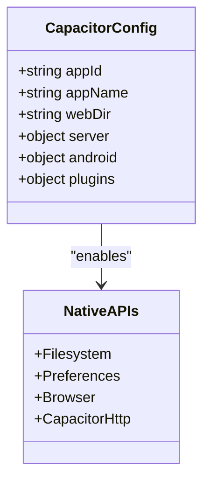
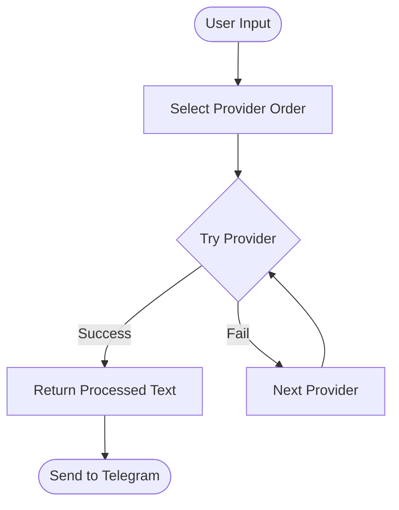
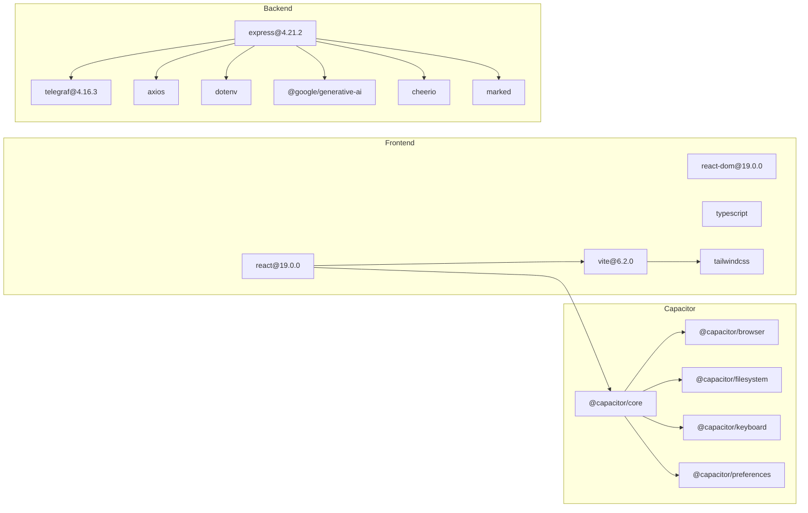

# Technology Stack

<cite>
**Referenced Files in This Document**
- [package.json](file://package.json)
- [capacitor.config.ts](file://capacitor.config.ts)
- [vite.config.ts](file://vite.config.ts)
- [server.ts](file://server.ts)
- [src/main.tsx](file://src/main.tsx)
- [src/App.tsx](file://src/App.tsx)
- [tsconfig.json](file://tsconfig.json)
- [tsconfig.server.json](file://tsconfig.server.json)
- [README.md](file://README.md)
- [src/services/standaloneService.ts](file://src/services/standaloneService.ts)
- [src/hooks/useServerConnection.ts](file://src/hooks/useServerConnection.ts)
- [src/components/PostConstructor.tsx](file://src/components/PostConstructor.tsx)
- [src/components/SettingsModal.tsx](file://src/components/SettingsModal.tsx)
- [src/types.ts](file://src/types.ts)
</cite>

## Table of Contents
1. [Introduction](#introduction)
2. [Project Structure](#project-structure)
3. [Core Components](#core-components)
4. [Architecture Overview](#architecture-overview)
5. [Detailed Component Analysis](#detailed-component-analysis)
6. [Dependency Analysis](#dependency-analysis)
7. [Performance Considerations](#performance-considerations)
8. [Troubleshooting Guide](#troubleshooting-guide)
9. [Conclusion](#conclusion)

## Introduction
This document provides a comprehensive technology stack overview for the AI News Bot project. It covers the frontend framework (React 19.0.0), build toolchain (Vite 6.2.0), backend runtime (Express 4.21.2), Telegram integration (Telegraf 4.16.3), cross-platform mobile wrapper (Capacitor 6.0.0), and supporting libraries (Cheerio, marked, @google/generative-ai). It also documents version requirements, compatibility considerations, upgrade paths, rationale for technology choices, performance characteristics, integration patterns, dependency management, build configuration, and development environment setup.

## Project Structure
The project follows a hybrid architecture:
- Frontend built with React 19 and Vite 6, TypeScript configured for ES modules and JSX.
- Backend service implemented in Express 4.21.2 with Telegraf 4.16.3 for Telegram bot handling.
- Cross-platform mobile support via Capacitor 6.0.0 with platform-specific plugins.
- Supporting libraries for AI (Google Generative AI), HTML parsing (Cheerio), Markdown rendering (marked), and React UI components.

**Diagram sources**
- [src/main.tsx:1-11](file://src/main.tsx#L1-L11)
- [vite.config.ts:1-28](file://vite.config.ts#L1-L28)
- [tsconfig.json:1-27](file://tsconfig.json#L1-L27)
- [server.ts:1-16](file://server.ts#L1-L16)
- [capacitor.config.ts:1-26](file://capacitor.config.ts#L1-L26)
- [src/services/standaloneService.ts:1-7](file://src/services/standaloneService.ts#L1-L7)

**Section sources**
- [package.json:1-70](file://package.json#L1-L70)
- [vite.config.ts:1-28](file://vite.config.ts#L1-L28)
- [tsconfig.json:1-27](file://tsconfig.json#L1-L27)
- [tsconfig.server.json:1-15](file://tsconfig.server.json#L1-L15)
- [capacitor.config.ts:1-26](file://capacitor.config.ts#L1-L26)
- [README.md:1-25](file://README.md#L1-L25)

## Core Components
- React 19.0.0: Modern React runtime with concurrent features and improved performance. Used for building the web/mobile UI.
- Vite 6.2.0: Fast build tool and dev server enabling instant HMR and optimized production builds.
- Express 4.21.2: Web server powering the backend API, Telegram webhook/polling integration, and file serving.
- Telegraf 4.16.3: Telegram bot framework for handling updates, commands, and messaging.
- Capacitor 6.0.0: Cross-platform runtime enabling native device APIs (filesystem, preferences, browser) from web code.
- Supporting libraries:
  - Cheerio: Server-side HTML parsing for content extraction and sanitization.
  - marked: Markdown-to-HTML conversion for previews and content formatting.
  - @google/generative-ai: AI model integration for content generation and translation tasks.

**Section sources**
- [package.json:19-55](file://package.json#L19-L55)
- [server.ts:1-16](file://server.ts#L1-L16)
- [src/App.tsx:6-17](file://src/App.tsx#L6-L17)
- [src/services/standaloneService.ts:1-6](file://src/services/standaloneService.ts#L1-L6)

## Architecture Overview
The system comprises three primary layers:
- Presentation Layer (React 19 + Vite): Provides the user interface, handles user interactions, and communicates with backend or native APIs.
- Service Layer (Express + Telegraf): Manages Telegram bot lifecycle, rate limiting, logging, and AI processing orchestration.
- Native Integration (Capacitor): Bridges web code to native device capabilities for offline-first operation and direct API access.

**Diagram sources**
- [src/App.tsx:168-170](file://src/App.tsx#L168-L170)
- [server.ts:1-16](file://server.ts#L1-L16)
- [capacitor.config.ts:1-26](file://capacitor.config.ts#L1-L26)
- [src/services/standaloneService.ts:1-7](file://src/services/standaloneService.ts#L1-L7)

## Detailed Component Analysis

### React 19.0.0 Integration
- Entry point initializes strict mode and renders the root App component.
- UI leverages motion for animations, Lucide icons for UI elements, and drag-and-drop via @dnd-kit for image reordering.
- Environment variables are injected at build time via Vite configuration.

**Diagram sources**
- [src/main.tsx:1-11](file://src/main.tsx#L1-L11)
- [vite.config.ts:6-26](file://vite.config.ts#L6-L26)

**Section sources**
- [src/main.tsx:1-11](file://src/main.tsx#L1-L11)
- [vite.config.ts:1-28](file://vite.config.ts#L1-L28)
- [src/App.tsx:1-46](file://src/App.tsx#L1-L46)

### Vite 6.2.0 Build and Dev Configuration
- Enables React and TailwindCSS plugins.
- Defines base path for assets and injects environment variables at compile time.
- Disables HMR in specific environments to prevent flickering during agent edits.

**Diagram sources**
- [vite.config.ts:6-26](file://vite.config.ts#L6-L26)

**Section sources**
- [vite.config.ts:1-28](file://vite.config.ts#L1-L28)
- [tsconfig.json:1-27](file://tsconfig.json#L1-L27)

### Express 4.21.2 Backend Service
- Initializes Express, loads environment variables, and sets trust proxy for reverse proxies.
- Implements middleware for JSON/URL-encoded bodies, CORS, and rate limiting.
- Exposes endpoints for logs streaming, configuration, and AI processing.
- Integrates Telegraf for Telegram bot lifecycle management, health monitoring, and message handling.

**Diagram sources**
- [server.ts:37-60](file://server.ts#L37-L60)
- [server.ts:342-352](file://server.ts#L342-L352)
- [server.ts:688-799](file://server.ts#L688-L799)

**Section sources**
- [server.ts:1-16](file://server.ts#L1-L16)
- [server.ts:24-33](file://server.ts#L24-L33)
- [server.ts:44-72](file://server.ts#L44-L72)
- [server.ts:342-352](file://server.ts#L342-L352)
- [server.ts:688-799](file://server.ts#L688-L799)

### Telegraf 4.16.3 Telegram Integration
- Handles bot initialization, polling, and health checks.
- Implements robust error handling for network timeouts and conflicts.
- Supports graceful restarts and health monitoring intervals.

**Diagram sources**
- [server.ts:688-799](file://server.ts#L688-L799)

**Section sources**
- [server.ts:205-216](file://server.ts#L205-L216)
- [server.ts:746-755](file://server.ts#L746-L755)
- [server.ts:757-788](file://server.ts#L757-L788)

### Capacitor 6.0.0 Cross-Platform Runtime
- Configures webDir, server scheme, and plugins for HTTP and keyboard behavior.
- Provides native APIs for filesystem, preferences, browser, and HTTP requests.
- Enables offline-first operation and direct native device access.

**Diagram sources**
- [capacitor.config.ts:3-23](file://capacitor.config.ts#L3-L23)
- [src/services/standaloneService.ts:1-7](file://src/services/standaloneService.ts#L1-L7)

**Section sources**
- [capacitor.config.ts:1-26](file://capacitor.config.ts#L1-L26)
- [src/services/standaloneService.ts:1-7](file://src/services/standaloneService.ts#L1-L7)

### AI Processing Pipeline with @google/generative-ai
- Orchestrates multiple AI providers (Gemini, GitHub, OpenRouter, DeepSeek) with fallback logic.
- Implements rate limiting, quota detection, and retry strategies.
- Sanitizes and formats output for Telegram-compatible HTML.

**Diagram sources**
- [server.ts:412-645](file://server.ts#L412-L645)

**Section sources**
- [server.ts:412-645](file://server.ts#L412-L645)

### Supporting Libraries
- Cheerio: Used for HTML sanitization and content extraction on the server.
- marked: Integrated in UI for real-time Markdown preview rendering.
- Additional UI libraries: motion for animations, @dnd-kit for drag-and-drop, lucide-react for icons.

**Section sources**
- [server.ts:11-12](file://server.ts#L11-L12)
- [src/App.tsx:6-17](file://src/App.tsx#L6-L17)
- [src/components/PostConstructor.tsx:1-16](file://src/components/PostConstructor.tsx#L1-L16)

## Dependency Analysis
- Frontend dependencies: React 19, Vite 6, TailwindCSS, TypeScript, and UI libraries.
- Backend dependencies: Express 4, Telegraf 4, rate limiting, Cheerio, marked, @google/generative-ai, dotenv, and axios.
- Capacitor ecosystem: Core, Browser, Filesystem, Keyboard, Preferences, and CLI.

**Diagram sources**
- [package.json:19-55](file://package.json#L19-L55)

**Section sources**
- [package.json:1-70](file://package.json#L1-L70)

## Performance Considerations
- Build performance: Vite 6 provides fast cold starts and HMR; disable HMR in specific environments per configuration to avoid UI flickering during agent edits.
- Runtime performance: Express rate limiters protect endpoints; Telegraf polling is optimized with health checks and restart logic.
- Memory and CPU: AI processing includes retries and provider fallbacks; ensure adequate timeouts and resource limits.
- Network: CapacitorHttp enables efficient native HTTP requests on mobile; prefer native fetch on web for CORS-free communication.

[No sources needed since this section provides general guidance]

## Troubleshooting Guide
- Missing environment variables: The server validates required variables and warns if AI keys are missing.
- Telegram bot conflicts: Health monitor detects 409 conflicts and triggers restarts; polling is restarted with backoff.
- Logging: Server supports SSE-based logs for web and polling-based logs for native; use logs to diagnose connectivity and provider issues.
- Network timeouts: Both native and web fetch implementations include timeouts; adjust as needed for slow networks.

**Section sources**
- [server.ts:24-33](file://server.ts#L24-L33)
- [server.ts:377-409](file://server.ts#L377-L409)
- [server.ts:654-671](file://server.ts#L654-L671)
- [src/App.tsx:651-698](file://src/App.tsx#L651-L698)

## Conclusion
The AI News Bot leverages a modern, scalable stack combining React 19, Vite 6, Express 4, Telegraf 4, and Capacitor 6 to deliver a responsive web and mobile experience. The architecture emphasizes performance, reliability, and cross-platform compatibility, with clear separation of concerns between the UI, backend service, and native integrations. Proper environment configuration, rate limiting, and health monitoring ensure robust operation across diverse deployment scenarios.