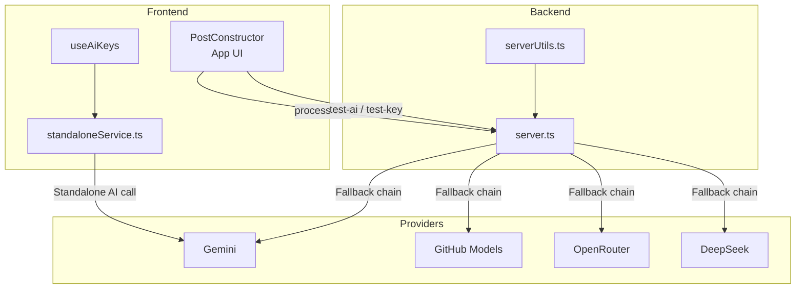
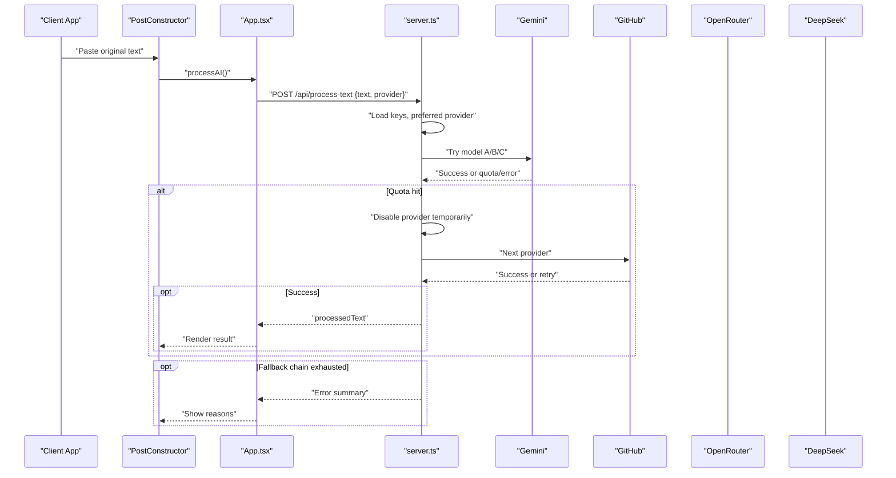
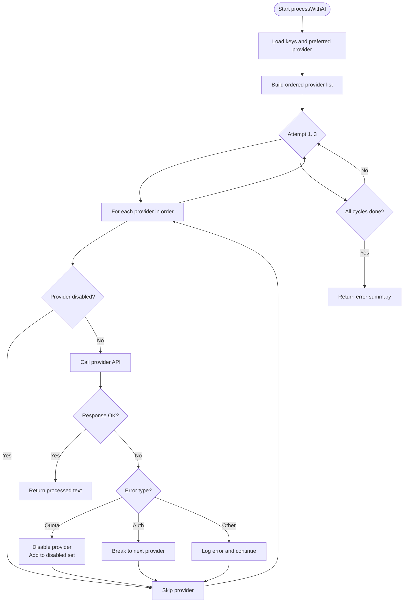
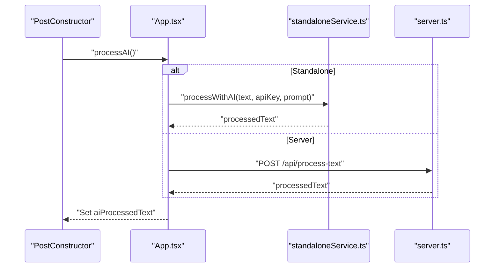
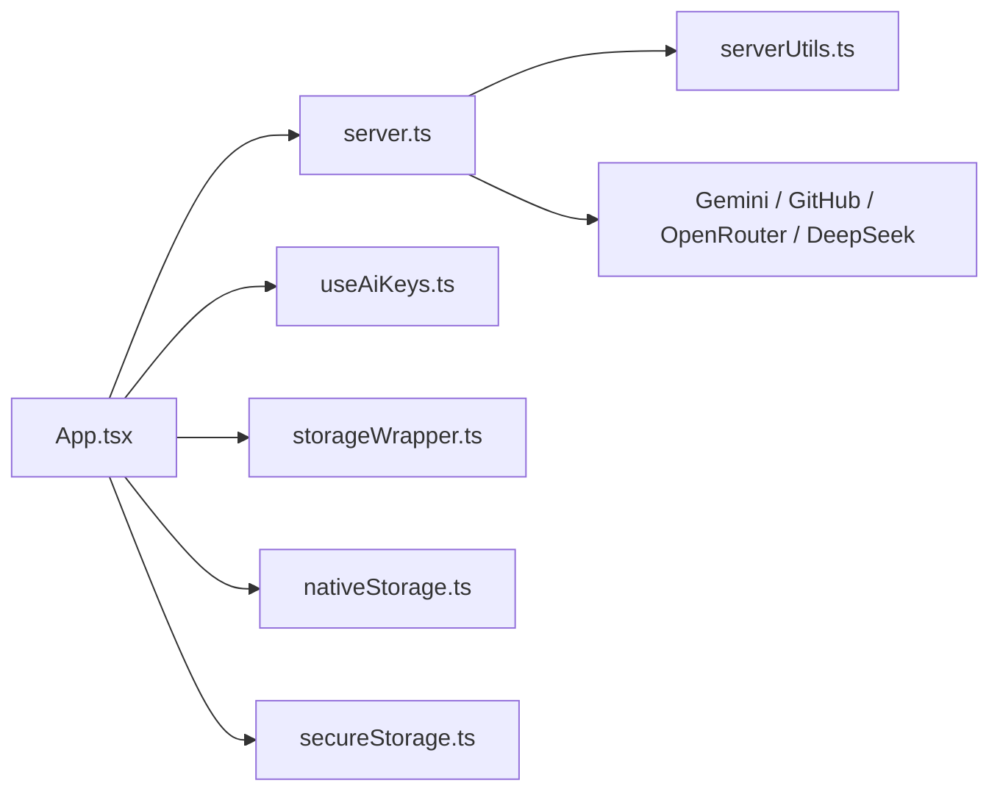

# AI Content Processing

<cite>
**Referenced Files in This Document**
- [server.ts](file://server.ts)
- [README.md](file://README.md)
- [src/hooks/useAiKeys.ts](file://src/hooks/useAiKeys.ts)
- [src/services/standaloneService.ts](file://src/services/standaloneService.ts)
- [src/App.tsx](file://src/App.tsx)
- [src/components/PostConstructor.tsx](file://src/components/PostConstructor.tsx)
- [src/types.ts](file://src/types.ts)
- [src/services/nativeStorage.ts](file://src/services/nativeStorage.ts)
- [src/services/secureStorage.ts](file://src/services/secureStorage.ts)
- [src/services/storageWrapper.ts](file://src/services/storageWrapper.ts)
- [src/serverUtils.ts](file://src/serverUtils.ts)
</cite>

## Table of Contents
1. [Introduction](#introduction)
2. [Project Structure](#project-structure)
3. [Core Components](#core-components)
4. [Architecture Overview](#architecture-overview)
5. [Detailed Component Analysis](#detailed-component-analysis)
6. [Dependency Analysis](#dependency-analysis)
7. [Performance Considerations](#performance-considerations)
8. [Troubleshooting Guide](#troubleshooting-guide)
9. [Conclusion](#conclusion)
10. [Appendices](#appendices)

## Introduction
This document explains the AI content processing system that powers multi-provider AI integrations for content translation and formatting. It covers the supported providers (Gemini, GitHub, OpenRouter, DeepSeek), fallback mechanisms, rate limiting, quota management, prompt engineering, text processing, and output formatting. It also documents error handling, retry logic, provider-specific configurations, and the relationship between providers and the overall content creation workflow.

## Project Structure
The AI content processing system spans backend and frontend components:
- Backend service exposes REST endpoints for AI processing, publishing, and configuration.
- Frontend provides a UI for content authoring, AI processing, and provider configuration.
- Shared services manage API keys, storage, and platform-specific persistence.

**Diagram sources**
- [server.ts:412-645](file://server.ts#L412-L645)
- [src/App.tsx:811-864](file://src/App.tsx#L811-L864)
- [src/hooks/useAiKeys.ts:1-57](file://src/hooks/useAiKeys.ts#L1-L57)
- [src/services/standaloneService.ts:148-159](file://src/services/standaloneService.ts#L148-L159)
- [src/serverUtils.ts:1-23](file://src/serverUtils.ts#L1-L23)

**Section sources**
- [server.ts:1-120](file://server.ts#L1-L120)
- [README.md:1-25](file://README.md#L1-L25)

## Core Components
- Multi-provider AI orchestrator: Implements a deterministic fallback order and per-provider retry/backoff.
- Rate limiters: Separate limits for general API traffic, AI requests, and mutations.
- Prompt engineering: A structured, locale-aware prompt tailored for Russian-language Telegram posts.
- Output formatting: HTML-safe sanitization and Telegram-compatible formatting.
- Provider-specific logic: Authentication, timeouts, and quota detection.
- Frontend integration: Standalone vs server-based AI processing, provider selection, and error messaging.

**Section sources**
- [server.ts:51-73](file://server.ts#L51-L73)
- [server.ts:412-645](file://server.ts#L412-L645)
- [server.ts:1150-1183](file://server.ts#L1150-L1183)
- [src/App.tsx:811-864](file://src/App.tsx#L811-L864)
- [src/services/standaloneService.ts:148-159](file://src/services/standaloneService.ts#L148-L159)

## Architecture Overview
The system routes content through a configurable AI pipeline with robust fallback and resilience:

**Diagram sources**
- [server.ts:412-645](file://server.ts#L412-L645)
- [src/App.tsx:811-864](file://src/App.tsx#L811-L864)
- [src/components/PostConstructor.tsx:144-154](file://src/components/PostConstructor.tsx#L144-L154)

## Detailed Component Analysis

### Multi-Provider Orchestrator
- Provider order: Gemini first, then GitHub, DeepSeek, OpenRouter.
- Per-provider retries: Up to three attempts with exponential-like backoff for 429/503.
- Quota handling: Detects quota exhaustion and disables the provider for subsequent cycles.
- Model fallback (Gemini): Iterates through a curated list of models until one responds.
- Timeout and error normalization: Standardizes error messages and logs.

**Diagram sources**
- [server.ts:412-645](file://server.ts#L412-L645)

**Section sources**
- [server.ts:412-645](file://server.ts#L412-L645)
- [server.ts:368-375](file://server.ts#L368-L375)

### Rate Limiting and Quota Management
- General API limiter: 1000 requests per 15 minutes.
- AI limiter: 50 requests per minute.
- Mutation limiter: 100 requests per minute.
- Quota detection: Parses provider responses/messages to detect quota exhaustion and extract retry hints.
- Temporary provider disabling: Prevents repeated failures during quota windows.

**Section sources**
- [server.ts:51-73](file://server.ts#L51-L73)
- [server.ts:368-375](file://server.ts#L368-L375)
- [server.ts:548-558](file://server.ts#L548-L558)

### Prompt Engineering and Output Formatting
- Prompt: A detailed, locale-aware instruction set for translating Chinese text to Russian, structuring content for Telegram posts, preserving technical terms, and avoiding Chinese characters.
- Output formatting: HTML tags only (<b>, <i>), sanitized for Telegram, with newline separation for blocks and optional hashtags appended.
- Frontend rendering: Markdown-to-HTML conversion with spoiler support and length checks against Telegram limits.

**Section sources**
- [server.ts:425-439](file://server.ts#L425-L439)
- [server.ts:285-340](file://server.ts#L285-L340)
- [src/components/PostConstructor.tsx:11-40](file://src/components/PostConstructor.tsx#L11-L40)
- [src/components/PostConstructor.tsx:174-179](file://src/components/PostConstructor.tsx#L174-L179)

### Provider-Specific Configurations and Integrations
- Gemini:
  - Uses a safety settings configuration and iterates through a curated model list.
  - Quota detection and retry delay parsing.
- GitHub:
  - Azure OpenAI-compatible endpoint with gpt-4o-mini.
  - Up to three retries on 429/503 with backoff.
- OpenRouter:
  - gpt-4o-mini model via OpenRouter API.
  - Up to three retries on 429/503 with backoff.
- DeepSeek:
  - deepseek-chat model with explicit parameters.
  - Direct response handling and error logging.

**Section sources**
- [server.ts:502-563](file://server.ts#L502-L563)
- [server.ts:449-500](file://server.ts#L449-L500)
- [server.ts:565-590](file://server.ts#L565-L590)
- [server.ts:592-626](file://server.ts#L592-L626)

### Frontend AI Processing Workflow
- Standalone mode: Calls Gemini directly via a local service.
- Server mode: Sends text to /api/process-text with provider preference.
- Error handling: Friendly messages for quota and key errors; logs client-side.

**Diagram sources**
- [src/App.tsx:811-864](file://src/App.tsx#L811-L864)
- [src/services/standaloneService.ts:148-159](file://src/services/standaloneService.ts#L148-L159)
- [server.ts:1150-1155](file://server.ts#L1150-L1155)

**Section sources**
- [src/App.tsx:811-864](file://src/App.tsx#L811-L864)
- [src/services/standaloneService.ts:148-159](file://src/services/standaloneService.ts#L148-L159)

### Storage and Keys Management
- API keys:
  - Loaded from persistent storage or environment variables.
  - Updated via UI and saved to persistent storage.
- Persistent storage:
  - Capacitor-based filesystem and preferences for native.
  - Fallback to localStorage for web.
- Security:
  - Sensitive tokens stored with a secure prefix.

**Section sources**
- [src/hooks/useAiKeys.ts:1-57](file://src/hooks/useAiKeys.ts#L1-L57)
- [src/services/storageWrapper.ts:1-100](file://src/services/storageWrapper.ts#L1-L100)
- [src/services/nativeStorage.ts:1-63](file://src/services/nativeStorage.ts#L1-L63)
- [src/services/secureStorage.ts:1-40](file://src/services/secureStorage.ts#L1-L40)

### Logging and Diagnostics
- File logger: Writes structured logs to disk for diagnostics.
- Runtime logs: In-memory streaming via SSE endpoint for UI.

**Section sources**
- [src/serverUtils.ts:1-23](file://src/serverUtils.ts#L1-L23)
- [server.ts:342-352](file://server.ts#L342-L352)

## Dependency Analysis
The AI processing pipeline depends on:
- Provider SDKs and HTTP clients.
- Telegram integration for publishing.
- Frontend services for UI orchestration and storage.

**Diagram sources**
- [src/App.tsx:811-864](file://src/App.tsx#L811-L864)
- [server.ts:1-120](file://server.ts#L1-L120)
- [src/hooks/useAiKeys.ts:1-57](file://src/hooks/useAiKeys.ts#L1-L57)
- [src/services/storageWrapper.ts:1-100](file://src/services/storageWrapper.ts#L1-L100)
- [src/services/nativeStorage.ts:1-63](file://src/services/nativeStorage.ts#L1-L63)
- [src/services/secureStorage.ts:1-40](file://src/services/secureStorage.ts#L1-L40)
- [src/serverUtils.ts:1-23](file://src/serverUtils.ts#L1-L23)

**Section sources**
- [server.ts:1-120](file://server.ts#L1-L120)
- [src/App.tsx:811-864](file://src/App.tsx#L811-L864)

## Performance Considerations
- Provider selection: Prefer the preferred provider first to minimize latency.
- Backoff strategy: Exponential-like delays reduce contention on throttled endpoints.
- Model fallback: Quick switch to alternative models reduces single-point-of-failure risk.
- Streaming logs: SSE keeps UI responsive while long-running AI calls execute.
- Frontend rendering: Spoiler and HTML preprocessing optimize rendering and Telegram compatibility.

[No sources needed since this section provides general guidance]

## Troubleshooting Guide
Common issues and resolutions:
- Missing API keys:
  - Ensure keys are set in UI or environment variables.
  - Verify provider-specific keys for each provider.
- Quota exceeded:
  - The system detects quota exhaustion and disables the provider temporarily.
  - Wait for the suggested retry window or switch providers.
- Authentication errors:
  - 401/403 responses indicate invalid or insufficiently scoped tokens.
- Network errors:
  - Transient 429/503 are retried automatically.
- Frontend errors:
  - Standalone mode requires a valid Gemini key.
  - Server mode requires a reachable server URL.

**Section sources**
- [server.ts:548-558](file://server.ts#L548-L558)
- [server.ts:484-498](file://server.ts#L484-L498)
- [src/App.tsx:855-859](file://src/App.tsx#L855-L859)

## Conclusion
The AI content processing system provides a resilient, multi-provider pipeline with strong fallbacks, rate limiting, and quota-aware behavior. It integrates seamlessly with Telegram publishing and offers both standalone and server-based AI processing modes. The prompt engineering and output formatting ensure high-quality, Telegram-ready posts.

[No sources needed since this section summarizes without analyzing specific files]

## Appendices

### API Definitions
- POST /api/process-text
  - Body: { text: string, provider?: string }
  - Response: { processedText: string }
  - Limits: AI limiter active
- POST /api/test-ai
  - Body: { provider: string, apiKey: string, text?: string }
  - Response: { success: true, result: string }
  - Limits: AI limiter active
- POST /api/config/api-key
  - Body: { apiKey: string, provider: string } or { preferredProvider: string }
  - Response: { success: true }

**Section sources**
- [server.ts:1150-1155](file://server.ts#L1150-L1155)
- [server.ts:1328-1339](file://server.ts#L1328-L1339)
- [server.ts:1038-1048](file://server.ts#L1038-L1048)

### Provider Setup Examples
- Environment variables:
  - GEMINI_API_KEY
  - GITHUB_TOKEN
  - OPENROUTER_API_KEY
  - DEEPSEEK_API_KEY
- UI configuration:
  - Manage API Keys screen to set provider keys and preferred provider.

**Section sources**
- [README.md:18-22](file://README.md#L18-L22)
- [server.ts:1038-1048](file://server.ts#L1038-L1048)

### Data Types
- DraftPost: Includes text, images, buttons, scheduling, and timestamps.
- ParsedContent: Title, text, and images extracted from URLs.

**Section sources**
- [src/types.ts:13-26](file://src/types.ts#L13-L26)
- [src/types.ts:7-11](file://src/types.ts#L7-L11)