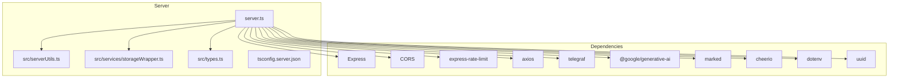
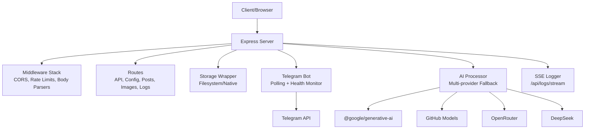
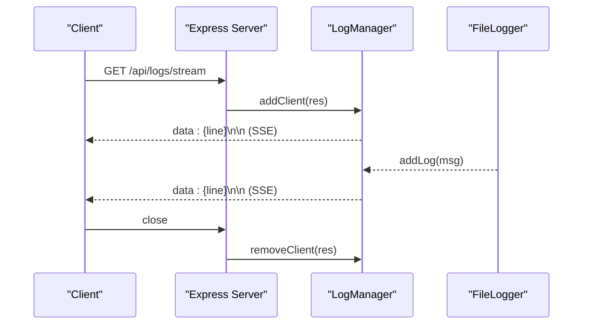
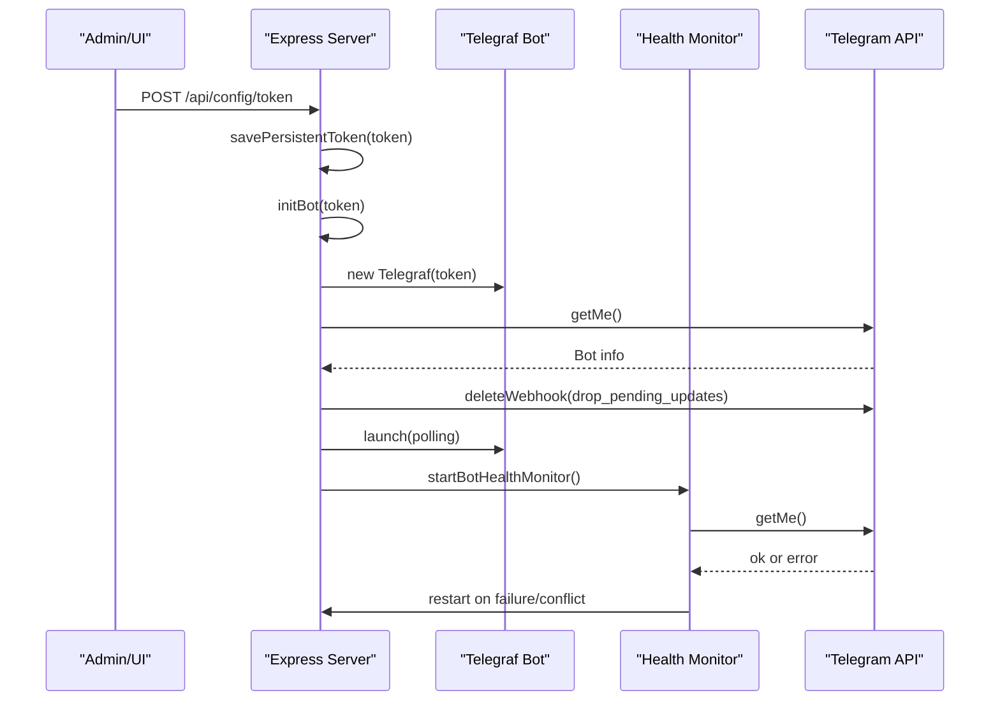
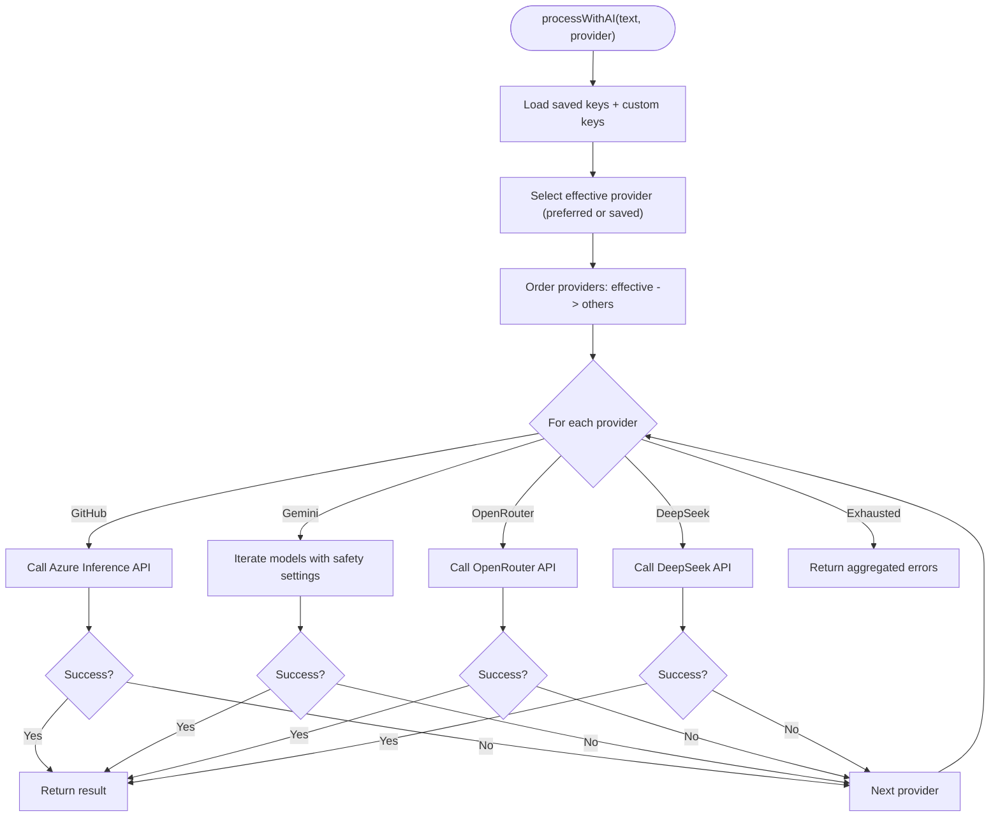
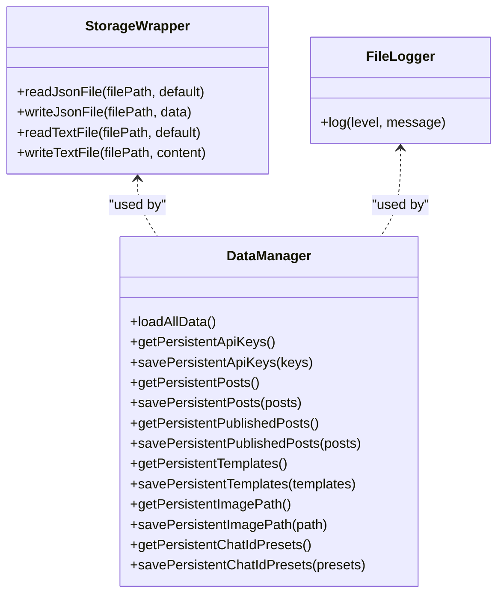
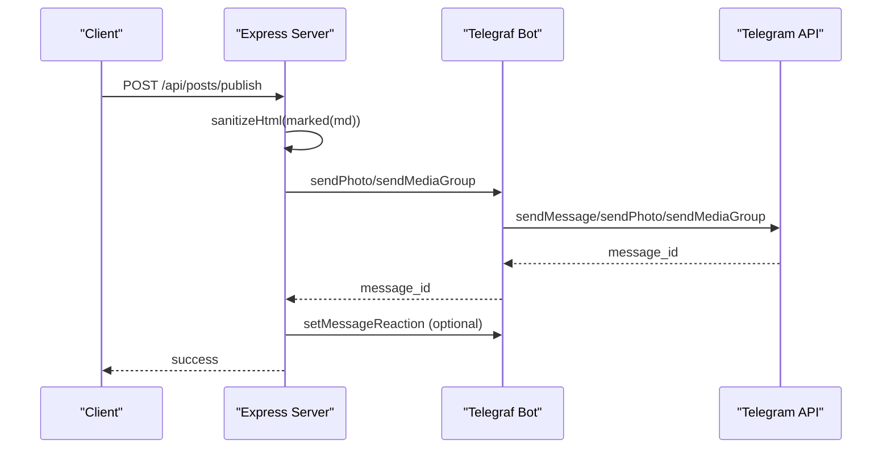
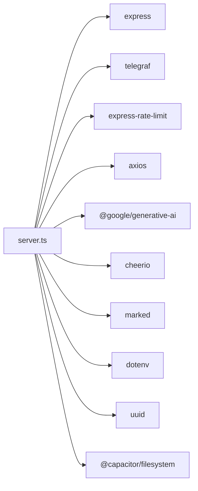

# Backend Server

<cite>
**Referenced Files in This Document**
- [server.ts](file://server.ts)
- [package.json](file://package.json)
- [README.md](file://README.md)
- [src/serverUtils.ts](file://src/serverUtils.ts)
- [src/services/storageWrapper.ts](file://src/services/storageWrapper.ts)
- [src/types.ts](file://src/types.ts)
- [tsconfig.server.json](file://tsconfig.server.json)
</cite>

## Table of Contents
1. [Introduction](#introduction)
2. [Project Structure](#project-structure)
3. [Core Components](#core-components)
4. [Architecture Overview](#architecture-overview)
5. [Detailed Component Analysis](#detailed-component-analysis)
6. [Dependency Analysis](#dependency-analysis)
7. [Performance Considerations](#performance-considerations)
8. [Troubleshooting Guide](#troubleshooting-guide)
9. [Conclusion](#conclusion)

## Introduction
This document describes the Express backend server that powers a Telegram bot publishing pipeline. It covers server initialization, middleware configuration, API endpoint structure, error handling, Telegram bot lifecycle and health monitoring, AI content processing with multi-provider support, rate limiting and quota management, data storage and caching, and real-time logging via Server-Sent Events.

## Project Structure
The backend is implemented as a single-file Express server with modularized utilities and service wrappers:
- server.ts: Main server, middleware, routes, bot lifecycle, AI processing, logging, scheduling, and storage integration
- src/serverUtils.ts: File-based logging utility
- src/services/storageWrapper.ts: Cross-platform file persistence abstraction (native vs Node.js)
- src/types.ts: Shared TypeScript interfaces for posts and configuration
- tsconfig.server.json: Build configuration for the server
- package.json: Dependencies and scripts
- README.md: Quickstart and environment setup

**Diagram sources**
- [server.ts:1-1454](file://server.ts#L1-L1454)
- [src/serverUtils.ts:1-23](file://src/serverUtils.ts#L1-L23)
- [src/services/storageWrapper.ts:1-100](file://src/services/storageWrapper.ts#L1-L100)
- [src/types.ts:1-48](file://src/types.ts#L1-L48)
- [tsconfig.server.json:1-15](file://tsconfig.server.json#L1-L15)
- [package.json:19-56](file://package.json#L19-L56)

**Section sources**
- [server.ts:1-1454](file://server.ts#L1-L1454)
- [package.json:19-56](file://package.json#L19-L56)

## Core Components
- Express server and middleware stack
- Rate limiters for API, AI, and mutations
- Telegram bot lifecycle manager with polling and health checks
- AI content processor with multi-provider fallback and quota detection
- Real-time logging via Server-Sent Events
- File-based persistence with cross-platform storage wrapper
- Scheduled publishing scheduler

**Section sources**
- [server.ts:37-73](file://server.ts#L37-L73)
- [server.ts:218-277](file://server.ts#L218-L277)
- [server.ts:411-645](file://server.ts#L411-L645)
- [server.ts:1379-1452](file://server.ts#L1379-L1452)

## Architecture Overview
The server initializes environment, loads persisted data, sets up middleware, registers API routes, and starts the Telegram bot in polling mode. It exposes endpoints for configuration, content processing, image management, drafts/scheduling, and logs streaming. A background scheduler periodically publishes scheduled posts.

**Diagram sources**
- [server.ts:37-73](file://server.ts#L37-L73)
- [server.ts:936-1377](file://server.ts#L936-L1377)
- [server.ts:673-799](file://server.ts#L673-L799)
- [server.ts:411-645](file://server.ts#L411-L645)
- [server.ts:218-277](file://server.ts#L218-L277)

## Detailed Component Analysis

### Server Initialization and Middleware
- Environment validation ensures required variables are present
- Trust proxy is enabled for reverse proxy scenarios
- Body parsers accept large payloads (JSON/URL-encoded up to 50MB)
- CORS allows dynamic origins with credentials and common methods/headers
- Three rate limiters:
  - API limiter: 1000 requests per 15 minutes
  - AI limiter: 50 requests per minute
  - Mutation limiter: 100 requests per minute
- Data directory and file paths for persistent state
- In-memory caches for API keys, posts, published posts, templates, image path, and chat ID presets

**Section sources**
- [server.ts:24-35](file://server.ts#L24-L35)
- [server.ts:37-73](file://server.ts#L37-L73)
- [server.ts:74-173](file://server.ts#L74-L173)

### Real-Time Logging with Server-Sent Events
- LogManager maintains a ring buffer of recent logs and broadcasts to connected clients
- Endpoint /api/logs/stream serves Server-Sent Events with keep-alive headers
- Clients receive JSON-encoded log lines; disconnected clients are removed automatically

**Diagram sources**
- [server.ts:342-352](file://server.ts#L342-L352)
- [server.ts:218-277](file://server.ts#L218-L277)
- [src/serverUtils.ts:7-22](file://src/serverUtils.ts#L7-L22)

**Section sources**
- [server.ts:218-277](file://server.ts#L218-L277)
- [server.ts:342-352](file://server.ts#L342-L352)
- [src/serverUtils.ts:7-22](file://src/serverUtils.ts#L7-L22)

### Telegram Bot Lifecycle Management
- Token and chat ID persistence with file-based storage and in-memory caches
- initBot creates a Telegraf instance with polling, deletes webhooks, and validates connectivity
- Health monitor periodically calls getMe; on failures or conflicts, it restarts the bot
- Graceful shutdown on SIGINT/SIGTERM; stops polling and clears intervals

**Diagram sources**
- [server.ts:688-799](file://server.ts#L688-L799)
- [server.ts:377-409](file://server.ts#L377-L409)

**Section sources**
- [server.ts:175-202](file://server.ts#L175-L202)
- [server.ts:688-799](file://server.ts#L688-L799)
- [server.ts:377-409](file://server.ts#L377-L409)

### AI Content Processing Pipeline
- Multi-provider support: Gemini, GitHub, OpenRouter, DeepSeek
- Preferred provider selection with fallback chain
- Safety settings for Gemini; model fallback loop
- Quota detection via error messages and retry hints
- Rate limiting enforced per request
- Markdown-to-HTML conversion with Cheerio and Telegram-safe sanitization

**Diagram sources**
- [server.ts:411-645](file://server.ts#L411-L645)

**Section sources**
- [server.ts:411-645](file://server.ts#L411-L645)
- [src/types.ts:13-26](file://src/types.ts#L13-L26)

### Data Storage System and Caching
- Persistent files:
  - bot_token.txt, chat_id.txt, api_keys.json, posts.json, published_posts.json, templates.json, image_path.txt, chat_id_presets.json
- In-memory caches mirror persisted state for fast reads/writes
- storageWrapper abstracts filesystem access:
  - Native platform (Capacitor): @capacitor/filesystem
  - Desktop: Node.js fs
- Utility functions:
  - readJsonFile/readTextFile/writeJsonFile/writeTextFile
  - loadAllData initializes caches on startup

**Diagram sources**
- [src/services/storageWrapper.ts:9-99](file://src/services/storageWrapper.ts#L9-L99)
- [src/serverUtils.ts:7-22](file://src/serverUtils.ts#L7-L22)
- [server.ts:127-173](file://server.ts#L127-L173)

**Section sources**
- [server.ts:74-173](file://server.ts#L74-L173)
- [src/services/storageWrapper.ts:9-99](file://src/services/storageWrapper.ts#L9-L99)
- [src/serverUtils.ts:7-22](file://src/serverUtils.ts#L7-L22)

### API Endpoint Structure
Key endpoints grouped by functionality:

- Status and Health
  - GET /api/ping
  - GET /api/status

- Configuration
  - POST /api/config/token
  - POST /api/config/clear-token
  - POST /api/config/chat-id
  - GET /api/config/chat-id
  - GET /api/config/chat-id-presets
  - POST /api/config/chat-id-presets
  - POST /api/config/api-key
  - GET /api/config/server-key
  - GET /api/config/status
  - POST /api/config/image-path
  - GET /api/config/image-path

- Bot Control
  - POST /api/bot/test-message
  - POST /api/bot/stop
  - POST /api/bot/restart

- Image Management
  - POST /api/upload-images
  - GET /api/images/sync
  - GET /api/images/file/:filename

- Logs
  - GET /api/logs
  - GET /api/logs/stream

- AI and Content
  - POST /api/process-text
  - POST /api/process-url
  - POST /api/test-key
  - POST /api/test-ai

- Posts and Scheduling
  - GET /api/posts/drafts
  - POST /api/posts/drafts
  - DELETE /api/posts/drafts/:id
  - GET /api/posts/scheduled
  - GET /api/posts/published
  - DELETE /api/posts/published/:id
  - POST /api/posts/schedule
  - POST /api/posts/publish

- Templates
  - GET/POST/DELETE /api/posts/templates/buttons
  - GET/POST/DELETE /api/posts/templates/reactions

- Utilities
  - GET /api/utils/list-dirs
  - POST /api/test-telegram

Rate limiting applies per endpoint group as configured.

**Section sources**
- [server.ts:936-1377](file://server.ts#L936-L1377)

### Publishing Workflow
- Validates chat ID and post content
- Converts markdown to HTML with Telegram-safe tags
- Sends photo(s) with optional caption and inline buttons
- Applies reactions to the first message
- Supports media groups and pagination
- Saves published posts with timestamps

**Diagram sources**
- [server.ts:805-934](file://server.ts#L805-L934)

**Section sources**
- [server.ts:805-934](file://server.ts#L805-L934)

### Scheduled Publishing Scheduler
- Runs every minute to check scheduled posts
- Publishes eligible posts and updates status to published
- Persists updated posts and enforces small delays between publications

**Section sources**
- [server.ts:1420-1446](file://server.ts#L1420-L1446)

## Dependency Analysis
- Express: Web framework and routing
- Telegraf: Telegram bot SDK with polling
- express-rate-limit: Request throttling
- axios: HTTP client for external APIs
- @google/generative-ai: Gemini integration
- cheerio + marked: HTML/markdown processing
- dotenv: Environment loading
- uuid: Unique identifiers
- Capacitor filesystem: Native persistence

**Diagram sources**
- [server.ts:1-17](file://server.ts#L1-L17)
- [package.json:19-56](file://package.json#L19-L56)

**Section sources**
- [package.json:19-56](file://package.json#L19-L56)

## Performance Considerations
- Payload limits: JSON and URL-encoded bodies up to 50MB
- Rate limiting: Prevents abuse and protects downstream providers
- Model fallback: Gemini tries multiple models to mitigate unavailability
- Quota detection: Recognizes quota exhaustion and disables provider temporarily
- Streaming images: Serves files directly from disk with size and path checks
- Background scheduler: Minimizes overhead by checking once per minute

[No sources needed since this section provides general guidance]

## Troubleshooting Guide
Common issues and remedies:
- Missing environment variables: Ensure TELEGRAM_BOT_TOKEN and provider keys are set
- Bot conflicts (409): Health monitor detects and restarts; manual restart via /api/bot/restart
- Network timeouts: Telegraf catches ETIMEDOUT/ECONNRESET; bot continues attempting
- Quota exceeded: Gemini quota detection returns retry hints; disable provider until retry window
- Path traversal and restricted directories: Upload and directory listing endpoints enforce safe paths
- Image upload restrictions: Destination path must not be system-sensitive; sanitized filenames enforced

Operational controls:
- GET /api/status: Verify bot state, chat ID presence, and server URL
- GET /api/logs: Retrieve recent logs
- GET /api/logs/stream: Real-time log feed
- POST /api/bot/test-message: Validate bot and chat ID configuration
- POST /api/test-key: Validate Gemini key/model availability

**Section sources**
- [server.ts:24-35](file://server.ts#L24-L35)
- [server.ts:377-409](file://server.ts#L377-L409)
- [server.ts:975-989](file://server.ts#L975-L989)
- [server.ts:1066-1072](file://server.ts#L1066-L1072)
- [server.ts:1289-1326](file://server.ts#L1289-L1326)

## Conclusion
The backend server integrates a robust Express application with a Telegram bot, multi-provider AI processing, real-time logging, and resilient data persistence. It provides a comprehensive set of endpoints for configuration, content processing, scheduling, and monitoring, with built-in rate limiting and health checks to ensure reliability.