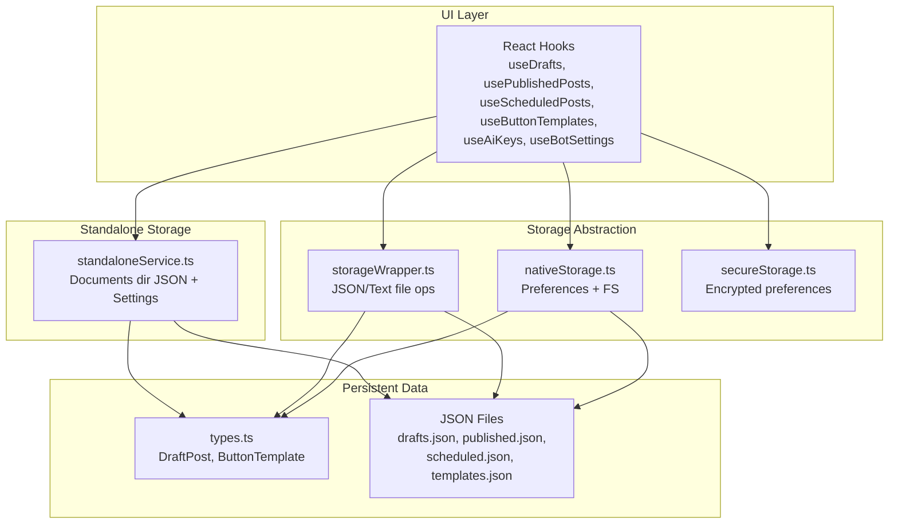
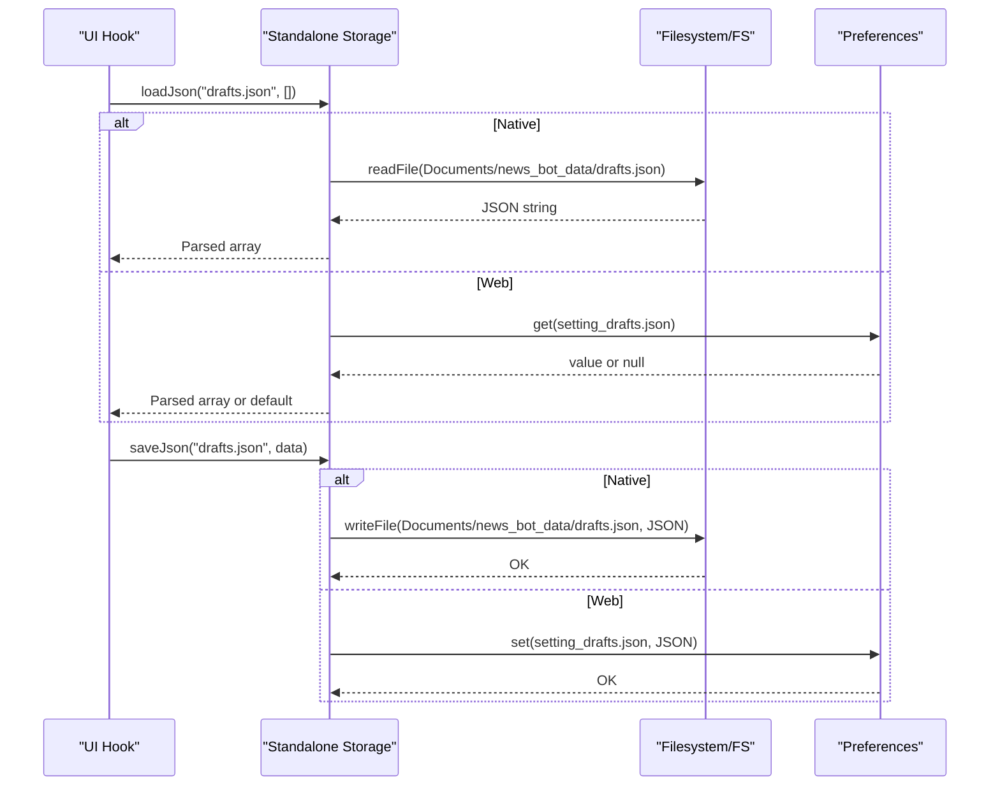
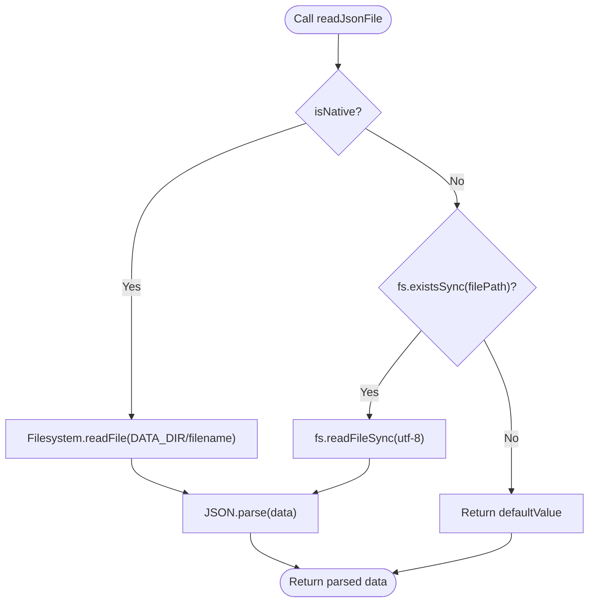
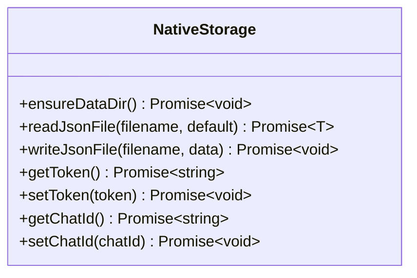
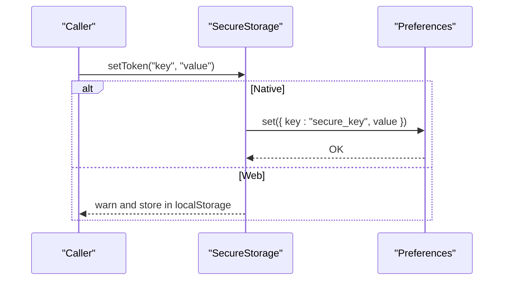
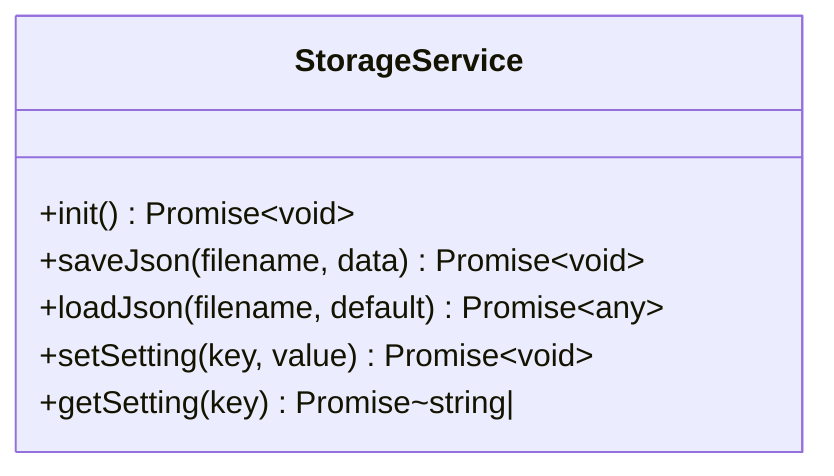
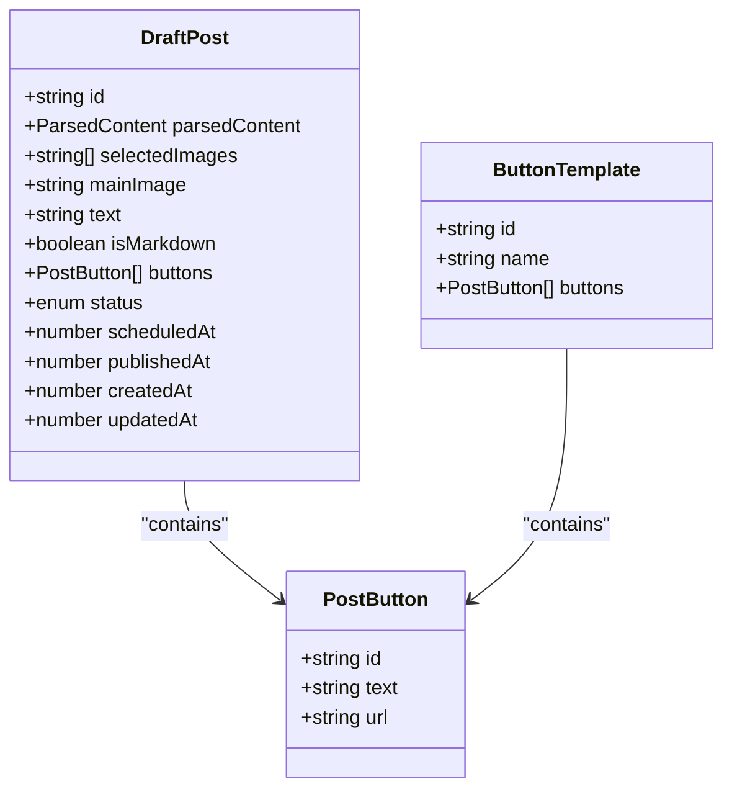
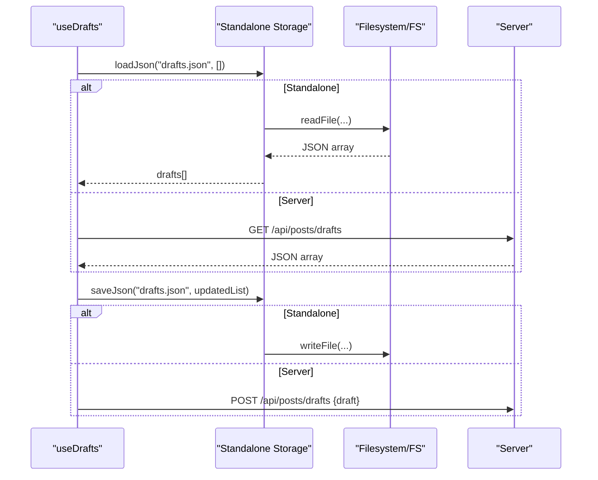
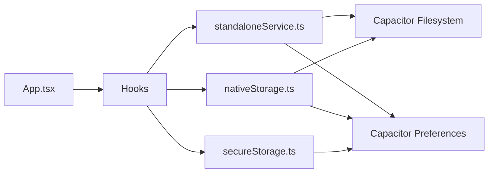

# Data Storage and Persistence

<cite>
**Referenced Files in This Document**
- [storageWrapper.ts](file://src/services/storageWrapper.ts)
- [nativeStorage.ts](file://src/services/nativeStorage.ts)
- [secureStorage.ts](file://src/services/secureStorage.ts)
- [standaloneService.ts](file://src/services/standaloneService.ts)
- [useAiKeys.ts](file://src/hooks/useAiKeys.ts)
- [useBotSettings.ts](file://src/hooks/useBotSettings.ts)
- [useButtonTemplates.ts](file://src/hooks/useButtonTemplates.ts)
- [useDrafts.ts](file://src/hooks/useDrafts.ts)
- [usePublishedPosts.ts](file://src/hooks/usePublishedPosts.ts)
- [useScheduledPosts.ts](file://src/hooks/useScheduledPosts.ts)
- [useServerConnection.ts](file://src/hooks/useServerConnection.ts)
- [types.ts](file://src/types.ts)
- [App.tsx](file://src/App.tsx)
</cite>

## Table of Contents
1. [Introduction](#introduction)
2. [Project Structure](#project-structure)
3. [Core Components](#core-components)
4. [Architecture Overview](#architecture-overview)
5. [Detailed Component Analysis](#detailed-component-analysis)
6. [Dependency Analysis](#dependency-analysis)
7. [Performance Considerations](#performance-considerations)
8. [Troubleshooting Guide](#troubleshooting-guide)
9. [Conclusion](#conclusion)

## Introduction
This document explains the data storage and persistence system used by the application. It covers the file-based storage architecture using JSON and text files for configuration data, the storage wrapper abstraction layer, caching mechanisms, and data synchronization patterns. It also documents the persistent data structures for API keys, posts, published content, templates, and chat ID presets, along with file I/O operations, error handling, and data validation. Examples of data loading, saving, and migration procedures are included, as well as the relationship between cached data and persistent storage.

## Project Structure
The storage system is organized around three primary layers:
- Abstraction layer for cross-platform file I/O and preferences
- Standalone storage service for JSON/text persistence
- React hooks that expose data to UI components and orchestrate loading/saving

**Diagram sources**
- [storageWrapper.ts:1-100](file://src/services/storageWrapper.ts#L1-L100)
- [nativeStorage.ts:1-63](file://src/services/nativeStorage.ts#L1-L63)
- [secureStorage.ts:1-40](file://src/services/secureStorage.ts#L1-L40)
- [standaloneService.ts:11-72](file://src/services/standaloneService.ts#L11-L72)
- [types.ts:13-32](file://src/types.ts#L13-L32)

**Section sources**
- [storageWrapper.ts:1-100](file://src/services/storageWrapper.ts#L1-L100)
- [nativeStorage.ts:1-63](file://src/services/nativeStorage.ts#L1-L63)
- [secureStorage.ts:1-40](file://src/services/secureStorage.ts#L1-L40)
- [standaloneService.ts:11-72](file://src/services/standaloneService.ts#L11-L72)
- [types.ts:13-32](file://src/types.ts#L13-L32)

## Core Components
- Storage wrapper abstraction
  - Provides unified JSON and text file read/write for both native and web platforms.
  - Uses Capacitor Filesystem on native and Node.js filesystem on web.
- Native storage
  - Ensures a dedicated data directory on native, reads/writes JSON via Filesystem or Preferences fallback.
  - Exposes token and chat ID getters/setters via Preferences.
- Secure storage
  - Wraps Preferences for encrypted token storage on native; falls back to localStorage on web with a warning.
- Standalone storage service
  - Initializes a Documents directory and persists JSON/text files under a dedicated folder.
  - Stores settings in Preferences on native; localStorage fallback on web.
- React hooks
  - Encapsulate loading, saving, and updating of drafts, published posts, scheduled posts, button templates, AI keys, and bot settings.
  - Coordinate between standalone storage and remote server APIs depending on mode.

**Section sources**
- [storageWrapper.ts:9-99](file://src/services/storageWrapper.ts#L9-L99)
- [nativeStorage.ts:8-62](file://src/services/nativeStorage.ts#L8-L62)
- [secureStorage.ts:4-39](file://src/services/secureStorage.ts#L4-L39)
- [standaloneService.ts:11-72](file://src/services/standaloneService.ts#L11-L72)
- [useDrafts.ts:1-88](file://src/hooks/useDrafts.ts#L1-L88)
- [usePublishedPosts.ts:1-38](file://src/hooks/usePublishedPosts.ts#L1-L38)
- [useScheduledPosts.ts:1-38](file://src/hooks/useScheduledPosts.ts#L1-L38)
- [useButtonTemplates.ts:1-38](file://src/hooks/useButtonTemplates.ts#L1-L38)
- [useAiKeys.ts:1-57](file://src/hooks/useAiKeys.ts#L1-L57)
- [useBotSettings.ts:1-56](file://src/hooks/useBotSettings.ts#L1-L56)

## Architecture Overview
The system supports two operational modes:
- Standalone mode: All data is persisted locally using JSON/text files and Preferences.
- Server-connected mode: Data is fetched from and posted to a remote server; local cache is refreshed periodically.

**Diagram sources**
- [standaloneService.ts:25-71](file://src/services/standaloneService.ts#L25-L71)

**Section sources**
- [standaloneService.ts:11-72](file://src/services/standaloneService.ts#L11-L72)
- [App.tsx:539-570](file://src/App.tsx#L539-L570)

## Detailed Component Analysis

### Storage Wrapper Abstraction (storageWrapper)
- Purpose: Unified JSON and text file I/O across native and web.
- Behavior:
  - readJsonFile(filePath, default): Reads UTF-8 JSON; returns default on failure.
  - writeJsonFile(filePath, data): Writes formatted JSON; creates directory on native.
  - readTextFile(filePath, default): Trims and returns text; returns default on failure.
  - writeTextFile(filePath, content): Writes text; creates directory on native.
- Platform differences:
  - Native: Uses Capacitor Filesystem with a fixed data directory.
  - Web: Uses Node.js filesystem or localStorage fallbacks.

**Diagram sources**
- [storageWrapper.ts:10-33](file://src/services/storageWrapper.ts#L10-L33)

**Section sources**
- [storageWrapper.ts:9-99](file://src/services/storageWrapper.ts#L9-L99)

### Native Storage (nativeStorage)
- Purpose: Provide a small subset of storage primitives with a data directory guarantee on native and Preferences fallback on web.
- Features:
  - ensureDataDir(): Creates a data directory on native.
  - readJsonFile(filename, default): Reads JSON from FS or localStorage.
  - writeJsonFile(filename, data): Writes JSON to FS or localStorage.
  - Token and chat ID helpers via Preferences.

**Diagram sources**
- [nativeStorage.ts:8-62](file://src/services/nativeStorage.ts#L8-L62)

**Section sources**
- [nativeStorage.ts:1-63](file://src/services/nativeStorage.ts#L1-L63)

### Secure Storage (SecureStorage)
- Purpose: Encrypted token storage abstraction.
- Behavior:
  - On native: Uses Preferences (encrypted on modern devices).
  - On web: Warns and stores in localStorage.

**Diagram sources**
- [secureStorage.ts:7-38](file://src/services/secureStorage.ts#L7-L38)

**Section sources**
- [secureStorage.ts:1-40](file://src/services/secureStorage.ts#L1-L40)

### Standalone Storage Service (standaloneService)
- Purpose: Centralized storage for standalone mode with a Documents directory and Preferences-backed settings.
- Capabilities:
  - init(): Creates a Documents directory on native.
  - saveJson(filename, data): Writes JSON to Documents directory or localStorage.
  - loadJson(filename, default): Reads JSON from Documents directory or localStorage.
  - setSetting/getSetting: Persists settings via Preferences or localStorage.

**Diagram sources**
- [standaloneService.ts:11-72](file://src/services/standaloneService.ts#L11-L72)

**Section sources**
- [standaloneService.ts:11-72](file://src/services/standaloneService.ts#L11-L72)

### Persistent Data Structures
- DraftPost: Represents a draft with parsed content, selected images, optional main image, AI-processed text, buttons, status, timestamps, and creation/update metadata.
- ButtonTemplate: Defines reusable button configurations for posts.
- Migrations and defaults:
  - Hooks accept empty arrays or empty objects and normalize to arrays/lists.
  - Settings retrieval returns defaults when keys are absent.

**Diagram sources**
- [types.ts:13-32](file://src/types.ts#L13-L32)

**Section sources**
- [types.ts:13-32](file://src/types.ts#L13-L32)

### Data Loading and Saving Patterns
- Drafts:
  - Loading: useDrafts loads drafts.json from standalone storage or server endpoint.
  - Saving: useDrafts merges or appends drafts and re-fetches the list.
  - Deletion: removes from drafts.json and also from scheduled.json when applicable.
- Published/Scheduled posts:
  - usePublishedPosts and useScheduledPosts load arrays from JSON or server endpoints.
- Templates:
  - useButtonTemplates loads templates.json in standalone mode or fetches from server.
- Settings and Keys:
  - useBotSettings loads tokens and chat IDs from secure storage or localStorage.
  - useAiKeys loads multiple API keys from standalone settings or localStorage.

**Diagram sources**
- [useDrafts.ts:9-54](file://src/hooks/useDrafts.ts#L9-L54)
- [standaloneService.ts:25-54](file://src/services/standaloneService.ts#L25-L54)

**Section sources**
- [useDrafts.ts:1-88](file://src/hooks/useDrafts.ts#L1-L88)
- [usePublishedPosts.ts:1-38](file://src/hooks/usePublishedPosts.ts#L1-L38)
- [useScheduledPosts.ts:1-38](file://src/hooks/useScheduledPosts.ts#L1-L38)
- [useButtonTemplates.ts:1-38](file://src/hooks/useButtonTemplates.ts#L1-L38)
- [useBotSettings.ts:1-56](file://src/hooks/useBotSettings.ts#L1-L56)
- [useAiKeys.ts:1-57](file://src/hooks/useAiKeys.ts#L1-L57)

### Relationship Between Cached Data and Persistent Storage
- Cached data:
  - UI state managed by React hooks reflects the latest loaded data.
  - Standalone mode caches JSON arrays in memory after loading from files.
- Persistent storage:
  - Standalone writes JSON files and settings to the Documents directory or localStorage.
  - Server mode updates server-side resources and refreshes client cache.
- Synchronization:
  - After save operations, hooks trigger reloads to keep cache and persistence in sync.

**Section sources**
- [App.tsx:548-570](file://src/App.tsx#L548-L570)
- [useDrafts.ts:31-54](file://src/hooks/useDrafts.ts#L31-L54)

## Dependency Analysis
- UI hooks depend on standaloneService for file-based storage and on nativeStorage/secureStorage for tokens/settings.
- standaloneService depends on Capacitor Filesystem and Preferences for native persistence and localStorage for web.
- storageWrapper provides a lower-level abstraction used by higher-level services.

**Diagram sources**
- [standaloneService.ts:1-72](file://src/services/standaloneService.ts#L1-L72)
- [nativeStorage.ts:1-63](file://src/services/nativeStorage.ts#L1-L63)
- [secureStorage.ts:1-40](file://src/services/secureStorage.ts#L1-L40)
- [App.tsx:15-25](file://src/App.tsx#L15-L25)

**Section sources**
- [standaloneService.ts:1-72](file://src/services/standaloneService.ts#L1-L72)
- [nativeStorage.ts:1-63](file://src/services/nativeStorage.ts#L1-L63)
- [secureStorage.ts:1-40](file://src/services/secureStorage.ts#L1-L40)
- [App.tsx:15-25](file://src/App.tsx#L15-L25)

## Performance Considerations
- Prefer batched reads/writes in hooks to minimize repeated disk/network operations.
- Normalize and validate data early to avoid expensive re-processing.
- Use selective loading (e.g., templates only when needed) to reduce initial payload.
- On native, ensure directories exist once during initialization to avoid repeated mkdir calls.

## Troubleshooting Guide
- JSON parsing errors:
  - readJsonFile/loadJson return defaults when parsing fails; verify file existence and content.
- Filesystem permission errors (native):
  - Ensure external storage permissions are granted before reading directories.
- Network timeouts and malformed URLs:
  - useServerConnection and universalFetch enforce URL validation and timeouts; inspect returned error messages.
- Token not found:
  - SecureStorage falls back to localStorage on web; confirm key prefixes and platform-specific behavior.

**Section sources**
- [storageWrapper.ts:10-33](file://src/services/storageWrapper.ts#L10-L33)
- [standaloneService.ts:38-54](file://src/services/standaloneService.ts#L38-L54)
- [useServerConnection.ts:20-42](file://src/hooks/useServerConnection.ts#L20-L42)
- [secureStorage.ts:14-18](file://src/services/secureStorage.ts#L14-L18)

## Conclusion
The application’s storage system cleanly separates concerns across abstraction, standalone persistence, and UI hooks. It supports robust file-based JSON/text storage with graceful fallbacks and integrates secure token handling. Hooks encapsulate loading, saving, and synchronization, ensuring that cached UI state remains consistent with persistent storage across both standalone and server-connected modes.