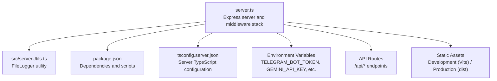
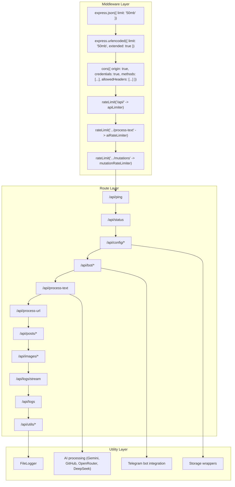
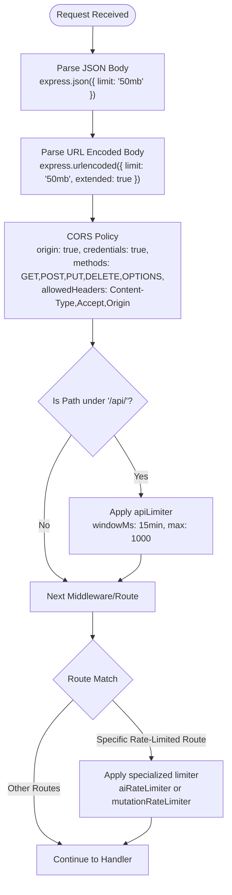
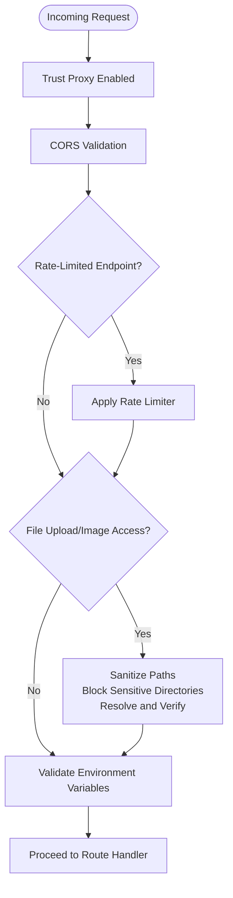
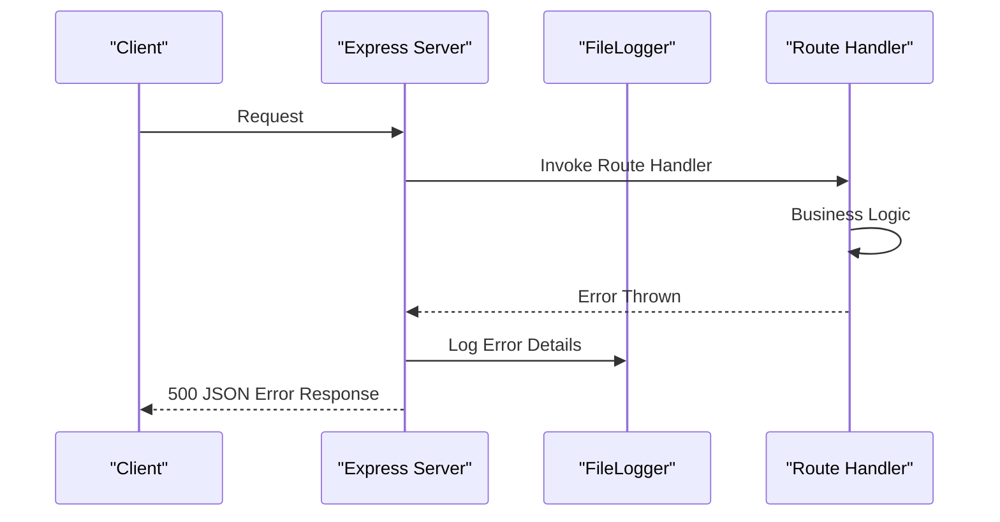
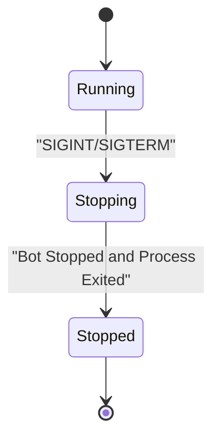
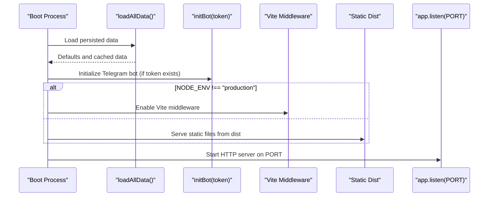
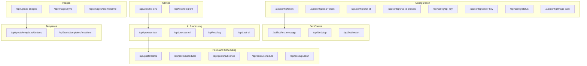
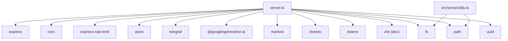

# Express Server Architecture

<cite>
**Referenced Files in This Document**
- [server.ts](file://server.ts)
- [package.json](file://package.json)
- [src/serverUtils.ts](file://src/serverUtils.ts)
- [tsconfig.server.json](file://tsconfig.server.json)
</cite>

## Table of Contents
1. [Introduction](#introduction)
2. [Project Structure](#project-structure)
3. [Core Components](#core-components)
4. [Architecture Overview](#architecture-overview)
5. [Detailed Component Analysis](#detailed-component-analysis)
6. [Dependency Analysis](#dependency-analysis)
7. [Performance Considerations](#performance-considerations)
8. [Troubleshooting Guide](#troubleshooting-guide)
9. [Conclusion](#conclusion)

## Introduction
This document provides comprehensive documentation for the Express server architecture used in the project. It covers server initialization, middleware configuration (including CORS, rate limiting, and JSON parsing), middleware stack ordering, security considerations, environment variable validation, error handling patterns, graceful shutdown procedures, and server lifecycle management. It also explains the relationships between middleware components and their impact on request processing.

## Project Structure
The server is implemented as a single-file Express application with supporting utilities and TypeScript configuration. Key elements include:
- Express server initialization and middleware stack
- Environment validation and configuration loading
- Middleware components: JSON parsing, CORS, and rate limiting
- API routes for configuration, publishing, templates, and utilities
- Logging infrastructure and graceful shutdown handling
- Development and production serving modes

**Diagram sources**
- [server.ts](file://server.ts)
- [src/serverUtils.ts](file://src/serverUtils.ts)
- [package.json](file://package.json)
- [tsconfig.server.json](file://tsconfig.server.json)

**Section sources**
- [server.ts](file://server.ts)
- [package.json](file://package.json)
- [src/serverUtils.ts](file://src/serverUtils.ts)
- [tsconfig.server.json](file://tsconfig.server.json)

## Core Components
This section outlines the primary components of the Express server and their roles in the middleware stack and request processing pipeline.

- Express application initialization and trust proxy configuration
- Environment variable validation for required secrets
- Middleware stack: JSON parsing, CORS, and rate limiting
- API route groups: configuration, publishing, templates, utilities
- Logging and SSE endpoint for live logs
- Graceful shutdown and signal handling
- Development vs. production asset serving

**Section sources**
- [server.ts](file://server.ts)

## Architecture Overview
The server follows a layered architecture:
- Middleware layer: request preprocessing and security
- Route layer: API endpoints grouped by functionality
- Utility layer: logging, file system operations, and AI processing
- Lifecycle layer: initialization, scheduling, and shutdown

**Diagram sources**
- [server.ts](file://server.ts)
- [src/serverUtils.ts](file://src/serverUtils.ts)

## Detailed Component Analysis

### Middleware Stack and Order
The middleware stack is configured early in the application lifecycle to ensure consistent request handling across all routes. The order is critical for security and performance.

- JSON and URL-encoded parsers are registered first to ensure request bodies are available to subsequent middleware and routes.
- CORS middleware is applied globally to enable cross-origin requests with credentials and specific methods/headers.
- Rate limiters are mounted to specific paths to protect high-throughput endpoints while allowing broader limits for general API routes.

**Diagram sources**
- [server.ts](file://server.ts)

**Section sources**
- [server.ts](file://server.ts)

### Security Considerations
Security is addressed through several middleware and route-level safeguards:
- Trust proxy is enabled to correctly interpret forwarded headers behind reverse proxies/load balancers.
- CORS configuration allows credentials and restricts methods and headers to essential ones.
- Rate limiters reduce abuse and resource exhaustion risks.
- File upload and image serving endpoints include path traversal protections and directory restrictions.
- Environment validation ensures required secrets are present before starting the server.

**Diagram sources**
- [server.ts](file://server.ts)

**Section sources**
- [server.ts](file://server.ts)

### Environment Variable Validation
The server validates required environment variables before initializing the application. Missing required variables cause an immediate error, preventing unsafe operation. Optional variables trigger warnings to inform developers about potential feature limitations.

- Required: TELEGRAM_BOT_TOKEN
- Optional: GEMINI_API_KEY (warning if missing)

**Section sources**
- [server.ts](file://server.ts)

### Error Handling Patterns
Error handling is implemented at multiple levels:
- Centralized logging via FileLogger for persistent error tracking
- Route handlers return structured JSON errors with appropriate HTTP status codes
- Unhandled promise rejections are logged to stderr
- Graceful shutdown captures SIGINT/SIGTERM signals to stop dependent services

**Diagram sources**
- [server.ts](file://server.ts)
- [src/serverUtils.ts](file://src/serverUtils.ts)

**Section sources**
- [server.ts](file://server.ts)
- [src/serverUtils.ts](file://src/serverUtils.ts)

### Graceful Shutdown Procedures
The server registers signal handlers for SIGINT and SIGTERM to gracefully stop the Telegram bot and exit the process. This ensures resources are released and pending operations are completed.

**Diagram sources**
- [server.ts](file://server.ts)

**Section sources**
- [server.ts](file://server.ts)

### Server Configuration and Lifecycle Management
The server supports development and production modes:
- Development: Vite middleware serves the React SPA
- Production: Static files served from dist with a fallback to index.html for SPA routing
- Initialization loads persisted configuration, starts the Telegram bot if available, and schedules periodic tasks

**Diagram sources**
- [server.ts](file://server.ts)

**Section sources**
- [server.ts](file://server.ts)

### API Routes and Middleware Impact
Routes are organized into functional groups, each with tailored middleware:
- Configuration routes: protected by mutationRateLimiter
- AI processing routes: protected by aiRateLimiter and mutationRateLimiter
- Image management: upload and file serving with strict path validations
- Logs: SSE endpoint for live logs and static log retrieval
- Utilities: directory listing with path restrictions

**Diagram sources**
- [server.ts](file://server.ts)

**Section sources**
- [server.ts](file://server.ts)

## Dependency Analysis
The server relies on external libraries for core functionality. The dependency graph highlights key integrations.

**Diagram sources**
- [server.ts](file://server.ts)
- [package.json](file://package.json)
- [src/serverUtils.ts](file://src/serverUtils.ts)

**Section sources**
- [package.json](file://package.json)

## Performance Considerations
- Body size limits are increased for JSON and URL-encoded payloads to accommodate larger requests.
- Rate limiters are strategically placed to prevent overload on AI and mutation endpoints.
- Static asset serving is optimized for production using a dedicated dist directory.
- Logging writes are asynchronous to minimize request latency.

## Troubleshooting Guide
Common issues and their resolution steps:
- Missing environment variables: Ensure TELEGRAM_BOT_TOKEN and optional GEMINI_API_KEY are set before starting the server.
- Rate limit errors: Review apiLimiter, aiRateLimiter, and mutationRateLimiter configurations for affected endpoints.
- File upload failures: Verify target directory permissions and path restrictions.
- Bot initialization errors: Check token validity and network connectivity; review health monitor logs.
- Graceful shutdown: Confirm SIGINT/SIGTERM handlers are invoked and the Telegram bot is stopped cleanly.

**Section sources**
- [server.ts](file://server.ts)
- [src/serverUtils.ts](file://src/serverUtils.ts)

## Conclusion
The Express server architecture integrates middleware-driven request processing with robust configuration, security, and lifecycle management. The middleware stack establishes a secure and efficient foundation, while modular API routes encapsulate functionality. Proper environment validation, error handling, and graceful shutdown procedures ensure reliable operation across development and production environments.