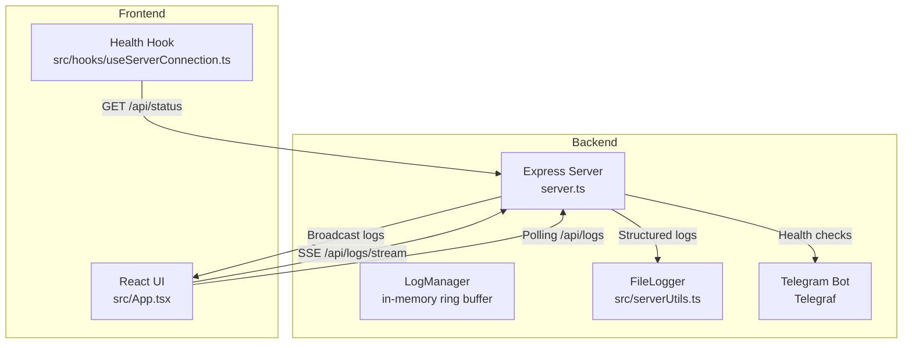
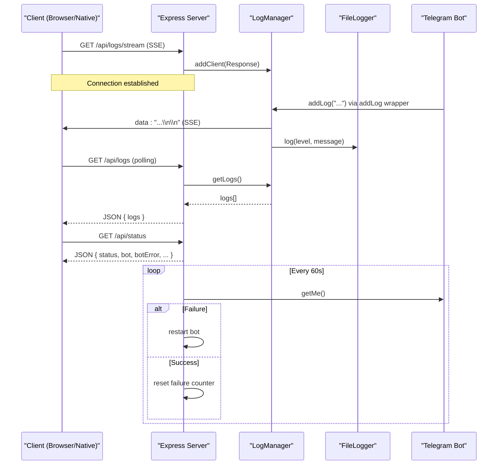
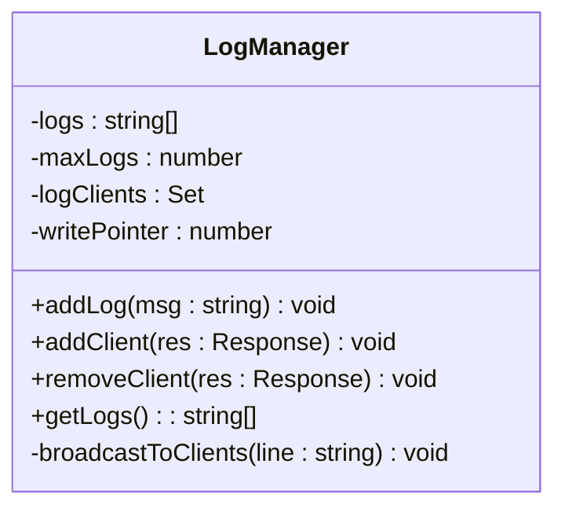
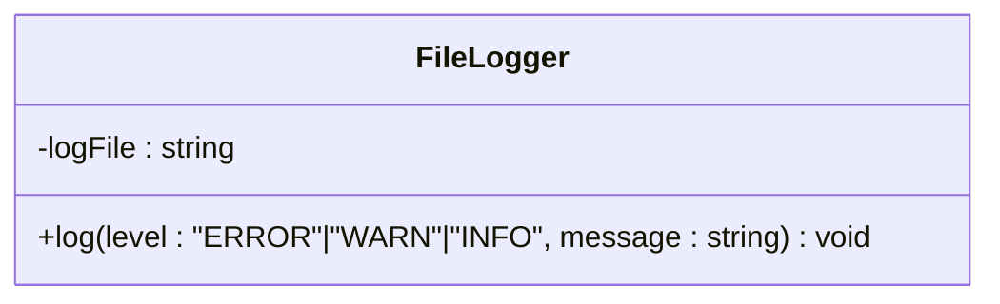
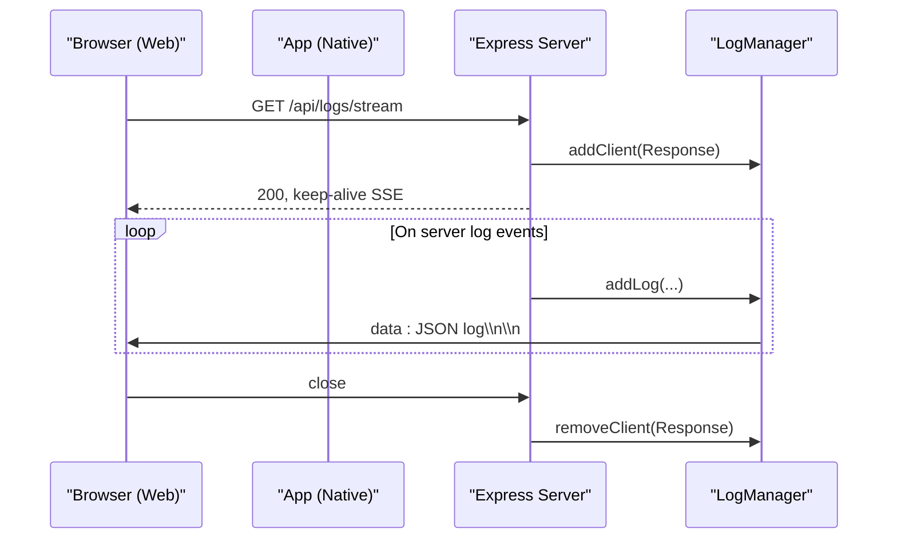
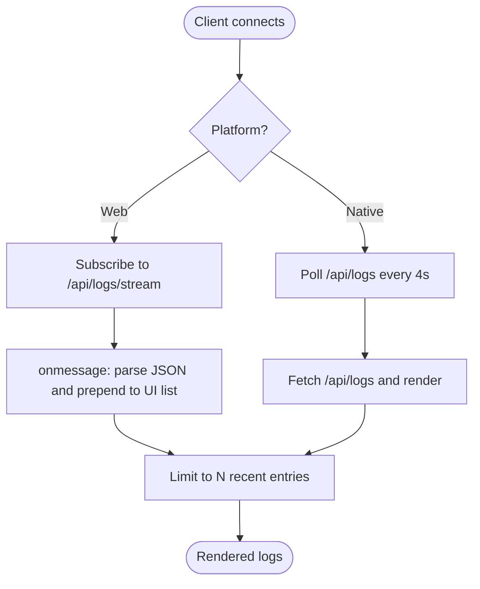
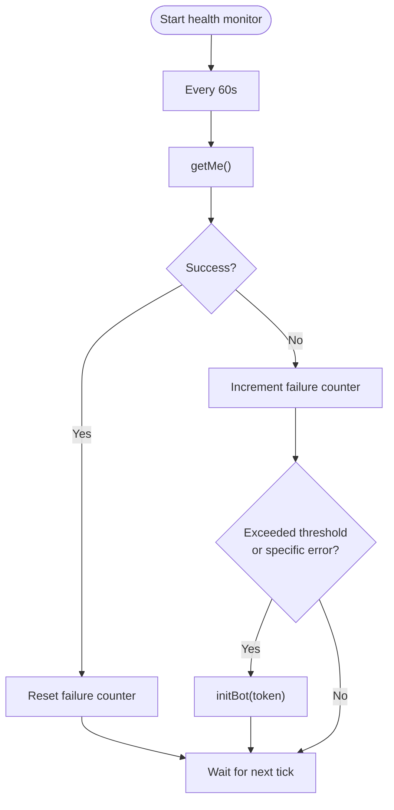
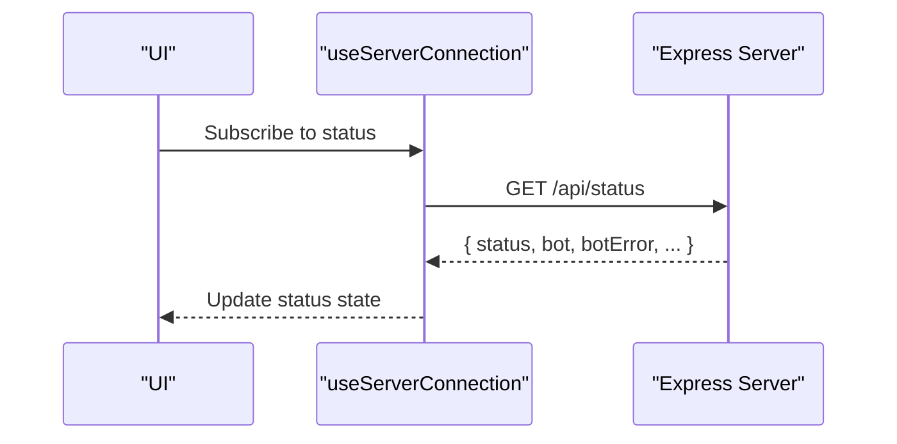
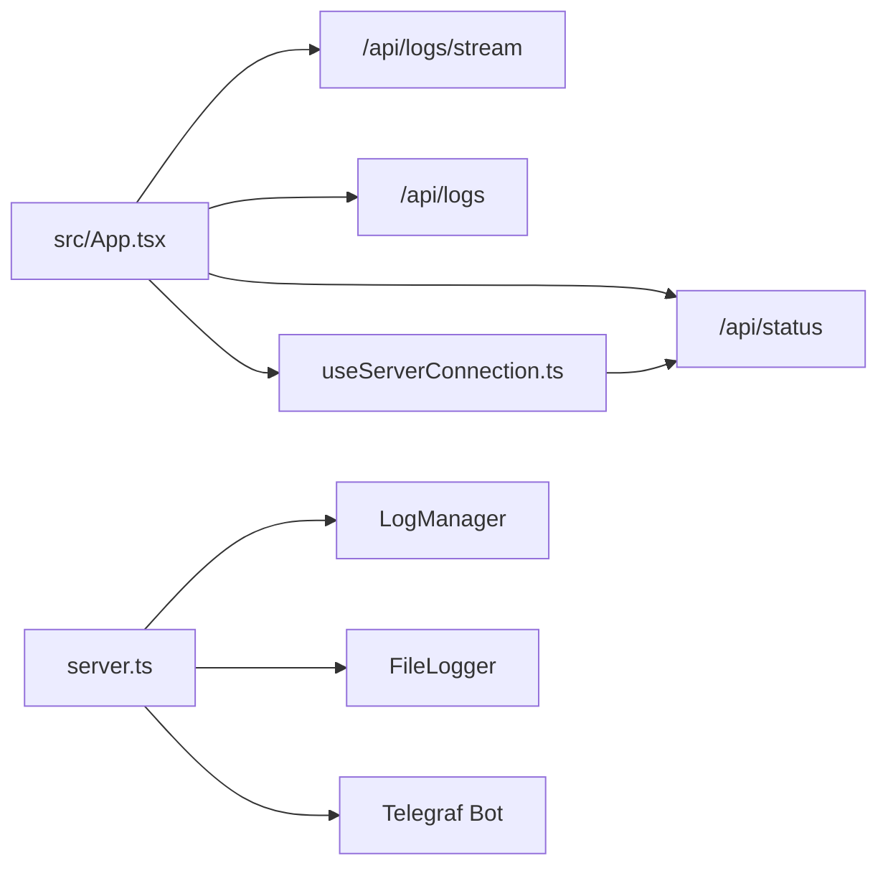

# Logging and Monitoring System

<cite>
**Referenced Files in This Document**
- [server.ts](file://server.ts)
- [src/serverUtils.ts](file://src/serverUtils.ts)
- [src/App.tsx](file://src/App.tsx)
- [src/hooks/useServerConnection.ts](file://src/hooks/useServerConnection.ts)
- [README.md](file://README.md)
</cite>

## Table of Contents
1. [Introduction](#introduction)
2. [Project Structure](#project-structure)
3. [Core Components](#core-components)
4. [Architecture Overview](#architecture-overview)
5. [Detailed Component Analysis](#detailed-component-analysis)
6. [Dependency Analysis](#dependency-analysis)
7. [Performance Considerations](#performance-considerations)
8. [Troubleshooting Guide](#troubleshooting-guide)
9. [Conclusion](#conclusion)

## Introduction
This document explains the logging and monitoring system implemented in the project. It covers real-time logging via Server-Sent Events (SSE), the log management class, client connection handling, log streaming architecture, filtering, and client disconnection handling. It also documents the FileLogger implementation, log levels, and structured logging patterns. Additionally, it details the server health monitoring system including bot health checks, error tracking, and automatic recovery mechanisms. Practical examples of log consumption, health monitoring setup, and troubleshooting procedures are included.

## Project Structure
The logging and monitoring system spans backend and frontend components:
- Backend server exposes SSE endpoints and manages bot health.
- Frontend consumes logs via SSE (web) or polling (native).
- A file-based logger persists logs to disk.
- Health status is exposed via a dedicated endpoint.

**Diagram sources**
- [server.ts:342-352](file://server.ts#L342-L352)
- [server.ts:1146-1148](file://server.ts#L1146-L1148)
- [src/serverUtils.ts:7-22](file://src/serverUtils.ts#L7-L22)
- [src/App.tsx:650-698](file://src/App.tsx#L650-L698)
- [src/hooks/useServerConnection.ts:15-51](file://src/hooks/useServerConnection.ts#L15-L51)

**Section sources**
- [server.ts:1-1454](file://server.ts#L1-L1454)
- [src/serverUtils.ts:1-22](file://src/serverUtils.ts#L1-L22)
- [src/App.tsx:650-849](file://src/App.tsx#L650-L849)
- [src/hooks/useServerConnection.ts:1-51](file://src/hooks/useServerConnection.ts#L1-L51)
- [README.md:1-25](file://README.md#L1-L25)

## Core Components
- Log Manager: An in-memory ring buffer that stores recent logs, broadcasts them to connected clients via SSE, and handles client disconnections.
- File Logger: A persistent logger that writes structured log entries to disk with timestamps and levels.
- SSE Endpoint: Exposes a streaming endpoint for real-time log consumption.
- Health Monitor: Periodically validates bot connectivity and triggers restarts on failures.
- Status Endpoint: Provides server and bot status for monitoring.

**Section sources**
- [server.ts:218-277](file://server.ts#L218-L277)
- [src/serverUtils.ts:7-22](file://src/serverUtils.ts#L7-L22)
- [server.ts:342-352](file://server.ts#L342-L352)
- [server.ts:377-409](file://server.ts#L377-L409)
- [server.ts:975-989](file://server.ts#L975-L989)

## Architecture Overview
The system integrates real-time logging and health monitoring:
- Logs are generated through convenience wrappers that delegate to the Log Manager and File Logger.
- Clients subscribe to SSE for live updates or poll the logs endpoint for snapshots.
- The bot health monitor periodically pings the Telegram API and restarts the bot on failure.
- The status endpoint aggregates server and bot state for UI and external monitoring.

**Diagram sources**
- [server.ts:19-22](file://server.ts#L19-L22)
- [server.ts:218-277](file://server.ts#L218-L277)
- [src/serverUtils.ts:17-21](file://src/serverUtils.ts#L17-L21)
- [server.ts:342-352](file://server.ts#L342-L352)
- [server.ts:1146-1148](file://server.ts#L1146-L1148)
- [server.ts:975-989](file://server.ts#L975-L989)
- [server.ts:377-409](file://server.ts#L377-L409)

## Detailed Component Analysis

### Log Manager (Real-Time Streaming)
The Log Manager maintains a fixed-size ring buffer of recent logs, timestamps each entry, and broadcasts to all connected SSE clients. It tracks clients in a set and removes disconnected ones automatically.

Key behaviors:
- Circular buffer with write pointer ensures bounded memory usage.
- Timestamp formatting uses locale time for readability.
- Broadcast iterates over clients and catches write errors to remove dead connections.
- Provides a snapshot endpoint to retrieve recent logs.

**Diagram sources**
- [server.ts:218-277](file://server.ts#L218-L277)

**Section sources**
- [server.ts:218-277](file://server.ts#L218-L277)
- [server.ts:342-352](file://server.ts#L342-L352)
- [server.ts:1146-1148](file://server.ts#L1146-L1148)

### File Logger (Persistent Logging)
The File Logger writes structured log entries to a rotating log file with ISO timestamps and severity levels. It creates the log directory if missing and appends entries atomically.

Key behaviors:
- Supports ERROR, WARN, INFO levels.
- Uses ISO timestamps for machine readability.
- Creates logs directory automatically.

**Diagram sources**
- [src/serverUtils.ts:7-22](file://src/serverUtils.ts#L7-L22)

**Section sources**
- [src/serverUtils.ts:7-22](file://src/serverUtils.ts#L7-L22)
- [server.ts:19-22](file://server.ts#L19-L22)

### SSE Endpoint and Client Handling
The SSE endpoint sets appropriate headers, registers the client, and tears down the connection on close. The frontend connects via EventSource on web and falls back to polling on native.

**Diagram sources**
- [server.ts:342-352](file://server.ts#L342-L352)
- [src/App.tsx:650-679](file://src/App.tsx#L650-L679)

**Section sources**
- [server.ts:342-352](file://server.ts#L342-L352)
- [src/App.tsx:650-679](file://src/App.tsx#L650-L679)

### Log Filtering and Consumption
- Real-time filtering: The frontend receives raw log lines and displays them in reverse chronological order, limiting to a small window for performance.
- Snapshot filtering: The polling endpoint returns the last N logs, allowing clients to reconstruct recent history.
- Client-side fallback: On native platforms, polling is used instead of SSE.

**Diagram sources**
- [src/App.tsx:650-698](file://src/App.tsx#L650-L698)
- [server.ts:1146-1148](file://server.ts#L1146-L1148)

**Section sources**
- [src/App.tsx:650-698](file://src/App.tsx#L650-L698)
- [server.ts:1146-1148](file://server.ts#L1146-L1148)

### Bot Health Monitoring and Automatic Recovery
The health monitor periodically calls the Telegram API to validate bot connectivity. On repeated failures or specific error conditions, it attempts to restart the bot.

Key behaviors:
- Health check interval and maximum failure threshold are configurable.
- Recognizes transient errors (e.g., 409 conflict) and triggers restarts accordingly.
- Resets failure counter on success.

**Diagram sources**
- [server.ts:377-409](file://server.ts#L377-L409)

**Section sources**
- [server.ts:213-216](file://server.ts#L213-L216)
- [server.ts:377-409](file://server.ts#L377-L409)

### Status Endpoint and Health Monitoring Setup
The status endpoint exposes server and bot state, enabling UI and external monitoring systems to track availability and error conditions.

**Diagram sources**
- [server.ts:975-989](file://server.ts#L975-L989)
- [src/hooks/useServerConnection.ts:15-51](file://src/hooks/useServerConnection.ts#L15-L51)

**Section sources**
- [server.ts:975-989](file://server.ts#L975-L989)
- [src/hooks/useServerConnection.ts:15-51](file://src/hooks/useServerConnection.ts#L15-L51)

## Dependency Analysis
- server.ts depends on:
  - src/serverUtils.ts for FileLogger.
  - Express for HTTP routing and SSE.
  - Telegraf for bot lifecycle and health checks.
- src/App.tsx consumes:
  - SSE endpoint for real-time logs.
  - Polling endpoint for snapshots on native.
  - useServerConnection hook for status.
- src/hooks/useServerConnection.ts depends on:
  - Capacitor HTTP for native requests.

**Diagram sources**
- [server.ts:19-22](file://server.ts#L19-L22)
- [src/App.tsx:650-698](file://src/App.tsx#L650-L698)
- [src/hooks/useServerConnection.ts:15-51](file://src/hooks/useServerConnection.ts#L15-L51)

**Section sources**
- [server.ts:1-1454](file://server.ts#L1-L1454)
- [src/serverUtils.ts:1-22](file://src/serverUtils.ts#L1-L22)
- [src/App.tsx:650-849](file://src/App.tsx#L650-L849)
- [src/hooks/useServerConnection.ts:1-51](file://src/hooks/useServerConnection.ts#L1-L51)

## Performance Considerations
- SSE broadcasting uses a set of Response objects; write errors are caught and dead clients are removed to prevent resource leaks.
- The Log Manager’s ring buffer avoids unbounded growth by overwriting oldest entries.
- Frontend limits the number of displayed logs and uses polling on native to reduce overhead.
- Health checks run at a fixed interval; adjust intervals and thresholds based on deployment scale.

[No sources needed since this section provides general guidance]

## Troubleshooting Guide
Common scenarios and resolutions:
- SSE not receiving logs on native:
  - Expected behavior; the UI polls /api/logs on native. Verify polling interval and network connectivity.
- Frequent bot restarts:
  - Check /api/status for botError and review logs around restart events. Investigate 409 conflicts or network timeouts.
- Missing logs in UI:
  - Confirm the UI is subscribed to /api/logs/stream (web) or polling /api/logs (native). Verify baseUrl correctness.
- Disk logs not appearing:
  - Ensure the logs directory exists and the process has write permissions. Confirm FileLogger initialization and log level usage.

**Section sources**
- [src/App.tsx:650-698](file://src/App.tsx#L650-L698)
- [server.ts:975-989](file://server.ts#L975-L989)
- [src/serverUtils.ts:7-22](file://src/serverUtils.ts#L7-L22)

## Conclusion
The logging and monitoring system combines real-time SSE streaming, persistent file logging, and automated bot health checks. It provides a robust foundation for operational visibility, enabling both immediate feedback via SSE and reliable historical insights via file logs and polling. The modular design allows easy extension for additional log levels, structured fields, and richer health metrics.