# Telegram Bot Integration

<cite>
**Referenced Files in This Document**
- [server.ts](file://server.ts)
- [package.json](file://package.json)
- [storageWrapper.ts](file://src/services/storageWrapper.ts)
- [useBotSettings.ts](file://src/hooks/useBotSettings.ts)
- [serverUtils.ts](file://src/serverUtils.ts)
- [MainActivity.java](file://android/app/src/main/java/com/newsbot/manager/MainActivity.java)
</cite>

## Table of Contents
1. [Introduction](#introduction)
2. [Project Structure](#project-structure)
3. [Core Components](#core-components)
4. [Architecture Overview](#architecture-overview)
5. [Detailed Component Analysis](#detailed-component-analysis)
6. [Dependency Analysis](#dependency-analysis)
7. [Performance Considerations](#performance-considerations)
8. [Troubleshooting Guide](#troubleshooting-guide)
9. [Conclusion](#conclusion)

## Introduction
This document describes the Telegram bot integration system implemented in the project. It covers bot lifecycle management (initialization, polling, health monitoring), error handling and automatic restart procedures, 409 conflict resolution, message processing pipeline (text handling, HTML sanitization, formatting), configuration options (token management, chat ID handling), and the relationship between bot instances and server operations. Examples of commands, message routing, and error recovery scenarios are included to guide both developers and operators.

## Project Structure
The Telegram bot integration is implemented as a Node.js/Express server with Telegraf. The server exposes API endpoints to configure and control the bot, manage persistent data, and publish content to Telegram chats. The Android app uses Capacitor and serves as a mobile shell; the bot itself runs on the server.

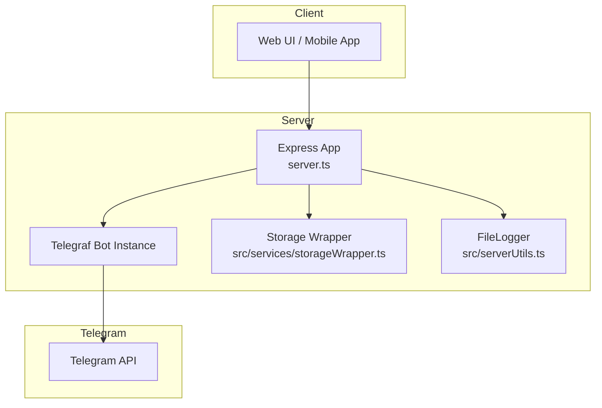

**Diagram sources**
- [server.ts:1-1454](file://server.ts#L1-L1454)
- [storageWrapper.ts:1-100](file://src/services/storageWrapper.ts#L1-L100)
- [serverUtils.ts:1-23](file://src/serverUtils.ts#L1-L23)

**Section sources**
- [server.ts:1-1454](file://server.ts#L1-L1454)
- [package.json:1-70](file://package.json#L1-L70)

## Core Components
- Telegraf bot instance and lifecycle management
- Persistent configuration storage (token, chat ID, API keys)
- Message processing pipeline (AI translation, HTML sanitization, Telegram formatting)
- Health monitoring and automatic restart
- Server-side publishing to Telegram chats
- Client-side settings hooks for token and chat ID

**Section sources**
- [server.ts:204-803](file://server.ts#L204-L803)
- [storageWrapper.ts:1-100](file://src/services/storageWrapper.ts#L1-L100)
- [useBotSettings.ts:1-56](file://src/hooks/useBotSettings.ts#L1-L56)

## Architecture Overview
The server initializes a Telegraf bot in polling mode, deletes any existing webhooks, and monitors health periodically. It exposes REST endpoints to configure the bot token, set the default chat ID, test connectivity, and publish posts. The Android app integrates via Capacitor; the bot runs on the server.

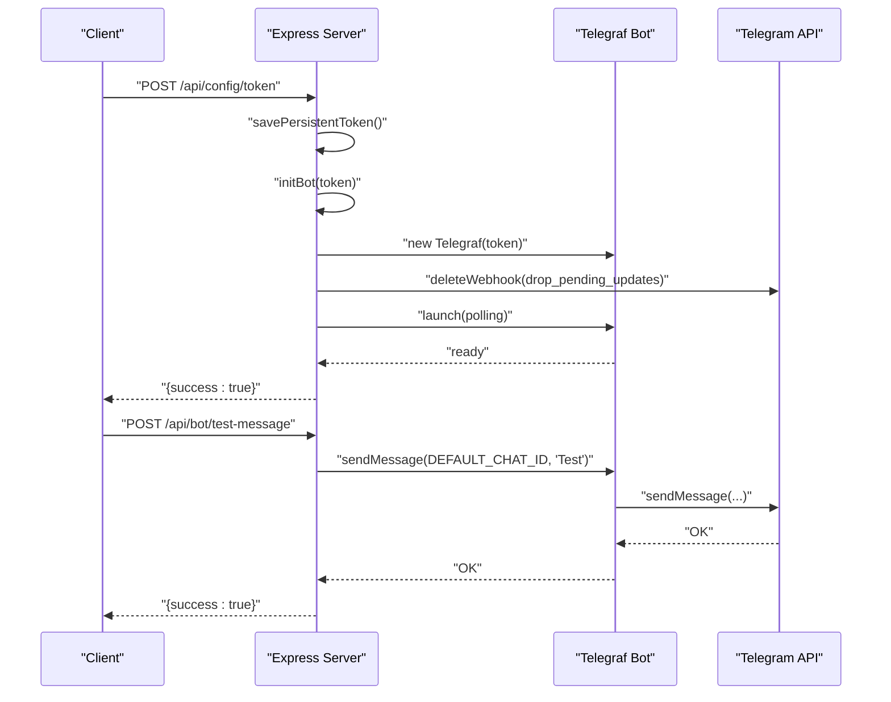

**Diagram sources**
- [server.ts:991-1085](file://server.ts#L991-L1085)
- [server.ts:729-788](file://server.ts#L729-L788)

**Section sources**
- [server.ts:975-1085](file://server.ts#L975-L1085)
- [server.ts:729-788](file://server.ts#L729-L788)

## Detailed Component Analysis

### Bot Lifecycle Management
- Initialization: Creates a Telegraf instance with a handler timeout and explicit API root, deletes any pending updates/webhooks, launches polling, and starts health monitoring.
- Shutdown: Stops the bot gracefully, clears intervals, and resets state.
- Restart: Supports manual restart via API and automatic restart triggered by health checks.

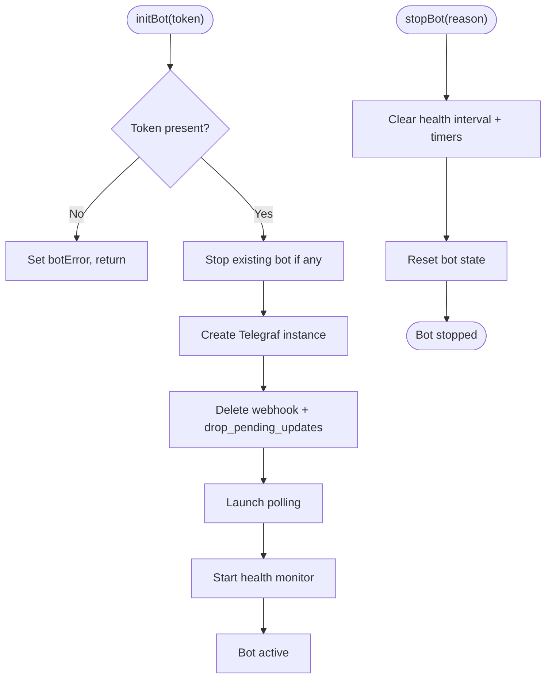

**Diagram sources**
- [server.ts:688-799](file://server.ts#L688-L799)
- [server.ts:674-686](file://server.ts#L674-L686)

**Section sources**
- [server.ts:688-799](file://server.ts#L688-L799)
- [server.ts:674-686](file://server.ts#L674-L686)

### Health Monitoring and Automatic Restart
- Periodic health checks call the Telegram API to verify bot availability.
- Failures increment a failure counter; upon reaching a threshold or encountering specific errors (e.g., 409 conflict), the system attempts a restart.
- Health checks are skipped while initialization is in progress.

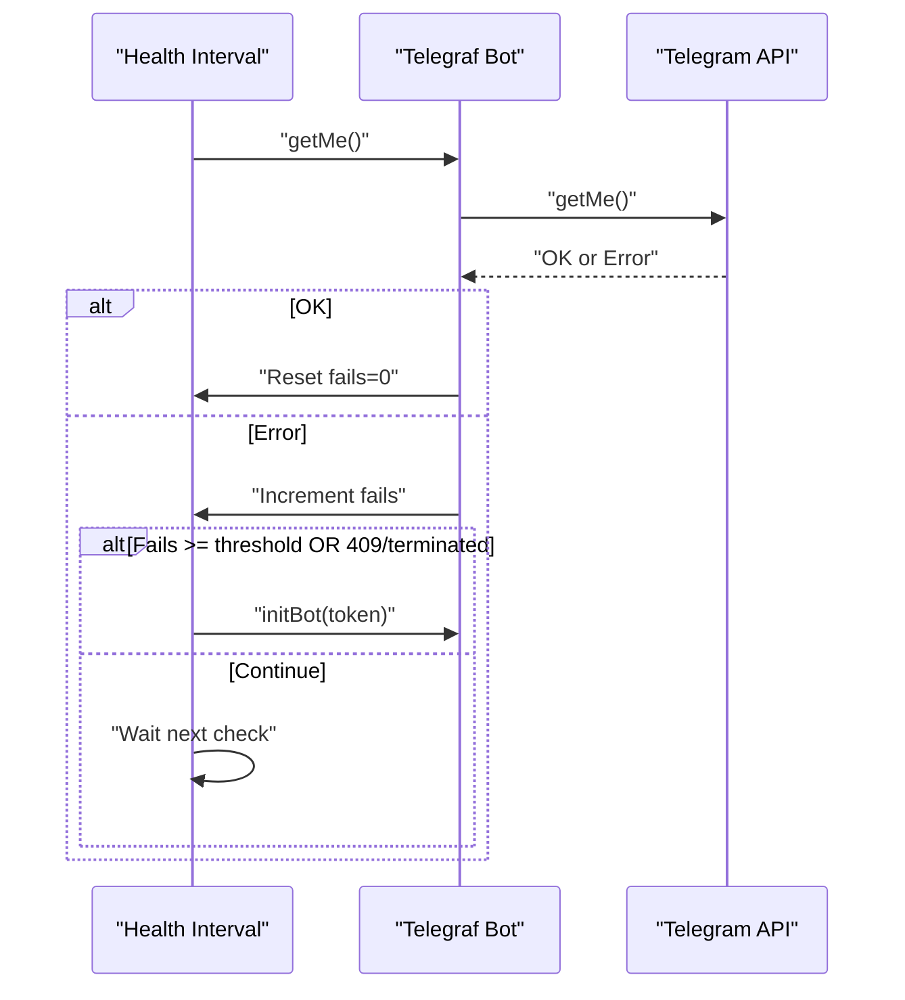

**Diagram sources**
- [server.ts:377-409](file://server.ts#L377-L409)

**Section sources**
- [server.ts:377-409](file://server.ts#L377-L409)

### Error Handling Strategies and 409 Conflict Resolution
- During initialization, immediate startup errors (including 409 Conflict) are caught and handled; the system waits briefly to distinguish transient failures from permanent ones.
- During runtime, Telegraf’s error handler captures network-related issues and sets a global bot error flag.
- Health monitor triggers restarts on repeated failures or specific error patterns (e.g., 409 conflict).
- Graceful shutdown ensures cleanup of intervals and references.

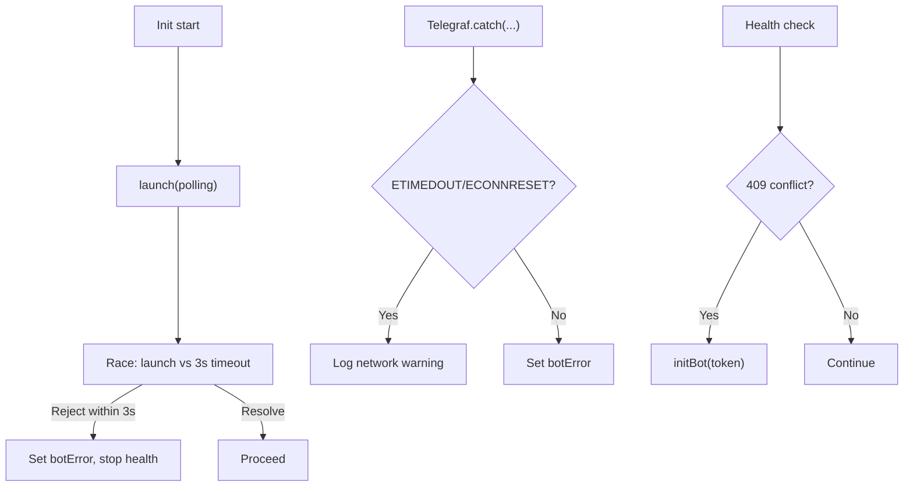

**Diagram sources**
- [server.ts:766-783](file://server.ts#L766-L783)
- [server.ts:736-743](file://server.ts#L736-L743)
- [server.ts:395-407](file://server.ts#L395-L407)

**Section sources**
- [server.ts:766-783](file://server.ts#L766-L783)
- [server.ts:736-743](file://server.ts#L736-L743)
- [server.ts:395-407](file://server.ts#L395-L407)

### Message Processing Pipeline
- Text handler receives incoming text, processes it through AI translation, sanitizes HTML for Telegram, and sends formatted messages to either the default chat ID or the sender’s chat ID.
- Long messages are split into chunks respecting Telegram’s limits.
- Inline buttons and reactions are supported for published posts.

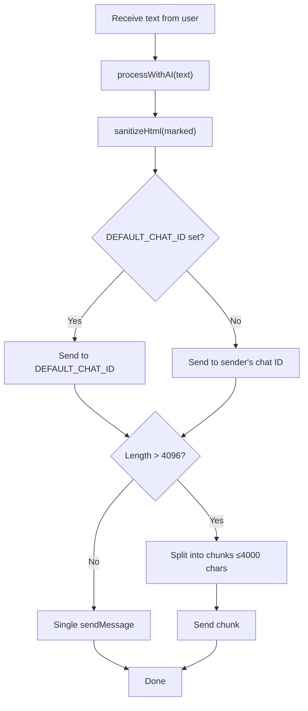

**Diagram sources**
- [server.ts:648-671](file://server.ts#L648-L671)
- [server.ts:285-340](file://server.ts#L285-L340)

**Section sources**
- [server.ts:648-671](file://server.ts#L648-L671)
- [server.ts:285-340](file://server.ts#L285-L340)

### HTML Sanitization and Formatting
- Removes disallowed tags and normalizes line breaks.
- Preserves allowed tags and attributes suitable for Telegram HTML.
- Uses Cheerio to validate and balance HTML safely.

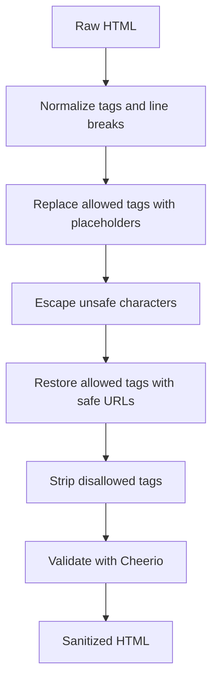

**Diagram sources**
- [server.ts:285-340](file://server.ts#L285-L340)

**Section sources**
- [server.ts:285-340](file://server.ts#L285-L340)

### Configuration Options, Token Management, and Chat ID Handling
- Token management:
  - Load from persistent file or environment variable.
  - Save token via API endpoint; triggers bot initialization.
  - Clear token via API endpoint; stops bot.
- Chat ID management:
  - Set default chat ID via API; persisted and validated.
  - Preset chat IDs stored persistently for quick selection.
- API keys:
  - Store provider-specific keys persistently.
  - Preferred provider selection influences AI fallback order.

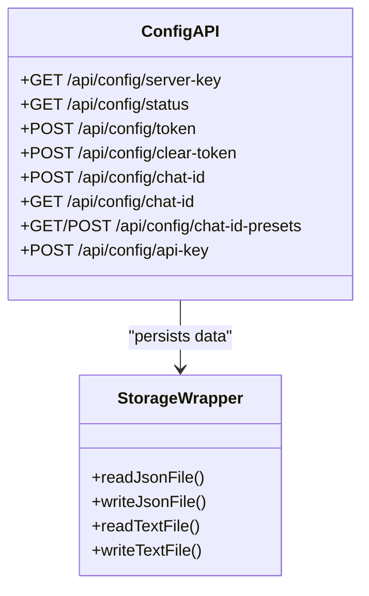

**Diagram sources**
- [server.ts:975-1064](file://server.ts#L975-L1064)
- [storageWrapper.ts:1-100](file://src/services/storageWrapper.ts#L1-L100)

**Section sources**
- [server.ts:975-1064](file://server.ts#L975-L1064)
- [storageWrapper.ts:1-100](file://src/services/storageWrapper.ts#L1-L100)

### Bot Commands and Message Routing
- Start command replies with a welcome message instructing users to send text for publication.
- Text messages are routed to the text processing pipeline for AI translation and formatting.
- Test message endpoint allows verifying bot-to-chat connectivity.

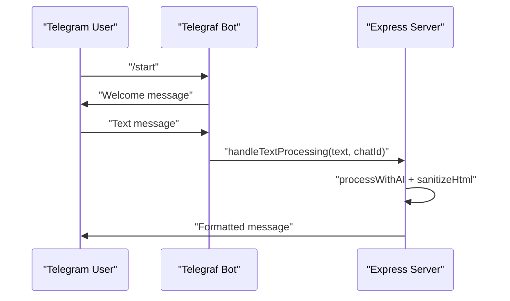

**Diagram sources**
- [server.ts:745-748](file://server.ts#L745-L748)
- [server.ts:648-671](file://server.ts#L648-L671)

**Section sources**
- [server.ts:745-748](file://server.ts#L745-L748)
- [server.ts:648-671](file://server.ts#L648-L671)

### Publishing Posts to Telegram
- Validates default chat ID and constructs inline keyboard buttons from post data.
- Supports single photo with caption, media groups, and reactions.
- Splits long captions and balances HTML before sending.

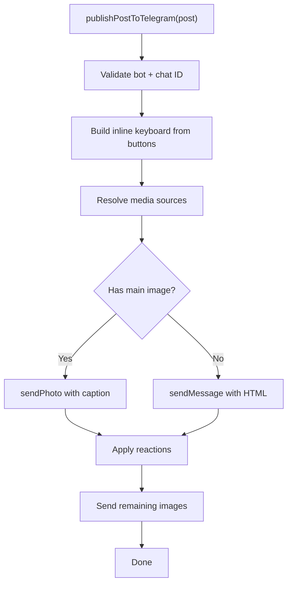

**Diagram sources**
- [server.ts:806-934](file://server.ts#L806-L934)

**Section sources**
- [server.ts:806-934](file://server.ts#L806-L934)

### Relationship Between Bot Instances and Server Operations
- The server maintains a single active Telegraf instance and coordinates all Telegram interactions.
- Server routes handle bot configuration, testing, and publishing, ensuring consistent state and error reporting.
- Health monitoring keeps the bot alive and responsive, restarting automatically when needed.

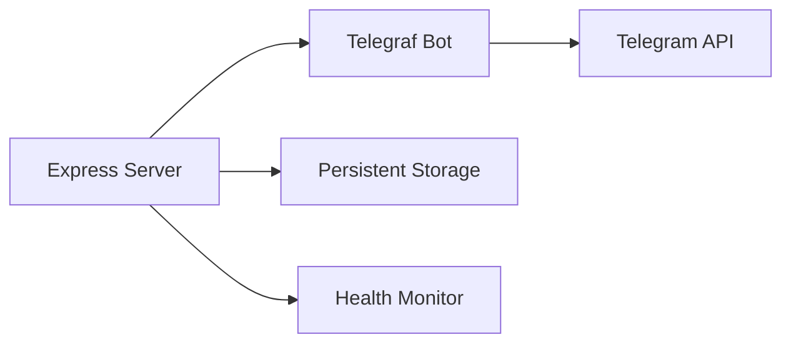

**Diagram sources**
- [server.ts:1-1454](file://server.ts#L1-L1454)

**Section sources**
- [server.ts:1-1454](file://server.ts#L1-L1454)

## Dependency Analysis
- Telegraf is the primary dependency for Telegram integration.
- Cheerio and Marked are used for HTML sanitization and Markdown-to-HTML conversion.
- Environment variables and persistent files store secrets and configuration.
- Capacitor-based Android app provides a mobile container; the bot runs on the server.

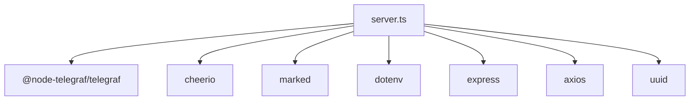

**Diagram sources**
- [package.json:19-55](file://package.json#L19-L55)
- [server.ts:1-16](file://server.ts#L1-L16)

**Section sources**
- [package.json:19-55](file://package.json#L19-L55)
- [server.ts:1-16](file://server.ts#L1-L16)

## Performance Considerations
- Handler timeout is configured to accommodate long-running AI operations.
- Rate limiting is applied to API endpoints to prevent abuse.
- Messages are chunked to respect Telegram’s message size limits.
- Health checks run at a fixed interval to detect downtime without overloading the system.

[No sources needed since this section provides general guidance]

## Troubleshooting Guide
Common issues and recovery steps:
- 409 Conflict or “terminated by other getUpdates”:
  - Health monitor detects and triggers a restart automatically.
  - Manually restart via the restart endpoint if automatic restart does not occur.
- Network timeouts or connection resets:
  - Telegraf error handler logs warnings; bot continues attempting to recover.
- Missing token or invalid chat ID:
  - Set token via the token endpoint; set chat ID via the chat ID endpoint.
- Publishing failures:
  - Verify default chat ID and media sources; check logs via the logs endpoints.

Operational endpoints for diagnostics:
- Status: GET /api/status
- Logs SSE: GET /api/logs/stream
- Logs snapshot: GET /api/logs
- Test bot: POST /api/bot/test-message
- Restart: POST /api/bot/restart
- Stop: POST /api/bot/stop

**Section sources**
- [server.ts:975-1085](file://server.ts#L975-L1085)
- [server.ts:377-409](file://server.ts#L377-L409)
- [server.ts:736-743](file://server.ts#L736-L743)

## Conclusion
The Telegram bot integration provides a robust, self-healing system with clear lifecycle management, comprehensive error handling, and a flexible publishing pipeline. Operators can configure tokens and chat IDs via REST APIs, monitor health, and publish content with rich formatting and media support. The architecture cleanly separates concerns between the server, Telegraf bot, and persistent storage, enabling reliable operation across environments.