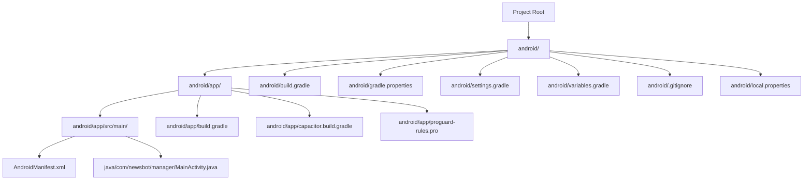
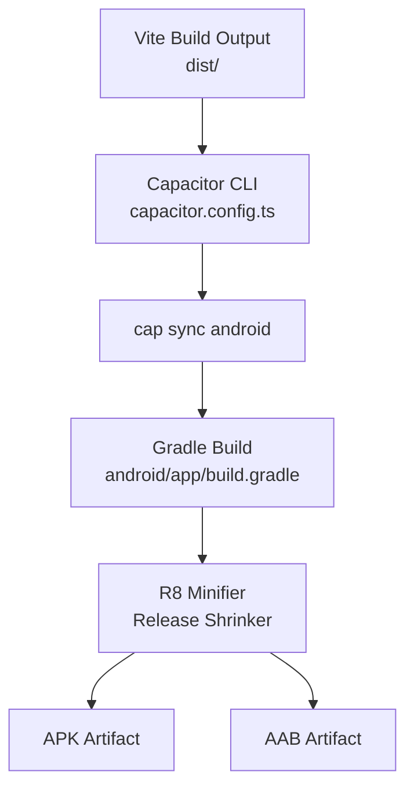
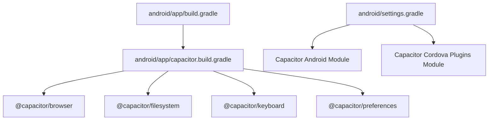

# APK and AAB Generation

<cite>
**Referenced Files in This Document**
- [android/app/build.gradle](file://android/app/build.gradle)
- [android/build.gradle](file://android/build.gradle)
- [android/gradle.properties](file://android/gradle.properties)
- [android/settings.gradle](file://android/settings.gradle)
- [android/variables.gradle](file://android/variables.gradle)
- [android/app/capacitor.build.gradle](file://android/app/capacitor.build.gradle)
- [android/app/proguard-rules.pro](file://android/app/proguard-rules.pro)
- [android/local.properties](file://android/local.properties)
- [android/.gitignore](file://android/.gitignore)
- [android/app/src/main/AndroidManifest.xml](file://android/app/src/main/AndroidManifest.xml)
- [android/app/src/main/java/com/newsbot/manager/MainActivity.java](file://android/app/src/main/java/com/newsbot/manager/MainActivity.java)
- [capacitor.config.ts](file://capacitor.config.ts)
- [package.json](file://package.json)
</cite>

## Table of Contents
1. [Introduction](#introduction)
2. [Project Structure](#project-structure)
3. [Core Components](#core-components)
4. [Architecture Overview](#architecture-overview)
5. [Detailed Component Analysis](#detailed-component-analysis)
6. [Dependency Analysis](#dependency-analysis)
7. [Performance Considerations](#performance-considerations)
8. [Troubleshooting Guide](#troubleshooting-guide)
9. [Conclusion](#conclusion)
10. [Appendices](#appendices)

## Introduction
This document explains how to generate Android packages for distribution using the current project setup. It focuses on:
- Differences between APK and AAB formats and their distribution implications
- Signing configuration and security considerations
- Release build process, including R8/minification and ProGuard rules
- Bundle configuration for AAB generation and benefits for Google Play Store
- Build variant selection, flavor-specific configurations, and automated build pipelines
- Troubleshooting common packaging issues and performance optimization tips

Note: The current Gradle configuration enables R8 minification and code shrinking for release builds, but does not include explicit signing configuration. AAB generation requires additional configuration beyond the current setup.

## Project Structure
The Android application is organized under the android directory with a standard Gradle module structure. The Capacitor configuration integrates the web assets built by Vite into the Android app.

**Diagram sources**
- [android/app/build.gradle:1-55](file://android/app/build.gradle#L1-L55)
- [android/build.gradle:1-30](file://android/build.gradle#L1-L30)
- [android/gradle.properties:1-23](file://android/gradle.properties#L1-L23)
- [android/settings.gradle:1-5](file://android/settings.gradle#L1-L5)
- [android/variables.gradle:1-16](file://android/variables.gradle#L1-L16)
- [android/app/capacitor.build.gradle:1-23](file://android/app/capacitor.build.gradle#L1-L23)
- [android/app/proguard-rules.pro:1-22](file://android/app/proguard-rules.pro#L1-L22)
- [android/.gitignore:1-80](file://android/.gitignore#L1-L80)
- [android/local.properties:1-9](file://android/local.properties#L1-L9)
- [android/app/src/main/AndroidManifest.xml:1-46](file://android/app/src/main/AndroidManifest.xml#L1-L46)
- [android/app/src/main/java/com/newsbot/manager/MainActivity.java:1-6](file://android/app/src/main/java/com/newsbot/manager/MainActivity.java#L1-L6)

**Section sources**
- [android/app/build.gradle:1-55](file://android/app/build.gradle#L1-L55)
- [android/build.gradle:1-30](file://android/build.gradle#L1-L30)
- [android/gradle.properties:1-23](file://android/gradle.properties#L1-L23)
- [android/settings.gradle:1-5](file://android/settings.gradle#L1-L5)
- [android/variables.gradle:1-16](file://android/variables.gradle#L1-L16)
- [android/app/capacitor.build.gradle:1-23](file://android/app/capacitor.build.gradle#L1-L23)
- [android/app/proguard-rules.pro:1-22](file://android/app/proguard-rules.pro#L1-L22)
- [android/.gitignore:1-80](file://android/.gitignore#L1-L80)
- [android/local.properties:1-9](file://android/local.properties#L1-L9)
- [android/app/src/main/AndroidManifest.xml:1-46](file://android/app/src/main/AndroidManifest.xml#L1-L46)
- [android/app/src/main/java/com/newsbot/manager/MainActivity.java:1-6](file://android/app/src/main/java/com/newsbot/manager/MainActivity.java#L1-L6)

## Core Components
- Application module Gradle configuration defines compile/target SDK, minification, and ProGuard rules for release builds.
- Capacitor Gradle script configures Java compatibility and adds Capacitor plugins as dependencies.
- Variables Gradle centralizes SDK versions and library versions.
- Gradle properties enable AndroidX and JVM settings.
- Settings Gradle includes the Capacitor Android module and Cordova plugins module.
- Package scripts orchestrate building the web assets and syncing Capacitor.

Key build behaviors:
- Release build uses R8 for code shrinking and obfuscation.
- ProGuard rules file exists for custom rules.
- Capacitor modules are included via Gradle settings and variables.

**Section sources**
- [android/app/build.gradle:3-25](file://android/app/build.gradle#L3-L25)
- [android/app/capacitor.build.gradle:3-8](file://android/app/capacitor.build.gradle#L3-L8)
- [android/variables.gradle:1-16](file://android/variables.gradle#L1-L16)
- [android/gradle.properties:22-22](file://android/gradle.properties#L22-L22)
- [android/settings.gradle:1-5](file://android/settings.gradle#L1-L5)
- [package.json:15-17](file://package.json#L15-L17)

## Architecture Overview
The build pipeline integrates web assets produced by Vite into the Android app via Capacitor. The Android Gradle build compiles Java/Kotlin sources, packages resources, and produces either an APK or an AAB depending on configuration.

**Diagram sources**
- [capacitor.config.ts:6-6](file://capacitor.config.ts#L6-L6)
- [package.json:15-15](file://package.json#L15-L15)
- [android/app/build.gradle:19-24](file://android/app/build.gradle#L19-L24)

## Detailed Component Analysis

### APK vs AAB: Definitions and Distribution Implications
- APK (Android Package):
  - Direct installable binary containing all code and resources.
  - Easier to distribute outside Google Play (direct download, sideloading).
  - Larger file size due to bundling all code/archives.
- AAB (Android App Bundle):
  - Build artifact optimized for Google Play Store publishing.
  - Contains code and resources packaged for dynamic delivery; Google Play generates device-specific APKs at runtime.
  - Smaller average download size and improved security posture.
  - Requires Google Play Console upload and Play signing.

Distribution implications:
- For Google Play distribution, AAB is preferred.
- For direct distribution or third-party stores, APK may be simpler.

[No sources needed since this section provides conceptual comparison]

### Signing Configuration in build.gradle
Current state:
- The project does not define a signing block in the application Gradle file.
- No keystore or key alias properties are present in the Gradle configuration.

Recommended approach:
- Define signingConfig in the android.signingConfigs block.
- Set storeFile, storePassword, keyAlias, and keyPassword.
- Apply the signingConfig to the release buildType.
- Keep keystore files out of version control; use environment variables or CI secrets.

Security considerations:
- Protect keystore files and passwords.
- Use separate keystores for debug and release.
- Avoid committing secrets to the repository.

[No sources needed since this section provides guidance not yet implemented in the codebase]

### Release Build Process and Minification
Current configuration:
- Release buildType enables minification and applies default ProGuard rules plus a project-specific rules file.
- R8 is used for code shrinking and optimization.

Optimization opportunities:
- Fine-tune ProGuard rules for libraries used by the app.
- Enable resource shrinking alongside minification.
- Consider enabling coreLibraryDesugaring if targeting older platforms.

**Section sources**
- [android/app/build.gradle:19-24](file://android/app/build.gradle#L19-L24)
- [android/app/proguard-rules.pro:1-22](file://android/app/proguard-rules.pro#L1-L22)

### Bundle Configuration for AAB Generation
Current state:
- No bundle DSL configuration is present in the application Gradle file.
- AAB artifacts are not generated by default.

Required additions:
- Configure android.bundle in the Gradle DSL to produce an AAB.
- Ensure signingConfig is set for release builds.
- Publish the AAB to Google Play Console.

Benefits for Google Play:
- Dynamic Delivery reduces download size.
- Google Play handles device-specific APK generation.
- Improved security and integrity checks.

**Section sources**
- [android/app/build.gradle:3-25](file://android/app/build.gradle#L3-L25)

### Build Variant Selection and Flavor-Specific Configurations
Current state:
- No product flavors or build variants are defined.
- Only default release buildType is configured.

To add variants/flavors:
- Define productFlavors in the android block.
- Create flavor-specific res/values and manifest entries.
- Use flavorDimensions if organizing multiple dimensions.
- Configure signingConfigs per flavor if needed.

[No sources needed since this section provides guidance not yet implemented in the codebase]

### Automated Build Pipelines
Current automation:
- NPM script to build client assets and sync Capacitor for Android.
- Capacitor settings include Capacitor Android modules and Cordova plugins.

Recommended pipeline steps:
- Build web assets.
- Run Capacitor sync.
- Execute Gradle assembleRelease or bundleRelease.
- Sign and publish artifacts.

**Section sources**
- [package.json:15-17](file://package.json#L15-L17)
- [android/settings.gradle:1-5](file://android/settings.gradle#L1-L5)
- [android/capacitor.settings.gradle:1-16](file://android/capacitor.settings.gradle#L1-L16)

## Dependency Analysis
The Android app depends on Capacitor modules and Cordova plugins. The build script applies Capacitor’s Gradle extras and includes plugin modules.

**Diagram sources**
- [android/app/build.gradle:45-45](file://android/app/build.gradle#L45-L45)
- [android/app/capacitor.build.gradle:1-23](file://android/app/capacitor.build.gradle#L1-L23)
- [android/settings.gradle:1-5](file://android/settings.gradle#L1-L5)
- [android/capacitor.settings.gradle:1-16](file://android/capacitor.settings.gradle#L1-L16)

**Section sources**
- [android/app/build.gradle:33-43](file://android/app/build.gradle#L33-L43)
- [android/app/capacitor.build.gradle:10-17](file://android/app/capacitor.build.gradle#L10-L17)
- [android/settings.gradle:1-5](file://android/settings.gradle#L1-L5)
- [android/capacitor.settings.gradle:1-16](file://android/capacitor.settings.gradle#L1-L16)

## Performance Considerations
- Minification and shrinking reduce app size and improve load times.
- Keep ProGuard rules minimal and targeted to avoid runtime issues.
- Use resource shrinking to remove unused resources.
- Optimize images and assets for mobile devices.
- Prefer AAB for Google Play to leverage dynamic delivery.

[No sources needed since this section provides general guidance]

## Troubleshooting Guide
Common packaging issues and resolutions:
- Missing google-services.json:
  - The build attempts to apply the Google Services plugin only if the file is present. If push notifications are needed, ensure the file is added and re-sync Capacitor.
- Keystore not found or incorrect alias:
  - If signing is configured, ensure the keystore path and alias match the build configuration. Keep keystore files out of version control.
- Build fails due to missing SDK:
  - Verify sdk.dir in local.properties points to a valid Android SDK installation.
- AAB not generated:
  - Add bundle configuration to produce an AAB and sign the release build.
- ProGuard conflicts:
  - Review custom rules and library-specific rules to prevent runtime errors.

**Section sources**
- [android/app/build.gradle:47-54](file://android/app/build.gradle#L47-L54)
- [android/local.properties:8-8](file://android/local.properties#L8-L8)
- [android/.gitignore:55-58](file://android/.gitignore#L55-L58)

## Conclusion
The project currently supports R8-based release builds and integrates Capacitor for Android packaging. To fully support AAB generation and secure distribution:
- Add signing configuration for release builds.
- Configure bundle DSL to produce AAB artifacts.
- Adopt automated pipelines that build web assets, sync Capacitor, and assemble signed bundles.
- Consider product flavors for variant-specific builds.

[No sources needed since this section summarizes without analyzing specific files]

## Appendices

### Appendix A: Current Build and Signing Checklist
- Confirm release buildType minification is enabled.
- Add signingConfig with keystore and key alias.
- Ensure google-services.json is present for Play services if used.
- Verify Capacitor sync runs after web asset builds.
- For AAB, add bundle configuration and upload to Google Play Console.

**Section sources**
- [android/app/build.gradle:19-24](file://android/app/build.gradle#L19-L24)
- [android/app/build.gradle:47-54](file://android/app/build.gradle#L47-L54)
- [package.json:15-17](file://package.json#L15-L17)