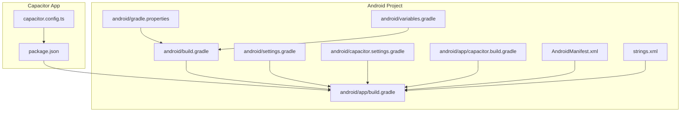
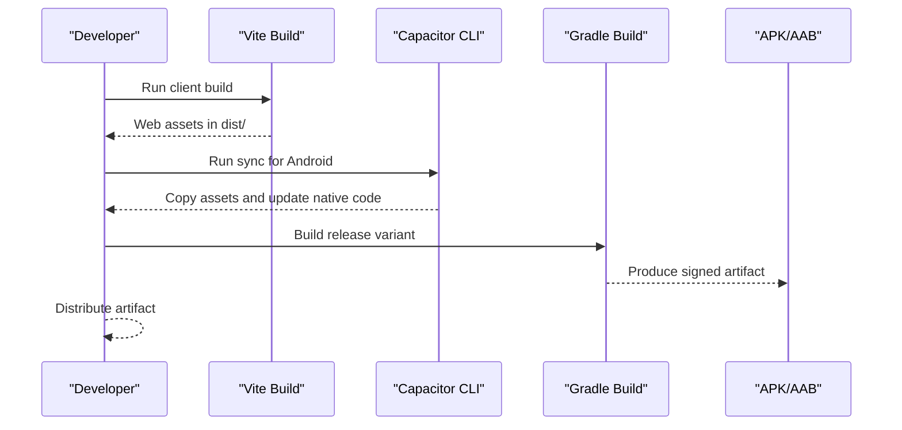
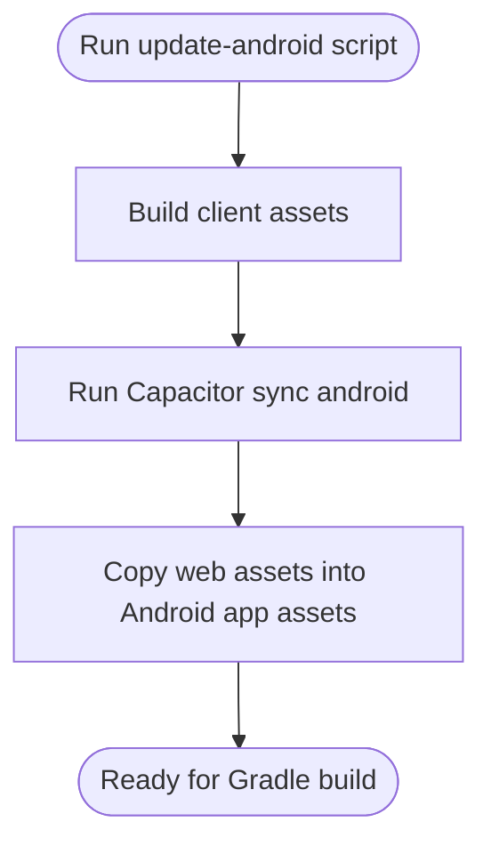
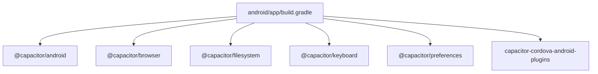

# Android Deployment

<cite>
**Referenced Files in This Document**
- [capacitor.config.ts](file://capacitor.config.ts)
- [package.json](file://package.json)
- [android/app/build.gradle](file://android/app/build.gradle)
- [android/build.gradle](file://android/build.gradle)
- [android/settings.gradle](file://android/settings.gradle)
- [android/gradle.properties](file://android/gradle.properties)
- [android/variables.gradle](file://android/variables.gradle)
- [android/capacitor.settings.gradle](file://android/capacitor.settings.gradle)
- [android/app/capacitor.build.gradle](file://android/app/capacitor.build.gradle)
- [android/app/proguard-rules.pro](file://android/app/proguard-rules.pro)
- [android/app/src/main/AndroidManifest.xml](file://android/app/src/main/AndroidManifest.xml)
- [android/app/src/main/res/values/strings.xml](file://android/app/src/main/res/values/strings.xml)
- [android/app/src/main/java/com/newsbot/manager/MainActivity.java](file://android/app/src/main/java/com/newsbot/manager/MainActivity.java)
</cite>

## Table of Contents
1. [Introduction](#introduction)
2. [Project Structure](#project-structure)
3. [Core Components](#core-components)
4. [Architecture Overview](#architecture-overview)
5. [Detailed Component Analysis](#detailed-component-analysis)
6. [Dependency Analysis](#dependency-analysis)
7. [Performance Considerations](#performance-considerations)
8. [Troubleshooting Guide](#troubleshooting-guide)
9. [Conclusion](#conclusion)
10. [Appendices](#appendices)

## Introduction
This document explains how to deploy the Android app built with Capacitor. It covers Capacitor configuration, the Android build pipeline with Gradle, the Capacitor sync process, Android project structure, APK/AAB generation, signing, and distribution. It also includes troubleshooting steps for common build issues, ProGuard/R8 configuration guidance, and performance tips for mobile devices.

## Project Structure
The Android app is integrated via Capacitor into a React/Vite client. The Android project lives under the android directory and is managed by Gradle. Capacitor manages native Android code and assets, while Vite builds the web assets consumed by the Android app.

**Diagram sources**
- [capacitor.config.ts](file://capacitor.config.ts)
- [package.json](file://package.json)
- [android/app/build.gradle](file://android/app/build.gradle)
- [android/build.gradle](file://android/build.gradle)
- [android/settings.gradle](file://android/settings.gradle)
- [android/gradle.properties](file://android/gradle.properties)
- [android/variables.gradle](file://android/variables.gradle)
- [android/capacitor.settings.gradle](file://android/capacitor.settings.gradle)
- [android/app/capacitor.build.gradle](file://android/app/capacitor.build.gradle)
- [android/app/src/main/AndroidManifest.xml](file://android/app/src/main/AndroidManifest.xml)
- [android/app/src/main/res/values/strings.xml](file://android/app/src/main/res/values/strings.xml)

**Section sources**
- [capacitor.config.ts](file://capacitor.config.ts)
- [package.json](file://package.json)
- [android/app/build.gradle](file://android/app/build.gradle)
- [android/build.gradle](file://android/build.gradle)
- [android/settings.gradle](file://android/settings.gradle)
- [android/gradle.properties](file://android/gradle.properties)
- [android/variables.gradle](file://android/variables.gradle)
- [android/capacitor.settings.gradle](file://android/capacitor.settings.gradle)
- [android/app/capacitor.build.gradle](file://android/app/capacitor.build.gradle)
- [android/app/src/main/AndroidManifest.xml](file://android/app/src/main/AndroidManifest.xml)
- [android/app/src/main/res/values/strings.xml](file://android/app/src/main/res/values/strings.xml)

## Core Components
- Capacitor configuration defines the app identity, web assets location, server scheme, navigation allowances, and Android-specific options like mixed content and debugging.
- The Android Gradle build controls SDK versions, build types, minification, and plugin integrations.
- Capacitor sync updates Android native code and copies web assets into the Android app’s assets folder.
- The Android manifest declares permissions, activities, providers, and network cleartext usage.
- Versioning and signing are configured in Gradle and can be extended for release builds.

**Section sources**
- [capacitor.config.ts](file://capacitor.config.ts)
- [android/app/build.gradle](file://android/app/build.gradle)
- [android/app/src/main/AndroidManifest.xml](file://android/app/src/main/AndroidManifest.xml)
- [package.json](file://package.json)

## Architecture Overview
The deployment pipeline connects the web build artifacts to the Android app via Capacitor. The Vite build produces the web assets, Capacitor sync places them into the Android app, and Gradle compiles the native Android project.

**Diagram sources**
- [package.json](file://package.json)
- [capacitor.config.ts](file://capacitor.config.ts)
- [android/app/build.gradle](file://android/app/build.gradle)

## Detailed Component Analysis

### Capacitor Configuration
- App identity and web assets:
  - App ID and app name define the Android package identity and display name.
  - Web assets path points to the compiled web output directory.
- Server configuration:
  - Android scheme set to HTTPS for secure navigation.
  - Navigation allowances configured to permit cross-origin navigation.
- Android-specific options:
  - Mixed content allowed for development scenarios.
  - Web contents debugging enabled for inspection.
- Plugins:
  - HTTP plugin enabled.
  - Keyboard plugin configured with body resizing.

**Section sources**
- [capacitor.config.ts](file://capacitor.config.ts)

### Android Gradle Build Configuration
- SDK versions and namespace:
  - Namespace and application ID match the Capacitor app ID.
  - SDK versions are centrally defined in variables.
- Build types:
  - Release type configured with minification disabled and custom ProGuard rules.
- Repositories and dependencies:
  - Flat-dir repository for Cordova plugins JARs.
  - Dependencies include Capacitor modules and AndroidX libraries.
- Google Services plugin:
  - Conditionally applied if google-services.json exists.

**Section sources**
- [android/app/build.gradle](file://android/app/build.gradle)
- [android/build.gradle](file://android/build.gradle)
- [android/variables.gradle](file://android/variables.gradle)

### Capacitor Sync and Asset Pipeline
- Sync command:
  - The script invokes Capacitor sync for Android after building the client.
- Asset copying:
  - Capacitor sync places web assets into the Android app’s assets directory.
- Generated Gradle includes:
  - Capacitor-generated Gradle files manage AndroidX and plugin dependencies.

**Diagram sources**
- [package.json](file://package.json)
- [capacitor.config.ts](file://capacitor.config.ts)
- [android/app/build.gradle](file://android/app/build.gradle)

**Section sources**
- [package.json](file://package.json)
- [capacitor.config.ts](file://capacitor.config.ts)
- [android/app/build.gradle](file://android/app/build.gradle)
- [android/app/capacitor.build.gradle](file://android/app/capacitor.build.gradle)
- [android/capacitor.settings.gradle](file://android/capacitor.settings.gradle)

### Android Project Structure and Manifest
- Manifest highlights:
  - Activity declared as exported with singleTask launch mode.
  - FileProvider configured for secure file sharing.
  - Network permissions and cleartext traffic allowance.
- String resources:
  - App name and package identifiers aligned with the Capacitor app ID.

**Section sources**
- [android/app/src/main/AndroidManifest.xml](file://android/app/src/main/AndroidManifest.xml)
- [android/app/src/main/res/values/strings.xml](file://android/app/src/main/res/values/strings.xml)

### Build Variants and Signing
- Build variants:
  - Release variant configured with minification disabled and custom ProGuard rules.
- Signing:
  - No keystore or signing configuration is present in the checked-in Gradle files.
  - To enable signing, add signingConfigs to the android block and reference them in the release build type.

**Section sources**
- [android/app/build.gradle](file://android/app/build.gradle)

### ProGuard/R8 Configuration
- Minification is disabled in the release build type.
- Custom ProGuard rules file exists for future additions.
- Recommendation:
  - Enable minification and R8 for production builds, then add keep rules for Capacitor plugins and WebView interfaces as needed.

**Section sources**
- [android/app/build.gradle](file://android/app/build.gradle)
- [android/app/proguard-rules.pro](file://android/app/proguard-rules.pro)

### APK/AAB Generation and Distribution
- APK generation:
  - Use the assembleRelease task to produce a signed APK after configuring signing.
- AAB generation:
  - Use bundleRelease to produce an Android App Bundle for Google Play.
- Distribution:
  - For Google Play, upload the AAB and manage internal testing, closed testing, or production tracks.
  - For direct distribution, share the APK after signing.

**Section sources**
- [android/app/build.gradle](file://android/app/build.gradle)

## Dependency Analysis
Capacitor integrates multiple Android modules and Cordova plugins. The dependency graph below reflects the relationships among core Capacitor modules, Cordova plugins, and AndroidX libraries.

**Diagram sources**
- [android/app/build.gradle](file://android/app/build.gradle)
- [android/capacitor.settings.gradle](file://android/capacitor.settings.gradle)
- [android/app/capacitor.build.gradle](file://android/app/capacitor.build.gradle)

**Section sources**
- [android/app/build.gradle](file://android/app/build.gradle)
- [android/capacitor.settings.gradle](file://android/capacitor.settings.gradle)
- [android/app/capacitor.build.gradle](file://android/app/capacitor.build.gradle)

## Performance Considerations
- Keep minification disabled during development for easier debugging; enable it for production.
- Optimize web assets (code-splitting, lazy loading) to reduce initial load time.
- Use Capacitor plugins judiciously; remove unused plugins to reduce APK size.
- Prefer AAB over APK for Play Store distribution to benefit from app bundles’ dynamic delivery.

## Troubleshooting Guide
- Build fails due to missing google-services.json:
  - The build conditionally applies the Google Services plugin only if the JSON file is present. Add the file or handle the absence gracefully.
- Manifest issues:
  - Ensure the activity is exported and the FileProvider authorities match the application ID.
- Permissions:
  - Verify required runtime permissions are declared and requested at runtime where applicable.
- Debugging:
  - Enable web contents debugging in Capacitor configuration for development.
- Signing:
  - Configure signingConfigs and reference them in the release build type before generating signed artifacts.

**Section sources**
- [android/app/build.gradle](file://android/app/build.gradle)
- [android/app/src/main/AndroidManifest.xml](file://android/app/src/main/AndroidManifest.xml)
- [capacitor.config.ts](file://capacitor.config.ts)

## Conclusion
This guide outlined the Android deployment workflow for a Capacitor-based app. It covered Capacitor configuration, Gradle build settings, the sync process, Android project structure, signing, and distribution. Following the recommended practices ensures reliable builds and smooth releases.

## Appendices

### Appendix A: Capacitor Configuration Reference
- App ID and app name:
  - Used to set the Android package name and display label.
- Web assets path:
  - Points to the compiled web output directory consumed by the Android app.
- Server configuration:
  - Controls scheme and navigation allowances for the embedded web view.
- Android options:
  - Mixed content and web debugging toggles for development.

**Section sources**
- [capacitor.config.ts](file://capacitor.config.ts)

### Appendix B: Android Gradle Variables Reference
- SDK versions:
  - Centralized in variables for compile, target, and minimum SDK.
- Library versions:
  - AndroidX and plugin library versions maintained in variables.

**Section sources**
- [android/variables.gradle](file://android/variables.gradle)

### Appendix C: Capacitor Modules Included
- Core and browser-related modules:
  - Browser, Filesystem, Keyboard, Preferences are included via generated Gradle settings and app build script.

**Section sources**
- [android/capacitor.settings.gradle](file://android/capacitor.settings.gradle)
- [android/app/capacitor.build.gradle](file://android/app/capacitor.build.gradle)