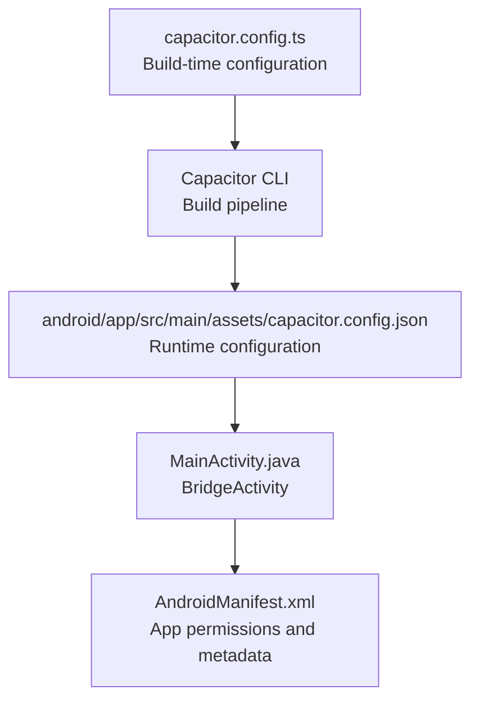
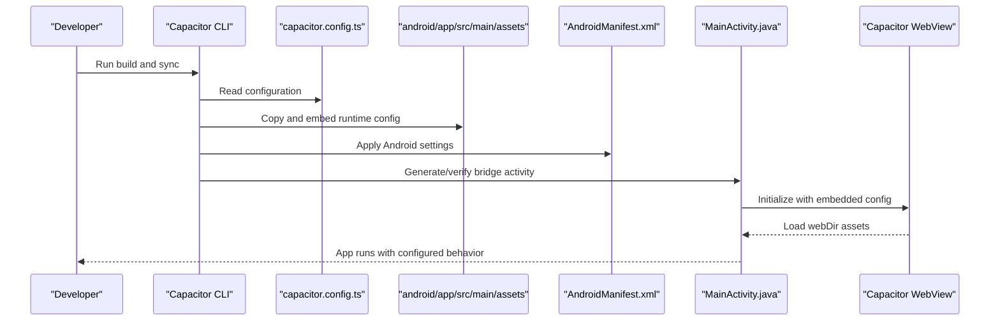
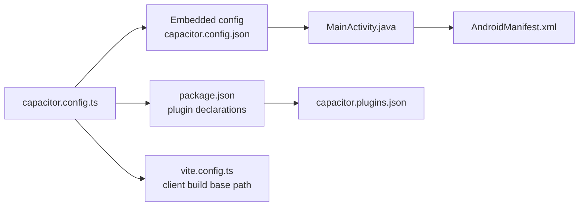

# Capacitor Configuration

<cite>
**Referenced Files in This Document**
- [capacitor.config.ts](file://capacitor.config.ts)
- [capacitor.config.json](file://android/app/src/main/assets/capacitor.config.json)
- [AndroidManifest.xml](file://android/app/src/main/AndroidManifest.xml)
- [MainActivity.java](file://android/app/src/main/java/com/newsbot/manager/MainActivity.java)
- [capacitor.plugins.json](file://android/app/src/main/assets/capacitor.plugins.json)
- [package.json](file://package.json)
- [App.tsx](file://src/App.tsx)
- [standaloneService.ts](file://src/services/standaloneService.ts)
- [vite.config.ts](file://vite.config.ts)
- [build.gradle](file://android/app/build.gradle)
</cite>

## Table of Contents
1. [Introduction](#introduction)
2. [Project Structure](#project-structure)
3. [Core Components](#core-components)
4. [Architecture Overview](#architecture-overview)
5. [Detailed Component Analysis](#detailed-component-analysis)
6. [Dependency Analysis](#dependency-analysis)
7. [Performance Considerations](#performance-considerations)
8. [Troubleshooting Guide](#troubleshooting-guide)
9. [Conclusion](#conclusion)
10. [Appendices](#appendices)

## Introduction
This document explains the Capacitor configuration for the project, focusing on how the Capacitor configuration affects app identification, asset loading, server behavior, Android-specific settings, and plugin configurations. It also covers the relationship between Capacitor configuration and Android manifest settings, and provides guidance for customizing these settings across different deployment environments.

## Project Structure
The Capacitor configuration is defined in two places:
- A TypeScript configuration file that defines the build-time configuration for Capacitor CLI and tooling.
- An embedded JSON configuration file that is packaged into the Android app and loaded at runtime.

**Diagram sources**
- [capacitor.config.ts:1-26](file://capacitor.config.ts#L1-L26)
- [capacitor.config.json:1-24](file://android/app/src/main/assets/capacitor.config.json#L1-L24)
- [MainActivity.java:1-6](file://android/app/src/main/java/com/newsbot/manager/MainActivity.java#L1-L6)
- [AndroidManifest.xml:1-46](file://android/app/src/main/AndroidManifest.xml#L1-L46)

**Section sources**
- [capacitor.config.ts:1-26](file://capacitor.config.ts#L1-L26)
- [capacitor.config.json:1-24](file://android/app/src/main/assets/capacitor.config.json#L1-L24)
- [MainActivity.java:1-6](file://android/app/src/main/java/com/newsbot/manager/MainActivity.java#L1-L6)
- [AndroidManifest.xml:1-46](file://android/app/src/main/AndroidManifest.xml#L1-L46)

## Core Components
This section explains the primary configuration keys and their impact on app behavior.

- appId: Defines the reverse-DNS package identifier used by the Android app and by Capacitor for app identification.
- appName: Sets the human-readable application name shown in the Android launcher and system UI.
- webDir: Specifies the build output directory containing the web assets that Capacitor serves to the WebView.

These settings directly influence:
- App identity and branding on Android devices.
- Asset loading behavior and the location of the built client bundle.

**Section sources**
- [capacitor.config.ts:3-6](file://capacitor.config.ts#L3-L6)
- [capacitor.config.json:2-4](file://android/app/src/main/assets/capacitor.config.json#L2-L4)

## Architecture Overview
The configuration drives how Capacitor initializes the Android WebView, loads the web app, and handles navigation and security policies.

**Diagram sources**
- [capacitor.config.ts:1-26](file://capacitor.config.ts#L1-L26)
- [capacitor.config.json:1-24](file://android/app/src/main/assets/capacitor.config.json#L1-L24)
- [AndroidManifest.xml:1-46](file://android/app/src/main/AndroidManifest.xml#L1-L46)
- [MainActivity.java:1-6](file://android/app/src/main/java/com/newsbot/manager/MainActivity.java#L1-L6)

## Detailed Component Analysis

### Server Configuration
The server block controls how Capacitor serves the web app and handles navigation on Android.

- androidScheme: Determines the scheme used for the local server on Android. The project uses HTTPS, which enforces secure transport for local assets.
- allowNavigation: Controls which URLs the WebView can navigate to. The project allows navigation to any URL, which can be restrictive or permissive depending on the environment.

Security implications:
- Using HTTPS for androidScheme ensures that local assets are served securely.
- allowNavigation set to wildcard (*) permits navigation to external domains, which can increase attack surface. Consider restricting to known origins in production.

**Section sources**
- [capacitor.config.ts:7-10](file://capacitor.config.ts#L7-L10)
- [capacitor.config.json:5-10](file://android/app/src/main/assets/capacitor.config.json#L5-L10)

### Android-Specific Settings
The android block configures runtime behavior for the Android platform.

- allowMixedContent: When true, allows mixed content (HTTP resources on HTTPS pages). This can cause security warnings and should be disabled in production.
- webContentsDebuggingEnabled: Enables remote debugging of the WebView, useful for development but should be disabled in production builds.

Development vs. production guidance:
- Development: Keep webContentsDebuggingEnabled true for easier debugging.
- Production: Disable webContentsDebuggingEnabled and ensure allowMixedContent is false to enforce secure contexts.

**Section sources**
- [capacitor.config.ts:11-14](file://capacitor.config.ts#L11-L14)
- [capacitor.config.json:11-14](file://android/app/src/main/assets/capacitor.config.json#L11-L14)

### Plugin Configurations
Plugins extend Capacitor's capabilities. The project enables and configures two plugins:

- CapacitorHttp: Enables HTTP requests from native code, bypassing browser CORS restrictions.
- Keyboard: Configures resize mode for the keyboard area.

Keyboard resize modes:
- body: Adjusts the body element when the keyboard appears, which can improve layout behavior on mobile devices.

**Section sources**
- [capacitor.config.ts:15-22](file://capacitor.config.ts#L15-L22)
- [capacitor.config.json:15-22](file://android/app/src/main/assets/capacitor.config.json#L15-L22)
- [capacitor.plugins.json:10-13](file://android/app/src/main/assets/capacitor.plugins.json#L10-L13)

### Relationship Between Capacitor Config and Android Manifest
Capacitor configuration and Android manifest settings interact as follows:

- Application ID and package name: Both appId and the Android applicationId must match to ensure correct app identification and behavior.
- Network security: AndroidManifest.xml sets usesCleartextTraffic to true, allowing HTTP traffic. Combined with allowMixedContent=true, this can lead to mixed content issues. Align these settings with your security posture.
- WebView debugging: webContentsDebuggingEnabled in Capacitor config enables WebView debugging; the manifest does not directly control this but can affect overall app behavior.

**Section sources**
- [capacitor.config.ts:4](file://capacitor.config.ts#L4)
- [build.gradle:7](file://android/app/build.gradle#L7)
- [AndroidManifest.xml:10](file://android/app/src/main/AndroidManifest.xml#L10)
- [capacitor.config.ts:13](file://capacitor.config.ts#L13)

### Practical Usage Scenarios
The project demonstrates practical usage of CapacitorHttp for making requests from native code.

- Native HTTP requests: The application uses CapacitorHttp.request with explicit timeouts for connect and read operations.
- CORS bypass: CapacitorHttp is used to bypass CORS restrictions when fetching content in the native environment.

**Section sources**
- [App.tsx:214-221](file://src/App.tsx#L214-L221)
- [standaloneService.ts:164](file://src/services/standaloneService.ts#L164)

## Dependency Analysis
The configuration influences several parts of the build and runtime pipeline.

**Diagram sources**
- [capacitor.config.ts:1-26](file://capacitor.config.ts#L1-L26)
- [capacitor.config.json:1-24](file://android/app/src/main/assets/capacitor.config.json#L1-L24)
- [MainActivity.java:1-6](file://android/app/src/main/java/com/newsbot/manager/MainActivity.java#L1-L6)
- [AndroidManifest.xml:1-46](file://android/app/src/main/AndroidManifest.xml#L1-L46)
- [package.json:19-56](file://package.json#L19-L56)
- [capacitor.plugins.json:1-19](file://android/app/src/main/assets/capacitor.plugins.json#L1-L19)
- [vite.config.ts:10](file://vite.config.ts#L10)

**Section sources**
- [package.json:19-56](file://package.json#L19-L56)
- [capacitor.plugins.json:1-19](file://android/app/src/main/assets/capacitor.plugins.json#L1-L19)
- [vite.config.ts:10](file://vite.config.ts#L10)

## Performance Considerations
- Mixed content: Disabling allowMixedContent reduces potential performance and security overhead associated with mixed content handling.
- Debugging overhead: Keeping webContentsDebuggingEnabled enabled adds overhead; disable it in production builds.
- Navigation scope: Restricting allowNavigation narrows the WebView's exposure and can improve stability and performance by limiting unexpected navigations.

[No sources needed since this section provides general guidance]

## Troubleshooting Guide
Common issues and resolutions:

- Mixed content warnings or failures:
  - Cause: allowMixedContent=true combined with usesCleartextTraffic=true.
  - Resolution: Align security settings; prefer HTTPS and disable allowMixedContent in production.

- WebView debugging:
  - Symptom: Remote debugging enabled unexpectedly.
  - Resolution: Disable webContentsDebuggingEnabled in production builds.

- Plugin not found errors:
  - Cause: Missing plugin declaration in package.json or mismatched plugin configuration.
  - Resolution: Verify plugin entries in package.json and ensure corresponding entries in capacitor.plugins.json.

- Build path issues:
  - Cause: webDir path mismatch with Vite build output.
  - Resolution: Ensure webDir matches the Vite output directory and base path configuration.

**Section sources**
- [capacitor.config.ts:11-14](file://capacitor.config.ts#L11-L14)
- [AndroidManifest.xml:10](file://android/app/src/main/AndroidManifest.xml#L10)
- [package.json:19-56](file://package.json#L19-L56)
- [capacitor.plugins.json:1-19](file://android/app/src/main/assets/capacitor.plugins.json#L1-L19)
- [vite.config.ts:10](file://vite.config.ts#L10)

## Conclusion
The Capacitor configuration in this project establishes a secure baseline with HTTPS for local assets, broad navigation allowances, and development-friendly debugging settings. For production, tighten security by disabling mixed content, removing wildcard navigation, and turning off WebView debugging. Align Android manifest settings with Capacitor configuration to ensure consistent behavior across platforms.

[No sources needed since this section summarizes without analyzing specific files]

## Appendices

### Customization Examples by Environment
- Development:
  - androidScheme: HTTPS
  - allowNavigation: Wildcard (*) for flexibility
  - allowMixedContent: true
  - webContentsDebuggingEnabled: true

- Staging:
  - androidScheme: HTTPS
  - allowNavigation: Specific trusted origins
  - allowMixedContent: false
  - webContentsDebuggingEnabled: false

- Production:
  - androidScheme: HTTPS
  - allowNavigation: Minimal, specific origins
  - allowMixedContent: false
  - webContentsDebuggingEnabled: false

[No sources needed since this section provides general guidance]