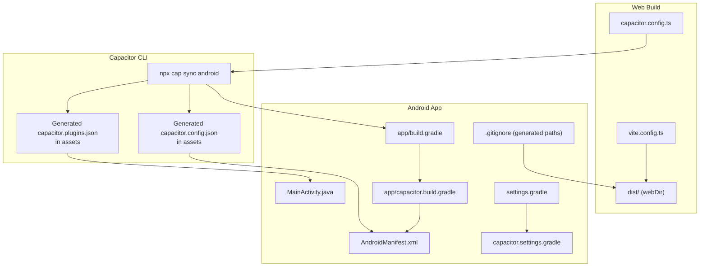
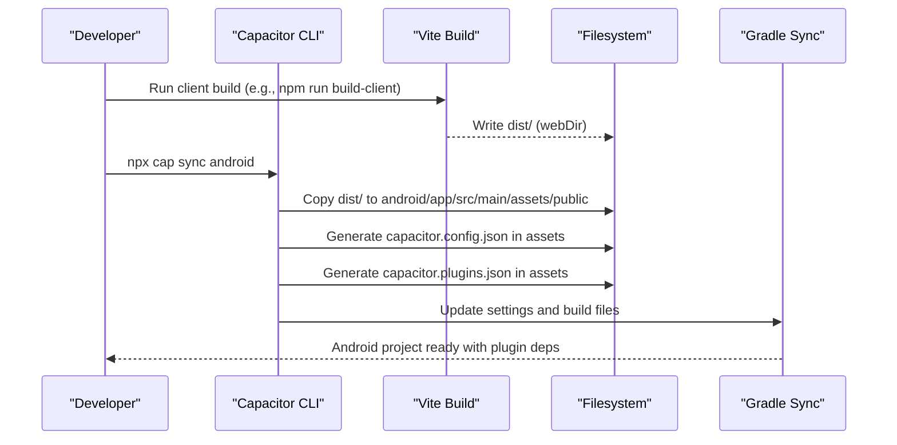
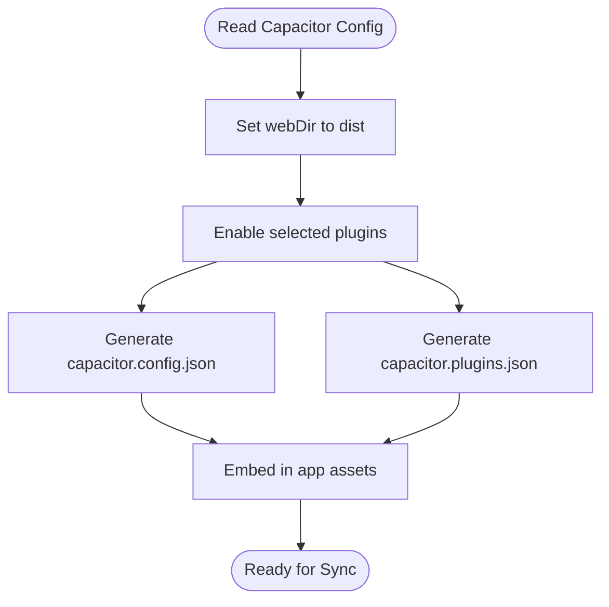
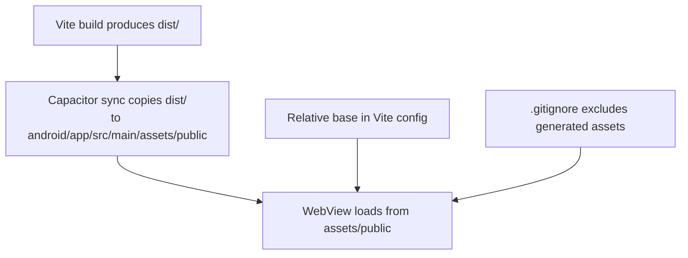
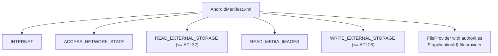
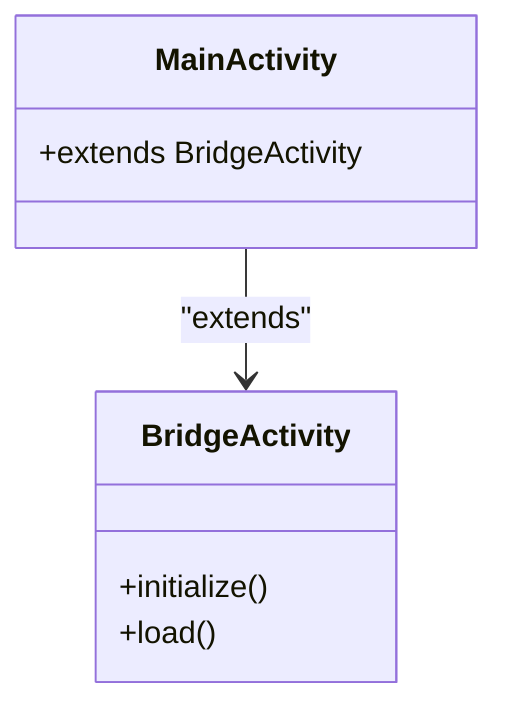
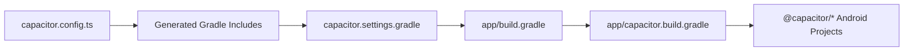
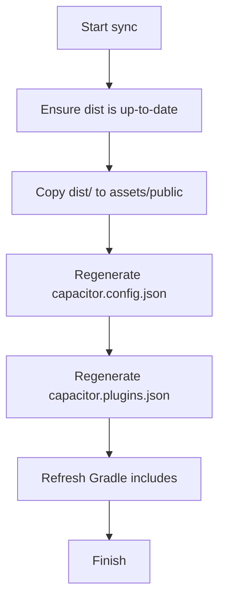
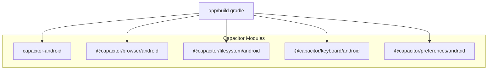

# Capacitor Sync Process

<cite>
**Referenced Files in This Document**
- [capacitor.config.ts](file://capacitor.config.ts)
- [package.json](file://package.json)
- [vite.config.ts](file://vite.config.ts)
- [android/app/src/main/AndroidManifest.xml](file://android/app/src/main/AndroidManifest.xml)
- [android/app/src/main/java/com/newsbot/manager/MainActivity.java](file://android/app/src/main/java/com/newsbot/manager/MainActivity.java)
- [android/app/src/main/assets/capacitor.config.json](file://android/app/src/main/assets/capacitor.config.json)
- [android/app/src/main/assets/capacitor.plugins.json](file://android/app/src/main/assets/capacitor.plugins.json)
- [android/app/build.gradle](file://android/app/build.gradle)
- [android/app/capacitor.build.gradle](file://android/app/capacitor.build.gradle)
- [android/settings.gradle](file://android/settings.gradle)
- [android/capacitor.settings.gradle](file://android/capacitor.settings.gradle)
- [android/.gitignore](file://android/.gitignore)
- [android/capacitor-cordova-android-plugins/cordova.variables.gradle](file://android/capacitor-cordova-android-plugins/cordova.variables.gradle)
</cite>

## Table of Contents
1. [Introduction](#introduction)
2. [Project Structure](#project-structure)
3. [Core Components](#core-components)
4. [Architecture Overview](#architecture-overview)
5. [Detailed Component Analysis](#detailed-component-analysis)
6. [Dependency Analysis](#dependency-analysis)
7. [Performance Considerations](#performance-considerations)
8. [Troubleshooting Guide](#troubleshooting-guide)
9. [Conclusion](#conclusion)
10. [Appendices](#appendices)

## Introduction
This document explains the Capacitor sync process and how native Android code is updated for a React-based Capacitor 6 project. It focuses on the npx cap sync android workflow, how web assets are copied into the Android app, how the Android manifest is prepared, and how plugins are integrated. It also covers incremental sync behavior, cache-related considerations, and best practices to keep web and native builds consistent.

## Project Structure
The project follows a standard Capacitor setup:
- Web assets are produced by Vite and placed under the configured webDir.
- Capacitor CLI reads the Capacitor configuration to determine the Android app’s behavior and plugin wiring.
- Android Gradle build scripts dynamically include Capacitor plugin projects and generated settings.

Key locations:
- Capacitor configuration defines the app ID, app name, webDir, server scheme, navigation allowances, and plugin settings.
- Android app module includes the BridgeActivity and AndroidManifest entries.
- Assets under android/app/src/main/assets include the runtime configuration and plugin registry used by Capacitor at runtime.
- Gradle files dynamically include Capacitor core and plugin modules.

**Diagram sources**
- [capacitor.config.ts:1-26](file://capacitor.config.ts#L1-L26)
- [vite.config.ts:1-28](file://vite.config.ts#L1-L28)
- [android/app/src/main/assets/capacitor.config.json:1-24](file://android/app/src/main/assets/capacitor.config.json#L1-L24)
- [android/app/src/main/assets/capacitor.plugins.json:1-19](file://android/app/src/main/assets/capacitor.plugins.json#L1-L19)
- [android/app/src/main/AndroidManifest.xml:1-46](file://android/app/src/main/AndroidManifest.xml#L1-L46)
- [android/app/src/main/java/com/newsbot/manager/MainActivity.java:1-6](file://android/app/src/main/java/com/newsbot/manager/MainActivity.java#L1-L6)
- [android/app/build.gradle:1-55](file://android/app/build.gradle#L1-L55)
- [android/app/capacitor.build.gradle:1-23](file://android/app/capacitor.build.gradle#L1-L23)
- [android/settings.gradle:1-5](file://android/settings.gradle#L1-L5)
- [android/capacitor.settings.gradle:1-16](file://android/capacitor.settings.gradle#L1-L16)
- [android/.gitignore:95-101](file://android/.gitignore#L95-L101)

**Section sources**
- [capacitor.config.ts:1-26](file://capacitor.config.ts#L1-L26)
- [vite.config.ts:1-28](file://vite.config.ts#L1-L28)
- [android/app/src/main/assets/capacitor.config.json:1-24](file://android/app/src/main/assets/capacitor.config.json#L1-L24)
- [android/app/src/main/assets/capacitor.plugins.json:1-19](file://android/app/src/main/assets/capacitor.plugins.json#L1-L19)
- [android/app/src/main/AndroidManifest.xml:1-46](file://android/app/src/main/AndroidManifest.xml#L1-L46)
- [android/app/src/main/java/com/newsbot/manager/MainActivity.java:1-6](file://android/app/src/main/java/com/newsbot/manager/MainActivity.java#L1-L6)
- [android/app/build.gradle:1-55](file://android/app/build.gradle#L1-L55)
- [android/app/capacitor.build.gradle:1-23](file://android/app/capacitor.build.gradle#L1-L23)
- [android/settings.gradle:1-5](file://android/settings.gradle#L1-L5)
- [android/capacitor.settings.gradle:1-16](file://android/capacitor.settings.gradle#L1-L16)
- [android/.gitignore:95-101](file://android/.gitignore#L95-L101)

## Core Components
- Capacitor configuration: Defines app identity, webDir, server behavior, and plugin toggles.
- Vite configuration: Produces the webDir output with proper base path for Capacitor packaging.
- Android app module: Uses BridgeActivity and declares permissions in AndroidManifest.
- Generated assets: Runtime configuration and plugin registry embedded in the app.
- Gradle integration: Dynamically includes Capacitor core and plugin modules.

Key behaviors:
- The webDir is set to dist, so Capacitor expects built web assets in that folder after a client build.
- Plugins declared in the Capacitor config are mirrored into the generated plugin registry.
- The AndroidManifest includes standard permissions and a FileProvider declaration for file sharing.

**Section sources**
- [capacitor.config.ts:3-26](file://capacitor.config.ts#L3-L26)
- [vite.config.ts:6-27](file://vite.config.ts#L6-L27)
- [android/app/src/main/AndroidManifest.xml:1-46](file://android/app/src/main/AndroidManifest.xml#L1-L46)
- [android/app/src/main/assets/capacitor.config.json:1-24](file://android/app/src/main/assets/capacitor.config.json#L1-L24)
- [android/app/src/main/assets/capacitor.plugins.json:1-19](file://android/app/src/main/assets/capacitor.plugins.json#L1-L19)

## Architecture Overview
The sync process orchestrates building the web app, copying assets into the Android app, generating runtime configuration, and wiring plugin dependencies into the Android build.

**Diagram sources**
- [package.json:10-17](file://package.json#L10-L17)
- [capacitor.config.ts:6](file://capacitor.config.ts#L6)
- [android/app/src/main/assets/capacitor.config.json:1-24](file://android/app/src/main/assets/capacitor.config.json#L1-L24)
- [android/app/src/main/assets/capacitor.plugins.json:1-19](file://android/app/src/main/assets/capacitor.plugins.json#L1-L19)
- [android/.gitignore:95-101](file://android/.gitignore#L95-L101)
- [android/app/build.gradle:1-55](file://android/app/build.gradle#L1-L55)
- [android/app/capacitor.build.gradle:1-23](file://android/app/capacitor.build.gradle#L1-L23)
- [android/settings.gradle:1-5](file://android/settings.gradle#L1-L5)
- [android/capacitor.settings.gradle:1-16](file://android/capacitor.settings.gradle#L1-L16)

## Detailed Component Analysis

### Capacitor Configuration and Plugin Registry
- The Capacitor config sets the webDir to dist and enables specific plugins. These settings are mirrored into the generated runtime configuration and plugin registry.
- The runtime configuration includes server scheme and navigation allowances.
- The plugin registry enumerates plugin packages and their classpaths, enabling Capacitor to initialize them at runtime.

**Diagram sources**
- [capacitor.config.ts:3-26](file://capacitor.config.ts#L3-L26)
- [android/app/src/main/assets/capacitor.config.json:1-24](file://android/app/src/main/assets/capacitor.config.json#L1-L24)
- [android/app/src/main/assets/capacitor.plugins.json:1-19](file://android/app/src/main/assets/capacitor.plugins.json#L1-L19)

**Section sources**
- [capacitor.config.ts:3-26](file://capacitor.config.ts#L3-L26)
- [android/app/src/main/assets/capacitor.config.json:1-24](file://android/app/src/main/assets/capacitor.config.json#L1-L24)
- [android/app/src/main/assets/capacitor.plugins.json:1-19](file://android/app/src/main/assets/capacitor.plugins.json#L1-L19)

### Web Asset Copying and Dist Mapping
- The Capacitor CLI copies the contents of the configured webDir (dist) into the Android assets directory under a public folder.
- The Vite configuration sets a relative base path to ensure assets resolve correctly inside the Capacitor WebView.
- The .gitignore includes the generated assets and config files to avoid committing auto-generated content.

**Diagram sources**
- [vite.config.ts:10](file://vite.config.ts#L10)
- [android/.gitignore:95-101](file://android/.gitignore#L95-L101)

**Section sources**
- [vite.config.ts:10](file://vite.config.ts#L10)
- [android/.gitignore:95-101](file://android/.gitignore#L95-L101)

### AndroidManifest Modifications and Permissions
- The AndroidManifest declares standard permissions and a FileProvider for secure file sharing.
- The manifest is not manually edited by Capacitor; it remains under version control while generated assets are ignored.
- The FileProvider authorities use the applicationId placeholder, ensuring uniqueness per app.

**Diagram sources**
- [android/app/src/main/AndroidManifest.xml:1-46](file://android/app/src/main/AndroidManifest.xml#L1-L46)

**Section sources**
- [android/app/src/main/AndroidManifest.xml:1-46](file://android/app/src/main/AndroidManifest.xml#L1-L46)

### Native Activity and Bridge Initialization
- MainActivity extends the Capacitor BridgeActivity, which initializes the WebView and loads the app assets according to the runtime configuration.
- No manual WebView setup is required; Capacitor manages lifecycle and asset loading.

**Diagram sources**
- [android/app/src/main/java/com/newsbot/manager/MainActivity.java:1-6](file://android/app/src/main/java/com/newsbot/manager/MainActivity.java#L1-L6)

**Section sources**
- [android/app/src/main/java/com/newsbot/manager/MainActivity.java:1-6](file://android/app/src/main/java/com/newsbot/manager/MainActivity.java#L1-L6)

### Plugin Integration and Gradle Wiring
- Capacitor generates Gradle includes for core and plugin modules, adding them as project dependencies.
- The generated build script sets Java compatibility and adds plugin dependencies.
- The settings file dynamically includes Capacitor and plugin Android projects.

**Diagram sources**
- [capacitor.config.ts:15-22](file://capacitor.config.ts#L15-L22)
- [android/capacitor.settings.gradle:1-16](file://android/capacitor.settings.gradle#L1-L16)
- [android/app/build.gradle:1-55](file://android/app/build.gradle#L1-L55)
- [android/app/capacitor.build.gradle:1-23](file://android/app/capacitor.build.gradle#L1-L23)

**Section sources**
- [capacitor.config.ts:15-22](file://capacitor.config.ts#L15-L22)
- [android/capacitor.settings.gradle:1-16](file://android/capacitor.settings.gradle#L1-L16)
- [android/app/build.gradle:1-55](file://android/app/build.gradle#L1-L55)
- [android/app/capacitor.build.gradle:1-23](file://android/app/capacitor.build.gradle#L1-L23)

### Incremental Sync and Cache Management
- Capacitor performs targeted updates when syncing:
  - Copies updated web assets from webDir to assets/public.
  - Regenerates runtime configuration and plugin registry.
  - Updates Gradle includes and dependencies.
- To avoid stale assets, clean the dist folder before building and ensure the latest build is present before syncing.
- The .gitignore excludes generated assets and config files, preventing accidental commits.

**Diagram sources**
- [package.json:13](file://package.json#L13)
- [android/.gitignore:95-101](file://android/.gitignore#L95-L101)

**Section sources**
- [package.json:13](file://package.json#L13)
- [android/.gitignore:95-101](file://android/.gitignore#L95-L101)

## Dependency Analysis
The Android app depends on Capacitor core and selected plugin modules. The Gradle files dynamically include these modules based on the Capacitor configuration.

**Diagram sources**
- [android/app/build.gradle:38](file://android/app/build.gradle#L38)
- [android/app/build.gradle:42](file://android/app/build.gradle#L42)
- [android/capacitor.settings.gradle:2-16](file://android/capacitor.settings.gradle#L2-L16)

**Section sources**
- [android/app/build.gradle:38](file://android/app/build.gradle#L38)
- [android/app/build.gradle:42](file://android/app/build.gradle#L42)
- [android/capacitor.settings.gradle:2-16](file://android/capacitor.settings.gradle#L2-L16)

## Performance Considerations
- Keep webDir minimal and optimized; remove unused assets to reduce copy time.
- Use production builds for distribution to minimize payload size.
- Avoid unnecessary plugin enable/disable cycles; only enable required plugins to reduce Gradle overhead.
- Ensure Java compatibility matches the target environment to prevent rebuild churn.

## Troubleshooting Guide
Common issues and resolutions:
- Assets not updating in the app:
  - Verify the webDir exists and contains the latest build.
  - Confirm the sync command runs after the client build.
  - Check that dist is not empty and properly committed to the repo if using CI.
- Plugin not working:
  - Ensure the plugin is enabled in the Capacitor config.
  - Re-run sync to regenerate plugin registry and Gradle includes.
  - Confirm the plugin module appears in the generated settings and build files.
- Manifest errors:
  - Do not edit AndroidManifest manually; rely on Capacitor’s generated assets.
  - If permissions appear incorrect, adjust them in the Capacitor config and re-sync.
- Gradle sync failures:
  - Clean and rebuild the Android project.
  - Ensure Gradle and Android SDK versions match the project requirements.
  - Verify the generated Gradle files are not manually edited.

**Section sources**
- [capacitor.config.ts:15-22](file://capacitor.config.ts#L15-L22)
- [android/app/src/main/AndroidManifest.xml:1-46](file://android/app/src/main/AndroidManifest.xml#L1-L46)
- [android/app/build.gradle:1-55](file://android/app/build.gradle#L1-L55)
- [android/app/capacitor.build.gradle:1-23](file://android/app/capacitor.build.gradle#L1-L23)

## Conclusion
The Capacitor sync process integrates a React/Vite-built web app into an Android project by copying assets, generating runtime configuration, and wiring plugin dependencies via Gradle. By keeping the webDir aligned with the build output, enabling only necessary plugins, and relying on generated assets, teams can maintain a consistent and reliable build pipeline across web and native targets.

## Appendices
- Best practices:
  - Always build the web app before syncing.
  - Keep Capacitor config and Vite config aligned with deployment needs.
  - Use scripts to automate the build-and-sync workflow.
  - Exclude generated assets from version control to avoid conflicts.

**Section sources**
- [package.json:10-17](file://package.json#L10-L17)
- [capacitor.config.ts:3-26](file://capacitor.config.ts#L3-L26)
- [vite.config.ts:6-27](file://vite.config.ts#L6-L27)
- [android/.gitignore:95-101](file://android/.gitignore#L95-L101)