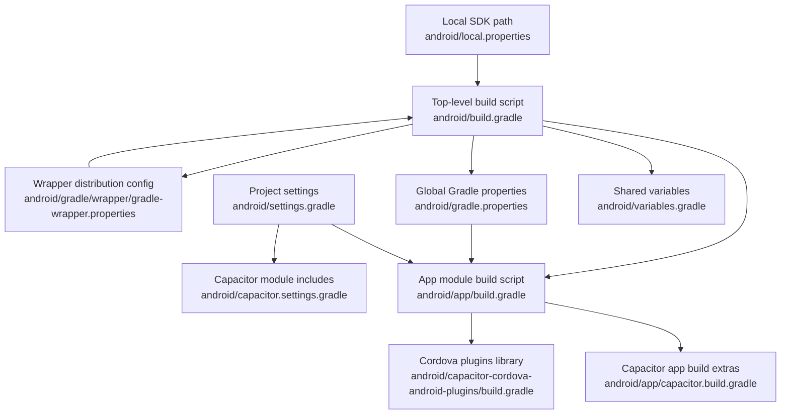
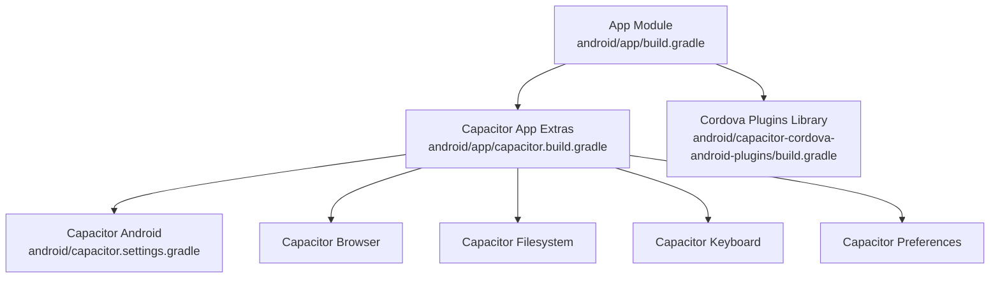
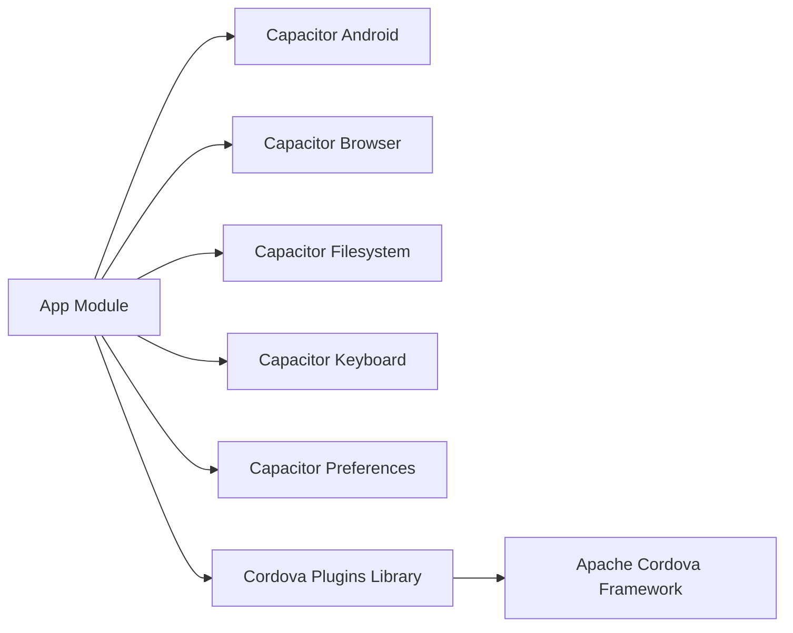

# Gradle Build Process

<cite>
**Referenced Files in This Document**
- [android/build.gradle](file://android/build.gradle)
- [android/app/build.gradle](file://android/app/build.gradle)
- [android/variables.gradle](file://android/variables.gradle)
- [android/settings.gradle](file://android/settings.gradle)
- [android/gradle.properties](file://android/gradle.properties)
- [android/gradle/wrapper/gradle-wrapper.properties](file://android/gradle/wrapper/gradle-wrapper.properties)
- [android/local.properties](file://android/local.properties)
- [android/app/proguard-rules.pro](file://android/app/proguard-rules.pro)
- [android/app/capacitor.build.gradle](file://android/app/capacitor.build.gradle)
- [android/capacitor.settings.gradle](file://android/capacitor.settings.gradle)
- [android/capacitor-cordova-android-plugins/build.gradle](file://android/capacitor-cordova-android-plugins/build.gradle)
</cite>

## Table of Contents
1. [Introduction](#introduction)
2. [Project Structure](#project-structure)
3. [Core Components](#core-components)
4. [Architecture Overview](#architecture-overview)
5. [Detailed Component Analysis](#detailed-component-analysis)
6. [Dependency Analysis](#dependency-analysis)
7. [Performance Considerations](#performance-considerations)
8. [Signing Configuration](#signing-configuration)
9. [Build Types, Variants, and Optimization](#build-types-variants-and-optimization)
10. [Troubleshooting Guide](#troubleshooting-guide)
11. [Conclusion](#conclusion)

## Introduction
This document explains the Android Gradle build process for the project. It covers the top-level and app-level build scripts, dependency management, plugin applications, SDK versions, build types, and optimization settings. It also provides guidance on Gradle wrapper configuration, troubleshooting common issues, and best practices for signing and performance.

## Project Structure
The Android build is organized under the android directory with a top-level build script, per-module scripts, shared variables, settings, Gradle properties, and wrapper configuration. Capacitor-related modules are included via generated settings and build scripts.

**Diagram sources**
- [android/build.gradle:1-30](file://android/build.gradle#L1-L30)
- [android/app/build.gradle:1-55](file://android/app/build.gradle#L1-L55)
- [android/variables.gradle:1-16](file://android/variables.gradle#L1-L16)
- [android/settings.gradle:1-5](file://android/settings.gradle#L1-L5)
- [android/gradle.properties:1-23](file://android/gradle.properties#L1-L23)
- [android/gradle/wrapper/gradle-wrapper.properties:1-8](file://android/gradle/wrapper/gradle-wrapper.properties#L1-L8)
- [android/local.properties:1-9](file://android/local.properties#L1-L9)
- [android/app/capacitor.build.gradle:1-23](file://android/app/capacitor.build.gradle#L1-L23)
- [android/capacitor.settings.gradle:1-16](file://android/capacitor.settings.gradle#L1-L16)
- [android/capacitor-cordova-android-plugins/build.gradle:1-59](file://android/capacitor-cordova-android-plugins/build.gradle#L1-L59)

**Section sources**
- [android/build.gradle:1-30](file://android/build.gradle#L1-L30)
- [android/app/build.gradle:1-55](file://android/app/build.gradle#L1-L55)
- [android/variables.gradle:1-16](file://android/variables.gradle#L1-L16)
- [android/settings.gradle:1-5](file://android/settings.gradle#L1-L5)
- [android/gradle.properties:1-23](file://android/gradle.properties#L1-L23)
- [android/gradle/wrapper/gradle-wrapper.properties:1-8](file://android/gradle/wrapper/gradle-wrapper.properties#L1-L8)
- [android/local.properties:1-9](file://android/local.properties#L1-L9)
- [android/app/capacitor.build.gradle:1-23](file://android/app/capacitor.build.gradle#L1-L23)
- [android/capacitor.settings.gradle:1-16](file://android/capacitor.settings.gradle#L1-L16)
- [android/capacitor-cordova-android-plugins/build.gradle:1-59](file://android/capacitor-cordova-android-plugins/build.gradle#L1-L59)

## Core Components
- Top-level build script defines repositories, Android Gradle Plugin and Google Services classpaths, applies shared variables, and sets global repositories and a clean task.
- App module script applies the application plugin, configures namespace, SDK versions from shared variables, default app metadata, asset packaging options, and build types.
- Shared variables define SDK versions and library versions used across modules.
- Settings include the app module and Capacitor modules, and apply generated Capacitor settings.
- Gradle properties enable AndroidX and tune JVM memory; wrapper properties pin the Gradle distribution; local properties point to the Android SDK location.
- Capacitor app build script enforces Java 17 compatibility and adds Capacitor modules as dependencies.
- Cordova plugins library script defines its own SDK versions and dependencies.

**Section sources**
- [android/build.gradle:1-30](file://android/build.gradle#L1-L30)
- [android/app/build.gradle:1-55](file://android/app/build.gradle#L1-L55)
- [android/variables.gradle:1-16](file://android/variables.gradle#L1-L16)
- [android/settings.gradle:1-5](file://android/settings.gradle#L1-L5)
- [android/gradle.properties:1-23](file://android/gradle.properties#L1-L23)
- [android/gradle/wrapper/gradle-wrapper.properties:1-8](file://android/gradle/wrapper/gradle-wrapper.properties#L1-L8)
- [android/local.properties:1-9](file://android/local.properties#L1-L9)
- [android/app/capacitor.build.gradle:1-23](file://android/app/capacitor.build.gradle#L1-L23)
- [android/capacitor-cordova-android-plugins/build.gradle:1-59](file://android/capacitor-cordova-android-plugins/build.gradle#L1-L59)

## Architecture Overview
The build architecture integrates the app module with Capacitor and Cordova plugins. The app module depends on Capacitor Android and several Capacitor community plugins. The Cordova plugins library contributes Apache Cordova framework and related dependencies.

**Diagram sources**
- [android/app/build.gradle:1-55](file://android/app/build.gradle#L1-L55)
- [android/app/capacitor.build.gradle:1-23](file://android/app/capacitor.build.gradle#L1-L23)
- [android/capacitor.settings.gradle:1-16](file://android/capacitor.settings.gradle#L1-L16)
- [android/capacitor-cordova-android-plugins/build.gradle:1-59](file://android/capacitor-cordova-android-plugins/build.gradle#L1-L59)

## Detailed Component Analysis

### Top-Level Build Script
- Repositories: Declares Google and Maven Central for resolving dependencies.
- Dependencies: Applies Android Gradle Plugin and Google Services Plugin at the classpath level.
- Variables: Applies shared variables from variables.gradle.
- Global repositories: Ensures all subprojects use the same repositories.
- Clean task: Defines a root clean task.

**Section sources**
- [android/build.gradle:1-30](file://android/build.gradle#L1-L30)

### App Module Build Script
- Plugin: Applies com.android.application.
- Android block:
  - Namespace and compileSdk from shared variables.
  - defaultConfig: applicationId, minSdkVersion, targetSdkVersion from shared variables, versionCode/versionName, test runner, and aaptOptions to exclude unnecessary assets.
  - buildTypes: release type with minification disabled and custom ProGuard rules.
- Repositories: Adds local libs directories for Cordova artifacts.
- Dependencies: Implements local JARs, AndroidX libraries, Capacitor core, tests, and the Cordova plugins library.
- Capacitor integration: Applies generated capacitor.build.gradle and conditionally applies Google Services plugin if google-services.json exists.

**Section sources**
- [android/app/build.gradle:1-55](file://android/app/build.gradle#L1-L55)

### Shared Variables
- Defines minSdkVersion, compileSdkVersion, targetSdkVersion, and numerous library versions used across modules.

**Section sources**
- [android/variables.gradle:1-16](file://android/variables.gradle#L1-L16)

### Settings and Capacitor Modules
- Includes the app and Cordova plugins modules.
- Applies generated Capacitor settings that include multiple Capacitor community plugins as subprojects.

**Section sources**
- [android/settings.gradle:1-5](file://android/settings.gradle#L1-L5)
- [android/capacitor.settings.gradle:1-16](file://android/capacitor.settings.gradle#L1-L16)

### Gradle Properties and Wrapper
- Gradle properties:
  - JVM arguments for the Gradle daemon.
  - AndroidX flag enabled.
- Wrapper properties:
  - Distribution URL pinned to a specific Gradle version.
  - Network timeout and validation settings.

**Section sources**
- [android/gradle.properties:1-23](file://android/gradle.properties#L1-L23)
- [android/gradle/wrapper/gradle-wrapper.properties:1-8](file://android/gradle/wrapper/gradle-wrapper.properties#L1-L8)

### Local SDK Path
- local.properties specifies the Android SDK location used by Gradle.

**Section sources**
- [android/local.properties:1-9](file://android/local.properties#L1-L9)

### Capacitor App Build Script
- Enforces Java 17 compatibility for source and target.
- Applies Cordova variables and adds Capacitor modules as dependencies.
- Provides a hook for post-build extras.

**Section sources**
- [android/app/capacitor.build.gradle:1-23](file://android/app/capacitor.build.gradle#L1-L23)

### Cordova Plugins Library
- Defines library versions and applies the Android library plugin.
- Configures compileSdk/minSdk/targetSdk from shared variables or defaults.
- Enforces Java 17 compatibility.
- Adds Apache Cordova framework and local JARs.

**Section sources**
- [android/capacitor-cordova-android-plugins/build.gradle:1-59](file://android/capacitor-cordova-android-plugins/build.gradle#L1-L59)

## Dependency Analysis
The app module depends on:
- Capacitor core module (added via settings).
- Capacitor community plugins (browser, filesystem, keyboard, preferences) added in the Capacitor app build script.
- Cordova plugins library, which depends on Apache Cordova framework and local JARs.
- AndroidX libraries and testing frameworks.

**Diagram sources**
- [android/app/build.gradle:1-55](file://android/app/build.gradle#L1-L55)
- [android/app/capacitor.build.gradle:1-23](file://android/app/capacitor.build.gradle#L1-L23)
- [android/capacitor.settings.gradle:1-16](file://android/capacitor.settings.gradle#L1-L16)
- [android/capacitor-cordova-android-plugins/build.gradle:1-59](file://android/capacitor-cordova-android-plugins/build.gradle#L1-L59)

**Section sources**
- [android/app/build.gradle:1-55](file://android/app/build.gradle#L1-L55)
- [android/app/capacitor.build.gradle:1-23](file://android/app/capacitor.build.gradle#L1-L23)
- [android/capacitor.settings.gradle:1-16](file://android/capacitor.settings.gradle#L1-L16)
- [android/capacitor-cordova-android-plugins/build.gradle:1-59](file://android/capacitor-cordova-android-plugins/build.gradle#L1-L59)

## Performance Considerations
- JVM heap sizing: Adjust org.gradle.jvmargs in gradle.properties to allocate sufficient memory for large builds.
- Parallel builds: The properties file includes a commented suggestion for enabling parallel builds; evaluate feasibility for your environment.
- Minification: Release builds currently disable minification; enabling R8/proguard can reduce APK size but requires careful rule maintenance.
- Asset packaging: The app’s aaptOptions exclude unnecessary version control and temporary files from the assets, reducing packaging overhead.

**Section sources**
- [android/gradle.properties:1-23](file://android/gradle.properties#L1-L23)
- [android/app/build.gradle:19-24](file://android/app/build.gradle#L19-L24)
- [android/app/build.gradle:13-17](file://android/app/build.gradle#L13-L17)

## Signing Configuration
- The app module does not declare signingConfig in the android block, indicating default signing behavior.
- Debug builds rely on default debug keystores managed by the Android Gradle Plugin.
- For release builds, sign-apk tasks require a keystore. Configure signing in the app module’s android.signingConfigs or via Gradle properties and keystore files. Store keystore credentials securely and avoid committing secrets to version control.
- Security best practices:
  - Keep keystore files encrypted and restrict access.
  - Use environment-specific signing configs.
  - Rotate keys periodically and maintain backup procedures.
  - Avoid embedding secrets in source code; use Gradle properties or CI secrets.

[No sources needed since this section provides general guidance]

## Build Types, Variants, and Optimization
- Build types:
  - Release: Minification disabled; custom ProGuard rules applied.
- Product flavors:
  - No flavors are defined in the current configuration.
- Optimization settings:
  - Java 17 compatibility enforced for the app and Cordova library modules.
  - AndroidX enabled globally.
  - ProGuard rules file present for future optimization.

**Section sources**
- [android/app/build.gradle:19-24](file://android/app/build.gradle#L19-L24)
- [android/app/capacitor.build.gradle:4-7](file://android/app/capacitor.build.gradle#L4-L7)
- [android/capacitor-cordova-android-plugins/build.gradle:30-33](file://android/capacitor-cordova-android-plugins/build.gradle#L30-L33)
- [android/gradle.properties:22](file://android/gradle.properties#L22)
- [android/app/proguard-rules.pro:1-22](file://android/app/proguard-rules.pro#L1-L22)

## Troubleshooting Guide
- Dependency resolution failures:
  - Ensure repositories in the top-level build script and app module are reachable.
  - Verify Gradle and Android Gradle Plugin versions align with your SDK and project needs.
- Conflicting versions:
  - Align library versions via shared variables to prevent duplicates.
  - Use explicit version catalogs or a central variables file to enforce consistency.
- ProGuard/R8 issues:
  - Review proguard-rules.pro for missing keep rules for reflection or webview interfaces.
  - Re-enable minification cautiously and add necessary rules incrementally.
- Java compatibility:
  - Confirm Java 17 compatibility for all modules; mismatched toolchains cause compilation errors.
- Wrapper and network timeouts:
  - Validate distribution URL and network timeout in gradle-wrapper.properties.
  - Use a stable network or proxy settings if behind a firewall.
- Capacitor plugin issues:
  - Run “capacitor update” to regenerate settings and build scripts.
  - Ensure Capacitor modules are included in settings.gradle and referenced by the app module.

**Section sources**
- [android/build.gradle:5-8](file://android/build.gradle#L5-L8)
- [android/app/build.gradle:27-31](file://android/app/build.gradle#L27-L31)
- [android/gradle/wrapper/gradle-wrapper.properties:3](file://android/gradle/wrapper/gradle-wrapper.properties#L3)
- [android/app/capacitor.build.gradle:4-7](file://android/app/capacitor.build.gradle#L4-L7)
- [android/capacitor.settings.gradle:1-16](file://android/capacitor.settings.gradle#L1-L16)

## Conclusion
The project’s Gradle build is structured around a shared variables file, centralized repositories, and Capacitor-driven module inclusion. The app module targets modern SDKs, uses Java 17, and includes Capacitor plugins and Cordova libraries. Current release builds are unoptimized; enabling minification and maintaining ProGuard rules will improve performance and security. Properly configuring signing and securing keystore credentials ensures safe release deployments.