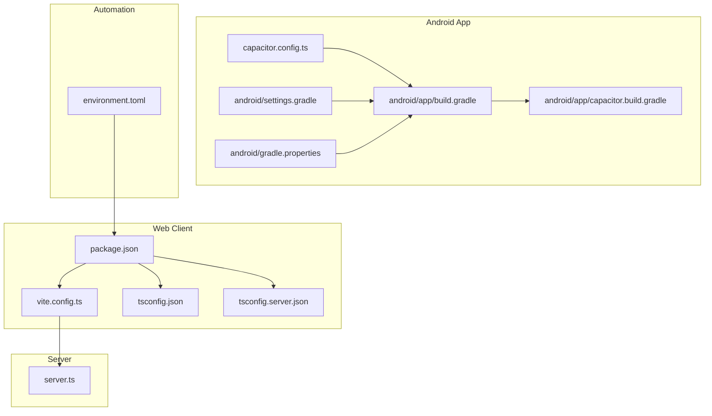
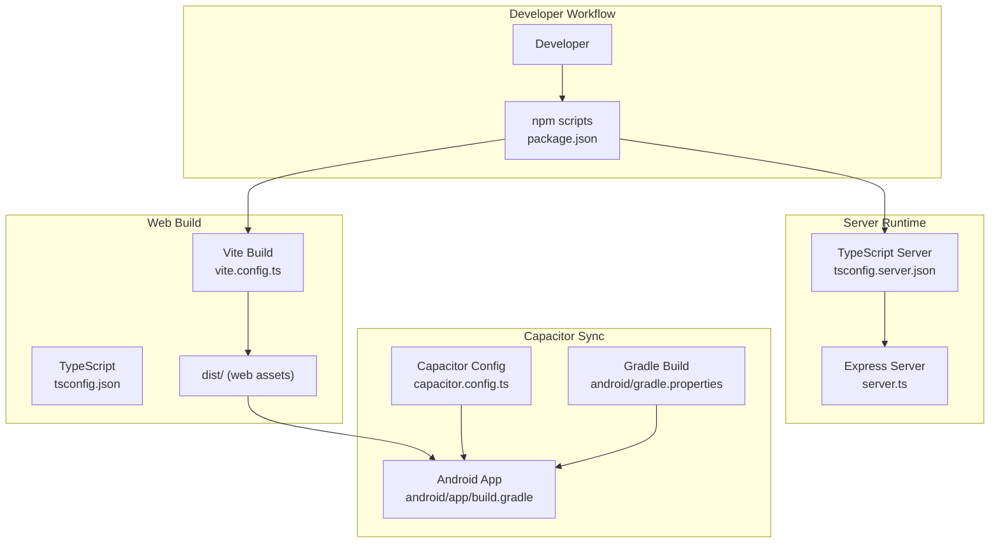
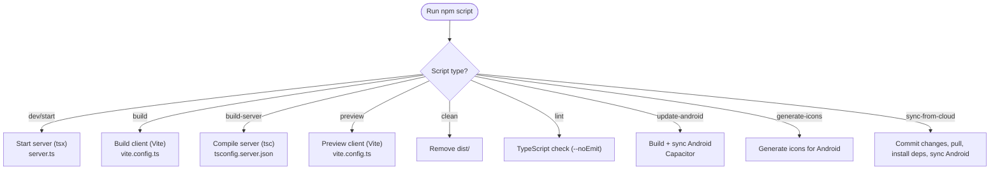
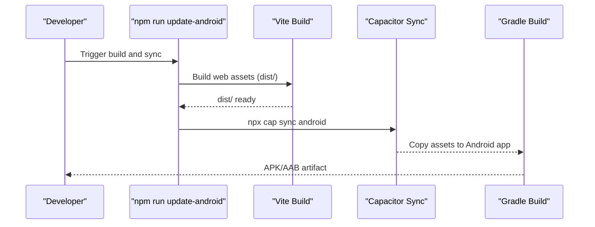
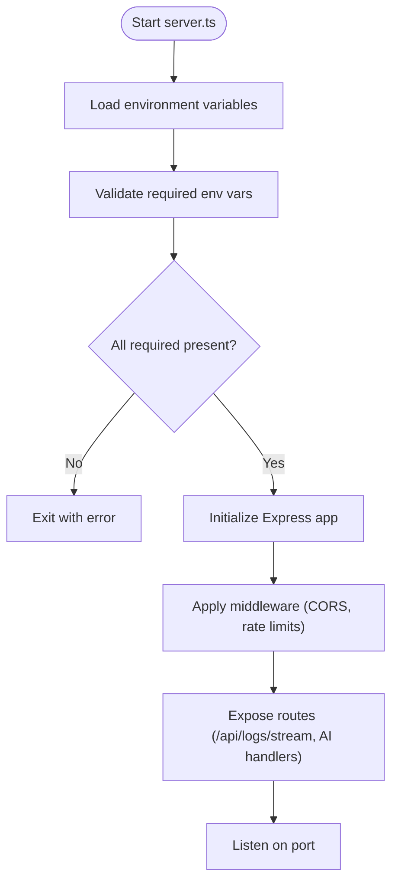
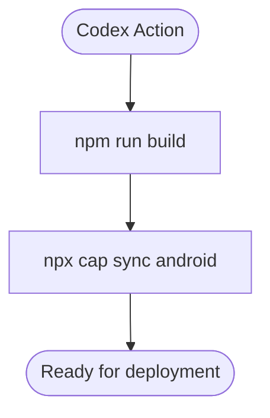
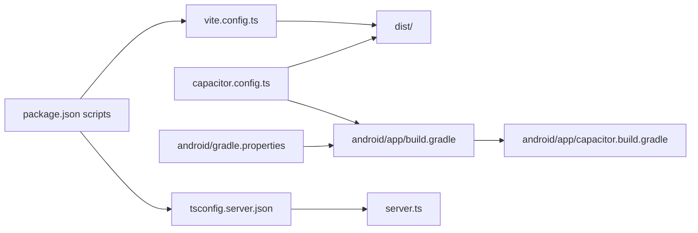

# Build and Deployment

<cite>
**Referenced Files in This Document**
- [package.json](file://package.json)
- [vite.config.ts](file://vite.config.ts)
- [tsconfig.json](file://tsconfig.json)
- [tsconfig.server.json](file://tsconfig.server.json)
- [capacitor.config.ts](file://capacitor.config.ts)
- [android/app/build.gradle](file://android/app/build.gradle)
- [android/app/capacitor.build.gradle](file://android/app/capacitor.build.gradle)
- [android/gradle.properties](file://android/gradle.properties)
- [android/settings.gradle](file://android/settings.gradle)
- [server.ts](file://server.ts)
- [.codex/environments/environment.toml](file://.codex/environments/environment.toml)
</cite>

## Table of Contents
1. [Introduction](#introduction)
2. [Project Structure](#project-structure)
3. [Core Components](#core-components)
4. [Architecture Overview](#architecture-overview)
5. [Detailed Component Analysis](#detailed-component-analysis)
6. [Dependency Analysis](#dependency-analysis)
7. [Performance Considerations](#performance-considerations)
8. [Troubleshooting Guide](#troubleshooting-guide)
9. [Conclusion](#conclusion)
10. [Appendices](#appendices)

## Introduction
This document explains the complete build and deployment process for the project, covering:
- Development setup: environment configuration, dependency management, development scripts, and debugging tools
- Production builds for web and Android using Vite and Capacitor
- Android app building with Gradle, signing configuration, and deployment procedures
- Server-side build and runtime behavior
- CI/CD pipeline setup and automated deployment workflows
- Troubleshooting, performance optimization, and production monitoring

## Project Structure
The project combines a React-based web application built with Vite and TypeScript, a Node.js server, and a Capacitor-managed Android app. Key build and configuration files are organized as follows:
- Web client: Vite configuration, TypeScript compiler options, and React plugin
- Android app: Gradle build scripts, Capacitor integration, and Android-specific settings
- Server: TypeScript compilation for Node.js and Express runtime
- Environment automation: Codex environment definition for automated actions

**Diagram sources**
- [vite.config.ts:1-28](file://vite.config.ts#L1-L28)
- [tsconfig.json:1-27](file://tsconfig.json#L1-L27)
- [tsconfig.server.json:1-15](file://tsconfig.server.json#L1-L15)
- [package.json:1-70](file://package.json#L1-L70)
- [capacitor.config.ts:1-26](file://capacitor.config.ts#L1-L26)
- [android/app/build.gradle:1-55](file://android/app/build.gradle#L1-L55)
- [android/app/capacitor.build.gradle:1-23](file://android/app/capacitor.build.gradle#L1-L23)
- [android/settings.gradle:1-5](file://android/settings.gradle#L1-L5)
- [android/gradle.properties:1-23](file://android/gradle.properties#L1-L23)
- [server.ts:1-1454](file://server.ts#L1-L1454)
- [.codex/environments/environment.toml:1-15](file://.codex/environments/environment.toml#L1-L15)

**Section sources**
- [package.json:1-70](file://package.json#L1-L70)
- [vite.config.ts:1-28](file://vite.config.ts#L1-L28)
- [tsconfig.json:1-27](file://tsconfig.json#L1-L27)
- [tsconfig.server.json:1-15](file://tsconfig.server.json#L1-L15)
- [capacitor.config.ts:1-26](file://capacitor.config.ts#L1-L26)
- [android/app/build.gradle:1-55](file://android/app/build.gradle#L1-L55)
- [android/app/capacitor.build.gradle:1-23](file://android/app/capacitor.build.gradle#L1-L23)
- [android/gradle.properties:1-23](file://android/gradle.properties#L1-L23)
- [android/settings.gradle:1-5](file://android/settings.gradle#L1-L5)
- [server.ts:1-1454](file://server.ts#L1-L1454)
- [.codex/environments/environment.toml:1-15](file://.codex/environments/environment.toml#L1-L15)

## Core Components
- Web client build and dev server powered by Vite with React and TailwindCSS plugins
- TypeScript configuration for both browser and server targets
- Capacitor configuration linking the web build to the Android app
- Android Gradle build with Capacitor integration and optional Firebase plugin
- Node.js server with Express, rate limiting, logging, and AI processing

Key build scripts and their roles:
- Development: run the server and client concurrently for rapid iteration
- Production builds: compile the server and bundle the web app
- Android sync: rebuild the web assets and synchronize with Capacitor

**Section sources**
- [package.json:6-18](file://package.json#L6-L18)
- [vite.config.ts:6-27](file://vite.config.ts#L6-L27)
- [tsconfig.json:1-27](file://tsconfig.json#L1-L27)
- [tsconfig.server.json:1-15](file://tsconfig.server.json#L1-L15)
- [capacitor.config.ts:3-23](file://capacitor.config.ts#L3-L23)
- [android/app/build.gradle:3-25](file://android/app/build.gradle#L3-L25)
- [server.ts:24-35](file://server.ts#L24-L35)

## Architecture Overview
The build and deployment pipeline integrates three major components:
- Web client: Vite compiles TypeScript/JSX and bundles assets; TailwindCSS handles styling
- Android app: Capacitor embeds the web build into an Android shell; Gradle orchestrates compilation and packaging
- Server: TypeScript compiled to Node-compatible modules; Express serves endpoints and runs the Telegram bot

**Diagram sources**
- [package.json:6-18](file://package.json#L6-L18)
- [vite.config.ts:6-27](file://vite.config.ts#L6-L27)
- [tsconfig.json:1-27](file://tsconfig.json#L1-L27)
- [tsconfig.server.json:1-15](file://tsconfig.server.json#L1-L15)
- [capacitor.config.ts:3-23](file://capacitor.config.ts#L3-L23)
- [android/app/build.gradle:3-25](file://android/app/build.gradle#L3-L25)
- [android/gradle.properties:12-22](file://android/gradle.properties#L12-L22)
- [server.ts:1-17](file://server.ts#L1-L17)

## Detailed Component Analysis

### Web Build and Development Setup
- Vite configuration enables React and TailwindCSS plugins, sets base path for assets, injects environment variables, and disables HMR for specific scenarios
- TypeScript configuration supports JSX, DOM APIs, bundler module resolution, and path aliases
- Scripts orchestrate development, building, previewing, cleaning, linting, and Capacitor synchronization

**Diagram sources**
- [package.json:6-18](file://package.json#L6-L18)
- [vite.config.ts:6-27](file://vite.config.ts#L6-L27)
- [tsconfig.server.json:1-15](file://tsconfig.server.json#L1-L15)

**Section sources**
- [vite.config.ts:6-27](file://vite.config.ts#L6-L27)
- [tsconfig.json:1-27](file://tsconfig.json#L1-L27)
- [package.json:6-18](file://package.json#L6-L18)

### Android App Building with Gradle and Capacitor
- Capacitor configuration defines the Android app ID, app name, web directory, server scheme, and plugin settings
- Android Gradle build sets SDK versions, build types, minification/proguard rules, and applies Capacitor’s generated build script
- Optional Google Services plugin is conditionally applied if the services file is present
- Gradle properties set JVM args and AndroidX usage

**Diagram sources**
- [package.json:15-15](file://package.json#L15-L15)
- [capacitor.config.ts:3-23](file://capacitor.config.ts#L3-L23)
- [android/app/build.gradle:3-25](file://android/app/build.gradle#L3-L25)
- [android/app/capacitor.build.gradle:1-23](file://android/app/capacitor.build.gradle#L1-L23)
- [android/gradle.properties:12-22](file://android/gradle.properties#L12-L22)

**Section sources**
- [capacitor.config.ts:3-23](file://capacitor.config.ts#L3-L23)
- [android/app/build.gradle:3-25](file://android/app/build.gradle#L3-L25)
- [android/app/capacitor.build.gradle:1-23](file://android/app/capacitor.build.gradle#L1-L23)
- [android/gradle.properties:12-22](file://android/gradle.properties#L12-L22)
- [android/settings.gradle:1-5](file://android/settings.gradle#L1-L5)

### Server Build and Runtime
- TypeScript server configuration targets Node-compatible modules and emits to the dist directory
- The server initializes Express, loads environment variables, applies CORS and rate limiting, and exposes endpoints for logs streaming and AI processing
- Environment validation ensures required variables are present; warnings are issued for optional keys

**Diagram sources**
- [server.ts:17-35](file://server.ts#L17-L35)
- [server.ts:44-72](file://server.ts#L44-L72)
- [server.ts:342-352](file://server.ts#L342-L352)
- [tsconfig.server.json:1-15](file://tsconfig.server.json#L1-L15)

**Section sources**
- [server.ts:17-35](file://server.ts#L17-L35)
- [server.ts:44-72](file://server.ts#L44-L72)
- [server.ts:342-352](file://server.ts#L342-L352)
- [tsconfig.server.json:1-15](file://tsconfig.server.json#L1-L15)

### CI/CD Pipeline and Automated Deployment
- Codex environment defines an automated action that builds the project and synchronizes the Android app with Capacitor
- The action executes two commands: a combined build and Capacitor sync

**Diagram sources**
- [.codex/environments/environment.toml:8-14](file://.codex/environments/environment.toml#L8-L14)

**Section sources**
- [.codex/environments/environment.toml:1-15](file://.codex/environments/environment.toml#L1-L15)

## Dependency Analysis
The build system relies on the following relationships:
- package.json scripts depend on Vite, TypeScript, and Capacitor CLI
- Capacitor configuration depends on the Vite-built dist directory
- Android Gradle build depends on Capacitor’s generated scripts and optional Google Services plugin
- Server build depends on TypeScript configuration and Node-compatible modules

**Diagram sources**
- [package.json:6-18](file://package.json#L6-L18)
- [vite.config.ts:6-27](file://vite.config.ts#L6-L27)
- [tsconfig.server.json:1-15](file://tsconfig.server.json#L1-L15)
- [capacitor.config.ts:3-23](file://capacitor.config.ts#L3-L23)
- [android/app/build.gradle:3-25](file://android/app/build.gradle#L3-L25)
- [android/app/capacitor.build.gradle:1-23](file://android/app/capacitor.build.gradle#L1-L23)
- [android/gradle.properties:12-22](file://android/gradle.properties#L12-L22)
- [server.ts:1-17](file://server.ts#L1-L17)

**Section sources**
- [package.json:6-18](file://package.json#L6-L18)
- [vite.config.ts:6-27](file://vite.config.ts#L6-L27)
- [tsconfig.server.json:1-15](file://tsconfig.server.json#L1-L15)
- [capacitor.config.ts:3-23](file://capacitor.config.ts#L3-L23)
- [android/app/build.gradle:3-25](file://android/app/build.gradle#L3-L25)
- [android/app/capacitor.build.gradle:1-23](file://android/app/capacitor.build.gradle#L1-L23)
- [android/gradle.properties:12-22](file://android/gradle.properties#L12-L22)
- [server.ts:1-17](file://server.ts#L1-L17)

## Performance Considerations
- Web build
  - Disable HMR in development when editing agents to avoid flickering during edits
  - Keep asset sizes reasonable; consider lazy loading and code splitting for large components
  - Use TailwindCSS purge and minification in production builds
- Android build
  - Enable ProGuard rules for release builds to reduce APK size
  - Use Android App Bundles (AAB) for distribution to optimize app size
  - Configure appropriate JVM arguments in Gradle properties for memory-constrained environments
- Server
  - Apply rate limiting to protect endpoints from abuse
  - Stream logs via Server-Sent Events for real-time monitoring without heavy polling
  - Cache frequently accessed data to reduce filesystem I/O

[No sources needed since this section provides general guidance]

## Troubleshooting Guide
- Missing environment variables
  - Required server variables are validated at startup; ensure all required keys are present
  - Optional keys (e.g., AI provider keys) will produce warnings if missing
- Android sync failures
  - Ensure the web build completes successfully before syncing with Capacitor
  - Verify Capacitor configuration points to the correct web directory
- Gradle build issues
  - Confirm Android SDK and JDK compatibility; Capacitor requires Java 17 compatibility
  - Review Gradle properties for memory and AndroidX settings
- Server startup errors
  - Check logs endpoint for real-time diagnostics
  - Validate rate limiter thresholds and CORS configuration
- CI/CD automation
  - Confirm Codex action runs the correct sequence of build and sync commands

**Section sources**
- [server.ts:24-35](file://server.ts#L24-L35)
- [server.ts:342-352](file://server.ts#L342-L352)
- [capacitor.config.ts:3-23](file://capacitor.config.ts#L3-L23)
- [android/app/build.gradle:3-25](file://android/app/build.gradle#L3-L25)
- [android/app/capacitor.build.gradle:4-7](file://android/app/capacitor.build.gradle#L4-L7)
- [android/gradle.properties:12-22](file://android/gradle.properties#L12-L22)
- [.codex/environments/environment.toml:8-14](file://.codex/environments/environment.toml#L8-L14)

## Conclusion
The project’s build and deployment pipeline integrates Vite for the web client, Capacitor for Android packaging, and a Node.js server with Express. By leveraging the provided scripts, configurations, and automation, teams can reliably develop, build, and deploy both web and Android variants while maintaining server-side operational visibility and protection through rate limiting and structured logging.

[No sources needed since this section summarizes without analyzing specific files]

## Appendices
- Environment variables
  - Server-side variables include keys for Telegram, AI providers, and optional Gemini key
  - Vite injects selected environment variables into the client build
- Asset optimization
  - Use Vite’s built-in minification and TailwindCSS purging in production
  - Consider image optimization and CDN caching for static assets
- Signing and distribution
  - Configure Android signing in Gradle for release builds
  - Use Android App Bundles for optimized distribution

[No sources needed since this section provides general guidance]