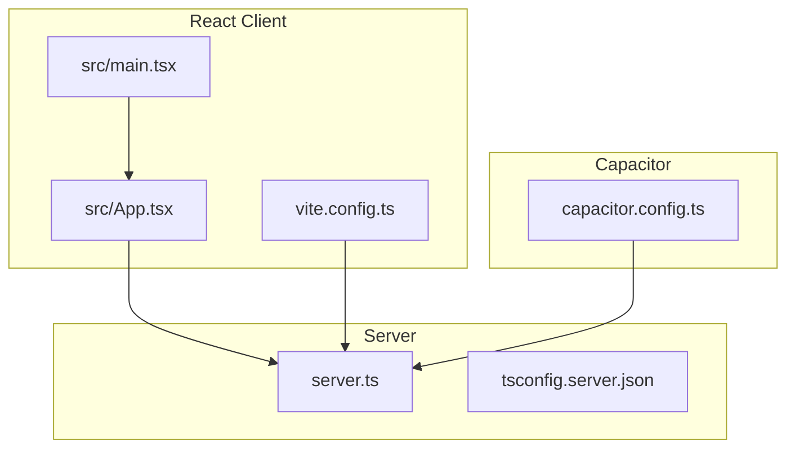
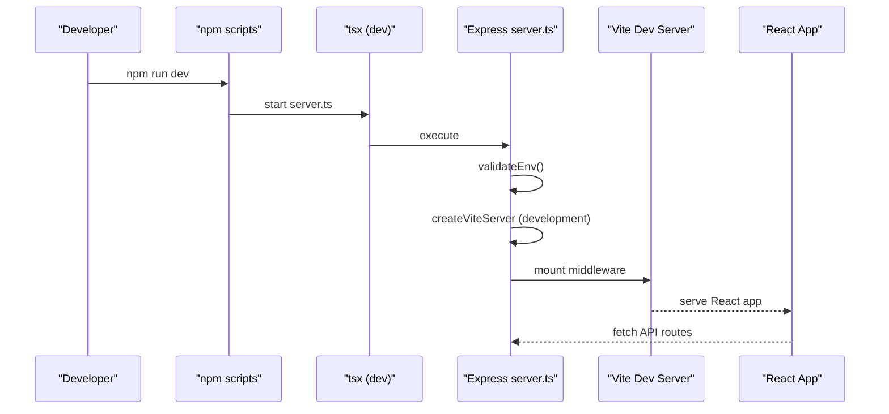
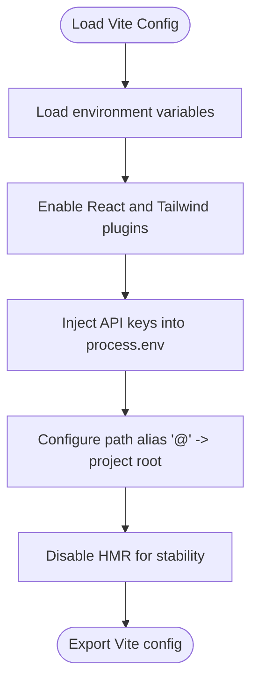
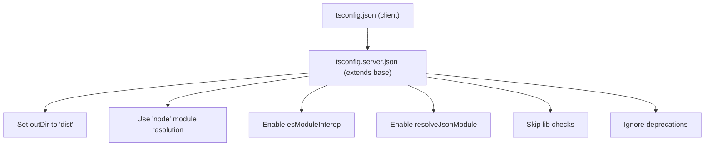
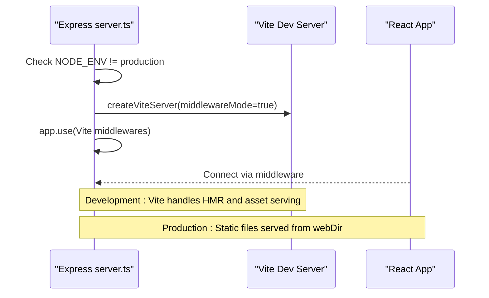
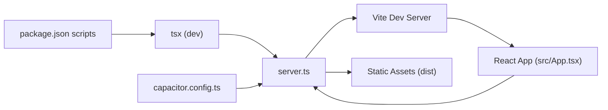

# Development Setup

<cite>
**Referenced Files in This Document**
- [README.md](file://README.md)
- [package.json](file://package.json)
- [vite.config.ts](file://vite.config.ts)
- [tsconfig.json](file://tsconfig.json)
- [tsconfig.server.json](file://tsconfig.server.json)
- [capacitor.config.ts](file://capacitor.config.ts)
- [server.ts](file://server.ts)
- [src/main.tsx](file://src/main.tsx)
- [src/App.tsx](file://src/App.tsx)
- [src/services/standaloneService.ts](file://src/services/standaloneService.ts)
- [src/serverUtils.ts](file://src/serverUtils.ts)
- [src\vite-env.d.ts](file://src\vite-env.d.ts)
</cite>

## Table of Contents
1. [Introduction](#introduction)
2. [Project Structure](#project-structure)
3. [Core Components](#core-components)
4. [Architecture Overview](#architecture-overview)
5. [Detailed Component Analysis](#detailed-component-analysis)
6. [Dependency Analysis](#dependency-analysis)
7. [Performance Considerations](#performance-considerations)
8. [Troubleshooting Guide](#troubleshooting-guide)
9. [Conclusion](#conclusion)
10. [Appendices](#appendices)

## Introduction
This document explains how to set up and develop the project locally. It covers prerequisites, environment variables, dependency management, development scripts, Vite configuration for React, TypeScript configuration for client and server, and debugging tools integration. It also describes how the development server integrates with the React client and how Capacitor is configured for Android builds.

## Project Structure
The project is a hybrid React application with a Node.js/Express backend and an Android app built with Capacitor. The React client runs in development via Vite and communicates with the Express server. Capacitor configures how the Android app serves the web assets and handles runtime features like the keyboard and HTTP plugin.

**Diagram sources**
- [src/main.tsx:1-11](file://src/main.tsx#L1-L11)
- [src/App.tsx:168-170](file://src/App.tsx#L168-L170)
- [vite.config.ts:1-28](file://vite.config.ts#L1-L28)
- [server.ts:1399-1418](file://server.ts#L1399-L1418)
- [capacitor.config.ts:1-26](file://capacitor.config.ts#L1-L26)

**Section sources**
- [README.md:11-25](file://README.md#L11-L25)
- [package.json:1-70](file://package.json#L1-L70)
- [vite.config.ts:1-28](file://vite.config.ts#L1-L28)
- [tsconfig.json:1-27](file://tsconfig.json#L1-L27)
- [tsconfig.server.json:1-15](file://tsconfig.server.json#L1-L15)
- [capacitor.config.ts:1-26](file://capacitor.config.ts#L1-L26)
- [server.ts:1399-1418](file://server.ts#L1399-L1418)

## Core Components
- Development scripts: npm scripts orchestrate building the client, building the server, running the dev server, previewing the client, cleaning artifacts, linting, syncing Android assets, generating icons, and updating the Android platform.
- Vite configuration: React plugin, Tailwind integration, path aliases, base path for assets, environment variable injection, and HMR behavior.
- TypeScript configuration: Shared client config and server-specific overrides for module resolution and output.
- Server integration: Express server conditionally mounts Vite middleware in development and serves static files in production.
- Capacitor configuration: Web directory, Android scheme, navigation allowances, mixed content, web debugging, and plugin settings.

**Section sources**
- [package.json:6-18](file://package.json#L6-L18)
- [vite.config.ts:6-27](file://vite.config.ts#L6-L27)
- [tsconfig.json:1-27](file://tsconfig.json#L1-L27)
- [tsconfig.server.json:1-15](file://tsconfig.server.json#L1-L15)
- [server.ts:1399-1418](file://server.ts#L1399-L1418)
- [capacitor.config.ts:3-23](file://capacitor.config.ts#L3-L23)

## Architecture Overview
The development workflow starts the Express server with a script that invokes a TypeScript runner. In development, the server injects Vite middleware so the React app runs with fast refresh. In production, the server serves prebuilt static assets from the configured web directory.

**Diagram sources**
- [package.json:7-7](file://package.json#L7-L7)
- [server.ts:17-35](file://server.ts#L17-L35)
- [server.ts:1399-1405](file://server.ts#L1399-L1405)

**Section sources**
- [package.json:6-18](file://package.json#L6-L18)
- [server.ts:17-35](file://server.ts#L17-L35)
- [server.ts:1399-1405](file://server.ts#L1399-L1405)

## Detailed Component Analysis

### Prerequisites and Environment Setup
- Node.js: The project requires Node.js to run the development server and build scripts. See the README’s prerequisites section for guidance.
- Environment variables: The server validates required variables at startup and warns if optional AI keys are missing. Configure the Telegram bot token and optional AI provider keys in the UI or via environment variables.
- Local development database: The server persists data to local files and JSON storage. No external database is required for local development.

**Section sources**
- [README.md:13-25](file://README.md#L13-L25)
- [server.ts:24-33](file://server.ts#L24-L33)
- [server.ts:74-82](file://server.ts#L74-L82)

### Dependency Management and Peer Dependencies
- npm scripts orchestrate installation, building, and Android synchronization. The sync script includes a legacy peer dependencies flag to accommodate transitive dependency mismatches.
- The project uses modern tooling with Vite, React, and TypeScript. Peer dependency warnings are mitigated by the legacy peer deps flag in the sync script.

**Section sources**
- [package.json:17-17](file://package.json#L17-L17)

### Development Scripts
- dev: Starts the server using a TypeScript runner. The server conditionally enables Vite middleware in non-production environments.
- start: Alias to run the server in production-like mode.
- build-server: Compiles the server using the server TypeScript configuration.
- build-client: Builds the React client with Vite.
- build: Runs both server and client builds sequentially.
- preview: Serves the built client locally for preview.
- clean: Removes the distribution directory.
- lint: Type-checks without emitting JS.
- update-android: Builds the project and synchronizes the Android platform.
- generate-icons: Generates Capacitor icons for Android.
- sync-from-cloud: Automates adding changes, committing, pulling, installing with legacy peer deps, and updating Android.

**Section sources**
- [package.json:6-18](file://package.json#L6-L18)

### Vite Configuration for React Development
- Plugins: React and Tailwind CSS integrations are enabled.
- Base path: Relative base path ensures assets resolve correctly in the Android app.
- Environment injection: API keys are injected into the client at build time from environment variables.
- Aliases: Path alias resolves imports prefixed with "@" to the project root.
- HMR: HMR is disabled per configuration comments to avoid flickering during agent edits.

**Diagram sources**
- [vite.config.ts:6-27](file://vite.config.ts#L6-L27)

**Section sources**
- [vite.config.ts:1-28](file://vite.config.ts#L1-L28)

### TypeScript Configuration
- Client (shared): Targets ES2022, JSX with React, DOM libraries, bundler module resolution, path aliases, and no emit for type checks.
- Server: Extends the client config, sets output directory, Node module resolution, interop, JSON module support, and ignores deprecations for compatibility.

**Diagram sources**
- [tsconfig.json:1-27](file://tsconfig.json#L1-L27)
- [tsconfig.server.json:1-15](file://tsconfig.server.json#L1-L15)

**Section sources**
- [tsconfig.json:1-27](file://tsconfig.json#L1-L27)
- [tsconfig.server.json:1-15](file://tsconfig.server.json#L1-L15)

### Server Integration and Hot Reloading
- Development middleware: In non-production mode, the server creates a Vite server and mounts its middleware, enabling fast refresh for the React app.
- Production static serving: In production, the server serves the built client from the configured web directory and falls back to the index page for SPA routing.

**Diagram sources**
- [server.ts:1399-1415](file://server.ts#L1399-L1415)

**Section sources**
- [server.ts:1399-1415](file://server.ts#L1399-L1415)

### Capacitor Configuration for Android
- Web directory: Points to the built client directory for Android packaging.
- Server: Android scheme set to HTTPS, allows navigation to any origin.
- Android: Mixed content allowed and web contents debugging enabled for development.
- Plugins: HTTP plugin enabled and keyboard resize mode configured.

**Section sources**
- [capacitor.config.ts:3-23](file://capacitor.config.ts#L3-L23)

### Environment Variables and Secrets
- Required: Telegram bot token is validated at startup.
- Optional: AI provider keys are read from environment variables or stored in the UI. The server logs warnings if keys are missing.
- Client-side keys: Injected into the build via Vite and exposed as process environment variables.

**Section sources**
- [server.ts:24-33](file://server.ts#L24-L33)
- [vite.config.ts:11-15](file://vite.config.ts#L11-L15)

### Debugging Tools Integration
- Logging: The server writes logs to a file and streams them via a server-sent events endpoint for the web UI. A file logger utility is provided.
- Android debugging: Web debugging is enabled in the Capacitor configuration for Android.
- Client-side logging: The React app supports SSE-based live logs in browsers and polling-based logs on Android.

**Section sources**
- [src/serverUtils.ts:1-22](file://src/serverUtils.ts#L1-L22)
- [server.ts:342-352](file://server.ts#L342-L352)
- [capacitor.config.ts:11-14](file://capacitor.config.ts#L11-L14)
- [src/App.tsx:651-698](file://src/App.tsx#L651-L698)

## Dependency Analysis
The project’s development stack is centered around Vite, React, Express, and Capacitor. The server script invokes the TypeScript runner to start the Express app, which conditionally mounts Vite middleware in development. The React app consumes Capacitor APIs and communicates with the server for configuration and content.

**Diagram sources**
- [package.json:6-18](file://package.json#L6-L18)
- [server.ts:1399-1415](file://server.ts#L1399-L1415)
- [capacitor.config.ts:3-10](file://capacitor.config.ts#L3-L10)

**Section sources**
- [package.json:6-18](file://package.json#L6-L18)
- [server.ts:1399-1415](file://server.ts#L1399-L1415)
- [capacitor.config.ts:3-10](file://capacitor.config.ts#L3-L10)

## Performance Considerations
- HMR disabled in development: Disabling HMR prevents flickering during agent edits, improving stability during rapid content changes.
- Asset base path: Using a relative base path ensures assets resolve correctly in both development and Android packaging scenarios.
- Module resolution: Node-style resolution for the server and bundler-style for the client improves compatibility and build performance.

[No sources needed since this section provides general guidance]

## Troubleshooting Guide
- Missing Telegram bot token: The server validates required environment variables and throws if missing. Set the token via environment variables or configure it in the UI.
- Missing AI keys: The server logs warnings if optional AI keys are absent. Configure keys in the UI or set environment variables.
- Android web debugging: Enabled in the Capacitor config to aid debugging of the embedded WebView.
- Logs streaming: Use the server-sent events endpoint for real-time logs in browsers and polling fallback on Android.

**Section sources**
- [server.ts:24-33](file://server.ts#L24-L33)
- [server.ts:342-352](file://server.ts#L342-L352)
- [capacitor.config.ts:11-14](file://capacitor.config.ts#L11-L14)

## Conclusion
The project provides a streamlined development experience with Vite-powered React, a TypeScript-enabled Express server, and Capacitor-based Android packaging. Environment variables are validated at startup, logs are persisted and streamed, and the configuration supports both development and production workflows.

[No sources needed since this section summarizes without analyzing specific files]

## Appendices

### Appendix A: Running Locally
- Install dependencies and run the development server using the documented script.
- Configure environment variables for Telegram and optional AI providers.
- Use the UI to manage API keys and server configuration.

**Section sources**
- [README.md:16-24](file://README.md#L16-L24)

### Appendix B: Client Entry Point
- The React app initializes at the entry point and renders the main application component.

**Section sources**
- [src/main.tsx:1-11](file://src/main.tsx#L1-L11)

### Appendix C: Client Types and Aliases
- Path aliases simplify imports in the client codebase.
- Type definitions for Vite client are included.

**Section sources**
- [tsconfig.json:18-22](file://tsconfig.json#L18-L22)
- [src\vite-env.d.ts:1-2](file://src\vite-env.d.ts#L1-L2)