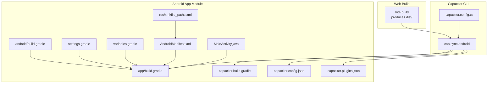
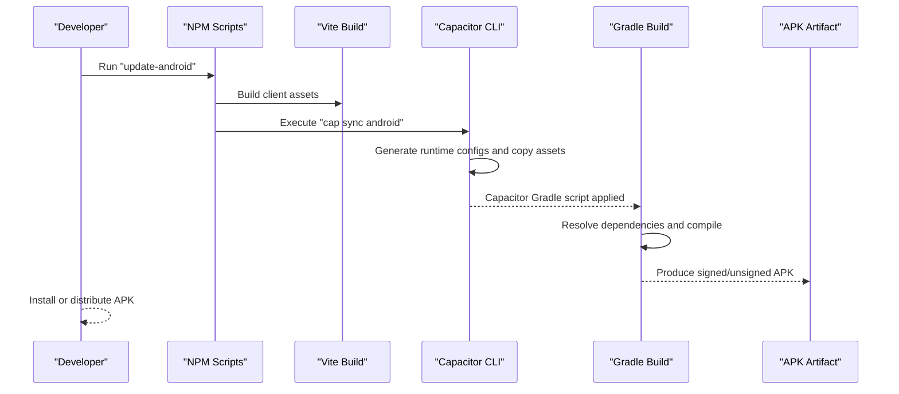
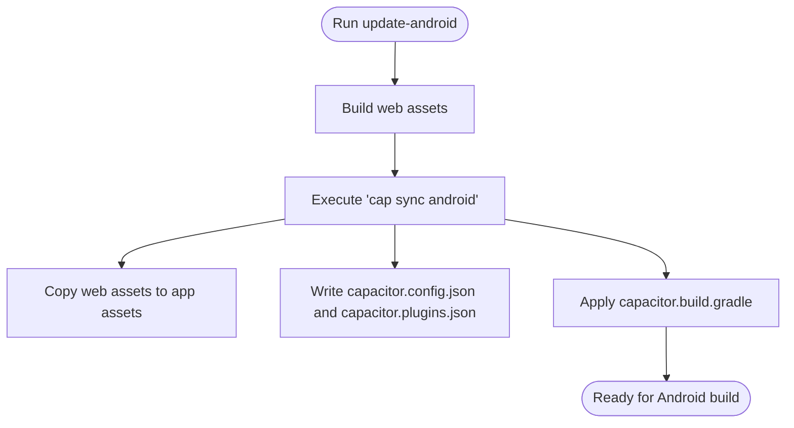
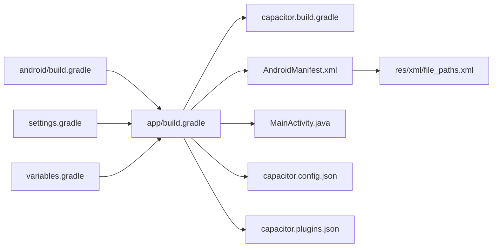
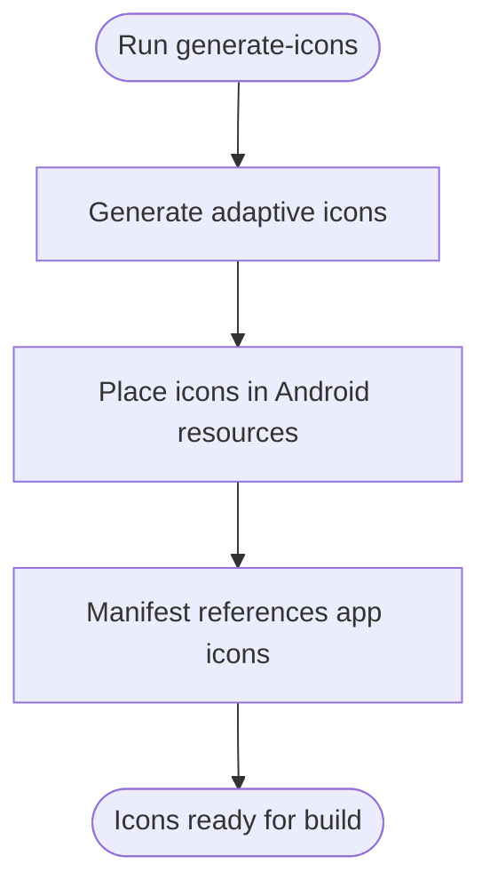
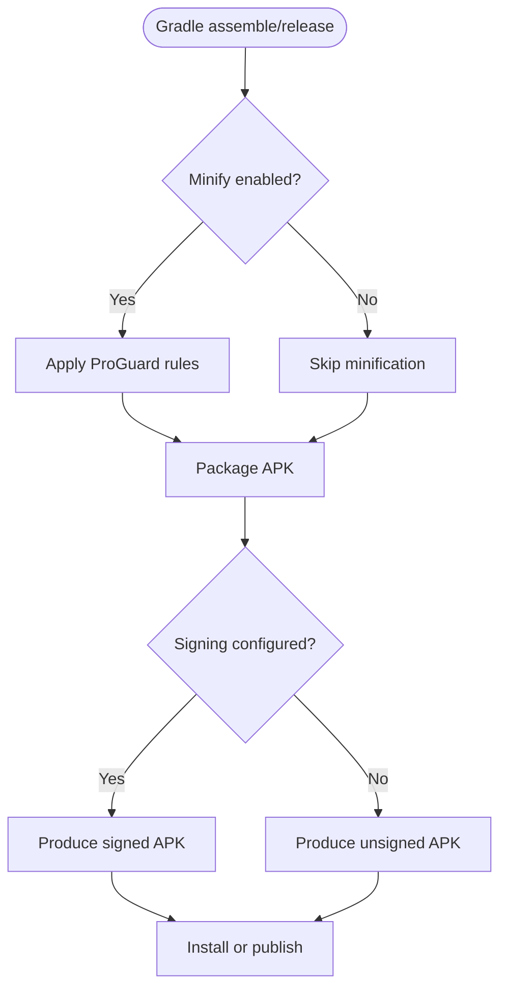
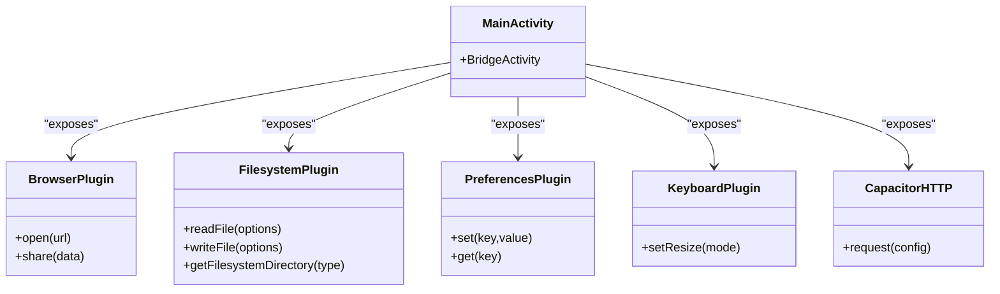
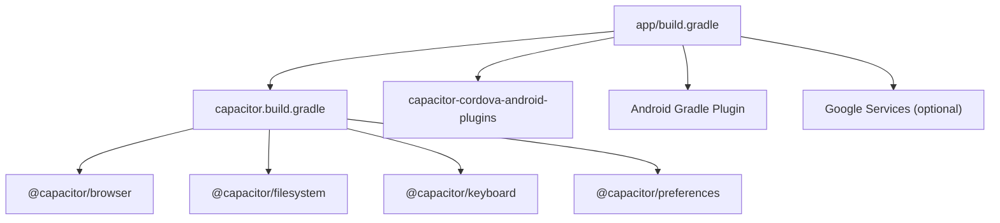

# Android Integration

<cite>
**Referenced Files in This Document**
- [capacitor.config.ts](file://capacitor.config.ts)
- [package.json](file://package.json)
- [android/build.gradle](file://android/build.gradle)
- [android/settings.gradle](file://android/settings.gradle)
- [android/variables.gradle](file://android/variables.gradle)
- [android/app/build.gradle](file://android/app/build.gradle)
- [android/app/capacitor.build.gradle](file://android/app/capacitor.build.gradle)
- [android/app/proguard-rules.pro](file://android/app/proguard-rules.pro)
- [android/app/src/main/AndroidManifest.xml](file://android/app/src/main/AndroidManifest.xml)
- [android/app/src/main/java/com/newsbot/manager/MainActivity.java](file://android/app/src/main/java/com/newsbot/manager/MainActivity.java)
- [android/app/src/main/res/values/strings.xml](file://android/app/src/main/res/values/strings.xml)
- [android/app/src/main/res/xml/file_paths.xml](file://android/app/src/main/res/xml/file_paths.xml)
- [android/app/src/main/assets/capacitor.config.json](file://android/app/src/main/assets/capacitor.config.json)
- [android/app/src/main/assets/capacitor.plugins.json](file://android/app/src/main/assets/capacitor.plugins.json)
- [android/capacitor-cordova-android-plugins/cordova.variables.gradle](file://android/capacitor-cordova-android-plugins/cordova.variables.gradle)
</cite>

## Table of Contents
1. [Introduction](#introduction)
2. [Project Structure](#project-structure)
3. [Core Components](#core-components)
4. [Architecture Overview](#architecture-overview)
5. [Detailed Component Analysis](#detailed-component-analysis)
6. [Dependency Analysis](#dependency-analysis)
7. [Performance Considerations](#performance-considerations)
8. [Troubleshooting Guide](#troubleshooting-guide)
9. [Conclusion](#conclusion)
10. [Appendices](#appendices)

## Introduction
This document explains how the Android app integrates with the web assets built by the Capacitor toolchain. It covers the Capacitor sync process using the update-android script, the Android build configuration (Gradle, manifest, and plugins), asset generation for icons and splash screens, build outputs (APK generation and signing), and the integration between web assets and native Android components such as file system access and HTTP request handling. It also includes troubleshooting steps for common Android build issues and deployment preparation guidance.

## Project Structure
The Android integration centers around the Android app module and Capacitor configuration. The web assets are produced by the Vite build and placed under the configured web directory. Capacitor synchronizes these assets into the Android app and wires native plugins.

**Diagram sources**
- [capacitor.config.ts:1-26](file://capacitor.config.ts#L1-L26)
- [package.json:15-16](file://package.json#L15-L16)
- [android/app/build.gradle:1-55](file://android/app/build.gradle#L1-L55)
- [android/app/capacitor.build.gradle:1-23](file://android/app/capacitor.build.gradle#L1-L23)
- [android/app/src/main/assets/capacitor.config.json:1-24](file://android/app/src/main/assets/capacitor.config.json#L1-L24)
- [android/app/src/main/assets/capacitor.plugins.json:1-19](file://android/app/src/main/assets/capacitor.plugins.json#L1-L19)
- [android/app/src/main/AndroidManifest.xml:1-46](file://android/app/src/main/AndroidManifest.xml#L1-L46)
- [android/app/src/main/java/com/newsbot/manager/MainActivity.java:1-6](file://android/app/src/main/java/com/newsbot/manager/MainActivity.java#L1-L6)
- [android/app/src/main/res/xml/file_paths.xml:1-5](file://android/app/src/main/res/xml/file_paths.xml#L1-L5)
- [android/build.gradle:1-30](file://android/build.gradle#L1-L30)
- [android/settings.gradle:1-5](file://android/settings.gradle#L1-L5)
- [android/variables.gradle:1-16](file://android/variables.gradle#L1-L16)

**Section sources**
- [capacitor.config.ts:1-26](file://capacitor.config.ts#L1-L26)
- [package.json:15-16](file://package.json#L15-L16)
- [android/app/build.gradle:1-55](file://android/app/build.gradle#L1-L55)
- [android/app/capacitor.build.gradle:1-23](file://android/app/capacitor.build.gradle#L1-L23)
- [android/app/src/main/assets/capacitor.config.json:1-24](file://android/app/src/main/assets/capacitor.config.json#L1-L24)
- [android/app/src/main/assets/capacitor.plugins.json:1-19](file://android/app/src/main/assets/capacitor.plugins.json#L1-L19)
- [android/app/src/main/AndroidManifest.xml:1-46](file://android/app/src/main/AndroidManifest.xml#L1-L46)
- [android/app/src/main/java/com/newsbot/manager/MainActivity.java:1-6](file://android/app/src/main/java/com/newsbot/manager/MainActivity.java#L1-L6)
- [android/app/src/main/res/xml/file_paths.xml:1-5](file://android/app/src/main/res/xml/file_paths.xml#L1-L5)
- [android/build.gradle:1-30](file://android/build.gradle#L1-L30)
- [android/settings.gradle:1-5](file://android/settings.gradle#L1-L5)
- [android/variables.gradle:1-16](file://android/variables.gradle#L1-L16)

## Core Components
- Capacitor configuration defines the app ID, app name, web directory, server scheme and navigation allowances, Android-specific flags, and enabled plugins.
- The update-android script orchestrates building the web assets and running Capacitor sync for Android.
- Android Gradle configuration sets SDK versions, packaging options, dependencies, and applies Capacitor’s generated Gradle script.
- Android manifest declares application metadata, activity, provider, and permissions.
- Generated assets inside the Android app include the Capacitor runtime configuration and plugin registry.
- Cordova plugin integration variables are managed via a generated Gradle file.

**Section sources**
- [capacitor.config.ts:3-23](file://capacitor.config.ts#L3-L23)
- [package.json:15-16](file://package.json#L15-L16)
- [android/app/build.gradle:3-45](file://android/app/build.gradle#L3-L45)
- [android/app/src/main/AndroidManifest.xml:4-45](file://android/app/src/main/AndroidManifest.xml#L4-L45)
- [android/app/src/main/assets/capacitor.config.json:1-24](file://android/app/src/main/assets/capacitor.config.json#L1-L24)
- [android/app/src/main/assets/capacitor.plugins.json:1-19](file://android/app/src/main/assets/capacitor.plugins.json#L1-L19)
- [android/capacitor-cordova-android-plugins/cordova.variables.gradle:1-7](file://android/capacitor-cordova-android-plugins/cordova.variables.gradle#L1-L7)

## Architecture Overview
The Android integration follows a deterministic pipeline:
- Web assets are built into the configured web directory.
- Capacitor sync copies and transforms web assets into the Android app’s assets folder and generates the Capacitor runtime configuration.
- Native dependencies and plugin wiring are applied via Gradle and Capacitor’s generated Gradle script.
- The Android app launches MainActivity, which hosts the Capacitor Bridge to serve web content and expose native APIs.

**Diagram sources**
- [package.json:15-16](file://package.json#L15-L16)
- [capacitor.config.ts:6](file://capacitor.config.ts#L6)
- [android/app/capacitor.build.gradle:1-23](file://android/app/capacitor.build.gradle#L1-L23)
- [android/app/build.gradle:45-45](file://android/app/build.gradle#L45-L45)

## Detailed Component Analysis

### Capacitor Sync and Automatic Build Coordination
- The update-android script builds the web assets and runs Capacitor sync for Android, ensuring the latest web bundle is embedded in the app.
- Capacitor sync writes the runtime configuration and plugin registry into the Android app’s assets directory.
- The Android app Gradle script is regenerated by Capacitor to include plugin dependencies and apply necessary configurations.

**Diagram sources**
- [package.json:15-16](file://package.json#L15-L16)
- [android/app/capacitor.build.gradle:1-23](file://android/app/capacitor.build.gradle#L1-L23)
- [android/app/src/main/assets/capacitor.config.json:1-24](file://android/app/src/main/assets/capacitor.config.json#L1-L24)
- [android/app/src/main/assets/capacitor.plugins.json:1-19](file://android/app/src/main/assets/capacitor.plugins.json#L1-L19)

**Section sources**
- [package.json:15-16](file://package.json#L15-L16)
- [android/app/capacitor.build.gradle:1-23](file://android/app/capacitor.build.gradle#L1-L23)
- [android/app/src/main/assets/capacitor.config.json:1-24](file://android/app/src/main/assets/capacitor.config.json#L1-L24)
- [android/app/src/main/assets/capacitor.plugins.json:1-19](file://android/app/src/main/assets/capacitor.plugins.json#L1-L19)

### Android Build Configuration (Gradle, Manifest, Plugins)
- Gradle top-level build configures the Android Gradle Plugin and Google Services plugin if present.
- App-level Gradle sets namespace, SDK versions, packaging options, repositories, and dependencies including Capacitor modules and Cordova plugins support.
- Capacitor’s generated Gradle script enforces Java compatibility and adds plugin dependencies.
- Android manifest defines the main activity, FileProvider for secure file sharing, and required permissions.
- Strings resource provides app identifiers and custom URL scheme.
- File paths XML defines external and cache paths for the FileProvider.

**Diagram sources**
- [android/build.gradle:1-30](file://android/build.gradle#L1-L30)
- [android/settings.gradle:1-5](file://android/settings.gradle#L1-L5)
- [android/variables.gradle:1-16](file://android/variables.gradle#L1-L16)
- [android/app/build.gradle:1-55](file://android/app/build.gradle#L1-L55)
- [android/app/capacitor.build.gradle:1-23](file://android/app/capacitor.build.gradle#L1-L23)
- [android/app/src/main/AndroidManifest.xml:1-46](file://android/app/src/main/AndroidManifest.xml#L1-L46)
- [android/app/src/main/res/xml/file_paths.xml:1-5](file://android/app/src/main/res/xml/file_paths.xml#L1-L5)
- [android/app/src/main/java/com/newsbot/manager/MainActivity.java:1-6](file://android/app/src/main/java/com/newsbot/manager/MainActivity.java#L1-L6)
- [android/app/src/main/assets/capacitor.config.json:1-24](file://android/app/src/main/assets/capacitor.config.json#L1-L24)
- [android/app/src/main/assets/capacitor.plugins.json:1-19](file://android/app/src/main/assets/capacitor.plugins.json#L1-L19)

**Section sources**
- [android/build.gradle:1-30](file://android/build.gradle#L1-L30)
- [android/settings.gradle:1-5](file://android/settings.gradle#L1-L5)
- [android/variables.gradle:1-16](file://android/variables.gradle#L1-L16)
- [android/app/build.gradle:1-55](file://android/app/build.gradle#L1-L55)
- [android/app/capacitor.build.gradle:1-23](file://android/app/capacitor.build.gradle#L1-L23)
- [android/app/src/main/AndroidManifest.xml:1-46](file://android/app/src/main/AndroidManifest.xml#L1-L46)
- [android/app/src/main/res/xml/file_paths.xml:1-5](file://android/app/src/main/res/xml/file_paths.xml#L1-L5)
- [android/app/src/main/java/com/newsbot/manager/MainActivity.java:1-6](file://android/app/src/main/java/com/newsbot/manager/MainActivity.java#L1-L6)
- [android/app/src/main/assets/capacitor.config.json:1-24](file://android/app/src/main/assets/capacitor.config.json#L1-L24)
- [android/app/src/main/assets/capacitor.plugins.json:1-19](file://android/app/src/main/assets/capacitor.plugins.json#L1-L19)

### Asset Generation for Icons and Splash Screens
- The generate-icons script uses @capacitor/assets to produce adaptive icon sets for Android.
- These assets are integrated into the Android app resources and referenced by the manifest and launcher drawables.

**Diagram sources**
- [package.json:16-16](file://package.json#L16-L16)

**Section sources**
- [package.json:16-16](file://package.json#L16-L16)

### Build Output, Signing, and Distribution Preparation
- The app Gradle configuration supports release builds with optional minification and ProGuard rules.
- Signing is not configured in the provided Gradle files; signing configuration would typically be added to the app Gradle file for release builds.
- Distribution preparation involves generating an APK artifact suitable for installation or publishing.

**Diagram sources**
- [android/app/build.gradle:19-24](file://android/app/build.gradle#L19-L24)
- [android/app/proguard-rules.pro:1-22](file://android/app/proguard-rules.pro#L1-L22)

**Section sources**
- [android/app/build.gradle:19-24](file://android/app/build.gradle#L19-L24)
- [android/app/proguard-rules.pro:1-22](file://android/app/proguard-rules.pro#L1-L22)

### Integration Between Web Assets and Native Android Components
- The Capacitor Bridge in MainActivity hosts the web content and exposes native plugin APIs to the web runtime.
- HTTP requests are handled by the Capacitor HTTP plugin, enabled in configuration.
- File system access is provided by the Capacitor Filesystem plugin, wired in the generated Gradle script.
- The FileProvider enables secure file sharing between web content and native components.

**Diagram sources**
- [android/app/src/main/java/com/newsbot/manager/MainActivity.java:1-6](file://android/app/src/main/java/com/newsbot/manager/MainActivity.java#L1-L6)
- [android/app/src/main/assets/capacitor.plugins.json:1-19](file://android/app/src/main/assets/capacitor.plugins.json#L1-L19)
- [android/app/capacitor.build.gradle:11-17](file://android/app/capacitor.build.gradle#L11-L17)

**Section sources**
- [android/app/src/main/java/com/newsbot/manager/MainActivity.java:1-6](file://android/app/src/main/java/com/newsbot/manager/MainActivity.java#L1-L6)
- [android/app/src/main/assets/capacitor.plugins.json:1-19](file://android/app/src/main/assets/capacitor.plugins.json#L1-L19)
- [android/app/capacitor.build.gradle:11-17](file://android/app/capacitor.build.gradle#L11-L17)

## Dependency Analysis
The Android app depends on Capacitor modules and Cordova plugin support. The generated Gradle script ensures plugin dependencies are included and Cordova variables are applied.

**Diagram sources**
- [android/app/build.gradle:33-43](file://android/app/build.gradle#L33-L43)
- [android/app/capacitor.build.gradle:11-17](file://android/app/capacitor.build.gradle#L11-L17)
- [android/capacitor-cordova-android-plugins/cordova.variables.gradle:1-7](file://android/capacitor-cordova-android-plugins/cordova.variables.gradle#L1-L7)

**Section sources**
- [android/app/build.gradle:33-43](file://android/app/build.gradle#L33-L43)
- [android/app/capacitor.build.gradle:11-17](file://android/app/capacitor.build.gradle#L11-L17)
- [android/capacitor-cordova-android-plugins/cordova.variables.gradle:1-7](file://android/capacitor-cordova-android-plugins/cordova.variables.gradle#L1-L7)

## Performance Considerations
- Keep minification disabled during development for easier debugging; enable it for production builds.
- Use the Capacitor HTTP plugin for efficient network operations and avoid unnecessary WebView reloads.
- Limit the number of native plugins to reduce APK size and startup overhead.
- Ensure the webDir is optimized and assets are compressed before sync.

## Troubleshooting Guide
- Capacitor sync fails to copy assets:
  - Verify the webDir exists after the client build and matches the configuration.
  - Re-run the update-android script to regenerate runtime configs.
- Missing or outdated plugin wiring:
  - Confirm the generated capacitor.build.gradle includes required plugin dependencies.
  - Re-run sync to regenerate Gradle script and plugin registry.
- Manifest permission errors:
  - Review declared permissions and ensure they match app requirements.
  - Remove unused permissions to minimize risk.
- FileProvider or file access issues:
  - Validate the FileProvider authorities and file_paths configuration.
  - Confirm the FileProvider is exported only as needed.
- Signing configuration:
  - Add signing configuration to the app Gradle file for release builds.
  - Ensure keystore paths and credentials are correctly set.
- Network and mixed content:
  - Adjust androidScheme and allowMixedContent flags per configuration.
  - Ensure HTTPS is used for production deployments.

**Section sources**
- [capacitor.config.ts:7-14](file://capacitor.config.ts#L7-L14)
- [android/app/src/main/AndroidManifest.xml:39-45](file://android/app/src/main/AndroidManifest.xml#L39-L45)
- [android/app/src/main/res/xml/file_paths.xml:1-5](file://android/app/src/main/res/xml/file_paths.xml#L1-L5)
- [android/app/capacitor.build.gradle:11-17](file://android/app/capacitor.build.gradle#L11-L17)
- [android/app/build.gradle:19-24](file://android/app/build.gradle#L19-L24)

## Conclusion
The Android integration leverages Capacitor to synchronize web assets and native capabilities seamlessly. The update-android script automates the build and sync process, while Gradle and manifest configurations ensure proper packaging and runtime behavior. By following the outlined practices and troubleshooting steps, teams can reliably build, sign, and distribute Android apps with Capacitor.

## Appendices
- Additional build customization can be added to the app Gradle file for signing, linting, and release-specific optimizations.
- Cordova plugin support is maintained via the generated Cordova variables Gradle file.