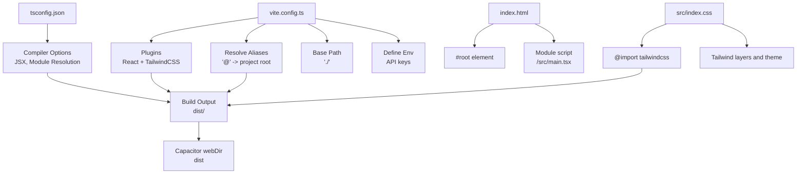
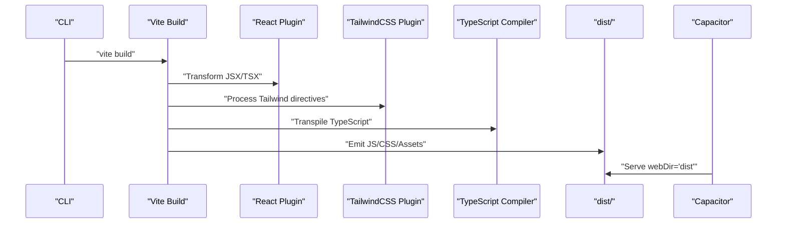
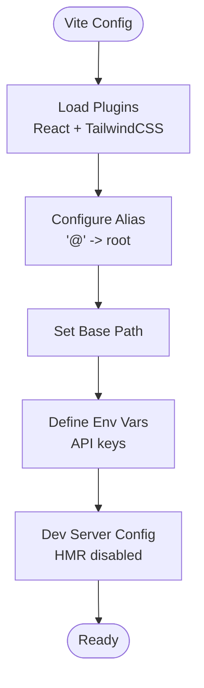
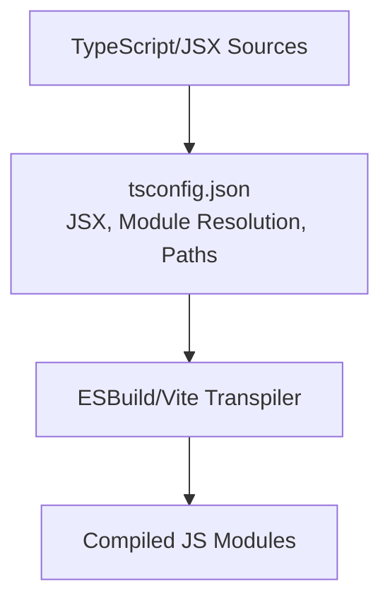
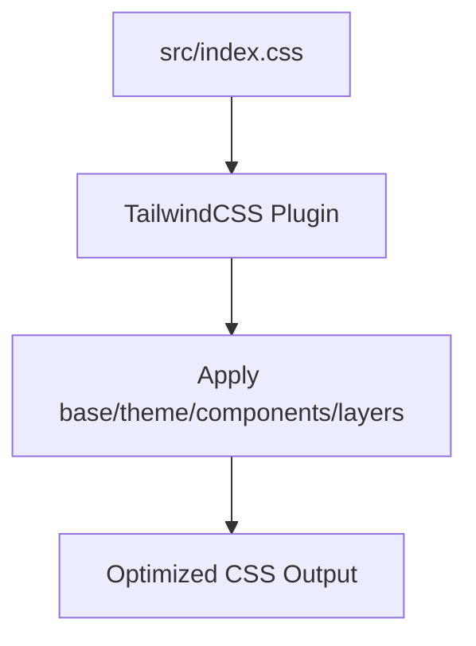
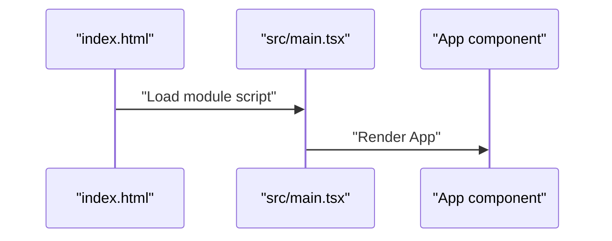
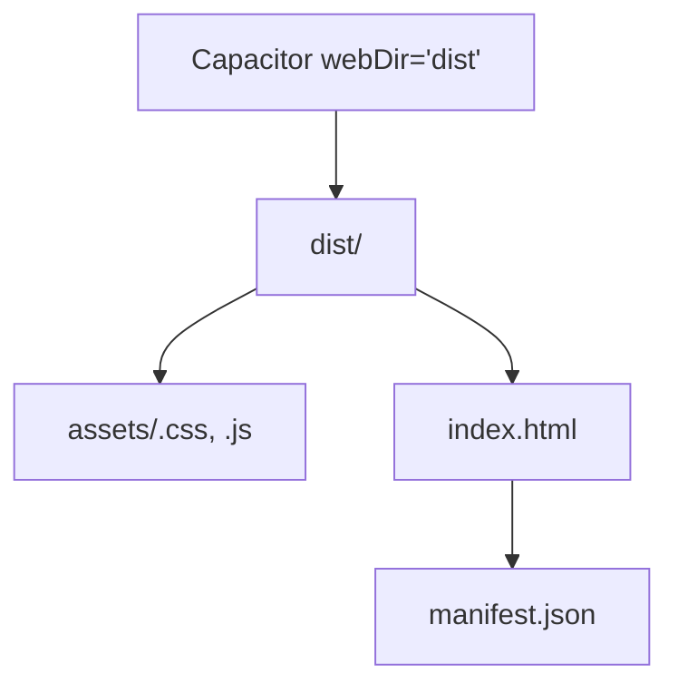
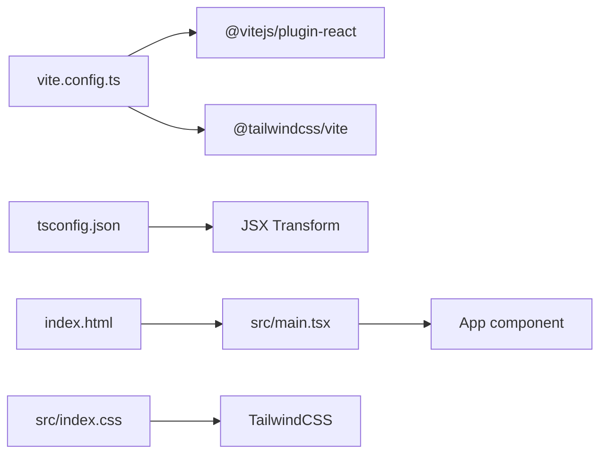

# Client Build

<cite>
**Referenced Files in This Document**
- [vite.config.ts](file://vite.config.ts)
- [package.json](file://package.json)
- [tsconfig.json](file://tsconfig.json)
- [src/main.tsx](file://src/main.tsx)
- [index.html](file://index.html)
- [src/index.css](file://src/index.css)
- [capacitor.config.ts](file://capacitor.config.ts)
- [.codex/environments/environment.toml](file://.codex/environments/environment.toml)
</cite>

## Table of Contents
1. [Introduction](#introduction)
2. [Project Structure](#project-structure)
3. [Core Components](#core-components)
4. [Architecture Overview](#architecture-overview)
5. [Detailed Component Analysis](#detailed-component-analysis)
6. [Dependency Analysis](#dependency-analysis)
7. [Performance Considerations](#performance-considerations)
8. [Troubleshooting Guide](#troubleshooting-guide)
9. [Conclusion](#conclusion)

## Introduction
This document explains the client-side build process for the React application powered by Vite. It covers the Vite configuration, TypeScript and JSX compilation, module resolution, asset handling, CSS optimization with TailwindCSS, and the resulting build output structure. It also highlights development versus production differences, environment-specific configurations, and practical performance optimization techniques such as tree shaking, code splitting, and bundle analysis.

## Project Structure
The client build centers around a small number of key files:
- Vite configuration defines plugins, aliases, base path, and environment variable exposure.
- TypeScript configuration controls transpilation, JSX transformation, and module resolution.
- The HTML entry file bootstraps the React application.
- TailwindCSS integrates via a Vite plugin and a CSS entry file.
- Capacitor configuration maps the built output to the Android web directory.

**Diagram sources**
- [vite.config.ts:6-27](file://vite.config.ts#L6-L27)
- [tsconfig.json:2-25](file://tsconfig.json#L2-L25)
- [index.html:10-13](file://index.html#L10-L13)
- [src/index.css:1](file://src/index.css#L1)
- [capacitor.config.ts:6](file://capacitor.config.ts#L6)

**Section sources**
- [vite.config.ts:6-27](file://vite.config.ts#L6-L27)
- [tsconfig.json:2-25](file://tsconfig.json#L2-L25)
- [index.html:10-13](file://index.html#L10-L13)
- [src/index.css:1](file://src/index.css#L1)
- [capacitor.config.ts:6](file://capacitor.config.ts#L6)

## Core Components
- Vite configuration
  - Plugins: React Fast Refresh and TailwindCSS integration.
  - Aliases: '@' resolves to the project root for ergonomic imports.
  - Base path: Relative base for assets and routing compatibility.
  - Environment variables: Exposes selected API keys to client code at build time.
  - Dev server: Disables HMR to avoid flickering during agent edits.
- TypeScript configuration
  - Target/modern runtime flags, DOM libs, JSX transform, bundler module resolution, and path mapping.
- HTML entry
  - Minimal template with a root div and a module script pointing to the React entry.
- CSS pipeline
  - TailwindCSS imported and layered with custom theme and component styles.
- Capacitor integration
  - Builds into dist/, which Capacitor serves as the web directory.

**Section sources**
- [vite.config.ts:6-27](file://vite.config.ts#L6-L27)
- [tsconfig.json:2-25](file://tsconfig.json#L2-L25)
- [index.html:10-13](file://index.html#L10-L13)
- [src/index.css:1](file://src/index.css#L1)
- [capacitor.config.ts:6](file://capacitor.config.ts#L6)

## Architecture Overview
The build pipeline transforms TypeScript/JSX sources into optimized JavaScript bundles and CSS, then emits static assets under dist/. Capacitor consumes dist/ as the web assets for the Android app.

**Diagram sources**
- [package.json:10](file://package.json#L10)
- [vite.config.ts:9](file://vite.config.ts#L9)
- [tsconfig.json:17](file://tsconfig.json#L17)
- [capacitor.config.ts:6](file://capacitor.config.ts#L6)

## Detailed Component Analysis

### Vite Configuration and Asset Handling
- Plugins
  - React plugin enables JSX/TSX transforms and fast refresh.
  - TailwindCSS plugin processes CSS directives and generates purged styles.
- Aliases
  - '@' resolves to project root, simplifying imports across the app.
- Base path
  - Relative base ensures assets resolve correctly when hosted under subpaths or served by Capacitor.
- Environment variables
  - Selected API keys are injected into the client build-time via define, enabling conditional logic and feature flags without leaking secrets.
- Dev server
  - HMR disabled to prevent UI flicker during agent edits.

**Diagram sources**
- [vite.config.ts:6-27](file://vite.config.ts#L6-L27)

**Section sources**
- [vite.config.ts:6-27](file://vite.config.ts#L6-L27)

### TypeScript Transpilation and JSX Transformation
- JSX transform
  - Uses 'react-jsx' for modern React JSX transform with automatic runtime support.
- Module resolution
  - 'bundler' enables Vite/ESBuild to resolve modules as intended for bundling.
- Paths
  - '@/*' mapped to project root for concise imports.
- No emit
  - Build outputs are generated by Vite; TypeScript is not emitting files directly.

**Diagram sources**
- [tsconfig.json:17](file://tsconfig.json#L17)
- [tsconfig.json:13](file://tsconfig.json#L13)
- [tsconfig.json:18-22](file://tsconfig.json#L18-L22)

**Section sources**
- [tsconfig.json:17](file://tsconfig.json#L17)
- [tsconfig.json:13](file://tsconfig.json#L13)
- [tsconfig.json:18-22](file://tsconfig.json#L18-L22)

### CSS Optimization with TailwindCSS
- Import directive
  - TailwindCSS is imported in the global stylesheet.
- Layering and theme
  - Tailwind layers and custom theme tokens are applied to produce a cohesive design system.
- Purge and optimization
  - TailwindCSS plugin purges unused styles; ensure content paths are configured to scan all relevant files to maximize dead-code elimination.

**Diagram sources**
- [src/index.css:1](file://src/index.css#L1)

**Section sources**
- [src/index.css:1](file://src/index.css#L1)

### Module Resolution and Entry Point
- Entry point
  - index.html mounts a module script pointing to src/main.tsx.
- Root rendering
  - src/main.tsx creates the root and renders the App component.
- Aliasing
  - '@' alias simplifies imports across components, services, and hooks.

**Diagram sources**
- [index.html:12](file://index.html#L12)
- [src/main.tsx:1-11](file://src/main.tsx#L1-L11)

**Section sources**
- [index.html:12](file://index.html#L12)
- [src/main.tsx:1-11](file://src/main.tsx#L1-L11)

### Asset Optimization Strategies
- Image compression with Sharp
  - Sharp is included as a dependency; integrate it into build steps or post-processing to compress images and generate multiple variants for different densities.
- CSS optimization with TailwindCSS
  - Use the TailwindCSS plugin to purge unused rules and minimize CSS size.
- JavaScript bundling and code splitting
  - Vite performs intelligent code splitting by default; leverage dynamic imports for route-level or feature-level lazy loading to reduce initial bundle size.

Note: The repository does not include explicit Sharp or advanced Vite rollupOptions configuration. These strategies are recommended enhancements to complement the current setup.

**Section sources**
- [package.json:51](file://package.json#L51)

### Build Output Structure
- Output directory
  - The build emits to dist/ by default.
- Static assets
  - Bundled CSS/JS and hashed assets are placed under dist/assets/.
- Manifest and service worker
  - The HTML references a manifest; ensure a manifest file is generated and placed at /manifest.json for Progressive Web App features.
- Capacitor consumption
  - Capacitor reads webDir='dist'; ensure dist/ is synchronized after building.

**Diagram sources**
- [capacitor.config.ts:6](file://capacitor.config.ts#L6)
- [index.html:7](file://index.html#L7)

**Section sources**
- [capacitor.config.ts:6](file://capacitor.config.ts#L6)
- [index.html:7](file://index.html#L7)

### Development vs Production Differences
- Environment variables
  - The Vite config exposes selected API keys via define; ensure production builds source environment variables from a secure provider and avoid leaking secrets.
- HMR
  - HMR is disabled in development to prevent flickering during agent edits.
- Optimization
  - Production builds benefit from minification, dead-code elimination, and asset hashing; ensure these defaults are preserved.

**Section sources**
- [vite.config.ts:11-15](file://vite.config.ts#L11-L15)
- [vite.config.ts:24](file://vite.config.ts#L24)

### Environment-Specific Configurations
- Scripts
  - The build-client script triggers Vite; the build script runs both server and client builds.
- Capacitor sync
  - The Codex environment action demonstrates a typical workflow: build client, then synchronize with Capacitor for Android.

**Section sources**
- [package.json:10](file://package.json#L10)
- [package.json:11](file://package.json#L11)
- [.codex/environments/environment.toml:12-14](file://.codex/environments/environment.toml#L12-L14)

## Dependency Analysis
The client build relies on Vite, React, TailwindCSS, and TypeScript. The following diagram shows how these components interact during the build.

**Diagram sources**
- [vite.config.ts:9](file://vite.config.ts#L9)
- [tsconfig.json:17](file://tsconfig.json#L17)
- [index.html:12](file://index.html#L12)
- [src/main.tsx:1-11](file://src/main.tsx#L1-L11)
- [src/index.css:1](file://src/index.css#L1)

**Section sources**
- [vite.config.ts:9](file://vite.config.ts#L9)
- [tsconfig.json:17](file://tsconfig.json#L17)
- [index.html:12](file://index.html#L12)
- [src/main.tsx:1-11](file://src/main.tsx#L1-L11)
- [src/index.css:1](file://src/index.css#L1)

## Performance Considerations
- Tree shaking
  - Use ES modules and keep side-effect-free libraries to enable dead-code elimination.
- Lazy loading
  - Split routes and heavy features with dynamic imports to reduce initial payload.
- Bundle analysis
  - Use Vite’s built-in preview and third-party tools to inspect bundle composition and identify oversized dependencies.
- CSS optimization
  - Keep TailwindCSS purged and scoped to reduce CSS size; avoid global overrides that defeat purging.
- Asset optimization
  - Integrate Sharp for image compression and generate responsive variants.

[No sources needed since this section provides general guidance]

## Troubleshooting Guide
- Missing manifest or icons
  - Ensure manifest.json and icon assets are present at the root of the public directory and referenced in index.html.
- Incorrect asset paths
  - Verify base path is set appropriately for relative asset resolution.
- Environment variables not applied
  - Confirm environment variables are loaded and exposed via define in Vite config.
- Capacitor not serving latest assets
  - Re-run the build and Capacitor sync to ensure dist/ is updated.

**Section sources**
- [index.html:7](file://index.html#L7)
- [vite.config.ts:10](file://vite.config.ts#L10)
- [vite.config.ts:11-15](file://vite.config.ts#L11-L15)
- [capacitor.config.ts:6](file://capacitor.config.ts#L6)

## Conclusion
The client build leverages Vite, React, TailwindCSS, and TypeScript to deliver a modern, optimized web application packaged for Capacitor. By aligning Vite’s configuration with TailwindCSS processing, ensuring proper environment variable exposure, and adopting performance best practices like lazy loading and bundle analysis, teams can maintain a fast, reliable client build pipeline.