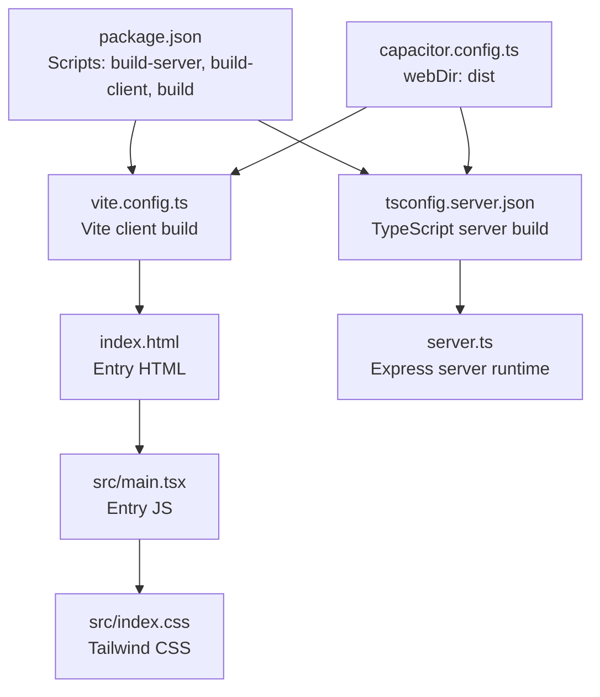
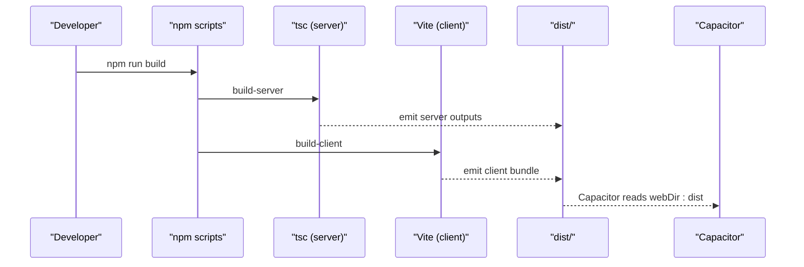
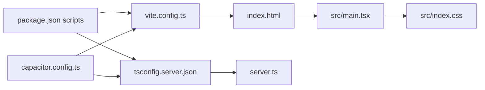

# Production Build

<cite>
**Referenced Files in This Document**
- [package.json](file://package.json)
- [vite.config.ts](file://vite.config.ts)
- [tsconfig.json](file://tsconfig.json)
- [tsconfig.server.json](file://tsconfig.server.json)
- [capacitor.config.ts](file://capacitor.config.ts)
- [index.html](file://index.html)
- [src/main.tsx](file://src/main.tsx)
- [src/index.css](file://src/index.css)
- [server.ts](file://server.ts)
</cite>

## Table of Contents
1. [Introduction](#introduction)
2. [Project Structure](#project-structure)
3. [Core Components](#core-components)
4. [Architecture Overview](#architecture-overview)
5. [Detailed Component Analysis](#detailed-component-analysis)
6. [Dependency Analysis](#dependency-analysis)
7. [Performance Considerations](#performance-considerations)
8. [Troubleshooting Guide](#troubleshooting-guide)
9. [Conclusion](#conclusion)

## Introduction
This document explains the production build process for the project, covering both client and server builds, Vite configuration for production, TypeScript compilation for the server, asset optimization, build outputs, and performance strategies. It also describes how Capacitor integrates the built web assets into the Android app.

## Project Structure
The build system separates concerns between:
- Client web app (React + Vite): compiled into the dist directory
- Server runtime (Express + TypeScript): compiled into the dist directory
- Capacitor configuration: points the Android app to the built web assets

**Diagram sources**
- [package.json](file://package.json)
- [vite.config.ts](file://vite.config.ts)
- [tsconfig.server.json](file://tsconfig.server.json)
- [index.html](file://index.html)
- [src/main.tsx](file://src/main.tsx)
- [src/index.css](file://src/index.css)
- [server.ts](file://server.ts)
- [capacitor.config.ts](file://capacitor.config.ts)

**Section sources**
- [package.json](file://package.json)
- [capacitor.config.ts](file://capacitor.config.ts)

## Core Components
- Build scripts
  - build-server: compiles the server runtime using tsconfig.server.json
  - build-client: runs Vite to produce the client bundle under dist
  - build: sequential build of server followed by client
- Vite configuration
  - Plugins: React and Tailwind CSS
  - Base path: relative (“./”)
  - Environment variable injection
  - Path aliases
  - Dev server HMR disabled
- TypeScript server configuration
  - Extends shared tsconfig.json
  - Output directory: dist
  - Module and target aligned with modern environments
  - Node module resolution for server-side code
- Capacitor integration
  - webDir: dist
  - Android scheme and navigation settings

**Section sources**
- [package.json](file://package.json)
- [vite.config.ts](file://vite.config.ts)
- [tsconfig.json](file://tsconfig.json)
- [tsconfig.server.json](file://tsconfig.server.json)
- [capacitor.config.ts](file://capacitor.config.ts)

## Architecture Overview
The production build pipeline produces two distinct artifacts:
- Client bundle (dist): served by Capacitor’s embedded web server
- Server binary (dist): compiled from server.ts using tsconfig.server.json

**Diagram sources**
- [package.json](file://package.json)
- [tsconfig.server.json](file://tsconfig.server.json)
- [vite.config.ts](file://vite.config.ts)
- [capacitor.config.ts](file://capacitor.config.ts)

## Detailed Component Analysis

### Build Scripts and Commands
- build-server
  - Uses tsc with tsconfig.server.json
  - Emits to dist with ESNext module and ES2022 target
- build-client
  - Runs Vite build
  - Produces a client bundle under dist
- build
  - Chains build-server then build-client
- preview
  - Serves the built client locally for testing

**Section sources**
- [package.json](file://package.json)
- [tsconfig.server.json](file://tsconfig.server.json)
- [vite.config.ts](file://vite.config.ts)

### Vite Production Build Configuration
- Plugins
  - React plugin for JSX/TSX transforms
  - Tailwind CSS plugin for CSS processing
- Base path
  - Relative base (“./”) to support Capacitor’s file:// and http:// schemes
- Environment injection
  - Injects API keys and app URL from environment variables into the client bundle
- Aliases
  - Alias “@” resolves to project root for ergonomic imports
- Dev server
  - HMR disabled in development configuration

Asset optimization and bundling
- Vite’s default production build performs minification and code splitting
- Tailwind CSS is integrated for utility-first CSS
- No explicit external Vite plugins for image optimization or CSS extraction are configured in this project

Build output
- The client build emits files under dist
- Capacitor’s webDir is set to dist, so the Android app loads the built assets from there

**Section sources**
- [vite.config.ts](file://vite.config.ts)
- [capacitor.config.ts](file://capacitor.config.ts)

### TypeScript Compilation for Server (tsconfig.server.json)
- Extends shared tsconfig.json
- Compiler options
  - outDir: dist
  - module: esnext
  - target: es2022
  - esModuleInterop: true
  - resolveJsonModule: true
  - skipLibCheck: true
  - moduleResolution: node
  - ignoreDeprecations: 6.0
- Include
  - Targets server.ts specifically

Implications
- Node-compatible module resolution
- Emit targeting modern Node environments
- Single-entry server compilation

**Section sources**
- [tsconfig.json](file://tsconfig.json)
- [tsconfig.server.json](file://tsconfig.server.json)

### Asset Optimization Strategies
Current configuration
- CSS
  - Tailwind CSS is configured via the Tailwind plugin
  - No explicit PurgeCSS or CSS minification plugin is declared
- Images
  - No dedicated image optimization plugin is configured
- JavaScript
  - Vite minifies in production by default
  - No explicit code splitting configuration is present; Vite defaults apply

Recommendations (conceptual)
- Integrate an image optimization plugin for Vite if needed
- Consider CSS minification and purging if bundle size or CSS payload is large
- Use Vite’s build.rollupOptions to customize code splitting and chunking

[No sources needed since this section provides general guidance]

### Build Output Structure and Static Assets
- Client
  - dist directory contains the built web app
  - index.html is the SPA entry
  - src/main.tsx is the module entrypoint
  - src/index.css is imported by the entry
- Server
  - dist directory contains compiled server outputs per tsconfig.server.json
- Capacitor
  - Android app loads assets from webDir: dist

Static asset handling
- Vite’s default behavior serves static assets from the dist folder
- Relative base (“./”) ensures assets resolve correctly across Capacitor and web contexts

**Section sources**
- [index.html](file://index.html)
- [src/main.tsx](file://src/main.tsx)
- [src/index.css](file://src/index.css)
- [capacitor.config.ts](file://capacitor.config.ts)

### Bundle Analysis and Minification
- Vite’s production build applies minification by default
- No explicit Rollup or Vite analyzer plugin is configured
- To analyze bundles, integrate a plugin (e.g., rollup-plugin-analyzer) and configure it in vite.config.ts

**Section sources**
- [vite.config.ts](file://vite.config.ts)

### Build Caching Strategies
- Use Vite’s incremental rebuilds during development
- For CI, cache node_modules and consider build caches for repeated production builds
- Keep dist separate from source to avoid unnecessary rebuild triggers

[No sources needed since this section provides general guidance]

## Dependency Analysis
High-level relationships among build-time components:

**Diagram sources**
- [package.json](file://package.json)
- [vite.config.ts](file://vite.config.ts)
- [tsconfig.server.json](file://tsconfig.server.json)
- [index.html](file://index.html)
- [src/main.tsx](file://src/main.tsx)
- [src/index.css](file://src/index.css)
- [server.ts](file://server.ts)
- [capacitor.config.ts](file://capacitor.config.ts)

**Section sources**
- [package.json](file://package.json)
- [vite.config.ts](file://vite.config.ts)
- [tsconfig.server.json](file://tsconfig.server.json)
- [capacitor.config.ts](file://capacitor.config.ts)

## Performance Considerations
- Code splitting
  - Rely on Vite’s default splitting; consider custom Rollup output configuration if needed
- Minification
  - Accept Vite’s default minifier; configure terser options if required
- CSS
  - Tailwind is included; consider enabling purge or additional minification if necessary
- Images
  - No dedicated optimization plugin; consider adding one for production builds
- Bundle size
  - Use a bundle analyzer plugin to inspect sizes and optimize dependencies

[No sources needed since this section provides general guidance]

## Troubleshooting Guide
Common issues and checks
- Missing environment variables
  - API keys are injected at build time; ensure environment variables are present when building
- Capacitor cannot load assets
  - Verify webDir is dist and that the client build completed successfully
- Server fails to start after build
  - Confirm dist contains the compiled server outputs and that Node supports the ES2022 target and module settings
- HMR-related confusion
  - HMR is disabled in dev configuration; preview and Capacitor load production builds

**Section sources**
- [vite.config.ts](file://vite.config.ts)
- [capacitor.config.ts](file://capacitor.config.ts)
- [tsconfig.server.json](file://tsconfig.server.json)

## Conclusion
The project’s production build process cleanly separates client and server concerns:
- The client is built with Vite and Tailwind CSS, emitting to dist
- The server is compiled with TypeScript using Node module resolution and ES2022 targets
- Capacitor consumes the dist directory as the web asset root
For production hardening, consider integrating image optimization, CSS minification/purge, and a bundle analyzer to monitor and reduce bundle sizes.