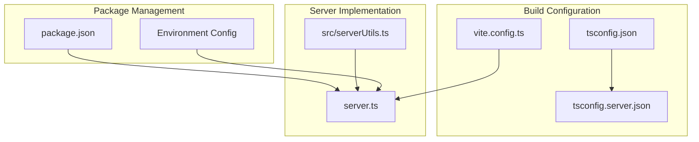
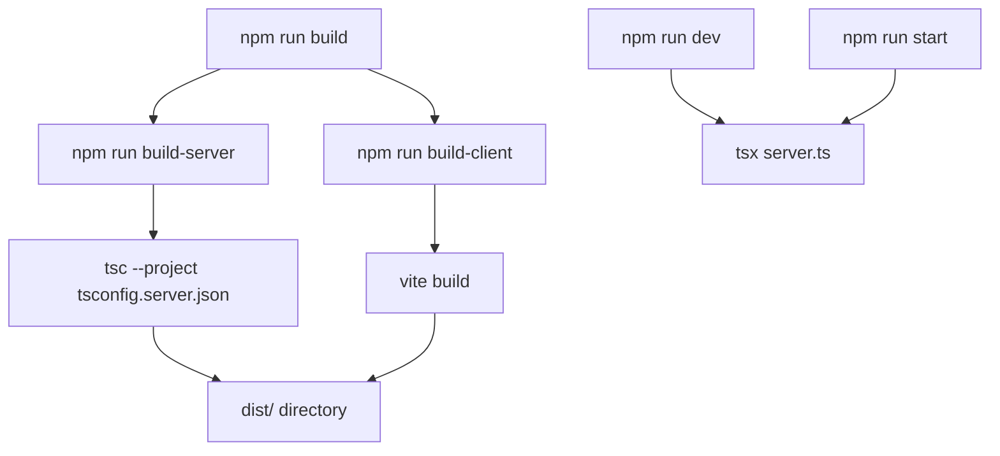
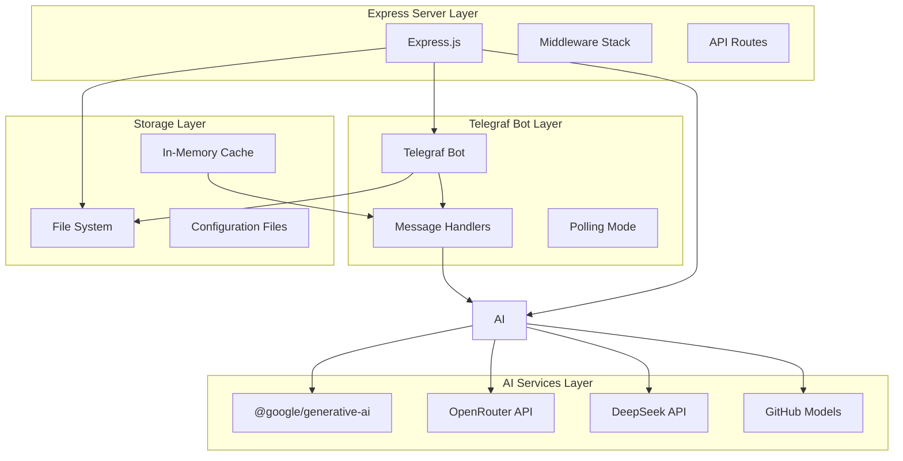
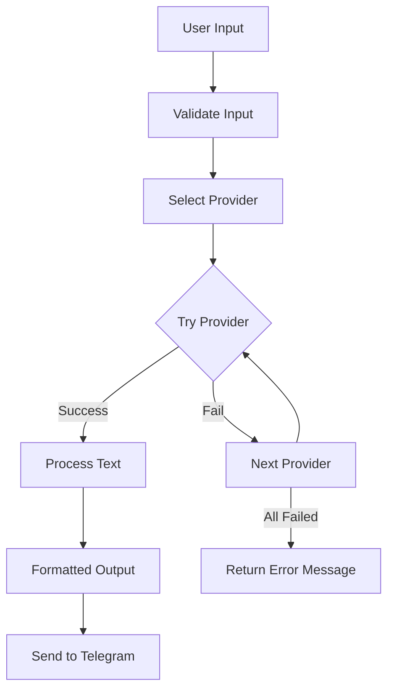
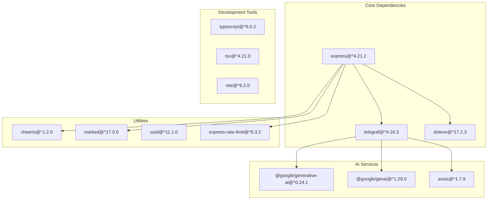

# Server Build

<cite>
**Referenced Files in This Document**
- [tsconfig.server.json](file://tsconfig.server.json)
- [tsconfig.json](file://tsconfig.json)
- [server.ts](file://server.ts)
- [package.json](file://package.json)
- [vite.config.ts](file://vite.config.ts)
- [src/serverUtils.ts](file://src/serverUtils.ts)
- [README.md](file://README.md)
- [.codex/environments/environment.toml](file://.codex/environments/environment.toml)
</cite>

## Table of Contents
1. [Introduction](#introduction)
2. [Project Structure](#project-structure)
3. [Core Components](#core-components)
4. [Architecture Overview](#architecture-overview)
5. [Detailed Component Analysis](#detailed-component-analysis)
6. [Dependency Analysis](#dependency-analysis)
7. [Performance Considerations](#performance-considerations)
8. [Troubleshooting Guide](#troubleshooting-guide)
9. [Conclusion](#conclusion)

## Introduction
This document provides comprehensive documentation for the server-side build process of the AI News Bot project. It covers TypeScript compilation configuration, Express server implementation, Telegraf bot integration, AI service implementations, build outputs, optimization strategies, and deployment preparation requirements.

## Project Structure
The project follows a hybrid architecture combining a React frontend with a Node.js/TypeScript backend server. The server serves as both an Express API server and a Telegram bot controller.

**Diagram sources**
- [tsconfig.server.json:1-15](file://tsconfig.server.json#L1-L15)
- [tsconfig.json:1-27](file://tsconfig.json#L1-L27)
- [vite.config.ts:1-28](file://vite.config.ts#L1-L28)

**Section sources**
- [tsconfig.server.json:1-15](file://tsconfig.server.json#L1-L15)
- [tsconfig.json:1-27](file://tsconfig.json#L1-L27)
- [vite.config.ts:1-28](file://vite.config.ts#L1-L28)

## Core Components

### TypeScript Compilation Configuration
The server uses a dedicated TypeScript configuration that extends the main project configuration with server-specific settings.

**Compilation Settings:**
- **Target Environment**: ES2022 with modern JavaScript features
- **Module System**: ESNext for optimal tree-shaking
- **Output Directory**: `dist` for compiled JavaScript files
- **Module Resolution**: Node resolution for proper dependency handling
- **Type Checking**: Disabled for faster builds (`skipLibCheck: true`)
- **JSON Module Support**: Enabled for configuration files

**Section sources**
- [tsconfig.server.json:1-15](file://tsconfig.server.json#L1-L15)

### Build Scripts and Commands
The project provides comprehensive build automation through npm scripts:

**Diagram sources**
- [package.json:6-17](file://package.json#L6-L17)

**Section sources**
- [package.json:6-17](file://package.json#L6-L17)

## Architecture Overview

The server architecture combines multiple technologies to create a robust AI-powered Telegram bot system:

**Diagram sources**
- [server.ts:1-1454](file://server.ts#L1-L1454)

**Section sources**
- [server.ts:1-1454](file://server.ts#L1-L1454)

## Detailed Component Analysis

### Express Server Implementation
The server implements a comprehensive Express application with multiple middleware layers and API endpoints.

**Core Server Features:**
- **Environment Validation**: Validates required environment variables at startup
- **CORS Configuration**: Enables cross-origin resource sharing with flexible settings
- **Rate Limiting**: Implements multiple rate limiting strategies for different endpoints
- **Static File Serving**: Serves React frontend in production mode
- **Vite Integration**: Provides development middleware for hot reloading

**Section sources**
- [server.ts:24-33](file://server.ts#L24-L33)
- [server.ts:44-60](file://server.ts#L44-L60)
- [server.ts:1380-1418](file://server.ts#L1380-L1418)

### Telegraf Bot Integration
The server integrates with Telegram through the Telegraf library, implementing robust bot functionality.

**Bot Implementation Details:**
- **Polling Mode**: Uses long-polling instead of webhooks for reliability
- **Health Monitoring**: Implements automatic bot health checks and restarts
- **Error Handling**: Comprehensive error handling with retry mechanisms
- **Message Processing**: Handles various message types and formats
- **Configuration Management**: Manages bot token persistence and updates

**Section sources**
- [server.ts:688-799](file://server.ts#L688-L799)
- [server.ts:377-409](file://server.ts#L377-L409)

### AI Service Implementations
The server provides multiple AI service integrations with fallback mechanisms and error handling.

**Supported AI Providers:**
- **Google Gemini**: Primary AI provider with multiple model fallback
- **GitHub Models**: Azure-hosted GPT models via GitHub API
- **OpenRouter**: Multi-provider API gateway
- **DeepSeek**: Chinese AI model provider

**AI Processing Workflow:**

**Diagram sources**
- [server.ts:412-645](file://server.ts#L412-L645)

**Section sources**
- [server.ts:412-645](file://server.ts#L412-L645)

### File Logging System
The server implements a comprehensive logging system for debugging and monitoring.

**Logging Features:**
- **File-based Logging**: Persistent log files with timestamped entries
- **Real-time Streaming**: Server-Sent Events for live log monitoring
- **Multi-level Logging**: ERROR, WARN, and INFO severity levels
- **Structured Format**: Consistent log message formatting

**Section sources**
- [src/serverUtils.ts:1-23](file://src/serverUtils.ts#L1-L23)
- [server.ts:219-277](file://server.ts#L219-L277)

## Dependency Analysis

The server has a comprehensive dependency graph spanning multiple domains:

**Diagram sources**
- [package.json:19-56](file://package.json#L19-L56)

**Section sources**
- [package.json:19-56](file://package.json#L19-L56)

## Performance Considerations

### Build Optimization Strategies
The server build process incorporates several optimization techniques:

**Dead Code Elimination:**
- ESNext module system enables tree-shaking
- Modern target environment supports advanced optimizations
- Minimal dependency footprint reduces bundle size

**Type Checking Optimization:**
- Separate server configuration disables type checking for faster builds
- Main project maintains strict type checking for frontend
- Development vs production type checking strategies

**Module Bundling:**
- Single-file compilation for server-side code
- External dependencies remain as separate modules
- No bundling overhead for server runtime

### Runtime Performance
**Memory Management:**
- In-memory caching for frequently accessed data
- Proper cleanup of bot instances and intervals
- Efficient file system operations

**Network Optimization:**
- Rate limiting prevents abuse and conserves resources
- Timeout configurations prevent hanging requests
- Connection pooling for external API calls

## Troubleshooting Guide

### Common Build Issues

**TypeScript Compilation Errors:**
- Verify `tsconfig.server.json` extends `tsconfig.json` correctly
- Check module resolution settings for external dependencies
- Ensure all required environment variables are defined

**Runtime Environment Issues:**
- Missing Telegram bot token prevents bot initialization
- AI API keys required for AI functionality
- File system permission issues for data storage

**Deployment Problems:**
- Ensure `dist` directory contains compiled files
- Verify environment variables are properly configured
- Check firewall settings for external API access

### Debugging Strategies

**Server Logs:**
- Monitor file-based logs in `./logs/app.log`
- Use real-time log streaming endpoint
- Check health check intervals and bot status

**API Testing:**
- Use `/api/ping` endpoint for basic connectivity
- Test AI functionality with `/api/test-ai`
- Verify bot status with `/api/status`

**Section sources**
- [server.ts:1380-1454](file://server.ts#L1380-L1454)
- [README.md:16-25](file://README.md#L16-L25)

## Conclusion

The server-side build process for the AI News Bot project demonstrates a well-architected approach to combining modern web technologies with AI services. The TypeScript configuration provides optimal compilation settings for Node.js runtime, while the Express server implementation offers comprehensive functionality for Telegram bot operations and AI text processing.

Key strengths of the build system include:
- Clear separation between server and client configurations
- Robust error handling and logging systems
- Flexible AI provider integration with fallback mechanisms
- Production-ready deployment preparation
- Comprehensive build automation through npm scripts

The modular architecture allows for easy maintenance and future enhancements while maintaining optimal performance characteristics for both development and production environments.