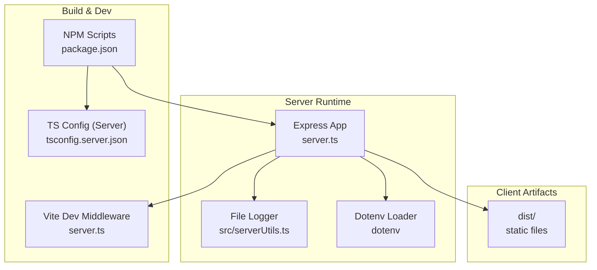
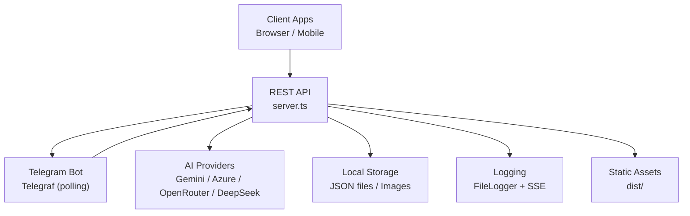
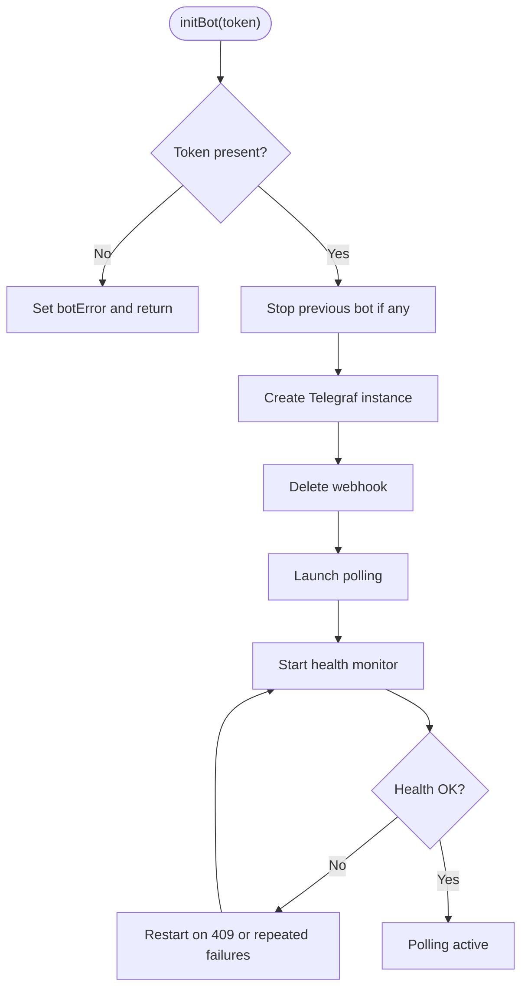
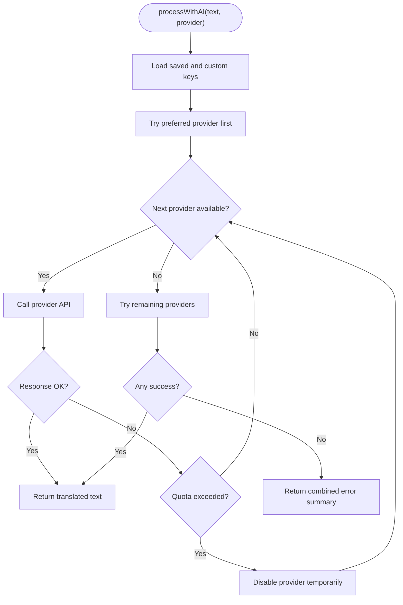
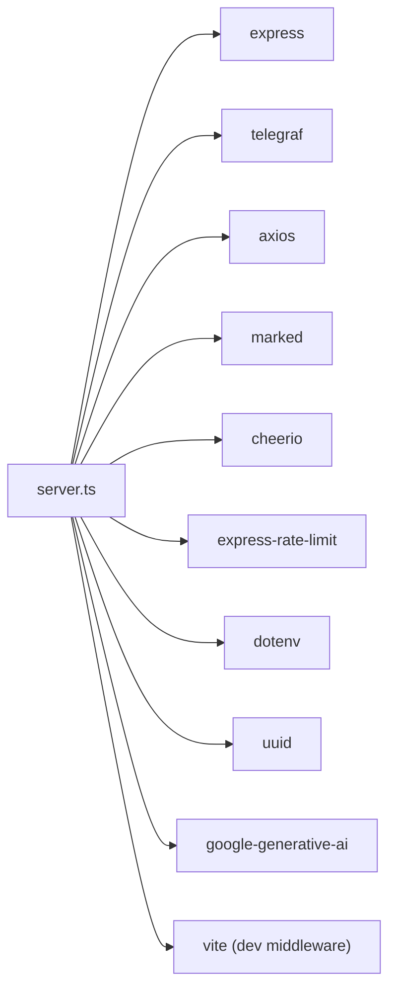

# Server Deployment

<cite>
**Referenced Files in This Document**
- [server.ts](file://server.ts)
- [package.json](file://package.json)
- [tsconfig.server.json](file://tsconfig.server.json)
- [src/serverUtils.ts](file://src/serverUtils.ts)
- [.codex/environments/environment.toml](file://.codex/environments/environment.toml)
</cite>

## Table of Contents
1. [Introduction](#introduction)
2. [Project Structure](#project-structure)
3. [Core Components](#core-components)
4. [Architecture Overview](#architecture-overview)
5. [Detailed Component Analysis](#detailed-component-analysis)
6. [Dependency Analysis](#dependency-analysis)
7. [Performance Considerations](#performance-considerations)
8. [Troubleshooting Guide](#troubleshooting-guide)
9. [Conclusion](#conclusion)
10. [Appendices](#appendices)

## Introduction
This document explains how to deploy and operate the server component that powers the application. It covers the server startup process, environment configuration, runtime behavior, API endpoints, and operational concerns such as logging, health checks, and scheduling. It also outlines practical deployment strategies (direct Node.js execution, process managers, containers, and cloud platforms) and provides guidance for CI/CD automation and monitoring.

## Project Structure
The server is implemented as a single TypeScript entrypoint that builds on Express, integrates a Telegram bot, and exposes a REST API for configuration, publishing, and diagnostics. Build artifacts for the client are produced separately and served statically in production.



**Diagram sources**
- [server.ts:1379-1452](file://server.ts#L1379-L1452)
- [src/serverUtils.ts:1-23](file://src/serverUtils.ts#L1-L23)
- [package.json:6-17](file://package.json#L6-L17)
- [tsconfig.server.json:1-15](file://tsconfig.server.json#L1-L15)

**Section sources**
- [server.ts:1379-1452](file://server.ts#L1379-L1452)
- [package.json:6-17](file://package.json#L6-L17)
- [tsconfig.server.json:1-15](file://tsconfig.server.json#L1-L15)

## Core Components
- Express server and middleware stack
- Environment validation and configuration loading
- Telegram bot lifecycle management (polling)
- Rate limiting and security middleware
- API endpoints for configuration, publishing, logs, and diagnostics
- Logging subsystem (file and in-memory SSE streaming)
- Scheduling for scheduled posts

Key behaviors:
- Validates required environment variables at startup.
- Initializes optional AI providers and falls back across providers/models.
- Starts a Telegram bot in polling mode and monitors health.
- Exposes REST endpoints for configuration, publishing, and diagnostics.
- Serves a static client in production and Vite dev middleware in development.

**Section sources**
- [server.ts:24-35](file://server.ts#L24-L35)
- [server.ts:1379-1452](file://server.ts#L1379-L1452)
- [server.ts:936-1377](file://server.ts#L936-L1377)
- [src/serverUtils.ts:1-23](file://src/serverUtils.ts#L1-L23)

## Architecture Overview
The server composes multiple concerns:
- HTTP transport and routing
- Telegram bot integration
- Persistent configuration and data
- AI processing with fallbacks
- Static asset serving



**Diagram sources**
- [server.ts:1379-1452](file://server.ts#L1379-L1452)
- [server.ts:936-1377](file://server.ts#L936-L1377)
- [src/serverUtils.ts:1-23](file://src/serverUtils.ts#L1-L23)

## Detailed Component Analysis

### Startup and Environment Configuration
- Loads environment variables via dotenv.
- Validates required variables (e.g., Telegram token).
- Initializes persistent data caches and default values.
- Conditionally enables Vite dev middleware in non-production environments.
- Starts the Express server bound to a configurable port.

```mermaid
sequenceDiagram
participant Proc as "Process"
participant Dotenv as "dotenv"
participant Server as "startServer()"
participant Cfg as "loadAllData()"
participant Bot as "initBot()"
participant App as "Express App"
Proc->>Dotenv : "Load env"
Proc->>Server : "Call startServer()"
Server->>Cfg : "Load persistent data"
Server->>Server : "Set DEFAULT_CHAT_ID"
alt "Saved token exists"
Server->>Bot : "Initialize bot"
Bot-->>Server : "Active or error"
else "No token"
Server-->>Proc : "Await UI token"
end
opt "Development"
Server->>App : "Enable Vite middleware"
else "Production"
Server->>App : "Serve dist static"
end
Server->>App : "Listen on PORT"
```

**Diagram sources**
- [server.ts:17-35](file://server.ts#L17-L35)
- [server.ts:127-142](file://server.ts#L127-L142)
- [server.ts:1379-1452](file://server.ts#L1379-L1452)

**Section sources**
- [server.ts:17-35](file://server.ts#L17-L35)
- [server.ts:127-142](file://server.ts#L127-L142)
- [server.ts:1379-1452](file://server.ts#L1379-L1452)

### Telegram Bot Lifecycle
- Creates a Telegraf instance with a long handler timeout and polling mode.
- Deletes any existing webhook to ensure exclusive polling.
- Monitors bot health periodically and auto-restarts on failures.
- Supports manual stop/restart and error propagation.



**Diagram sources**
- [server.ts:688-799](file://server.ts#L688-L799)
- [server.ts:377-409](file://server.ts#L377-L409)

**Section sources**
- [server.ts:688-799](file://server.ts#L688-L799)
- [server.ts:377-409](file://server.ts#L377-L409)

### AI Provider Fallback and Processing
- Supports multiple providers with ordered fallback and per-provider quotas.
- Uses environment variables and persisted keys.
- Implements retry logic and quota-aware backoff.



**Diagram sources**
- [server.ts:412-645](file://server.ts#L412-L645)

**Section sources**
- [server.ts:412-645](file://server.ts#L412-L645)

### API Endpoints and Operations
- Configuration endpoints for token, chat ID, image path, and API keys.
- Publishing endpoints for Telegram posts and media groups.
- Diagnostic endpoints for status, logs, and health.
- Utilities for testing keys and endpoints.

Representative endpoints:
- GET /api/ping
- GET /api/status
- GET /api/logs
- GET /api/logs/stream
- POST /api/config/token
- POST /api/config/chat-id
- POST /api/config/image-path
- POST /api/process-text
- POST /api/process-url
- POST /api/posts/publish
- POST /api/test-key
- POST /api/test-ai
- POST /api/test-telegram

Security and limits:
- Rate limiting applied to AI and mutation endpoints.
- CORS configured for browser clients.
- Input validation and sanitization for chat IDs and URLs.

**Section sources**
- [server.ts:936-1377](file://server.ts#L936-L1377)

### Logging and Diagnostics
- FileLogger writes structured logs to disk.
- In-memory log manager supports server-sent events for live log streaming.
- Health monitoring tracks bot availability and restarts on failure.

Operational tips:
- Monitor /api/logs and /api/logs/stream for real-time diagnostics.
- Inspect logs directory for persistent records.

**Section sources**
- [src/serverUtils.ts:1-23](file://src/serverUtils.ts#L1-L23)
- [server.ts:219-277](file://server.ts#L219-L277)
- [server.ts:377-409](file://server.ts#L377-L409)

### Scheduling and Publishing
- Periodic scheduler runs every minute to publish scheduled posts.
- Supports single or grouped photos with captions and reactions.
- Maintains a small cache of recently published posts.

**Section sources**
- [server.ts:1420-1446](file://server.ts#L1420-L1446)
- [server.ts:806-934](file://server.ts#L806-L934)

## Dependency Analysis
- Runtime dependencies include Express, Telegraf, Axios, Cheerio, Marked, and rate limiting.
- Development and build-time dependencies include Vite, React toolchain, and TypeScript.
- The server is configured to run under ES module semantics with modern target and interop.



**Diagram sources**
- [server.ts:1-16](file://server.ts#L1-L16)
- [package.json:19-56](file://package.json#L19-L56)

**Section sources**
- [package.json:19-56](file://package.json#L19-L56)
- [tsconfig.server.json:1-15](file://tsconfig.server.json#L1-L15)

## Performance Considerations
- Rate limiting reduces load on AI providers and the server itself.
- Bot polling is CPU-light; consider scaling horizontally if traffic increases.
- Image uploads and media group sending are optimized with chunking and delays.
- Static asset serving in production avoids dynamic rendering overhead.
- Health checks and automatic restarts improve uptime reliability.

[No sources needed since this section provides general guidance]

## Troubleshooting Guide
Common issues and remedies:
- Missing environment variables cause startup failure. Ensure required variables are set before starting.
- Telegram token errors (e.g., conflicts) trigger health-based restarts; verify token uniqueness and revoke stale sessions.
- AI quota exhaustion returns 429-like responses; the server disables providers temporarily and suggests retries.
- Static assets not served in production: ensure the build step produces dist and the server can locate it.
- Logs not appearing: confirm FileLogger directory creation and permissions.

**Section sources**
- [server.ts:24-35](file://server.ts#L24-L35)
- [server.ts:377-409](file://server.ts#L377-L409)
- [server.ts:1379-1452](file://server.ts#L1379-L1452)
- [src/serverUtils.ts:1-23](file://src/serverUtils.ts#L1-L23)

## Conclusion
The server is designed for straightforward deployment with robust operational controls. It integrates a Telegram bot, exposes a flexible API, and includes built-in diagnostics and scheduling. Choose a deployment strategy that matches your environment and scale needs, and leverage the included endpoints and logging for reliable operations.

[No sources needed since this section summarizes without analyzing specific files]

## Appendices

### A. Environment Variables and Configuration
Required and commonly used variables:
- TELEGRAM_BOT_TOKEN: Telegram bot token for bot initialization.
- GEMINI_API_KEY: Optional; enables Gemini AI processing.
- OPENROUTER_API_KEY: Optional; enables OpenRouter fallback.
- DEEPSEEK_API_KEY: Optional; enables DeepSeek fallback.
- DEFAULT_CHAT_ID: Target chat identifier for publishing.
- PORT: Listening port for the Express server (default 3000).
- NODE_ENV: Controls Vite dev middleware vs. static production serving.

Validation and defaults:
- Required variables are checked at startup.
- Defaults are loaded from persistent files if environment variables are absent.

**Section sources**
- [server.ts:24-35](file://server.ts#L24-L35)
- [server.ts:175-202](file://server.ts#L175-L202)
- [server.ts:1379-1452](file://server.ts#L1379-L1452)

### B. Server Startup and Process Management
- Direct Node.js execution: use the provided NPM scripts to run the server in development or production modes.
- Process managers: configure PM2 to manage the Node.js process, enable restart on failure, and set environment variables.
- Containerization: package the server with a minimal Node.js base image, copy built artifacts, and expose the listening port.
- Cloud platforms:
  - Heroku: use a Node.js buildpack and set environment variables in the dashboard.
  - Vercel: deploy the server as a Serverless Function or Edge Function if compatible with Express; otherwise prefer a Compute platform option.
  - AWS: deploy to ECS/Fargate or Lambda with API Gateway; ensure environment variables and persistent storage are configured.

Operational notes:
- The server listens on 0.0.0.0 and binds to PORT.
- Health checks: use /api/ping and /api/status to verify liveness and readiness.
- Logging: use /api/logs and /api/logs/stream for diagnostics.

**Section sources**
- [package.json:6-17](file://package.json#L6-L17)
- [server.ts:1417-1418](file://server.ts#L1417-L1418)
- [server.ts:936-989](file://server.ts#L936-L989)

### C. CI/CD Pipeline Setup
Recommended stages:
- Install dependencies
- Build server and client
- Run tests/lint
- Package artifacts
- Deploy to target environment (container registry or platform)
- Post-deploy verification (health checks)

Automation hints:
- Use NPM scripts for build and preview steps.
- Persist configuration via environment variables and secrets management.
- Automate health checks against /api/ping and /api/status.

**Section sources**
- [package.json:6-17](file://package.json#L6-L17)
- [server.ts:936-989](file://server.ts#L936-L989)

### D. Monitoring and Logging
- Enable FileLogger for persistent logs.
- Stream live logs via /api/logs/stream for real-time visibility.
- Track bot health via periodic health checks and restarts.
- Use platform-native monitoring (e.g., PM2 mon, container metrics, platform logs).

**Section sources**
- [src/serverUtils.ts:1-23](file://src/serverUtils.ts#L1-L23)
- [server.ts:342-352](file://server.ts#L342-L352)
- [server.ts:377-409](file://server.ts#L377-L409)

### E. Deployment Options and Strategies
- Direct Node.js execution: ideal for development and small deployments.
- PM2: recommended for production to handle restarts, logging, and environment injection.
- Docker: containerize the server, mount persistent volumes for images/data, and configure environment variables.
- Cloud platforms:
  - Heroku: Node.js dynos, environment variables, and persistent filesystem considerations.
  - Vercel: evaluate compatibility with Express; prefer compute-focused offerings if needed.
  - AWS: ECS/Fargate for stateful services or Lambda/API Gateway for stateless functions.

**Section sources**
- [package.json:6-17](file://package.json#L6-L17)
- [server.ts:1379-1452](file://server.ts#L1379-L1452)

### F. Build and Static Asset Serving
- Build server and client using NPM scripts.
- In production, serve dist statically; ensure the directory exists and is readable.
- In development, Vite middleware proxies client-side routes.

**Section sources**
- [package.json:6-17](file://package.json#L6-L17)
- [server.ts:1399-1415](file://server.ts#L1399-L1415)

### G. Additional Automation Notes
- Codex environment script demonstrates a build-and-sync flow for Capacitor; adapt similar patterns for server builds and deployments.

**Section sources**
- [.codex/environments/environment.toml:8-14](file://.codex/environments/environment.toml#L8-L14)