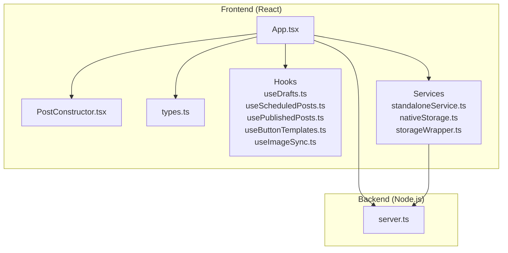
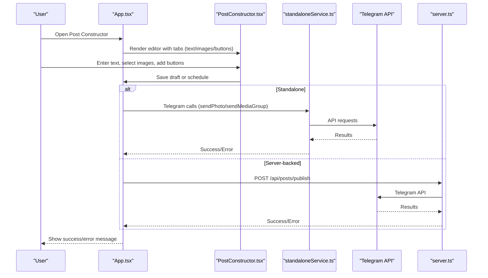
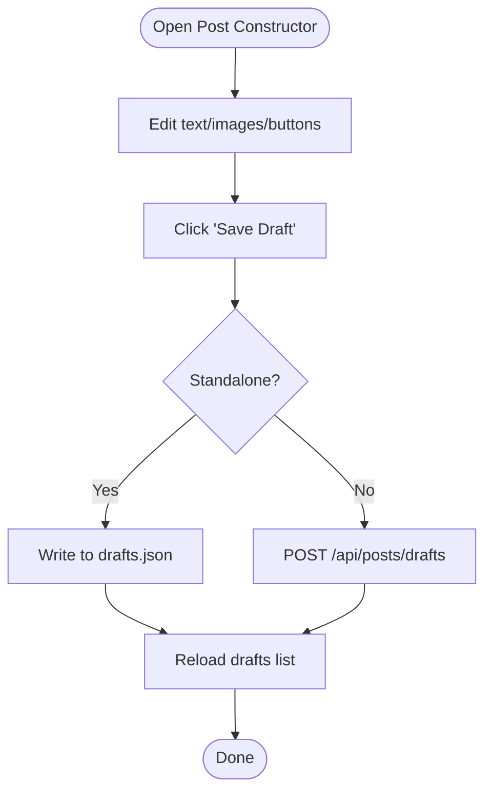
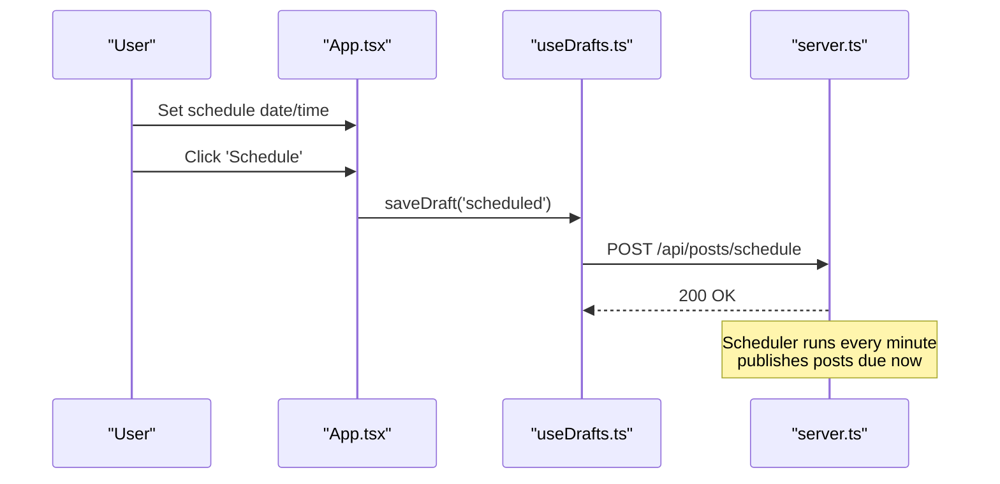
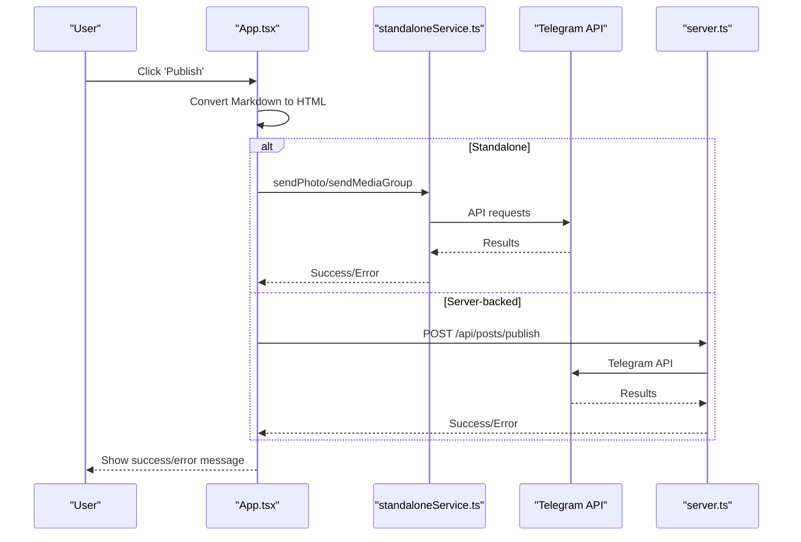
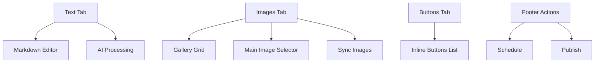
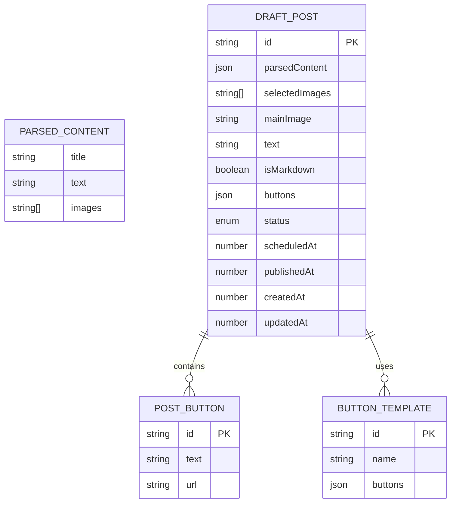
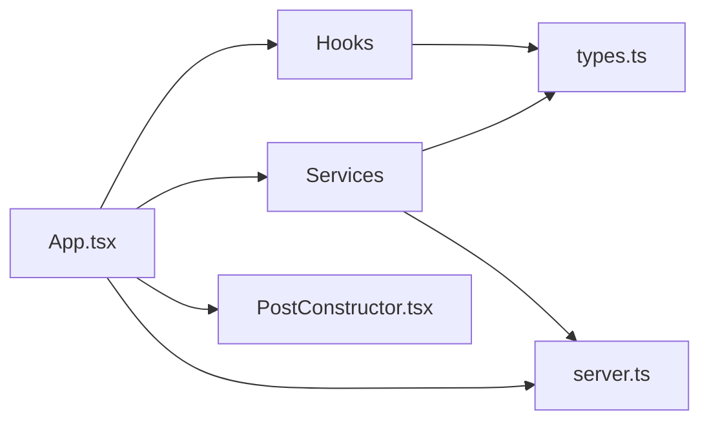

# Content Management System

<cite>
**Referenced Files in This Document**
- [PostConstructor.tsx](file://src/components/PostConstructor.tsx)
- [App.tsx](file://src/App.tsx)
- [types.ts](file://src/types.ts)
- [useDrafts.ts](file://src/hooks/useDrafts.ts)
- [useScheduledPosts.ts](file://src/hooks/useScheduledPosts.ts)
- [usePublishedPosts.ts](file://src/hooks/usePublishedPosts.ts)
- [useButtonTemplates.ts](file://src/hooks/useButtonTemplates.ts)
- [useImageSync.ts](file://src/hooks/useImageSync.ts)
- [standaloneService.ts](file://src/services/standaloneService.ts)
- [nativeStorage.ts](file://src/services/nativeStorage.ts)
- [storageWrapper.ts](file://src/services/storageWrapper.ts)
- [server.ts](file://server.ts)
</cite>

## Table of Contents
1. [Introduction](#introduction)
2. [Project Structure](#project-structure)
3. [Core Components](#core-components)
4. [Architecture Overview](#architecture-overview)
5. [Detailed Component Analysis](#detailed-component-analysis)
6. [Dependency Analysis](#dependency-analysis)
7. [Performance Considerations](#performance-considerations)
8. [Troubleshooting Guide](#troubleshooting-guide)
9. [Conclusion](#conclusion)

## Introduction
This document describes a comprehensive content management system designed for creating, organizing, scheduling, and publishing Telegram posts. It covers the draft management workflow, scheduling system, publishing pipeline, PostConstructor component, content formatting, and data models. The system supports both standalone operation (on-device) and server-backed operation with a Node.js/Express backend.

## Project Structure
The project is organized into:
- Frontend (React + TypeScript) under src/
- Backend (Node.js/Express) under server.ts
- Shared types and services
- Hooks for data management
- Native and web storage abstractions



**Diagram sources**
- [App.tsx:168-1888](file://src/App.tsx#L168-L1888)
- [PostConstructor.tsx:1-294](file://src/components/PostConstructor.tsx#L1-L294)
- [types.ts:1-48](file://src/types.ts#L1-L48)
- [useDrafts.ts:1-88](file://src/hooks/useDrafts.ts#L1-L88)
- [useScheduledPosts.ts:1-38](file://src/hooks/useScheduledPosts.ts#L1-L38)
- [usePublishedPosts.ts:1-38](file://src/hooks/usePublishedPosts.ts#L1-L38)
- [useButtonTemplates.ts:1-38](file://src/hooks/useButtonTemplates.ts#L1-L38)
- [useImageSync.ts:1-42](file://src/hooks/useImageSync.ts#L1-L42)
- [standaloneService.ts:1-175](file://src/services/standaloneService.ts#L1-L175)
- [nativeStorage.ts:1-63](file://src/services/nativeStorage.ts#L1-L63)
- [storageWrapper.ts:1-100](file://src/services/storageWrapper.ts#L1-L100)
- [server.ts:1-1454](file://server.ts#L1-L1454)

**Section sources**
- [App.tsx:168-1888](file://src/App.tsx#L168-L1888)
- [PostConstructor.tsx:1-294](file://src/components/PostConstructor.tsx#L1-L294)
- [types.ts:1-48](file://src/types.ts#L1-L48)
- [server.ts:1-1454](file://server.ts#L1-L1454)

## Core Components
- PostConstructor: The primary authoring UI for creating posts with Markdown editing, image gallery, and buttons.
- App: Orchestrates UI state, data fetching, publishing, and scheduling.
- Hooks: Encapsulate CRUD and list operations for drafts, scheduled posts, published posts, and button templates.
- Services: Provide Telegram API integration, AI processing, and storage abstraction.
- Types: Define data models for posts, buttons, templates, and scheduling.

**Section sources**
- [PostConstructor.tsx:50-94](file://src/components/PostConstructor.tsx#L50-L94)
- [App.tsx:307-322](file://src/App.tsx#L307-L322)
- [types.ts:13-26](file://src/types.ts#L13-L26)
- [standaloneService.ts:75-146](file://src/services/standaloneService.ts#L75-L146)

## Architecture Overview
The system supports two modes:
- Standalone: Uses Capacitor filesystem and preferences for storage; publishes directly via Telegram API.
- Server-backed: Communicates with Express backend for storage, scheduling, and publishing.



**Diagram sources**
- [App.tsx:905-975](file://src/App.tsx#L905-L975)
- [PostConstructor.tsx:268-292](file://src/components/PostConstructor.tsx#L268-L292)
- [standaloneService.ts:104-141](file://src/services/standaloneService.ts#L104-L141)
- [server.ts:1233-1241](file://server.ts#L1233-L1241)

## Detailed Component Analysis

### PostConstructor Component
The PostConstructor provides a three-tab interface:
- Text: Markdown editor with AI processing and character limit indicator.
- Images: Drag-and-drop gallery, main image selection, and local image sync.
- Buttons: Inline keyboard buttons with add/delete controls.

Key behaviors:
- AI processing via Gemini or server endpoint.
- Markdown-to-HTML conversion with spoiler support.
- Character limits enforced per Telegram constraints.
- Media group support for multiple images.
- Template and button template management.

```mermaid
classDiagram
class PostConstructor {
+isOpen : boolean
+onClose() : void
+isConstructorOpen : boolean
+setIsConstructorOpen(val) : void
+parsedContent : ParsedContent
+setParsedContent(action)
+aiProcessedText : string
+setAiProcessedText(val) : void
+selectedImages : string[]
+setSelectedImages(action)
+mainImage : string
+setMainImage(val) : void
+postButtons : PostButton[]
+setPostButtons(action)
+originalText : string
+setOriginalText(val) : void
+isProcessingAI : boolean
+processAI() : void
+showTemplates : boolean
+setShowTemplates(val) : void
+buttonTemplates : ButtonTemplate[]
+handleDeleteTemplate(id) : void
+saveButtonTemplate() : void
+templateName : string
+setTemplateName(val) : void
+imagePath : string
+setImagePath(val) : void
+openFolderBrowser(path) : void
+isBrowserLoading : boolean
+saveImagePath() : void
+handleFolderSelect(e) : void
+syncLocalImages(shouldSavePath, overridePath) : void
+isActionInProgress : boolean
+sensors : Sensors
+handleDragEnd(event) : void
+toggleImageSelection(img) : void
+scheduleDateTime : string
+setScheduleDateTime(val) : void
+saveDraft(type) : void
+handlePublish() : void
+submitMsg : {type,text}|null
+processedTextRef : Ref
}
```

**Diagram sources**
- [PostConstructor.tsx:50-94](file://src/components/PostConstructor.tsx#L50-L94)

**Section sources**
- [PostConstructor.tsx:110-292](file://src/components/PostConstructor.tsx#L110-L292)

### Draft Management Workflow
Drafts are persisted locally or remotely depending on mode:
- Standalone: JSON files via Capacitor filesystem or localStorage.
- Server-backed: REST endpoints for CRUD operations.



**Diagram sources**
- [App.tsx:874-903](file://src/App.tsx#L874-L903)
- [useDrafts.ts:31-54](file://src/hooks/useDrafts.ts#L31-L54)

**Section sources**
- [App.tsx:874-903](file://src/App.tsx#L874-L903)
- [useDrafts.ts:1-88](file://src/hooks/useDrafts.ts#L1-L88)

### Scheduling System
- Users set a datetime-local field to schedule publication.
- In server mode, the draft is posted to /api/posts/schedule.
- The backend runs a scheduler every minute to publish scheduled posts whose scheduledAt <= now.



**Diagram sources**
- [App.tsx:874-895](file://src/App.tsx#L874-L895)
- [server.ts:1420-1446](file://server.ts#L1420-L1446)

**Section sources**
- [App.tsx:874-903](file://src/App.tsx#L874-L903)
- [useScheduledPosts.ts:1-38](file://src/hooks/useScheduledPosts.ts#L1-L38)
- [server.ts:1218-1231](file://server.ts#L1218-L1231)

### Publishing Workflow
Two publishing paths:
- Standalone: Uses Telegram API directly via standaloneService.
- Server-backed: Sends POST /api/posts/publish to server, which publishes via Telegram.



**Diagram sources**
- [App.tsx:905-975](file://src/App.tsx#L905-L975)
- [standaloneService.ts:104-141](file://src/services/standaloneService.ts#L104-L141)
- [server.ts:1233-1241](file://server.ts#L1233-L1241)

**Section sources**
- [App.tsx:905-975](file://src/App.tsx#L905-L975)
- [standaloneService.ts:75-146](file://src/services/standaloneService.ts#L75-L146)
- [server.ts:806-934](file://server.ts#L806-L934)

### PostConstructor UI and Features
- Tabs: Text, Images, Buttons.
- AI block: Paste clipboard text, process via AI, insert spoiler toggle.
- Editor: Markdown editor with live preview and character counter.
- Images: Drag-and-drop reordering, main image selection, refresh from device or server.
- Buttons: Add/remove inline buttons with text and URL.
- Scheduling: datetime-local picker and 'Schedule' action.
- Publishing: 'Publish' with Telegram integration and media group support.



**Diagram sources**
- [PostConstructor.tsx:124-292](file://src/components/PostConstructor.tsx#L124-L292)

**Section sources**
- [PostConstructor.tsx:124-292](file://src/components/PostConstructor.tsx#L124-L292)

### Data Models and Storage Strategies
Core data models:
- PostButton: id, text, url
- ParsedContent: title, text, images[]
- DraftPost: id, parsedContent?, selectedImages[], mainImage?, text, isMarkdown?, buttons[], status, scheduledAt?, publishedAt?, createdAt, updatedAt
- ButtonTemplate: id, name, buttons[]
- ScheduledPost: extends DraftPost with scheduledAt and status='scheduled'

Storage:
- Standalone: Capacitor Filesystem and Preferences for JSON/text files and settings.
- Server-backed: REST endpoints for posts, templates, and configuration.



**Diagram sources**
- [types.ts:1-48](file://src/types.ts#L1-L48)

**Section sources**
- [types.ts:1-48](file://src/types.ts#L1-L48)
- [standaloneService.ts:11-72](file://src/services/standaloneService.ts#L11-L72)
- [nativeStorage.ts:8-62](file://src/services/nativeStorage.ts#L8-L62)
- [storageWrapper.ts:9-99](file://src/services/storageWrapper.ts#L9-L99)

### Content Formatting Options and Template System
- Markdown-to-HTML conversion with spoiler support (||text||).
- Telegram-safe HTML sanitization.
- Button templates: Save/load reusable button configurations.
- Template management endpoints on server.

**Section sources**
- [App.tsx:375-399](file://src/App.tsx#L375-L399)
- [App.tsx:1044-1075](file://src/App.tsx#L1044-L1075)
- [server.ts:1244-1266](file://server.ts#L1244-L1266)

## Dependency Analysis
High-level dependencies:
- App.tsx depends on hooks for data, services for Telegram/AI, and PostConstructor for UI.
- PostConstructor depends on App state and handlers.
- Hooks encapsulate storage logic and expose CRUD functions.
- Services abstract platform-specific storage and Telegram API calls.
- server.ts exposes REST endpoints for all CMS operations.



**Diagram sources**
- [App.tsx:168-1888](file://src/App.tsx#L168-L1888)
- [PostConstructor.tsx:1-294](file://src/components/PostConstructor.tsx#L1-L294)
- [types.ts:1-48](file://src/types.ts#L1-L48)
- [server.ts:936-1454](file://server.ts#L936-L1454)

**Section sources**
- [App.tsx:168-1888](file://src/App.tsx#L168-L1888)
- [PostConstructor.tsx:1-294](file://src/components/PostConstructor.tsx#L1-L294)
- [server.ts:936-1454](file://server.ts#L936-L1454)

## Performance Considerations
- Image handling: Limit selections to 9 images and enforce size checks to avoid Telegram limits.
- Rate limiting: AI and mutation endpoints include rate limits on the server.
- Auto-save: Debounced saving of drafts when the constructor closes to reduce writes.
- Media groups: Batch images in chunks of 10 for sendMediaGroup to respect API constraints.
- Rendering: Conditional rendering of tabs and galleries to minimize DOM overhead.

[No sources needed since this section provides general guidance]

## Troubleshooting Guide
Common issues and remedies:
- Telegram API errors: Verify bot token and chat ID; test connection via UI.
- AI quota exceeded: Switch provider or wait; server returns retry hints.
- CORS/URL issues: Ensure correct server URL and Cloud Run deployment for mobile clients.
- Storage permission errors (Android): Grant public storage permission for image sync.
- Scheduled posts not publishing: Check server logs and scheduler interval.

**Section sources**
- [App.tsx:1236-1259](file://src/App.tsx#L1236-L1259)
- [server.ts:52-72](file://server.ts#L52-L72)
- [server.ts:1420-1446](file://server.ts#L1420-L1446)

## Conclusion
The content management system provides a robust, dual-mode solution for creating, organizing, scheduling, and publishing Telegram posts. Its modular architecture separates UI, data, and platform concerns, enabling both standalone and server-backed deployments. The PostConstructor offers a streamlined authoring experience with AI assistance, media handling, and template support, while hooks and services ensure reliable persistence and integration.