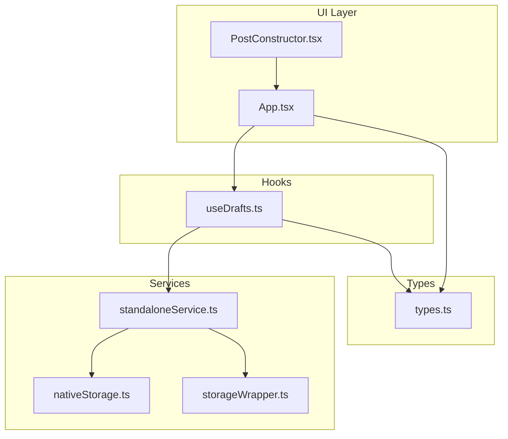
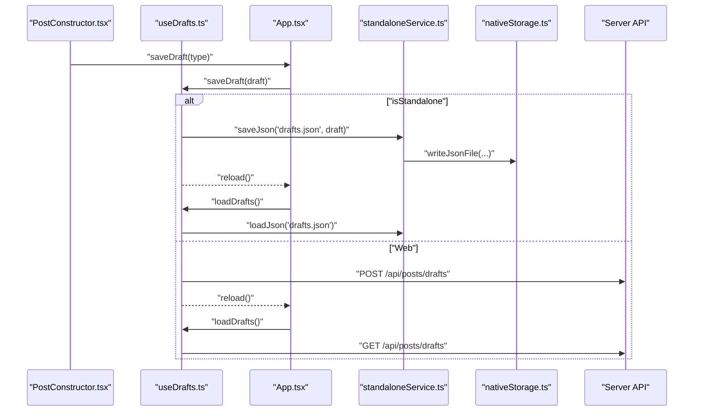
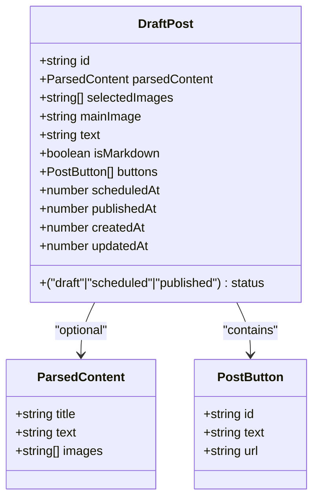
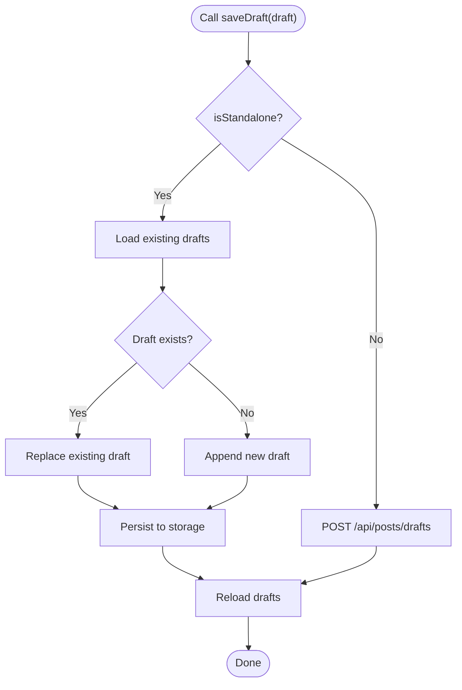
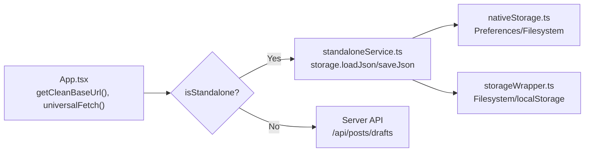
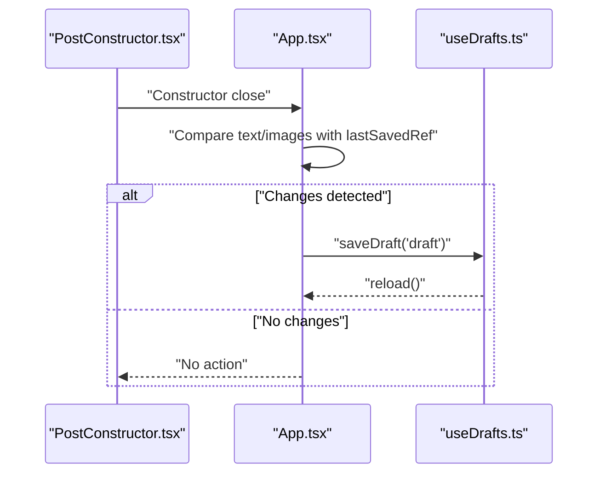
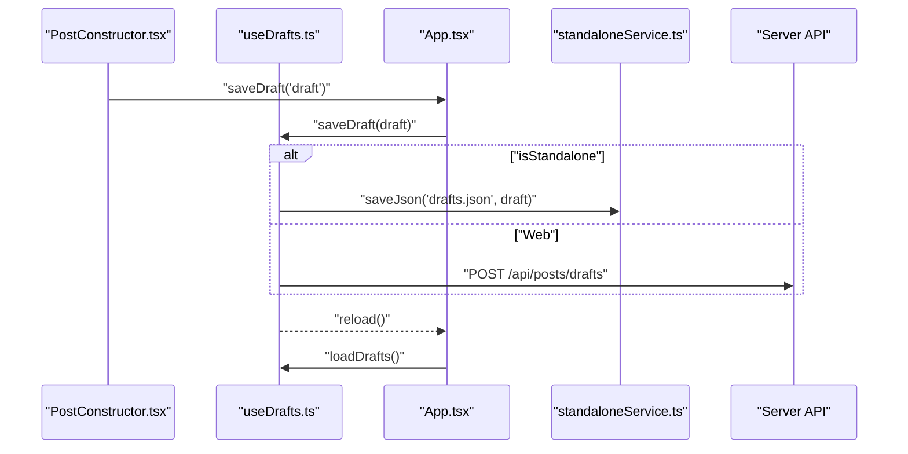
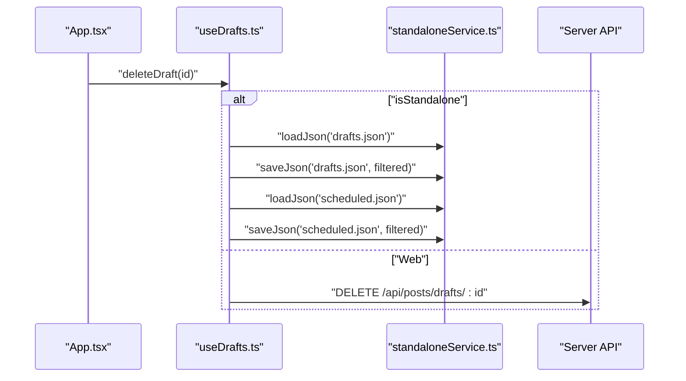
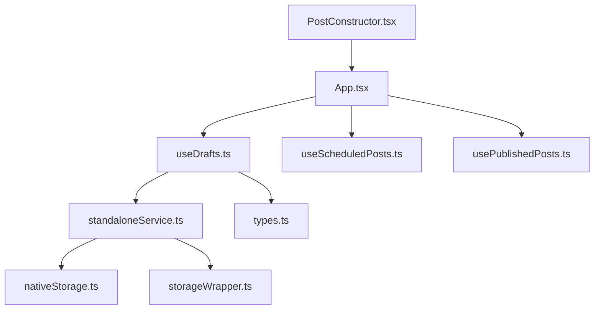

# Draft Management

<cite>
**Referenced Files in This Document**
- [useDrafts.ts](file://src/hooks/useDrafts.ts)
- [types.ts](file://src/types.ts)
- [standaloneService.ts](file://src/services/standaloneService.ts)
- [nativeStorage.ts](file://src/services/nativeStorage.ts)
- [storageWrapper.ts](file://src/services/storageWrapper.ts)
- [PostConstructor.tsx](file://src/components/PostConstructor.tsx)
- [App.tsx](file://src/App.tsx)
</cite>

## Table of Contents
1. [Introduction](#introduction)
2. [Project Structure](#project-structure)
3. [Core Components](#core-components)
4. [Architecture Overview](#architecture-overview)
5. [Detailed Component Analysis](#detailed-component-analysis)
6. [Dependency Analysis](#dependency-analysis)
7. [Performance Considerations](#performance-considerations)
8. [Troubleshooting Guide](#troubleshooting-guide)
9. [Conclusion](#conclusion)

## Introduction
This document describes the draft management system for the application, covering the complete lifecycle of drafts: creation, editing, auto-save, and deletion. It explains the dual-mode operation supporting standalone (native/mobile) and web environments, detailing local storage versus server-side persistence. It documents the DraftPost data structure, draft organization patterns, and the useDrafts custom hook implementation. Practical examples illustrate CRUD operations, error handling strategies, and cross-platform data synchronization. Finally, it clarifies the relationship between drafts, scheduled posts, and publishing workflows.

## Project Structure
The draft management system spans hooks, services, components, and shared types:
- Hook: useDrafts orchestrates draft CRUD and loading
- Services: standaloneService and nativeStorage provide persistence
- Types: DraftPost defines the data contract
- Component: PostConstructor renders the editor and triggers saves
- App: coordinates dual-mode behavior and integrates hooks

**Diagram sources**
- [PostConstructor.tsx:1-294](file://src/components/PostConstructor.tsx#L1-L294)
- [App.tsx:168-1888](file://src/App.tsx#L168-L1888)
- [useDrafts.ts:1-88](file://src/hooks/useDrafts.ts#L1-L88)
- [standaloneService.ts:1-175](file://src/services/standaloneService.ts#L1-L175)
- [nativeStorage.ts:1-63](file://src/services/nativeStorage.ts#L1-L63)
- [storageWrapper.ts:1-100](file://src/services/storageWrapper.ts#L1-L100)
- [types.ts:1-48](file://src/types.ts#L1-L48)

**Section sources**
- [useDrafts.ts:1-88](file://src/hooks/useDrafts.ts#L1-L88)
- [standaloneService.ts:1-175](file://src/services/standaloneService.ts#L1-L175)
- [nativeStorage.ts:1-63](file://src/services/nativeStorage.ts#L1-L63)
- [storageWrapper.ts:1-100](file://src/services/storageWrapper.ts#L1-L100)
- [types.ts:1-48](file://src/types.ts#L1-L48)
- [PostConstructor.tsx:1-294](file://src/components/PostConstructor.tsx#L1-L294)
- [App.tsx:168-1888](file://src/App.tsx#L168-L1888)

## Core Components
- useDrafts: Central hook managing draft state, loading, saving, and deletion across standalone and web modes
- DraftPost: Typed structure for draft records, including content, images, buttons, scheduling, and timestamps
- standaloneService.storage: Unified persistence for standalone mode (filesystem/localStorage)
- nativeStorage: Capacitor-backed storage abstraction for native vs web
- storageWrapper: Generic file read/write helpers for cross-environment compatibility
- PostConstructor: Editor UI that triggers auto-save and manual save actions
- App: Orchestrates dual-mode behavior, URL normalization, and integration with hooks

**Section sources**
- [useDrafts.ts:1-88](file://src/hooks/useDrafts.ts#L1-L88)
- [types.ts:13-26](file://src/types.ts#L13-L26)
- [standaloneService.ts:11-72](file://src/services/standaloneService.ts#L11-L72)
- [nativeStorage.ts:8-62](file://src/services/nativeStorage.ts#L8-L62)
- [storageWrapper.ts:9-98](file://src/services/storageWrapper.ts#L9-L98)
- [PostConstructor.tsx:88-90](file://src/components/PostConstructor.tsx#L88-L90)
- [App.tsx:168-1888](file://src/App.tsx#L168-L1888)

## Architecture Overview
The system supports two operational modes:
- Standalone (native/mobile): Uses filesystem/localStorage via standaloneService and nativeStorage
- Web: Uses universalFetch to communicate with server endpoints for drafts and related operations

**Diagram sources**
- [PostConstructor.tsx:275-279](file://src/components/PostConstructor.tsx#L275-L279)
- [App.tsx:873-900](file://src/App.tsx#L873-L900)
- [useDrafts.ts:31-54](file://src/hooks/useDrafts.ts#L31-L54)
- [standaloneService.ts:25-54](file://src/services/standaloneService.ts#L25-L54)
- [nativeStorage.ts:34-46](file://src/services/nativeStorage.ts#L34-L46)

## Detailed Component Analysis

### DraftPost Data Structure
DraftPost defines the canonical shape of a draft record, including:
- Identification and timestamps
- Content and media selections
- Buttons and markdown flag
- Status and scheduling fields
- Published timestamps

**Diagram sources**
- [types.ts:13-26](file://src/types.ts#L13-L26)
- [types.ts:7-11](file://src/types.ts#L7-L11)
- [types.ts:1-5](file://src/types.ts#L1-L5)

**Section sources**
- [types.ts:13-26](file://src/types.ts#L13-L26)

### useDrafts Hook Implementation
Responsibilities:
- Load drafts on mount or demand
- Save drafts (create/update) with idempotent behavior
- Delete drafts and keep related scheduled entries in sync (standalone)
- Toggle loading state and propagate errors

Behavior highlights:
- Standalone: reads/writes JSON files under dedicated directories
- Web: calls server endpoints for drafts list, create/update, and delete
- Auto-reload after mutations to keep UI in sync

**Diagram sources**
- [useDrafts.ts:31-54](file://src/hooks/useDrafts.ts#L31-L54)

**Section sources**
- [useDrafts.ts:1-88](file://src/hooks/useDrafts.ts#L1-L88)

### Dual-Mode Operation: Standalone vs Web
- Standalone:
  - Uses standaloneService.storage for JSON persistence
  - Uses nativeStorage for preferences and token/chat ID
  - Uses storageWrapper for generic file operations
- Web:
  - Uses universalFetch to call server endpoints
  - Requires a clean base URL derived from user input
  - Supports SSE polling fallback on native WebView

**Diagram sources**
- [App.tsx:194-251](file://src/App.tsx#L194-L251)
- [App.tsx:254-265](file://src/App.tsx#L254-L265)
- [standaloneService.ts:11-72](file://src/services/standaloneService.ts#L11-L72)
- [nativeStorage.ts:8-62](file://src/services/nativeStorage.ts#L8-L62)
- [storageWrapper.ts:9-98](file://src/services/storageWrapper.ts#L9-L98)

**Section sources**
- [App.tsx:194-265](file://src/App.tsx#L194-L265)
- [standaloneService.ts:11-72](file://src/services/standaloneService.ts#L11-L72)
- [nativeStorage.ts:8-62](file://src/services/nativeStorage.ts#L8-L62)
- [storageWrapper.ts:9-98](file://src/services/storageWrapper.ts#L9-L98)

### Auto-Save Functionality
Auto-save triggers when the editor closes and detects content changes:
- Compares current text and selected images against last saved snapshot
- Saves a draft automatically if changes are detected
- Updates the last saved snapshot upon completion

**Diagram sources**
- [PostConstructor.tsx:275-279](file://src/components/PostConstructor.tsx#L275-L279)
- [App.tsx:752-770](file://src/App.tsx#L752-L770)
- [useDrafts.ts:31-54](file://src/hooks/useDrafts.ts#L31-L54)

**Section sources**
- [App.tsx:752-770](file://src/App.tsx#L752-L770)
- [PostConstructor.tsx:275-279](file://src/components/PostConstructor.tsx#L275-L279)

### Draft CRUD Operations
- Create/Update:
  - Standalone: append or replace draft in drafts.json
  - Web: POST to /api/posts/drafts with the draft payload
- Read:
  - Standalone: load drafts.json
  - Web: GET /api/posts/drafts
- Delete:
  - Standalone: remove from drafts.json and also remove matching entries from scheduled.json
  - Web: DELETE /api/posts/drafts/:id

**Diagram sources**
- [PostConstructor.tsx:275-279](file://src/components/PostConstructor.tsx#L275-L279)
- [useDrafts.ts:31-54](file://src/hooks/useDrafts.ts#L31-L54)
- [useDrafts.ts:9-29](file://src/hooks/useDrafts.ts#L9-L29)

**Section sources**
- [useDrafts.ts:9-73](file://src/hooks/useDrafts.ts#L9-L73)
- [App.tsx:1022-1027](file://src/App.tsx#L1022-L1027)

### Draft Organization Patterns
- Drafts are stored as arrays of DraftPost
- Each draft has a unique id enabling upsert semantics
- Status field distinguishes drafts from scheduled/published states
- Timestamps track creation and updates
- SelectedImages and mainImage capture media selections

**Section sources**
- [types.ts:13-26](file://src/types.ts#L13-L26)

### Relationship with Scheduled Posts and Publishing Workflows
- Deleting a draft also removes any corresponding scheduled entries in standalone mode
- Publishing flow:
  - Standalone: sends messages via Telegram API and moves to published storage
  - Web: POST to /api/posts/publish and refreshes published list
- Scheduled posts are managed by a separate hook and persisted similarly to drafts

**Diagram sources**
- [useDrafts.ts:56-73](file://src/hooks/useDrafts.ts#L56-L73)
- [App.tsx:1022-1027](file://src/App.tsx#L1022-L1027)

**Section sources**
- [useDrafts.ts:56-73](file://src/hooks/useDrafts.ts#L56-L73)
- [App.tsx:1000-1020](file://src/App.tsx#L1000-L1020)

## Dependency Analysis
- useDrafts depends on:
  - standaloneService.storage for persistence
  - types.DraftPost for data typing
  - App-provided getCleanBaseUrl and universalFetch for web mode
- standaloneService.storage depends on:
  - nativeStorage for preferences
  - storageWrapper for filesystem operations
- PostConstructor depends on:
  - App state and callbacks to trigger save and publish
- App integrates:
  - useDrafts, useScheduledPosts, usePublishedPosts
  - universalFetch and URL normalization

**Diagram sources**
- [useDrafts.ts:1-88](file://src/hooks/useDrafts.ts#L1-L88)
- [standaloneService.ts:1-175](file://src/services/standaloneService.ts#L1-L175)
- [nativeStorage.ts:1-63](file://src/services/nativeStorage.ts#L1-L63)
- [storageWrapper.ts:1-100](file://src/services/storageWrapper.ts#L1-L100)
- [PostConstructor.tsx:1-294](file://src/components/PostConstructor.tsx#L1-L294)
- [App.tsx:168-1888](file://src/App.tsx#L168-L1888)

**Section sources**
- [useDrafts.ts:1-88](file://src/hooks/useDrafts.ts#L1-L88)
- [standaloneService.ts:1-175](file://src/services/standaloneService.ts#L1-L175)
- [nativeStorage.ts:1-63](file://src/services/nativeStorage.ts#L1-L63)
- [storageWrapper.ts:1-100](file://src/services/storageWrapper.ts#L1-L100)
- [PostConstructor.tsx:1-294](file://src/components/PostConstructor.tsx#L1-L294)
- [App.tsx:168-1888](file://src/App.tsx#L168-L1888)

## Performance Considerations
- Minimize redundant writes by checking for changes before auto-saving
- Batch UI updates when syncing images to avoid excessive re-renders
- Use debounced auto-save to avoid frequent network calls in web mode
- Prefer local filesystem operations in standalone mode for lower latency
- Limit image array sizes to reduce payload and memory usage

## Troubleshooting Guide
Common issues and strategies:
- Invalid or malformed base URL:
  - Validation occurs in getCleanBaseUrl; ensure protocol and host are present
- Network timeouts or failures:
  - universalFetch sets explicit timeouts and throws descriptive errors
- Standalone permission denied:
  - nativeStorage ensures data directory exists; request filesystem permissions on native
- Draft deletion did not remove scheduled items:
  - Confirm standalone mode; scheduled cleanup is automatic in standalone only
- Auto-save not triggering:
  - Verify constructor close effect and change detection logic

**Section sources**
- [App.tsx:194-251](file://src/App.tsx#L194-L251)
- [App.tsx:254-265](file://src/App.tsx#L254-L265)
- [nativeStorage.ts:9-14](file://src/services/nativeStorage.ts#L9-L14)
- [useDrafts.ts:56-73](file://src/hooks/useDrafts.ts#L56-L73)
- [App.tsx:752-770](file://src/App.tsx#L752-L770)

## Conclusion
The draft management system provides a robust, dual-mode solution for creating, editing, auto-saving, and deleting drafts. It cleanly separates concerns between UI, hooks, and services, ensuring consistent behavior across standalone and web environments. The DraftPost structure and useDrafts hook enable predictable CRUD operations, while integration with scheduled posts and publishing workflows completes the content lifecycle.